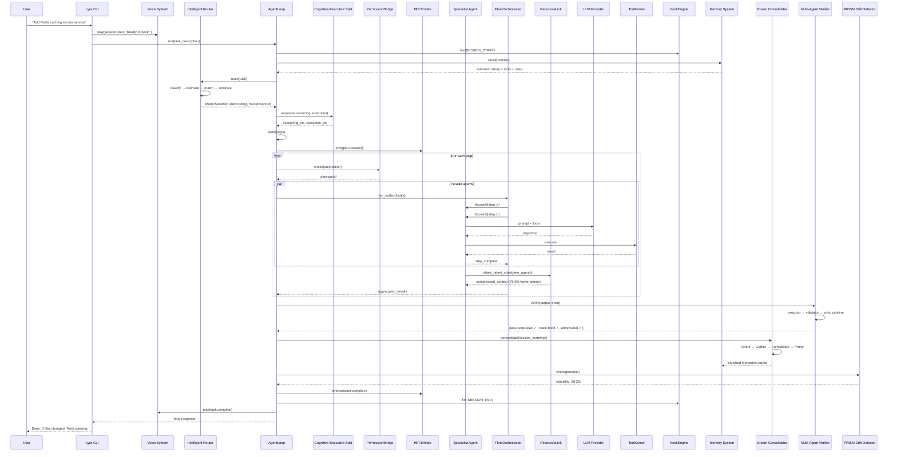
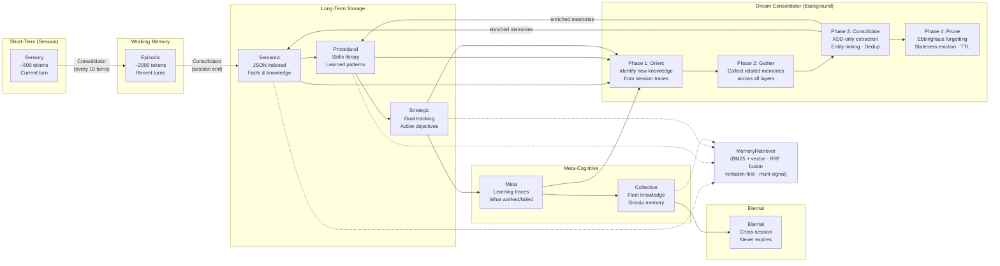
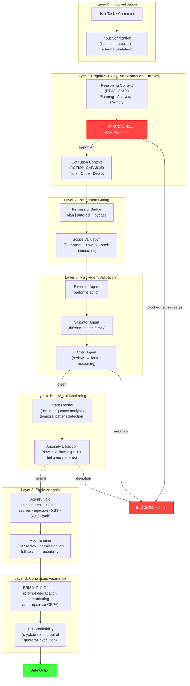
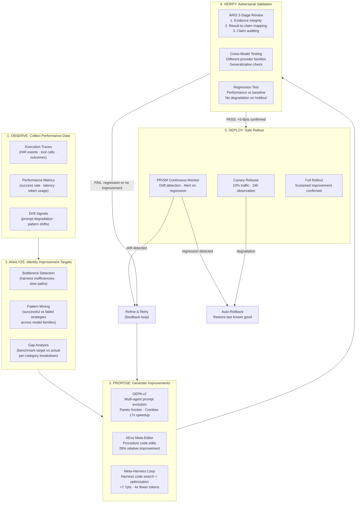
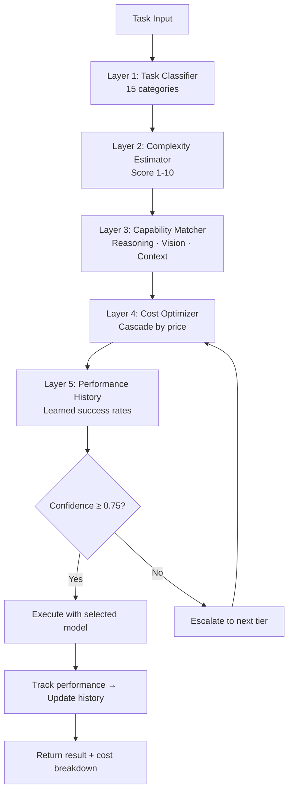
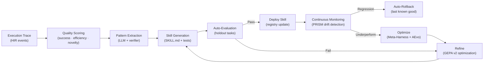
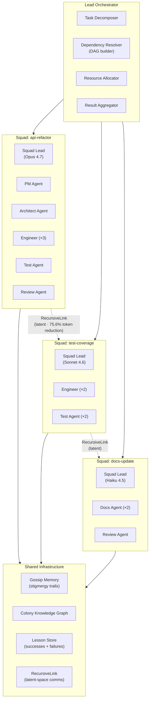
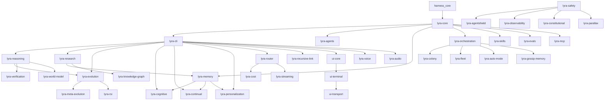

# Architecture

> The canonical architecture reference is in [`docs/architecture/`](docs/architecture/). This document provides a high-level overview with diagrams.

## System Topology (Current)

```mermaid
graph TB
    subgraph Entry["Entry Points"]
        CLI["lyra CLI<br/>(Typer + prompt_toolkit)"]
        TUI["Terminal UI<br/>(Ink/React 19)"]
        ACP["ACP Server<br/>(Agent Client Protocol)"]
        Voice["Voice System<br/>(CESP v1.0 · 6-layer packs)"]
    end

    subgraph Kernel["Kernel (lyra-core)"]
        Loop["AgentLoop<br/>plan → execute → verify"]
        SM["TDD State Machine<br/>IDLE → PLAN → RED → GREEN → REFACTOR → SHIP"]
        PB["PermissionBridge<br/>plan | auto-edit | bypass"]
        HIR["HIR Emitter<br/>(JSONL event stream)"]
        LC["LifecycleBus<br/>(fan-out: chat, tool, plan, subagent, cron)"]
        AR["AliasRegistry<br/>(model name resolution)"]
        PR["Pivot/Refine Loop<br/>(failure analysis → alternative → retry)"]
    end

    subgraph Tools["Tool Kernel (200+ planned)"]
        TK["ToolKernel"]
        FS["Filesystem<br/>Read · Write · Edit · Glob · Grep"]
        CODE["Code<br/>LSP · Analyze · Format · Typecheck"]
        WEB["Web<br/>Fetch · Search · Browser"]
        DB["Database<br/>Query · Schema · Migrate"]
        TS["Tool Search<br/>(deferred schema · semantic match)"]
    end

    subgraph Agents["Agent System"]
        PA["PrimaryAgent<br/>(orchestrator)"]
        CA["CodeAgent"]
        TA["TestAgent"]
        RA["ReviewAgent"]
        RHA["ResearchAgent"]
        UR["UnifiedRegistry<br/>(multi-index dispatch)"]
    end

    subgraph Fleet["Agent Fleet"]
        FO["FleetOrchestrator<br/>(fan-out, squads, DAG)"]
        SL["SquadLead<br/>(PM · Architect · Engineer · QA)"]
        RM["RecursiveLink<br/>(latent-space comms · 75.6% token reduction)"]
    end

    subgraph Memory["Memory System (8-Level + Dream)"]
        STM["Short-Term<br/>(deque, 10-turn)"]
        WM["Working Memory<br/>(episodic, 2K tokens)"]
        LTM["Long-Term<br/>(semantic, JSON indexed)"]
        PM_L["Procedural<br/>(skills library)"]
        MM_L["Meta Memory<br/>(learning traces)"]
        CM_L["Collective<br/>(fleet knowledge)"]
        EM_L["Eternal<br/>(cross-session)"]
        MR["MemoryRetriever<br/>(hybrid BM25+vector)"]
        MC["MemoryConsolidator<br/>(STM → LTM, pattern extraction)"]
        DREAM["Dream Consolidator<br/>(Orient→Gather→Consolidate→Prune)"]
    end

    subgraph Router["Intelligent Router (5-Layer)"]
        L1["Task Classifier<br/>(15 categories)"]
        L2["Complexity Estimator<br/>(1-10 scale)"]
        L3["Capability Matcher<br/>(model features)"]
        L4["Cost Optimizer<br/>(cascade chains)"]
        L5["Performance History<br/>(learned routing)"]
    end

    subgraph Evolution["Self-Evolution"]
        GEPA["GEPA v2 Optimizer<br/>(multi-agent prompt evolution)"]
        MOSS["Meta-Harness<br/>(harness code optimization)"]
        AEvo_L["AEvo Meta-Editor<br/>(procedure evolution)"]
        T2S["Trace2Skill<br/>(auto-skill extraction)"]
        ARIS_L["ARIS<br/>(cross-model adversarial review)"]
        PRISM["PRISM Drift Detector<br/>(prompt reliability · auto-repair)"]
    end

    subgraph Safety["Safety & Observability (6-Layer)"]
        CES["Cognitive-Executive Split<br/>(Parallax · 98.9% block)"]
        AS["AgentShield<br/>(5 scanners · 102 rules)"]
        TO["TokenObservatory<br/>(13 categories · 7 wastes)"]
        MAV["Multi-Agent Verifier<br/>(executor→validator→critic)"]
        IM["Intent Monitor<br/>(behavioral anomaly detection)"]
        AE["Audit Engine<br/>(HIR replay)"]
    end

    subgraph Skills["Skills Ecosystem (80+ planned)"]
        SR["SkillRegistry<br/>(150+ triggers)"]
        SC["SkillCurator<br/>(discovery · recommendation)"]
        SL_L["SkillLearner<br/>(Trace2Skill pipeline)"]
        SE["SkillEvolver<br/>(auto-optimization)"]
        SAC["SkillAutoCompaction<br/>(per-section tracking · merge · archive)"]
    end

    subgraph Autonomous["Autonomous Systems"]
        GS["Goal System<br/>(progress tracking)"]
        CM_L2["Continuous Mode<br/>(auto-loop)"]
        SCH["Scheduler<br/>(cron + events)"]
        HK["HookEngine<br/>(27+ events)"]
        CK["Checkpoint System<br/>(snapshot · rewind · 30-day retention)"]
    end

    subgraph Providers["16+ LLM Providers"]
        Anthro["Anthropic<br/>Opus · Sonnet · Haiku"]
        DS["DeepSeek<br/>V4 Pro · Flash"]
        OAI["OpenAI<br/>GPT-4o · O3"]
        Gemini["Google<br/>Gemini 2.5/3.1"]
        Others["xAI · Mistral · Qwen<br/>Kimi · Bedrock · Ollama"]
    end

    CLI & TUI & ACP & Voice --> Loop
    Loop --> SM & PB & HIR & PR
    HIR --> LC
    Loop --> TK
    TK --> FS & CODE & WEB & DB & TS
    Loop --> PA
    PA --> CA & TA & RA & RHA
    PA --> UR
    PA --> FO --> SL
    FO --> RM
    Loop --> STM --> WM --> LTM
    STM --> MC --> LTM
    LTM --> DREAM
    DREAM -->|"enriched"| LTM & PM_L
    LTM --> PM_L & MM_L
    PM_L --> CM_L --> EM_L
    LTM --> MR
    Loop --> L1 --> L2 --> L3 --> L4 --> L5
    Loop --> GEPA --> MOSS
    MOSS --> AEvo_L
    GEPA --> T2S
    AEvo_L & MOSS --> ARIS_L
    GEPA --> PRISM
    Loop --> CES & AS & TO & MAV & IM & AE
    Loop --> SR --> SC & SL_L & SE & SAC
    Loop --> GS & CM_L2 & SCH & HK & CK
    FO & PA & Loop --> Anthro & DS & OAI & Gemini & Others
```

## Data Flow

## Memory Hierarchy (with Dream Consolidation)

## Safety Architecture (6-Layer Parallax-Style)

## Self-Evolving Harness Pipeline

## Intelligent Router Flow

## Evolution Pipeline

## Fleet Topology

## Layer Architecture

## Package Dependency Graph (Expanded)

## Architectural Commitments (Updated — 13 Total)

1. **Plan Mode** — All work is plan-gated. The agent proposes, the user approves, then execution proceeds.
2. **Multi-Agent Topology** — PrimaryAgent orchestrates; specialist agents execute; fleet orchestrator scales; multi-agent verifier validates.
3. **PermissionBridge** — Three modes (plan/auto-edit/bypass) with per-tool granularity and audit logging.
4. **TDD Gate** — The RED→GREEN→REFACTOR cycle is enforced by a PreToolUse hook with numeric reward signal (KnowRL).
5. **8-Level Memory + Dream Consolidation** — Sensory → Episodic → Semantic → Procedural → Strategic → Meta → Collective → Eternal. 4-phase Dream consolidation (Orient→Gather→Consolidate→Prune) with ADD-only extraction and Ebbinghaus forgetting. Hybrid BM25+vector retrieval with RRF fusion.
6. **Cognitive-Executive Separation** — Reasoning and execution run in structurally separated contexts (Parallax architecture). 98.9% adversarial block rate. Independent verification agent reviews all execution plans.
7. **Skill Library** — SKILL.md files with YAML frontmatter, trigger patterns, progressive disclosure (L1→L2→L3 loading), Trace2Skill auto-extraction, and per-section auto-compaction.
8. **Subagents in Worktrees** — Each subagent runs in an isolated git worktree with its own filesystem view.
9. **Multi-Agent Verifier** — Executor → Validator → Critic pipeline. Validator from different model family. 3-stage ARIS adversarial review (evidence integrity → result-to-claim → claim auditing).
10. **HIR Traces** — Every event (tool call, LLM request, plan change) emitted as JSONL to `.lyra/sessions/`. Replayable and auditable.
11. **5-Layer Intelligent Router** — Task classification → Complexity estimation → Capability matching → Cost optimization → Performance history. Confidence-thresholded escalation.
12. **Self-Evolving Harness** — GEPA v2 prompt optimization → Meta-Harness code optimization → AEvo procedure editing → ARIS adversarial review → PRISM drift detection. The harness observes, analyzes, proposes, verifies, and deploys improvements to itself.
13. **Progressive Tool Discovery** — Deferred tool schema loading with semantic tool search. 85% context savings. Auto-pruning based on task relevance.

## Key Design Decisions

| Decision | Rationale | Trade-off |
|----------|-----------|-----------|
| Kernel separate from CLI | `lyra-core` has zero network deps — reusable by MCP, evals, CI, SDK | Two packages to version |
| Monorepo with 135+ packages | Each package has isolated deps, tests, and lifecycle | Build orchestration complexity |
| prompt_toolkit over Textual | Faster startup, better stdin/stdout compatibility, closer to Claude Code UX | Less rich TUI out of the box |
| Optional Ink/React 19 TUI | React component model for complex UI (model picker, fleet panel, theme picker) | Requires Node.js runtime |
| HIR JSONL as source of truth | All observability flows from one event stream | ~1MB/hour disk usage |
| 8-level memory hierarchy | Mimics cognitive architecture: STM→WM→LTM with consolidation | Consolidation heuristics need tuning |
| Dream 4-phase consolidation | ADD-only extraction prevents overwrite; Ebbinghaus forgetting mimics human memory | Background processing adds ~2s latency per session |
| Hybrid BM25+vector retrieval | RRF fusion of keyword and semantic search; 96.6% R@5 without LLM | Slightly higher storage footprint |
| 5-layer intelligent router | Confidence-thresholded escalation prevents over-spending on simple tasks | Adds ~50ms routing latency |
| Cognitive-executive separation | Structural barrier prevents compromised reasoning from executing dangerous actions. 98.9% block rate | ~100ms latency for execution gate validation |
| RecursiveLink latent comms | 75.6% token reduction for inter-agent communication | Requires training/fine-tuning the RecursiveLink module |
| Meta-Harness self-optimization | Outer-loop harness code optimization yields +7.7pts with 4x fewer tokens | Risk of overfitting to benchmarks; mitigated by cross-model testing |
| Trace2Skill auto-extraction | Automatic skill creation from successful execution traces | Requires quality threshold to avoid noise |
| Regex-based security scanning | Fast, no external deps, catches 90% of common issues | Misses obfuscated patterns |
| PRISM drift detection | Daily automated prompt reliability monitoring with auto-repair | Requires baseline calibration per prompt |

## Innovation Lineage

Each Lyra innovation traces to its research source. See [`docs/research/papers.md`](docs/research/papers.md) for the complete absorption matrix.

| Innovation | Primary Source | Implementation |
|------------|---------------|----------------|
| Tournament TTS | [Scaling Test-Time Compute (Meta, 2026)](https://arxiv.org/abs/2604.16529) | `lyra_core/tts/tournament.py` |
| SR2AM Planning | [SR2AM (2026)](https://arxiv.org/abs/2605.22138) | `lyra_reasoning/sr2am/` |
| ReasoningBank | [ReasoningBank (Google, 2025)](https://arxiv.org/abs/2509.25140) | `lyra_core/memory/reasoning_bank.py` |
| Pivot/Refine Loop | [AutoResearchClaw (2026)](https://arxiv.org/abs/2605.20025) | `lyra_core/loop/pivot_refine.py` |
| Skill-RAG Recovery | [Skill-RAG (UMich, 2026)](https://arxiv.org/abs/2604.15771) | `lyra_core/retrieval/skill_rag.py` |
| TDD Reward Gate | [KnowRL (ZJU, 2025)](https://arxiv.org/abs/2506.19807) | `lyra_core/verifier/tdd_reward.py` |
| Neural GC Compaction | [NGC (Stanford, 2026)](https://arxiv.org/abs/2604.18002) | `lyra_core/context/compactor.py` |
| Tool-Call Verification | [Knowing-Doing Gap (2026)](https://arxiv.org/abs/2605.14038) | `lyra_core/verifier/tool_audit.py` |
| Cascade Router | [FrugalGPT (Stanford, 2023)](https://arxiv.org/abs/2305.05176) | `lyra_core/routing/cascade.py` |
| Confidence Escalation | [RouteLLM (Berkeley, 2024)](https://arxiv.org/abs/2406.18665) | `lyra_core/routing/cascade.py` |
| SOP Role Topology | [MetaGPT (ICLR 2024)](https://arxiv.org/abs/2308.00352) | `lyra_core/teams/` |
| Reflexion Loop | [Reflexion (NeurIPS 2023)](https://arxiv.org/abs/2303.11366) | `lyra_core/loop/reflexion.py` |
| Skill Library | [Voyager (TMLR 2024)](https://arxiv.org/abs/2305.16291) | `lyra_core/memory/procedural.py` |
| GEPA v2 Optimizer | [GEPA (ICLR 2026 Oral)](https://arxiv.org/abs/2310.03714) | `lyra_evolution/gepa_v2.py` |
| PRM Verifier | [Qwen PRM (2025)](https://arxiv.org/abs/2501.07301) | `lyra_core/verifier/prm.py` |
| DAG Teams | [SemaClaw (Midea, 2026)](https://arxiv.org/abs/2604.11548) | `lyra_core/adapters/dag_teams.py` |
| AutoResearchClaw | [AutoResearchClaw (2026)](https://arxiv.org/abs/2605.20025) | `lyra_research/` |
| RecursiveLink | [RecursiveMAS (2026)](https://arxiv.org/abs/2604.25917) | `lyra_recursive_link/` |
| Meta-Harness | [Meta-Harness (2026)](https://arxiv.org/abs/2603.28052) | `lyra_meta_evolution/harness_opt.py` |
| AEvo Meta-Editing | [AEvo (2026)](https://arxiv.org/abs/2605.13821) | `lyra_meta_evolution/aevo_meta.py` |
| ARIS Adversarial Review | [ARIS (2026)](https://arxiv.org/abs/2605.03042) | `lyra_verification/adversarial.py` |
| PRISM Drift Detection | [PRISM (2026)](https://arxiv.org/abs/2605.14454) | `lyra_evolution/drift_detector.py` |
| Cognitive-Executive Split | [Parallax (2026)](https://arxiv.org/abs/2604.12986) | `lyra_safety/parallax.py` |
| Symbolic STM | [TencentDB-Agent-Memory](https://github.com/Tencent/TencentDB-Agent-Memory) | `lyra_memory/symbolic_stm.py` |
| Progressive Disclosure | [claude-mem](https://github.com/thedotmack/claude-mem) | Memory + Skills retrieval |
| Dream Consolidation | Claude Code, [Mem0](https://github.com/mem0ai/mem0) | `lyra_memory/dream_consolidator.py` |
| Pre-Indexed KG | [CodeGraph](https://github.com/colbymchenry/codegraph) | `lyra_knowledge_graph/` |
| DCI Zero-Index | [DCI-Agent-Lite](https://github.com/DCI-Agent/DCI-Agent-Lite) | `lyra_research/zero_index.py` |
| Verbatim-First Retrieval | [MemPalace](https://github.com/MemPalace/mempalace) | Memory retrieval strategy |
| Skills as Memory | [Acontext](https://github.com/memodb-io/Acontext) | Skill-memory equivalence |
| Progressive Tool Discovery | Claude Code Tool Search | `lyra_core/tools/tool_search.py` |

## Plans Index

| Plan | Focus | Lines |
|------|-------|-------|
| [LYRA_ULTRA_PLAN_6_OMNI_AGI_BREAKTHROUGH.md](plans/LYRA_ULTRA_PLAN_6_OMNI_AGI_BREAKTHROUGH.md) | Master plan — 16 dimensions | ~1286 |
| [LYRA_ULTRA_PLAN_7_SKILLS_ECOSYSTEM.md](plans/LYRA_ULTRA_PLAN_7_SKILLS_ECOSYSTEM.md) | Skills ecosystem — 80+ skills, 10 disciplines | ~500 |
| [LYRA_ULTRA_PLAN_8_VOICE_AUDIO_SYSTEM.md](plans/LYRA_ULTRA_PLAN_8_VOICE_AUDIO_SYSTEM.md) | Voice & audio — packs, pipeline, dictation | ~400 |
| [LYRA_ULTRA_PLAN_9_TOOLS_UNIVERSE.md](plans/LYRA_ULTRA_PLAN_9_TOOLS_UNIVERSE.md) | Tools universe — 200+ tools, 20 toolsets | ~450 |
| [LYRA_ULTRA_PLAN_10_MODEL_ROUTER_V2.md](plans/LYRA_ULTRA_PLAN_10_MODEL_ROUTER_V2.md) | Intelligent router — 5 layers, cost cascading | ~400 |
| [LYRA_ULTRA_PLAN_11_AUTONOMOUS_SYSTEMS.md](plans/LYRA_ULTRA_PLAN_11_AUTONOMOUS_SYSTEMS.md) | Autonomous systems — goals, continuous, hooks | ~400 |
| [LYRA_ULTRA_PLAN_12_AGENT_FLEET_SWARM.md](plans/LYRA_ULTRA_PLAN_12_AGENT_FLEET_SWARM.md) | Agent fleet & swarm — parallel, colony, federation | ~400 |
| [**LYRA_ULTRA_PLAN_13_BREAKTHROUGH_SYNTHESIS.md**](plans/LYRA_ULTRA_PLAN_13_BREAKTHROUGH_SYNTHESIS.md) | **Breakthrough synthesis — 6 AGI gaps, meta-evolution, safety, Dream memory** | ~500 |

## Further Reading

- [`docs/architecture/`](docs/architecture/) — Canonical architecture reference
- [`docs/architecture/safety-architecture.md`](docs/architecture/safety-architecture.md) — Parallax-style cognitive-executive separation
- [`docs/architecture/memory-consolidation.md`](docs/architecture/memory-consolidation.md) — Dream 4-phase consolidation design
- [`docs/architecture/harness-evolution.md`](docs/architecture/harness-evolution.md) — Meta-optimization loop architecture
- [`docs/research/papers.md`](docs/research/papers.md) — 38+ paper absorption matrix
- [`docs/research/repos.md`](docs/research/repos.md) — 45+ repository absorption matrix
- [`docs/research/breakthrough-synthesis.md`](docs/research/breakthrough-synthesis.md) — Plan 13 key findings
- [`docs/roadmap.md`](docs/roadmap.md) — Development roadmap
- [`README.md`](README.md) — Project overview with all visualizations
- [`SOUL.md`](SOUL.md) — Project persona and operating principles
- [`plans/`](plans/) — All ultra plans (Plans 6-13)
