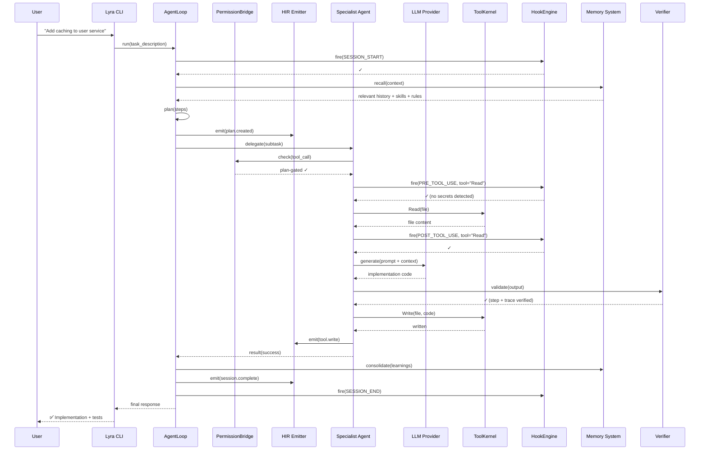
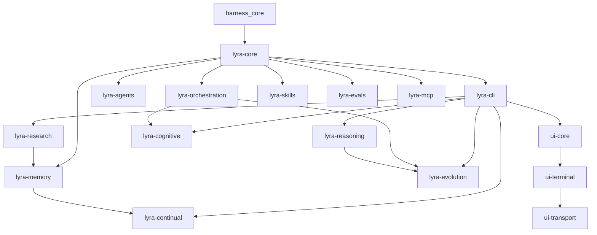

# Architecture

> The canonical architecture reference is in [`docs/architecture/`](docs/architecture/). This document provides a high-level overview with diagrams.

## System Topology

```mermaid
graph TB
    subgraph Entry["Entry Points"]
        CLI["lyra CLI<br/>(Typer + prompt_toolkit)"]
        TUI["Terminal UI<br/>(Ink/React, optional)"]
        ACP["ACP Server<br/>(Agent Client Protocol)"]
    end

    subgraph Kernel["Kernel (lyra-core)"]
        Loop["AgentLoop"]
        SM["TDD State Machine<br/>IDLE → PLAN → RED → GREEN → REFACTOR → SHIP"]
        PB["PermissionBridge<br/>plan | auto-edit | bypass"]
        HIR["HIR Emitter<br/>(JSONL event stream)"]
        LC["LifecycleBus<br/>(fan-out: chat, tool, plan, subagent, cron)"]
        AR["AliasRegistry<br/>(model name resolution)"]
    end

    subgraph Tools["Tool Kernel"]
        TK["ToolKernel"]
        Read["Read"] & Glob["Glob"] & Grep["Grep"] & Edit["Edit"] & Write["Write"] & Run["Run"]
    end

    subgraph Agents["Agent System"]
        PA["PrimaryAgent<br/>(orchestrator)"]
        CA["CodeAgent"]
        TA["TestAgent"]
        RA["ReviewAgent"]
        RHA["ResearchAgent"]
        UR["UnifiedRegistry<br/>(multi-index dispatch)"]
    end

    subgraph Memory["Memory System"]
        STM["Short-Term<br/>(deque, 10-turn)"]
        LTM["Long-Term<br/>(JSON, indexed)"]
        MR["MemoryRetriever<br/>(hybrid BM25+vector)"]
        MC["MemoryConsolidator<br/>(STM → LTM, pattern extraction)"]
    end

    subgraph Safety["Safety & Observability"]
        AS["AgentShield<br/>(5 scanners)"]
        TO["TokenObservatory<br/>(13 categories)"]
        TZR["TokenOptimizer<br/>(model + cache)"]
    end

    subgraph Skills["Skills & Rules"]
        SR["SkillRegistry<br/>(150+ triggers)"]
        RE["RuleEngine<br/>(3 categories)"]
        HE["HookEngine<br/>(5 event types)"]
    end

    CLI & TUI & ACP --> Loop
    Loop --> SM
    Loop --> PB
    Loop --> HIR --> LC
    Loop --> TK
    TK --> Read & Glob & Grep & Edit & Write & Run
    Loop --> PA
    PA --> CA & TA & RA & RHA
    PA --> UR
    Loop --> STM --> LTM
    STM --> MC --> LTM
    LTM --> MR
    Loop --> AS & TO & TZR
    Loop --> SR & RE & HE
```

## Data Flow

## Layer Architecture

```mermaid
graph LR
    subgraph L0["Layer 0: Interface"]
        CLI_L["lyra CLI<br/>(Typer app)"]
        TUI_L["Ink TUI<br/>(React)"]
        ACP_L["ACP Server<br/>(stdio)"]
    end

    subgraph L1["Layer 1: Application (lyra-cli)"]
        REPL["Interactive REPL<br/>(driver, session, keybindings)"]
        CMD["Commands<br/>(run, plan, doctor, evals, evolve)"]
        PROV["Providers<br/>(Anthropic, DeepSeek, OpenAI, Gemini...)"]
        SKILLS_APP["Skills Runtime<br/>(inject, telemetry, lifecycle)"]
        MEM_APP["Memory Runtime<br/>(8-level hierarchy)"]
    end

    subgraph L2["Layer 2: Kernel (lyra-core)"]
        LOOP["AgentLoop"]
        TDD["TDD Gate"]
        PERMS["PermissionBridge"]
        HIR_L["HIR Emitter"]
        TOOLS["ToolKernel"]
    end

    subgraph L3["Layer 3: Primitives (harness_core)"]
        MSG["Messages & Models"]
        HOOKS["Hook System"]
        COST["Cost Tracking"]
        EVALS["Eval Runner"]
        VERIF["Verifier Gates"]
    end

    L0 --> L1 --> L2 --> L3
```

## Eleven Architectural Commitments

From [`docs/architecture/commitments.md`](docs/architecture/commitments.md):

1. **Plan Mode** — All work is plan-gated. The agent proposes, the user approves, then execution proceeds.
2. **Three-Agent Topology** — PrimaryAgent orchestrates; specialist agents execute; the verifier validates.
3. **PermissionBridge** — Three modes (plan/auto-edit/bypass) with per-tool granularity.
4. **TDD Gate as Hook** — The RED→GREEN→REFACTOR cycle is enforced by a PreToolUse hook, not hardcoded.
5. **Five-Layer Context** — System prompt → SOUL.md → Rules → Skills → Conversation.
6. **Skill Library** — SKILL.md files with YAML frontmatter, trigger patterns, and auto-loading.
7. **Subagents in Worktrees** — Each subagent runs in an isolated git worktree with its own filesystem view.
8. **Two-Phase Verifier** — Step verification (each step correct) + Trace verification (chain coherent).
9. **STATE.md Continuity** — Between-session state serialized to markdown for resumability.
10. **HIR Traces** — Every event (tool call, LLM request, plan change) emitted as JSONL to `.lyra/sessions/`.
11. **Small/Smart Model Routing** — Simple tasks go to Haiku/Flash; complex tasks go to Sonnet/Pro; deep reasoning to Opus.

## Package Dependency Graph

## Key Design Decisions

| Decision | Rationale | Trade-off |
|----------|-----------|-----------|
| Kernel separate from CLI | `lyra-core` has zero network deps — reusable by MCP, evals, CI, SDK | Two packages to version |
| Monorepo with 135+ packages | Each package has isolated deps, tests, and lifecycle | Build orchestration complexity |
| prompt_toolkit over Textual | Faster startup, better stdin/stdout compatibility, closer to Claude Code UX | Less rich TUI out of the box |
| Optional Ink TUI | React component model for complex UI (model picker, agent tree) | Requires Node.js runtime |
| HIR JSONL as source of truth | All observability flows from one event stream | ~1MB/hour disk usage |
| STM/LTM with consolidation | Mimics human memory: recent context (STM) graduates to persistent knowledge (LTM) | Consolidation heuristics need tuning |
| Regex-based security scanning | Fast, no external deps, catches 90% of common issues | Misses obfuscated patterns, needs AST for full coverage |

## Further Reading

- [`docs/architecture/index.md`](docs/architecture/index.md) — Architecture landing page with reading order
- [`docs/architecture/commitments.md`](docs/architecture/commitments.md) — Deep dive on the 11 commitments
- [`docs/ARCHITECTURE_DIAGRAMS.md`](docs/ARCHITECTURE_DIAGRAMS.md) — Extended diagram collection
- [`docs/CONTRIBUTING.md`](docs/CONTRIBUTING.md) — Development guide and conventions
- [`packages/lyra-core/README.md`](packages/lyra-core/README.md) — Kernel package documentation
