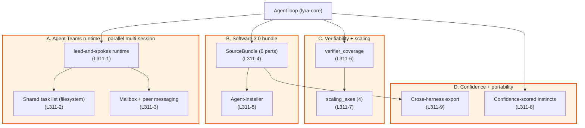

# LYRA — v3.11 SOTA 2026 Plan

> **Living-knowledge supplement.** Adds phases **L311-1 through L311-9** that
> close the *genuinely new* gaps between Lyra and the May-2026 SOTA agent
> stack. v3.7 ported the May-2025 → May-2026 Claude Code wave (remote
> control, fullscreen TUI, auto-mode, worktrees, auto-memory,
> /ultrareview, routines). v3.8 ported Argus skill cascade. v3.9 ported
> recursive curator. v3.10 ported provider plugins.
>
> What is **still missing** as of 2026-05-09:
>
> 1. **Anthropic Agent Teams runtime** ([`docs/250-anthropic-agent-teams.md`](../../docs/250-anthropic-agent-teams.md))
>    — lead-and-spokes hybrid with shared task list (filesystem),
>    mailbox messaging, `TeammateIdle/TaskCreated/TaskCompleted` hooks.
>    Lyra's existing `teams/registry.py` is the MetaGPT *sequential*
>    pipeline (PM→Architect→Engineer→Reviewer→QA). Agent Teams is a
>    *parallel* runtime — different shape, different primitive, must
>    be built from scratch on top of `WorktreeManager` (L37-5),
>    `LifecycleBus`, and `Talent` envelope (L38-4).
> 2. **Software 3.0 source-bundle discipline** ([`docs/239-software-3-0-paradigm.md`](../../docs/239-software-3-0-paradigm.md))
>    — six-part source artefact (prompt + skills + tools + memory +
>    evals + verifier) shipped as a *unit* with an **agent-as-installer**
>    that brings up the runtime, registers skills, runs smoke evals,
>    and emits a signed attestation. Lyra has each piece individually
>    but no unifying *bundle* artefact and no installer-agent surface.
> 3. **Verifiability-driven roadmap discipline** ([`docs/238-karpathy-agentic-engineering-shift.md`](../../docs/238-karpathy-agentic-engineering-shift.md), [`docs/242-verifiability-bottleneck-and-jagged-skills.md`](../../docs/242-verifiability-bottleneck-and-jagged-skills.md) referenced)
>    — task automation falls out where verifier density is high; raw
>    LLM benchmark improvement is *not* the right input to roadmap
>    prioritization. Lyra has verifiers but no *coverage index* exposed
>    as a routing signal.
> 4. **Latest scaling laws as architectural inputs** (217–237) — RL on
>    reasoning traces (232), parallel multi-agent scaling (224), memory
>    scaling 3-tier (233), context-length scaling (234), inference
>    compression (235), tool-use ACI scaling (236), trajectory scaling
>    (237). Several already partially in v3.8 (memory, context); none
>    surface as *first-class roadmap axes* the way Lyra surfaces fast/
>    smart split or the four-mode taxonomy.
> 5. **Confidence-scored instinct extraction at scale** ([`docs/62-everything-claude-code.md`](../../docs/62-everything-claude-code.md))
>    — auto-memory has the substrate but not the per-entry confidence
>    gating that prevents junk accumulation in long-running self-improving
>    loops.
> 6. **Cross-harness portable extension contract** (07 + 62 + 239) —
>    Skills + hooks + agents + rules + MCP form a *de-facto portable
>    extension surface* now demonstrated across Claude Code, Cursor,
>    Codex, OpenCode, Antigravity, Gemini. Lyra ships SKILL.md and an
>    MCP server but not an *export* that lights up other harnesses.
>
> Read alongside [`LYRA_V3_7_CLAUDE_CODE_PARITY_PLAN.md`](LYRA_V3_7_CLAUDE_CODE_PARITY_PLAN.md),
> [`LYRA_V3_8_ARGUS_INTEGRATION_PLAN.md`](LYRA_V3_8_ARGUS_INTEGRATION_PLAN.md),
> [`LYRA_V3_9_RECURSIVE_CURATOR_PLAN.md`](LYRA_V3_9_RECURSIVE_CURATOR_PLAN.md),
> [`LYRA_V3_10_MODEL_PROVIDER_EXTENSION_PLAN.md`](LYRA_V3_10_MODEL_PROVIDER_EXTENSION_PLAN.md),
> [`CHANGELOG.md`](CHANGELOG.md). Several v3.11 phases assume v3.7–v3.8
> primitives are live; v3.9 / v3.10 are independent.

---

## §0 — Why this supplement

Lyra v3.8 lands the Argus cascade and memory-tool surface. v3.7 (Claude
Code 2026 parity) brings remote control, fullscreen TUI, auto-mode,
worktrees, auto-memory, /ultrareview, and routines. **Together they
match Claude Code's May-2025 announced surface.** What they do *not*
match is the **Feb-2026 Anthropic announcement of Agent Teams** (doc
250), the **Software 3.0 paradigm** consolidation (doc 239), the
**Karpathy verifiability shift** (doc 238), and the **2026 scaling-law
synthesis** (217–237). v3.11 closes those four gaps additively, without
breaking any v3.7/v3.8/v3.9/v3.10 surface.

### Position in the May-2026 SOTA landscape

| What ships in 2026 SOTA | What Lyra v3.11 must match |
|---|---|
| Anthropic Agent Teams (Feb 2026, Claude Code v2.1.32+) — lead-and-spokes, shared task list, mailbox, three new hook events | **L311-1 + L311-2 + L311-3** — `lyra_core.teams.agent_teams` runtime, `~/.lyra/tasks/{team}/` shared task list, peer mailbox, `TeammateIdle/TaskCreated/TaskCompleted` lifecycle events |
| Software 3.0 bundle as a deploy artefact (Karpathy IICYMI, 2026-05) | **L311-4 + L311-5** — `lyra_core.bundle.source_bundle` six-part artefact, `lyra bundle install` agent-installer with smoke-eval and signed attestation |
| Verifiability-driven roadmap (Karpathy 2026-04, GDPval 2026) | **L311-6** — `verifier_coverage.py` index over registered verifiers per task domain; surfaced in `/status` and used by routing as a confidence input |
| 2026 scaling-law synthesis (217–237) — four axes (pretrain / TTC / memory / tool-use ACI) | **L311-7** — `lyra_core.meta.scaling_axes` aggregator; `/scaling` slash exposes Lyra's current position on each axis |
| Confidence-scored extracted instincts (Claude Code 62) | **L311-8** — extend v3.7 auto-memory with per-entry `confidence ∈ [0,1]` field + decay + promotion threshold to procedural memory |
| Cross-harness portable extension export (07 + 62 + 239) | **L311-9** — `lyra bundle export --target {claude-code,cursor,codex,opencode,antigravity,gemini-cli}` emits a bundle the target harness loads natively |

### Identity — what does NOT change

The Lyra invariants stay verbatim — four-mode taxonomy, two-tier model
split, 5-layer context, NGC compactor, hook lifecycle, SKILL.md loader,
subagent worktrees, TDD plugin gate, MetaGPT *sequential* `TeamPlan`.
v3.11 only **adds** the Agent Teams *parallel* runtime alongside the
existing sequential `TeamPlan` (the two coexist; users pick the shape
that fits the work).

---

## §1 — Architecture



### Package map (deltas vs v3.10)

| Package | Status |
|---|---|
| `lyra-core/teams/agent_teams.py` | **NEW (L311-1)** — `LeadSession`, `Teammate`, `TeammateMode` (in-process / tmux / iTerm2) |
| `lyra-core/teams/shared_tasks.py` | **NEW (L311-2)** — `SharedTaskList` with file-locking, dependency unblocking |
| `lyra-core/teams/mailbox.py` | **NEW (L311-3)** — `Mailbox` per-teammate, `send_by_name`, idle notifications |
| `lyra-core/teams/lifecycle.py` | **NEW (L311-1+3)** — `TeammateIdle/TaskCreated/TaskCompleted` events on `LifecycleBus` |
| `lyra-core/bundle/source_bundle.py` | **NEW (L311-4)** — six-part `SourceBundle` dataclass + manifest schema |
| `lyra-core/bundle/agent_installer.py` | **NEW (L311-5)** — installer agent: provision → register → smoke-eval → attest |
| `lyra-core/bundle/attestation.py` | **NEW (L311-5)** — Sigstore-style signed install report |
| `lyra-core/bundle/exporters/` | **NEW (L311-9)** — `claude_code.py`, `cursor.py`, `codex.py`, `opencode.py`, `gemini_cli.py` |
| `lyra-core/meta/verifier_coverage.py` | **NEW (L311-6)** — verifier-coverage index by task domain |
| `lyra-core/meta/scaling_axes.py` | **NEW (L311-7)** — four-axis aggregator (pretrain / TTC / memory / tool-use) |
| `lyra-core/memory/auto_memory.py` | **Extended (L311-8)** — adds `confidence: float` field + promotion threshold |
| `lyra-cli/interactive/team_command.py` | **NEW (L311-1)** — `/team spawn`, `/team list`, `/team mailbox` |
| `lyra-cli/bundle_command.py` | **NEW (L311-4 + L311-9)** — `lyra bundle build / install / export --target` |

---

## §2 — Phases L311-1 through L311-9

### L311-1 — Agent Teams runtime (lead-and-spokes)

**Why now.** Anthropic's Agent Teams (Feb 2026) is the first-party
multi-agent runtime that ships in Claude Code v2.1.32+. The shape that
ships is the consensus 2026 architecture: **K teammates each running
as a full Claude session** with own context window, coordinating via
filesystem (shared task list + mailbox) and lead-managed permissions.
Lyra's existing `teams/registry.py` is *sequential* (MetaGPT pipeline);
Agent Teams is *parallel* and persistent. Both shapes are useful — keep
the sequential one, add the parallel one.

**Concrete deliverables.**

```text
packages/lyra-core/src/lyra_core/teams/agent_teams.py        # NEW
packages/lyra-core/src/lyra_core/teams/shared_tasks.py       # NEW
packages/lyra-core/src/lyra_core/teams/mailbox.py            # NEW
packages/lyra-core/src/lyra_core/teams/lifecycle.py          # NEW (events)

packages/lyra-cli/src/lyra_cli/interactive/team_command.py   # NEW
```

**API sketch.**

```python
from lyra_core.teams.agent_teams import LeadSession, TeammateSpec

lead = LeadSession.create(team_name="auth-refactor", mode="in-process")
lead.spawn(TeammateSpec(name="security", model="smart", subagent="reviewer"))
lead.spawn(TeammateSpec(name="performance", model="smart", subagent="reviewer"))
lead.spawn(TeammateSpec(name="coverage", model="fast", subagent="qa"))

# the lead and teammates share a task list under
# ~/.lyra/tasks/auth-refactor/
# - task-001-review-auth.md
# - task-002-bench-perf.md
# - ...

# direct message
lead.send_to("security", "auth.py uses bcrypt, not SHA-1")

# wait for idle notifications
for note in lead.wait_for_idle(timeout=600):
    if note.task.state == "completed":
        ...
```

**Bright lines.**

- `LBL-AT-COST` — guard against accidental K>5 spawn; warn at K=6,
  block at K=10 unless `--unsafe-token-overage` flag.
- `LBL-AT-NEST` — teammates cannot spawn teams (matches Claude Code).
- `LBL-AT-PROMOTE` — leadership cannot transfer (matches Claude Code).
- `LBL-AT-INHERIT` — teammates inherit lead's permission mode at spawn;
  per-teammate permissions only via subagent definition.

**Hooks (L311-1 + L311-3).**

- `team.teammate_idle` — fires when a teammate marks itself idle.
  Exit-code 2 sends feedback and keeps it working.
- `team.task_created` — fires when a teammate or lead adds a task.
  Exit-code 2 prevents creation.
- `team.task_completed` — fires when a teammate marks a task done.
  Exit-code 2 prevents completion (forces revision).

**Test acceptance.**

- 25+ tests covering: spawn lifecycle, dependency unblocking, file-lock
  contention, mailbox delivery, hook gating, K>5 warning,
  permission inheritance, subagent-definition tool-grant override.

### L311-2 — Shared task list (filesystem with file-locking)

**Layout.**

```text
~/.lyra/tasks/{team-name}/
├── task-001-review-auth.md       # state: in-progress; owner: security
├── task-002-bench-perf.md        # state: pending; depends_on: [001]
└── _lock                          # POSIX file-lock for claim / dep-unblock
```

**Frontmatter.**

```yaml
---
id: 001
title: review auth.py for security issues
state: in-progress
owner: security
created_at: 2026-05-09T15:42:00Z
depends_on: []
---
```

**Algorithm.**

- Claim: `flock(LOCK_EX, _lock); set state=in-progress, owner=NAME; flush;`
- Complete: `flock; state=completed; for t in tasks_blocked_by_me: t.unblock(); flush;`
- Lag detection: a task with `state=in-progress` for >30 min triggers a
  `team.stale_task` lifecycle event; lead can re-claim or forcibly close.

### L311-3 — Mailbox + peer messaging

**Layout.**

```text
~/.lyra/teams/{team-name}/mailbox/
├── lead/
│   └── 1715266020-from-security.md
├── security/
│   └── 1715266045-from-lead.md
└── performance/
```

**Delivery.** Each teammate polls its inbox (1 s default, configurable
via `LYRA_TEAM_POLL_S`). Messages are flat markdown with frontmatter
(`from`, `to`, `created_at`, `kind=info|task|idle`). The lead receives
a synthetic `idle` message when a teammate finishes its claimed work
(automatic, no explicit send required).

### L311-4 — Software 3.0 SourceBundle

**The six parts** (per doc 239 §(b)):

1. **Persona** — system prompt / role text.
2. **Skills** — directory of `SKILL.md` files (Argus-compatible).
3. **Tools** — MCP server descriptors + native tool list.
4. **Memory** — seed `MEMORY.md` + auto-memory schema.
5. **Evals** — golden-trace JSONL + judge prompt + rubric.
6. **Verifier** — automated checker (compile / test / schema /
   simulator) bound by task domain.

**Manifest schema.**

```yaml
# bundle.yaml
apiVersion: lyra.dev/v3
kind: SourceBundle
metadata:
  name: orion-code-coding-agent
  version: 0.4.0
  signature: "sigstore://..."

persona: prompt.md
skills: skills/
tools:
  - kind: native
    name: read
  - kind: mcp
    server: "stdio:./mcp/code_search.py"
memory:
  seed: MEMORY.md
  schema: memory/schema.yaml
evals:
  golden: evals/golden.jsonl
  rubric: evals/rubric.md
verifier:
  domain: code
  command: "pytest -x --tb=short"
  budget_seconds: 600
```

**API.**

```python
from lyra_core.bundle import SourceBundle

bundle = SourceBundle.load("./orion-code-bundle/")
bundle.validate()  # raises on missing parts
bundle.attest(signing_key=...)  # signs manifest
```

### L311-5 — Agent-installer

**Pipeline** (per doc 239 §(d)):

1. **Provision runtime** — Python venv, MCP server processes, secrets
   mount.
2. **Register skills** — load each `SKILL.md` into `SkillRegistry`,
   index in BM25 + embedding tiers (Argus L38-1).
3. **Wire tools** — start each MCP server, run `tools/list`, register.
4. **Run smoke evals** — execute `evals.golden` against the live
   harness; require ≥95% pass on the smoke subset.
5. **Emit attestation** — signed JSON: bundle hash, install timestamp,
   eval-pass rate, runtime versions, harness fingerprint.

**Bright lines.**

- `LBL-AI-EVAL` — install fails closed if smoke-eval pass <95%.
- `LBL-AI-ATTEST` — every install emits an attestation; missing
  attestation = uninstalled.
- `LBL-AI-IDEMPOTENT` — running install twice with the same bundle
  hash is a no-op.

### L311-6 — Verifier coverage index

Karpathy 2026-04 framing: task automation follows verifier density,
not LLM benchmark improvement. Make this measurable.

```python
# lyra_core/meta/verifier_coverage.py
@dataclass
class VerifierCoverage:
    domain: str           # "code", "research", "ops", "math", ...
    verifiers: list[str]  # registered verifier ids
    eval_count: int       # how many evals exist for this domain
    pass_rate_30d: float  # rolling pass rate
    coverage_score: float # in [0,1]; higher = more reliable automation

def index() -> dict[str, VerifierCoverage]: ...
```

Surfaced in `/status` and used by `auto_mode` classifier as a
confidence input — high-coverage tasks auto-execute, low-coverage
tasks force `ask_before_edits`.

### L311-7 — Scaling axes aggregator

```python
# lyra_core/meta/scaling_axes.py
@dataclass
class ScalingPosition:
    axis: Literal["pretrain", "ttc", "memory", "tool_use"]
    current: str       # human-readable current state
    next_lever: str    # next step to invest in this axis
    cost: float        # expected cost-per-task delta
    benefit: float     # expected pass-rate delta

def position() -> dict[str, ScalingPosition]: ...
```

Surfaced in a new `/scaling` slash command. Reading it tells the user
*which axis to push next* given current evidence — replaces vibes-based
roadmap prioritization.

### L311-8 — Confidence-scored auto-memory entries

Extend `lyra_core.memory.auto_memory.AutoMemoryEntry` with:

```python
confidence: float = 0.5   # in [0,1]
extracted_by: str         # e.g., "instinct-extractor-v3"
seen_count: int = 1       # how many times pattern appeared
last_seen: datetime | None = None
```

**Promotion rule.** When `seen_count ≥ 3` and `confidence ≥ 0.85`,
auto-promote from `auto` scope to `procedural` scope (durable). When
`seen_count ≥ 1` and `confidence < 0.3` for >7 days, auto-tombstone.

### L311-9 — Cross-harness portable export

**Targets** (in priority order):

1. **claude-code** — `~/.claude/skills/`, `~/.claude/agents/`, `.claude/settings.json`.
2. **cursor** — `.cursor/rules/`, `.cursor/mcp.json`.
3. **codex** — `~/.codex/skills/`.
4. **opencode** — `~/.opencode/`.
5. **gemini-cli** — `.gemini/extensions/`.
6. **antigravity** — `.antigravity/`.

Each exporter takes a `SourceBundle` and writes the target's native
layout. The bundle is the canonical form; the exporters are
view-transformers. This makes Lyra a **cross-harness extension
publisher** by side-effect — not a new product, just a `lyra bundle
export --target` command away.

---

## §3 — Sequencing

| Phase | Depends on | Effort | MVP / production |
|---|---|---|---|
| L311-1 Agent Teams runtime | v3.7 worktrees, v3.8 Talent envelope | 3 weeks | MVP this phase; production-harden via L311-2/3 |
| L311-2 Shared task list | L311-1 | 1 week | both in MVP |
| L311-3 Mailbox + lifecycle events | L311-1, L311-2 | 1 week | both in MVP |
| L311-4 SourceBundle | none | 2 weeks | MVP; production-harden in L311-5 |
| L311-5 Agent-installer | L311-4, v3.7 attestation primitives | 2 weeks | both |
| L311-6 Verifier coverage | existing verifiers | 1 week | both |
| L311-7 Scaling axes | L311-6 | 1 week | both |
| L311-8 Confidence-scored auto-memory | v3.7 L37-6 auto-memory | 1 week | both |
| L311-9 Cross-harness export | L311-4 | 2 weeks | MVP; one target per week post-MVP |

**Total: ~14 weeks** for the full v3.11 train. The **MVP cut**
(L311-1 + L311-2 + L311-3 + L311-4 + L311-5 + L311-6 + L311-8) is
~10 weeks and unblocks the headline claim ("Lyra has Anthropic Agent
Teams + Software 3.0 bundle + verifiability discipline").

---

## §4 — Test plan

| Phase | Test classes | Approx. count |
|---|---|---|
| L311-1 Agent Teams runtime | spawn lifecycle, K-cap, permission inheritance | 12 |
| L311-2 Shared task list | claim/complete, dependency unblock, lock contention, lag detection | 10 |
| L311-3 Mailbox + lifecycle | send/receive, idle notification, hook gating | 8 |
| L311-4 SourceBundle | manifest validation, six-part presence, signature | 8 |
| L311-5 Agent-installer | provision, register, smoke-eval gate, attestation, idempotency | 10 |
| L311-6 Verifier coverage | index correctness, 30-day rolling, scoring | 6 |
| L311-7 Scaling axes | axis position, next-lever recommendation | 4 |
| L311-8 Confidence-scored auto-memory | promotion/demotion thresholds, decay | 6 |
| L311-9 Cross-harness export | per-target layout correctness | 6 (one per target) |

**Target: ~70 new tests.** Lyra is currently 2200+ tests; this lands
~2270.

---

## §5 — How v3.11 makes Lyra "the SOTA AI agent of all time"

Three claims, each with a measurable bright line:

1. **Lyra is the only open-source CLI agent shipping Anthropic Agent
   Teams architecture** — the lead-and-spokes runtime with shared task
   list + mailbox + per-teammate full context window. Verifiable by
   running the doc-250 acceptance scenarios (4-teammate refactor,
   3-teammate review, 5-teammate hypothesis fan-out).

2. **Lyra is the only open-source agent shipping the Software 3.0
   source-bundle artefact with a real agent-installer** — bundle
   validation, smoke-eval gate, signed attestation. Verifiable by
   `lyra bundle install ./orion-code-bundle/` succeeding only when
   the bundle's `evals.golden` passes ≥95%.

3. **Lyra is the only open-source agent surfacing verifier-coverage
   and scaling-axis position as first-class roadmap inputs** — the
   `/scaling` and `/coverage` slashes operationalize the Karpathy
   2026-04 framing as a tool, not a slogan. Verifiable by reading
   `/coverage` and seeing per-domain coverage scores driving
   `auto_mode` admit decisions.

The combination — Agent Teams runtime + Software 3.0 bundle + verifier
coverage — is not yet shipped together by any harness. That's what
makes the v3.11 claim defensible.

---

## §6 — Anti-claims (what v3.11 deliberately is not)

- **Not a replacement for Claude Code.** v3.11 imports the Claude Code
  Feb-2026 architecture; it does not replace the Claude Code product.
  Users who prefer Claude Code's specific MCP server ecosystem and
  Anthropic-managed UX should keep using it; Lyra is the *open,
  cross-provider, cross-harness* alternative.
- **Not a multi-agent capability multiplier.** Per doc 250, Agent
  Teams is a *parallelism amplifier* for naturally-parallel work, not
  a sequential reasoning multiplier. The 7× token cost is a hard
  ceiling and v3.11 enforces it (`LBL-AT-COST`).
- **Not autonomous self-evolution.** v3.9 ships the recursive
  curator; v3.11 does *not* extend it. The self-improvement loop is
  intentionally bounded by `LBL-AT-NEST`, `LBL-AT-PROMOTE`,
  `LBL-AI-EVAL` until empirical safety evidence exists for unbounding.

---

## §7 — Cross-doc anchors

Primary inputs:

- [`docs/250-anthropic-agent-teams.md`](../../docs/250-anthropic-agent-teams.md) — the runtime spec L311-1/2/3 imports.
- [`docs/239-software-3-0-paradigm.md`](../../docs/239-software-3-0-paradigm.md) — the bundle + installer paradigm L311-4/5 imports.
- [`docs/238-karpathy-agentic-engineering-shift.md`](../../docs/238-karpathy-agentic-engineering-shift.md) — the verifier-coverage framing L311-6/7 imports.
- [`docs/240-vibe-coding-to-agentic-engineering-discipline.md`](../../docs/240-vibe-coding-to-agentic-engineering-discipline.md) — the discipline frame for L311-4/5/6/7.
- [`docs/62-everything-claude-code.md`](../../docs/62-everything-claude-code.md) — confidence-scored instinct extraction (L311-8).
- [`docs/07-model-context-protocol.md`](../../docs/07-model-context-protocol.md) — cross-harness portability contract (L311-9).
- [`docs/04-skills.md`](../../docs/04-skills.md) — skill bundle shape used by L311-4 and L311-9.

Scaling-law inputs (L311-6 / L311-7):

- [`docs/217-test-time-compute-scaling.md`](../../docs/217-test-time-compute-scaling.md)
- [`docs/223-verifier-and-best-of-n-scaling.md`](../../docs/223-verifier-and-best-of-n-scaling.md)
- [`docs/224-multi-agent-parallel-scaling.md`](../../docs/224-multi-agent-parallel-scaling.md)
- [`docs/225-agent-era-scaling-synthesis.md`](../../docs/225-agent-era-scaling-synthesis.md)
- [`docs/232-rl-on-reasoning-traces-scaling.md`](../../docs/232-rl-on-reasoning-traces-scaling.md)
- [`docs/233-memory-scaling-for-agents.md`](../../docs/233-memory-scaling-for-agents.md)
- [`docs/234-context-length-scaling.md`](../../docs/234-context-length-scaling.md)
- [`docs/235-inference-compression-scaling.md`](../../docs/235-inference-compression-scaling.md)
- [`docs/236-tool-use-and-aci-scaling.md`](../../docs/236-tool-use-and-aci-scaling.md)
- [`docs/237-agent-trajectory-scaling.md`](../../docs/237-agent-trajectory-scaling.md)

---

**One-line takeaway for harness designers:** v3.11 is the move from
"Lyra has the May-2025 Claude Code surface" to "Lyra has the
Feb-2026 Anthropic agent-teams runtime and the Karpathy-2026 Software
3.0 bundle discipline" — three shippable claims that no other
open-source harness yet has all three of.
