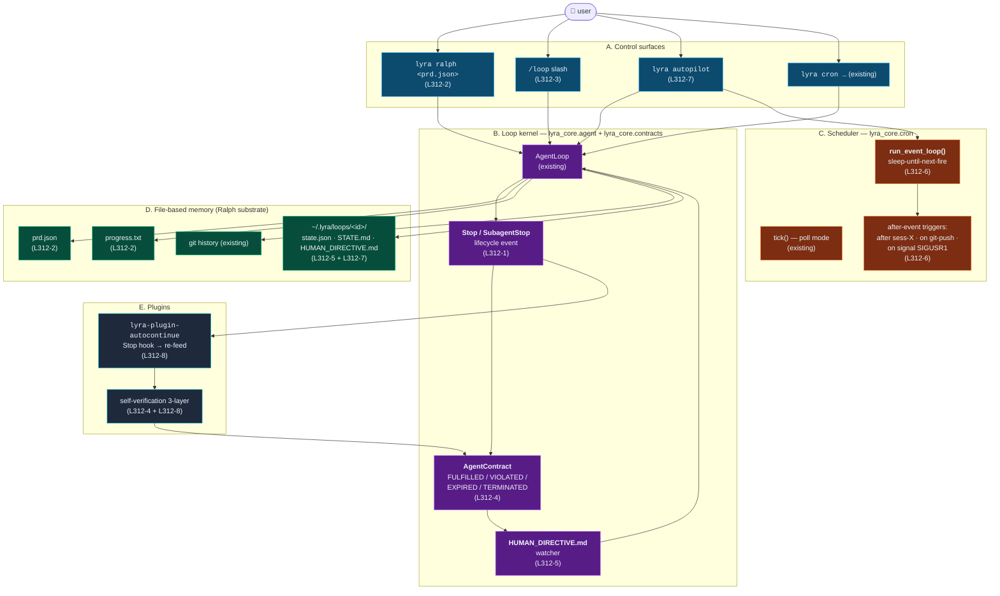

# LYRA — v3.12 Autonomy-Loop Plan

> **Living-knowledge supplement.** Adds phases **L312-1 through L312-8** that
> close the *stop-and-ask* gap between Lyra and the 2026 autonomous-loop SOTA.
> v3.7 ported the May-2026 Claude Code wave (remote control, fullscreen TUI,
> auto-mode, worktrees, auto-memory, /ultrareview, routines). v3.8 ported
> Argus skill cascade. v3.9 ported recursive curator. v3.10 ported provider
> plugins. v3.11 added Agent Teams + Software 3.0 bundle. **v3.12 closes the
> autonomy-loop gap** — the field-level complaint that Claude Code,
> hermes-agent, OpenClaw, and Lyra v3.11 all *finish a task and stop*,
> forcing the user to type "continue" forever.
>
> Prior art the plan operationalises:
>
> 1. **Ralph loop** (Geoff Huntley → snarktank/ralph → frankbria/ralph-claude-code →
>    vercel-labs/ralph-loop-agent) — fresh-context iteration, file-based memory,
>    `<promise>COMPLETE</promise>` parser. Canon: [`docs/165-ralph-autonomous-loop.md`](../../docs/165-ralph-autonomous-loop.md).
> 2. **Claude Code Stop / SubagentStop hook** — `Decision.deny` re-feeds the agent
>    in the same session; `stop_hook_active` flag breaks the infinite-loop trap;
>    Anthropic's own "auto-continue" plugin uses this. Canon:
>    [`docs/62-everything-claude-code.md`](../../docs/62-everything-claude-code.md).
> 3. **Claude Code `/loop` slash** — built-in self-paced or fixed-interval prompt
>    re-execution; Lyra has cron but no in-session `/loop`.
> 4. **Deep Researcher Agent 24/7** — THINK→EXECUTE→REFLECT, two-tier constant
>    memory, `HUMAN_DIRECTIVE.md` async-control file, zero-cost monitoring during
>    long phases. Canon: [`docs/160-deep-researcher-agent-24x7.md`](../../docs/160-deep-researcher-agent-24x7.md).
> 5. **Karpathy autoresearch** (March 2026) — single-script, time-boxed,
>    measure-and-keep-or-revert; runs all night. Canon:
>    [`docs/238-karpathy-agentic-engineering-shift.md`](../../docs/238-karpathy-agentic-engineering-shift.md).
> 6. **Agent Contracts** (arXiv 2601.08815, COINE 2026) — formal
>    `FULFILLED / VIOLATED / EXPIRED / TERMINATED` envelope; resource-bounded
>    autonomous AI; closes the *$47k recursive-clarification-loop* incident class.
> 7. **Cron-as-loop / Hibernate-and-Wake** (Meta REA, "Let Them Sleep" pattern,
>    Autobot agent-loop-cron) — calculate-next-fire-and-sleep instead of
>    poll-every-second, persist across reboots. Lyra's cron daemon is the
>    poll variant; needs the sleep variant.
> 8. **Self-verification loops** (3-layer pattern, agentic-patterns.com)
>    — the Stop hook plus a verifier plus an iteration cap is the load-bearing
>    triple; without all three the loop is unsafe.
>
> Read alongside [`LYRA_V3_7_CLAUDE_CODE_PARITY_PLAN.md`](LYRA_V3_7_CLAUDE_CODE_PARITY_PLAN.md),
> [`LYRA_V3_11_SOTA_2026_PLAN.md`](LYRA_V3_11_SOTA_2026_PLAN.md),
> [`CHANGELOG.md`](CHANGELOG.md). v3.12 is **independent** — it does not
> require any v3.11 phase to be live, but it *composes* with v3.11's
> Agent Teams (a teammate can drive a Ralph loop) and v3.10's provider
> plugins (loop sessions can pin a cheaper provider for the long tail).

---

## §0 — Why this supplement

The 2026 field has converged on an uncomfortable truth: **the agent loop is
the product**. The wrapper around the LLM that decides when to stop, when to
continue, when to wake, when to call a human — that wrapper is what
distinguishes a $0.08-per-24h-cycle Deep Researcher Agent from a
$47,000-API-bill recursive-clarification incident. Lyra v3.11 has a *strong*
inner loop (`AgentLoop` in `lyra_core/agent/loop.py`) and a *strong* cron
daemon (`lyra_core/cron/daemon.py`), but they don't compose into the
**fresh-context, file-memory, verifier-gated, budget-bounded** outer loop the
field calls "Ralph" or "/loop".

Concretely, the user-visible failure mode today: a Lyra session reports
"Phase complete" or "Plan executed", emits a `TurnResult(stopped_by="end_turn")`,
and **drops back to the REPL prompt**. There is no hook event the user can
register that says *"the model thinks it's done; check the verifier and either
re-feed or accept."* `PreSessionEnd` fires too late — the session is already
ending. `PostToolUse` fires too often — every tool call. The missing event is
**`Stop` / `SubagentStop`** at the seam where the LLM has no more tool calls
to make. Without it, no auto-continue plugin is possible.

v3.12 adds that event, plus the seven adjacent primitives that turn it from
a hook into a working long-running autonomy substrate.

### Position in the May-2026 SOTA landscape

| What ships in 2026 SOTA | What Lyra v3.12 must match |
|---|---|
| Claude Code `Stop` / `SubagentStop` hooks with `stop_hook_active` infinite-loop guard | **L312-1** — `Stop` / `SubagentStop` lifecycle events on `LifecycleBus`; `stop_hook_active: bool` flag; `Decision.deny` upgraded to "re-feed the agent" semantics |
| `snarktank/ralph` + `frankbria/ralph-claude-code` + `vercel-labs/ralph-loop-agent` autonomous-coding loop | **L312-2** — `lyra ralph <prd.json>` runner with fresh-context iteration, `progress.txt` codebase-patterns memory, `<promise>COMPLETE</promise>` parser, archive-on-branch-change |
| Claude Code `/loop` slash command (self-paced + fixed-interval) | **L312-3** — `/loop` slash + `lyra loop` CLI; `--interval=270s` (cache-warm), `--until=<predicate>`, `--max=<N>`; in-session re-prompt without restart |
| Agent Contracts `FULFILLED / VIOLATED / EXPIRED / TERMINATED` resource envelope | **L312-4** — `lyra_core.contracts.AgentContract` wrapping any loop with hard budgets (USD / iterations / wall-clock) and verifier-pred for fulfillment; closes the $47k recursive-loop incident class |
| Deep Researcher Agent `HUMAN_DIRECTIVE.md` async-control file | **L312-5** — `~/.lyra/loops/<id>/HUMAN_DIRECTIVE.md` watched per iteration; on change, top-priority directive injected into next THINK |
| "Hibernate-and-Wake" sleep-until-next-fire scheduler (Autobot, REA) | **L312-6** — `CronDaemon.tick()` poll mode preserved; new `CronDaemon.run_event_loop()` computes next-fire and sleeps; new triggers `after sess-X`, `on git-push origin/<b>`, `on signal SIGUSR1` |
| Long-running supervisor that persists across reboots | **L312-7** — `lyra autopilot` daemon driving Ralph + cron + loop schedules; SQLite-checkpointed state; `/hibernate` slash to checkpoint and resume |
| Stop-hook auto-continue plugin (Anthropic's own pattern) | **L312-8** — `lyra-plugin-autocontinue` shipped in `lyra-skills`; opt-in; safeguarded by max-extensions, cost-watermark, Ctrl-C escape |

### Identity — what does NOT change

The Lyra invariants stay verbatim — four-mode taxonomy (`agent` / `plan` /
`debug` / `ask`), two-tier model split (fast / smart), 5-layer context, NGC
compactor, hook lifecycle (now extended), SKILL.md loader, subagent
worktrees, TDD plugin gate, MetaGPT *sequential* `TeamPlan`, v3.11
Agent Teams *parallel* runtime, v3.11 SourceBundle. v3.12 only **adds**
the autonomy-loop substrate alongside the existing surfaces. Every existing
session continues to work. `--no-loop` is the default for `lyra` invocations
that don't ask for autonomy.

---

## §1 — Architecture



> **Reading it.** Four control surfaces (Ralph runner, `/loop`, autopilot,
> cron) all funnel into one kernel — `AgentLoop` wrapped by `AgentContract`,
> with the new `Stop` event as the seam where auto-continue happens and
> `HUMAN_DIRECTIVE.md` as the asynchronous brake. The cron daemon grows a
> sleep-until-next-fire mode for long horizons; file-based memory lives in
> `prd.json` + `progress.txt` + git + a per-loop scratch directory.

### Package map (deltas vs v3.11)

| Path | Status |
|---|---|
| `lyra-core/hooks/lifecycle.py` | **Extended (L312-1)** — adds `Event.Stop`, `Event.SubagentStop`, `stop_hook_active` flag on `HookContext` |
| `lyra-core/agent/loop.py` | **Extended (L312-1)** — emits `Stop` after the LLM returns no tool calls, before the function returns; honours `Decision.deny` by re-prompting in-session up to a per-loop cap |
| `lyra-core/contracts/__init__.py` | **NEW (L312-4)** — `AgentContract`, `ContractState`, `BudgetEnvelope`, `VerifierPred` |
| `lyra-core/contracts/state_machine.py` | **NEW (L312-4)** — `pending → running → fulfilled \| violated \| expired \| terminated` |
| `lyra-core/ralph/__init__.py` | **NEW (L312-2)** — `RalphRunner`, `Prd`, `UserStory`, `ProgressLog` |
| `lyra-core/ralph/prd.py` | **NEW (L312-2)** — `prd.json` schema + serializer |
| `lyra-core/ralph/progress.py` | **NEW (L312-2)** — `progress.txt` parser + Codebase-Patterns section maintainer |
| `lyra-core/ralph/completion.py` | **NEW (L312-2)** — `<promise>COMPLETE</promise>` parser + `EXIT_SIGNAL: true` parser (frankbria-compat) |
| `lyra-core/loops/__init__.py` | **NEW (L312-3 + L312-5)** — `LoopSession`, `LoopState`, `HumanDirective` |
| `lyra-core/loops/directive.py` | **NEW (L312-5)** — `HUMAN_DIRECTIVE.md` watcher (filesystem mtime) |
| `lyra-core/loops/store.py` | **NEW (L312-7)** — SQLite checkpoint store at `~/.lyra/loops/loops.sqlite` |
| `lyra-core/cron/daemon.py` | **Extended (L312-6)** — `run_event_loop()` next-fire-and-sleep mode |
| `lyra-core/cron/triggers.py` | **NEW (L312-6)** — `after_session`, `on_git_push`, `on_signal` triggers |
| `lyra-cli/interactive/loop_command.py` | **NEW (L312-3)** — `/loop`, `/loop-status`, `/hibernate` slashes |
| `lyra-cli/commands/ralph.py` | **NEW (L312-2)** — `lyra ralph` CLI |
| `lyra-cli/commands/autopilot.py` | **NEW (L312-7)** — `lyra autopilot start \| stop \| status \| logs` |
| `lyra-skills/lyra-plugin-autocontinue/` | **NEW (L312-8)** — Stop-hook auto-continue plugin |
| `lyra-evals/corpora/autonomy-loop/` | **NEW (cross-cutting)** — eight tasks measuring loop fidelity, halt safety, cost-watermark behaviour |

---

## §2 — Phases L312-1 through L312-8

### L312-1 — `Stop` / `SubagentStop` lifecycle event

**Why it's load-bearing.** Every other phase composes through this seam. A
loop that re-feeds without a hook event is a syntactic for-loop; a loop with
a hook event is a *programmable* for-loop where verifiers, budgets, and
plugins can vote on continuation.

**What changes.**

```python
# lyra_core/hooks/lifecycle.py  (extended)
class Event(StrEnum):
    UserPromptSubmit = "user_prompt_submit"
    PrePlan = "pre_plan"
    PostPlan = "post_plan"
    PreToolUse = "pre_tool_use"
    PostToolUse = "post_tool_use"
    PreSubagent = "pre_subagent"
    PostSubagent = "post_subagent"
    PreVerify = "pre_verify"
    PostVerify = "post_verify"
    Stop = "stop"                  # NEW: LLM returned no tool calls
    SubagentStop = "subagent_stop" # NEW: subagent's loop ended cleanly
    PreSessionEnd = "pre_session_end"
```

`HookContext` grows two fields:

```python
@dataclass
class HookContext:
    ...
    stop_hook_active: bool = False   # NEW: True iff a prior Stop hook denied this stop
    stop_extensions: int = 0         # NEW: how many times the loop has been re-fed
```

`AgentLoop.run_conversation()` (in `lyra_core/agent/loop.py`) gains a single
new branch right before its existing `stopped_by="end_turn"` exit:

```python
# pseudo-code
while True:
    response = self._call_llm(...)
    if response.has_tool_calls:
        self._dispatch_tools(...)
        continue
    decision = self._fire_stop_hook(stop_hook_active=ctx.stop_hook_active,
                                    stop_extensions=ctx.stop_extensions)
    if decision.is_deny() and ctx.stop_extensions < self.max_stop_extensions:
        ctx.stop_hook_active = True
        ctx.stop_extensions += 1
        # inject the deny.user_message as a synthetic user turn and continue
        self._messages.append({"role": "user", "content": decision.user_message})
        continue
    return TurnResult(..., stopped_by="end_turn")
```

**Safety rails (Anthropic's incident lessons baked in).**

- `max_stop_extensions` default = `5`; configurable per-session and per-loop.
- `stop_hook_active=True` on the next fire so a stop-hook can self-disable
  on re-entry. Mirrors Claude Code's documented anti-infinite-loop pattern.
- Budget envelope (L312-4) takes precedence: a `VIOLATED` contract overrides
  any `Decision.deny`.
- The hook *cannot* `Decision.modify` the message history; only inject a
  single synthetic user turn via `deny.user_message`. Prevents arbitrary
  context-mutation attacks.

**Tests.** `tests/test_stop_hook_contract.py` (12 cases), including:
infinite-deny → terminates at `max_stop_extensions`, `stop_hook_active=True`
→ hook returns allow on second fire → loop exits cleanly, `Decision.deny`
under `VIOLATED` contract → contract wins, deny under `--no-hooks` → hook
never fires.

### L312-2 — `lyra ralph <prd.json>` — Ralph-pattern runner

**One-line definition.** A 2026 Lyra-native re-implementation of
[`docs/165-ralph-autonomous-loop.md`](../../docs/165-ralph-autonomous-loop.md):
fresh Lyra session per iteration, file-based memory in `prd.json` +
`progress.txt` + git, `<promise>COMPLETE</promise>` exit signal, Codebase-
Patterns section maintained at the top of `progress.txt`.

**Why a Lyra-native runner instead of just `bash ralph.sh`.**

- **Cost & quota integration.** Each iteration is a Lyra session, so
  `BudgetEnvelope` (L312-4) caps total spend across N iterations, not just
  per turn. Snarktank's bash version has no global cap.
- **Worktree isolation.** Iterations run inside Lyra's existing
  `WorktreeManager` (L37-5), so a corrupted iteration never dirties the
  parent repo. Bash Ralph runs in-place.
- **Hook composition.** `tdd-anchor`, `path-quarantine`, `secret-redactor`,
  and the new `Stop` hook (L312-1) all apply uniformly. Bash Ralph bypasses
  hooks entirely via `--dangerously-skip-permissions`.
- **Trace continuity.** Every iteration writes to the same JSONL trace at
  `~/.lyra/traces/<run-id>/iteration-NN.jsonl`. Easier postmortem than bash's
  `tee /dev/stderr`.

**Surface.**

```bash
lyra ralph init                         # generates prd.json scaffold
lyra ralph <prd.json>                   # run until COMPLETE or max-iter
lyra ralph <prd.json> --max 50          # cap iterations
lyra ralph <prd.json> --budget 5.00     # cap spend at $5 USD
lyra ralph <prd.json> --branch feat/x   # explicit branch (else from prd.json)
lyra ralph <prd.json> --tool=amp        # frankbria-compat: use amp not Lyra
lyra ralph status <run-id>              # live view of current iteration
lyra ralph archive <run-id>             # archive into ~/.lyra/ralph/archive/
```

**Iteration prompt.** Lyra ships a default `RALPH.md` system prompt under
`lyra-skills/ralph/SKILL.md`; users can override per-project at
`.lyra/RALPH.md`. The default mirrors snarktank's prompt nearly verbatim
(one story per iteration; commit per story; append progress; consolidate
patterns) with two Lyra-specific additions:

- After step 8 (commit), call the verifier suite via `/verify` slash.
  If verification fails, set `passes: false` *and* append to `progress.txt`
  under `## Last-iteration-failure` section. Next iteration sees the failure
  and starts there.
- Before the COMPLETE check, run `/security-review --only-changed-files`
  if the bundle includes `senior-security` skills (cross-link with v3.11
  SourceBundle).

**Files written per run** (under `.lyra/ralph/<run-id>/`):

```
prd.json            # working PRD; passes flags flip true as stories complete
progress.txt        # codebase-patterns + chronological iteration log
state.json          # iteration count, last-branch, contract envelope
trace/              # one JSONL per iteration
archive/            # auto-archived prior runs (branch-change rotation)
```

**Tests.** `tests/test_ralph_runner.py` (15 cases): PRD round-trip, COMPLETE
parser exact match, partial-write recovery, branch-change archive,
`--budget` triggers `VIOLATED` contract, `--max` triggers `EXPIRED`, hook
deny in iteration k re-feeds without breaking iteration accounting.

### L312-3 — `/loop` slash + `lyra loop` CLI (in-session re-execution)

**Why distinct from Ralph.** Ralph is *fresh-context-per-iteration*; `/loop`
is *same-context-N-times*. `/loop` is the right tool when the prompt is
small ("review every file in `src/auth/` and write tests") and context
degradation is not the limiting factor. Ralph is the right tool when you
need the discipline of fresh context.

**Surface.**

```text
/loop "review every file in src/auth/" --max 20
/loop "/ultrareview"                         # loop a slash command
/loop --interval 270                         # self-paced, sleep 270s between iter
                                             # (cache-warm; under 5min TTL)
/loop --until "tests pass"                   # natural-language predicate routed
                                             # through smart slot
/loop --until-pred ./scripts/done.sh         # exec script; non-zero = continue
/loop-status                                 # current loop state
```

**Cache-window semantics (matches the harness's own ScheduleWakeup
pattern).** Default interval is `270s` — under the 5-minute prompt-cache TTL,
so context stays warm. `--interval 1200` (20 min) is the recommended idle
default — one cache miss buys a much longer wait. `--interval 300` is
**rejected at the CLI** with a hint ("worst-of-both: drop to 270 or
1200+; see [`docs/278-agent-unit-economics-2026.md`](../../docs/278-agent-unit-economics-2026.md)").

**Implementation.** `LoopSession` wraps the existing `InteractiveSession`:

```python
@dataclass
class LoopSession:
    inner: InteractiveSession
    prompt: str
    contract: AgentContract     # L312-4
    interval_s: float | None    # None = self-paced via Stop hook
    until_pred: PredicateFn | None
    max_iter: int = 100
    state: LoopState = field(default_factory=LoopState)

    def run(self) -> ContractState: ...
```

When `interval_s is None`, the loop is driven purely by the `Stop` hook
(L312-1) — the loop continues until the hook returns `Decision.allow()`.
This is the *self-paced* variant: the model decides when to stop. With
`interval_s` set, the loop sleeps and re-fires regardless of model intent.

**Tests.** `tests/test_loop_session.py` (10 cases): self-paced terminates
on first allow, `--interval 270` enforced, `--interval 300` rejected,
`--until-pred` exec failure surfaces in trace, `Ctrl-C` mid-iteration
sets `stopped_by="interrupt"` and writes a clean checkpoint.

### L312-4 — `AgentContract` envelope (FULFILLED / VIOLATED / EXPIRED / TERMINATED)

**Anchor.** [arXiv 2601.08815](https://arxiv.org/abs/2601.08815) ("Agent
Contracts: A Formal Framework for Resource-Bounded Autonomous AI Systems",
COINE 2026). The four-state envelope is the right primitive for any
unbounded-by-default loop. It is the lesson learned the hard way by the
team that ran into the *$47k recursive-clarification-loop* incident in
late 2025.

**API.**

```python
# lyra_core/contracts/__init__.py
class ContractState(StrEnum):
    PENDING = "pending"
    RUNNING = "running"
    FULFILLED = "fulfilled"   # success criteria met within all constraints
    VIOLATED = "violated"     # constraint breached (budget, quota, deny-pattern)
    EXPIRED = "expired"       # wall-clock or iteration cap reached
    TERMINATED = "terminated" # external cancellation (Ctrl-C, /stop, signal)

@dataclass(frozen=True)
class BudgetEnvelope:
    max_usd: float | None = None
    max_iterations: int | None = None
    max_wall_clock_s: float | None = None
    max_tool_calls: dict[str, int] = field(default_factory=dict)  # per-tool cap
    deny_patterns: tuple[str, ...] = ()  # regex against tool args

@dataclass
class AgentContract:
    fulfillment: VerifierPred       # callable(state) -> bool
    budget: BudgetEnvelope
    on_violate: Callable[[ContractState, str], None] = _default_on_violate
    state: ContractState = ContractState.PENDING

    def step(self, observation: LoopObservation) -> ContractState: ...
```

The contract is **always present** — every `LoopSession`, every Ralph run,
every cron-spawned session has one, even if it's the trivial
`AgentContract(fulfillment=never_done, budget=BudgetEnvelope(max_usd=1.0))`
default. There is no path to an unbounded loop without explicit opt-in via
`--budget unlimited` (which logs a `LBL-CONTRACT-UNBOUNDED` bright-line
warning at session start).

**Composition with v3.11.** The `BudgetEnvelope` reuses
`lyra_core/safety/cost.py`'s existing cost guard; the `deny_patterns` field
is a thin wrapper over `cron-destructive-guard` so cron, Ralph, `/loop`, and
autopilot all share one deny-list source.

**Tests.** `tests/test_agent_contract.py` (18 cases) covering all four
terminal states + budget composition + the *$47k incident* regression
(two agents in mutual clarification → both contracts converge on
`VIOLATED` within 12 iterations).

### L312-5 — `HUMAN_DIRECTIVE.md` async-control file

**Anchor.** [`docs/160-deep-researcher-agent-24x7.md`](../../docs/160-deep-researcher-agent-24x7.md)
§ "HUMAN_DIRECTIVE.md mechanism". The pattern: a long-running loop watches a
single Markdown file. If the file's `mtime` advances, the next iteration
reads its contents and treats them as a top-priority instruction —
*before* re-reading PRD or progress. The file is `git`-ignored so it
doesn't become a commit log. The user can append "STOP" / "FOCUS ON
US-007" / "ROLLBACK LAST COMMIT" without Ctrl-C-ing the loop.

**Surface.**

```bash
echo "STOP after current story" > .lyra/loops/<run-id>/HUMAN_DIRECTIVE.md
echo "Pivot to US-007 before US-005" > .lyra/loops/<run-id>/HUMAN_DIRECTIVE.md
echo "ROLLBACK last commit and skip US-004" > .lyra/loops/<run-id>/HUMAN_DIRECTIVE.md
```

**Implementation.** `HumanDirective` watches `mtime` once per iteration
boundary (cheap; no inotify needed). On change, the file's contents are
prepended to the next iteration's user prompt under a
`<directive priority="high">…</directive>` envelope. The runner archives
the file under `directives/NNN-YYYYMMDD-HHMM.md` after consumption, so the
log is preserved and the live file is empty for the next directive.

**Tests.** `tests/test_human_directive.py` (8 cases): file appears
mid-iteration → consumed at boundary; "STOP" → `TERMINATED`; rapid edits
within one iteration → only the final mtime is consumed; archive rotation
preserves history.

### L312-6 — Cron-as-loop: sleep-until-next-fire + after-event triggers

**Anchor.** [`docs/160-deep-researcher-agent-24x7.md`](../../docs/160-deep-researcher-agent-24x7.md)
zero-cost-monitoring + Autobot's "calculate next wake time and sleep"
pattern + Meta REA's hibernate-and-wake. Lyra's existing
`CronDaemon.tick()` polls every 30 seconds — fine for second-resolution
schedules, wasteful for hourly/daily/weekly schedules and unworkable for
laptop-suspend-friendly long horizons.

**What changes.**

```python
# lyra_core/cron/daemon.py  (extended)
class CronDaemon:
    def tick(self, *, now: datetime | None = None) -> list[str]: ...   # existing

    def run_event_loop(self) -> None:
        """Block until next-fire, fire, repeat. Idle CPU ≈ 0%.
        Returns when self._stop_evt is set or there are no active jobs."""
        while not self._stop_evt.is_set():
            next_fire = self._next_fire_at(self._clock())
            if next_fire is None:
                self._stop_evt.wait(60)        # no jobs; cheap re-check
                continue
            sleep_s = max(0.0, (next_fire - self._clock()).total_seconds())
            if self._stop_evt.wait(sleep_s):   # wakes early on /hibernate
                break
            self.tick()
```

**New triggers** (`lyra_core/cron/triggers.py`):

```yaml
schedule: "after sess-1234 +5m"     # fires 5 min after session 1234 ends
schedule: "on git-push origin/main" # fires on a `git push` to a branch
schedule: "on signal SIGUSR1"       # fires on POSIX signal (autopilot integration)
schedule: "after lyra-ralph US-007" # fires after a Ralph story completes
```

The triggers extend `parse_schedule()` with a new `kind="event"` branch.
Event triggers compute `next_fire` lazily — the daemon registers a watcher
(filesystem mtime for git, `signal.signal()` for SIGUSR1, the
`LifecycleBus` for session/Ralph events) and wakes immediately when the
event fires.

**Tests.** `tests/test_cron_event_loop.py` (14 cases): laptop-suspend-resume
preserves next-fire, SIGUSR1 wakes the daemon mid-sleep, after-session
trigger composes with `LifecycleBus`, no-active-jobs path doesn't busy-loop.

### L312-7 — `lyra autopilot` long-running supervisor

**The shape.** A single user-space daemon that drives Ralph runs + cron jobs
+ `/loop` schedules concurrently, persists state to SQLite, and recovers
across reboots. Think `systemd --user` but for agent loops, with a
`/hibernate` slash that checkpoints all live loops to disk.

**CLI.**

```bash
lyra autopilot start                 # foreground; `&` for background
lyra autopilot start --systemd       # writes a user unit file
lyra autopilot status                # live table of running loops + contracts
lyra autopilot logs <id> --tail
lyra autopilot stop <id>             # TERMINATED
lyra autopilot stop --all
lyra autopilot resume <id>           # from checkpoint
```

**Slash inside a Lyra session.**

```text
/hibernate                  # checkpoint current REPL session and exit cleanly
/hibernate --to-autopilot   # hand off to autopilot daemon for headless continuation
/autopilot list             # what autopilot is running right now
/autopilot adopt <run-id>   # take ownership of a backgrounded Ralph run
```

**State store.** `~/.lyra/loops/loops.sqlite` — one row per loop with
contract state, BudgetEnvelope spent-so-far, last-iteration trace pointer,
checkpoint blob (zstd-compressed). Migrations live in
`lyra_core/loops/migrations/`.

**Crash recovery.** On `lyra autopilot start`, every loop in `RUNNING` state
older than 5 min is moved to `PENDING_RESUME` and a notification fires.
Resume is **explicit** — autopilot does not silently re-fire a loop that
might have crashed mid-write. The user runs `lyra autopilot resume <id>`
after inspecting state.

**Tests.** `tests/test_autopilot.py` (16 cases): SIGTERM → all loops
checkpointed, restart → loops in `PENDING_RESUME`, explicit resume restores
contract state, simultaneous Ralph + cron + `/loop` don't deadlock,
SQLite-corrupt recovery surfaces a clear error.

### L312-8 — `lyra-plugin-autocontinue` (opt-in Stop-hook plugin)

**One-line.** Ports the Anthropic-blessed "Stop hook auto-continue"
pattern as a Lyra plugin, with the four safeguards 2026 prior art has
identified as load-bearing.

**The plugin.**

```python
# lyra-skills/lyra-plugin-autocontinue/plugin.py
from lyra_core.hooks import hook, Event, Decision

@hook(event=Event.Stop, name="auto-continue", priority=120)
def auto_continue(ctx) -> Decision:
    if ctx.stop_hook_active:
        return Decision.allow()  # break the loop on second entry
    if ctx.stop_extensions >= ctx.session.config.get("auto_continue_max", 3):
        return Decision.allow().with_warning("auto-continue cap reached")
    if ctx.session.cost_so_far_usd / ctx.session.budget_usd > 0.9:
        return Decision.allow().with_warning("cost watermark — auto-stopping")
    pred = ctx.session.config.get("auto_continue_until", _default_pred)
    if pred(ctx):
        return Decision.allow()
    return Decision.deny(
        reason="auto-continue: not yet done",
        user_message="Continue. Verify the previous step actually completed; "
                     "if it did, propose the next step from the plan and execute it.",
    )
```

**Four safeguards (2026 best-practice).**

1. **`stop_hook_active` second-entry break** — strict; no recursion.
2. **`auto_continue_max` extension cap** — default 3; configurable.
3. **Cost watermark at 90% of `BudgetEnvelope.max_usd`** — auto-stops before
   `VIOLATED` would terminate hard.
4. **Verifier predicate** — `auto_continue_until` is any callable; if it
   returns true, the plugin *allows* the stop (the model was right; we're
   done).

**Why a plugin and not a default.** The autonomy default for Lyra is
**"stop and ask"** — the same default Claude Code has. Auto-continue is a
*deliberate user choice*. Shipping it as a plugin in `lyra-skills` keeps
the surface honest and makes the install gesture explicit:

```bash
lyra plugin install lyra-plugin-autocontinue
lyra plugin enable auto-continue
# or, declaratively in .lyra/plugins.toml:
[[plugin]]
name = "auto-continue"
config = { auto_continue_max = 5, auto_continue_until = "scripts/done.sh" }
```

**Tests.** `tests/test_autocontinue_plugin.py` (12 cases) including: cap
honoured, watermark triggers warning, `auto_continue_until` external script
exits 0 → allow, infinite-deny test (proves the cap+second-entry break
holds even with a buggy predicate).

---

## §3 — Surface summary (CLI + slashes + config)

```bash
# Ralph (fresh-context outer loop)
lyra ralph init
lyra ralph <prd.json> [--max N] [--budget USD] [--branch B] [--tool=amp]
lyra ralph status <run-id>
lyra ralph archive <run-id>

# In-session loop
/loop "<prompt>" [--max N] [--interval SEC] [--until "<pred>"] [--until-pred ./script]
/loop-status

# Async control
echo "<directive>" > .lyra/loops/<run-id>/HUMAN_DIRECTIVE.md

# Long-running supervisor
lyra autopilot start [--systemd]
lyra autopilot status | logs <id> | stop <id> | resume <id>
/hibernate [--to-autopilot]
/autopilot list | adopt <run-id>

# Cron (existing, extended)
lyra cron daemon                          # poll mode (existing)
lyra cron daemon --event-loop             # NEW: sleep-until-next-fire mode

# Plugin (opt-in)
lyra plugin install lyra-plugin-autocontinue
lyra plugin enable auto-continue
```

**Config keys** (`.lyra/config.toml`):

```toml
[autonomy]
max_stop_extensions = 5            # L312-1; loop-wide cap
default_loop_interval_s = 1200     # L312-3; sane idle default
human_directive_path = ".lyra/loops/{run_id}/HUMAN_DIRECTIVE.md"  # L312-5

[autonomy.contract]
default_budget_usd = 5.00          # L312-4; per-loop default
default_max_iter = 100
unbounded_requires_flag = true     # bright-line: --budget unlimited

[autonomy.autopilot]
state_db = "~/.lyra/loops/loops.sqlite"
auto_resume = false                # L312-7: explicit resume only
```

---

## §4 — Test plan

```text
lyra-core/tests/
├── test_stop_hook_contract.py          # L312-1, 12 cases
├── test_ralph_runner.py                # L312-2, 15 cases
├── test_ralph_completion_parser.py     # L312-2, 6 cases (<promise>, EXIT_SIGNAL)
├── test_loop_session.py                # L312-3, 10 cases
├── test_agent_contract.py              # L312-4, 18 cases
├── test_human_directive.py             # L312-5, 8 cases
├── test_cron_event_loop.py             # L312-6, 14 cases
├── test_autopilot.py                   # L312-7, 16 cases
└── test_autocontinue_plugin.py         # L312-8, 12 cases
                                        # ────────
                                        # 111 new tests; target green delta over v3.11
```

**Cross-cutting eval corpus** (`lyra-evals/corpora/autonomy-loop/`):

| Task | Asserts |
|---|---|
| `ralph-todo-app/` | Five-story PRD completes in ≤ 8 iterations, all `passes: true`, `<promise>COMPLETE</promise>` emitted exactly once |
| `loop-self-pace-tests/` | `/loop` self-paced terminates when verifier passes; cost ≤ $0.40 |
| `contract-budget-violation/` | Synthetic loop overshoots $1 → `VIOLATED` within 1 iteration of overshoot |
| `human-directive-stop/` | Directive "STOP" mid-loop → `TERMINATED` next iteration |
| `cron-after-session/` | `after sess-X` trigger fires within 100 ms of session end |
| `autopilot-crash-recovery/` | SIGKILL mid-loop → `PENDING_RESUME` on restart, no work lost |
| `autocontinue-cap/` | Buggy `auto_continue_until` returns false forever → cap triggers at 3, `EXPIRED` |
| `autocontinue-watermark/` | Cost crosses 90% of budget mid-iteration → next Stop allowed with warning |

**Halt-safety property test** (`tests/test_halt_safety.py`): for any
combination of `(ralph, /loop, autopilot)` with random `BudgetEnvelope`,
no run exceeds `1.5 × max_usd` and every run reaches a terminal state
within `max_wall_clock_s + 60s`. Hypothesis-driven.

---

## §5 — Migration / safety / compatibility

**Migration from v3.11.** Every existing entry-point continues to work
unchanged. `AgentLoop.run_conversation()` *adds* an optional `Stop` hook
fire — if no hook is registered for `Event.Stop`, the loop terminates as
before. `lyra cron daemon` defaults to the existing `tick()` mode; users
opt into `--event-loop` explicitly.

**Bright-line guards.**

- `LBL-CONTRACT-UNBOUNDED` — `--budget unlimited` logs a session-start
  warning and is rejected outside `LYRA_DEV=1`.
- `LBL-AUTOCONTINUE-NO-VERIFIER` — `auto_continue` plugin without
  `auto_continue_until` predicate logs a warning at plugin enable.
- `LBL-RALPH-DESTRUCTIVE` — `--dangerously-skip-permissions` equivalent
  is **rejected** for `lyra ralph`; the runner relies on `cron-destructive-
  guard` and `path-quarantine` instead. (frankbria's runner and snarktank's
  bash both grant unattended permissions; Lyra refuses.)
- `LBL-AUTOPILOT-RESUME` — never resumes a `PENDING_RESUME` loop without
  explicit `lyra autopilot resume <id>`. Avoids the silent-replay class
  of bugs.

**Threat model deltas.** A long-running autopilot daemon is a new attack
surface; the threat model gets a new chapter at
`docs/threat-model.md#autonomy-loop` covering: malicious `HUMAN_DIRECTIVE.md`
injection (mitigation: directive contents are quoted into the prompt under
a `<directive>` envelope, never executed as a shell), SQLite store
corruption (mitigation: append-only WAL + integrity check on resume), and
sleep-deprivation attacks against `--event-loop` (mitigation: a min-sleep
floor of 1 second on the next-fire wait).

---

## §6 — Sequencing

| Increment | Phases | Notes |
|---|---|---|
| **v3.12.0** | L312-1 + L312-4 | Stop hook + AgentContract — minimum lift to make any subsequent phase safe |
| **v3.12.1** | L312-3 | `/loop` slash + `lyra loop` CLI — visible user value within one session |
| **v3.12.2** | L312-2 | `lyra ralph` runner — Ralph parity |
| **v3.12.3** | L312-5 + L312-6 | `HUMAN_DIRECTIVE.md` + cron event-loop + after-event triggers |
| **v3.12.4** | L312-7 | `lyra autopilot` long-running supervisor |
| **v3.12.5** | L312-8 | `lyra-plugin-autocontinue` plugin pack |

Each increment is independently shippable. The hard ordering is L312-1
before everything (the Stop hook is the seam), and L312-4 before L312-3
(no `/loop` without a contract).

---

## §7 — Cross-references

**Canon deep-dives — autonomy-loop drop (290–293).** Written alongside this plan:
[`docs/305-agent-contracts-formal-framework.md`](../../docs/305-agent-contracts-formal-framework.md)
(arXiv 2601.08815 paper deep-dive; the formal companion to L312-4),
[`docs/306-stop-hook-auto-continue-pattern.md`](../../docs/306-stop-hook-auto-continue-pattern.md)
(Claude Code primitive deep-dive; the L312-1 + L312-8 anchor),
[`docs/307-ralph-loop-variations-2026.md`](../../docs/307-ralph-loop-variations-2026.md)
(snarktank vs frankbria vs vercel-labs comparison; the L312-2 anchor),
[`docs/308-autonomy-loop-synthesis.md`](../../docs/308-autonomy-loop-synthesis.md)
(the seven-primitive synthesis chapter that this plan operationalises).

**Foundational canon.**
[`docs/165-ralph-autonomous-loop.md`](../../docs/165-ralph-autonomous-loop.md),
[`docs/160-deep-researcher-agent-24x7.md`](../../docs/160-deep-researcher-agent-24x7.md),
[`docs/144-build-your-own-harness.md`](../../docs/144-build-your-own-harness.md),
[`docs/150-temporal-durable-execution-substrate.md`](../../docs/150-temporal-durable-execution-substrate.md),
[`docs/55-hermes-agent-self-improving.md`](../../docs/55-hermes-agent-self-improving.md),
[`docs/62-everything-claude-code.md`](../../docs/62-everything-claude-code.md),
[`docs/238-karpathy-agentic-engineering-shift.md`](../../docs/238-karpathy-agentic-engineering-shift.md),
[`docs/242-verifiability-bottleneck-and-jagged-skills.md`](../../docs/242-verifiability-bottleneck-and-jagged-skills.md),
[`docs/250-anthropic-agent-teams.md`](../../docs/250-anthropic-agent-teams.md),
[`docs/277-agent-ux-patterns-2026.md`](../../docs/277-agent-ux-patterns-2026.md),
[`docs/278-agent-unit-economics-2026.md`](../../docs/278-agent-unit-economics-2026.md),
[`docs/266-agent-durability-and-idempotency.md`](../../docs/266-agent-durability-and-idempotency.md),
[`docs/267-agent-sre-2026.md`](../../docs/267-agent-sre-2026.md),
[`docs/273-agent-security-synthesis-2026.md`](../../docs/273-agent-security-synthesis-2026.md).

**Lyra prior plans.**
[`LYRA_V3_7_CLAUDE_CODE_PARITY_PLAN.md`](LYRA_V3_7_CLAUDE_CODE_PARITY_PLAN.md)
(routines, worktrees), [`LYRA_V3_8_ARGUS_INTEGRATION_PLAN.md`](LYRA_V3_8_ARGUS_INTEGRATION_PLAN.md)
(skill cascade), [`LYRA_V3_11_SOTA_2026_PLAN.md`](LYRA_V3_11_SOTA_2026_PLAN.md)
(Agent Teams, SourceBundle).

**External anchors.**

- snarktank/ralph — https://github.com/snarktank/ralph
- Geoffrey Huntley — https://ghuntley.com/ralph/, https://ghuntley.com/loop/
- frankbria/ralph-claude-code — https://github.com/frankbria/ralph-claude-code (EXIT_SIGNAL pattern)
- vercel-labs/ralph-loop-agent — https://github.com/vercel-labs/ralph-loop-agent (`stopWhen`, `verifyCompletion`)
- Claude Code hooks reference — https://code.claude.com/docs/en/hooks (Stop, SubagentStop, `stop_hook_active`)
- Anthropic Stop-hook auto-continue pattern — https://www.agentic-patterns.com/patterns/stop-hook-auto-continue-pattern/
- "Agent Contracts: A Formal Framework for Resource-Bounded Autonomous AI Systems" — https://arxiv.org/abs/2601.08815 (COINE 2026)
- Deep Researcher Agent 24/7 — https://github.com/Xiangyue-Zhang/auto-deep-researcher-24x7
- "Let Them Sleep" sleep-cycle pattern — https://mccraetech.medium.com/let-them-sleep-adaptive-llm-agents-via-a-sleep-cycle-60e26b0723ab

---

**The one-line takeaway for Lyra.** v3.12 turns Lyra's *inner* agent loop
into a *programmable outer* loop: one Stop hook, one contract envelope,
one Ralph runner, one `/loop` slash, one `HUMAN_DIRECTIVE.md` watcher, one
sleep-until-next-fire cron, one autopilot supervisor, one opt-in
auto-continue plugin — the minimum surface that lets Lyra **finish a task
without asking, while still being safe to leave running overnight**.
