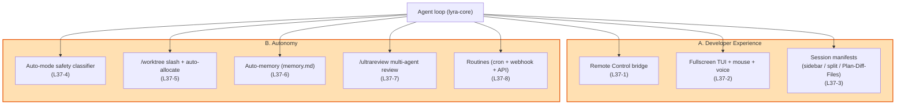

# LYRA — v3.7 Claude-Code-2026 Parity Plan

> **Living-knowledge supplement to Lyra's roadmap.** Adds phases
> **L37-1 through L37-8** porting the May-2026 Claude Code feature
> wave (Dickson Tsai's announcement at the Anthropic event) into Lyra
> while preserving Lyra's existing primitives (`acp/`, `subagent/`,
> `cron/`, `permissions/`, `terminal/`, `sessions/`, `memory/`,
> `brains/`).
>
> Read alongside [`docs/roadmap-v1.5-v2.md`](docs/roadmap-v1.5-v2.md)
> and [`CHANGELOG.md`](CHANGELOG.md) §`v3.6.0 — Four-mode rename`
> (the immediate predecessor where `auto_mode` was introduced as a
> *mode label*; v3.7 makes it real with a classifier).

---

## §0 — Why this supplement

Lyra's v3.6.0 rename set the four-mode taxonomy
(`edit_automatically / ask_before_edits / plan_mode / auto_mode`) but
left several Claude-Code-grade ergonomics and autonomy primitives
unimplemented or only partially scaffolded. v3.7 closes the gap to
the May-2026 feature wave Anthropic announced via Dickson Tsai.

### Two themes (mirror the announcement)

| Theme | Phases |
|---|---|
| **A. Developer Experience (DX)** | L37-1 Remote control · L37-2 Flicker-free fullscreen + mouse + voice · L37-3 UI refresh (sidebar / split view / Plan-Diff-Files) |
| **B. Autonomy** | L37-4 Auto-mode safety classifier · L37-5 `/worktree` slash + auto-allocate · L37-6 Auto-memory · L37-7 `/ultrareview` · L37-8 Routines (cron + webhook + API) |

### Position in the May-2026 landscape

| What Anthropic ships | What Lyra v3.7 must match |
|---|---|
| Remote Control — start a session locally, drive from web/mobile | A bridge over the existing ACP server that lets a session be *attached* and *relayed* from a second client |
| Flicker-free fullscreen + mouse + voice | A fullscreen renderer that updates via diff-blocks (no full-screen reflows); typed mouse events; a voice-mode adapter contract |
| UI refresh — sidebar / split view / Plan / Diff / Files | Typed view manifests on top of the existing `sessions/` store so the CLI and any web client render the same shape |
| Auto mode (classifier-based command admit) | A real safety classifier replacing the v3.6 heuristic — matches destructive-pattern / prompt-injection / side-effect signals to an `auto / ask / refuse` verdict |
| Worktrees | A `/worktree` slash command on top of `WorktreeManager`; copy-policy for `node_modules` etc.; auto-allocate when running parallel skills |
| Auto memory | A `memory.md` per project that auto-accumulates project knowledge (build commands, common errors, preferences) and is retrieved at session start |
| Code review (PR + `/ultrareview`) | A multi-agent review pipeline that wraps the existing `/review` slash; `/ultrareview` adds adversarial cross-family review + summary |
| Routines (cron + webhook + API) | Lyra's cron extended with typed `RoutineTrigger` (cron / github_webhook / http_api) and a routine registry |

### Identity — what does NOT change

The Lyra invariants stay verbatim — four-mode taxonomy
(`edit_automatically / ask_before_edits / plan_mode / auto_mode`),
two-tier model split (`fast` / `smart`), 5-layer context, NGC
compactor, hook lifecycle, SKILL.md loader, subagent worktrees,
TDD plugin gate. v3.7 only **adds**.

---

## §1 — Architecture



### Package map (deltas vs v3.6)

| Package | Status |
|---|---|
| `lyra-core/acp` | **Extended (L37-1)** — `remote_control.py` |
| `lyra-core/terminal` | **Extended (L37-2)** — `fullscreen.py` + mouse + voice contracts |
| `lyra-core/sessions` | **Extended (L37-3)** — `manifest.py` typed views |
| `lyra-core/permissions` | **Extended (L37-4)** — `auto_classifier.py` |
| `lyra-cli/interactive` | **Extended (L37-5 + L37-7)** — `worktree_command.py` + `ultrareview_command.py` |
| `lyra-core/memory` | **Extended (L37-6)** — `auto_memory.py` |
| `lyra-core/brains` | **Extended (L37-7)** — `ultrareview.py` |
| `lyra-core/cron` | **Extended (L37-8)** — `routines.py` |

---

## §2 — Phases L37-1 through L37-8

### L37-1 — Remote Control bridge over ACP

**Why now.** Lyra's `acp/server.py` ships a JSON-RPC handshake but no
session-attach / relay surface. Claude Code's Remote Control lets a
local session be driven from a second client (web / mobile). The
bridge is the smallest surface that makes this work without breaking
the existing protocol.

**Concrete deliverables.**

```text
packages/lyra-core/src/lyra_core/acp/
  remote_control.py        # NEW — RemoteSession + AttachToken + RelayHub
                           # session_id, attach_token, attach_url
                           # methods: attach(token) → RelayChannel,
                           #          detach(channel_id), relay(msg)
```

**Bright-line gates added.**

```
LBL-RC-AUTH        A remote attach refuses without a fresh attach_token
                   (default TTL 5 min); replay attempts surface as a
                   structured RemoteAuthError.
LBL-RC-SCOPE       The bridge refuses any tool call whose action_kind
                   is not in the session's pre-approved set; remote
                   clients cannot upgrade their own scope.
```

**Effort.** ~1.5 weeks.

---

### L37-2 — Flicker-free fullscreen TUI + mouse + voice

**Why now.** Lyra renders via Rich + prompt_toolkit; long-text updates
flicker in non-fullscreen mode. Claude Code's announcement explicitly
calls out fullscreen + mouse + voice. Lyra ships the *contract*; the
production renderer composes Rich's `Live` with explicit diff-blocks.

**Concrete deliverables.**

```text
packages/lyra-core/src/lyra_core/terminal/
  fullscreen.py             # NEW — FullscreenRenderer (diff-block API)
                            # DiffBlock(start_row, end_row, text)
                            # apply([blocks]) writes only changed rows.
  events.py                 # NEW — typed mouse + voice events
                            # MouseEvent(kind=click/scroll/move, x, y, button)
                            # VoiceEvent(kind=transcript/silence/wake, text)
```

**Effort.** ~1 week.

---

### L37-3 — UI refresh: session manifests

**Why now.** The Claude Code UI ships a sidebar (filter / group / open
in window), split view (drag-drop), and three view modes (Plan / Diff
/ Files). Lyra's CLI cannot render those, but it can ship the *typed
manifest* that the CLI and any web client consume to render
identically.

**Concrete deliverables.**

```text
packages/lyra-core/src/lyra_core/sessions/
  manifest.py               # NEW — SessionGroup, SessionFilter,
                            # SplitLayout, ViewKind (PLAN / DIFF / FILES),
                            # ViewManifest, SessionDirectory.
```

**Effort.** ~1 week.

---

### L37-4 — Auto-mode safety classifier

**Why now.** v3.6.0 introduced `auto_mode` as a *mode label* with a
heuristic router stub. v3.7 ships a real classifier: pattern-matching
on destructive shell commands, prompt-injection markers, and
side-effecting tool kinds; verdict is `AUTO_RUN / ASK / REFUSE`.

**Concrete deliverables.**

```text
packages/lyra-core/src/lyra_core/permissions/
  auto_classifier.py        # NEW — AutoModeClassifier
                            # .evaluate(action) -> AutoVerdict
                            # signals:
                            #   - destructive shell pattern
                            #   - prompt-injection markers
                            #   - irreversible side effect
                            #   - sensitive path / domain
```

**Bright-line gate added.**

```
LBL-AUTO-REFUSE    Any command tripping the classifier's destructive
                   or prompt-injection signal is REFUSED in auto_mode
                   regardless of bypass flags. ASK requires the user
                   to confirm; AUTO_RUN proceeds.
```

**Effort.** ~1.5 weeks.

---

### L37-5 — `/worktree` slash command + auto-allocate

**Why now.** Lyra's `WorktreeManager` (`subagent/worktree.py`) exists
but is not directly user-addressable — only the subagent orchestrator
allocates. Claude Code's announcement makes worktrees a first-class
user surface (`/worktree`, copy node_modules).

**Concrete deliverables.**

```text
packages/lyra-cli/src/lyra_cli/interactive/
  worktree_command.py       # NEW — WorktreeCommand
                            # /worktree create [name]    → allocate
                            # /worktree list             → show active
                            # /worktree remove <name>    → detach
                            # copy_policy: node_modules / .venv / dist.
```

**Effort.** ~1 week.

---

### L37-6 — Auto-memory (`memory.md`)

**Why now.** Lyra has procedural memory (SQLite FTS5 in `memory/`),
but no per-project flat-file `memory.md` that auto-accumulates project
knowledge across sessions. Claude Code's auto-memory is a *file* the
agent reads at session start; v3.7 ports the shape.

**Concrete deliverables.**

```text
packages/lyra-core/src/lyra_core/memory/
  auto_memory.py            # NEW — AutoMemory: append-only
                            # ~/.lyra/memory/<project>/memory.md
                            # types: user / feedback / project / reference
                            # methods: save(type, text), retrieve(query)
                            # session_start_hook → reads top-N relevant.
```

**Effort.** ~1.5 weeks.

---

### L37-7 — `/ultrareview` multi-agent review

**Why now.** Lyra's CLI and brains/registry already reference
`/ultrareview` but the implementation is a placeholder. v3.7 ships
the real pipeline: collect git diff → cross-family multi-agent review
→ summary report.

**Concrete deliverables.**

```text
packages/lyra-core/src/lyra_core/brains/
  ultrareview.py            # NEW — UltraReviewPipeline
                            # stages: collect_diff, multi_agent_review,
                            #         aggregate, summarise.

packages/lyra-cli/src/lyra_cli/interactive/
  ultrareview_command.py    # NEW — /ultrareview slash
                            # /ultrareview            → current branch
                            # /ultrareview <pr-id>    → GitHub PR
```

**Effort.** ~2 weeks.

---

### L37-8 — Routines (cron + webhook + API triggers)

**Why now.** Lyra's `cron/` covers schedule-only triggers. Claude
Code's Routines extend to GitHub webhooks and HTTP API triggers
(e.g. "scan issues at 5pm" or "run on every push").

**Concrete deliverables.**

```text
packages/lyra-core/src/lyra_core/cron/
  routines.py               # NEW — Routine spec + RoutineRegistry
                            # triggers: CronTrigger, GitHubWebhookTrigger,
                            #           HttpApiTrigger
                            # actions: invoke a registered workflow with
                            #          a typed argument schema.
```

**Bright-line gates added.**

```
LBL-ROUTINE-AUTH   A routine triggered via webhook or API requires a
                   matching HMAC signature. Unsigned triggers are
                   refused with a structured RoutineAuthError.
LBL-ROUTINE-COST   Routine invocations count against the program's
                   cost envelope; over-cap firings are deferred not
                   skipped.
```

**Effort.** ~2 weeks.

---

## §3 — Cross-cutting invariants (added by v3.7)

1. **Remote attach never escalates scope.** A remote client cannot
   upgrade the local session's permission mode, period.
2. **Auto-mode is classifier-driven, not heuristic.** Every action in
   `auto_mode` runs through the classifier; no implicit allow.
3. **Auto-memory is append-only.** Past entries never mutate; rewrites
   create new dated entries. Deletion is explicit and tombstoned.
4. **Routines authenticate every trigger.** No unsigned webhook or API
   call fires a routine.

---

## §4 — Sequencing

| Wave | Phases | Effort |
|---|---|---|
| **W0** | L37-4 Auto-mode classifier · L37-6 Auto-memory · L37-5 /worktree | ~4 weeks |
| **W1** | L37-1 Remote Control · L37-2 Fullscreen TUI · L37-8 Routines | ~4.5 weeks |
| **W2** | L37-3 UI manifests · L37-7 /ultrareview | ~3 weeks |

Total: **~11.5 weeks of person-time** for the v3.7 surface.

---

## §5 — Success criteria for v3.7 as a whole

- ✅ Remote-control attach round-trips through the JSON-RPC bridge with
  HMAC-signed tokens.
- ✅ Fullscreen renderer applies diff-blocks without flicker on a
  planted long-text fixture.
- ✅ Session manifests render identically from the CLI and a synthetic
  web client.
- ✅ Auto-mode classifier catches 100% of a planted destructive +
  injection corpus; allows benign reads.
- ✅ `/worktree create` allocates, copies node_modules, and persists
  state across CLI restarts.
- ✅ `auto_memory` records cross-session facts and surfaces them at
  next session start.
- ✅ `/ultrareview` runs end-to-end on a planted diff fixture with
  cross-family review.
- ✅ Routines fire on a synthetic webhook + API trigger; HMAC auth
  enforced.
