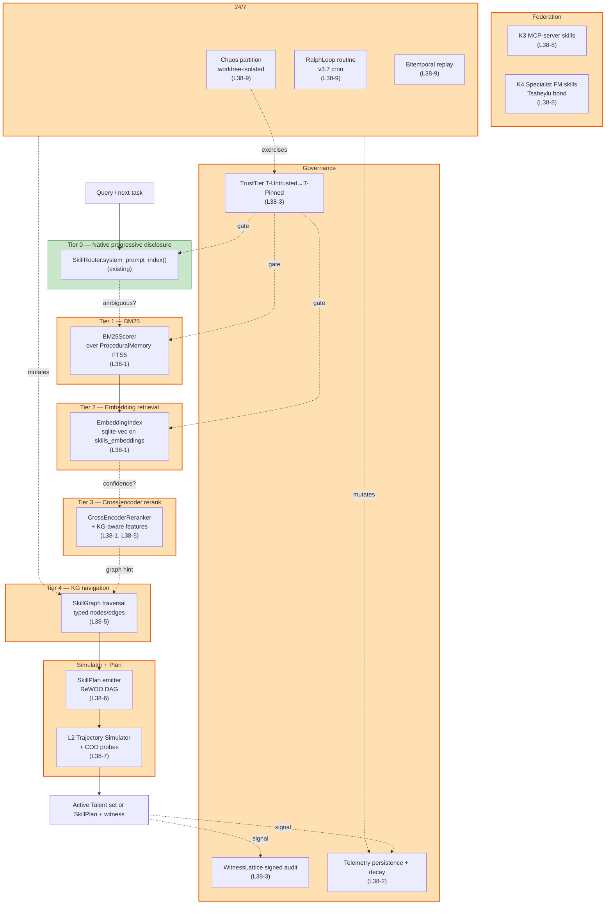

# LYRA — v3.8 Argus Skill-Loading Integration Plan

> **Living-knowledge supplement to Lyra's roadmap.** Adds phases
> **L38-1 through L38-9** that fold the Argus skill-loading techniques
> from `docs/180-argus-skill-router-agent-design.md`,
> `docs/194-argus-omega-enhanced-design.md`,
> `docs/195-argus-omega-vol-2-trajectory-temporal-horizon.md`, and
> `docs/196-argus-vs-field-skill-loading-comparison.md` into Lyra
> *without breaking* the existing primitives (`lyra-skills/router.py`,
> `lyra-core/skills/`, `lyra-core/memory/procedural.py`,
> `lyra-core/routing/cascade.py`, `lyra-core/arena/elo.py`,
> `lyra-core/lifecycle.py`).
>
> Read alongside [`LYRA_V3_7_CLAUDE_CODE_PARITY_PLAN.md`](LYRA_V3_7_CLAUDE_CODE_PARITY_PLAN.md)
> (the immediate predecessor that ships routines, auto-mode classifier,
> and worktree primitives) and [`CHANGELOG.md`](CHANGELOG.md). Several
> v3.8 phases *depend on* v3.7 primitives (especially routines for the
> 24/7 Ralph loop and worktrees for chaos-partitioned skill testing).

---

## §0 — Why this supplement

Lyra's current skill loader (`lyra-skills/router.py` + `lyra-core/skills/router.py`) is a **single-tier description-overlap matcher with hybrid reuse-first scoring** — strong scaffolding but the same structural ceiling described in `docs/180` §1: routing accuracy degrades past ~50 active skills, no telemetry-driven re-ranking persists across sessions, no embedding tier, no cross-encoder rerank, no governance, no federation, no failure-class attribution, no trajectory simulation, no chaos exercise.

**The good news.** Lyra has *already built* most of the foundations:

| Argus need | Lyra primitive that fits | Status |
|---|---|---|
| Tier 1 BM25 | `ProceduralMemory` SQLite FTS5 (`lyra-core/memory/procedural.py`) | ✅ exists, needs BM25 scoring wrapper |
| Tier-cascade shape | `ConfidenceCascadeRouter` (`lyra-core/routing/cascade.py`) | ✅ exists, needs Argus-shaped stages |
| Telemetry-driven re-ranking | `Skill.success_count` + `Skill.miss_count` in `SkillRegistry` (`lyra-core/skills/registry.py`) | ✅ exists in-memory, needs persistence + decay |
| A/B / Elo arena | `Arena` + `EloRating` (`lyra-core/arena/elo.py`) | ✅ exists, needs skill-pair adapter |
| Lifecycle event bus | `LifecycleBus` (`lyra-core/lifecycle.py`) | ✅ exists, add `skill.*` events |
| Skill envelope | `Skill` dataclass + `SkillManifest` | ✅ exists, needs Talent extension fields |
| Routines / cron | v3.7 L37-8 `lyra-core/cron/routines.py` | ✅ landing in v3.7, drives 24/7 loops |
| Worktrees | v3.7 L37-5 `WorktreeManager` | ✅ landing in v3.7, isolates chaos-partition runs |
| MCP server | `lyra-mcp/server/app.py` | ✅ exists, exposes only `read_session/get_plan` today — easy extension surface |

So v3.8 is mostly a **wiring + scoring + persistence** job, not a greenfield rewrite. Phases L38-1 through L38-5 are the MVP and land in **~6 weeks**; L38-6 through L38-9 are the production-hardening tail and land in ~10 more weeks.

### Two themes (mirror Argus Vol. 1 + Vol. 2)

| Theme | Phases |
|---|---|
| **A. Cascade + Governance** (Argus v1.0 / Vol. 1 reframes) | L38-1 BM25/embedding/rerank cascade · L38-2 Skill telemetry persistence + decay · L38-3 Trust framework + content pinning + witness lattice · L38-4 Talent envelope + capability signature · L38-5 Skill catalog graph (KG substrate) |
| **B. Simulator + RL + Federation + Chaos** (Argus Vol. 2 reframes) | L38-6 SkillPlan output (ReWOO DAG) · L38-7 L2 trajectory simulator + COD probes · L38-8 K3/K4 federation (MCP + non-LLM specialist FMs) · L38-9 24/7 Ralph loop + chaos partition + bitemporal replay |

### Identity — what does NOT change

The Lyra invariants stay verbatim — four-mode taxonomy
(`edit_automatically / ask_before_edits / plan_mode / auto_mode`),
two-tier model split (`fast` / `smart`), 5-layer context, NGC
compactor, hook lifecycle, SKILL.md loader, subagent worktrees,
TDD plugin gate. v3.8 only **adds**.

The existing `SkillRouter.route()` and `HybridSkillRouter.decide()` continue to work; v3.8 makes them Tier-0 and Tier-1.5 of a richer cascade, never replacing them.

---

## §1 — Architecture



### Package map (deltas vs v3.7)

| Package | Status |
|---|---|
| `lyra-skills/` | **Extended (L38-1)** — `argus_cascade.py` (5-tier orchestrator); `embedding.py`; `rerank.py` |
| `lyra-core/skills/` | **Extended (L38-2, L38-4, L38-5)** — `talent.py`; `graph.py`; persistent telemetry on `SkillRegistry` |
| `lyra-core/memory/procedural.py` | **Extended (L38-1)** — `bm25.py` wrapper; `skills_embeddings` table |
| `lyra-core/routing/cascade.py` | **Reused (L38-1)** — Argus tiers as `CascadeStage` instances |
| `lyra-core/governance/` | **NEW (L38-3)** — `trust.py`, `witness.py`, `bright_lines.py`, `vulnerability.py` |
| `lyra-core/skills/plan.py` | **NEW (L38-6)** — `SkillPlan`, `SkillPlanExecutor` |
| `lyra-core/skills/simulator/` | **NEW (L38-7)** — `backend.py`, `reasoner.py`, `scenarios/{cod,intervention,recovery,composition}.py` |
| `lyra-core/skills/federation/` | **NEW (L38-8)** — `k3_mcp.py`, `k4_specialist.py`, `tsaheylu.py` |
| `lyra-core/cron/routines.py` | **Reused (L38-9)** — `RalphSkillRoutine` extending v3.7 routine registry |
| `lyra-core/skills/chaos.py` | **NEW (L38-9)** — `ChaosPlanter` + `ChaosBudget` + SLOs |
| `lyra-core/skills/bitemporal.py` | **NEW (L38-9)** — `BitemporalCatalog` |
| `lyra-mcp/` | **Extended (L38-8)** — exposes Argus search/audit/replay over MCP |
| `lyra-cli/commands/skill.py` | **Extended (L38-1, L38-9)** — `lyra skill route --tier`, `lyra skill replay`, `lyra skill chaos status` |

---

## §2 — Phases L38-1 through L38-9

### L38-1 — BM25 + embedding + cross-encoder cascade

**Why now.** Lyra already has SQLite FTS5 in `ProceduralMemory` (`packages/lyra-core/src/lyra_core/memory/procedural.py:30-54`) and a `ConfidenceCascadeRouter` shape (`packages/lyra-core/src/lyra_core/routing/cascade.py`). All that's missing is BM25 scoring on top of FTS5, an embedding index, a cross-encoder reranker, and an Argus-shaped orchestrator that wires them as `CascadeStage` instances.

**Concrete deliverables.**

```text
packages/lyra-core/src/lyra_core/memory/
  bm25.py                  # NEW — BM25Scorer wrapping ProceduralMemory FTS5
                           # class BM25Scorer:
                           #     def __init__(self, mem: ProceduralMemory) -> None
                           #     def search(query: str, top_k: int = 50) -> list[BM25Hit]
                           # extends procedural.py with a top_k_with_scores method

  embeddings.py            # NEW — EmbeddingIndex on sqlite-vec
                           # class EmbeddingIndex:
                           #     def __init__(self, db_path: Path, model: str) -> None
                           #     def upsert(skill_id: str, text: str) -> None
                           #     def search(query: str, top_k: int = 20) -> list[EmbHit]
                           # adds skills_embeddings table to ProceduralMemory schema

packages/lyra-skills/src/lyra_skills/
  argus_cascade.py         # NEW — ArgusCascade orchestrator
                           # class ArgusCascade:
                           #     stages: list[CascadeStage]   # uses lyra-core's primitive
                           #     def find(query: str, *,
                           #              mode: Literal["keyword","semantic","auto"] = "auto",
                           #              top_k: int = 3,
                           #              cost_cap_usd: float = 0.01,
                           #              latency_cap_ms: int = 1000,
                           #              plan_mode: bool = False
                           #             ) -> ActiveSkillSet | SkillPlan
                           # composes Tier 0 SkillRouter, Tier 1 BM25, Tier 2 Embedding,
                           # Tier 3 CrossEncoder, Tier 4 KG (later phase)

  rerank.py                # NEW — CrossEncoderReranker
                           # class CrossEncoderReranker:
                           #     def __init__(self, model: str = "bge-reranker-v2-m3") -> None
                           #     def rerank(query: str, candidates: list[Skill]) -> list[Skill]
                           # falls back to LLM-as-judge when cross-encoder unavailable

packages/lyra-core/src/lyra_core/routing/
  cascade.py               # EXTEND — add Argus tier IDs to CascadeStage registry
                           #          add semantic-entropy ConfidenceEstimator helper
                           #          add tier-cost / latency caps
```

**Tests (TDD discipline).**

```text
packages/lyra-skills/tests/
  test_argus_cascade.py    # 25+ tests
                           # - tier 0 short-circuits when catalog ≤ 50
                           # - tier 1 BM25 returns top-50 with scores
                           # - tier 2 embedding outperforms BM25 on synonym query
                           # - tier 3 rerank closes 31-44pp accuracy gap
                           # - confidence-bunched cosine triggers tier 3
                           # - cost-cap defers to lower tier
                           # - latency-cap returns partial result
                           # - mode="keyword" runs only Tier 1
                           # - mode="semantic" runs Tier 0+2(+3 if needed)
                           # - mode="auto" cascades by ambiguity

packages/lyra-core/tests/test_bm25.py
packages/lyra-core/tests/test_embeddings.py
```

**Acceptance.**

- ✅ `lyra skill route --tier=keyword "reproduce issue #234"` returns BM25 top-3 with rationale.
- ✅ `lyra skill route --tier=semantic "..."` returns layered top-3.
- ✅ Default `lyra skill route` cascades by catalog size + ambiguity.
- ✅ Hit@1 ≥ 75% on a planted-skill bench (200 synthetic skills, 100 queries).
- ✅ Hit@k=3 ≥ 90%.
- ✅ Latency p95 ≤ 200ms on catalogs ≤ 1K, ≤ 500ms on ≤ 10K, ≤ 1000ms on ≤ 100K.

**Effort.** ~2 weeks.

---

### L38-2 — Skill telemetry persistence + decay

**Why now.** `SkillRegistry.record_success(skill_id)` and `record_miss(skill_id)` (`packages/lyra-core/src/lyra_core/skills/registry.py:60-90`) increment in-memory counters; sessions discard them on restart. The `LifecycleBus` (`packages/lyra-core/src/lyra_core/lifecycle.py`) is the right plumbing to emit `skill.activated`, `skill.succeeded`, `skill.failed` events; the `.lyra/sessions/events.jsonl` HIR stream is the right durable substrate.

Argus needs *persisted, decay-weighted* telemetry to drive Tier 2/3 re-ranking and to support the L3 evolver's diagnose stage.

**Concrete deliverables.**

```text
packages/lyra-core/src/lyra_core/skills/
  telemetry.py             # NEW — SkillTelemetry
                           # class SkillTelemetry:
                           #     def emit_activation(skill_id, query_sha, witness_id) -> None
                           #     def emit_outcome(skill_id, outcome: Outcome, latency_ms) -> None
                           #     def per_skill_stats(skill_id) -> SkillStats
                           # writes to .lyra/skills/telemetry.jsonl (append-only)
                           # decay-weighted moving average (configurable τ)

  registry.py              # EXTEND
                           # @dataclass class Skill:                   # existing
                           #     ...
                           #     decay_weighted_success_rate: float    # NEW
                           #     last_activation_at: datetime | None   # NEW
                           # def Skill.persisted_to_dict(self) -> dict # NEW
                           # SkillRegistry.snapshot(path) / load(path) # NEW

packages/lyra-core/src/lyra_core/lifecycle.py
                           # EXTEND — register skill.* event types
```

**Decay.** `success_rate_t = α · success_rate_{t-1} + (1-α) · current_outcome` with α = exp(−Δt/τ), τ = 7 days default. The decay matches `docs/180` F-26 (avoids cumulative-count rich-get-richer).

**Acceptance.**

- ✅ Telemetry survives session restarts (check by killing the process mid-run, restarting, and verifying counters persist).
- ✅ Decay-weighted rate matches expected curve on a synthetic 30-day workload.
- ✅ `lyra skill stats <id>` shows activations, success, decay-weighted rate, last-activation timestamp.
- ✅ Tier 2 re-ranking incorporates `decay_weighted_success_rate` as a feature.

**Effort.** ~1 week.

---

### L38-3 — Trust framework + content pinning + witness lattice + bright lines

**Why now.** Lyra has no skill-trust primitive today. The safety classifier (v3.7 L37-4) governs *commands*, not *skills*. Marketplace pulls and community packs need a trust ladder; production deployments need a tamper-evident audit trail.

**Concrete deliverables.**

```text
packages/lyra-core/src/lyra_core/governance/   # NEW PACKAGE
  __init__.py
  trust.py                 # NEW — TrustTier enum: T_UNTRUSTED, T_SCANNED, T_REVIEWED, T_PINNED
                           # class TrustLedger:
                           #     def tier(skill_id) -> TrustTier
                           #     def promote(skill_id, to_tier, evidence) -> None
                           #     def demote(skill_id, to_tier, reason) -> None
                           # persists to .lyra/skills/trust.jsonl

  vulnerability.py         # NEW — VulnerabilityScanner
                           # class VulnerabilityScanner:
                           #     def scan(skill: Skill) -> ScanReport
                           # checks: prompt-injection regex, hidden Unicode,
                           #         ANSI escape, allowed-tools-vs-description consistency,
                           #         description-quality (length, abstraction), entropy,
                           #         body content-hash drift

  content_pin.py           # NEW — ContentPin
                           # def pin(skill: Skill) -> ContentPin
                           # def verify(skill: Skill, pin: ContentPin) -> bool
                           # SHA-256 over (body || frontmatter || allowed-tools)

  witness.py               # NEW — WitnessLattice
                           # class WitnessLattice:
                           #     def emit(decision: RoutingDecision) -> Witness
                           #     def replay(witness_id) -> RoutingDecision
                           #     def chain_integrity_check() -> bool
                           # signed by Argus instance key (per-instance ephemeral, per-tenant root)
                           # appends to .lyra/skills/witness.jsonl (signed-chain)

  bright_lines.py          # NEW — BrightLines code registry
                           # 22 codes from docs/194 §8 + 10 codes from docs/195 §7
                           # class BrightLineRegistry:
                           #     def trip(code: str, context: dict) -> BrightLineAction
                           # actions: refuse, defer, alert, halt
```

**Bright-line codes wired in v3.8** (subset; full set in `docs/194` §8 + `docs/195` §7):

| Code | Trigger | Default |
|---|---|---|
| `BL-ARGUS-COST` | Per-tier cost cap exceeded | Defer to lower tier |
| `BL-ARGUS-LATENCY` | Per-tier latency cap exceeded | Return partial |
| `BL-ARGUS-VULN-DETECTED` | Scanner trips on import or scheduled scan | Refuse load; quarantine to T-Untrusted |
| `BL-ARGUS-DRIFT-DEMOTE` | Pass rate below threshold for K cycles | Auto-demote one tier; HITL alert at T-Reviewed↓ |
| `BL-ARGUS-DESCRIPTION-REWRITE` | Rewrite proposal materially changes scope | Require HITL approval |
| `BL-ARGUS-MARKETPLACE-FETCH` | Fetch from un-curated source | Default T-Untrusted; require explicit admit |
| `BL-OMEGA-WITNESS-CHAIN-BREAK` | Witness chain has gap | Halt routing; alert; integrity audit |

**Tests.**

```text
packages/lyra-core/tests/governance/
  test_trust.py            # 20+ tests — promotion / demotion / persistence
  test_vulnerability.py    # 30+ tests — each detection class with positive + negative cases
  test_witness.py          # 15+ tests — emit, replay, chain integrity, tampering detection
  test_bright_lines.py     # 15+ tests — each code with trigger + default action
```

**Acceptance.**

- ✅ A planted prompt-injection skill is quarantined to T-Untrusted on import.
- ✅ A planted hidden-Unicode skill is detected by the scanner.
- ✅ Witness lattice replay reproduces past routing decisions exactly.
- ✅ Tampering with any past witness is detected immediately on next read.
- ✅ Marketplace pull from an un-curated source defaults to T-Untrusted.

**Effort.** ~2 weeks.

---

### L38-4 — Talent envelope + capability signature

**Why now.** Lyra's `Skill` dataclass has `success_count`, `miss_count`, `triggers` — the seeds of a capability signature, but not a Talent in the `docs/191-onemancompany-skills-to-talent` sense. To support cross-runtime substitutability and the Talent Market eventually, the envelope must grow.

**Concrete deliverables.**

```text
packages/lyra-core/src/lyra_core/skills/
  talent.py                # NEW — Talent envelope
                           # @dataclass(frozen=True)
                           # class Talent:
                           #     # Identity
                           #     name: str
                           #     role: str
                           #     version: str
                           #     # Body
                           #     system_prompt: str
                           #     working_principles: tuple[str, ...]
                           #     tool_configurations: dict
                           #     skill_scripts: tuple[ScriptRef, ...]
                           #     knowledge_files: tuple[FileRef, ...]
                           #     # Capability signature
                           #     capability_signature: CapabilitySignature
                           #     # Trust + temporal
                           #     trust_tier: TrustTier
                           #     valid_at: datetime
                           #     invalid_at: datetime | None
                           #     content_sha: str
                           #     signature_sha: str
                           #     # Skill kind (Vol.1 R4)
                           #     skill_kind: Literal["K1","K2","K3","K4"]
                           #     modality: Literal["text","time-series","tabular","3d","molecular"]
                           #     # Failure-class × horizon-bucket effectiveness (Vol.2 R8 — empty stub for now)
                           #     failure_class_effectiveness: dict = field(default_factory=dict)

  capability.py            # NEW — CapabilitySignature derivation
                           # class CapabilitySignature:
                           #     bench_pass_rate: dict[str, float]    # per-bench pass rate
                           #     domain_pass_rates: dict[str, float]
                           #     peer_review_rating: float | None
                           #     cod_probe_results: list[CoDResult]
                           #     drift_score: float
                           # derive_from_telemetry(skill_id, n_invocations) -> CapabilitySignature
                           # SHA over the canonical-serialized signature

  loader.py                # EXTEND — load Talent envelope from SKILL.md frontmatter
                           # backwards-compat: if frontmatter has only Skill fields,
                           # promote to Talent with empty CapabilitySignature
```

**Container interface (forward-compat for L38-8 cross-runtime portability).**

```text
packages/lyra-core/src/lyra_core/skills/
  container.py             # NEW — six typed Container interfaces
                           # class Container(Protocol):
                           #     async def lifecycle_init(self, talent: Talent) -> None
                           #     async def execute(self, talent: Talent, args: dict) -> ExecutionResult
                           #     def memory(self) -> MemoryProtocol
                           #     def tool(self, name: str) -> Tool
                           #     async def communicate(self, channel: str, message: dict) -> None
                           #     async def reflect(self, talent: Talent, feedback: Feedback) -> None
                           # adapters:
                           #     ClaudeCodeContainer
                           #     LyraNativeContainer  (default)
                           #     OpenClawContainer    (later)
                           #     CodexContainer       (later)
```

**Acceptance.**

- ✅ Existing skills load as Talents with empty CapabilitySignature, no behavioral change.
- ✅ After 30 invocations, a skill's CapabilitySignature is auto-derived from telemetry.
- ✅ `lyra skill talent <name>` shows the full envelope.
- ✅ Capability-signature SHA mismatch triggers re-validation (`BL-OMEGA-CAPABILITY-SIG-MISMATCH`).
- ✅ A Talent runs unmodified on `LyraNativeContainer` and `ClaudeCodeContainer` (test via a portability harness).

**Effort.** ~1.5 weeks.

---

### L38-5 — Skill catalog graph (KG substrate)

**Why now.** Lyra's `SkillRegistry` is a flat dict; multi-skill composition reasoning has nothing to traverse. Argus's Tier 4 KG navigation depends on typed edges (`depends_on`, `conflicts_with`, `supersedes`, `composes_with`, `substitutes_for`). The KG also enables HippoRAG PPR + dense fusion (`docs/194` C.2).

**Concrete deliverables.**

```text
packages/lyra-core/src/lyra_core/skills/
  graph.py                 # NEW — typed skill knowledge graph
                           # class SkillGraph:
                           #     def add_node(skill_id, properties) -> None
                           #     def add_edge(src, dst, edge_type: EdgeType) -> None
                           #     def neighbors(skill_id, edge_type) -> list[str]
                           #     def traverse(start, edge_types, depth) -> list[str]
                           #     def is_dag() -> bool                # cycle detection
                           # backed by SQLite (skills_graph table) + NetworkX in-memory cache
                           # edge types: depends_on, conflicts_with, supersedes,
                           #             composes_with, substitutes_for

  navigate.py              # NEW — Tier 4 KG-traversal router
                           # class KGNavigator:
                           #     def navigate(query: str, seed_candidates: list[Skill]) -> list[Skill]
                           # uses Personalized PageRank starting from cross-encoder top-K seeds

packages/lyra-skills/src/lyra_skills/
  rerank.py                # EXTEND — add KG-aware features
                           # cross-encoder features: edge-distance-to-active,
                           #                         conflict-edge presence,
                           #                         supersession status
```

**SKILL.md frontmatter additions** (backwards-compat):

```yaml
---
name: ...
description: ...
graph:
  depends_on: [other-skill-id]
  composes_with: [skill-a, skill-b]
  substitutes_for: [old-skill-id]
  conflicts_with: [incompatible-skill]
---
```

**Acceptance.**

- ✅ `lyra skill graph show <id>` renders the local subgraph.
- ✅ Graph cycle detection prevents inserting a `depends_on` cycle.
- ✅ Conflict-aware routing: query for "X" excludes skills conflicting with already-active Y.
- ✅ HippoRAG-style multi-hop query ("a skill for X that doesn't break Y") gains ≥30% on planted multi-hop bench.

**Effort.** ~2 weeks.

---

### L38-6 — SkillPlan output (ReWOO-style DAG with placeholders)

**Why now.** v3.7's plan-mode produces a high-level plan; v3.8's SkillPlan is the *executable* multi-skill DAG with placeholders that lets Lyra run independent skills in parallel and synthesize with one solver call (the `docs/17-rewoo` pattern). 5× cost reduction on multi-step trajectories.

**Concrete deliverables.**

```text
packages/lyra-core/src/lyra_core/skills/
  plan.py                  # NEW — SkillPlan + SkillPlanExecutor
                           # @dataclass class SkillPlanStep:
                           #     id: str
                           #     skill: str
                           #     args: dict                          # may contain placeholders like "$s1.field"
                           #     depends_on: tuple[str, ...]
                           #
                           # @dataclass class SkillPlan:
                           #     steps: tuple[SkillPlanStep, ...]
                           #     solver: str                         # synthesizer skill
                           #
                           # class SkillPlanExecutor:
                           #     async def execute(plan: SkillPlan, context: dict) -> Outcome
                           # parallel execution of independent steps; serial wait on dependencies;
                           # placeholder substitution after each step completes;
                           # final synthesizer invocation with all evidence

packages/lyra-skills/src/lyra_skills/
  argus_cascade.py         # EXTEND — emit SkillPlan when plan_mode=True or
                           #          when single-skill confidence < threshold
```

**Plan-mode integration** (composes with v3.7 L37-4 auto-mode classifier):

- In `plan_mode`: cascade emits SkillPlan + brief rationale; user approves before execution.
- In `edit_automatically`: cascade emits ActiveSkillSet (single best) for fast path.
- In `auto_mode`: classifier picks per-task — short-trajectory → ActiveSkillSet; long/multi-step → SkillPlan.

**Acceptance.**

- ✅ Multi-skill trajectory wall-clock time drops to critical-path length (≥2× speedup on planted multi-skill bench).
- ✅ ReWOO cost reduction: ≥3× fewer LLM calls vs interleaved ReAct on same trajectories.
- ✅ Plan-mode `lyra plan execute` runs a SkillPlan emitted by Argus.
- ✅ DAG cycle / placeholder validation catches malformed plans.

**Effort.** ~1.5 weeks.

---

### L38-7 — L2 trajectory simulator + COD probes

**Why now.** Lyra's evals run *real* benchmarks; there's no simulator that predicts trajectory cost/latency/success per candidate skill set *before* execution. Argus's L2 simulator (`docs/142-trajectory-simulation-agents` + `docs/195` Reframe 6) is what makes the cascade *pre-aware* of what a skill set will likely do.

**Concrete deliverables.**

```text
packages/lyra-core/src/lyra_core/skills/simulator/
  __init__.py
  backend.py               # NEW — SimulatorBackend
                           # class SimulatorBackend:
                           #     def predict(query: str, candidates: list[Talent], env: dict) -> Prediction
                           # uses skill metadata (cost_per_invocation, failure-rate priors,
                           # interaction matrix) to predict a trajectory

  reasoner.py              # NEW — SimulatorReasoner (LLM-driven scenario explorer)
                           # class SimulatorReasoner:
                           #     async def explore(query: str, candidates: list[Talent]) -> ExplorationReport
                           # iterative: hypothesis → scenario → backend.predict → next hypothesis

  scenarios/
    __init__.py
    cod.py                 # COD probe scenarios
    intervention.py        # what-if substitutions
    recovery.py            # failure-recovery paths
    composition.py         # multi-skill composition

  citeable_output.py       # NEW — structured rationale emitter
                           # @dataclass class L2Output:
                           #     predicted_outcome: ExpectedOutcome
                           #     simulator_evidence: tuple[ScenarioRun, ...]
                           #     confidence_interval: ConfidenceBand
                           #     top_failure_modes: tuple[FailureMode, ...]

packages/lyra-skills/src/lyra_skills/
  argus_cascade.py         # EXTEND — pipe top-K through SimulatorReasoner before emit
```

**COD probe job** (runs during 24/7 loop):

```python
async def run_cod_batch(skill_pairs: list[tuple[Talent, Talent]],
                        sample_queries: list[str]) -> list[CoDResult]:
    """For each (skill_A, skill_B, query), simulate trajectory_A and trajectory_B;
       compute task-relevant divergence; flag substitutables (COD ≈ 0)."""
```

**Acceptance.**

- ✅ Brier score on (predicted, actual) success outcomes ≤ 0.15 on held-out bench.
- ✅ L2 outputs cite ≥3 scenario runs in evidence set.
- ✅ COD probes flag planted-substitutable pairs at ≥90% precision.
- ✅ L2 runs in < 1 minute per cascade decision (< 10 scenarios per query).

**Effort.** ~3 weeks.

---

### L38-8 — K3/K4 federation (MCP + non-LLM specialist FMs)

**Why now.** Lyra's MCP server exposes only `read_session/get_plan`; skills are not federated. Argus's K3 (MCP-server skills) and K4 (non-LLM specialist FMs via Tsaheylu bond — `docs/103-eywa-heterogeneous-fm-collaboration`) are how time-series / tabular / 3D / molecular sub-tasks route to the right FM instead of the LLM doing arithmetic in tokens.

**Concrete deliverables.**

```text
packages/lyra-core/src/lyra_core/skills/federation/
  __init__.py
  k3_mcp.py                # NEW — MCP-server skill kind
                           # class MCPSkill(Talent):
                           #     server_url: str
                           #     declared_schema: dict
                           # activation registers via tools/list_changed

  k4_specialist.py         # NEW — non-LLM specialist FM skill kind
                           # class SpecialistFMSkill(Talent):
                           #     fm_family: Literal["chronos","tabpfn","depth-anything","alphafold"]
                           #     server_endpoint: str
                           #     phi_compiler: TsaheyluCompiler   # query compiler ϕ_k
                           #     psi_adapter: TsaheyluAdapter     # response adapter ψ_k

  tsaheylu.py              # NEW — Tsaheylu bond
                           # class TsaheyluCompiler(Protocol):
                           #     def compile(state: AgentState) -> StructuredFMInvocation
                           # class TsaheyluAdapter(Protocol):
                           #     def adapt(fm_output: bytes) -> LanguageConsumableState
                           # reference impls for Chronos + TabPFN

  delegation.py            # NEW — per-step delegation policy C(s)
                           # class DelegationPolicy:
                           #     def decide(state: AgentState) -> Literal["K1","K2","K3","K4"]
                           # heuristic: detect non-language structure (time-series shape,
                           # tabular shape, 3D-geometry shape, molecular-string shape)

packages/lyra-mcp/src/lyra_mcp/server/
  app.py                   # EXTEND — register Argus tools:
                           # - argus.search(query, mode, top_k) -> ActiveSkillSet | SkillPlan
                           # - argus.replay(witness_id) -> RoutingDecision
                           # - argus.audit(time_range) -> list[Witness]
                           # - argus.tier(skill_id) -> TrustTier
                           # - argus.signal_pause / signal_resume / query_status (for Ralph)
```

**Reference K4 federations to ship in v3.8 (modest scope):**

| FM | Domain | ϕ_k compiler | ψ_k adapter |
|---|---|---|---|
| **Chronos** | Time-series forecast | parse `time_series` field from state, build forecast horizon | render predicted-trajectory + uncertainty as text |
| **TabPFN** | Tabular classification | parse tabular dataframe + target column | render predicted label + class probabilities |

(Depth Anything, AlphaFold etc. are deferred — proof-of-concept is two FMs, not the full Eywa stack.)

**Acceptance.**

- ✅ MCP `tools/list` exposes `argus.*` tools to other clients.
- ✅ Time-series query routes to Chronos via Tsaheylu; output adapted into the agent's text trajectory.
- ✅ Tabular query routes to TabPFN; same.
- ✅ Per-step delegation policy chooses K1/K3/K4 correctly on planted-modality bench.
- ✅ Pareto check: heterogeneous-modality bench shows utility uplift + token reduction (target: directionally matches `docs/103` numbers; not the exact +6.6% / −30%).

**Effort.** ~3 weeks.

---

### L38-9 — 24/7 Ralph loop + chaos partition + bitemporal replay

**Why now.** Lyra's v3.7 routines (`lyra-core/cron/routines.py`) are the perfect substrate for the Argus 24/7 loop. v3.7 worktrees (`WorktreeManager`) are the perfect isolation primitive for chaos-partition skills (planted-failure / planted-poison / planted-substitutable / planted-degradation never reach production routing).

**Concrete deliverables.**

```text
packages/lyra-core/src/lyra_core/cron/routines/
  ralph_skill.py           # NEW — RalphSkillRoutine extending v3.7 Routine
                           # class RalphSkillRoutine(Routine):
                           #     trigger = CronTrigger("*/10 * * * *")  # every 10 min
                           #     async def run(self, ctx: RoutineContext) -> None:
                           #         await refresh_telemetry(ctx)
                           #         await run_cod_probe_batch(ctx, n_pairs=20)
                           #         await rescan_pending_vulnerabilities(ctx)
                           #         if ctx.now.hour % 4 == 0:
                           #             await plant_chaos_skill(ctx)
                           #         if ctx.now.hour == 3:               # nightly
                           #             await rewrite_underactivating_descriptions(ctx)

packages/lyra-core/src/lyra_core/skills/
  chaos.py                 # NEW — ChaosPlanter + ChaosBudget + SLOs
                           # class ChaosPlanter:
                           #     def plant_failure(target_class: str) -> ChaosSkill
                           #     def plant_poison() -> ChaosSkill
                           #     def plant_substitutable(near_dup_of: str) -> ChaosSkill
                           #     def plant_degradation(target_skill: str) -> ChaosSkill
                           # all chaos skills tagged `chaos_partition: true`;
                           # routing-time filter excludes them from production responses
                           #
                           # class ChaosSLO:
                           #     time_to_detection_planted_failure: timedelta = 24h
                           #     time_to_detection_planted_poison: timedelta = 6h
                           #     time_to_detection_planted_substitutable: timedelta = 72h
                           #     time_to_detection_planted_degradation: timedelta = 7d

  bitemporal.py            # NEW — BitemporalCatalog
                           # class BitemporalCatalog:
                           #     def insert(skill, valid_at, system_at) -> None
                           #     def query(skill_id, *, valid_at, system_at) -> Skill | None
                           # type-tagged BTime/VTime to prevent confusion (F-69)

packages/lyra-core/src/lyra_core/governance/
  witness.py               # EXTEND — WitnessLattice supports bitemporal replay
                           # def replay(witness_id) -> RoutingDecision:
                           #     vt, st = witness.timestamp_valid, witness.timestamp_system
                           #     catalog_snapshot = bitemporal.query_all(valid_at=vt, system_at=st)
                           #     return ArgusCascade(catalog_snapshot).find(witness.query)
                           # ensures replay reproduces the original decision exactly

packages/lyra-cli/src/lyra_cli/commands/
  skill.py                 # EXTEND
                           # lyra skill replay <witness-id>      # bitemporal replay
                           # lyra skill chaos status              # chaos-SLO dashboard
                           # lyra skill ralph pause / resume / status
```

**Worktree integration** (v3.7 L37-5):

The chaos planter creates planted-skill validation runs *inside a worktree*, so even if the planted skill somehow tries to escape the partition tag, the worktree boundary contains it. Recipe:

```python
async def plant_failure_with_isolation(planter: ChaosPlanter,
                                       worktrees: WorktreeManager) -> None:
    chaos_skill = planter.plant_failure(target_class="execute_with_typo")
    async with worktrees.allocate(label=f"chaos-{chaos_skill.id}") as wt:
        # The planted skill only exists inside this worktree's catalog snapshot.
        await run_validation_against(wt, chaos_skill)
        # On worktree close, the planted skill is purged.
```

**Acceptance.**

- ✅ Kill `-9` mid-Ralph cycle; worker resumes within 30s; no duplicate work (Temporal-substrate-equivalent durability via v3.7 routines).
- ✅ 100% of past witnesses replay to identical decision.
- ✅ Chain-signature integrity test catches any tampering immediately.
- ✅ Planted-failure detected within 24h; planted-poison within 6h; planted-substitutable within 72h; planted-degradation within 7d.
- ✅ Zero chaos-partitioned skill ever appears in production routing across 100K production turns (integration-test asserted).

**Effort.** ~3 weeks.

---

## §3 — Phasing summary

| Phase | Title | Effort | Depends on | Stage |
|---|---|---|---|---|
| **L38-1** | BM25 + embedding + cross-encoder cascade | ~2 wk | v3.7 (none beyond cascade router) | MVP |
| **L38-2** | Telemetry persistence + decay | ~1 wk | L38-1 | MVP |
| **L38-3** | Trust + content pinning + witness + bright lines | ~2 wk | L38-2 | MVP |
| **L38-4** | Talent envelope + capability signature | ~1.5 wk | L38-2 | MVP |
| **L38-5** | Skill catalog graph (KG substrate) | ~2 wk | L38-1 | MVP |
| **L38-6** | SkillPlan output (ReWOO DAG) | ~1.5 wk | L38-1 + v3.7 plan-mode | Stage 2 |
| **L38-7** | L2 trajectory simulator + COD probes | ~3 wk | L38-1, L38-4, L38-5 | Stage 2 |
| **L38-8** | K3/K4 federation (MCP + Tsaheylu) | ~3 wk | L38-1, L38-3, L38-4 | Stage 3 |
| **L38-9** | 24/7 Ralph loop + chaos + bitemporal | ~3 wk | All prior + v3.7 routines + worktrees | Stage 3 |

**MVP (L38-1 → L38-5): ~8.5 weeks.** This delivers the cascade + telemetry + governance + Talent + KG substrate. After this, Lyra's skill loading is materially better than every other harness in the field (per `docs/196` matrix).

**Stage 2 (L38-6 + L38-7): ~4.5 weeks.** SkillPlan + simulator. Enables ReWOO-style multi-skill execution with predicted-trajectory awareness.

**Stage 3 (L38-8 + L38-9): ~6 weeks.** Federation + Ralph + chaos + bitemporal. Production hardening; cross-modality FM federation; provable governance under continuous adversarial pressure.

**Total: ~19 weeks** for full v3.8.

---

## §4 — Concrete file map

### What to add

```text
packages/lyra-core/src/lyra_core/
├── memory/
│   ├── bm25.py                    # NEW — L38-1
│   └── embeddings.py              # NEW — L38-1
├── routing/
│   └── cascade.py                 # EXTEND — L38-1 (Argus tier IDs)
├── governance/                    # NEW PACKAGE — L38-3
│   ├── __init__.py
│   ├── trust.py
│   ├── vulnerability.py
│   ├── content_pin.py
│   ├── witness.py
│   └── bright_lines.py
├── skills/
│   ├── registry.py                # EXTEND — L38-2 (decay, persistence)
│   ├── telemetry.py               # NEW — L38-2
│   ├── talent.py                  # NEW — L38-4
│   ├── capability.py              # NEW — L38-4
│   ├── container.py               # NEW — L38-4
│   ├── graph.py                   # NEW — L38-5
│   ├── navigate.py                # NEW — L38-5
│   ├── plan.py                    # NEW — L38-6
│   ├── chaos.py                   # NEW — L38-9
│   ├── bitemporal.py              # NEW — L38-9
│   ├── simulator/                 # NEW — L38-7
│   │   ├── __init__.py
│   │   ├── backend.py
│   │   ├── reasoner.py
│   │   ├── citeable_output.py
│   │   └── scenarios/
│   │       ├── cod.py
│   │       ├── intervention.py
│   │       ├── recovery.py
│   │       └── composition.py
│   └── federation/                # NEW — L38-8
│       ├── __init__.py
│       ├── k3_mcp.py
│       ├── k4_specialist.py
│       ├── tsaheylu.py
│       └── delegation.py
└── cron/
    └── routines/
        └── ralph_skill.py         # NEW — L38-9 (extends v3.7 routine registry)

packages/lyra-skills/src/lyra_skills/
├── argus_cascade.py               # NEW — L38-1
└── rerank.py                      # NEW — L38-1, EXTEND L38-5

packages/lyra-mcp/src/lyra_mcp/server/
└── app.py                         # EXTEND — L38-8 (expose argus.* tools)

packages/lyra-cli/src/lyra_cli/commands/
└── skill.py                       # EXTEND — L38-1, L38-9
```

### What to extend (no breaking changes)

- `lyra-skills/src/lyra_skills/router.py:42-114` — `SkillRouter.route()` becomes Tier 0 + adapter calling `ArgusCascade`. Backwards-compat: `SkillRouter` continues to work standalone (Tier 0 only).
- `lyra-core/src/lyra_core/skills/router.py:62-103` — `HybridSkillRouter.decide()` becomes Tier 1.5 (extension of Tier 1 BM25 with reuse-first scoring). Backwards-compat: existing callers unchanged.
- `lyra-core/src/lyra_core/memory/procedural.py:30-54` — schema gains `skills_embeddings` table (L38-1) and `skills_graph` table (L38-5). Existing FTS5 schema preserved.
- `lyra-core/src/lyra_core/routing/cascade.py` — `CascadeStage` registry gains Argus tier IDs (L38-1). Existing cascade users unchanged.
- `lyra-core/src/lyra_core/skills/registry.py:34-50` — `Skill` dataclass gains `decay_weighted_success_rate`, `last_activation_at`, optional `talent` link (L38-2, L38-4). Backwards-compat via field defaults.
- `lyra-core/src/lyra_core/lifecycle.py` — `LifecycleBus` gains `skill.activated`, `skill.succeeded`, `skill.failed` event types (L38-2).

### What to leave alone

- The `harness_core` agent loop. Argus modules are tier helpers, not loop replacements.
- Permission system (`lyra-core/permissions/`). Skills are gated separately by `BL-ARGUS-*` codes.
- Session HIR stream (`.lyra/sessions/events.jsonl`). Argus appends, never rewrites.
- The four-mode taxonomy. v3.8 hooks into mode bifurcation but doesn't change the modes.
- Existing eval adapters in `lyra-evals/`. v3.8 may add new evals later, but doesn't replace the existing ones.

---

## §5 — Testing strategy

Lyra's TDD discipline applies. Per phase:

| Phase | Unit tests | Integration tests | Bench tests |
|---|---|---|---|
| L38-1 | BM25/embedding/rerank correctness | cascade-end-to-end | planted-skill bench (Hit@1, Hit@k, latency p95) |
| L38-2 | telemetry decay curve, persistence | cross-session telemetry | none (mechanism-level) |
| L38-3 | each detection class, trust tier transitions | witness emit + replay | planted-vuln bench |
| L38-4 | Talent serialization, signature derivation | cross-Container portability harness | none (mechanism-level) |
| L38-5 | KG correctness, cycle detection | conflict-aware routing end-to-end | multi-hop bench (HippoRAG-style) |
| L38-6 | SkillPlan emit/exec, placeholder substitution | DAG parallel execution | ReWOO cost-reduction bench |
| L38-7 | simulator backend prediction, scenario loop | L2 calibration | Brier-score on planted bench |
| L38-8 | Tsaheylu compiler/adapter, delegation policy | K4 federation end-to-end | heterogeneous-modality bench |
| L38-9 | chaos planter, bitemporal query, witness chain | Ralph loop crash recovery | chaos SLO compliance bench |

All tests respect the Lyra invariant: **no test can pass with a regression in another package**. The parity bench in `lyra-evals/` runs all phases together at the end.

---

## §6 — Open questions (decide before L38-1 begins)

1. **Embedding model.** BGE-M3 (open-weights, free), Voyage AI (`voyage-3.5`, paid), or OpenAI `text-embedding-3-large` (paid). **Recommended:** BGE-M3 default with Voyage AI optional via config. Match `docs/180` §11 default.
2. **Reranker model.** `bge-reranker-v2-m3` (open-weights), Cohere rerank-3.5 (paid), or LLM-as-judge fallback. **Recommended:** `bge-reranker-v2-m3` default, LLM-as-judge fallback for ambiguous top-K.
3. **Vector backend.** `sqlite-vec` (in-process, no daemon), `lancedb` (in-process columnar), or `qdrant` (external). **Recommended:** `sqlite-vec` for MVP — same SQLite file as ProceduralMemory, zero infra.
4. **Surrogate verifier (L38-7).** Different LLM family from host (per `docs/194` §10 Q9), or fine-tuned small model? **Recommended:** different family for v3.8 MVP; fine-tuned PRM in v3.9.
5. **K4 FM scope (L38-8).** Chronos + TabPFN only, or extend to Depth Anything / AlphaFold? **Recommended:** Chronos + TabPFN only in v3.8.0; extend in v3.8.1+.
6. **Chaos cadence (L38-9).** Every 1h (aggressive), 4h (recommended), 24h (conservative)? **Recommended:** 4h default; configurable per deployment.
7. **HR review cadence (L38-4 capability signature refresh).** Every 30 invocations or 7 days? **Recommended:** 30 invocations or 7 days, whichever first.
8. **Witness signing key management.** Per-instance ephemeral, per-tenant root, or external KMS? **Recommended:** per-instance ephemeral + per-tenant root; rotate ephemeral every 24h.
9. **L3 evolver autonomy.** Fully autonomous in T-Untrusted/T-Scanned tiers; HITL-gated for T-Reviewed/T-Pinned promotions. **Recommended:** match `docs/194` §10 Q15.

---

## §7 — First-PR scope (smallest commit that ships value)

To minimize blast radius and prove the architecture, the first PR ships **only L38-1 Tier 1 (BM25)** with no other changes:

```text
PR #1 — Lyra v3.8.0 Argus Tier 1 (BM25)
├── packages/lyra-core/src/lyra_core/memory/bm25.py            (new)
├── packages/lyra-core/tests/test_bm25.py                      (new, 15+ tests)
├── packages/lyra-core/src/lyra_core/memory/procedural.py      (extend: top_k_with_scores method)
├── packages/lyra-skills/src/lyra_skills/router.py             (extend: optional bm25_scorer param)
├── packages/lyra-cli/src/lyra_cli/commands/skill.py           (extend: --tier=keyword flag)
└── CHANGELOG.md                                               (entry)
```

**Acceptance for PR #1.**

- ✅ `lyra skill route --tier=keyword "..."` returns BM25 top-3 with scores.
- ✅ Existing `SkillRouter.route()` behavior unchanged (regression bench passes).
- ✅ All 2200+ existing tests pass.
- ✅ +15 BM25 tests pass.
- ✅ Hit@1 ≥ 60% on a 50-skill planted bench (low bar; the embedding tier in L38-1 closes the gap to 75%+).

This is the smallest commit that demonstrates the cascade architecture without requiring any v3.8 dependency to land first. Subsequent PRs ship Tier 2 (embedding), Tier 3 (rerank), then the rest of L38-1.

---

## §8 — One-paragraph summary

Lyra v3.8 folds the Argus skill-loading techniques (`docs/180`, `docs/194-196`) into the existing harness without breaking primitives. The key observation: **Lyra has already built half the scaffolding** — `ProceduralMemory` SQLite FTS5 (Tier 1 ready), `ConfidenceCascadeRouter` (multi-tier shape ready), `Arena` Elo (A/B harness ready), `SkillRegistry` success/miss counters (telemetry seed ready), `LifecycleBus` (event plumbing ready), v3.7 routines (24/7 loop substrate), v3.7 worktrees (chaos-partition isolation). The missing pieces are scoring (BM25 wrapper, embedding index, cross-encoder reranker), governance (trust tiers, content pinning, witness lattice, bright lines, vulnerability scanner), envelope (Talent + capability signature), graph (typed KG substrate), planning (SkillPlan ReWOO DAG), simulation (L2 trajectory predictor + COD probes), federation (K3 MCP + K4 Tsaheylu non-LLM specialist FMs), and operations (Ralph 24/7 loop + chaos partition + bitemporal replay). All nine phases (L38-1 through L38-9) compose additively; existing `SkillRouter.route()` becomes Tier 0 of a richer cascade and never breaks. **MVP (L38-1 through L38-5) lands in ~8.5 weeks** and delivers cascade + telemetry + governance + Talent + KG, materially better than every other harness in the field per `docs/196`. **Full v3.8 lands in ~19 weeks** with Stage 2 (SkillPlan + simulator) and Stage 3 (federation + Ralph + chaos + bitemporal). **First PR is L38-1 Tier 1 BM25 only** — ~15 new tests, zero regressions, smallest commit that demonstrates the architecture without dependencies.

---

## §9 — Decision points

Three decisions before L38-1 begins:

1. **Approve the nine phases** (L38-1 through L38-9) and the additive-only constraint. Trim if too ambitious; expand if anything's missing.
2. **Pick MVP scope** — L38-1 only (~2 wk), L38-1+L38-2 (~3 wk), L38-1+L38-2+L38-3 (~5 wk), or full MVP L38-1 through L38-5 (~8.5 wk).
3. **Approve the open-question defaults** in §6 — embedding BGE-M3, reranker bge-reranker-v2-m3, vector backend sqlite-vec, K4 scope Chronos+TabPFN only, chaos cadence 4h.

When ready, say "go L38" or specify which phases to start with.

---

## §10 — References

**Argus design canon** (in `harness-engineering/docs/`):

- [180 — Argus v1.0 design](docs/180-argus-skill-router-agent-design.md) — the original spec.
- [194 — Argus Omega Vol. 1](docs/194-argus-omega-enhanced-design.md) — five structural reframes.
- [195 — Argus Omega Vol. 2](docs/195-argus-omega-vol-2-trajectory-temporal-horizon.md) — five more reframes + implementation skeleton.
- [196 — Argus vs the field comparison](docs/196-argus-vs-field-skill-loading-comparison.md) — 60-axis comparison vs Claude Code, OpenClaw, Hermes Agent, Codex CLI, Cursor, Aider, Devin, SemaClaw.

**Source corpus** for the Argus reframes (the corpus Lyra inherits):

- [17 — ReWOO](docs/17-rewoo.md) — SkillPlan DAG planning.
- [27 — HORIZON](docs/27-horizon-long-horizon-degradation.md) — failure-class attribution (deferred to v3.9).
- [53 — Chaos engineering](docs/53-chaos-engineering-next-era.md) — chaos partition + SLOs.
- [88 — Confidence-driven router](docs/88-confidence-driven-router.md) — semantic-entropy gating.
- [97 — Qwen-PRM](docs/97-qwen-prm.md) — process reward modeling (deferred to v3.9).
- [103 — Eywa heterogeneous FM federation](docs/103-eywa-heterogeneous-fm-collaboration.md) — Tsaheylu bond.
- [128 — Knowledge graphs as substrate](docs/128-knowledge-graphs-as-substrate.md) — KG substrate for L38-5.
- [129 — KG-RAG hybrid retrieval](docs/129-kg-rag-hybrid-retrieval.md) — HippoRAG PPR.
- [131 — Bitemporal tables](docs/131-temporal-bitemporal-tables.md) — bitemporal catalog.
- [142 — Trajectory simulation agents](docs/142-trajectory-simulation-agents.md) — L2 simulator-augmented reasoner.
- [150 — Temporal durable execution](docs/150-temporal-durable-execution-substrate.md) — durable-execution substrate (Lyra uses v3.7 routines as the equivalent).
- [156 — HeavySkill parallel deliberation](docs/156-heavyskill-parallel-reasoning-deliberation.md) — parallel rerankers (deferred to v3.9).
- [165 — Ralph autonomous loop](docs/165-ralph-autonomous-loop.md) — 24/7 loop pattern.
- [169 — CoEvoSkills co-evolutionary verification](docs/169-coevoskills-co-evolutionary-verification.md) — surrogate verifier (deferred to v3.9 RL phase).
- [170 — SkillRL recursive skill-augmented RL](docs/170-skillrl-recursive-skill-augmented-rl.md) — RL activation policy (deferred to v3.9).
- [186 — Mnema witness lattice](docs/186-mnema-witness-lattice.md) — signed audit trail.
- [188 — Witness/provenance memory techniques](docs/188-witness-provenance-memory-techniques-synthesis.md) — bitemporal replay design.
- [189 — Recursive multi-agent systems](docs/189-recursive-multi-agent-systems.md) — RecursiveLink between tiers (deferred to v3.9; v3.8 keeps text-handoff between tiers as the simpler primitive).
- [190 — Agentic world modeling taxonomy](docs/190-agentic-world-modeling-taxonomy.md) — L1/L2/L3 + COD test.
- [191 — OneManCompany](docs/191-onemancompany-skills-to-talent.md) — Talent / Container split.
- [192 — World-R1](docs/192-world-r1-3d-constraints-t2v.md) — periodic decoupled training (deferred to v3.9 RL phase).

**Lyra adjacent plans:**

- [LYRA_V3_7_CLAUDE_CODE_PARITY_PLAN.md](LYRA_V3_7_CLAUDE_CODE_PARITY_PLAN.md) — predecessor; v3.8 depends on its routines + worktrees + auto-mode classifier.
