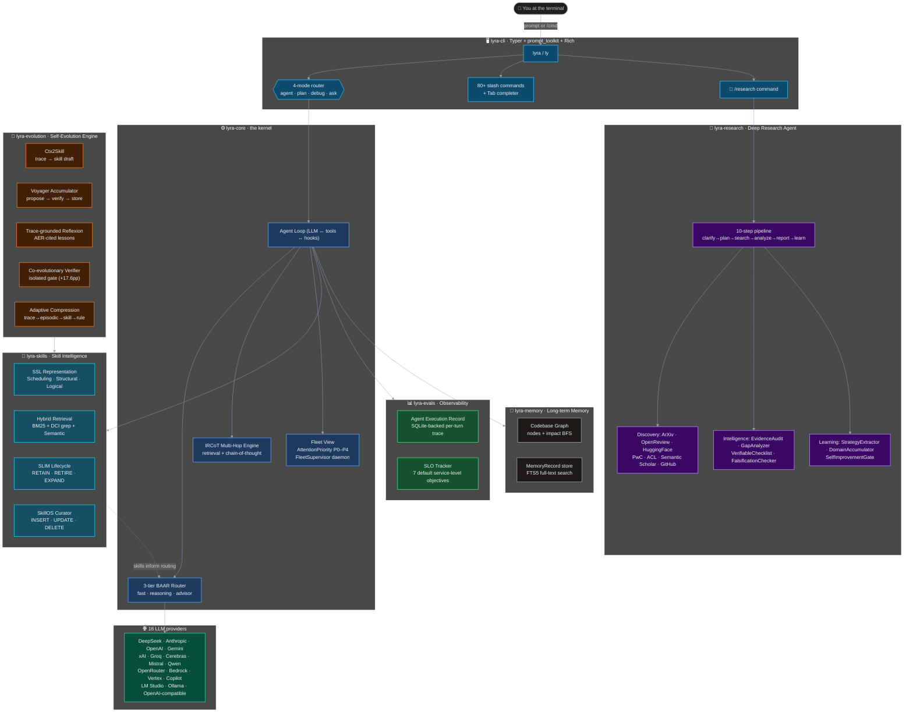

# Lyra

**L**ightweight **Y**ielding **R**easoning **A**gent — a general-purpose, CLI-native, open-source coding agent that grows smarter over time.

Lyra combines a production-grade agentic kernel with a deep research system and a self-evolving skill intelligence layer. Every session produces reusable skills, learned strategies, and updated routing policies — so Lyra gets better at your codebase the more you use it.

- **Version**: `3.14.0`
- **License**: MIT
- **Tests**: 2 400+ across all packages

---

## Table of Contents

1. [Architecture](#architecture)
2. [Packages](#packages)
3. [Self-Evolution System](#self-evolution-system) ← new
4. [Deep Research Agent](#deep-research-agent)
5. [Install](#install)
6. [Quick Start](#quick-start)
7. [Interaction Modes](#interaction-modes)
8. [Key Slash Commands](#key-slash-commands)
9. [Model Routing](#model-routing)
10. [Supported Providers](#supported-providers)
11. [Development](#development)

---

## Architecture



---

## Packages

| Package | Purpose |
|---------|---------|
| `lyra-cli` | Terminal UI — Typer CLI, prompt_toolkit REPL, 80+ slash commands, Rich output |
| `lyra-core` | Agent kernel — LLM loop, 3-tier BAAR router, IRCoT multi-hop, Fleet View dashboard, hooks, subagents |
| `lyra-research` | Deep Research Agent — 10-step pipeline: discovery → intelligence → memory → report → evaluation → learning |
| `lyra-skills` | Skill intelligence — SSL representation, SLIM lifecycle, SkillOS curator, BM25+DCI hybrid retrieval |
| `lyra-evolution` | Self-evolution engine — Ctx2Skill extraction, Voyager accumulator, Reflexion, co-evolutionary verifier, adaptive compression |
| `lyra-memory` | Long-term memory — codebase graph with impact BFS, MemoryRecord store with FTS5 |
| `lyra-evals` | Observability — Agent Execution Record (SQLite), SLO tracker, corpus-based drift gate |
| `lyra-mcp` | MCP server — exposes Lyra as a Model Context Protocol tool source |

---

## Self-Evolution System

Lyra's self-evolution system consists of 12 phases implemented across `lyra-core`, `lyra-skills`, `lyra-evolution`, and `lyra-evals`. Each session produces reusable skills and updated policies — the agent improves without retraining.

### Phase Map

```
Observability ──► Routing ──► Reasoning ──► Transparency
      A               B           C              D
      │
      └──► Closed-Loop Control (Phase E)
                    │
           ┌────────┼────────────────────────────┐
           ▼        ▼                            ▼
     Skill Rep   Extraction              Lifecycle Mgmt
       (G·SSL)   (H·Ctx2Skill)           (F·SLIM)
           │        │                            │
           ▼        ▼                            ▼
      Retrieval  Curation              Co-evolutionary
      (J·DCI)   (I·SkillOS)            Verification (K)
                                              │
                                    Adaptive Compression
                                            (L)
```

### Phase Reference

| Phase | Package | Module | Grounded In | Key Capability |
|-------|---------|--------|-------------|----------------|
| **A** · AER + SLO | `lyra-evals` | `aer.py`, `slo.py` | arXiv:2603.21692 | SQLite-backed per-turn trace; 7-SLO breach detector |
| **B** · BAAR Routing | `lyra-core` | `routing/policy.py` | arXiv:2602.21227 | 3-tier fast/reasoning/advisor split with budget ledger |
| **C** · IRCoT + Graph | `lyra-core`, `lyra-memory` | `multihop.py`, `codebase_graph.py` | arXiv:2212.10509 | Interleaved retrieval + CoT; hop-level provenance; impact BFS |
| **D** · Fleet View | `lyra-core` | `transparency/agent_view.py`, `supervisor.py` | — | P0–P4 attention priorities; background FleetSupervisor daemon |
| **E** · Closed-Loop | `lyra-evolution` | `controller.py`, `voyager.py`, `reflexion.py`, `stability.py` | arXiv:2305.16291, arXiv:2303.11366 | 8-timescale control; Voyager propose→verify→store; AER-cited lessons |
| **F** · SLIM Lifecycle | `lyra-skills` | `lifecycle.py` | arXiv:2605.10923 | RETAIN/RETIRE/EXPAND via marginal contribution Δ(s); +12.5pp over monotonic accumulation |
| **G** · SSL Repr | `lyra-skills` | `ssl_repr.py` | arXiv:2604.24026 | Scheduling/Structural/Logical layers; +12.3% MRR@50, +24.4% risk F1 |
| **H** · Ctx2Skill | `lyra-evolution` | `ctx2skill.py` | arXiv:2604.27660 | 5-agent loop extracts reusable skills from traces; Cross-Time Replay validation |
| **I** · SkillOS Curator | `lyra-skills` | `skilloscurator.py` | arXiv:2605.06614 | Trainable INSERT/UPDATE/DELETE curator; composite RL reward; +9.8% over uncurated frontier model |
| **J** · DCI Retrieval | `lyra-skills` | `retrieval.py` | arXiv:2605.05242 | BM25 + grep-based DCI + semantic fusion; α=0.40, β=0.40, γ=0.20 |
| **K** · EvoVerify | `lyra-evolution` | `evoverifier.py` | arXiv:2604.01687 | Informationally isolated co-evolutionary verifier; +17.6pp over human curation |
| **L** · Compression | `lyra-evolution` | `compression.py` | arXiv:2604.15877 | Trace→episodic→skill→rule; "missing diagonal" fast-path when generalization score ≥ 0.90 |

### How skills flow through the system

```
1. Agent executes a task → AER records every step (Phase A)
2. Ctx2Skill extracts a SkillDraft from successful traces (Phase H)
3. CrossTimeReplayValidator confirms it generalises across ≥2 contexts (Phase H)
4. SkillOS Curator decides INSERT/UPDATE/DELETE via RL reward (Phase I)
5. IsolatedVerifier gates admission without seeing curator signal (Phase K)
6. SSL Normalizer structures the admitted skill into 3 layers (Phase G)
7. Hybrid Retriever (BM25 + DCI) surfaces the skill on future turns (Phase J)
8. SLIM LifecycleManager retires skills when marginal value → 0 (Phase F)
9. AdaptiveCompressor promotes trace memories toward compact rules (Phase L)
```

---

## Deep Research Agent

Run `/research <topic>` in the REPL or `lyra research "<topic>"` to get a fully cited, gap-analyzed research report on any topic.

The `ResearchOrchestrator` runs a **10-step pipeline**:

```
clarify → plan → search → filter → fetch → analyze → audit → synthesize → report → memorize
```

### The 8 phases

| Phase | Module | What it builds |
|-------|--------|----------------|
| 1 · Discovery | `sources.py` | Multi-source search across ArXiv, OpenReview, HuggingFace Papers, Papers with Code, ACL Anthology, Semantic Scholar, GitHub |
| 2 · Intelligence | `intelligence.py` | `VerifiableChecklist`, `EvidenceAudit`, `GapAnalyzer`, `FalsificationChecker` |
| 3 · Memory | `memory.py` | Zettelkasten atomic notes, SQLite local corpus with FTS, strategy memory, episodic case bank |
| 4 · Report Engine | `reporter.py` | `CrossSourceSynthesizer`, `CitationBinder`, Markdown report generator; hard gates: citation fidelity = 1.0, coverage ≥ 0.75 |
| 5 · Skills | `skills.py` | 7-tuple skill formalism, 4 domain skills (ML / NLP / Systems / General), evolution tracker |
| 6 · Orchestrator | `orchestrator.py` | End-to-end 10-step pipeline wired into the CLI |
| 7 · Evaluation | `evaluation.py` | 6-axis quality metrics (coverage · citation_fidelity · source_breadth · insight_depth · gap_detection · contradiction_coverage) |
| 8 · Continual Learning | `learning.py` | `ResearchStrategyExtractor`, quality-weighted `CaseSelectionPolicy`, `SelfImprovementGate` |

### CLI usage

```bash
# Interactive REPL
lyra
agent › /research attention mechanisms in transformers

# Non-interactive
lyra research "retrieval-augmented generation" --depth thorough
lyra research list           # saved reports
lyra research show <id>      # view a report
lyra research related <id>   # find related reports
```

---

## Install

**Editable install from source:**

```bash
pip install -e packages/lyra-core \
            -e packages/lyra-skills \
            -e packages/lyra-memory \
            -e packages/lyra-research \
            -e packages/lyra-evolution \
            -e packages/lyra-evals \
            -e packages/lyra-mcp \
            -e packages/lyra-cli
```

**Global `lyra` command:**

```bash
make install-bin        # auto-detects first writable PATH dir
lyra --version          # → lyra 3.14.0
which lyra              # → /opt/homebrew/bin/lyra
```

**Distributable single-file binary (no Python needed):**

```bash
make binary             # → dist/lyra (~50 MB, ~500 ms cold start)
cp dist/lyra /opt/homebrew/bin/lyra
```

---

## Quick Start

```bash
lyra init               # first-run wizard: sets API key, model, mode
lyra                    # open interactive REPL  (alias: ly)
ly doctor               # health check
ly plan "add CSV export" --auto-approve --llm mock
ly evals --corpus golden --drift-gate 0.0
```

The REPL opens with an ANSI banner and a status bar showing `mode · model · repo · turn · cost`:

```
  ██╗  ██╗   ██╗██████╗  █████╗
  ██║  ╚██╗ ██╔╝██╔══██╗██╔══██╗
  ██║   ╚████╔╝ ██████╔╝███████║
  ██║    ╚██╔╝  ██╔══██╗██╔══██║
  ███████╗██║   ██║  ██║██║  ██║
  ╚══════╝╚═╝   ╚═╝  ╚═╝╚═╝  ╚═╝

  general-purpose · multi-provider · self-evolving · v3.14.0

  /help for commands  ·  /status for setup  ·  Ctrl-D to exit
```

---

## Interaction Modes

| Mode | What it does |
|------|--------------|
| `agent` | Full access — reads, writes, runs tools (default) |
| `plan` | Read-only design; queues a `pending_task` for approval |
| `debug` | Hypothesis → experiment → fix loop |
| `ask` | Read-only Q&A, no edits, no tools |

Switch with `/mode <name>` or press **Tab** on an empty prompt to cycle through all four.

---

## Key Slash Commands

| Command | Description |
|---------|-------------|
| `/help` | List every slash command |
| `/status` | Snapshot: repo · model · mode · turn · cost |
| `/model [fast\|smart\|<name>]` | Inspect or change the active model |
| `/research <topic>` | Run a deep research session |
| `/spawn <task>` | Spawn a git-worktree-isolated subagent |
| `/skills` | List loaded skills |
| `/skill add <name>` | Install a skill from the registry |
| `/evals` | Run the eval harness in-session |
| `/burn` | Token observatory |
| `/compact` | Compress context |
| `/approve` · `/reject` | Accept / reject pending plan or tool call |
| `/exit` · Ctrl-D | End session |

---

## Model Routing

Lyra uses a **3-tier routing policy** (Phase B, `lyra-core/routing/policy.py`):

| Tier | When | Default |
|------|------|---------|
| `advisor` | Tool risk ≥ 0.7 **and** uncertainty ≥ 0.75, or evidence conflict | `deepseek-reasoner` |
| `reasoning` | Ambiguity ≥ 0.4, context pressure ≥ 70%, uncertainty ≥ 0.5, repeated failure | `deepseek-reasoner` |
| `fast` | Everything else | `deepseek-chat` |

Override per session:

```
/model fast=claude-haiku-4-5
/model smart=claude-opus-4-7
```

A `TrajectoryBudget` ledger tracks spend per session and surfaces `budget_pressure` to the router so expensive advisor calls are rate-limited automatically.

---

## Supported Providers (16)

DeepSeek · Anthropic · OpenAI · Gemini · xAI · Groq · Cerebras · Mistral · Qwen · OpenRouter · AWS Bedrock · Google Vertex · GitHub Copilot · LM Studio · Ollama · any OpenAI-compatible endpoint

Add a custom provider at runtime via `settings.json`:

```json
{
  "providers": {
    "my-llm": "my_package.module:MyLLMClass"
  }
}
```

---

## Development

```bash
make test               # run all tests
make build              # build all packages
make lint               # ruff check
```

**Run tests by package:**

```bash
# lyra-skills (lifecycle, SSL, curator, retrieval)
PYTHONPATH=packages/lyra-skills/src python -m pytest packages/lyra-skills/tests/ -q

# lyra-evolution (Ctx2Skill, EvoVerifier, Compression)
PYTHONPATH=packages/lyra-evolution python -m pytest packages/lyra-evolution/tests/ -q

# lyra-research (deep research pipeline)
PYTHONPATH=packages/lyra-research/src python -m pytest packages/lyra-research/tests/ -q

# lyra-evals (AER, SLO)
PYTHONPATH=packages/lyra-evals/src python -m pytest packages/lyra-evals/tests/ -q

# lyra-core (routing, multihop, fleet)
PYTHONPATH=packages/lyra-core/src python -m pytest packages/lyra-core/tests/ -q
```

**Project layout:**

```
packages/
├── lyra-cli/                   # terminal UI + slash commands
├── lyra-core/
│   └── src/lyra_core/
│       ├── routing/
│       │   ├── cascade.py          # provider cascade router
│       │   └── policy.py           # Phase B — 3-tier BAAR routing
│       ├── transparency/
│       │   ├── agent_view.py       # Phase D — Fleet View (P0–P4)
│       │   └── supervisor.py       # Phase D — FleetSupervisor daemon
│       └── multihop.py             # Phase C — IRCoT multi-hop engine
├── lyra-evals/
│   └── src/lyra_evals/
│       ├── aer.py                  # Phase A — Agent Execution Record
│       └── slo.py                  # Phase A — SLO tracker
├── lyra-evolution/
│   └── lyra_evolution/
│       ├── ctx2skill.py            # Phase H — trace → skill draft
│       ├── voyager.py              # Phase E — skill accumulator
│       ├── reflexion.py            # Phase E — trace-grounded lessons
│       ├── controller.py           # Phase E — 8-timescale closed-loop
│       ├── evoverifier.py          # Phase K — co-evolutionary verifier
│       └── compression.py          # Phase L — adaptive compression
├── lyra-memory/
│   └── src/lyra_memory/
│       └── codebase_graph.py       # Phase C — codebase graph + impact BFS
├── lyra-research/
│   └── src/lyra_research/
│       ├── sources.py              # Phase 1 — multi-source discovery
│       ├── intelligence.py         # Phase 2 — evidence & gap analysis
│       ├── memory.py               # Phase 3 — Zettelkasten + corpus
│       ├── reporter.py             # Phase 4 — report generation
│       ├── skills.py               # Phase 5 — 7-tuple skill formalism
│       ├── orchestrator.py         # Phase 6 — 10-step pipeline
│       ├── evaluation.py           # Phase 7 — 6-axis quality metrics
│       └── learning.py             # Phase 8 — continual learning
├── lyra-skills/
│   └── src/lyra_skills/
│       ├── ssl_repr.py             # Phase G — SSL representation
│       ├── lifecycle.py            # Phase F — SLIM lifecycle management
│       ├── skilloscurator.py       # Phase I — SkillOS trainable curator
│       └── retrieval.py            # Phase J — BM25 + DCI hybrid retrieval
└── lyra-mcp/                   # MCP server
```

---

## License

MIT — see [LICENSE](LICENSE).
