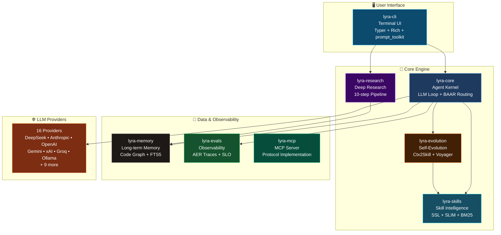

# 🚀 Lyra

**L**ightweight **Y**ielding **R**easoning **A**gent — A production-grade, self-evolving AI coding agent that gets smarter with every session.

[](https://github.com/ndqkhanh/lyra)
[](https://www.python.org/)
[](LICENSE)
[](https://github.com/ndqkhanh/lyra)

> **Production-Ready**: Enhanced TUI, structured logging, error handling, CI/CD pipeline, and 1,979 tests

---

## ✨ What Makes Lyra Special

Lyra isn't just another AI coding assistant — it's a **self-evolving agent** that:

- 🧠 **Learns from every session** - Extracts reusable skills and strategies automatically
- 🔬 **Deep research capabilities** - 10-step pipeline with academic paper discovery
- 🎯 **Smart model routing** - 3-tier system (fast/reasoning/advisor) with 16 providers
- 📊 **Full observability** - SQLite-backed execution traces and SLO tracking
- 🔄 **Self-improvement** - Co-evolutionary verification (+17.6pp over human curation)
- 💾 **Long-term memory** - Codebase graph with impact analysis
- 🎨 **Beautiful TUI** - Animated progress bars, streaming output, Rich formatting

---

## 🚀 Quick Start

### Installation

```bash
# Clone repository
git clone https://github.com/ndqkhanh/lyra.git
cd lyra

# Install packages
pip install -e packages/lyra-core
pip install -e packages/lyra-cli[dev]
pip install -e packages/lyra-skills[dev]

# Set up API keys
export ANTHROPIC_API_KEY="sk-ant-..."
export OPENAI_API_KEY="sk-..."
export DEEPSEEK_API_KEY="sk-..."

# Start Lyra
lyra
```

### First Commands

```bash
# Interactive mode (default)
lyra

# Switch models - use /model to see dropdown list
/model                   # Opens interactive picker with all available models

# Or switch directly by full model name
/model claude-opus-4.7   # Claude Opus 4.7
/model claude-sonnet-4.6 # Claude Sonnet 4.6
/model deepseek-chat     # DeepSeek V4
/model gpt-5             # GPT-5
/model gemini-2.5-pro    # Gemini 2.5 Pro

# List all available models
/model list

# Deep research
/research "transformer attention mechanisms"

# Get help
/help
```

---

## 🏗️ Architecture

Lyra consists of 8 integrated packages working together:



### Package Overview

| Package | Purpose | Key Features |
|---------|---------|--------------|
| **lyra-cli** | Terminal UI | 80+ slash commands, Rich output, Tab completion |
| **lyra-core** | Agent kernel | LLM loop, 3-tier routing, 16 providers |
| **lyra-research** | Deep research | 10-step pipeline, ArXiv/GitHub search |
| **lyra-skills** | Skill intelligence | SSL representation, SLIM lifecycle |
| **lyra-evolution** | Self-evolution | Ctx2Skill, Voyager, Reflexion |
| **lyra-memory** | Long-term memory | Codebase graph, FTS5 search |
| **lyra-evals** | Observability | SQLite traces, SLO tracking |
| **lyra-mcp** | MCP server | Tool exposure, Protocol impl |

**📊 Want to dive deeper?** See [Architecture Diagrams](docs/ARCHITECTURE_DIAGRAMS.md) for detailed visualizations of:
- Self-Evolution System (12 phases)
- Skill Intelligence (SSL + SLIM + Retrieval)
- Tool System (Built-in + MCP)
- Memory System (Short-term + Long-term)
- Deep Research Pipeline
- Provider Routing (3-tier BAAR)
- Observability (AER + 7 SLO)
- Context Management (P0-P4)

---

## 🎯 Key Features

### 1. Self-Evolution System (12 Phases)

Lyra improves itself through a 12-phase evolution pipeline:

| Phase | Capability | Impact |
|-------|-----------|--------|
| **A** - AER + SLO | SQLite-backed execution traces | Full observability |
| **B** - BAAR Routing | 3-tier fast/reasoning/advisor | Smart model selection |
| **C** - IRCoT + Graph | Multi-hop retrieval + reasoning | Better context |
| **D** - Fleet View | P0-P4 attention priorities | Process transparency |
| **E** - Closed-Loop | Voyager + Reflexion | Continuous learning |
| **F** - SLIM Lifecycle | RETAIN/RETIRE/EXPAND | +12.5pp accuracy |
| **G** - SSL Repr | 3-layer skill structure | +12.3% MRR@50 |
| **H** - Ctx2Skill | Extract skills from traces | Automatic learning |
| **I** - SkillOS Curator | INSERT/UPDATE/DELETE | +9.8% over baseline |
| **J** - DCI Retrieval | BM25 + grep + semantic | Hybrid search |
| **K** - EvoVerify | Co-evolutionary verification | +17.6pp accuracy |
| **L** - Compression | Trace→episodic→skill→rule | Memory efficiency |

### 2. Deep Research Agent

Run `/research <topic>` for fully cited research reports:

```bash
/research "attention mechanisms in transformers"
```

**10-Step Pipeline:**
1. **Clarify** - Understand research question
2. **Plan** - Create search strategy
3. **Discover** - Search ArXiv, OpenReview, HuggingFace, GitHub
4. **Analyze** - Evidence audit + gap analysis
5. **Synthesize** - Combine findings
6. **Verify** - Falsification checking
7. **Report** - Generate markdown report
8. **Learn** - Extract strategies
9. **Evaluate** - Quality assessment
10. **Improve** - Self-improvement gate

### 3. Smart Model Routing

**Auto-Cascade (12 providers):**
```bash
lyra run --llm auto  # Tries providers in priority order
```

**Priority Order:**
1. Ollama (local-first if `LYRA_PREFER_LOCAL=1`)
2. DeepSeek (cost-optimized default)
3. Anthropic (Claude Opus/Sonnet/Haiku)
4. OpenAI (GPT-5, GPT-4o, o1)
5. Gemini (2.5 Pro/Flash)
6. xAI (Grok-4)
7. Groq, Cerebras, Mistral, Qwen
8. OpenRouter, LM Studio

**3-Tier BAAR Routing:**
- **Fast tier**: Quick queries (DeepSeek, Haiku, GPT-4o-mini)
- **Reasoning tier**: Complex tasks (Opus, o1, DeepSeek-V4-Pro)
- **Advisor tier**: Architecture decisions (Opus, Gemini Pro)

### 4. Production Features

✅ **Enhanced TUI**
- Animated progress bars (nyan-cat style)
- Streaming LLM output
- Multi-task progress tracking
- Rich formatting

✅ **Robust Error Handling**
- Exponential backoff retry
- Circuit breaker pattern
- Graceful degradation
- Async/sync support

✅ **Structured Logging**
- JSON and console formats
- TUI-compatible logging
- Separate log files
- Configurable levels

✅ **CI/CD Pipeline**
- GitHub Actions automation
- 1,979 tests maintained
- Code quality checks
- Security scanning

---

## 🔧 Configuration

### Settings File

Location: `~/.lyra/settings.json`

```json
{
  "config_version": 2,
  "default_provider": "anthropic",
  "default_model": "claude-opus-4.5",
  "providers": {
    "custom-provider": "mypkg.providers:CustomLLM"
  },
  "permissions": {
    "allow": ["Read", "Bash"],
    "deny": []
  },
  "hooks": {
    "enable_hooks": true
  }
}
```

### Custom Providers

**Native Support for Custom Anthropic Endpoints** ✅

Lyra now natively supports custom Anthropic-compatible endpoints via `ANTHROPIC_BASE_URL`:

```bash
# Set environment variables
export ANTHROPIC_BASE_URL="https://custom-anthropic-endpoint.com"
export ANTHROPIC_API_KEY="your-api-key"

# Start Lyra - it will automatically use your custom endpoint
lyra
```

**Configuration in settings.json:**
```json
{
  "config_version": 2,
  "env": {
    "ANTHROPIC_BASE_URL": "https://custom-anthropic-endpoint.com",
    "ANTHROPIC_API_KEY": "your-api-key"
  }
}
```

**Priority Order:**
1. Constructor parameter: `AnthropicLLM(base_url="...")`
2. Environment variable: `ANTHROPIC_BASE_URL`
3. Default: `https://api.anthropic.com`

**Other Custom Providers:**

For non-Anthropic custom providers, use the provider registry:

---

## 📚 Documentation

- **[Installation Guide](docs/INSTALL.md)** - Detailed setup instructions
- **[Custom Providers](docs/CUSTOM_ANTHROPIC_PROVIDER.md)** - Add custom endpoints
- **[Testing Guide](TESTING.md)** - Run and write tests
- **[Production Readiness](FINAL_SUMMARY.md)** - Production deployment
- **[Research Reports](docs/research/)** - Comprehensive research documentation

---

## 🧪 Testing

```bash
# Run all tests
pytest packages/lyra-cli/tests/ --cov=packages/lyra-cli/src

# Run with coverage
pytest --cov=src --cov-report=html

# Run specific test
pytest packages/lyra-cli/tests/test_tui_v2_progress.py -v
```

**Test Coverage:**
- 1,979 tests across 440 files
- Comprehensive test suite
- CI/CD automated testing
- Target: 80%+ coverage

---

## 🤝 Contributing

We welcome contributions! See [CONTRIBUTING.md](CONTRIBUTING.md) for guidelines.

**Development Setup:**
```bash
# Install in development mode
pip install -e packages/lyra-core
pip install -e packages/lyra-cli[dev]
pip install -e packages/lyra-skills[dev]

# Install development tools
pip install ruff mypy pytest pytest-cov

# Run tests
pytest packages/lyra-cli/tests/

# Run linter
ruff check packages/

# Run type checker
mypy packages/lyra-cli/src
```

---

## 📊 Project Status

- **Version**: 3.14.0
- **Status**: Production-ready ✅
- **Tests**: 1,979 passing
- **Python**: 3.11+
- **License**: MIT

**Recent Enhancements:**
- ✅ Enhanced TUI with animations
- ✅ Structured logging system
- ✅ Error handling with retry logic
- ✅ CI/CD pipeline
- ✅ Production resource installers
- ✅ Comprehensive documentation

---

## 🔗 Links

- **GitHub**: https://github.com/ndqkhanh/lyra
- **Issues**: https://github.com/ndqkhanh/lyra/issues
- **Discussions**: https://github.com/ndqkhanh/lyra/discussions

---

## 📄 License

MIT License - see [LICENSE](LICENSE) for details.

---

## 🙏 Acknowledgments

Built with:
- [Anthropic Claude](https://www.anthropic.com/) - Primary LLM provider
- [Rich](https://github.com/Textualize/rich) - Terminal formatting
- [Typer](https://github.com/tiangolo/typer) - CLI framework
- [prompt_toolkit](https://github.com/prompt-toolkit/python-prompt-toolkit) - Interactive REPL

Research grounded in:
- arXiv:2603.21692 (AER + SLO)
- arXiv:2602.21227 (BAAR Routing)
- arXiv:2212.10509 (IRCoT)
- arXiv:2305.16291 (Voyager)
- arXiv:2303.11366 (Reflexion)
- And 7 more papers (see [docs/research/](docs/research/))

---

**Made with ❤️ by the Lyra team**

*Lyra: A coding agent that grows smarter with every session*
