# Lyra

**L**ightweight **Y**ielding **R**easoning **A**gent — a **general-purpose, CLI-native, open-source coding agent harness** with a built-in Deep Research AI system.

Lyra combines production-oriented ideas from Claude Code, OpenClaw, Hermes Agent, and SemaClaw into an install-and-use CLI. Its research layer turns it into a personal super-intelligent research assistant that discovers papers, evaluates repos, synthesizes findings, and learns from every session.

- **Version**: `3.14.0`
- **License**: MIT
- **Tests**: 2 200+ across all packages (369+ in `lyra-research` alone)

---

## Architecture

```mermaid
%%{init: {'theme':'dark', 'themeVariables': {
  'primaryColor':'#1e293b','primaryTextColor':'#f1f5f9','primaryBorderColor':'#06b6d4',
  'lineColor':'#94a3b8','secondaryColor':'#0f172a','tertiaryColor':'#0c4a6e'
}}}%%
graph TD
    User([👤 You at the terminal])

    subgraph SHELL["🖥️ lyra-cli · Typer + prompt_toolkit + Rich"]
      direction TB
      CLI["lyra / ly"]
      Modes{{"4-mode router\nagent · plan · debug · ask"}}
      Slash["80+ slash commands\n+ Tab completer"]
      Research["🔬 /research command"]
    end

    subgraph RESEARCH["🔬 lyra-research · Deep Research Agent"]
      direction TB
      Orch["ResearchOrchestrator\n10-step pipeline"]
      Disc["Discovery\nArXiv · OpenReview · HuggingFace\nPwC · ACL · Semantic Scholar · GitHub"]
      Intel["Intelligence\nVerifiableChecklist · EvidenceAudit\nGapAnalyzer · FalsificationChecker"]
      Mem["Memory\nZettelkasten notes · SQLite corpus\nStrategy memory · Case bank"]
      Rep["Reporter\nCrossSourceSynthesizer\nCitationBinder · QualityChecker"]
      Eval["Evaluation\n6-axis quality metrics\nSelfEvaluationAgent"]
      Learn["Learning\nStrategyExtractor · DomainAccumulator\nSelfImprovementGate"]
    end

    subgraph CORE["⚙️ lyra-core · the kernel"]
      direction TB
      Loop["Agent Loop (LLM ↔ tools ↔ hooks)"]
      Tools["Tool Pool: read · write · bash + MCP"]
      Context["5-layer Context + NGC compactor"]
      Memory["Procedural Memory (SQLite FTS5)"]
      Skills["SKILL.md loader + description router"]
      Subs["Subagent orchestrator (git worktrees)"]
    end

    subgraph ROUTE["🛣️ Two-tier model split"]
      Fast[("fast slot\ncheap turns")]
      Smart[("smart slot\nreasoning turns")]
    end

    subgraph PROV["🌐 16 LLM providers"]
      LLMs["DeepSeek · Anthropic · OpenAI · Gemini\nxAI · Groq · Cerebras · Mistral · Qwen\nOpenRouter · Bedrock · Vertex · Copilot\nLM Studio · Ollama · OpenAI-compatible"]
    end

    User -->|prompt or /cmd| CLI
    CLI --> Modes
    CLI --> Slash
    CLI --> Research
    Research --> Orch
    Orch --> Disc
    Orch --> Intel
    Orch --> Mem
    Orch --> Rep
    Orch --> Eval
    Orch --> Learn
    Modes -->|chat / tool turn| Loop
    Loop --> Tools
    Loop --> Context
    Loop --> Memory
    Loop --> Skills
    Loop --> Subs
    Loop --> Fast
    Loop --> Smart
    Fast --> LLMs
    Smart --> LLMs

    classDef shell fill:#0c4a6e,stroke:#38bdf8,stroke-width:1.5px,color:#f1f5f9
    classDef research fill:#3b0764,stroke:#c084fc,stroke-width:1.5px,color:#f1f5f9
    classDef core fill:#581c87,stroke:#a855f7,stroke-width:1.5px,color:#f1f5f9
    classDef route fill:#7c2d12,stroke:#fb923c,stroke-width:1.5px,color:#f1f5f9
    classDef prov fill:#064e3b,stroke:#34d399,stroke-width:1.5px,color:#f1f5f9

    class CLI,Modes,Slash,Research shell
    class Orch,Disc,Intel,Mem,Rep,Eval,Learn research
    class Loop,Tools,Context,Memory,Skills,Subs core
    class Fast,Smart route
    class LLMs prov
```



---

## Packages

| Package | Description |
|---------|-------------|
| `lyra-cli` | Terminal UI — Typer CLI, prompt_toolkit REPL, 80+ slash commands, Rich output |
| `lyra-core` | Agent kernel — LLM loop, tool pool, hooks, context engine, memory, subagents |
| `lyra-research` | **Deep Research Agent** — 8-phase pipeline: discovery → intelligence → memory → report → evaluation → learning |
| `lyra-skills` | Skill management — SKILL.md loader, BM25 router, semantic search, evolution tracker |
| `lyra-memory` | Long-term memory — MemoryRecord schema, store, extractor, compression |
| `lyra-evals` | Evaluation harness — corpus-based drift gate, pass@k, golden set |
| `lyra-mcp` | MCP server — exposes Lyra as a Model Context Protocol tool source |
| `lyra-evolution` | Self-evolution engine — strategy extraction, improvement proposals |

---

## Deep Research Agent (`lyra-research`)

Run `/research <topic>` in the REPL or `lyra research "<topic>"` from your terminal to get a fully cited, gap-analyzed research report on any topic.

### What it does

The `ResearchOrchestrator` runs a **10-step pipeline** on every query:

```
clarify → plan → search → filter → fetch → analyze → audit → synthesize → report → memorize
```

### The 8 phases

| Phase | Module | What it builds |
|-------|--------|----------------|
| 1 · Discovery | `sources.py` | Multi-source search across ArXiv, OpenReview, HuggingFace Papers, Papers with Code, ACL Anthology, Semantic Scholar, and GitHub (quality-scored) |
| 2 · Intelligence | `intelligence.py` | `VerifiableChecklist` (10 universal templates), `EvidenceAudit` (claim → citation binding), `GapAnalyzer`, `FalsificationChecker` |
| 3 · Memory | `memory.py` | Zettelkasten atomic notes (auto-linked on tag overlap), SQLite local corpus with FTS, strategy memory, episodic case bank |
| 4 · Report Engine | `reporter.py` | `CrossSourceSynthesizer`, `CitationBinder`, Markdown report generator, `ReportQualityChecker` (hard gates: citation fidelity = 1.0, coverage ≥ 0.75) |
| 5 · Skills | `skills.py` | 7-tuple skill formalism (applicability · policy · termination · interface · edit_operator · verification · lineage), 4 built-in domain skills (ML / NLP / Systems / General), evolution tracker |
| 6 · Orchestrator + CLI | `orchestrator.py` + `commands/research.py` | End-to-end orchestrator wired into the Lyra CLI with live progress display |
| 7 · Evaluation | `evaluation.py` | 6-axis quality metrics (coverage · citation_fidelity · source_breadth · insight_depth · gap_detection · contradiction_coverage), `SelfEvaluationAgent`, quality trend tracker |
| 8 · Continual Learning | `learning.py` | `ResearchStrategyExtractor`, `CaseSelectionPolicy` (quality-weighted similarity), `DomainExpertiseAccumulator`, `SelfImprovementGate` (3 gates: min sessions · ≥ 5% improvement · no regression) |

### CLI usage

```bash
# Interactive REPL
lyra
agent › /research attention mechanisms in transformers

# Non-interactive
lyra research "retrieval-augmented generation" --depth thorough
lyra research list                      # saved reports
lyra research show <id>                 # view a report
lyra research related <id>              # find related reports
```

---

## Install

**Editable install from source:**

```bash
pip install -e packages/lyra-core \
            -e packages/lyra-skills \
            -e packages/lyra-memory \
            -e packages/lyra-research \
            -e packages/lyra-mcp \
            -e packages/lyra-evals \
            -e packages/lyra-cli
```

**Global `lyra` command (symlinked onto `$PATH`):**

```bash
make install-bin        # auto-detects first writable PATH dir
lyra --version          # → lyra 3.14.0
which lyra              # → /opt/homebrew/bin/lyra
```

**Distributable single-file binary (no Python needed):**

```bash
make binary             # → dist/lyra (~50 MB, ~500 ms cold start)
cp dist/lyra /opt/homebrew/bin/lyra
```

---

## Quick start

```bash
lyra init               # first-run wizard: sets API key, model, mode
lyra                    # open interactive REPL  (alias: ly)
ly doctor               # health check
ly plan "add CSV export" --auto-approve --llm mock
ly evals --corpus golden --drift-gate 0.0
```

The interactive shell opens to an ANSI-Shadow banner and a status bar showing mode · model · repo · turn · cost:

```
  ██╗  ██╗   ██╗██████╗  █████╗
  ██║  ╚██╗ ██╔╝██╔══██╗██╔══██╗
  ██║   ╚████╔╝ ██████╔╝███████║
  ██║    ╚██╔╝  ██╔══██╗██╔══██║
  ███████╗██║   ██║  ██║██║  ██║
  ╚══════╝╚═╝   ╚═╝  ╚═╝╚═╝  ╚═╝

  general-purpose · multi-provider · self-evolving · v3.14.0

  /help for commands  ·  /status for setup  ·  Ctrl-D to exit
```

---

## Interaction modes

| Mode | What it does |
|------|--------------|
| `agent` | Full access — reads, writes, runs tools (default) |
| `plan` | Read-only design; queues a `pending_task` for approval |
| `debug` | Hypothesis → experiment → fix loop |
| `ask` | Read-only Q&A, no edits, no tools |

Switch with `/mode <name>` or press **Tab** on an empty prompt to cycle through all four. Legacy aliases (`build`/`run` → `agent`, `explore` → `ask`, `retro` → `debug`) are accepted everywhere.

---

## Key slash commands

| Command | Description |
|---------|-------------|
| `/help` | List every slash command |
| `/status` | Snapshot: repo · model · mode · turn · cost |
| `/model [fast\|smart\|<name>]` | Inspect or change the active model |
| `/research <topic>` | Run a deep research session |
| `/spawn <task>` | Spawn a git-worktree-isolated subagent |
| `/skills` | List loaded skills |
| `/skill add <name>` | Install a skill from the registry |
| `/evals` | Run the eval harness in-session |
| `/burn` | Token observatory |
| `/compact` | Compress context |
| `/approve` · `/reject` | Accept / reject pending plan or tool call |
| `/exit` · Ctrl-D | End session |

---

## Two-tier model split

Lyra uses a **fast** slot for cheap turns (chat, tool calls, summaries) and a **smart** slot for reasoning-heavy work (planning, `/spawn`, cron fan-out, review). Defaults ship with DeepSeek:

| Slot | Default alias | API slug |
|------|---------------|----------|
| fast | `deepseek-v4-flash` | `deepseek-chat` |
| smart | `deepseek-v4-pro` | `deepseek-reasoner` |

Override per session: `/model fast=claude-haiku-4-5` · `/model smart=claude-opus-4-7`

---

## Supported providers (16)

DeepSeek · Anthropic · OpenAI · Gemini · xAI · Groq · Cerebras · Mistral · Qwen · OpenRouter · AWS Bedrock · Google Vertex · GitHub Copilot · LM Studio · Ollama · any OpenAI-compatible endpoint

Add a custom provider at runtime via `settings.json`:

```json
{
  "providers": {
    "my-llm": "my_package.module:MyLLMClass"
  }
}
```

---

## Development

```bash
make test               # run all tests
make build              # build all packages
make lint               # ruff check
```

**Run only the research package tests:**

```bash
PYTHONPATH=packages/lyra-research/src python -m pytest packages/lyra-research/tests/ -q
```

**Project layout:**

```
packages/
├── lyra-cli/           # terminal UI + slash commands
├── lyra-core/          # agent kernel
├── lyra-research/      # deep research agent (8 phases)
│   └── src/lyra_research/
│       ├── sources.py       # Phase 1 – multi-source discovery
│       ├── intelligence.py  # Phase 2 – evidence & gap analysis
│       ├── memory.py        # Phase 3 – Zettelkasten + corpus
│       ├── reporter.py      # Phase 4 – report generation
│       ├── skills.py        # Phase 5 – 7-tuple skill formalism
│       ├── orchestrator.py  # Phase 6 – 10-step pipeline
│       ├── evaluation.py    # Phase 7 – 6-axis quality metrics
│       └── learning.py      # Phase 8 – continual learning
├── lyra-skills/        # skill loader & router
├── lyra-memory/        # long-term memory
├── lyra-evals/         # eval harness
└── lyra-mcp/           # MCP server
```

---

## License

MIT — see [LICENSE](LICENSE).
