<!-- lyra-legacy-aware: this README intentionally references the old
     `open-coding` / `.opencoding/` (v1.6) and `open-harness` /
     `.open-harness/` (v1.7) names when explaining the rename chain that
     lands at `lyra` / `.lyra/` in v1.7.1. See
     docs/migration-to-lyra.md for the details. -->

# Lyra

**L**ightweight **Y**ielding **R**easoning **A**gent — a **general-purpose,
CLI-native, open-source coding agent harness.** Lyra combines the best
ideas from Claude Code, OpenClaw, Hermes Agent, and SemaClaw into a
production-oriented design and ships them as an install-and-use CLI.
Built on top of the sibling
[`harness_core`](../orion-code/harness_core/) library.

## Anatomy of Lyra (one diagram, the whole thing)

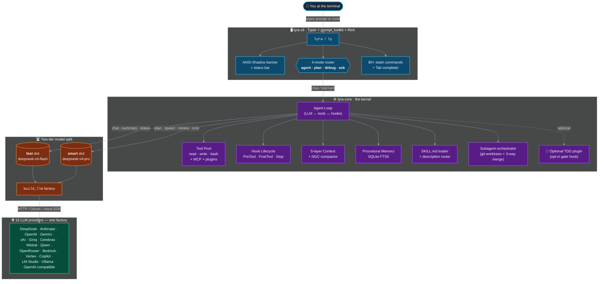

> **Reading it.** Top-down: keystrokes enter through the CLI, the
> 4-mode router picks the system prompt, the agent loop fans out to
> tools / hooks / context / memory / subagents, the two-tier slot
> system picks the cheap or expensive model, and `build_llm` is the
> single seam to every supported provider. Everything below is a
> closer look at one of these blocks.

- **License**: MIT.
- **Status**: **v3.4.0 "Phase N: Harness Hardening" — 2200+ tests
  green** across 5 packages (`lyra-cli`, `lyra-core`, `lyra-mcp`,
  `lyra-skills`, `lyra-evals`). v3.4.0 turns Lyra from "a CLI you
  type into" into "a programmable, observable, sandbox-able agent
  harness" without breaking any v3.3 surface — `LyraClient`
  embedded library, fan-out tracing hub (LangSmith + Langfuse),
  `lyra setup` first-run wizard, `lyra doctor --json`, `lyra serve`
  HTTP API (chat / SSE stream / sandboxed runner), local + Docker
  ephemeral sandboxes, progressive `SKILL.md` loading, the
  `lyra skill add` installer, and a `settings.json:providers`
  registry that lets users plug in their own LLM classes via
  `slug → "package.module:Symbol"` import strings. v3.3 (Phase M)'s
  `lyra burn` token observatory is preserved end-to-end. v3.2.0's
  Claude-Code 4-mode taxonomy (`agent`, `plan`, `debug`, `ask`)
  remains the default with full backward-compatible aliasing for
  stored sessions and config (`build`/`run` → `agent`,
  `explore` → `ask`, `retro` → `debug`). v3.0.0's general-purpose
  repositioning still stands: TDD is an **opt-in plugin** (toggle
  with `/tdd-gate on` or `/config set tdd_gate=on`); the state
  machine, gate hook, `/phase`, and `/red-proof` slashes all still
  ship, simply off by default.
  v2.7.1's two-tier model pattern is preserved on top of v2.7.0's
  honest rebuild: a **fast** model
  (`deepseek-v4-flash` → `deepseek-chat`) handles every cheap turn
  (chat, tool calls, summaries) and a **smart** model
  (`deepseek-v4-pro` → `deepseek-reasoner`) is dispatched for
  reasoning-heavy work (planning, `/spawn`, cron fan-out, post-turn
  review). Concretely (delta from v2.7.0):
  - **DeepSeek aliases registered.** `deepseek-v4-flash` /
    `deepseek-flash` resolve to the API slug `deepseek-chat`;
    `deepseek-v4-pro` / `deepseek-pro` resolve to `deepseek-reasoner`;
    raw API slugs are identity aliases so muscle memory from the
    DeepSeek dashboard always works.
  - **Two new session slots.** `InteractiveSession.fast_model` and
    `.smart_model` carry the user-facing aliases. Every code path
    that needs an LLM now resolves the slug through these slots via
    `_resolve_model_for_role(session, role)`: `chat` → fast, `plan`
    / `spawn` / `cron` / `review` → smart.
  - **`/model fast` / `smart` / `fast=<slug>` / `smart=<slug>`.** Bare
    `/model fast` swaps the active provider's model attribute to the
    fast slot for the next turn; `=<slug>` re-pins persistently.
    `/model` with no args now lists `current model`, `fast slot`, and
    `smart slot` together so it's always obvious which model is going
    to be called next.
  - **Universal + provider env stamping.** A single
    `_stamp_model_env(alias)` helper sets `HARNESS_LLM_MODEL` and the
    provider-specific override (`DEEPSEEK_MODEL`, `ANTHROPIC_MODEL`,
    `OPENAI_MODEL`, `GEMINI_MODEL`) so the next `build_llm` lands on
    the role-correct slug regardless of which backend `/connect`
    configured.
  - All v2.7.0 honest-rebuild wiring (inline `/evals`, real `/compact`,
    LifecycleBus → HIR + OTel, real `git worktree`-isolated `/spawn`,
    `_LyraCoreLLMAdapter` bridging the two AgentLoop families) is
    preserved.
- **Install (editable, from this tree)**:

  ```bash
  python3 -m pip install -e packages/lyra-core \
                          -e packages/lyra-skills \
                          -e packages/lyra-mcp \
                          -e packages/lyra-evals \
                          -e packages/lyra-cli
  ```

- **Expose `lyra` as a global command** (one-time, mirrors how
  `claude` / `gh` / `brew` live on `$PATH` so you can run `lyra`
  from any directory without `python3 -m`):

  ```bash
  make install-bin                       # editable install + symlink to /opt/homebrew/bin
  # or, equivalently:
  ./scripts/install-lyra.sh

  lyra --version                         # → lyra 3.4.0
  which lyra                             # → /opt/homebrew/bin/lyra
  ```

  The script auto-detects the first writable directory on `$PATH`
  (`/opt/homebrew/bin` → `/usr/local/bin` → `~/.local/bin` → `~/bin`),
  symlinks both `lyra` and the short alias `ly` into it, and never
  edits your shell config. To remove: `make uninstall-bin`.

  **Distributable single-file binary** (no Python needed on the
  target machine, ~50 MB, ~500 ms cold start):

  ```bash
  make binary                            # → dist/lyra (PyInstaller --onefile)
  cp dist/lyra /opt/homebrew/bin/lyra
  ```

- **Try it**:

  ```bash
  lyra init
  lyra                                   # ← interactive REPL (alias: `ly`)
  ly doctor
  ly plan "add a small feature that exports CSV" --auto-approve --llm mock
  ly evals --corpus golden --drift-gate 0.0
  ```

  Running `lyra` (or the short alias `ly`) with no arguments opens
  the interactive shell (Rich + prompt_toolkit, ANSI-Shadow "LYRA"
  wordmark, cyan→indigo→magenta gradient):

  ```text
  ╭─ Lyra v3.4.0 ────────────────────╮
  │                                  │
  │  ██╗  ██╗   ██╗██████╗  █████╗   │
  │  ██║  ╚██╗ ██╔╝██╔══██╗██╔══██╗  │
  │  ██║   ╚████╔╝ ██████╔╝███████║  │
  │  ██║    ╚██╔╝  ██╔══██╗██╔══██║  │
  │  ███████╗██║   ██║  ██║██║  ██║  │
  │  ╚══════╝╚═╝   ╚═╝  ╚═╝╚═╝  ╚═╝  │
  │                                  │
  │  general-purpose · multi-provider │
  │   self-evolving  ·  v3.4.0       │
  │                                  │
  ╰───────────────────────── ready. ─╯

    ◆  Repo    /Users/you/my-project
    ◆  Model   claude-opus-4.5     Mode   agent
    ◆  CLI     lyra  ·  alias: ly

    /help for commands   ·   /status for setup   ·   Ctrl-D to exit

  agent › _
  ╭─ mode │ model │ repo │ turn │ cost │ /help ─────────────────────────────╮
  │  agent │ claude-opus-4.5 │ /Users/you/my-project │ turn 0 │ $0.00 │     │
  ╰──────────────────────────────────────────────────────────────────────────╯
  ```

  Plain text describes a task; `/` prefixes are meta commands. Hit
  `TAB` to complete slash commands — a dropdown appears as soon as
  you press `/`. **Tab** with no command in the buffer cycles
  through the four modes (`agent → plan → ask → debug → agent → …`).

  | Command | What it does |
  |---|---|
  | `/help` | List every slash command with a one-line description. |
  | `/status` | Snapshot: repo, model, mode, turn, cost, pending task. |
  | `/mode agent\|plan\|debug\|ask` | Switch interaction mode (Claude-Code 4-mode taxonomy). Default `agent`. Legacy v3.1 names `build`/`run`/`explore`/`retro` still accepted as aliases. |
  | `/model <name>` | Change the model in-session (e.g. `/model gpt-5`). |
  | `/approve` · `/reject` | Accept/reject the pending plan or tool call. |
  | `/history` | Replay recent user inputs (truncated). |
  | `/clear` | Clear scrollback; keep session state. |
  | `/skills` · `/soul` · `/policy` | Introspect the loaded harness. |
  | `/doctor` · `/evals` | Invoke the non-interactive subcommands without leaving. |
  | `/exit` · `/quit` · `Ctrl-D` | End the session cleanly. |

  Non-TTY environments (piped stdin, CI) transparently fall back to
  `input()` and strip ANSI — `echo /exit | lyra` just works.

### The four modes — a state diagram

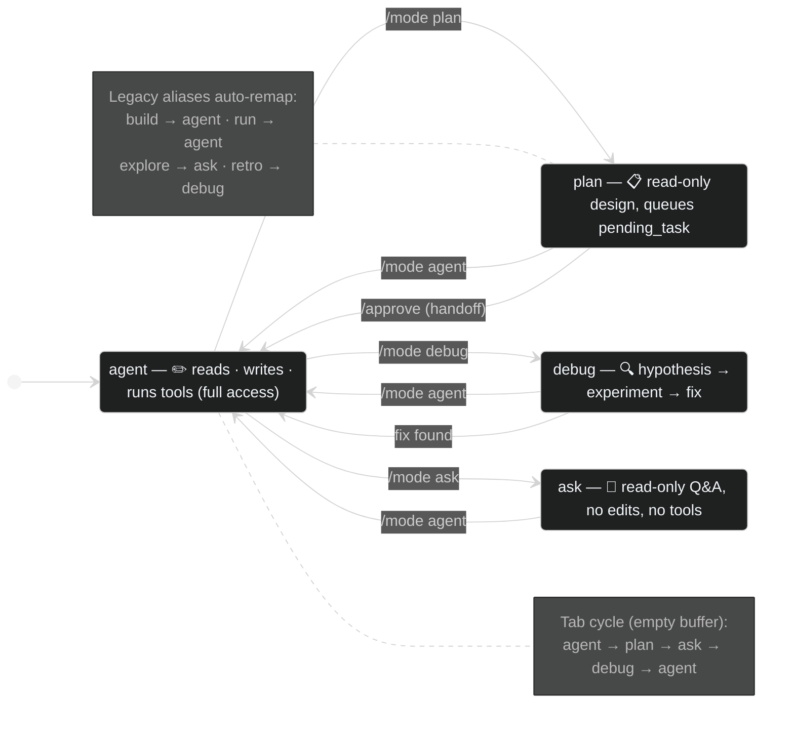

## Default models — the small/smart split (v2.7.1)

Lyra ships with a **two-tier model selection** modeled on Claude
Code's Haiku-for-cheap-turns / Sonnet-for-reasoning pattern, but on
DeepSeek's catalog by default (cheapest competitive frontier API).
Visualised:

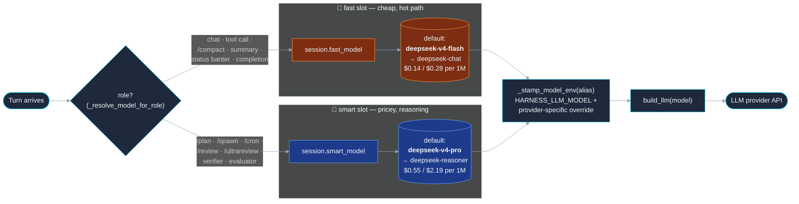

| Slot      | Default alias       | Resolves to API slug | What runs on it |
|-----------|---------------------|----------------------|-----------------|
| **fast**  | `deepseek-v4-flash` | `deepseek-chat`      | chat turns, tool calls, summaries, `/compact`, status helpers |
| **smart** | `deepseek-v4-pro`   | `deepseek-reasoner`  | `lyra plan`, `/spawn` subagents, cron fan-out, `/review --auto`, evaluator |

The aliases (`v4-flash` / `v4-pro` plus shorter `flash` / `pro`) are
the names that show up in `/model list`, the install banner, and any
example in the docs; the raw API slugs (`deepseek-chat` /
`deepseek-reasoner` / `deepseek-coder`) are also registered as
identity aliases so anything you copy out of the DeepSeek dashboard
will resolve.

Inspect or override the slots from inside the REPL:

```text
agent › /model
current model: auto (resolves through fast/smart slots)
fast slot:     deepseek-v4-flash  →  deepseek-chat
smart slot:    deepseek-v4-pro    →  deepseek-reasoner

agent › /model smart                    # next turn uses the smart slot
[model] using smart slot for next turn → deepseek-reasoner

agent › /model fast=qwen-coder-flash    # re-pin the fast slot
[model] fast slot → qwen-coder-flash

agent › /model claude-opus-4-5          # legacy: pin the universal model
[model] pinned to claude-opus-4-5 (overrides fast/smart slots)
```

To switch the *whole* default set off DeepSeek (e.g. you want
Claude Sonnet on chat and Claude Opus on planning), edit
`~/.lyra/settings.json`:

```json
{
  "fast_model": "claude-sonnet-4-5",
  "smart_model": "claude-opus-4-5"
}
```

API keys land in the same file via `lyra connect` — no manual
JSON editing required. See the
[lyra-cli README](packages/lyra-cli/README.md#model-routing-fast-vs-smart)
for the full cheatsheet, including how `/spawn` automatically opens
the smart slot before building the subagent's `AgentLoop`.

## Why the name "Lyra"?

The lyre is the oldest Greek stringed instrument; the constellation
Lyra is one of the few visible from every inhabited latitude. Both
connotations track: a harness whose design discipline is to make
agent behaviour **resonate, reproducibly, against a known scale.**

The backronym — **L**ightweight **Y**ielding **R**easoning **A**gent
— is optional flavour. The product is "Lyra." Four letters, a
two-letter CLI alias (`ly`), no namespace collisions.

**Previous names**: `open-coding` (v1.6 and prior), `open-harness`
(v1.7 transitional). Both migrate automatically — see
[`docs/migration-to-lyra.md`](docs/migration-to-lyra.md).

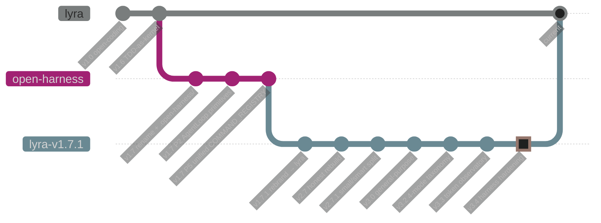

## Why Lyra exists

Coding agents in 2026 are strong at generation but weak at *picking
the right tool, on the right model, on the right machine*. Lyra is a
**general-purpose CLI coding agent harness** that gives you the four
things every other harness gates behind a SaaS:

1. **Provider sovereignty** — DeepSeek, OpenAI, Anthropic, Gemini,
   xAI, Groq, Cerebras, Mistral, Qwen, OpenRouter, Bedrock, Vertex,
   Copilot, LM Studio, Ollama, and any OpenAI-compatible endpoint —
   all behind one `build_llm` factory and one `lyra connect` flow.
2. **A two-tier model split** out of the box (`fast` for chat /
   tool-calls / summaries, `smart` for planning / subagents / review)
   so you stop paying frontier prices for "what does this file do?".
3. **A complete REPL surface** modeled on Claude Code, OpenClaw, and
   Hermes Agent: 80+ slash commands, prompt_toolkit completer,
   bottom status bar, ANSI-Shadow banner, cron daemon, MCP client +
   server, subagent worktrees, skill router, retro daemon.
4. **Optional discipline plugins** for teams that want them — most
   notably an opt-in TDD plugin that adds a deterministic
   PreToolUse / Stop hook pair refusing writes to `src/**` without a
   failing test. Off by default; flip it on with `/tdd-gate on`.

In short: Lyra is the harness you reach for when you want Claude
Code's UX, OpenClaw's pluggability, Hermes' self-improvement loop,
and your own choice of model — all in one open-source binary.

### Where Lyra sits in the 2026 fleet

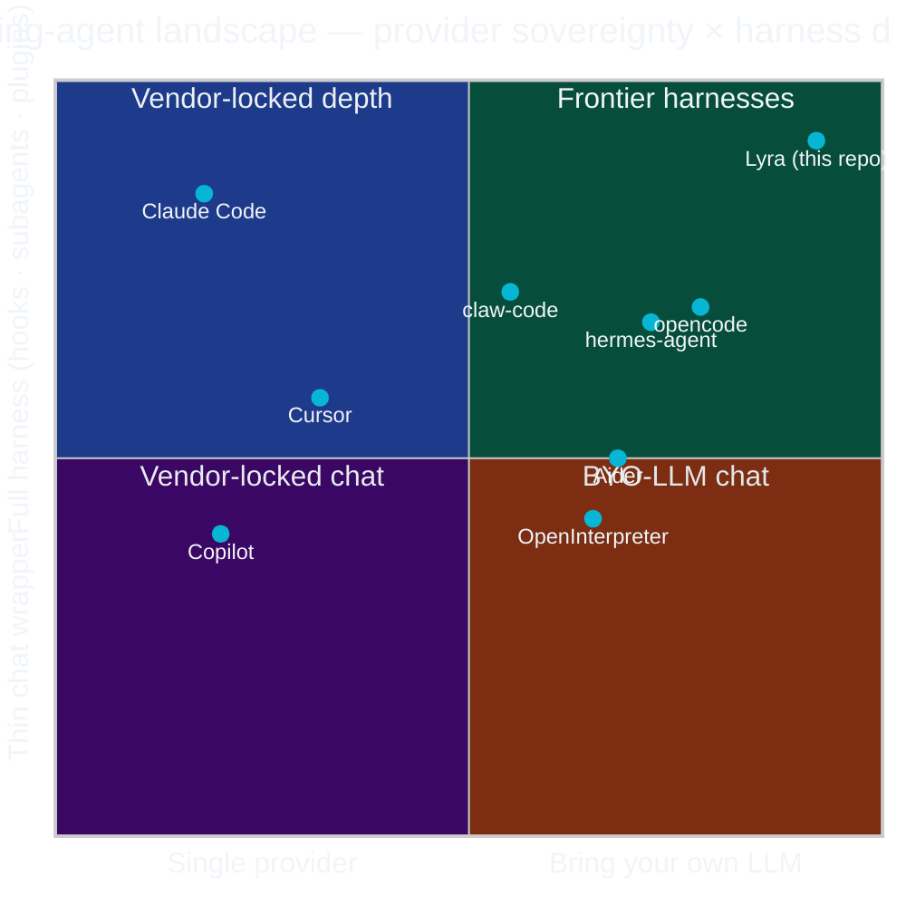

> **Read it as.** Higher = deeper harness (real hooks, subagents,
> worktrees, skill router, MCP, plugins). Right = more provider
> freedom (one-keystroke `/connect` to 16 backends incl. local).
> Lyra deliberately occupies the top-right corner that vendor-tied
> harnesses can't reach.

### A turn through Lyra — sequence diagram

What happens when you press Enter on a prompt:

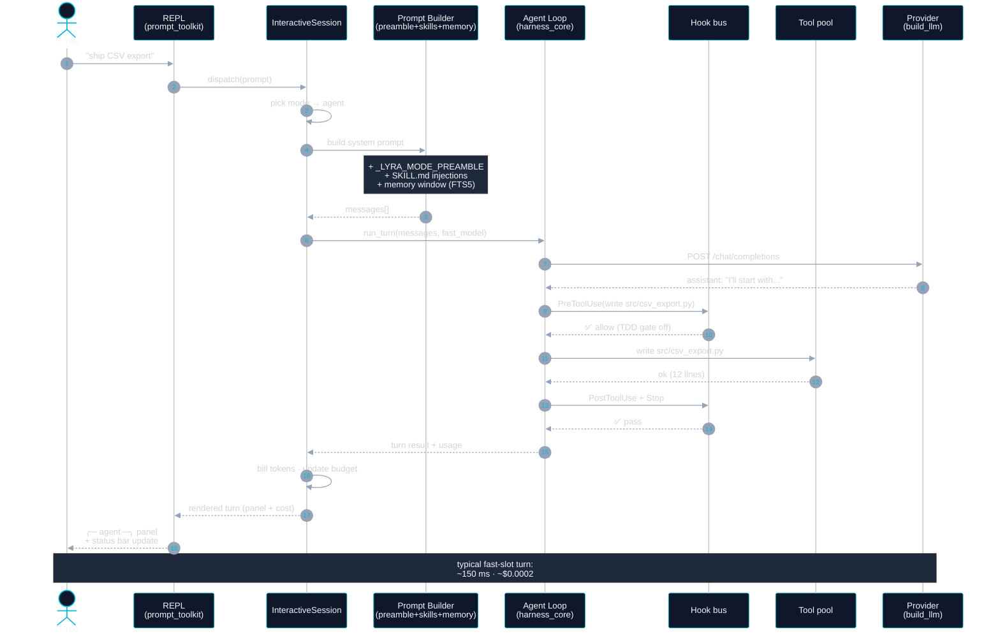

### Provider sovereignty — one factory, sixteen backends

Every consumer (REPL chat, planner, subagent, cron, evaluator) goes
through the same `build_llm` seam. Add a provider once, every
surface uses it:

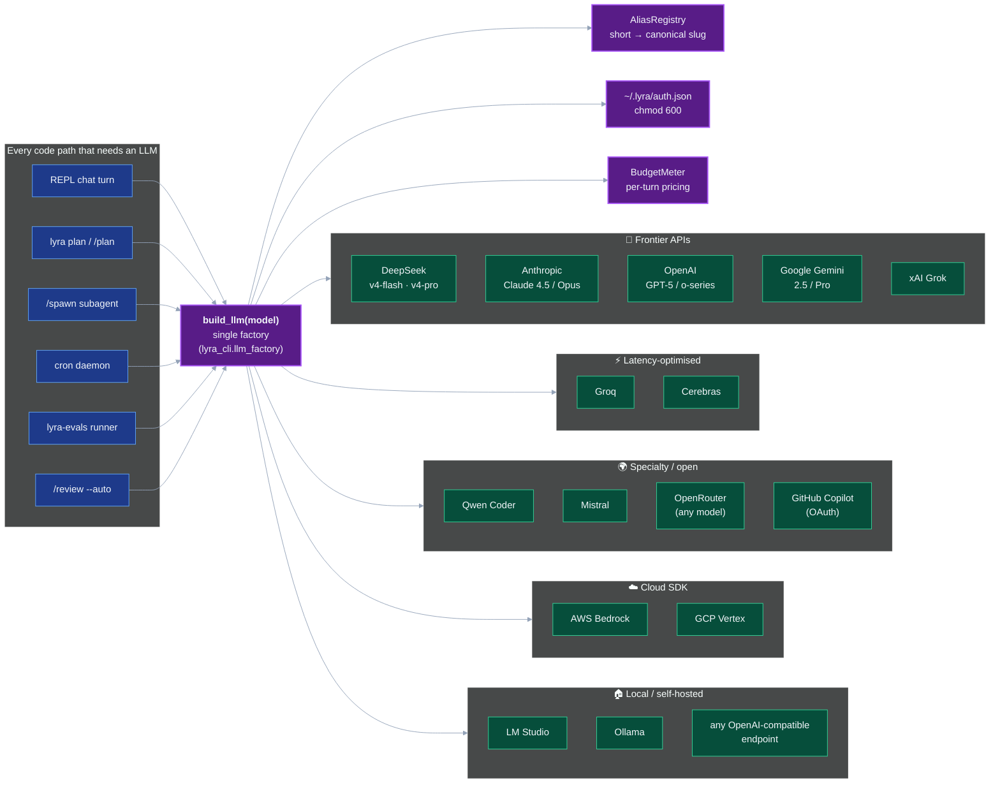

## What ships in v0.1.0

Every item below has acceptance tests that run under `make test` and
a CI gate.

### Five packages, one harness

```mermaid
%%{init: {'theme':'dark','themeVariables':{
  'primaryColor':'#1e293b','primaryTextColor':'#f1f5f9',
  'primaryBorderColor':'#06b6d4','lineColor':'#94a3b8'
}}}%%
graph TD
    User([👤 User]):::user

    subgraph CLI_PKG["📦 lyra-cli  ·  user-facing"]
      direction LR
      TyperApp["Typer app<br/>init · run · plan · doctor ·<br/>retro · evals · session · mcp · acp"]
      REPL["Interactive REPL<br/>prompt_toolkit + Rich"]
      Slash["80+ slash commands<br/>+ Tab completer"]
      Driver["driver.py<br/>(banner · status bar)"]
    end

    subgraph CORE_PKG["📦 lyra-core  ·  the kernel"]
      direction LR
      Loop["Agent Loop"]
      Perm["PermissionBridge"]
      Hooks["Hook framework"]
      Ctx["5-layer Context"]
      Mem["Procedural Memory<br/>(SQLite FTS5)"]
      Sub["Subagent orchestrator<br/>+ git worktrees"]
      Verif["Verifier + cross-channel"]
      Safe["Safety monitor"]
      Obs["HIR + OTLP"]
      TDDplug["TDD plugin (opt-in)"]
    end

    subgraph SKILLS_PKG["📦 lyra-skills"]
      Loader["Frontmatter-aware loader"]
      Router["Description router"]
      Extractor["Skill extractor"]
      Packs["4 packs:<br/>atomic · tdd-sprint ·<br/>karpathy · safety"]
    end

    subgraph MCP_PKG["📦 lyra-mcp"]
      MCPC["JSON-RPC client<br/>(consumer)"]
      MCPS["Lyra-as-MCP-server<br/>read_session · get_plan"]
      Trust["Trust banner +<br/>prompt-injection guard"]
    end

    subgraph EVALS_PKG["📦 lyra-evals"]
      Runner["EvalRunner +<br/>drift gate"]
      Corpora["3 corpora:<br/>golden · red-team ·<br/>long-horizon"]
    end

    User --> TyperApp
    User --> REPL
    REPL --> Slash --> Driver

    TyperApp --> Loop
    REPL --> Loop
    Loop --> Perm
    Loop --> Hooks
    Loop --> Ctx
    Loop --> Mem
    Loop --> Sub
    Loop --> Verif
    Loop --> Safe
    Loop --> Obs
    Loop -.opt-in.-> TDDplug

    Loop --> Loader
    Loader --> Router
    Loader --> Extractor
    Loader --> Packs

    Loop --> MCPC
    MCPC --> Trust
    REPL -.exposes.-> MCPS

    TyperApp --> Runner
    Runner --> Corpora

    classDef user fill:#1e293b,stroke:#06b6d4,stroke-width:2px,color:#f1f5f9
    classDef cli fill:#0c4a6e,stroke:#38bdf8,color:#f1f5f9
    classDef core fill:#581c87,stroke:#a855f7,color:#f1f5f9
    classDef skill fill:#064e3b,stroke:#34d399,color:#f1f5f9
    classDef mcp fill:#7c2d12,stroke:#fb923c,color:#f1f5f9
    classDef ev fill:#3f3f46,stroke:#a1a1aa,color:#f1f5f9
    class TyperApp,REPL,Slash,Driver cli
    class Loop,Perm,Hooks,Ctx,Mem,Sub,Verif,Safe,Obs,TDDplug core
    class Loader,Router,Extractor,Packs skill
    class MCPC,MCPS,Trust mcp
    class Runner,Corpora ev
```

### Test distribution — where the 1900+ tests live

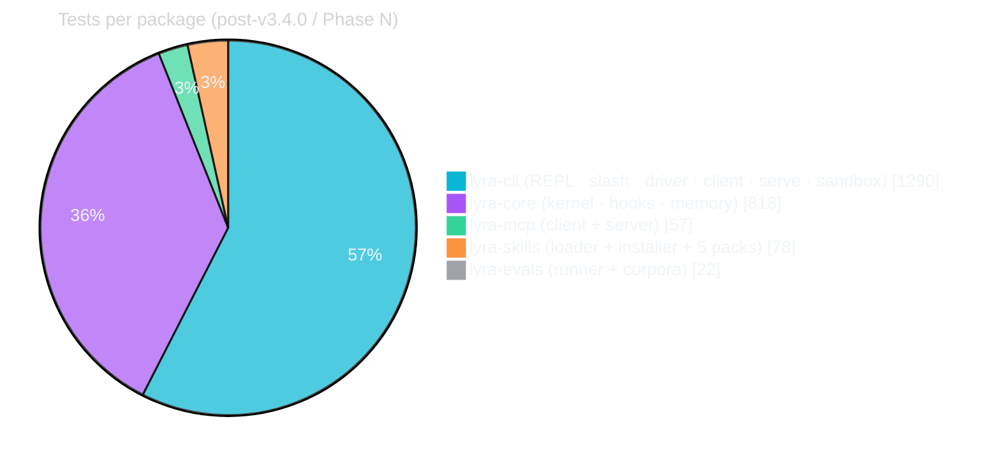

### Package responsibilities

| Package | What it gives you |
|---|---|
| **`lyra-core`** | Agent loop extensions, PermissionBridge, hook framework, 5-layer context pipeline + compactor, procedural memory (SQLite FTS5), three-tier progressive-disclosure wrappers, **opt-in TDD plugin** (RED-proof validator, coverage-regression gate, gate hook), post-edit impact map, escape-hatch audit, two-phase verifier + cross-channel evidence + evaluator-family detection, subagent orchestrator with git-worktree isolation + filesystem sandbox + 3-way merge w/ LLM resolver, DAG Teams harness (cycle / width / parking / plugin boundary), rule-based safety monitor (windowed), flat HIR schema + OTLP exporter + secrets masking + retro artifact builder. |
| **`lyra-skills`** | Frontmatter-aware loader (later-root-wins precedence; `version` / `keywords` / `applies_to` / `requires` / `progressive` fields), description-based router with synonym expansion, **progressive activation** (body injects on `USE SKILL: <id>`, keyword match, or force-id), Hermes-style extractor (user-review-gated), `lyra skill add`/`list`/`remove` installer (local path or Git URL), and five shipped packs: **atomic-skills**, **tdd-sprint**, **karpathy**, **safety**, **claude-to-lyra**. |
| **`lyra-mcp`** | JSON-RPC consumer with timeout + shape guard, trust banner + prompt-injection guard, progressive umbrella-tool disclosure, Lyra-as-MCP-server (`read_session`, `get_plan`) with bearer auth. |
| **`lyra-evals`** | `Task`/`Report`/`EvalRunner` with drift gate, three in-tree corpora (`golden`, `red-team`, `long-horizon`). |
| **`lyra-cli`** | Typer app exposing `init`, `run`, `plan`, `doctor` (with `--json`), `setup`, `serve`, `retro`, `evals`, `burn`, `session {list,show}`, `skill {add,list,remove}`. Plan Mode is default-on with auto-skip for trivial tasks; writes plan artifacts under `.lyra/plans/`. Running `lyra` with no arguments drops into a Claude-Code-style interactive shell (prompt_toolkit + Rich, 15 slash commands, bottom status bar, piped-stdin fallback). Also ships `lyra_cli.client.LyraClient` (embeddable Python library), `lyra_cli.tracing` (LangSmith + Langfuse fan-out hub), `lyra_cli.sandbox` (`LocalSandbox` + `DockerSandbox` + `pick_sandbox`), `lyra_cli.serve` (stdlib WSGI HTTP API), and `lyra_cli.provider_registry` (custom-LLM import-string registry driven by `settings.json:providers`). |

### Memory & context — the 5-layer pipeline

How a long session keeps a small token budget without forgetting:

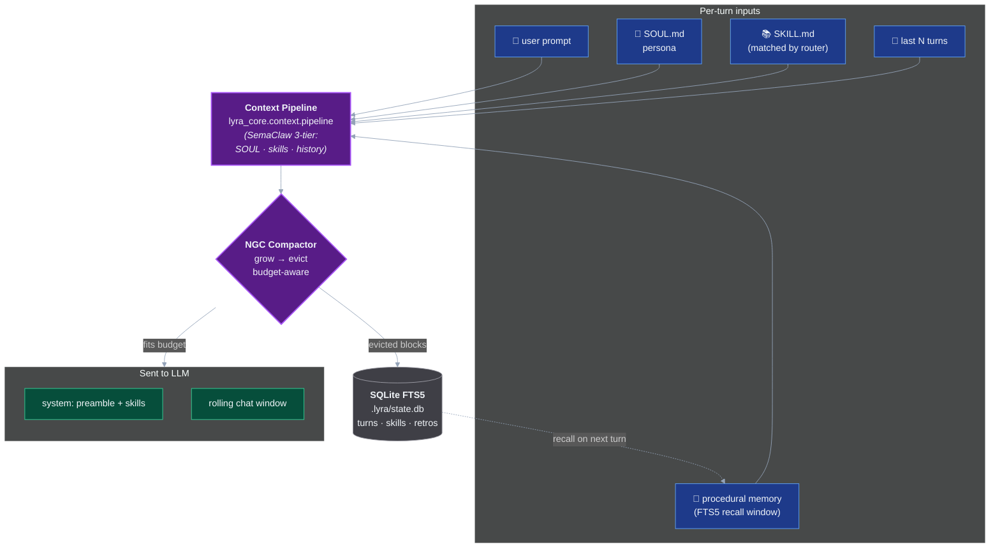

## Design sources, mapped to code

| Source | What survived | Where it lives |
|---|---|---|
| **Claude Code** ([doc 29](../../docs/29-dive-into-claude-code.md)) | Simple `while` loop, 5-layer compaction, 4-part extensibility (MCP + plugins + skills + hooks), subagents + worktrees | `lyra_core/context`, `lyra_core/subagent`, `lyra_core/harnesses`, `lyra_core/hooks` (kernel phase) |
| **OpenClaw** ([doc 52](../../docs/52-dive-into-open-claw.md)) | Pluggable harness architecture, `SKILL.md` / `SOUL.md` conventions, user-sovereign security | `lyra_core/harnesses/base.py` plugin registry, `SOUL.md` template + `.lyra/policy.yaml` |
| **Hermes Agent** ([doc 55](../../docs/55-hermes-agent-self-improving.md)) | Skill promotion loop, procedural memory | `lyra_skills/extractor.py`, `lyra_core/memory` |
| **SemaClaw** (arXiv:2604.11548, [doc 54](../../docs/54-semaclaw-general-purpose-agent.md)) | DAG Teams two-phase (LLM decompose + deterministic schedule), PermissionBridge as runtime primitive, SOUL-pinned three-tier context | `lyra_core/harnesses/dag_teams.py`, `lyra_core/permissions`, `lyra_core/context/pipeline.py` |
| **Atomic Skills** (arXiv:2604.05013, [doc 68](../../docs/68-atomic-skills-scaling-coding-agents.md)) | The five basis-vector skills | `lyra_skills/packs/atomic-skills/` |
| **claude-mem** ([doc 72](../../docs/72-claude-mem-persistent-memory-compression.md)) | SQLite FTS5 + progressive disclosure tools | `lyra_core/memory/{procedural,progressive}.py` |
| **gstack** ([doc 75](../../docs/75-gstack-garry-tan-claude-code-setup.md)) | 7-phase TDD sprint | `lyra_skills/packs/tdd-sprint/7-phase/SKILL.md` |
| **Karpathy rules** | Think Before Coding / Simplicity First / Surgical Changes / Goal-Driven Execution | `lyra_skills/packs/karpathy/` |

## Directory layout

```
projects/lyra/
├── README.md                  (this file)
├── Makefile                   (make ci, make test, make evals)
├── CHANGELOG.md
├── SOUL.md                    (dogfood persona)
├── .lyra/                     (dogfood state)
├── docs/
│   ├── architecture.md          architecture-tradeoff.md
│   ├── system-design.md         tdd-discipline.md
│   ├── threat-model.md          benchmarks.md
│   ├── roadmap.md               blocks/01..14-*.md
│   └── migration-to-lyra.md     (upgrade guide from open-coding/open-harness)
├── packages/
│   ├── lyra-core/       (kernel: loop, permissions, hooks, context, memory, tdd, verifier, subagent, harnesses, safety, observability)
│   ├── lyra-skills/     (loader + router + extractor + 4 shipped packs)
│   ├── lyra-mcp/        (client/ + server/)
│   ├── lyra-cli/        (typer app)
│   └── lyra-evals/      (runner + corpora)
└── examples/
    └── hello-tdd/             (runnable demo)
```

## Sessions — picking up where you left off (v3.2 / Phase L)

Every Lyra REPL run writes its turns to `<repo>/.lyra/sessions/<id>/turns.jsonl`
by default — no flags required, mirroring Claude Code's "your sessions
are always persisted" contract. The session id is auto-generated
(timestamped) on a fresh run and can be pinned with `--session ID`.
Once a session is on disk you have four ways to consume it from a
separate shell:

```bash
lyra --continue                # resume the most recent session in this repo
lyra --resume                  # alias for --continue
lyra --resume <id|prefix>      # resume a specific session (unique prefix ok)
lyra --session pin-001         # resume if pin-001 exists, else create it
```

Flow:

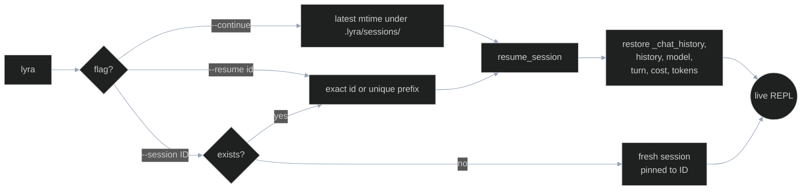

Out-of-band inspection lives under `lyra session …`:

```bash
lyra session list                     # recency-sorted summary of all sessions
lyra session list --json              # same, machine-readable
lyra session show latest              # manifest of the most recent session
lyra session show <id> --verbose      # + per-turn model/tokens/cost/latency
lyra session show <id> --json         # full manifest as JSON
lyra session delete <id>              # confirms by default; --yes to skip
```

Inside the REPL, `/history --verbose` (or `/history -v`) renders the
same per-turn breakdown — which model answered each prompt, how many
tokens each side spent, what each turn cost in USD, how long it took,
and when it ran. The plain-text mirror of that table is column-for-column
identical so non-TTY consumers (CI, scripts, `lyra | tee`) see the
same data.

On-disk shape (one directory per session):

```
<repo>/.lyra/sessions/<id>/
├── turns.jsonl     # one JSON event per turn (kind=turn|chat),
│                   #   carrying mode, model, ts, tokens_in/out,
│                   #   cost_delta_usd, latency_ms (all optional —
│                   #   pre-v3.2 sessions parse identically)
└── meta.json       # {session_id, created_at, name?, forked_from?}
```

All v3.2 metadata fields are additive and optional; pre-v3.2 sessions
load unchanged with the new fields set to `None`.

## Token Observatory — see where your AI spend goes (v3.3 / Phase M)

`lyra burn` reads the same `<repo>/.lyra/sessions/*/turns.jsonl`
transcripts that Phase L writes and renders a snapshot dashboard with
spend, activity classification (13 categories), one-shot rate, retry
detection, and per-session git correlation. Inspired by
[CodeBurn](https://github.com/getagentseal/codeburn) — the classifier
ports its 13-category scheme, retry counter, and one-shot rate.
Differences from CodeBurn: we re-aim at Lyra's own JSONL (no cross-tool
ingestion in v3.3 — see roadmap), bias the classifier with Lyra's
4-mode taxonomy (`agent / plan / debug / ask`), and add a Lyra-specific
`R-FLASH-OVER-PRO` rule for tier-mismatch detection in our small/smart
DeepSeek split.

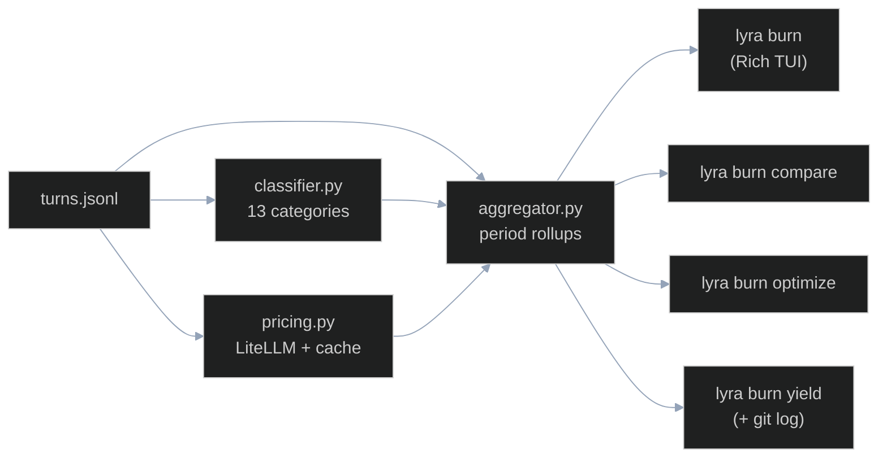

```bash
lyra burn                                # last 7 days, default snapshot
lyra burn --since 30d --json             # 30-day rollup as JSON
lyra burn --watch                        # re-render every 5s
lyra burn compare deepseek-v4-pro deepseek-v4-flash
lyra burn optimize                       # waste-pattern detector
lyra burn yield                          # productive vs reverted vs abandoned
```

Pricing comes from LiteLLM's
[`model_prices_and_context_window_backup.json`](https://github.com/BerriAI/litellm),
cached on disk for a week with ETag refresh. If you're airgapped or
LiteLLM is unreachable, `lyra burn` falls back to a hardcoded table
covering the top ~20 models so the dashboard never returns `$?.??` —
you'll see `source: fallback` in the footer instead.

The four waste rules in v3.3:

| Rule | Fires when | Why it matters |
|---|---|---|
| `R-RETRY-STREAK-3` | ≥3 consecutive coding/debugging retries | Model is stuck — switch tier or simplify |
| `R-LOW-1SHOT-RATE` | one-shot rate < 60 % over ≥5 coding turns | Likely missing context or wrong model tier |
| `R-EXPLORE-HEAVY` | > 40 % of turns are `explore` | Distill repeat findings into SOUL.md |
| `R-FLASH-OVER-PRO` | flash model used on `feature` turns | Pro tier may be cheaper-per-success |

Rules live in `lyra_cli.observatory.optimize_rules.RULES` — pure
functions of `(rows) -> list[Finding]`, so adding a custom rule is one
import + one append.

## Reflective Learning — skills that learn from themselves (v3.5 / Phase O)

Phase O closes the loop on Phase N's progressive skills. The
harness already knew **which** SKILL.md packs were available and
**when** to inject them. Phase O makes it remember **how well each
one worked** and use that history to pick better packs next turn —
without sending a single byte to a remote service.

The shape is borrowed from **Memento-Skills** (the agent system
described at <https://github.com/Memento-Teams/Memento-Skills>) and
the **Read-Write Reflective Learning** formalisation in
[arXiv:2603.18743](https://arxiv.org/abs/2603.18743): every action
*writes* an outcome, every later decision *reads* the aggregated
outcomes, and reflection happens on demand instead of inside a heavy
training loop.

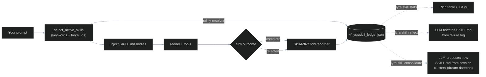

### What's new at the prompt

```bash
lyra skill stats                          # utility table, sorted high → low
lyra skill stats --top 20 --json          # machine-readable, jq-friendly
lyra skill reflect tdd-guide              # dry-run: diff a proposed rewrite
lyra skill reflect tdd-guide --apply      # commit + leave a .bak
lyra skill consolidate                    # propose new SKILL.md from sessions
lyra skill consolidate --apply            # install proposals into $LYRA_HOME/skills
```

`stats` is the read side of the loop: a Rich table (or `--json`)
with `id · utility · successes · failures · last_used`, sorted by
the same `utility_score` that ranks activation candidates. `--top
N` caps rows; `--include-zero` surfaces never-fired packs that may
be worth promoting. The score is a success-ratio with a 24-hour
recency boost, tie-broken first by total activations, then by
recency — so a freshly-proven skill beats a stale veteran.

`reflect` is the *focused* write side. Given a single skill ID,
Lyra pulls the failure history from the ledger, asks the active
LLM (`build_llm("auto")`, picked from your existing `settings.json`)
for an improved `SKILL.md`, and prints a unified diff. `--apply`
writes the new version with a timestamped `.bak` next to it. No
git, no migrations — drop-in.

`consolidate` is the *broad* write side, the equivalent of
Memento-Skills' "dream daemon". It scans recent
`events.jsonl`, extracts the `user.prompt` lines, clusters them
with light stemming + Jaccard similarity, and asks the LLM to
draft new SKILL.md candidates for the dominant clusters. Default
mode writes proposals to `$LYRA_HOME/skills/_proposals/` for human
review; `--apply` installs them straight into `$LYRA_HOME/skills/`.

### What's new under the hood

```python
from lyra_skills.ledger import (
    SkillLedger,
    SkillStats,
    SkillOutcome,
    load_ledger,
    utility_score,
    top_n,
)

ledger = load_ledger()                       # ~/.lyra/skill_ledger.json
ledger.record(
    skill_id="tdd-guide",
    outcome=SkillOutcome(kind="success", session_id="abc", turn=4),
)
ledger.save()                                # atomic, chmod 600
print(top_n(ledger, n=5))                    # utility-sorted preview
```

The ledger module is **stdlib-only** (no JSON schema library, no
fcntl tricks, no DB) so `lyra-skills` stays a leaf package. Writes
go through `tempfile` + `os.replace`, so a crash mid-write can't
leave a half-written ledger.

```python
from lyra_skills.activation import select_active_skills

def my_utility(skill_id: str) -> float:
    return tuned_scores.get(skill_id, 0.0)

active = select_active_skills(
    prompt=user_line,
    skills=loaded_skills,
    utility_resolver=my_utility,             # NEW in O.6
)
```

The `utility_resolver` callable is **optional** — old call sites
keep working unchanged, and `lyra-cli` falls back to the
resolver-free signature on `TypeError` so older `lyra-skills`
builds keep working too. When it *is* supplied, two skills that
tie on keyword match are sorted by utility before the `max_active`
cap is applied. `force_ids` continues to take absolute precedence:
explicit invocation always wins.

```python
from lyra_core.hooks.lifecycle import LifecycleEvent

def on_skills_activated(payload: dict) -> None:
    print(payload["activated_skills"])       # [{skill_id, reason}, …]

bus.subscribe(LifecycleEvent.SKILLS_ACTIVATED, on_skills_activated)
```

`SKILLS_ACTIVATED` is the new lifecycle event the driver emits at
the *start* of every chat turn (after activation but before the
LLM call). It's already wired to:

* the **HIR journaller** — every turn writes a `skills.activated`
  line to `events.jsonl` carrying the activation set, so post-hoc
  analytics can correlate skill choice with outcome,
* **OTel / LangSmith / Langfuse** fan-out via the existing
  `TracingHub`,
* the **plugin dispatcher** — implement
  `on_skills_activated(payload)` on any plugin and you'll get
  called.

### What we deliberately did *not* import

Phase O is a small surface on purpose. We read both sources end to
end and rejected:

* **Hybrid BM25 + dense retrieval** — Lyra's progressive activation
  already covers the keyword path, and adding `rank_bm25` /
  `sentence-transformers` to a leaf package would break the
  stdlib-only ethos of `lyra-skills`. Users who want semantic
  retrieval can plug it in via `utility_resolver`.
* **PyQt GUI shell + multi-IM gateway** — Lyra is CLI-first.
  Anything that needs a GUI ships outside the harness.
* **Operator-facing fine-tuning pipeline** — Lyra runs the
  harness, not the model. Reflection here means rewriting
  `SKILL.md`, not training weights.

The full design memo (which Memento-Skills concepts survived, why,
and what changed in translation) lives in
`references/research/memento-skills.md`.

## Harness Hardening — Lyra as a programmable runtime (v3.4 / Phase N)

Phase N takes the v3.3 CLI and exposes its insides. Three new
seams turn Lyra into something other tools and other agents can
embed:

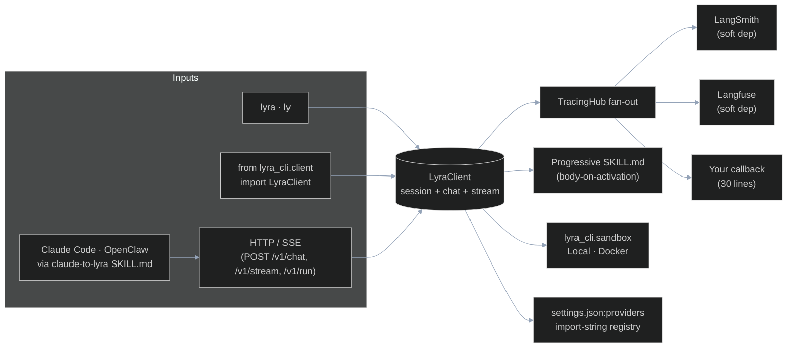

### `LyraClient` — embed the agent in 5 lines of Python

Anything `lyra` can do at the prompt, your code can do too:

```python
from lyra_cli.client import LyraClient

with LyraClient.create(repo_root=".", default_model="deepseek-v4-pro") as ly:
    print(ly.list_models()[:3])
    response = ly.chat("Refactor `parser.py` to streaming", stream=False)
    print(response.text)
    for event in ly.stream("Now write a smoke test"):
        if event.kind == "delta":
            print(event.text, end="")
```

Lazy session creation, typed `ChatRequest` / `ChatResponse` /
`StreamEvent` contracts, context-manager lifecycle, and the same
provider factory the CLI uses, so model selection works the same
in both surfaces.

### Tracing hub — every turn fans out

```python
from lyra_cli.tracing import TracingHub, LangSmithCallback, LangfuseCallback

hub = TracingHub.from_env()        # picks up LANGSMITH_*, LANGFUSE_*
hub.attach(my_metric_writer)       # 30-line callback
client = LyraClient.create(tracing=hub)
```

Two production observers ship in the box (LangSmith, Langfuse).
Both **soft-depend** on their SDK — if `langsmith` / `langfuse`
isn't installed, the callback is a no-op rather than an
`ImportError`. Errors inside one callback never block the rest of
the hub: each callback is isolated.

### `lyra setup` — first run, in <60 seconds

A fresh checkout used to demand "go read `docs/installation.md`,
edit `~/.lyra/.env`, set `DEEPSEEK_API_KEY`, then come back". Phase
N collapses that into one command:

```bash
lyra setup
# →  Detected providers on PATH: deepseek, openai
# →  Pick a default provider [deepseek]:
# →  Pick a default model     [deepseek-v4-pro]:
# →  Paste your DEEPSEEK_API_KEY (won't be echoed):
# →  Wrote ~/.lyra/settings.json (config_version=2)
# →  Wrote ~/.lyra/.env  (chmod 600)
# →  Run `lyra doctor` to verify everything is wired.
```

Driveable non-interactively for CI / docker images:

```bash
lyra setup \
  --provider openai --model gpt-4.1 \
  --api-key "$OPENAI_API_KEY" \
  --non-interactive --json
```

The wizard always writes `config_version: 2` (the new
`providers` map is empty by default; pre-v2 configs migrate
transparently on read).

### `lyra doctor --json` — machine-readable health

`lyra doctor` already rendered a Rich table. Phase N adds a
parallel JSON channel that the wizard, your CI, and the future
Cloud Bridge all share:

```bash
$ lyra doctor --json | jq '.probes[] | select(.ok==false)'
{
  "category": "providers",
  "name": "deepseek",
  "ok": false,
  "detail": "DEEPSEEK_API_KEY not set",
  "meta": { "var": "DEEPSEEK_API_KEY" }
}
```

Probes cover: Python version, `lyra-core`/`lyra-cli` packages,
`$LYRA_HOME` directory, configured providers (key presence per
provider), and optional integrations (`langsmith`, `langfuse`,
`docker`, `rich`). Required probes drive the exit code; soft
probes don't, so a fresh install with no API keys still exits 0
(the wizard wants `doctor` to succeed before it prompts).

### `lyra serve` — stdlib WSGI HTTP API

Run Lyra as a service for other agents (or for `curl`):

```bash
LYRA_API_TOKEN=secret lyra serve --host 127.0.0.1 --port 8765
```

| Endpoint | What it does |
|---|---|
| `GET /healthz` | Liveness, no auth |
| `GET /v1/models` / `/v1/skills` / `/v1/sessions` | Introspection |
| `POST /v1/chat` | Synchronous chat turn → `{ text, model, usage }` |
| `POST /v1/stream` | Same input, but **Server-Sent Events** stream |
| `POST /v1/run` | Run `argv` in a fresh `LocalSandbox`, with optional file staging, env vars, cwd, and a timeout |

The whole server is `wsgiref` + the stdlib — no FastAPI dep
shoved into your wheel. Bearer-token auth via `LYRA_API_TOKEN`
(off by default for `127.0.0.1`).

### `claude-to-lyra` skill — reverse bridge

A pre-packaged skill in `skills/claude-to-lyra/SKILL.md` lets
Claude Code (or any other harness) drop into Lyra for second
opinions, cost-shifted sub-tasks ("send it to flash"), or
sandboxed shell execution — all over the same HTTP API. The
SKILL.md is `progressive: true`, so its body only loads in the
caller's prompt when the keyword bridge fires, keeping the
default token cost free.

### Ephemeral sandboxes — execute untrusted shell safely

```python
from lyra_cli.sandbox import pick_sandbox

with pick_sandbox(preference="auto") as box:    # docker → local cascade
    box.write_file("input.csv", b"a,b\n1,2\n")
    result = box.run(["python", "-c", "import csv,sys; print(sum(int(r['b']) for r in csv.DictReader(open('input.csv'))))"], timeout=5.0)
    assert result.exit_code == 0
    assert result.stdout.strip() == "2"
```

Two implementations, one protocol:

| Provider | When | Isolation |
|---|---|---|
| `LocalSandbox` | Always available — `tempfile.mkdtemp` + `subprocess.run` with path-escape protection | Filesystem scratch dir, no network restrictions |
| `DockerSandbox` | When `docker` is on PATH — `docker run --rm` per command | New container per command, `--network=none`, image defaults to `python:3.11-slim` |

`pick_sandbox(preference="auto")` prefers Docker, falls back to
Local. The same `Sandbox` protocol drives the `POST /v1/run`
endpoint, so an HTTP caller gets the same isolation guarantees
as a Python caller.

### Skills get a real frontmatter — and load progressively

`SKILL.md` frontmatter grows beyond `id` / `description`:

```yaml
---
id: tdd-discipline
version: "0.4.0"
description: Enforce RED → GREEN → REFACTOR before any src/ edit.
keywords: [tdd, red-green, failing test]
applies_to: [agent, debug]
requires:
  packages: [pytest]
  binaries: [git]
progressive: true
---
```

Two new behaviours fall out of this:

1. **`lyra skill add <path-or-git-url>`** installs a skill pack
   from a local directory or a Git URL into `~/.lyra/skills/<id>/`.
   Validates the manifest, refuses to overwrite without `--force`,
   honours `LYRA_HOME`, and pairs with `lyra skill list` /
   `lyra skill remove <id>` for the reverse direction.
2. **Progressive loading.** When `progressive: true`, the skill's
   body is *not* baked into the system prompt by default — only
   its description is advertised (with a `[progressive]` marker).
   The body is injected for a single turn when:
   - the user types `USE SKILL: <id>` literally, **or**
   - the user's prompt contains one of the manifest's `keywords`,
     **or**
   - the chat loop force-activates it via `force_ids=[…]`.

   Non-progressive skills keep pre-N behaviour: description-only
   in the prompt, body fetched via the `Read` tool on demand.

The net effect: a curated skill library can grow to dozens of
packs without bloating the system prompt; only the active two or
three pay tokens per turn.

### Custom provider registry — bring your own LLM class

`settings.json` gains a `providers` map of
`slug → "package.module:Symbol"` import strings:

```json
{
  "config_version": 2,
  "default_provider": "openai",
  "default_model": "gpt-4.1",
  "providers": {
    "internal-coder":  "acme_llm.harness:InternalCoder",
    "internal-router": "acme_llm.harness:make_router"
  }
}
```

Both classes (instantiated with `kwargs`) and zero-arg /
`**kwargs` factories work. The resolved slug is wired into
`build_llm("internal-coder", model="…")` and surfaces in
`known_llm_names()` so `--llm internal-coder` shows up in
`--help` and shell completion. Builtin providers always take
precedence on a slug clash, so a custom `openai` import-string
can never silently replace the real OpenAI provider.

## Subagents — true isolation via git worktrees

`/spawn` doesn't fork a thread; it creates an actual `git worktree`
for the subagent so its file edits never collide with the parent
session, then 3-way-merges back when it's done. The sequence:

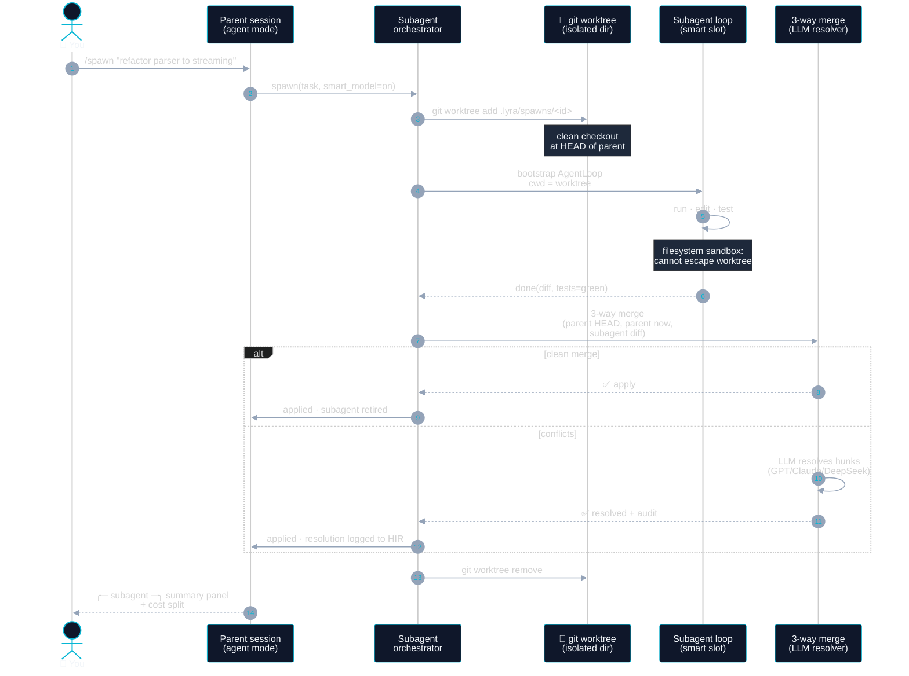

**Why it matters.** Most "subagent" implementations are just
Promise/Future fan-out over the same chat. Lyra's are honest
isolation: separate checkout, separate process, separate cost
ledger, separate HIR trace. You can run 8 in parallel with no
cross-contamination, and the merge step is observable.

## Optional TDD plugin — what it means concretely

As of v3.0.0 TDD is an **opt-in plugin**, not a runtime invariant.
Out of the box `lyra` behaves like `claw-code`, `opencode`, and
`hermes-agent`: a general coding agent that doesn't refuse Edits
because no failing test exists yet. Teams who want the historical
TDD-as-kernel posture flip one switch:

```text
plan › /tdd-gate on              # this session only
plan › /config set tdd_gate=on   # persists in ~/.lyra/config.yaml
```

…or set `[plugins.tdd] enabled = true` in `~/.lyra/settings.toml`.

When enabled, four guarantees light up (see
[`docs/tdd-discipline.md`](docs/tdd-discipline.md)):

1. **RED proof before mutation.** A `PreToolUse` hook blocks writes
   into `src/**` unless a validated `RedProof` (non-zero exit,
   `duration_ms > 0`, status `failed`, file exists) is attached to
   the session.
2. **GREEN proof before finalize.** `Stop` hook refuses a turn if
   acceptance tests aren't green or coverage regressed past tolerance
   (`lyra_core.tdd.coverage.check_coverage_delta`).
3. **Evidence must survive cross-channel checks.** The verifier
   scans "passing" acceptance tests for commented-out assertions,
   bare `pass` bodies, and removed guards
   (`lyra_core.verifier.cross_channel`).
4. **Evaluator cannot be in the same family as the agent** without a
   `degraded_eval=same_family` tag
   (`lyra_core.verifier.evaluator_family`).

### TDD state machine — when the gate is on

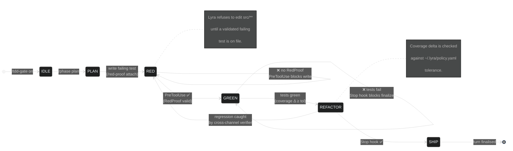

The state machine (`lyra_core.tdd.state`), the gate hook
(`lyra_core.hooks.tdd_gate`), and the `/phase`, `/tdd-gate`,
`/red-proof` slashes ship with every install — they're simply not
the default surface anymore. Escape hatches (`--no-tdd`) and the
audit log (`lyra_core.tdd.audit`) are unchanged.

## Success metrics — v1 acceptance targets

Tracked nightly via `lyra-evals` against the three corpora:

| Metric | Target | Corpus / source |
|---|---|---|
| Golden-corpus task success | ≥ 85% | `lyra_evals.corpora.golden_tasks` |
| Red-team sabotage recall | ≥ 90% | `lyra_evals.corpora.red_team_tasks` |
| p95 first-reply latency | ≤ 3 s | single-agent harness, SSD, local embedder |
| Median session cost | ≤ $0.25 | mixed-family model, 8k context budget |
| Safety monitor false-positive rate | < 1% | benign dogfood sessions |
| Drift gate | success drop > 5% w/w triggers review | nightly CI |

The full methodology lives in [`docs/benchmarks.md`](docs/benchmarks.md).

## Phase completion map

| Phase | Name | Tests |
|---|---|---|
| 1 | Kernel: loop + permissions + hooks + 5 native tools | 79 |
| 2 | Plan Mode + CLI surface | 47 |
| 3 | Context engine + memory tier-1 | 13 |
| 4 | TDD gate full contract | 18 |
| 5 | Verifier + cross-channel | 14 |
| 6 | Skill engine + extractor + 4 packs | 19 |
| 7 | Subagents + worktrees | 17 |
| 8 | DAG teams plugin | 13 |
| 9 | Safety monitor + HIR + OTLP + retro | 14 |
| 10 | MCP bidirectional | 14 |
| 11 | Eval runner + corpora + release wiring | 6 |
| **v0.1.0 subtotal** | | **254** |
| 12 | Public-benchmark adapters (SWE-bench Pro + LoCoEval) + snapshot + contamination guard | 29 |
| 13 | Interactive shell (`lyra` → Claude-Code-style REPL) | 27 |
| v1.7 Phase 1 | Rename `open-coding → open-harness` + `.open-harness/` state dir + `oh` alias + legacy migrator | brand / state-dir / migrator tests |
| v1.7 Phase 2 | AgentLoop primitives (hermes `run_conversation`) + `IterationBudget` + plugin hooks + `task`-tool subagent fork | agent-loop contract |
| v1.7 Phase 3 | Skill self-creation: `_iters_since_skill` counter, `skill_manage` tool, background `spawn_skill_review`, `SkillRouter.system_prompt_index` | skill-nudge + skill-manage tests |
| v1.7 Phase 4 | SQLite+FTS5 session store at `.lyra/state.db` + JSONL migrator + `session_search` recall tool (FTS + LLM summarize) | session-store + recall tests |
| v1.7 Phase 5 | Unified `COMMAND_REGISTRY` drives REPL completer, `/help`, dispatcher, plugin commands, `/mcp:*`, `/skill:*` | command-registry tests |
| v1.7 Phase 6 | UI polish: claw-code tool card + fence-aware stream buffer + threaded Braille spinner; opencode leader-chord keybinds + footer status; Claude-Code welcome card | tool-card + stream + spinner + keybinds tests |
| v1.7 Phase 7 | Provider registry with capability metadata (`supports_reasoning/tools`, `context_window`) + optional `lsp` tool (XML `<diagnostics/>` injection, off by default) | provider-registry + lsp tests |
| v1.7.1 rebrand | Rename `open-harness → lyra` + chained `.opencoding|.open-harness → .lyra` migrator + `ly` alias + "LYRA" banner redraw | brand-v2 / migration-v2 tests |
| **v1.7.1 Unreleased total** | | **601+** |

## How to read these docs (recommended order)

1. This README — the tour and the quickstart.
2. [`docs/architecture.md`](docs/architecture.md) — ten commitments,
   non-goals.
3. [`docs/architecture-tradeoff.md`](docs/architecture-tradeoff.md)
   — every accepted/rejected design decision with costs.
4. [`docs/tdd-discipline.md`](docs/tdd-discipline.md) — the optional
   TDD plugin: how the gate is encoded when you flip it on.
5. [`docs/system-design.md`](docs/system-design.md) — operational
   spec, data model, APIs, SLOs.
6. [`docs/threat-model.md`](docs/threat-model.md) — attack surface +
   defense-in-depth.
7. [`docs/roadmap.md`](docs/roadmap.md) + `docs/blocks/` —
   phase-by-phase contracts.
8. [`docs/benchmarks.md`](docs/benchmarks.md) — how the numbers
   above are produced.
9. [`docs/migration-to-lyra.md`](docs/migration-to-lyra.md) —
   upgrading from the legacy `open-coding` or `open-harness` names.

## Non-goals

- Not a chat interface. The CLI returns artifacts; it doesn't
  pretend to be a conversation.
- Not a SaaS. The daemon is local; team coordination waits for the
  Multica integration.
- Not a training harness in v1. Agent-World-style environment
  synthesis is a v2 module.
- Not a replacement for tests written by humans. When the optional
  TDD plugin is enabled, the gate refuses to act without a red test;
  it is not the test author.

## Relationship to other workspace projects

- [**orion-code**](../orion-code/) — sibling and predecessor.
  Orion-Code's architectural thinking is what Lyra rebases onto a
  general-purpose, multi-provider coding-agent core (with TDD
  shipped as one of several optional discipline plugins). Long-term:
  Orion-Code becomes a preset of Lyra.
- [**gnomon**](../gnomon/) — evaluator and trace analyzer. Lyra
  emits HIR-compatible traces so Gnomon consumes them without
  adapter work.
- [**mentat-learn**](../mentat-learn/) — self-improving
  personal-domain agent. Shares the extractor pattern; different
  tool set.
- [**syndicate**](../syndicate/) — multi-agent product workflow.
  Can deploy side-by-side: Syndicate coordinates business workflows,
  Lyra is the coding teammate inside one role.

## Roadmap beyond v1

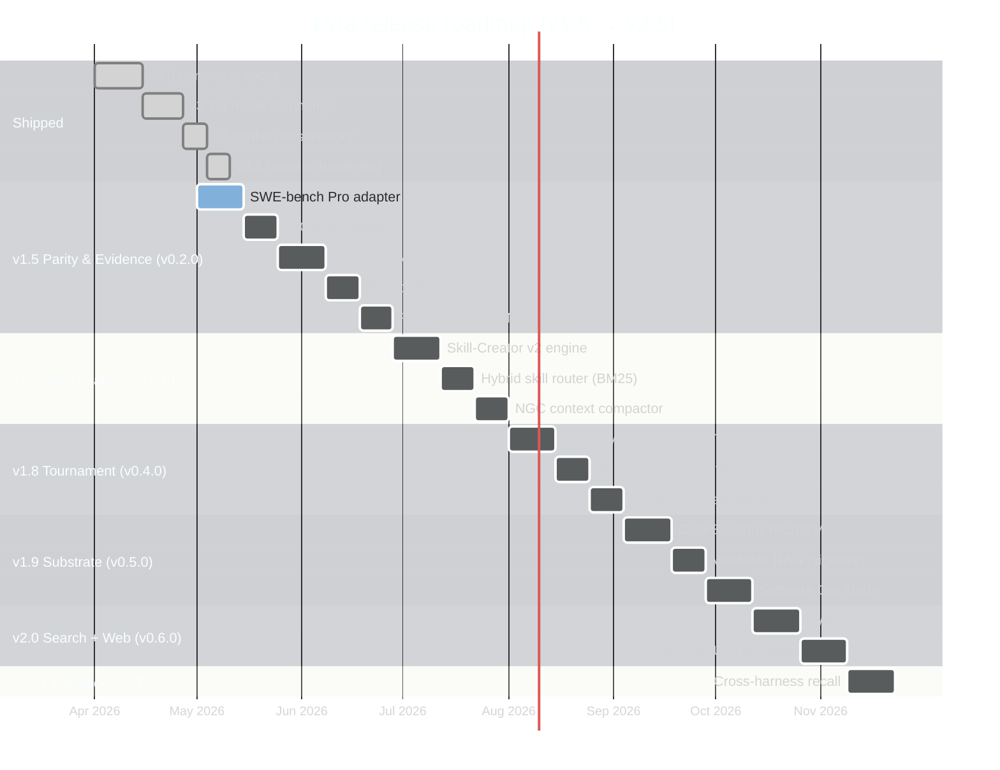

### A typical hour with Lyra


Full plan (phase-by-phase with red tests, DoDs, and trade-offs) in
[`docs/roadmap-v1.5-v2.md`](docs/roadmap-v1.5-v2.md), grounded in an
April-2026 landscape study (Meta-Harness, SWE-TRACE, SWE-bench Pro,
CodeAct, NGC, Anthropic Skill-Creator v2, etc.). The companion
[`docs/novel-ideas.md`](docs/novel-ideas.md) proposes **fifteen novel
selling points** for v1.8 / v1.9 / v2.0 / v2.5 that go *beyond* the
existing roadmap. **Wave 1** (eight capabilities): Meta TTS tournament,
ReasoningBank failure-distillation, Skill-RAG, KnowRL-style TDD-reward,
CubeSandbox microVM, PoisonedRAG defense, self-wiring memory graph,
cross-harness federation. **Wave 2** (seven performance edges):
intra-attempt MCTS (SWE-Search), confidence-cascade routing
(FrugalGPT/RouteLLM), Software Org Mode (MetaGPT/ChatDev),
Voyager-style skill curriculum, Process Reward Model adapter,
Computer-Use browser sandbox (OSWorld), and EAGLE-3 speculative
decoding. The 21 underlying papers are mirrored under
[`papers/`](papers/) (~140 MB). Upgrading from `open-coding` or
`open-harness`? See [`docs/migration-to-lyra.md`](docs/migration-to-lyra.md)
for the automatic chained `.opencoding|.open-harness → .lyra`
migration, the new `ly` alias, and the changed CLI entry points.

- **v1.5 "Parity & Evidence"** (≈ 8 weeks, `v0.2.0`): SWE-bench Pro
  + LoCoEval adapters; interactive REPL; CodeAct-style
  Python-as-action harness plugin; Rubric PRM verifier +
  Refute-or-Promote stage; remote runners (Modal/Fly/Docker) +
  default rootless-podman sandbox + PII masking; Agentless
  parallel-candidate mode; ACON observation compression +
  Devin-Wiki-style auto-indexed repo docs.
- **v1.7 "Self-Creating Harness"** (≈ 6 weeks, `v0.3.0`): Adopts
  Stanford NGC ([arXiv:2604.18002](https://arxiv.org/abs/2604.18002))
  and Anthropic's Skill-Creator v2
  ([`anthropics/skills/skill-creator`](https://github.com/anthropics/skills/tree/main/skills/skill-creator)).
  Skill-Creator engine (4-agent Executor/Grader/Comparator/Analyzer
  loop + `benchmark.json` artifacts); reuse-first hybrid router
  (BM25 + dense embeddings + description match, explicit
  `NO_MATCH`/`AMBIGUOUS` verdicts); trigger-eval corpus +
  description auto-optimizer (60/40 train/test, 5-iter); in-session
  synthesis + skill lifecycle (repetition + bundled-script
  detectors, `/creator` slash command, outcome attribution,
  refine/retire); NGC-inspired context compactor (grow-then-evict
  cadence, block-level eviction, budget-aware interoception in
  SOUL, LLM rerank, outcome logging).
- **v2 "Self-Evolving Harness"** (≈ 14 weeks, `v0.5.0`): Meta-Harness
  outer loop that lets Lyra optimize its own harness against your
  repo; blind A/B arena mode; federated skill registry with sigstore
  signing; KLong long-horizon checkpoint/resume across model
  generations; the four already-earmarked v2 items (training-arena
  corpus exporter now incl. NGC-format outcome logs, Multica team
  orchestration, federated retros, Agentic-Wiki cross-repo sharing).
- **v1.8 "Tournament"** (≈ 6 weeks, `v0.4.0`, planned in
  [`docs/novel-ideas.md`](docs/novel-ideas.md)): Meta-style
  Recursive-Tournament-Voting + Parallel-Distill-Refine TTS for
  coding ([arXiv:2604.16529](https://arxiv.org/abs/2604.16529));
  ReasoningBank failure-distillation + MaTTS
  ([arXiv:2509.25140](https://arxiv.org/abs/2509.25140)); Skill-RAG
  hidden-state prober + 4-skill recovery router
  ([arXiv:2604.15771](https://arxiv.org/abs/2604.15771)); KnowRL-style
  TDD-reward inference signal
  ([arXiv:2506.19807](https://arxiv.org/abs/2506.19807)); plus Wave-2
  performance edges — confidence-cascade routing
  ([FrugalGPT](https://arxiv.org/abs/2305.05176) /
  [RouteLLM](https://arxiv.org/abs/2406.18665) /
  [Confidence-Driven](https://arxiv.org/abs/2502.11021)) and a
  Process-Reward-Model adapter ([Qwen2.5-Math-PRM
  lessons](https://arxiv.org/abs/2501.07301)); plus τ-Bench and
  Terminal-Bench 2.0 evaluation adapters.
- **v1.9 "Substrate"** (≈ 6 weeks, `v0.5.0`): CubeSandbox-compatible
  microVM execution backend (sub-100 ms cold start, kernel isolation,
  E2B-drop-in — [`TencentCloud/CubeSandbox`](https://github.com/TencentCloud/CubeSandbox));
  verifiable RAG corpus with sigstore-signed entries and k-of-n
  publisher quorum (PoisonedRAG defense,
  [arXiv:2402.07867](https://arxiv.org/abs/2402.07867)); self-wiring
  knowledge graph for procedural memory (GBrain v0.12-inspired);
  Wave-2 additions — Software Org Mode (Roles + SOPs from
  [MetaGPT](https://arxiv.org/abs/2308.00352) and
  [ChatDev](https://arxiv.org/abs/2307.07924)),
  [Voyager-style](https://arxiv.org/abs/2305.16291) skill curriculum,
  and an [EAGLE-3](https://arxiv.org/abs/2503.01840) speculative-
  decoding profile for the local-OSS ladder.
- **v2.0 "Search + Web"** (Wave-2 only, ≈ 6 weeks, `v0.6.0`):
  Intra-attempt MCTS via the SWE-Search policy
  ([arXiv:2410.20285](https://arxiv.org/abs/2410.20285)) plus a first-
  class Computer-Use browser sandbox running inside the v1.9 microVM
  ([Anthropic Computer Use](https://docs.anthropic.com/en/docs/agents-and-tools/computer-use),
  [OSWorld](https://arxiv.org/abs/2404.07972)).
- **v2.5 "Federation"** (≈ 6 weeks, `v0.7.0`): Cross-harness trace
  federation — `lyra recall --harness all` answers across Claude
  Code / OpenClaw / Hermes / Moraine sessions
  ([`eric-tramel/moraine`](https://github.com/eric-tramel/moraine)).
- **Stretch (post-v2.5):** 8-hour continuous autonomous run profile
  (GLM-5.1-style), DSPy-compiled skill bodies, SWE-RL-format
  outcome-RL training corpus ([`facebookresearch/swe-rl`](https://github.com/facebookresearch/swe-rl)).
- **Cross-cutting Wave-3** — Diversity-Collapse hardening: every
  parallel/multi-agent surface gets quantitative diversity contracts
  (`pool_diversity` field, NGT independence guard, MMR-weighted recall,
  Vertical+Subgroups defaults for Software Org Mode); 9 GREEN +
  4 RED tests already on file. Full mapping in
  [`docs/research/diversity-collapse-analysis.md`](docs/research/diversity-collapse-analysis.md);
  source paper [arXiv:2604.18005](https://arxiv.org/abs/2604.18005)
  (ACL 2026 Findings, mirrored at
  [`papers/diversity-collapse-mas.pdf`](papers/diversity-collapse-mas.pdf)).

## License

MIT. See [`LICENSE`](LICENSE).
