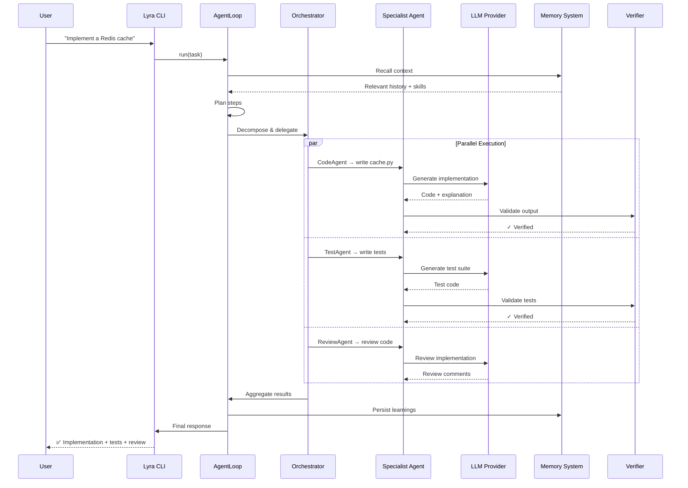
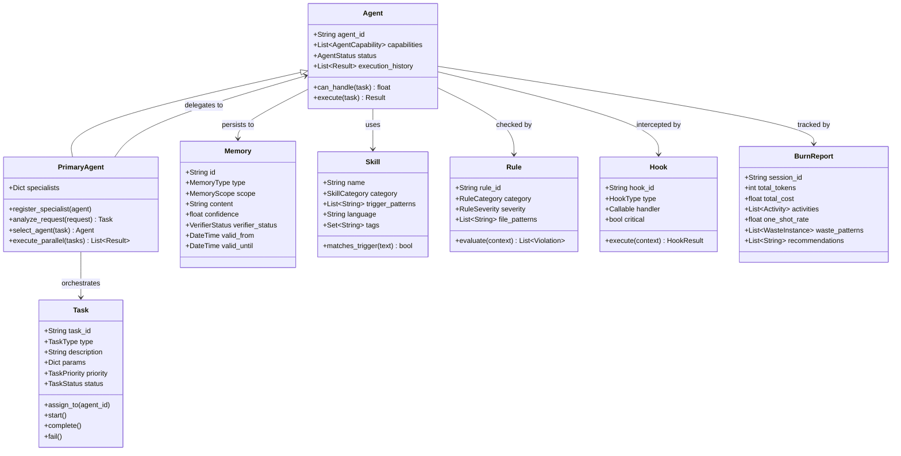
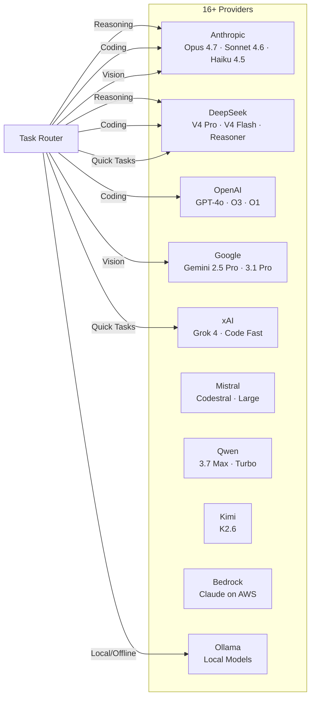

# Lyra — Personal Superintelligent AI Research Agent

[](https://python.org)
[](https://www.typescriptlang.org/)
[](pyproject.toml)
[](LICENSE)
[](packages/)
[](.github/workflows/ci.yml)

> **Lyra** is a production-grade, self-improving AI agent platform. It combines multi-agent orchestration, deep reasoning, hierarchical memory, and a Claude Code-style terminal interface into one extensible toolkit. 135+ composable packages. 16+ LLM providers. Built for builders.

---

## Architecture Overview


```mermaid
graph TB
    subgraph Interface["🖥️ Interface Layer"]
        CLI["lyra CLI<br/>(Typer + prompt_toolkit)"]
        TUI["Terminal UI<br/>(Ink/React)"]
        API["ACP Server<br/>(Agent Client Protocol)"]
    end

    subgraph Kernel["⚙️ Kernel (lyra-core)"]
        Loop["AgentLoop<br/>plan → tools → verify"]
        TDD["TDD Gate<br/>RED → GREEN → REFACTOR"]
        Perms["PermissionBridge<br/>plan | auto-edit | bypass"]
        HIR["HIR Emitter<br/>(JSONL event stream)"]
    end

    subgraph Intelligence["🧠 Intelligence Layer"]
        Reasoning["Deep Reasoning<br/>(CoT, Tree Search, Debate)"]
        Research["Research Pipeline<br/>(10-step, 7+ sources)"]
        Evolution["Self-Evolution<br/>(GEPA prompt optimizer)"]
        Memory["Hierarchical Memory<br/>(8-level, hybrid retrieval)"]
    end

    subgraph Coordination["🔄 Coordination Layer"]
        Orchestrator["Agent Orchestrator<br/>(DAG-based teams)"]
        Subagents["Subagent Runner<br/>(worktree isolation)"]
        Skills["Skill Registry<br/>(150+ trigger patterns)"]
        Rules["Rule Engine<br/>(coding, security, testing)"]
    end

    subgraph Safety["🛡️ Safety Layer"]
        Shield["AgentShield<br/>(secrets, injection, XSS)"]
        Observatory["TokenObservatory<br/>(13 categories, 7 wastes)"]
        Verifier["Two-Phase Verifier<br/>(step + trace)"]
    end

    subgraph Providers["🌐 LLM Providers"]
        Anthro["Anthropic<br/>Opus · Sonnet · Haiku"]
        DS["DeepSeek<br/>V4 Pro · Flash"]
        OAI["OpenAI<br/>GPT-4o · O3"]
        Gemini["Google<br/>Gemini 2.5/3.1"]
        Others["xAI · Mistral · Qwen<br/>Kimi · Bedrock · Ollama"]
    end

    CLI --> Loop
    TUI --> Loop
    API --> Loop
    Loop --> TDD
    Loop --> Perms
    Loop --> HIR
    Loop --> Reasoning
    Loop --> Research
    Loop --> Memory
    Loop --> Orchestrator
    Loop --> Subagents
    Loop --> Skills
    Loop --> Rules
    Loop --> Shield
    Loop --> Observatory
    Loop --> Verifier
    Orchestrator --> Anthro & DS & OAI & Gemini & Others
    Reasoning --> Anthro & DS & OAI & Gemini & Others
    Research --> Anthro & DS & OAI & Gemini & Others
```

## How Lyra Thinks


```mermaid
sequenceDiagram
    participant User
    participant CLI as Lyra CLI
    participant Engine as AgentLoop
    participant Orch as Orchestrator
    participant Agent as Specialist Agent
    participant LLM as LLM Provider
    participant Mem as Memory System
    participant Verify as Verifier

    User->>CLI: "Implement a Redis cache"
    CLI->>Engine: run(task)
    Engine->>Mem: Recall context
    Mem-->>Engine: Relevant history + skills
    Engine->>Engine: Plan steps
    Engine->>Orch: Decompose & delegate

    par Parallel Execution
        Orch->>Agent: CodeAgent → write cache.py
        Agent->>LLM: Generate implementation
        LLM-->>Agent: Code + explanation
        Agent->>Verify: Validate output
        Verify-->>Agent: ✓ Verified
    and
        Orch->>Agent: TestAgent → write tests
        Agent->>LLM: Generate test suite
        LLM-->>Agent: Test code
        Agent->>Verify: Validate tests
        Verify-->>Agent: ✓ Verified
    and
        Orch->>Agent: ReviewAgent → review code
        Agent->>LLM: Review implementation
        LLM-->>Agent: Review comments
    end

    Orch->>Engine: Aggregate results
    Engine->>Mem: Persist learnings
    Engine->>CLI: Final response
    CLI-->>User: ✅ Implementation + tests + review
```

## Data Model


```mermaid
classDiagram
    class Task {
        +String task_id
        +TaskType type
        +String description
        +Dict params
        +TaskPriority priority
        +TaskStatus status
        +assign_to(agent_id)
        +start()
        +complete()
        +fail()
    }

    class Agent {
        +String agent_id
        +List~AgentCapability~ capabilities
        +AgentStatus status
        +List~Result~ execution_history
        +can_handle(task) float
        +execute(task) Result
    }

    class PrimaryAgent {
        +Dict specialists
        +register_specialist(agent)
        +analyze_request(request) Task
        +select_agent(task) Agent
        +execute_parallel(tasks) List~Result~
    }

    class Memory {
        +String id
        +MemoryType type
        +MemoryScope scope
        +String content
        +float confidence
        +VerifierStatus verifier_status
        +DateTime valid_from
        +DateTime valid_until
    }

    class Skill {
        +String name
        +SkillCategory category
        +List~String~ trigger_patterns
        +String language
        +Set~String~ tags
        +matches_trigger(text) bool
    }

    class Rule {
        +String rule_id
        +RuleCategory category
        +RuleSeverity severity
        +List~String~ file_patterns
        +evaluate(context) List~Violation~
    }

    class Hook {
        +String hook_id
        +HookType type
        +Callable handler
        +bool critical
        +execute(context) HookResult
    }

    class BurnReport {
        +String session_id
        +int total_tokens
        +float total_cost
        +List~Activity~ activities
        +float one_shot_rate
        +List~WasteInstance~ waste_patterns
        +List~String~ recommendations
    }

    Agent <|-- PrimaryAgent
    PrimaryAgent --> Task : orchestrates
    PrimaryAgent --> Agent : delegates to
    Agent --> Memory : persists to
    Agent --> Skill : uses
    Agent --> Rule : checked by
    Agent --> Hook : intercepted by
    Agent --> BurnReport : tracked by
```

## Package Catalog

Lyra is a **monorepo of 135+ composable packages** organized into three tiers:

### Foundation Tier — Core Agent Runtime

| Package | Purpose | Key Capabilities |
|---------|---------|-----------------|
| `lyra-core` | Kernel | AgentLoop, TDD state machine, permissions, HIR observability, ACP server |
| `lyra-cli` | CLI Application | Typer CLI (25+ commands), prompt_toolkit REPL, 16 LLM providers |
| `lyra-agents` | Agent System | Primary orchestrator, specialist agents (code, test, review, research) |
| `lyra-orchestration` | Coordination | Event bus, agent coordinator, dependency management, parallel execution |
| `lyra-memory` | Memory System | 8-level hierarchy, hybrid BM25+vector retrieval, temporal validity |
| `lyra-skills` | Skill Engine | 150+ trigger patterns, 20+ skill categories, search & auto-load |
| `lyra-evals` | Evaluation | Eval harness, rubric scoring, regression testing |
| `lyra-mcp` | MCP Server | Model Context Protocol integration, tool exposure |

### Breakthrough Tier — Advanced Intelligence

| Package | Purpose | Key Capabilities |
|---------|---------|-----------------|
| `lyra-reasoning` | Deep Reasoning | CoT, tree search, multi-agent debate, hypothesis generation |
| `lyra-research` | Research Agent | 10-step pipeline, 7+ academic sources, citation traversal |
| `lyra-evolution` | Self-Improvement | GEPA prompt optimization, strategy synthesis, continuous learning |
| `lyra-cognitive` | Cognitive Architecture | Belief revision, instinct system, competence mapping |
| `lyra-continual` | Continual Learning | Drift detection, regression testing, knowledge consolidation |
| `lyra-personalization` | User Modeling | Preference learning, behavior patterns, adaptive interaction |
| `lyra-router` | Model Router | Task-based routing, cost optimization, fallback chains |
| `lyra-streaming` | Real-time Streams | SSE streaming, token-by-token output, progress indicators |
| `lyra-cost` | Cost Management | Budget tracking, token economics, burn reports |

### AGI Ascent Tier — Frontier Capabilities

| Package | Purpose | Key Capabilities |
|---------|---------|-----------------|
| `lyra-verification` | Multi-Level Verify | Step, trace, external, and cross-agent verification |
| `lyra-world-model` | World Simulation | Causal graphs, counterfactual reasoning, digital twins |
| `lyra-meta-evolution` | Meta Learning | Recursive self-improvement, strategy discovery |
| `lyra-rsi` | Recursive Self-Improvement | Post-training loops, intelligence explosion safety |
| `lyra-colony` | Agent Swarms | Emergent coordination, collective intelligence |
| `lyra-gossip-memory` | Shared Memory | Cross-agent knowledge sharing, consensus formation |
| `lyra-auto-mode` | Autonomous Operation | Self-directed task decomposition, autonomous loops |
| `lyra-constitutional` | AI Safety | Constitutional AI principles, alignment verification |
| `lyra-cyber` | Cybersecurity | Pentest automation, vulnerability discovery |
| `lyra-finance` | Financial Analysis | Market analysis, risk modeling, portfolio optimization |

### UI Layer — TypeScript Terminal Interface

| Package | Purpose | Key Capabilities |
|---------|---------|-----------------|
| `ui-core` | UI Foundation | Zustand state store, Dracula theme, rendering pipeline |
| `ui-terminal` | Ink TUI | StatusBar, ModelPicker, CommandPalette, AgentTree, SyntaxHighlight |
| `ui-transport` | Transport | WebSocket + HTTP/SSE communication layer |

> **Full catalog**: See [`packages/`](packages/) for all 135+ packages. Each package has its own README with API docs and examples.

## LLM Provider Support


```mermaid
graph LR
    subgraph "16+ Providers"
        A[Anthropic<br/>Opus 4.7 · Sonnet 4.6 · Haiku 4.5]
        B[DeepSeek<br/>V4 Pro · V4 Flash · Reasoner]
        C[OpenAI<br/>GPT-4o · O3 · O1]
        D[Google<br/>Gemini 2.5 Pro · 3.1 Pro]
        E[xAI<br/>Grok 4 · Code Fast]
        F[Mistral<br/>Codestral · Large]
        G[Qwen<br/>3.7 Max · Turbo]
        H[Kimi<br/>K2.6]
        I[Bedrock<br/>Claude on AWS]
        J[Ollama<br/>Local Models]
    end

    Router[Task Router] -->|Reasoning| A & B
    Router -->|Coding| A & B & C
    Router -->|Quick Tasks| B & E
    Router -->|Vision| A & D
    Router -->|Local/Offline| J
```

| Provider | Models | Context | Reasoning | Vision | Tools | Best For |
|----------|--------|---------|-----------|--------|-------|----------|
| **Anthropic** | Opus 4.7, Sonnet 4.6, Haiku 4.5 | 200K | ✓ | ✓ | ✓ | Complex reasoning, coding |
| **DeepSeek** | V4 Pro, V4 Flash, Reasoner, Chat | 128K | ✓ | — | ✓ | Cost-effective reasoning |
| **OpenAI** | GPT-4o, O3, O3 Mini, O1 | 200K | ✓ | ✓ | ✓ | Broad capability |
| **Google** | Gemini 2.5 Pro, 3.1 Pro, Flash | 2M | ✓ | ✓ | ✓ | Long context, multimodal |
| **xAI** | Grok 4, Code Fast | 256K | — | — | ✓ | Fast coding tasks |
| **Mistral** | Codestral, Large | 256K | — | — | ✓ | Code generation |
| **Qwen** | 3.7 Max, Turbo, Plus | 128K | ✓ | — | ✓ | Asian language tasks |
| **Kimi** | K2.6 | 128K | ✓ | — | ✓ | Chinese market |
| **Bedrock** | Claude via AWS | 200K | ✓ | — | ✓ | Enterprise/regulated |
| **Ollama** | Llama, Qwen Coder | 8K+ | — | — | ✓ | Local/offline dev |

## Quickstart

```bash
# 1. Clone and install
git clone https://github.com/lyra-ai/lyra.git && cd lyra

# 2. Install Python dependencies
pip install -e ".[dev]"

# 3. Install TypeScript dependencies (for TUI)
npm install && npm run build --workspaces

# 4. Set at least one API key
export ANTHROPIC_API_KEY="sk-ant-..."
export DEEPSEEK_API_KEY="sk-..."

# 5. Launch the interactive REPL
lyra

# Or with the TypeScript TUI
lyra --tui
```

## CLI Commands

```bash
# Interactive REPL (default)
lyra                                    # Start interactive session
lyra --model deepseek-v4-pro            # With specific model
lyra --continue                         # Resume last session

# Single-shot commands
lyra run "Add Redis caching to user service"
lyra plan "Design rate limiting strategy"
lyra investigate "Memory leak in worker process"

# Session management
lyra session list                       # List all sessions
lyra session show <id>                  # Show session details
lyra retro                              # Session retrospective

# Model management
lyra model list                         # List configured models
lyra model set anthropic:sonnet         # Switch default model

# MCP management
lyra mcp list                           # List MCP servers
lyra mcp add <config>                   # Add MCP server

# Health & diagnostics
lyra doctor                             # System health check
lyra status                             # Runtime status
lyra burn                               # Token usage report

# Skills & memory
lyra skill list                         # List available skills
lyra memory search "deployment process" # Search memory

# Development
lyra evals                              # Run evaluation harness
lyra evolve                             # Run prompt evolution
```

## Keyboard Shortcuts

| Key | Action |
|-----|--------|
| `Ctrl+K` | Command palette |
| `Ctrl+D` | Exit session |
| `Ctrl+L` | Clear screen |
| `Ctrl+G` | Open external editor |
| `Ctrl+T` | Toggle side panel |
| `Ctrl+O` | Toggle output panel |
| `Alt+T` | Toggle deep thinking |
| `Alt+P` | Model catalog |
| `Shift+Tab` | Cycle permission mode |
| `Up/Down` | Navigate history |
| `Tab` | Accept autocomplete |
| `Esc Esc` | Rewind last turn |
| `!cmd` | Run shell command |

## Project Structure

```
projects/lyra/
├── src/                          # Core Python library
│   ├── agents/                   # Agent implementations
│   │   ├── primary.py            # PrimaryAgent — orchestrator
│   │   ├── code_agent.py         # CodeAgent — code generation
│   │   ├── research_agent.py     # ResearchAgent — deep research
│   │   ├── test_agent.py         # TestAgent — test generation
│   │   └── review_agent.py       # ReviewAgent — code review
│   ├── coordination/             # Multi-agent coordination
│   │   ├── task_allocator.py     # Smart task assignment
│   │   ├── load_balancer.py      # Agent load balancing
│   │   ├── dependency_manager.py # DAG-based dependencies
│   │   └── conflict_resolver.py  # Resource conflict resolution
│   ├── memory/                   # Memory system
│   │   ├── memory_store.py       # Persistent memory storage
│   │   ├── short_term_memory.py  # Recent context (STM)
│   │   ├── long_term_memory.py   # Persistent knowledge (LTM)
│   │   ├── memory_retrieval.py   # Hybrid BM25+vector search
│   │   └── memory_consolidation.py # STM → LTM consolidation
│   ├── hooks/                    # Hook system
│   │   ├── hook.py               # Hook types (Pre/PostToolUse, Stop)
│   │   ├── hook_engine.py        # Async hook execution engine
│   │   └── hook_registry.py      # Hook registration & matching
│   ├── rules/                    # Rule engine
│   │   ├── rule.py               # Rule model (category, severity)
│   │   ├── rule_engine.py        # Multi-category rule evaluation
│   │   └── rule_registry.py      # Rule registration & lookup
│   ├── skills/                   # Skill system
│   │   ├── skill.py              # Skill model (triggers, tags)
│   │   ├── registry.py           # Indexed skill registry
│   │   └── importer.py           # ECC skill import
│   ├── security/                 # Security scanner
│   │   └── agent_shield.py       # Secrets, injection, XSS, SQLi
│   ├── monitoring/               # Observability
│   │   └── token_observatory.py  # Token usage & waste analysis
│   ├── optimization/             # Token optimization
│   │   └── token_optimizer.py    # Context compression
│   ├── core/task.py              # Task, Result, metrics models
│   └── safety/                   # Safety module
│
├── packages/                     # 135+ subpackages (3 tiers)
│   ├── lyra-core/                # Kernel (AgentLoop, TDD, HIR)
│   ├── lyra-cli/                 # CLI app (Typer, REPL, providers)
│   ├── lyra-reasoning/           # Deep reasoning engine
│   ├── lyra-research/            # 10-step research pipeline
│   ├── lyra-memory/              # Hierarchical memory system
│   ├── lyra-orchestration/       # Event bus + agent coordinator
│   ├── lyra-evolution/           # Self-improvement engine
│   ├── lyra-cognitive/           # Cognitive architecture
│   ├── lyra-verification/        # Multi-level verification
│   ├── lyra-rsi/                 # Recursive self-improvement
│   ├── ui-core/                  # TS: State, theme, rendering
│   ├── ui-terminal/              # TS: Ink terminal components
│   └── ui-transport/             # TS: WebSocket/SSE transport
│
├── harness_core/                 # Shared harness primitives
├── tests/                        # Integration & system tests
├── docs/                         # Full MkDocs documentation
│   ├── architecture/             # Architecture specs & commitments
│   ├── ARCHITECTURE_DIAGRAMS.md  # Visual architecture reference
│   └── CONTRIBUTING.md           # Development guide
│
├── pyproject.toml                # Python project config
├── package.json                  # Node workspace config
├── Makefile                      # Build & test orchestration
└── SOUL.md                       # Project persona & conventions
```

## Configuration

```json
// ~/.lyra/settings.json
{
  "last_model": "anthropic:claude-sonnet-4-6",
  "last_provider": "anthropic",
  "fast_model": "deepseek-v4-flash",
  "smart_model": "deepseek-v4-pro",
  "fallback_chain": ["anthropic", "deepseek", "gemini", "openai"],
  "theme": "dracula",
  "permission_mode": "plan",
  "auto_detect_tasks": true,
  "max_turns": 50,
  "max_budget_usd": 10.0,
  "effort": "high"
}
```

## Development

```bash
# Full setup
pip install -e ".[dev]"
pre-commit install

# Run tests
make test                    # All tests
make unit                    # Unit tests only
make integration             # Integration tests

# Code quality
make lint                    # ruff + mypy
make format                  # black + isort
make typecheck               # TypeScript type checking

# Coverage
pytest --cov=src --cov-report=html
open htmlcov/index.html

# CI pipeline (same as GitHub Actions)
make ci
```

## Key Design Principles

1. **Tests First** — Every behavior change starts with a failing test. The TDD gate (`RED → GREEN → REFACTOR`) is enforced by the kernel.
2. **Evidence Over Assertion** — Run the command before claiming the fix. The two-phase verifier ensures output correctness.
3. **Minimum Viable Diff** — The smallest change that makes the test pass. No speculative abstraction.
4. **Transparent Failure** — Errors print the specific blocked path or missing precondition. No silent swallowing.
5. **Immutable State** — Create new objects, never mutate. Pydantic models with `frozen=True` throughout.
6. **Provider Agnostic** — The kernel has zero network dependencies. All provider clients live in `lyra-cli`.
7. **Package Isolation** — Each package has its own `pyproject.toml`, tests, and README. Compose don't inherit.

## Security

Lyra runs with a **defense-in-depth** security model:

| Layer | Component | Protection |
|-------|-----------|------------|
| Input | `AgentShield.secrets_scanner` | Blocks hardcoded API keys, passwords, tokens |
| Execution | `AgentShield.command_scanner` | Prevents shell injection (`;`, `\|`, `$()`, `` ` ``) |
| Files | `AgentShield.path_scanner` | Blocks path traversal (`../`, absolute escapes) |
| Data | `AgentShield.sql_scanner` | Detects SQL injection via string concatenation |
| Output | `AgentShield.xss_scanner` | Sanitizes `<script>`, `javascript:`, event handlers |
| Runtime | Permission modes | `plan` (gated), `auto-edit`, `bypass-perms` |

Pre-commit hooks run security scans before every commit. CI runs the full `AgentShield` suite.

## Related Projects

| Project | Relationship |
|---------|-------------|
| [`harness-engineering`](../) | Parent monorepo — shared infrastructure |
| [`harness_core`](harness_core/) | Shared harness primitives (AgentLoop, tools, permissions) |
| [`orion-code`](../orion-code/) | Sibling agent — SWE-bench optimized |

## License

MIT — see [LICENSE](LICENSE)

---

<div align="center">

**[Quickstart](QUICKSTART.md)** · **[Architecture](docs/architecture/)** · **[Contributing](docs/CONTRIBUTING.md)** · **[Changelog](CHANGELOG.md)** · **[Examples](EXAMPLES.md)**

Built with Python, TypeScript, and ambition.

</div>
