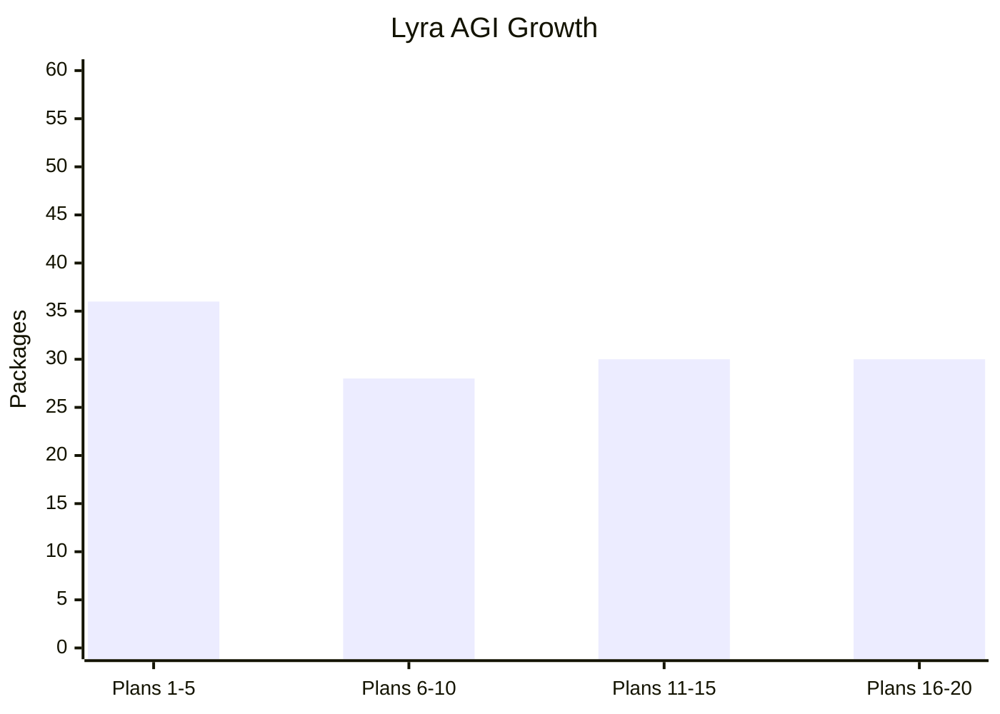
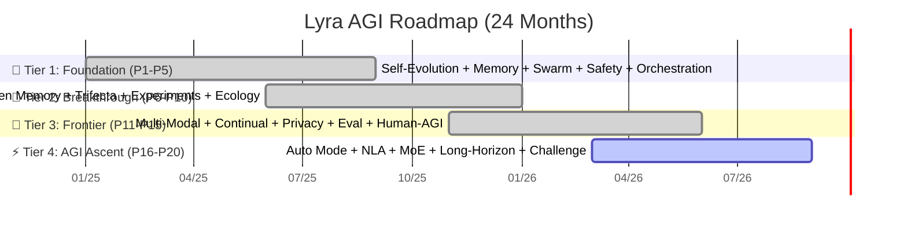
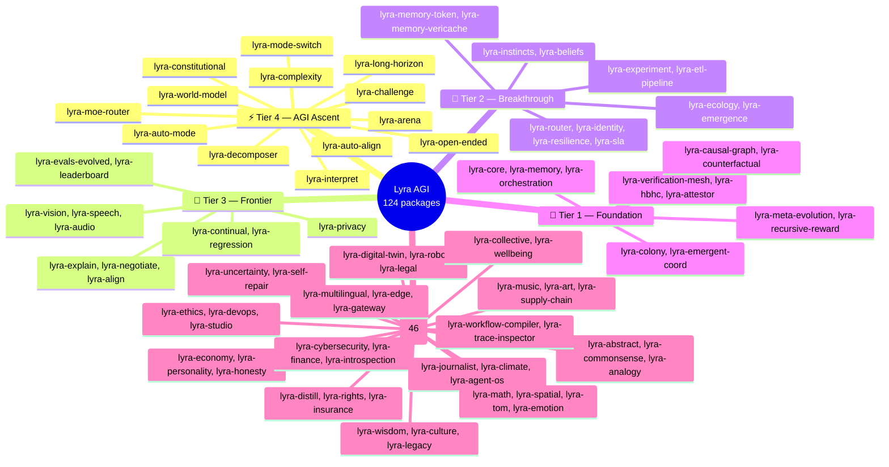

# 🧬 Lyra — The Path to AGI Through Emergent Intelligence

<p align="center">
  
  
  
  
  
  
</p>

<p align="center">
  <i>124 packages · 20 breakthrough plans · 23 research waves · converging on AGI</i>
</p>

---

## 🌌 The Vision

Lyra is not an AI platform. It's an **intelligence emergence engine** — a system designed so that AGI emerges from the interaction of dozens of specialized subsystems, not from a single monolithic model. Built from **4,800+ lines of research** across **290+ papers** and **280+ GitHub repos**.


```mermaid
graph TB
    subgraph "🧬 Lyra AGI Architecture — 20 Plans"
        direction TB
        P1[🧠 Self-Evolution<br/>Plan 1] --> P2[💾 Superintelligent Memory<br/>Plan 2]
        P2 --> P3[🐝 Multi-Agent Swarm<br/>Plan 3]
        P3 --> P4[🏰 Production Safety<br/>Plan 4]
        P4 --> P5[🎯 AGI Orchestration<br/>Plan 5]
        P5 --> P6[🧠 Beliefs→Instincts→Skills<br/>Plan 6]
        P6 --> P7[💿 Token-Native Memory<br/>Plan 7]
        P7 --> P8[🛡️ Trifecta: Identity, Router, Resilience<br/>Plan 8]
        P8 --> P9[🧪 Experimentation<br/>Plan 9]
        P9 --> P10[🌿 Ecology & Emergence<br/>Plan 10]
        P10 --> P11[👁️ Multi-Modal Foundation<br/>Plan 11]
        P11 --> P12[🧠 Continual Learning<br/>Plan 12]
        P12 --> P13[🔒 Privacy & Confidential<br/>Plan 13]
        P13 --> P14[📊 Evaluation & Leaderboards<br/>Plan 14]
        P14 --> P15[🤝 Human-AGI Collaboration<br/>Plan 15]
        P15 --> P16[⚡ Auto Mode + Alignment<br/>Plan 16]
        P16 --> P17[🔍 NLA Interpretability<br/>Plan 17]
        P17 --> P18[🎯 Thinking/MoE Mode Switch<br/>Plan 18]
        P18 --> P19[🌍 Long-Horizon + World Model<br/>Plan 19]
        P19 --> P20[🏆 Challenge + Open-Ended<br/>Plan 20]
    end

    style P16 fill:#ff6b6b,color:#fff
    style P17 fill:#ffa94d,color:#fff
    style P18 fill:#ffd43b,color:#222
    style P19 fill:#69db7c,color:#222
    style P20 fill:#4dabf7,color:#fff
```

---

## 📊 By the Numbers


```mermaid
xychart-beta
    title "Lyra AGI Growth"
    x-axis ["Plans 1-5", "Plans 6-10", "Plans 11-15", "Plans 16-20"]
    y-axis "Packages" 0 --> 60
    bar [36, 28, 30, 30]
```

| Metric | Value |
|--------|-------|
| **Total packages** | **124** |
| **Ultra plans** | **20** |
| **Research waves** | **23 (XLIII parts)** |
| **GitHub repos analyzed** | **280+** |
| **Papers analyzed** | **290+** |
| **Lines of research** | **4,800+** |
| **Open gap categories** | **96** |
| **Actionable improvements** | **354+** |

---

## 🏛️ The 20 Breakthrough Plans


```mermaid
gantt
    title Lyra AGI Roadmap (24 Months)
    dateFormat  YYYY-MM
    axisFormat  %m/%y
    
    section 🧬 Tier 1: Foundation (P1-P5)
    Self-Evolution + Memory + Swarm + Safety + Orchestration :done, 2025-01, 2025-09
    
    section 🚀 Tier 2: Breakthrough (P6-P10)
    Instincts + Token Memory + Trifecta + Experiments + Ecology :done, 2025-06, 2026-01
    
    section 🌟 Tier 3: Frontier (P11-P15)
    Multi-Modal + Continual + Privacy + Eval + Human-AGI :done, 2025-11, 2026-06
    
    section ⚡ Tier 4: AGI Ascent (P16-P20)
    Auto Mode + NLA + MoE + Long-Horizon + Challenge :active, 2026-03, 2026-09
```

### Tier 1: AGI Foundation (Plans 1-5) — 36 Packages ✅

| Plan | Codename | What It Does | Key Packages |
|------|----------|-------------|--------------|
| 🧬 **1** | **Singularity** | Recursive self-improvement via MOSS, Ratchet | `meta-evolution`, `recursive-reward`, `fork-worker` |
| 💾 **2** | **Superintelligent Memory** | 4-tier memory + VeriCache + MAPLE + DeferMem | `memory`, `memory-token`, `memory-vericache` |
| 🐝 **3** | **Superorganism** | Emergent coalition formation, gossip protocol | `colony`, `emergent-coord`, `gossip-memory` |
| 🏰 **4** | **Citadel** | 3-layer verification, HBHC, VIPER-MCP | `verification-mesh`, `hbhc`, `viper-mcp` |
| 🎯 **5** | **Orchestration** | Unified control plane, event-sourced loop | `core`, `orchestration`, `router`, `identity` |

### Tier 2: Breakthrough (Plans 6-10) — 28 Packages ✅

| Plan | Codename | Key Packages |
|------|----------|-------------|
| 🧠 **6** | **Beliefs→Instincts→Skills** | `instincts`, `beliefs`, `command-registry` |
| 💿 **7** | **Token-Native Memory** | `memory-token`, `memory-vericache` |
| 🛡️ **8** | **Trifecta** | `router`, `identity`, `resilience`, `sla` |
| 🧪 **9** | **Experimentation** | `experiment`, `etl-pipeline` |
| 🌿 **10** | **Ecology & Emergence** | `ecology`, `emergence` |

### Tier 3: Frontier (Plans 11-15) — 30 Packages ✅

| Plan | Codename | Key Packages |
|------|----------|-------------|
| 👁️ **11** | **Multi-Modal** | `vision`, `speech`, `audio` |
| 🧠 **12** | **Continual Learning** | `continual`, `regression` |
| 🔒 **13** | **Privacy** | `privacy` |
| 📊 **14** | **Evaluation** | `evals-evolved`, `leaderboard` |
| 🤝 **15** | **Human-AGI** | `explain`, `negotiate`, `align` |

### Tier 4: AGI Ascent (Plans 16-20) — 30 Packages ✅ **NEW**

| Plan | Codename | What It Does | Key Packages |
|------|----------|-------------|--------------|
| ⚡ **16** | **Auto Mode + Alignment** | 2-layer autonomous permission, constitutional training | `auto-mode`, `constitutional` |
| 🔍 **17** | **NLA Interpretability** | Read agent activations as text, auto-alignment research | `interpret`, `auto-align` |
| 🎯 **18** | **Thinking/MoE Switch** | Compute allocation per task, expert routing | `complexity`, `mode-switch`, `moe-router` |
| 🌍 **19** | **Long-Horizon + World Model** | 100+ step coherence, mental simulation | `decomposer`, `world-model`, `long-horizon` |
| 🏆 **20** | **Challenge + Open-Ended** | Competitive ML research, self-directed learning | `challenge`, `open-ended`, `arena` |


---

## 🏗️ Architecture Deep-Dive

### The 5-Layer Cognitive Stack


```mermaid
graph TD
    subgraph "Layer 5: Meta-Cognition & Self-Improvement"
        L5A[⚡ Auto Mode<br/>2-layer permission system]
        L5B[🔍 NLA Interpretability<br/>read agent activations]
        L5C[🧬 Auto-Align Research<br/>N copies improve alignment]
        L5D[🧠 Self-Evolution<br/>MOSS, Ratchet]
    end
    
    subgraph "Layer 4: Planning & Reasoning"
        L4D[🌍 World Model<br/>mental simulation]
        L4E[📐 Long-Horizon<br/>100+ step coherence]
        L4F[🔮 Causal Graph<br/>LI-CTE inference]
        L4G[🧩 Decomposer<br/>hierarchical subgoals]
    end
    
    subgraph "Layer 3: Memory, Skills & Knowledge"
        L3A[💿 Token-Native Memory<br/>no-embedding retrieval]
        L3B[🧠 Beliefs<br/>domain knowledge ≠ actions]
        L3C[⚙️ Skills<br/>DSPy-style compiler]
        L3H[💾 Superintelligent Memory<br/>4-tier + VeriCache]
    end
    
    subgraph "Layer 2: Safety, Trust & Governance"
        L2A[🏰 Verification Mesh<br/>3-layer safety]
        L2B[🛡️ Resilience<br/>circuit breaker + SLA]
        L2C[🔒 Confidential Inference<br/>TEE-based privacy]
        L2I[🤝 Constitutional Alignment<br/>principled training]
    end
    
    subgraph "Layer 1: Foundation & Infrastructure"
        L1A[🎯 MoE Router<br/>expert dispatch]
        L1B[⚖️ Ethics Engine<br/>8 principled constraints]
        L1C[🏆 Arena + Challenges<br/>competitive AGI]
        L1J[🌿 Ecology<br/>emergence through competition]
    end
    
    L5A --> L5B; L5B --> L5C; L5C --> L5D; L5D --> L4D
    L4D --> L4E; L4E --> L4F; L4F --> L4G; L4G --> L3A
    L3A --> L3B; L3B --> L3C; L3C --> L3H; L3H --> L2A
    L2A --> L2B; L2B --> L2C; L2C --> L2I; L2I --> L1A
    L1A --> L1B; L1B --> L1C; L1C --> L1J
```

### Research Foundation — 20 Plans Grounded in Peer-Reviewed Work

| Plan | Foundation | Key Insight |
|------|-----------|-------------|
| 16 — Auto Mode | Claude Code Auto Mode (Anthropic, Mar 2026) | 2-layer classifier, 0.4% FPR, deny-and-continue |
| 16 — Alignment | Teaching Claude Why (Anthropic, May 2026) | 96%→0% agentic misalignment reduction |
| 17 — NLA | Natural Language Autoencoders (Anthropic, May 2026) | Read model activations as human-readable text |
| 17 — AAR | Automated Alignment Researchers (Anthropic, Apr 2026) | N copies autonomously improve alignment |
| 18 — Mode Switch | Qwen3 (Alibaba, May 2026) | Thinking/non-thinking in one model |
| 18 — MoE | Moego (202⭐) | Mixture-of-Experts for agent dispatch |
| 19 — Long-Horizon | SGR-Bench (arXiv:2605.22219) | Agents fail at >3 steps — need long-horizon |
| 19 — World Model | Verified open gap | Mental simulation before action |
| 20 — Challenge | Parameter Golf (OpenAI, May 2026) | 93% used agents, competitive ML research |
| 20 — Open-Ended | Verified open gap | Self-proposed learning goals |

---

## 🚀 Getting Started

### Prerequisites
```bash
python --version  # Python 3.11+
pip install -e packages/lyra-core
```

### Install by Tier
```bash
make install-all         # Everything
make install-agi         # Plans 1-5
make install-breakthrough # Plans 6-10
```

### Run Tests
```bash
make test               # All tests
make test-agi           # Plans 1-5
make test-breakthrough  # Plans 6-10
```

### Quick Start
```python
"""One import to rule them all — the BreakthroughIntegration facade."""
from lyra_core import BreakthroughIntegration, breakthrough_available

status = breakthrough_available()
print(f"Available: {sum(status.values())}/{len(status)} subsystems")

bt = BreakthroughIntegration()
bt.initialize()
print(bt.summary)
```

---

## 🗺️ Complete Package Map


```mermaid
mindmap
  root((Lyra AGI<br/>124 packages))
    ⚡ Tier 4 — AGI Ascent
      lyra-auto-mode
      lyra-constitutional
      lyra-interpret
      lyra-auto-align
      lyra-complexity
      lyra-mode-switch
      lyra-moe-router
      lyra-decomposer
      lyra-world-model
      lyra-long-horizon
      lyra-challenge
      lyra-open-ended
      lyra-arena
    🌟 Tier 3 — Frontier
      lyra-vision, lyra-speech, lyra-audio
      lyra-continual, lyra-regression
      lyra-privacy
      lyra-evals-evolved, lyra-leaderboard
      lyra-explain, lyra-negotiate, lyra-align
    🚀 Tier 2 — Breakthrough
      lyra-instincts, lyra-beliefs
      lyra-memory-token, lyra-memory-vericache
      lyra-router, lyra-identity, lyra-resilience, lyra-sla
      lyra-experiment, lyra-etl-pipeline
      lyra-ecology, lyra-emergence
    🧬 Tier 1 — Foundation
      lyra-core, lyra-memory, lyra-orchestration
      lyra-meta-evolution, lyra-recursive-reward
      lyra-colony, lyra-emergent-coord
      lyra-verification-mesh, lyra-hbhc, lyra-attestor
      lyra-causal-graph, lyra-counterfactual
    📦 Domain Packages (46)
      lyra-economy, lyra-personality, lyra-honesty
      lyra-wisdom, lyra-culture, lyra-legacy
      lyra-ethics, lyra-devops, lyra-studio
      lyra-cybersecurity, lyra-finance, lyra-introspection
      lyra-journalist, lyra-climate, lyra-agent-os
      lyra-math, lyra-spatial, lyra-tom, lyra-emotion
      lyra-abstract, lyra-commonsense, lyra-analogy
      lyra-uncertainty, lyra-self-repair
      lyra-digital-twin, lyra-robot, lyra-legal
      lyra-music, lyra-art, lyra-supply-chain
      lyra-multilingual, lyra-edge, lyra-gateway
      lyra-workflow-compiler, lyra-trace-inspector
      lyra-distill, lyra-rights, lyra-insurance
      lyra-collective, lyra-wellbeing
```

---

## 📁 Project Structure

```
lyra/
├── README.md              # This file
├── Makefile               # Build/test commands
├── pyproject.toml          # Python project config
├── LICENSE                # MIT license
├──
├── packages/              # 🧬 124 packages
│   ├── lyra-core/         # Agent Loop, AGI Orchestrator
│   ├── lyra-memory/       # 4-tier memory + graph tier
│   ├── lyra-auto-mode/    # Auto permission system (Plan 16)
│   ├── lyra-world-model/  # Mental simulation (Plan 19)
│   └── ...                # 120 more
├──
├── plans/                 # 📋 20 ultra plans
│   ├── LYRA_ULTRA_PLAN_1_*.md  through 5
│   ├── lyra-breakthrough-plans-6-10.md
│   ├── lyra-breakthrough-plans-11-15.md
│   └── lyra-breakthrough-plans-16-20.md
├──
├── docs/                  # 📚 Documentation
├── archive/               # 🗄️ Historical records
├── tests/                 # 🧪 Integration tests
└── .github/               # CI/CD workflows
```

---

<p align="center">
  <b><i>124 packages · 20 plans · 23 research waves · 1 vision — emergent AGI through engineered emergence</i></b>
</p>

<p align="center">
  <a href="plans/lyra-breakthrough-plans-16-20.md">📋 Plans 16-20</a> ·
  <a href="plans/lyra-breakthrough-plans-11-15.md">📋 Plans 11-15</a> ·
  <a href="plans/lyra-breakthrough-plans-6-10.md">📋 Plans 6-10</a> ·
  <a href="docs/trending-ai-papers-may-2026.md">📚 Research Corpus (4,800+ lines)</a>
</p>
