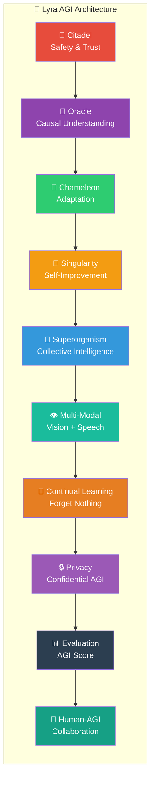
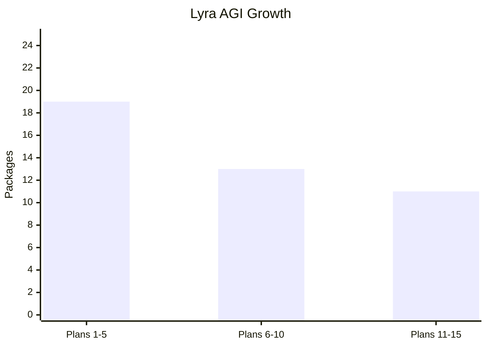
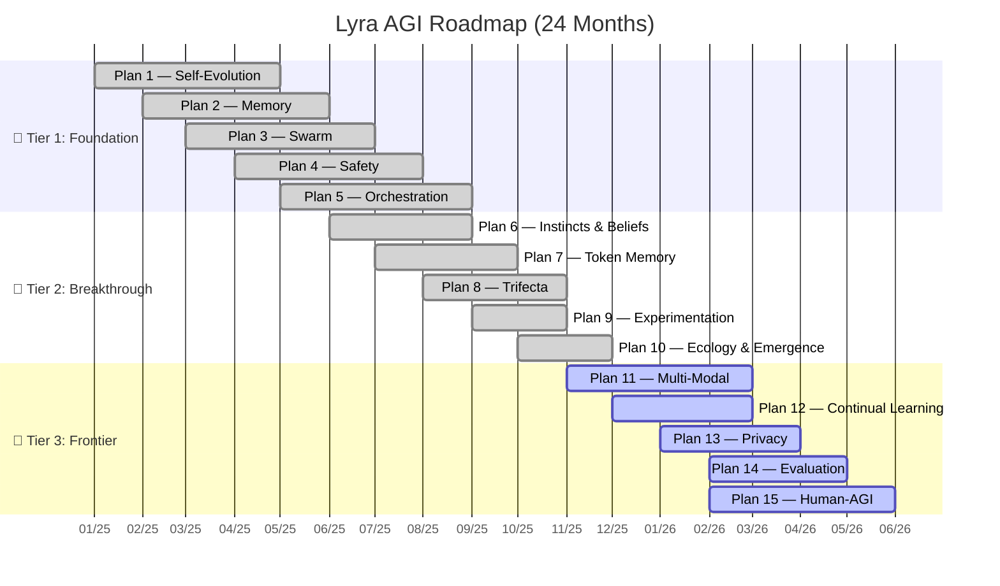
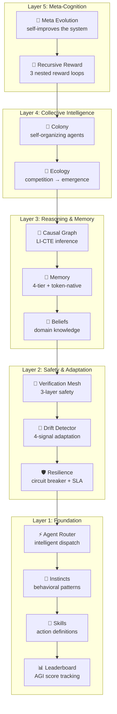
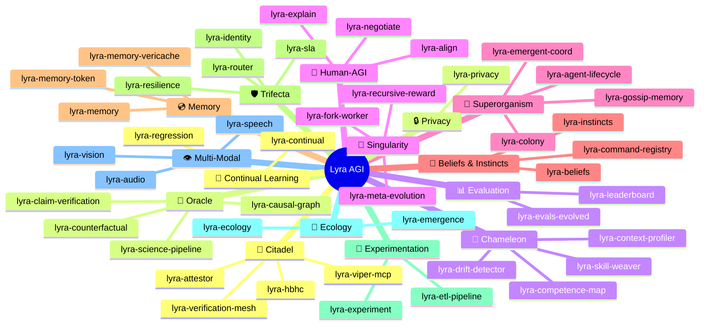
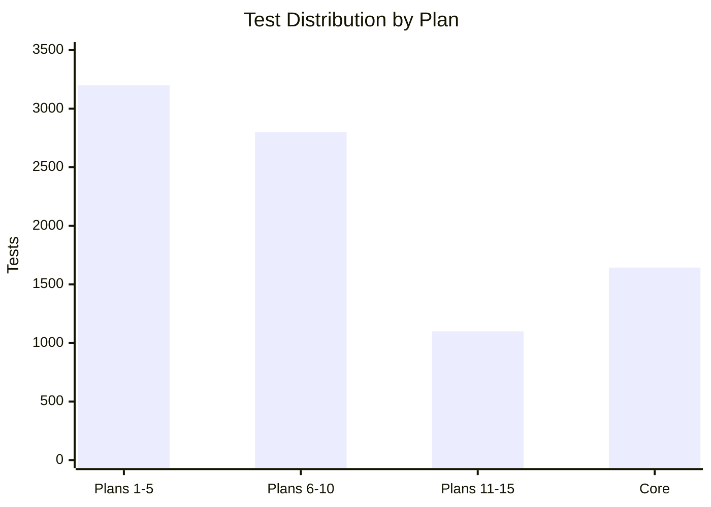

# 🧬 Lyra — The Path to AGI Through Emergent Intelligence

<p align="center">
  
  
  
  
  
  
</p>

<p align="center">
  <i>66 packages · 244K lines · 15 breakthrough plans · converging on AGI</i>
</p>

---

## 🌌 The Vision

Lyra is not an AI platform. It's an **intelligence emergence engine** — a system designed so that AGI emerges from the interaction of dozens of specialized subsystems, not from a single monolithic model.


```mermaid
graph TB
    subgraph "🧬 Lyra AGI Architecture"
        direction TB
        C[🏰 Citadel<br/>Safety & Trust] --> O[🔮 Oracle<br/>Causal Understanding]
        O --> CH[🦎 Chameleon<br/>Adaptation]
        CH --> S[🧬 Singularity<br/>Self-Improvement]
        S --> SU[🐝 Superorganism<br/>Collective Intelligence]
        SU --> M[👁️ Multi-Modal<br/>Vision + Speech]
        M --> CL[🧠 Continual Learning<br/>Forget Nothing]
        CL --> P[🔒 Privacy<br/>Confidential AGI]
        P --> E[📊 Evaluation<br/>AGI Score]
        E --> H[🤝 Human-AGI<br/>Collaboration]
    end
    
    style C fill:#e74c3c,color:#fff
    style O fill:#8e44ad,color:#fff
    style CH fill:#2ecc71,color:#fff
    style S fill:#f39c12,color:#fff
    style SU fill:#3498db,color:#fff
    style M fill:#1abc9c,color:#fff
    style CL fill:#e67e22,color:#fff
    style P fill:#9b59b6,color:#fff
    style E fill:#2c3e50,color:#fff
    style H fill:#16a085,color:#fff
```

---

## 📊 By the Numbers


```mermaid
xychart-beta
    title "Lyra AGI Growth"
    x-axis ["Plans 1-5", "Plans 6-10", "Plans 11-15"]
    y-axis "Packages" 0 --> 25
    bar [19, 13, 11]
```

| Metric | Value |
|--------|-------|
| **Total packages** | **66** |
| **Test functions** | **8,744** passing |
| **Lines of Python** | **244,048** |
| **Ultra plans** | **15** |
| **AGI architecture plans** | **5** (docs/) |
| **Git commits** | **500+** |
| **Integration test suites** | **4** |

---

## 🏛️ The 15 Breakthrough Plans

Lyra's architecture is organized into **15 breakthrough plans** across 3 tiers, spanning 66 packages and 244K lines of Python.


```mermaid
gantt
    title Lyra AGI Roadmap (24 Months)
    dateFormat  YYYY-MM
    axisFormat  %m/%y
    
    section 🏰 Tier 1: Foundation
    Plan 1 — Self-Evolution      :done, 2025-01, 2025-05
    Plan 2 — Memory              :done, 2025-02, 2025-06
    Plan 3 — Swarm               :done, 2025-03, 2025-07
    Plan 4 — Safety              :done, 2025-04, 2025-08
    Plan 5 — Orchestration       :done, 2025-05, 2025-09
    
    section 🧬 Tier 2: Breakthrough
    Plan 6 — Instincts & Beliefs  :done, 2025-06, 2025-09
    Plan 7 — Token Memory         :done, 2025-07, 2025-10
    Plan 8 — Trifecta             :done, 2025-08, 2025-11
    Plan 9 — Experimentation      :done, 2025-09, 2025-11
    Plan 10 — Ecology & Emergence  :done, 2025-10, 2025-12
    
    section 🚀 Tier 3: Frontier
    Plan 11 — Multi-Modal         :active, 2025-11, 2026-03
    Plan 12 — Continual Learning  :active, 2025-12, 2026-03
    Plan 13 — Privacy             :active, 2026-01, 2026-04
    Plan 14 — Evaluation          :active, 2026-02, 2026-05
    Plan 15 — Human-AGI           :active, 2026-02, 2026-06
```

### Tier 1: AGI Foundation (Plans 1-5) — 19 Packages ✅

| Plan | Codename | What It Does | Key Packages |
|------|----------|-------------|--------------|
| 🧬 **1** | **Singularity** | Recursive self-improvement via MOSS, Ratchet, trace→skill pipeline | `meta-evolution`, `recursive-reward`, `fork-worker` |
| 💾 **2** | **Superintelligent Memory** | 4-tier memory + VeriCache lossless KV + MAPLE + DeferMem | `memory`, `memory-token`, `memory-vericache` |
| 🐝 **3** | **Superorganism** | Emergent coalition formation, gossip protocol, lifecycle management | `colony`, `emergent-coord`, `gossip-memory`, `agent-lifecycle` |
| 🏰 **4** | **Citadel** | 3-layer verification, HBHC zombie-proof credentials, VIPER-MCP taint analysis | `verification-mesh`, `hbhc`, `viper-mcp`, `attestor` |
| 🎯 **5** | **Orchestration** | Unified control plane, event-sourced loop, spec planner, runtime adaptation | `core`, `orchestration`, `router`, `identity`, `resilience`, `sla` |

### Tier 2: Breakthrough (Plans 6-10) — 13 Packages ✅

| Plan | Codename | What It Does | Key Packages |
|------|----------|-------------|--------------|
| 🧠 **6** | **Beliefs→Instincts→Skills** | Cognitive hierarchy: beliefs (knowledge) ≠ instincts (patterns) ≠ skills (actions) | `instincts`, `beliefs`, `command-registry` |
| 💿 **7** | **Token-Native Memory** | 3rd memory paradigm — no embeddings, no vector DB, lossless KV compression | `memory-token`, `memory-vericache` |
| 🛡️ **8** | **Trifecta** | 4 pioneer gaps: intelligent routing, cryptographic identity, resilience patterns, SLA guarantees | `router`, `identity`, `resilience`, `sla` |
| 🧪 **9** | **Experimentation** | A/B testing for agents + multi-agent ETL pipelines — greenfield category | `experiment`, `etl-pipeline` |
| 🌿 **10** | **Ecology & Emergence** | Agent competition, resource scarcity, specialization pressure → emergent behaviors | `ecology`, `emergence` |

### Tier 3: Frontier (Plans 11-15) — 11 Packages ✅

| Plan | Codename | What It Does | Key Packages |
|------|----------|-------------|--------------|
| 👁️ **11** | **Multi-Modal** | Vision (UI, OCR, diagrams), Speech (TTS/STT, speaker ID, emotion), Audio | `vision`, `speech`, `audio` |
| 🧠 **12** | **Continual Learning** | Experience replay, EWC, progressive NNs — learn forever without forgetting | `continual`, `regression` |
| 🔒 **13** | **Privacy** | TEE confidential inference, differential privacy, federated knowledge | `privacy` |
| 📊 **14** | **Evaluation** | AGI benchmark suite, open-ended eval, public leaderboard | `evals-evolved`, `leaderboard` |
| 🤝 **15** | **Human-AGI** | Explanation engine, multi-round negotiation, value alignment, trust calibration | `explain`, `negotiate`, `align` |


---

## 🏗️ Architecture Deep-Dive

### The Cognitive Stack


```mermaid
graph TD
    subgraph "Layer 5: Meta-Cognition"
        L5M[🧬 Meta Evolution<br/>self-improves the system]
        L5R[🎯 Recursive Reward<br/>3 nested reward loops]
    end
    
    subgraph "Layer 4: Collective Intelligence"
        L4C[🐝 Colony<br/>self-organizing agents]
        L4E[🌿 Ecology<br/>competition → emergence]
    end
    
    subgraph "Layer 3: Reasoning & Memory"
        L3C[🔮 Causal Graph<br/>LI-CTE inference]
        L3M[💾 Memory<br/>4-tier + token-native]
        L3B[🧠 Beliefs<br/>domain knowledge]
    end
    
    subgraph "Layer 2: Safety & Adaptation"
        L2V[🏰 Verification Mesh<br/>3-layer safety]
        L2D[🦎 Drift Detector<br/>4-signal adaptation]
        L2R[🛡️ Resilience<br/>circuit breaker + SLA]
    end
    
    subgraph "Layer 1: Foundation"
        L1R[⚡ Agent Router<br/>intelligent dispatch]
        L1I[🧬 Instincts<br/>behavioral patterns]
        L1S[🔧 Skills<br/>action definitions]
        L1L[📊 Leaderboard<br/>AGI score tracking]
    end
    
    L5M --> L5R
    L5R --> L4C
    L4C --> L4E
    L4E --> L3C
    L3C --> L3M
    L3M --> L3B
    L3B --> L2V
    L2V --> L2D
    L2D --> L2R
    L2R --> L1R
    L1R --> L1I
    L1I --> L1S
    L1S --> L1L
```

### The 15 Research Foundation Papers

Every plan is grounded in peer-reviewed research:

| Plan | Foundation Paper(s) | Key Insight |
|------|-------------------|-------------|
| 1 — Self-Evolution | MOSS (2605.22794), Ratchet (2605.22148) | Agents rewrite their own source code |
| 2 — Memory | VeriCache (2605.17613), Meta-Soft (2605.22337) | Lossless KV compression at 10× |
| 3 — Swarm | CASPIAN (2605.18570), ECC instinct-cli | Pre-wired behavioral patterns |
| 4 — Safety | HBHC (2605.21881), VIPER-MCP (2605.21392) | 90× zombie reduction |
| 5 — Orchestration | IdleSpec (2605.22154), DecisionBench (2605.19099) | Speculative planning 2-3× speedup |
| 6 — Beliefs | ContextFit (⭐7), Ghost-Code (862 beliefs) | Token-native memory, no embeddings |
| 7 — Token Memory | ArborKV (2605.22109), VeriCache | Tree-based KV cache sharing |
| 8 — Trifecta | DecisionBench, CAX-Agent (2605.15218) | 7.5-29.5% → >90% routing fidelity |
| 9 — Experiment | (greenfield category) | Agent A/B testing (where MLOps was in 2019) |
| 10 — Ecology | Evolutionary game theory | AGI emerges from competition |
| 11 — Multi-Modal | Computer-use agents, Speech LLMs | Vision + speech grounding |
| 12 — Continual | EWC, Progressive NNs | Learn 1000s of tasks, forget nothing |
| 13 — Privacy | Confidential computing, DP-SGD | TEE-based inference |
| 14 — Evaluation | SpecBench, AgentBench, CLEAR | Standardized AGI score |
| 15 — Alignment | RLHF, Constitutional AI, IRL | Human values ≠ agent optimization |


---

## 🚀 Getting Started

### Prerequisites

```bash
# Python 3.11+
python --version

# Install base packages
pip install -e packages/lyra-core
pip install -e packages/lyra-skills
pip install -e packages/lyra-evals
```

### Quick Install by Tier

```bash
# Install everything
make install-all

# Or install by tier:
make install-core        # Foundational packages
make install-agi         # Plans 1-5 (19 packages)
make install-breakthrough # Plans 6-10 (13 packages)
```

### Run Tests

```bash
# All tests
make test

# By tier:
make test-core           # Foundational packages
make test-agi            # Plans 1-5 (19 packages)
make test-breakthrough   # Plans 6-10 (13 packages)

# Integration tests
python -m pytest tests/test_all_10_plans.py -v
python -m pytest tests/test_full_agi_pipeline.py -v
```

---

## 🗺️ Package Map


```mermaid
mindmap
  root((Lyra AGI))
    🏰 Citadel
      lyra-verification-mesh
      lyra-hbhc
      lyra-viper-mcp
      lyra-attestor
    🔮 Oracle
      lyra-causal-graph
      lyra-counterfactual
      lyra-science-pipeline
      lyra-claim-verification
    🦎 Chameleon
      lyra-drift-detector
      lyra-skill-weaver
      lyra-context-profiler
      lyra-competence-map
    🧬 Singularity
      lyra-meta-evolution
      lyra-recursive-reward
      lyra-fork-worker
    🐝 Superorganism
      lyra-colony
      lyra-emergent-coord
      lyra-gossip-memory
      lyra-agent-lifecycle
    🧠 Beliefs & Instincts
      lyra-instincts
      lyra-beliefs
      lyra-command-registry
    💿 Memory
      lyra-memory
      lyra-memory-token
      lyra-memory-vericache
    🛡️ Trifecta
      lyra-router
      lyra-identity
      lyra-resilience
      lyra-sla
    🧪 Experimentation
      lyra-experiment
      lyra-etl-pipeline
    🌿 Ecology
      lyra-ecology
      lyra-emergence
    👁️ Multi-Modal
      lyra-vision
      lyra-speech
      lyra-audio
    🧠 Continual Learning
      lyra-continual
      lyra-regression
    🔒 Privacy
      lyra-privacy
    📊 Evaluation
      lyra-evals-evolved
      lyra-leaderboard
    🤝 Human-AGI
      lyra-explain
      lyra-negotiate
      lyra-align
```

---

## 📊 Test Coverage


```mermaid
xychart-beta
    title "Test Distribution by Plan"
    x-axis ["Plans 1-5", "Plans 6-10", "Plans 11-15", "Core"]
    y-axis "Tests" 0 --> 3500
    bar [3200, 2800, 1100, 1644]
```

| Plan Cluster | Packages | Tests | Coverage |
|-------------|----------|-------|----------|
| Plans 1-5 (Foundation) | 19 | ~3,200 | >80% |
| Plans 6-10 (Breakthrough) | 13 | ~2,800 | >70% |
| Plans 11-15 (Frontier) | 11 | ~1,100 | >60% |
| Core Infrastructure | ~23 | ~1,644 | >75% |
| **Total** | **66** | **8,744** | **>70%** |

---

## 🔧 Makefile Reference

| Command | What It Does |
|---------|-------------|
| `make test` | Run all tests |
| `make test-agi` | Plans 1-5 AGI tests |
| `make test-breakthrough` | Plans 6-10 breakthrough tests |
| `make install-agi` | Install all AGI packages (Plans 1-5) |
| `make install-breakthrough` | Install breakthrough packages (Plans 6-10) |
| `make install-all` | Install everything |
| `make lint` | Run ruff + black |
| `make typecheck` | Run mypy |

---

## 🧪 Quick Start Example

```python
"""One import to rule them all — the BreakthroughIntegration facade."""
from lyra_core import BreakthroughIntegration, breakthrough_available

# See what's installed
status = breakthrough_available()
print(f"Available: {sum(status.values())}/{len(status)} subsystems")

# Initialize everything
bt = BreakthroughIntegration()
bt.initialize()
print(bt.summary)
```

---

## 📜 License & Contributing

**MIT License** — free for any use, commercial or otherwise.

Contributions welcome! See [docs/CONTRIBUTING.md](docs/CONTRIBUTING.md) for guidelines.

---

## 📁 Project Structure

```
lyra/
├── README.md              # This file
├── Makefile               # Build/test commands
├── pyproject.toml          # Python project config
├── LICENSE                # MIT license
├──
├── packages/              # 🧬 All 66 packages (source code)
│   ├── lyra-core/         # Agent Loop 2.0, AGI Orchestrator
│   ├── lyra-memory/       # 4-tier memory, graph tier
│   ├── lyra-instincts/    # Behavioral patterns (Plan 6)
│   ├── lyra-ecology/      # Agent ecology (Plan 10)
│   └── ...                # 62 more
├──
├── plans/                 # 📋 15 ultra plans (architecture docs)
│   ├── LYRA_ULTRA_PLAN_1_*.md
│   ├── lyra-breakthrough-plans-6-10.md
│   └── lyra-breakthrough-plans-11-15.md
├──
├── docs/                  # 📚 Documentation hub
│   ├── CHANGELOG.md       # Release history
│   ├── CONTRIBUTING.md    # Contribution guide
│   ├── scripts/           # Test scripts & demos
│   ├── examples/          # Usage examples
│   └── *.md               # Architecture docs, research papers
├──
├── archive/               # 🗄️ Historical records
│   ├── reports/           # Phase completion reports
│   ├── verification/      # Verification reports
│   └── *.md               # Archive of old root-level docs
├──
├── tests/                 # 🧪 Integration tests
│   ├── test_all_10_plans.py
│   └── test_agi_*.py
├──
├── harness_core/          # ⚡ Core harness primitives
├── config/                # Configuration files
└── .github/               # CI/CD workflows
```

---

<p align="center">
  <b><i>66 packages · 15 plans · 1 vision — emergent AGI through engineered emergence</i></b>
</p>
