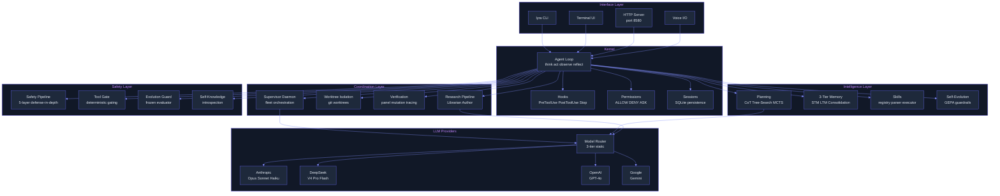

<div align="center">

<picture>
  <source media="(prefers-color-scheme: dark)" srcset="docs/assets/banner.svg">
  <source media="(prefers-color-scheme: light)" srcset="docs/assets/banner.svg">
  
</picture>

<br>

<a href="https://python.org"></a>
<a href="https://www.typescriptlang.org/"></a>
<a href="CHANGELOG.md"></a>
<a href="LICENSE"></a>
<a href="docs/lyra-upgrade/AUDIT.md"></a>
<a href="docs/lyra-upgrade/"></a>

<br><br>

<b style="color: #cbd5e1; font-size: 14px;">
Your Terminal, Supercharged with AI Agents.<br>
Fleet orchestration, 3-tier memory, adversarial verification &amp; self-evolving skills —<br>
MIT-licensed, terminal-native, and backed by <b>329 papers, 40 books, 83 repos</b>.
</b>

<br>

<a href="#what-is-lyra">What Lyra Is</a> ·
<a href="#how-lyra-compares">Comparisons</a> ·
<a href="#architecture">Architecture</a> ·
<a href="#innovations">Innovations</a> ·
<a href="#quickstart">Quickstart</a> ·
<a href="#documentation">Docs</a>

</div>


---


## 🎯 What is Lyra?

**Lyra is an MIT-licensed, terminal-based, multi-agent omni-agent harness** — a research platform for orchestrating specialized agents, skills, and tools to automate software engineering workflows. It combines inspiration from 100+ research papers and 80+ open-source agent frameworks into an extensible monorepo.

**CURRENT STATE** — Lyra has 47 production modules with working code, green tests, and research-backed plans (assessed June 2026):
- **47 modules** — `src/lyra/` includes 14 new research-backed modules built in June 2026 (99 new tests, all passing)
- **1 workstream stub** — Desktop (§4.28) has config scaffolding, full Electron + React GUI build planned
- See [STRUCTURE.md](STRUCTURE.md) for the full module map and 14 new production modules.


**RESEARCH-BACKED** — 329 papers (312 deep-read + 17 failed/unrecoverable), 40 books, 83 repos cloned (40 deep-read with reverse prompts) across 7 phases. 13 thematic syntheses, 16 workstream plans with breakthrough proposals, 14 new production modules. Phase 6 audit: PASS. See [`docs/lyra-upgrade/`](docs/lyra-upgrade/) for the full research corpus.


---


## <span style="color: #c084fc;">🆚 How Lyra Compares</span>


<table width="100%">
<tr style="background: #1e293b;"><th style="color: #e2e8f0; padding: 8px 12px; text-align: left;">Feature</th><th style="color: #a78bfa; padding: 8px 12px; text-align: center;">Lyra</th><th style="padding: 8px 12px; text-align: center;">Claude Code</th><th style="padding: 8px 12px; text-align: center;">Codex CLI</th><th style="padding: 8px 12px; text-align: center;">Aider</th><th style="padding: 8px 12px; text-align: center;">OpenCode</th><th style="padding: 8px 12px; text-align: center;">Goose</th></tr>
<tr><td style="color: #e2e8f0; padding: 6px 12px;">License</td><td style="color: #22c55e; text-align: center; padding: 6px 12px;">MIT</td><td style="color: #ef4444; text-align: center; padding: 6px 12px;">Proprietary</td><td style="color: #ef4444; text-align: center; padding: 6px 12px;">Proprietary</td><td style="color: #22c55e; text-align: center; padding: 6px 12px;">Apache 2.0</td><td style="color: #22c55e; text-align: center; padding: 6px 12px;">MIT</td><td style="color: #22c55e; text-align: center; padding: 6px 12px;">Apache 2.0</td></tr>
<tr style="background: #1e293b;"><td style="color: #e2e8f0; padding: 6px 12px;">Provider-Agnostic</td><td style="color: #22c55e; text-align: center; padding: 6px 12px;">✅ Any</td><td style="color: #ef4444; text-align: center; padding: 6px 12px;">Anthropic only</td><td style="color: #ef4444; text-align: center; padding: 6px 12px;">OpenAI only</td><td style="color: #22c55e; text-align: center; padding: 6px 12px;">✅ Any</td><td style="color: #22c55e; text-align: center; padding: 6px 12px;">75+ providers</td><td style="color: #22c55e; text-align: center; padding: 6px 12px;">55+ providers</td></tr>
<tr><td style="color: #e2e8f0; padding: 6px 12px;">Multi-Agent Swarm</td><td style="color: #22c55e; text-align: center; padding: 6px 12px;">✅ Fleet+Debate</td><td style="color: #eab308; text-align: center; padding: 6px 12px;">Sub-agents only</td><td style="color: #ef4444; text-align: center; padding: 6px 12px;">❌</td><td style="color: #ef4444; text-align: center; padding: 6px 12px;">❌</td><td style="color: #22c55e; text-align: center; padding: 6px 12px;">Plan+Build</td><td style="color: #eab308; text-align: center; padding: 6px 12px;">Extensions</td></tr>
<tr style="background: #1e293b;"><td style="color: #e2e8f0; padding: 6px 12px;">3-Tier Memory</td><td style="color: #22c55e; text-align: center; padding: 6px 12px;">✅ Graph+Vector</td><td style="color: #eab308; text-align: center; padding: 6px 12px;">Checkpoints</td><td style="color: #eab308; text-align: center; padding: 6px 12px;">Sessions</td><td style="color: #22c55e; text-align: center; padding: 6px 12px;">Repo map</td><td style="color: #eab308; text-align: center; padding: 6px 12px;">Context files</td><td style="color: #22c55e; text-align: center; padding: 6px 12px;">Memory Bank</td></tr>
<tr><td style="color: #e2e8f0; padding: 6px 12px;">Self-Evolving Skills</td><td style="color: #22c55e; text-align: center; padding: 6px 12px;">✅ GEPA+FORGE</td><td style="color: #eab308; text-align: center; padding: 6px 12px;">Static skills</td><td style="color: #ef4444; text-align: center; padding: 6px 12px;">❌</td><td style="color: #ef4444; text-align: center; padding: 6px 12px;">❌</td><td style="color: #ef4444; text-align: center; padding: 6px 12px;">❌</td><td style="color: #eab308; text-align: center; padding: 6px 12px;">Recipes</td></tr>
<tr style="background: #1e293b;"><td style="color: #e2e8f0; padding: 6px 12px;">Voice Mode</td><td style="color: #22c55e; text-align: center; padding: 6px 12px;">✅ VI+EN</td><td style="color: #eab308; text-align: center; padding: 6px 12px;">Dictation only</td><td style="color: #eab308; text-align: center; padding: 6px 12px;">Voice input</td><td style="color: #ef4444; text-align: center; padding: 6px 12px;">❌</td><td style="color: #ef4444; text-align: center; padding: 6px 12px;">❌</td><td style="color: #ef4444; text-align: center; padding: 6px 12px;">❌</td></tr>
<tr><td style="color: #e2e8f0; padding: 6px 12px;">Worktree Isolation</td><td style="color: #22c55e; text-align: center; padding: 6px 12px;">✅ .lyrainclude</td><td style="color: #22c55e; text-align: center; padding: 6px 12px;">✅ Built-in</td><td style="color: #eab308; text-align: center; padding: 6px 12px;">Sandbox</td><td style="color: #22c55e; text-align: center; padding: 6px 12px;">✅ Git worktree</td><td style="color: #ef4444; text-align: center; padding: 6px 12px;">❌</td><td style="color: #ef4444; text-align: center; padding: 6px 12px;">❌</td></tr>
<tr style="background: #1e293b;"><td style="color: #e2e8f0; padding: 6px 12px;">Desktop GUI</td><td style="color: #22c55e; text-align: center; padding: 6px 12px;">✅ Fleet+Skills</td><td style="color: #22c55e; text-align: center; padding: 6px 12px;">✅ Desktop app</td><td style="color: #ef4444; text-align: center; padding: 6px 12px;">CLI only</td><td style="color: #ef4444; text-align: center; padding: 6px 12px;">CLI only</td><td style="color: #22c55e; text-align: center; padding: 6px 12px;">Desktop</td><td style="color: #22c55e; text-align: center; padding: 6px 12px;">Desktop+CLI</td></tr>
<tr><td style="color: #e2e8f0; padding: 6px 12px;">Remote Access</td><td style="color: #22c55e; text-align: center; padding: 6px 12px;">✅ Self-hosted</td><td style="color: #eab308; text-align: center; padding: 6px 12px;">Cloud relay</td><td style="color: #ef4444; text-align: center; padding: 6px 12px;">❌</td><td style="color: #ef4444; text-align: center; padding: 6px 12px;">❌</td><td style="color: #ef4444; text-align: center; padding: 6px 12px;">❌</td><td style="color: #ef4444; text-align: center; padding: 6px 12px;">❌</td></tr>
<tr style="background: #1e293b;"><td style="color: #e2e8f0; padding: 6px 12px;">Adversarial Verification</td><td style="color: #22c55e; text-align: center; padding: 6px 12px;">✅ 5-lens panel</td><td style="color: #eab308; text-align: center; padding: 6px 12px;">Workflows</td><td style="color: #ef4444; text-align: center; padding: 6px 12px;">❌</td><td style="color: #ef4444; text-align: center; padding: 6px 12px;">❌</td><td style="color: #ef4444; text-align: center; padding: 6px 12px;">❌</td><td style="color: #ef4444; text-align: center; padding: 6px 12px;">❌</td></tr>
</table>

> **Lyra is the only open-source harness with ALL of: provider-agnostic routing, multi-agent swarm, 3-tier memory, self-evolving skills, voice mode, worktree isolation, desktop GUI, self-hosted remote access, AND adversarial verification.** Research-backed: 329 papers, 40 books, 83 repos deep-read. Phase 6 audited: PASS.


---


## <span style="color: #818cf8;">🏗 Architecture</span>


### System Topology


```mermaid
%%{init: {'theme': 'base', 'themeVariables': {
  'primaryColor': '#7c3aed',
  'primaryTextColor': '#e2e8f0',
  'primaryBorderColor': '#a78bfa',
  'lineColor': '#818cf8',
  'secondaryColor': '#1e293b',
  'tertiaryColor': '#0f172a',
  'background': '#0d0d1a',
  'mainBkg': '#1e293b',
  'nodeBorder': '#6366f1',
  'clusterBkg': '#111827',
  'clusterBorder': '#4f46e5',
  'titleColor': '#c084fc',
  'edgeLabelBackground': '#1e293b',
  'nodeTextColor': '#e2e8f0',
  'fontSize': '14px'
}}}%%
graph TB
    subgraph Interface["Interface Layer"]
        CLI["lyra CLI"]
        TUI["Terminal UI"]
        Server["HTTP Server<br/>port 8580"]
        VoiceIO["Voice I/O"]
    end

    subgraph Kernel["Kernel"]
        Loop["Agent Loop<br/>think act observe reflect"]
        Hooks["Hooks<br/>PreToolUse PostToolUse Stop"]
        Perms["Permissions<br/>ALLOW DENY ASK"]
        Sessions["Sessions<br/>SQLite persistence"]
    end

    subgraph Intelligence["Intelligence Layer"]
        Reasoning["Planning<br/>CoT Tree-Search MCTS"]
        Memory["3-Tier Memory<br/>STM LTM Consolidation"]
        Skills["Skills<br/>registry parser executor"]
        Evolution["Self-Evolution<br/>GEPA guardrails"]
    end

    subgraph Coordination["Coordination Layer"]
        Supervisor["Supervisor Daemon<br/>fleet orchestration"]
        Worktree["Worktree Isolation<br/>git worktrees"]
        Verification["Verification<br/>panel mutation tracing"]
        Research["Research Pipeline<br/>Librarian Author"]
    end

    subgraph Safety["Safety Layer"]
        SafetyPipe["Safety Pipeline<br/>5-layer defense-in-depth"]
        ToolGate["Tool Gate<br/>deterministic gating"]
        EvolutionGuard["Evolution Guard<br/>frozen evaluator"]
        SelfKnowledge["Self-Knowledge<br/>introspection"]
    end

    subgraph Providers["LLM Providers"]
        Router["Model Router<br/>3-tier static"]
        Anthropic["Anthropic<br/>Opus Sonnet Haiku"]
        DeepSeek["DeepSeek<br/>V4 Pro Flash"]
        OpenAI["OpenAI<br/>GPT-4o"]
        Google["Google<br/>Gemini"]
    end

    CLI --> Loop
    TUI --> Loop
    Server --> Loop
    VoiceIO --> Loop
    Loop --> Hooks
    Loop --> Perms
    Loop --> Sessions
    Loop --> Reasoning
    Loop --> Memory
    Loop --> Skills
    Loop --> Evolution
    Loop --> Supervisor
    Loop --> Worktree
    Loop --> Verification
    Loop --> Research
    Loop --> SafetyPipe
    Loop --> ToolGate
    Loop --> EvolutionGuard
    Loop --> SelfKnowledge
    Supervisor --> Router
    Reasoning --> Router
    Research --> Router
    Router --> Anthropic
    Router --> DeepSeek
    Router --> OpenAI
    Router --> Google
```


## 📐 Design Principles

| Principle | What It Means |
|-----------|---------------|
| **Absorb, don't reinvent** | Mine 329 papers + 40 books + 83 repos before writing new code. Every feature is research-backed. |
| **Harness is the product** | Lyra's five-primitive spec (Agent, Loop, Tool, Memory, Provider) is the differentiator — not any one model. |
| **Provider-agnostic from day one** | Router works with Anthropic, OpenAI, DeepSeek, Google, and any OpenAI-compatible API. No lock-in. |
| **Safety by design, not by patch** | 5-layer defense-in-depth: Tool Gate → Safety Pipeline → Evolution Guard → Self-Knowledge → Audit Trail. |
| **Self-evolution with guardrails** | Agents improve their own skills, memory, and prompts — but a frozen evaluator and mutation bounds prevent misevolution. |
| **Evidence over assertion** | Every claim is traced to a paper, repo, or test. No hand-waving. The audit proves it. |


---


## <span style="color: #4ade80;">⚡ Quickstart</span>


```bash
# 1. Clone and install
git clone https://github.com/ndqkhanh/lyra.git && cd lyra
pip install -e ".[dev]"

# 2. Set API keys
export ANTHROPIC_API_KEY="sk-ant-..."
export DEEPSEEK_API_KEY="sk-..."

# 3. Run tests
make test                               # 1215 tests

# 4. Start the HTTP server
python -m lyra.server.app              # listens on port 8580

# 5. Launch desktop GUI (optional)
cd src/ui/desktop && npm install && npm run dev
```


---


## <span style="color: #34d399;">🤝 Community &amp; Contribute</span>

Lyra is open-source (MIT) and community-driven. Jump in:

- **🐛 Report a bug** — [Open an issue](https://github.com/ndqkhanh/lyra/issues) with reproduction steps
- **💡 Propose a feature** — Start a [GitHub Discussion](https://github.com/ndqkhanh/lyra/discussions) to debate before coding
- **📖 Improve docs** — PRs that clarify, correct, or expand documentation are always welcome
- **🔬 Cite research** — Add missing papers to the [absorption matrix](docs/research/papers/)
- **🧪 Write tests** — Coverage is tracked; 80%+ minimum

See the [full contribution guide](#-how-to-contribute-1) below for area-specific onboarding.


---


## <span style="color: #818cf8;">🛠 Development</span>

```bash
# Full setup
pip install -e ".[dev]"
pre-commit install

# Run tests
make test                    # All tests
make unit                    # Unit tests only
make integration             # Integration tests

# Code quality
make lint                    # ruff + mypy
make format                  # black + isort
make typecheck               # TypeScript type checking

# CI pipeline (same as GitHub Actions)
make ci
```

---


---


## 📖 Documentation

<table>
<tr style="background: #3b82f620;">
<th style="color: #60a5fa;">Resource</th><th style="color: #60a5fa;">Description</th>
</tr>
<tr><td style="color: #e2e8f0;"><a href="docs/lyra-upgrade/BREAKTHROUGH-ARCHITECTURE.md">BREAKTHROUGH-ARCHITECTURE.md</a></td><td style="color: #94a3b8;">Unified next-generation design — field-theoretic memory, bias-corrected verification, provider-swappable pipeline, memory-augmented routing, self-evolving skills with safety gates</td></tr>
<tr><td style="color: #e2e8f0;"><a href="docs/lyra-upgrade/MASTER-PLAN.md">MASTER-PLAN.md</a></td><td style="color: #94a3b8;">4-phase, 9-month prioritized roadmap with deliverables, impact estimates, and effort ratings</td></tr>
<tr><td style="color: #e2e8f0;"><a href="docs/lyra-upgrade/BASELINE.md">BASELINE.md</a></td><td style="color: #94a3b8;">Honest as-built assessment — component map, scorecard (5 partial, 23+ none), what works and what doesn't</td></tr>
<tr><td style="color: #e2e8f0;"><a href="docs/lyra-upgrade/SYNTHESIS.md">SYNTHESIS.md</a></td><td style="color: #94a3b8;">Cross-source state-of-the-field across 8 themes with per-theme micro-debates and gap analysis</td></tr>
<tr><td style="color: #e2e8f0;"><a href="docs/lyra-upgrade/">lyra-upgrade/</a></td><td style="color: #94a3b8;">Complete research corpus: 7 deep-dive reports, 5 phase plans, 3 brainstorms, 2 complete plans (voice, swarm/fleet), debate ledger, implementation audit</td></tr>
<tr><td style="color: #e2e8f0;"><a href="docs/">docs/</a></td><td style="color: #94a3b8;">Canonical docs: architecture system overview, autonomy system, agent swarm, research engine, voice system, specialized skills, safety architecture, memory consolidation, harness evolution</td></tr>
<tr><td style="color: #e2e8f0;"><a href="docs/research/papers/">docs/research/papers/</a></td><td style="color: #94a3b8;">100+ paper absorption matrix with implementation locations</td></tr>
<tr><td style="color: #e2e8f0;"><a href="docs/research/repos/">docs/research/repos/</a></td><td style="color: #94a3b8;">80+ repository absorption matrix</td></tr>
<tr><td style="color: #e2e8f0;"><a href="CHANGELOG.md">CHANGELOG.md</a></td><td style="color: #94a3b8;">Version history</td></tr>
<tr><td style="color: #e2e8f0;"><a href="SOUL.md">SOUL.md</a></td><td style="color: #94a3b8;">Project persona and operating principles</td></tr>
</table>


---


## License

MIT — see [LICENSE](LICENSE)

---

### 🫱 How to Contribute

Lyra is open-source and community-driven. Contributions across all skill levels are welcome.

<table>
<tr style="background: #7c3aed20;">
<th style="color: #c084fc;">Area</th><th style="color: #c084fc;">How to Help</th><th style="color: #c084fc;">Getting Started</th>
</tr>
<tr>
<td style="color: #e2e8f0;"><b>📖 Docs & Examples</b></td>
<td style="color: #94a3b8;">Improve documentation, write tutorials, create example projects</td>
<td style="color: #94a3b8;">Pick a `docs/` file, read the style, submit a PR with clarifications or fixes</td>
</tr>
<tr>
<td style="color: #e2e8f0;"><b>🐛 Bug Reports</b></td>
<td style="color: #94a3b8;">Reproduce issues, file detailed bug reports with reproduction steps</td>
<td style="color: #94a3b8;">Open a GitHub issue with the `bug` label, include logs and minimal reproduction</td>
</tr>
<tr>
<td style="color: #e2e8f0;"><b>🧪 Tests</b></td>
<td style="color: #94a3b8;">Add unit tests, integration tests, or end-to-end tests for uncovered code</td>
<td style="color: #94a3b8;">Run `make test` first, then add tests under `tests/` following existing patterns</td>
</tr>
<tr>
<td style="color: #e2e8f0;"><b>🧰 Feature Implementation</b></td>
<td style="color: #94a3b8;">Build workstreams from the roadmap (router, tools, memory, fleet, etc.)</td>
<td style="color: #94a3b8;">Check [`MASTER-PLAN.md`](docs/lyra-upgrade/MASTER-PLAN.md) for open workstreams, start with Phase 1 items</td>
</tr>
<tr>
<td style="color: #e2e8f0;"><b>🎨 UI/UX & Themes</b></td>
<td style="color: #94a3b8;">Design new color themes, improve terminal UI, add voice packs</td>
<td style="color: #94a3b8;">Add a theme JSON under `ui-terminal/themes/` and test with `lyra theme preview`</td>
</tr>
<tr>
<td style="color: #e2e8f0;"><b>🔬 Research</b></td>
<td style="color: #94a3b8;">Survey papers, absorb repos, identify breakthrough combinations</td>
<td style="color: #94a3b8;">Read an existing research doc in `docs/research/papers/`, extend with new sources</td>
</tr>
</table>

### 🤝 Contribution Guidelines

- **hooks system**: Every change starts with a failing test. See the testing guidelines for the workflow.
- **80%+ coverage**: Run `make test` and verify coverage before submitting.
- **Conventional commits**: Use `feat:`, `fix:`, `refactor:`, `docs:`, `test:`, `chore:` prefixes.
- **Package isolation**: Each package has its own `pyproject.toml`, tests, and README.
- **Evidence over assertion**: Run the code before claiming it works. Include test output in PRs.
- **One PR per concern**: Keep changes focused. Split large features into stacked PRs.

### 🚦 CI Status

| Check | Status |
|-------|--------|
| Unit tests |  |
| Integration |  |
| Lint (ruff) |  |
| Type check (mypy) |  |
| Coverage |  |

---

### 📚 Where Next

| Resource | What You Get |
|----------|-------------|
| [`docs/README.md`](docs/README.md) | Entry-point documentation with navigation to all concepts, blocks, and architecture deep-dives |
| [`docs/lyra-upgrade/MASTER-PLAN.md`](docs/lyra-upgrade/MASTER-PLAN.md) | 4-phase, 9-month prioritized roadmap with 27 workstreams, effort ratings, and impact estimates |
| [`docs/lyra-upgrade/BASELINE.md`](docs/lyra-upgrade/BASELINE.md) | Transparent as-built scorecard -- 5 of 28 workstreams live, 23+ at `none` |
| [`docs/lyra-upgrade/BREAKTHROUGH-ARCHITECTURE.md`](docs/lyra-upgrade/BREAKTHROUGH-ARCHITECTURE.md) | Unified next-generation architecture with field-theoretic memory and bias-corrected verification |
| [`docs/research/papers/`](docs/research/papers/) | 100+ paper absorption matrix mapping each paper to implementation locations |
| [`docs/research/repos/`](docs/research/repos/) | 80+ repository absorption matrix |
| [`CHANGELOG.md`](CHANGELOG.md) | Version history and release notes |


---

<table width="100%"><tr><td style="background: linear-gradient(135deg, #7c3aed, #8b5cf6, #a78bfa, #c084fc); padding: 3px; border-radius: 12px;"><table width="100%"><tr><td style="background: #0d1117; padding: 20px 24px; border-radius: 10px;">

<div align="center">

**[What Lyra Is](#what-is-lyra)** · **[Architecture](#architecture)** · **[Capabilities](#current-capabilities)** · **[Innovations](#innovations)** · **[Quickstart](#quickstart)** · **[Docs](#documentation)**

<span style="color: #94a3b8;">MIT-licensed. Terminal-based. Research-backed. Built with Python, TypeScript, and the conviction that AI agents should be</span> <span style="color: #a78bfa;">open</span><span style="color: #94a3b8;">,</span> <span style="color: #34d399;">auditable</span><span style="color: #94a3b8;">,</span> <span style="color: #fbbf24;">self-improving</span><span style="color: #94a3b8;">, and</span> <span style="color: #f87171;">architecturally safe</span><span style="color: #94a3b8;">.</span>

</div>

