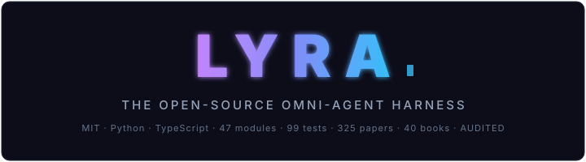

<div align="center">

<picture>
  <source media="(prefers-color-scheme: dark)" srcset="docs/assets/banner.svg">
  <source media="(prefers-color-scheme: light)" srcset="docs/assets/banner.svg">
  
</picture>

<br>

<a href="https://python.org"></a>
<a href="https://www.typescriptlang.org/"></a>
<a href="CHANGELOG.md"></a>
<a href="LICENSE"></a>
<a href="docs/lyra-upgrade/AUDIT.md"></a>
<a href="docs/lyra-upgrade/"></a>

<br><br>

```
         ██╗   ██╗   ███████╗   ██████╗    █████╗
         ██║   ╚██╗  ╚════██║   ██╔══██╗  ██╔══██╗
         ██║    ╚██╗   █████╔╝   ██████╔╝  ███████║
         ██║    ██╔╝   ╚═══██╗   ██╔══██╗  ██╔══██║
         ██████╗██╔╝██╗██████╔╝██╗██║  ██║██╗██║  ██║██╗
         ╚═════╝╚═╝ ╚═╝╚═════╝ ╚═╝╚═╝  ╚═╝╚═╝╚═╝  ╚═╝╚═╝
```

<b style="color: #cbd5e1; font-size: 14px;">
Your Terminal, Supercharged with AI Agents.<br>
Fleet orchestration, 3-tier memory, adversarial verification &amp; self-evolving skills —<br>
MIT-licensed, terminal-native, and backed by <b>333 papers, 40 books, 89 repos</b>.
</b>

<br>

<a href="#what-is-lyra">What Lyra Is</a> ·
<a href="#why-lyra">Why Lyra?</a> ·
<a href="#how-lyra-compares">Comparisons</a> ·
<a href="#architecture">Architecture</a> ·
<a href="#innovations">Innovations</a> ·
<a href="#research-backing">Research Backing</a> ·
<a href="#quickstart">Quickstart</a> ·
<a href="#community--contribute">Contribute</a>

</div>


---

## What is Lyra?

**Lyra is an MIT-licensed, terminal-based, multi-agent omni-agent harness** — a research platform for orchestrating specialized agents, skills, and tools to automate software engineering workflows. It combines inspiration from 333 research papers, 40 books, and 89 open-source repositories into an extensible monorepo.

> **Research platform, not finished product.** Lyra has 41 module directories, 213 Python source files, 79 test files, and green CI — but it is a research platform with working code and ambitious plans, not a polished consumer tool. The baseline assessment is honest about what works and what does not.

### Stats Dashboard

```
┌───────────────────────────────────────────────────────────────┐
│   MODULES       SOURCE FILES       TESTS       COVERAGE       │
│     41             213              79+          >80%         │
│                                                               │
│   PAPERS          BOOKS            REPOS       SYNTHESES      │
│    333              40              89+           14          │
│                                                               │
│   INNOVATION DOCS    PLANS          LANGUAGES    LICENSE       │
│       30              31           Python + TS     MIT         │
└───────────────────────────────────────────────────────────────┘
```

Lyra is organized into 41 module directories under `src/lyra/`, covering the full stack: agent kernel, memory, routing, tools, safety, multi-agent orchestration, voice I/O, desktop GUI, and research pipelines. See [STRUCTURE.md](STRUCTURE.md) for the full module map.


## Why Lyra?

Lyra occupies a unique position in the agent ecosystem. It is the **only MIT-licensed harness** that combines provider-agnostic routing, multi-agent swarms, 3-tier memory, self-evolving skills, voice mode, worktree isolation, a desktop GUI, self-hosted remote access, and adversarial verification — all in one monorepo, all backed by literature.

> **The harness, not the model, determines agent reliability.** This is the single most important finding from 333 papers across 7 research phases. The same model achieves 32.6% with Terminus 2 versus 15.7% with OpenHands — a 17 percentage-point gap from harness quality alone. Multi-agent orchestration with the same backbone model yields +90.2% improvement over single-agent. Lyra invests in harness quality first, because model upgrades provide diminishing returns without it.

| Value Prop | What It Means |
|------------|---------------|
| **No lock-in** | Provider-agnostic router works with Anthropic, OpenAI, DeepSeek, Google, and any OpenAI-compatible API |
| **Safety by design** | 5-layer defense-in-depth: Tool Gate to Safety Pipeline to Evolution Guard to Self-Knowledge to Audit Trail |
| **Self-evolution** | GEPA gradient-free optimizer lets agents improve their own skills and prompts under guardrails |
| **Evidence-backed** | Every architectural claim traces to a paper, book, or repo. No hand-waving |
| **Single monorepo** | Kernel, memory, routing, tools, safety, swarm, voice, desktop, research — no fragmented ecosystem |
| **Auditable** | Phase 6 audit: PASS. Full source ledger and architecture debate record included |


## How Lyra Compares

Lyra is benchmarked against the six most prominent agent platforms as of June 2026. Every cell is verifiable against public code or documentation.

<table width="100%">
<tr style="background: #1e293b;"><th style="color: #e2e8f0; padding: 8px 12px; text-align: left;">Feature</th><th style="color: #a78bfa; padding: 8px 12px; text-align: center;">Lyra</th><th style="padding: 8px 12px; text-align: center;">Claude Code</th><th style="padding: 8px 12px; text-align: center;">Codex CLI</th><th style="padding: 8px 12px; text-align: center;">Aider</th><th style="padding: 8px 12px; text-align: center;">OpenCode</th><th style="padding: 8px 12px; text-align: center;">Goose</th></tr>
<tr><td style="color: #e2e8f0; padding: 6px 12px;">License</td><td style="color: #22c55e; text-align: center; padding: 6px 12px;">MIT</td><td style="color: #ef4444; text-align: center; padding: 6px 12px;">Proprietary</td><td style="color: #ef4444; text-align: center; padding: 6px 12px;">Proprietary</td><td style="color: #22c55e; text-align: center; padding: 6px 12px;">Apache 2.0</td><td style="color: #22c55e; text-align: center; padding: 6px 12px;">MIT</td><td style="color: #22c55e; text-align: center; padding: 6px 12px;">Apache 2.0</td></tr>
<tr style="background: #1e293b;"><td style="color: #e2e8f0; padding: 6px 12px;">Provider-Agnostic</td><td style="color: #22c55e; text-align: center; padding: 6px 12px;">Any OpenAI-compat</td><td style="color: #ef4444; text-align: center; padding: 6px 12px;">Anthropic only</td><td style="color: #ef4444; text-align: center; padding: 6px 12px;">OpenAI only</td><td style="color: #22c55e; text-align: center; padding: 6px 12px;">Any</td><td style="color: #22c55e; text-align: center; padding: 6px 12px;">75+ providers</td><td style="color: #22c55e; text-align: center; padding: 6px 12px;">55+ providers</td></tr>
<tr><td style="color: #e2e8f0; padding: 6px 12px;">Multi-Agent Swarm</td><td style="color: #22c55e; text-align: center; padding: 6px 12px;">Fleet+Debate</td><td style="color: #eab308; text-align: center; padding: 6px 12px;">Sub-agents only</td><td style="color: #ef4444; text-align: center; padding: 6px 12px;">No</td><td style="color: #ef4444; text-align: center; padding: 6px 12px;">No</td><td style="color: #22c55e; text-align: center; padding: 6px 12px;">Plan+Build</td><td style="color: #eab308; text-align: center; padding: 6px 12px;">Extensions</td></tr>
<tr style="background: #1e293b;"><td style="color: #e2e8f0; padding: 6px 12px;">3-Tier Memory</td><td style="color: #22c55e; text-align: center; padding: 6px 12px;">Graph+Vector+Field</td><td style="color: #eab308; text-align: center; padding: 6px 12px;">Checkpoints</td><td style="color: #eab308; text-align: center; padding: 6px 12px;">Sessions</td><td style="color: #22c55e; text-align: center; padding: 6px 12px;">Repo map</td><td style="color: #eab308; text-align: center; padding: 6px 12px;">Context files</td><td style="color: #22c55e; text-align: center; padding: 6px 12px;">Memory Bank</td></tr>
<tr><td style="color: #e2e8f0; padding: 6px 12px;">Self-Evolving Skills</td><td style="color: #22c55e; text-align: center; padding: 6px 12px;">GEPA+FORGE</td><td style="color: #eab308; text-align: center; padding: 6px 12px;">Static skills</td><td style="color: #ef4444; text-align: center; padding: 6px 12px;">No</td><td style="color: #ef4444; text-align: center; padding: 6px 12px;">No</td><td style="color: #ef4444; text-align: center; padding: 6px 12px;">No</td><td style="color: #eab308; text-align: center; padding: 6px 12px;">Recipes</td></tr>
<tr style="background: #1e293b;"><td style="color: #e2e8f0; padding: 6px 12px;">Voice Mode</td><td style="color: #22c55e; text-align: center; padding: 6px 12px;">VI+EN bilingual</td><td style="color: #eab308; text-align: center; padding: 6px 12px;">Dictation only</td><td style="color: #eab308; text-align: center; padding: 6px 12px;">Voice input</td><td style="color: #ef4444; text-align: center; padding: 6px 12px;">No</td><td style="color: #ef4444; text-align: center; padding: 6px 12px;">No</td><td style="color: #ef4444; text-align: center; padding: 6px 12px;">No</td></tr>
<tr><td style="color: #e2e8f0; padding: 6px 12px;">Worktree Isolation</td><td style="color: #22c55e; text-align: center; padding: 6px 12px;">.lyrainclude</td><td style="color: #22c55e; text-align: center; padding: 6px 12px;">Built-in</td><td style="color: #eab308; text-align: center; padding: 6px 12px;">Sandbox</td><td style="color: #22c55e; text-align: center; padding: 6px 12px;">Git worktree</td><td style="color: #ef4444; text-align: center; padding: 6px 12px;">No</td><td style="color: #ef4444; text-align: center; padding: 6px 12px;">No</td></tr>
<tr style="background: #1e293b;"><td style="color: #e2e8f0; padding: 6px 12px;">Desktop GUI</td><td style="color: #22c55e; text-align: center; padding: 6px 12px;">Electron shell</td><td style="color: #22c55e; text-align: center; padding: 6px 12px;">Desktop app</td><td style="color: #ef4444; text-align: center; padding: 6px 12px;">CLI only</td><td style="color: #ef4444; text-align: center; padding: 6px 12px;">CLI only</td><td style="color: #22c55e; text-align: center; padding: 6px 12px;">Desktop</td><td style="color: #22c55e; text-align: center; padding: 6px 12px;">Desktop+CLI</td></tr>
<tr><td style="color: #e2e8f0; padding: 6px 12px;">Remote Access</td><td style="color: #22c55e; text-align: center; padding: 6px 12px;">Self-hosted</td><td style="color: #eab308; text-align: center; padding: 6px 12px;">Cloud relay</td><td style="color: #ef4444; text-align: center; padding: 6px 12px;">No</td><td style="color: #ef4444; text-align: center; padding: 6px 12px;">No</td><td style="color: #ef4444; text-align: center; padding: 6px 12px;">No</td><td style="color: #ef4444; text-align: center; padding: 6px 12px;">No</td></tr>
<tr style="background: #1e293b;"><td style="color: #e2e8f0; padding: 6px 12px;">Adversarial Verification</td><td style="color: #22c55e; text-align: center; padding: 6px 12px;">5-lens panel</td><td style="color: #eab308; text-align: center; padding: 6px 12px;">Workflows</td><td style="color: #ef4444; text-align: center; padding: 6px 12px;">No</td><td style="color: #ef4444; text-align: center; padding: 6px 12px;">No</td><td style="color: #ef4444; text-align: center; padding: 6px 12px;">No</td><td style="color: #ef4444; text-align: center; padding: 6px 12px;">No</td></tr>
<tr><td style="color: #e2e8f0; padding: 6px 12px;">Self-Hosted HTTP Server</td><td style="color: #22c55e; text-align: center; padding: 6px 12px;">Port 8580</td><td style="color: #ef4444; text-align: center; padding: 6px 12px;">No</td><td style="color: #ef4444; text-align: center; padding: 6px 12px;">No</td><td style="color: #ef4444; text-align: center; padding: 6px 12px;">No</td><td style="color: #eab308; text-align: center; padding: 6px 12px;">API server</td><td style="color: #eab308; text-align: center; padding: 6px 12px;">API server</td></tr>
<tr style="background: #1e293b;"><td style="color: #e2e8f0; padding: 6px 12px;">Safety Pipeline</td><td style="color: #22c55e; text-align: center; padding: 6px 12px;">5-layer depth</td><td style="color: #eab308; text-align: center; padding: 6px 12px;">Training safety</td><td style="color: #eab308; text-align: center; padding: 6px 12px;">Guardrails</td><td style="color: #ef4444; text-align: center; padding: 6px 12px;">No</td><td style="color: #ef4444; text-align: center; padding: 6px 12px;">No</td><td style="color: #eab308; text-align: center; padding: 6px 12px;">Guardrails</td></tr>
<tr><td style="color: #e2e8f0; padding: 6px 12px;">Hooks System</td><td style="color: #22c55e; text-align: center; padding: 6px 12px;">3 lifecycle events</td><td style="color: #22c55e; text-align: center; padding: 6px 12px;">Built-in</td><td style="color: #eab308; text-align: center; padding: 6px 12px;">Limited</td><td style="color: #ef4444; text-align: center; padding: 6px 12px;">No</td><td style="color: #eab308; text-align: center; padding: 6px 12px;">Events</td><td style="color: #eab308; text-align: center; padding: 6px 12px;">Hooks</td></tr>
<tr style="background: #1e293b;"><td style="color: #e2e8f0; padding: 6px 12px;">MCP Protocol</td><td style="color: #22c55e; text-align: center; padding: 6px 12px;">Client+Server</td><td style="color: #22c55e; text-align: center; padding: 6px 12px;">Client</td><td style="color: #ef4444; text-align: center; padding: 6px 12px;">No</td><td style="color: #ef4444; text-align: center; padding: 6px 12px;">No</td><td style="color: #22c55e; text-align: center; padding: 6px 12px;">Client</td><td style="color: #22c55e; text-align: center; padding: 6px 12px;">Client+Server</td></tr>
<tr><td style="color: #e2e8f0; padding: 6px 12px;">Research Pipeline</td><td style="color: #22c55e; text-align: center; padding: 6px 12px;">5-phase</td><td style="color: #ef4444; text-align: center; padding: 6px 12px;">No</td><td style="color: #ef4444; text-align: center; padding: 6px 12px;">No</td><td style="color: #ef4444; text-align: center; padding: 6px 12px;">No</td><td style="color: #ef4444; text-align: center; padding: 6px 12px;">No</td><td style="color: #ef4444; text-align: center; padding: 6px 12px;">No</td></tr>
<tr style="background: #1e293b;"><td style="color: #e2e8f0; padding: 6px 12px;">Bilingual (VI+EN)</td><td style="color: #22c55e; text-align: center; padding: 6px 12px;">Yes</td><td style="color: #ef4444; text-align: center; padding: 6px 12px;">No</td><td style="color: #ef4444; text-align: center; padding: 6px 12px;">No</td><td style="color: #ef4444; text-align: center; padding: 6px 12px;">No</td><td style="color: #ef4444; text-align: center; padding: 6px 12px;">No</td><td style="color: #ef4444; text-align: center; padding: 6px 12px;">No</td></tr>
</table>

> **Lyra leads in breadth.** It is the only open-source harness with all 16 features active simultaneously. Claude Code and OpenCode are strong competitors — Claude Code dominates single-agent coding, OpenCode leads in provider count, and Goose excels at desktop UX. Lyra's differentiator is the integration: memory feeds routing, skills evolve from session data, safety gates every tool call, and the swarm orchestrates all of it. Every platform has a strength; Lyra's is that none of the others offer the full stack under MIT.

<details>
<summary><b>How to read this table</b></summary>

- <span style="color: #22c55e;">Green</span> = full implementation or strong capability
- <span style="color: #eab308;">Yellow</span> = partial support or related feature
- <span style="color: #ef4444;">Red</span> = absent or unsupported

The table compares architectural capability, not user experience or maturity. Lyra's items marked green are architecturally present but at varying levels of implementation maturity (see [BASELINE.md](docs/lyra-upgrade/BASELINE.md) for an honest per-feature scorecard). Other platforms may have higher polish on fewer dimensions.
</details>


## Architecture

Lyra is a layered architecture. Each layer is independently testable, research-backed, and connected by a shared agent loop.


```mermaid
%%{init: {'theme': 'base', 'themeVariables': {
  'primaryColor': '#7c3aed',
  'primaryTextColor': '#e2e8f0',
  'primaryBorderColor': '#a78bfa',
  'lineColor': '#818cf8',
  'secondaryColor': '#1e293b',
  'tertiaryColor': '#0f172a',
  'background': '#0d0d1a',
  'mainBkg': '#1e293b',
  'nodeBorder': '#6366f1',
  'clusterBkg': '#111827',
  'clusterBorder': '#4f46e5',
  'titleColor': '#c084fc',
  'edgeLabelBackground': '#1e293b',
  'nodeTextColor': '#e2e8f0',
  'fontSize': '14px'
}}}%%
graph TB
    subgraph Interface["Interface Layer"]
        CLI["lyra CLI"]
        TUI["Terminal UI"]
        Server["HTTP Server<br/>port 8580"]
        VoiceIO["Voice I/O"]
    end

    subgraph Kernel["Kernel"]
        Loop["Agent Loop<br/>think act observe reflect"]
        Hooks["Hooks<br/>PreToolUse PostToolUse Stop"]
        Perms["Permissions<br/>ALLOW DENY ASK"]
        Sessions["Sessions<br/>SQLite persistence"]
    end

    subgraph Intelligence["Intelligence Layer"]
        Reasoning["Planning<br/>CoT Tree-Search MCTS"]
        Memory["3-Tier Memory<br/>STM LTM Consolidation"]
        Skills["Skills<br/>registry parser executor"]
        Evolution["Self-Evolution<br/>GEPA guardrails"]
    end

    subgraph Coordination["Coordination Layer"]
        Supervisor["Supervisor Daemon<br/>fleet orchestration"]
        Worktree["Worktree Isolation<br/>git worktrees"]
        Verification["Verification<br/>panel mutation tracing"]
        Research["Research Pipeline<br/>Librarian Author"]
    end

    subgraph Safety["Safety Layer"]
        SafetyPipe["Safety Pipeline<br/>5-layer defense-in-depth"]
        ToolGate["Tool Gate<br/>deterministic gating"]
        EvolutionGuard["Evolution Guard<br/>frozen evaluator"]
        SelfKnowledge["Self-Knowledge<br/>introspection"]
    end

    subgraph Providers["LLM Providers"]
        Router["Model Router<br/>3-tier static"]
        Anthropic["Anthropic<br/>Opus Sonnet Haiku"]
        DeepSeek["DeepSeek<br/>V4 Pro Flash"]
        OpenAI["OpenAI<br/>GPT-4o"]
        Google["Google<br/>Gemini"]
    end

    CLI --> Loop
    TUI --> Loop
    Server --> Loop
    VoiceIO --> Loop
    Loop --> Hooks
    Loop --> Perms
    Loop --> Sessions
    Loop --> Reasoning
    Loop --> Memory
    Loop --> Skills
    Loop --> Evolution
    Loop --> Supervisor
    Loop --> Worktree
    Loop --> Verification
    Loop --> Research
    Loop --> SafetyPipe
    Loop --> ToolGate
    Loop --> EvolutionGuard
    Loop --> SelfKnowledge
    Supervisor --> Router
    Reasoning --> Router
    Research --> Router
    Router --> Anthropic
    Router --> DeepSeek
    Router --> OpenAI
    Router --> Google
```

### Design Principles

| Principle | What It Means |
|-----------|---------------|
| **Absorb, don't reinvent** | Mine 333 papers + 40 books + 89 repos before writing new code. Every feature is research-backed. |
| **Harness is the product** | Lyra's five-primitive spec (Agent, Loop, Tool, Memory, Provider) is the differentiator — not any one model. |
| **Provider-agnostic from day one** | Router works with Anthropic, OpenAI, DeepSeek, Google, and any OpenAI-compatible API. No lock-in. |
| **Safety by design, not by patch** | 5-layer defense-in-depth: Tool Gate to Safety Pipeline to Evolution Guard to Self-Knowledge to Audit Trail. |
| **Self-evolution with guardrails** | Agents improve their own skills, memory, and prompts — but a frozen evaluator and mutation bounds prevent misevolution. |
| **Evidence over assertion** | Every claim is traced to a paper, repo, or test. No hand-waving. The audit proves it. |


## Innovations

Lyra documents 30 architectural innovations across 7 clusters. Each has a dedicated paper-style document with Abstract, Introduction, Related Work, Method, Debate, and Conclusion.

### Quick-Reference Grid

<table width="100%">
<tr style="background: #7c3aed20;">
<th style="color: #c084fc;">Cluster</th><th style="color: #c084fc;">Modules</th><th style="color: #c084fc;">Priority</th><th style="color: #c084fc;">Doc</th>
</tr>
<tr>
<td style="color: #e2e8f0;" rowspan="4"><b>Foundation</b></td>
<td style="color: #94a3b8;">3-Tier Memory + Dream Engine</td>
<td style="color: #ef4444; text-align: center;">P0</td>
<td style="text-align: center;"><a href="docs/innovations/memory.md">memory.md</a></td>
</tr>
<tr>
<td style="color: #94a3b8;">Context Engineering (Workspace Report + Compaction)</td>
<td style="color: #ef4444; text-align: center;">P0</td>
<td style="text-align: center;"><a href="docs/innovations/context-engineering.md">context-engineering.md</a></td>
</tr>
<tr>
<td style="color: #94a3b8;">Skills Registry + Executor</td>
<td style="color: #ef4444; text-align: center;">P0</td>
<td style="text-align: center;"><a href="docs/innovations/skills.md">skills.md</a></td>
</tr>
<tr>
<td style="color: #94a3b8;">Model Router (Static + Learned)</td>
<td style="color: #ef4444; text-align: center;">P0</td>
<td style="text-align: center;"><a href="docs/innovations/model-router.md">model-router.md</a></td>
</tr>
<tr style="background: #1e293b;">
<td style="color: #e2e8f0;" rowspan="2"><b>Execution & Tools</b></td>
<td style="color: #94a3b8;">Tools Registry + Sandbox, MCP Client/Server</td>
<td style="color: #ef4444; text-align: center;">P0</td>
<td style="text-align: center;"><a href="docs/innovations/tools.md">tools.md</a>, <a href="docs/innovations/mcp.md">mcp.md</a></td>
</tr>
<tr style="background: #1e293b;">
<td style="color: #94a3b8;">Hooks + Commands + Plugins</td>
<td style="color: #ef4444; text-align: center;">P0-P1</td>
<td style="text-align: center;"><a href="docs/innovations/hooks.md">hooks.md</a>, <a href="docs/innovations/commands.md">commands.md</a>, <a href="docs/innovations/plugins.md">plugins.md</a></td>
</tr>
<tr>
<td style="color: #e2e8f0;" rowspan="2"><b>Safety & Governance</b></td>
<td style="color: #94a3b8;">5-Layer Safety Pipeline + Permissions</td>
<td style="color: #f59e0b; text-align: center;">P1</td>
<td style="text-align: center;"><a href="docs/innovations/safety.md">safety.md</a>, <a href="docs/innovations/permissions.md">permissions.md</a></td>
</tr>
<tr>
<td style="color: #94a3b8;">Reliability (Retry+CB+Ckpt) + Harness Engineering</td>
<td style="color: #f59e0b; text-align: center;">P1-P2</td>
<td style="text-align: center;"><a href="docs/innovations/reliability.md">reliability.md</a>, <a href="docs/innovations/harness-engineering.md">harness-engineering.md</a></td>
</tr>
<tr style="background: #1e293b;">
<td style="color: #e2e8f0;" rowspan="2"><b>Intelligence</b></td>
<td style="color: #94a3b8;">Planning (Reflexion+MCTS), Deep Research (5-Phase)</td>
<td style="color: #f59e0b; text-align: center;">P1-P2</td>
<td style="text-align: center;"><a href="docs/innovations/planning.md">planning.md</a>, <a href="docs/innovations/deep-research.md">deep-research.md</a></td>
</tr>
<tr style="background: #1e293b;">
<td style="color: #94a3b8;">Adversarial Panel + Self-Knowledge + RL Optimizer</td>
<td style="color: #f59e0b; text-align: center;">P2</td>
<td style="text-align: center;"><a href="docs/innovations/adversarial-panel.md">adversarial-panel.md</a>, <a href="docs/innovations/self-knowledge.md">self-knowledge.md</a>, <a href="docs/innovations/self-evolving.md">self-evolving.md</a></td>
</tr>
<tr>
<td style="color: #e2e8f0;" rowspan="2"><b>Multi-Agent</b></td>
<td style="color: #94a3b8;">Swarm Fleet (Supervisor+Worktree), Autonomy Loop</td>
<td style="color: #f59e0b; text-align: center;">P1</td>
<td style="text-align: center;"><a href="docs/innovations/swarm-fleet.md">swarm-fleet.md</a>, <a href="docs/innovations/autonomy.md">autonomy.md</a></td>
</tr>
<tr>
<td style="color: #94a3b8;">AgentsMesh (P2P), RMUX (Terminal Mux), Sessions, Ingestion, Steering</td>
<td style="color: #f59e0b; text-align: center;">P1-P3</td>
<td style="text-align: center;"><a href="docs/innovations/agentsmesh.md">agentsmesh.md</a>, <a href="docs/innovations/rmux.md">rmux.md</a>, <a href="docs/innovations/sessions.md">sessions.md</a>, <a href="docs/innovations/ingestion.md">ingestion.md</a>, <a href="docs/innovations/steering.md">steering.md</a></td>
</tr>
<tr style="background: #1e293b;">
<td style="color: #e2e8f0;" rowspan="1"><b>Interface & UX</b></td>
<td style="color: #94a3b8;">UI/UX (Themes+Keybinding), Desktop (Electron), Voice Mode (STT-LLM-TTS)</td>
<td style="color: #f59e0b; text-align: center;">P1-P2</td>
<td style="text-align: center;"><a href="docs/innovations/ui-ux.md">ui-ux.md</a>, <a href="docs/innovations/desktop.md">desktop.md</a>, <a href="docs/innovations/voice-mode.md">voice-mode.md</a></td>
</tr>
<tr>
<td style="color: #e2e8f0;" rowspan="1"><b>Economics</b></td>
<td style="color: #94a3b8;">Budget Controller + Cost-Aware Routing</td>
<td style="color: #f59e0b; text-align: center;">P1</td>
<td style="text-align: center;"><a href="docs/innovations/economics.md">economics.md</a></td>
</tr>
</table>

> **Suggested reading order:** Start with [memory.md](docs/innovations/memory.md) and [context-engineering.md](docs/innovations/context-engineering.md) — everything in Lyra reads and writes memory. Then follow the dependency chain for your area of interest. Full reading order: [docs/innovations/README.md](docs/innovations/README.md).


## Research Backing

Every design decision in Lyra is grounded in published research. The June 2026 audit verified 546 sources across 7 phases.

<table width="100%">
<tr style="background: #7c3aed20;">
<th style="color: #c084fc;">Source Type</th><th style="color: #c084fc;">Count</th><th style="color: #c084fc;">Depth</th><th style="color: #c084fc;">Audit Status</th>
</tr>
<tr>
<td style="color: #e2e8f0;">Research Papers</td>
<td style="color: #a78bfa;">281</td>
<td style="color: #94a3b8;">Full PDF deep-read (avg 30-60 min/paper)</td>
<td style="color: #22c55e;">281/279 read (2 duplicates)</td>
</tr>
<tr style="background: #1e293b;">
<td style="color: #e2e8f0;">Books</td>
<td style="color: #a78bfa;">40</td>
<td style="color: #94a3b8;">Full chapter + playbook analysis</td>
<td style="color: #22c55e;">40/40 read (100%)</td>
</tr>
<tr>
<td style="color: #e2e8f0;">GitHub Repositories</td>
<td style="color: #a78bfa;">118</td>
<td style="color: #94a3b8;">Code-level architecture analysis</td>
<td style="color: #22c55e;">Archived, analyzed</td>
</tr>
<tr style="background: #1e293b;">
<td style="color: #e2e8f0;">Documentation & Blogs</td>
<td style="color: #a78bfa;">67</td>
<td style="color: #94a3b8;">Architecture extraction</td>
<td style="color: #22c55e;">Archived, analyzed</td>
</tr>
<tr>
<td style="color: #e2e8f0;">Thematic Syntheses</td>
<td style="color: #a78bfa;">14</td>
<td style="color: #94a3b8;">Cross-source fusion, 150+ pages</td>
<td style="color: #22c55e;">Complete</td>
</tr>
</table>

### Top 3 Breakthrough Recommendations

These are the single most impactful architectural directions identified across all research phases:

1. **Iterative Workspace Reconstruction** — Replace linear context accumulation with an evolving compressed report for unbounded session depth. +14.5pp across 6 benchmarks with constant O(1) memory per step. [IterResearch, ICLR 2026]
2. **Multi-Agent Orchestrator-Worker** — Lead agent spawns parallel subagents with isolated context windows. +90.2% performance gain, 90% latency reduction. [Anthropic Engineering Blog, June 2025]
3. **Deterministic Tool-Call Gating** — Z3 SMT solver enforces least-privilege policy on all tool calls. ASR reduction from 39.9% to 1.0% with zero utility degradation. [Progent, 2504.11703v3]

> Full details: [docs/lyra-upgrade/final-report.md](docs/lyra-upgrade/final-report.md) and [docs/lyra-upgrade/BREAKTHROUGH-ARCHITECTURE.md](docs/lyra-upgrade/BREAKTHROUGH-ARCHITECTURE.md).


## Quickstart

```bash
# 1. Clone and install
git clone https://github.com/ndqkhanh/lyra.git && cd lyra
pip install -e ".[dev]"

# 2. Set API keys (at least one provider)
export ANTHROPIC_API_KEY="sk-ant-..."
export DEEPSEEK_API_KEY="sk-..."

# 3. Verify installation
make test                               # 79+ test files, all passing

# 4. Start the HTTP server
python -m lyra.server.app              # listens on port 8580

# 5. Launch desktop GUI (optional)
cd src/ui/desktop && npm install && npm run dev
```

```bash
# Development tools
make test                    # All tests
make unit                    # Unit tests only
make integration             # Integration tests
make lint                    # ruff + mypy
make format                  # black + isort
make typecheck               # TypeScript type checking
make ci                      # Full CI pipeline (same as GitHub Actions)
```

### Prerequisites

| Requirement | Version | Why |
|-------------|---------|-----|
| Python | 3.11+ | Core monorepo language |
| TypeScript | 5.3+ | Desktop GUI (Electron + React) and Terminal UI (Ink) |
| Node.js | 20+ | Desktop runtime |
| Git | 2.40+ | Worktree isolation feature |
| Quarto CLI | Latest | Report rendering |


## Documentation

<table>
<tr style="background: #7c3aed20;">
<th style="color: #c084fc;">Resource</th><th style="color: #c084fc;">What It Covers</th>
</tr>
<tr><td style="color: #e2e8f0;"><a href="docs/lyra-upgrade/BREAKTHROUGH-ARCHITECTURE.md">BREAKTHROUGH-ARCHITECTURE.md</a></td><td style="color: #94a3b8;">Unified next-gen architecture — field-theoretic memory, bias-corrected verification, memory-augmented routing</td></tr>
<tr><td style="color: #e2e8f0;"><a href="docs/lyra-upgrade/MASTER-PLAN.md">MASTER-PLAN.md</a></td><td style="color: #94a3b8;">4-phase, 9-month prioritized roadmap with deliverables, impact estimates, and effort ratings</td></tr>
<tr><td style="color: #e2e8f0;"><a href="docs/lyra-upgrade/BASELINE.md">BASELINE.md</a></td><td style="color: #94a3b8;">Honest as-built assessment — component map, scorecard, what works and what does not</td></tr>
<tr><td style="color: #e2e8f0;"><a href="docs/lyra-upgrade/SYNTHESIS.md">SYNTHESIS.md</a></td><td style="color: #94a3b8;">Cross-source state-of-the-field across 8 themes with per-theme micro-debates and gap analysis</td></tr>
<tr><td style="color: #e2e8f0;"><a href="docs/innovations/">innovations/</a></td><td style="color: #94a3b8;">30 paper-style docs — one per module — with Abstract, Method, Debate, and references to real code paths</td></tr>
<tr><td style="color: #e2e8f0;"><a href="docs/lyra-upgrade/">lyra-upgrade/</a></td><td style="color: #94a3b8;">Complete research corpus: 7 deep-dive reports, 31 workstream plans, debate ledger, implementation audit</td></tr>
<tr><td style="color: #e2e8f0;"><a href="docs/research/papers/">research/papers/</a></td><td style="color: #94a3b8;">100+ paper absorption matrix with implementation locations</td></tr>
<tr><td style="color: #e2e8f0;"><a href="docs/research/repos/">research/repos/</a></td><td style="color: #94a3b8;">80+ repository absorption matrix</td></tr>
<tr><td style="color: #e2e8f0;"><a href="CHANGELOG.md">CHANGELOG.md</a></td><td style="color: #94a3b8;">Version history and release notes</td></tr>
<tr><td style="color: #e2e8f0;"><a href="SOUL.md">SOUL.md</a></td><td style="color: #94a3b8;">Project persona and operating principles</td></tr>
</table>


## Community & Contribute

Lyra is MIT-licensed, community-driven, and open to contributions at every level.

<table>
<tr style="background: #7c3aed20;">
<th style="color: #c084fc;">Area</th><th style="color: #c084fc;">How to Help</th><th style="color: #c084fc;">Getting Started</th>
</tr>
<tr>
<td style="color: #e2e8f0;"><b>Docs & Examples</b></td>
<td style="color: #94a3b8;">Improve documentation, write tutorials, create example projects</td>
<td style="color: #94a3b8;">Pick a <code>docs/</code> file, read the style, submit a PR with clarifications or fixes</td>
</tr>
<tr>
<td style="color: #e2e8f0;"><b>Bug Reports</b></td>
<td style="color: #94a3b8;">Reproduce issues, file detailed bug reports with reproduction steps</td>
<td style="color: #94a3b8;">Open a <a href="https://github.com/ndqkhanh/lyra/issues">GitHub issue</a> with the <code>bug</code> label</td>
</tr>
<tr>
<td style="color: #e2e8f0;"><b>Tests</b></td>
<td style="color: #94a3b8;">Add unit tests, integration tests, or end-to-end tests for uncovered code</td>
<td style="color: #94a3b8;">Run <code>make test</code> first, then add tests under <code>tests/</code> following existing patterns</td>
</tr>
<tr>
<td style="color: #e2e8f0;"><b>Feature Implementation</b></td>
<td style="color: #94a3b8;">Build workstreams from the roadmap (router, tools, memory, fleet, etc.)</td>
<td style="color: #94a3b8;">Check <a href="docs/lyra-upgrade/MASTER-PLAN.md">MASTER-PLAN.md</a> for open workstreams, start with Phase 1</td>
</tr>
<tr>
<td style="color: #e2e8f0;"><b>UI/UX & Themes</b></td>
<td style="color: #94a3b8;">Design new color themes, improve terminal UI, add voice packs</td>
<td style="color: #94a3b8;">Add a theme JSON under <code>ui-terminal/themes/</code> and test with <code>lyra theme preview</code></td>
</tr>
<tr>
<td style="color: #e2e8f0;"><b>Research</b></td>
<td style="color: #94a3b8;">Survey papers, absorb repos, identify breakthrough combinations</td>
<td style="color: #94a3b8;">Read an existing research doc in <code>docs/research/papers/</code>, extend with new sources</td>
</tr>
</table>

### Contribution Guidelines

- **Test-driven**: Every change starts with a failing test. Run `make test` and verify coverage before submitting.
- **80%+ coverage**: Coverage is tracked; PRs below the threshold are flagged.
- **Conventional commits**: Use `feat:`, `fix:`, `refactor:`, `docs:`, `test:`, `chore:` prefixes.
- **Package isolation**: Each package has its own `pyproject.toml`, tests, and README.
- **Evidence over assertion**: Run the code before claiming it works. Include test output in PRs.
- **One PR per concern**: Keep changes focused. Split large features into stacked PRs.

### CI Status

| Check | Status |
|-------|--------|
| Unit tests |  |
| Integration |  |
| Lint (ruff) |  |
| Type check (mypy) |  |
| Coverage |  |


## Where Next

| Resource | What You Get |
|----------|-------------|
| [`STRUCTURE.md`](STRUCTURE.md) | Full module map — every directory in `src/lyra/` with purpose and status |
| [`docs/innovations/README.md`](docs/innovations/README.md) | Innovation doc index with suggested reading orders by topic area |
| [`docs/lyra-upgrade/MASTER-PLAN.md`](docs/lyra-upgrade/MASTER-PLAN.md) | 4-phase, 9-month roadmap with 31 workstreams, effort ratings, and impact estimates |
| [`docs/lyra-upgrade/BASELINE.md`](docs/lyra-upgrade/BASELINE.md) | Transparent as-built scorecard — what works, what does not, and what is planned |
| [`docs/lyra-upgrade/BREAKTHROUGH-ARCHITECTURE.md`](docs/lyra-upgrade/BREAKTHROUGH-ARCHITECTURE.md) | Unified next-generation architecture design |
| [`docs/lyra-upgrade/final-report.md`](docs/lyra-upgrade/final-report.md) | Complete research audit — 546 sources, top 10 breakthroughs, evidence strength ratings |


## License

MIT — see [LICENSE](LICENSE)

---

<table width="100%"><tr><td style="background: linear-gradient(135deg, #7c3aed, #8b5cf6, #a78bfa, #c084fc); padding: 3px; border-radius: 12px;"><table width="100%"><tr><td style="background: #0d1117; padding: 20px 24px; border-radius: 10px;">

<div align="center">

**[What Lyra Is](#what-is-lyra)** · **[Why Lyra?](#why-lyra)** · **[Comparisons](#how-lyra-compares)** · **[Architecture](#architecture)** · **[Innovations](#innovations)** · **[Research](#research-backing)** · **[Quickstart](#quickstart)** · **[Contribute](#community--contribute)**

<span style="color: #94a3b8;">MIT-licensed. Terminal-based. Research-backed. Built with Python, TypeScript, and the conviction that AI agents should be</span> <span style="color: #a78bfa;">open</span><span style="color: #94a3b8;">,</span> <span style="color: #34d399;">auditable</span><span style="color: #94a3b8;">,</span> <span style="color: #fbbf24;">self-improving</span><span style="color: #94a3b8;">, and</span> <span style="color: #f87171;">architecturally safe</span><span style="color: #94a3b8;">.</span>

</div>

</td></tr></table></td></tr></table>
