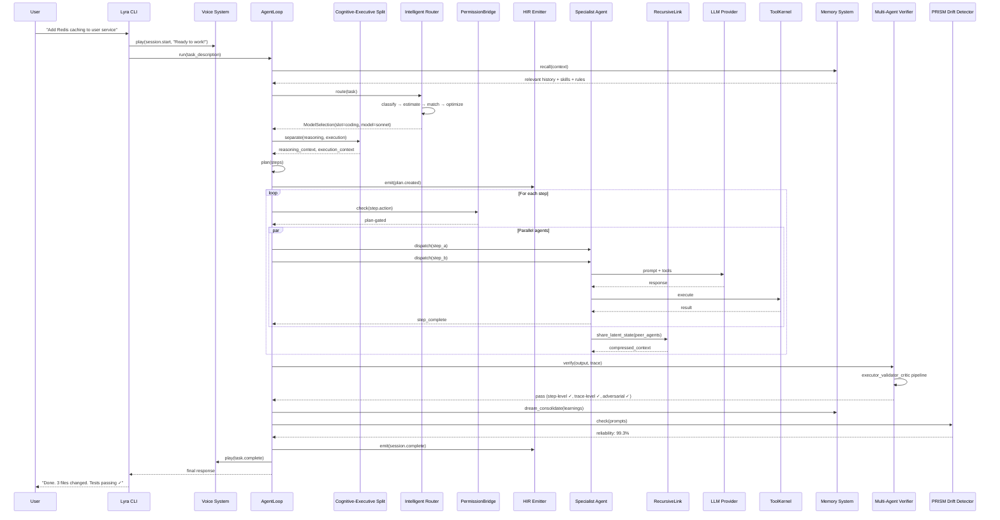
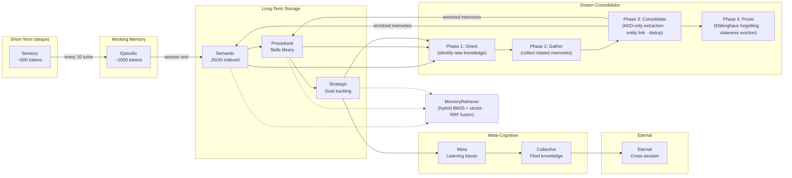
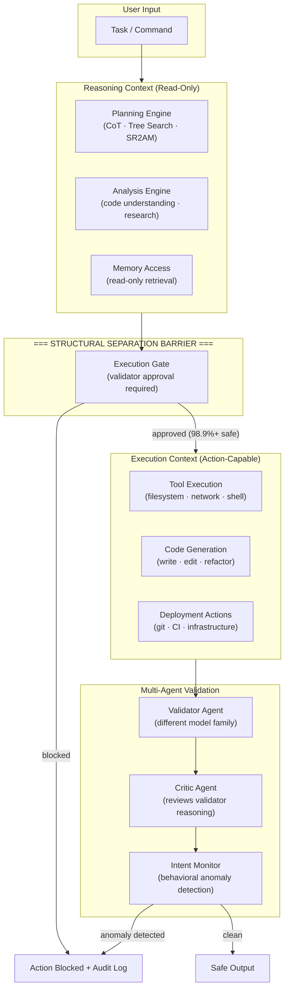
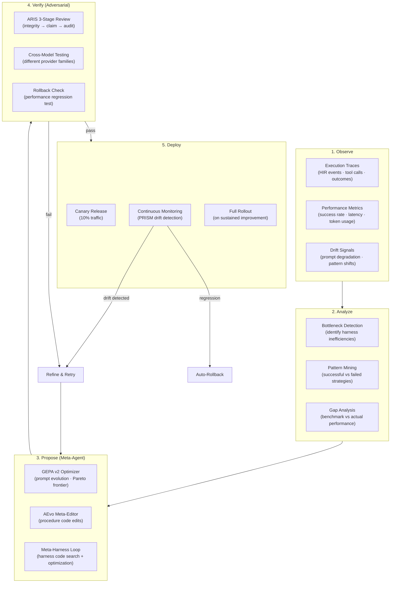

<h1 align="center">
  <br>
  Personal Superintelligent AI Research Agent
</h1>

<p align="center">
  <a href="https://python.org"></a>
  <a href="https://www.typescriptlang.org/"></a>
  <a href=""></a>
  <a href="LICENSE"></a>
  <a href="packages/"></a>
  <a href="docs/roadmap.md"></a>
  <a href="plans/LYRA_ULTRA_PLAN_13_BREAKTHROUGH_SYNTHESIS.md"></a>
</p>

<p align="center">
  <b>Multi-agent orchestration. Deep reasoning. Hierarchical memory. Self-evolution.<br>
  Cognitive-executive safety separation. Latent-space agent communication. Dream consolidation.<br>
  135+ composable packages. 16+ LLM providers. One extensible platform.</b>
</p>

<p align="center">
  <a href="#quickstart"><b>Quickstart</b></a> ·
  <a href="#architecture"><b>Architecture</b></a> ·
  <a href="#innovations"><b>Innovations</b></a> ·
  <a href="#breakthrough-plan-13"><b>Plan 13</b></a> ·
  <a href="#package-catalog"><b>Packages</b></a> ·
  <a href="#color-themes"><b>Themes</b></a> ·
  <a href="docs/CONTRIBUTING.md"><b>Contributing</b></a> ·
  <a href="CHANGELOG.md"><b>Changelog</b></a>
</p>

---

## What is Lyra?

Lyra is a **production-grade agent platform** that researches, codes, tests, reviews, and evolves — autonomously or as your pair-programming teammate. It combines techniques from 38+ research papers and 45+ open-source agent frameworks into a unified, extensible system.

Unlike thin API wrappers, Lyra ships with a **kernel-enforced TDD gate**, **8-level hierarchical memory with Dream consolidation**, **multi-agent debate with tree search**, **automatic prompt and harness evolution**, **RecursiveLink latent-space agent communication**, **Parallax-style cognitive-executive safety separation**, **SR2AM self-regulated planning**, and a **Claude Code-style terminal interface** — all wired together through an observable, auditable event stream.

---

## Architecture

### System Topology


```mermaid
graph TB
    subgraph Interface["Interface Layer"]
        CLI["lyra CLI<br/>(Typer + prompt_toolkit)"]
        TUI["Terminal UI<br/>(Ink/React 19)"]
        ACP["ACP Server<br/>(Agent Client Protocol)"]
        Voice["Voice System<br/>(CESP v1.0 · 6-layer packs)"]
    end

    subgraph Kernel["Kernel (lyra-core)"]
        Loop["AgentLoop<br/>plan → execute → verify"]
        TDD["TDD Gate<br/>RED → GREEN → REFACTOR"]
        Perms["PermissionBridge<br/>plan | auto-edit | bypass"]
        HIR["HIR Emitter<br/>(JSONL event stream)"]
        Pivot["Pivot/Refine Loop<br/>(failure recovery)"]
    end

    subgraph Intelligence["Intelligence Layer"]
        Reasoning["Deep Reasoning<br/>(CoT · Tree Search · Debate · SR2AM)"]
        Research["Research Pipeline<br/>(10-step · 7+ sources · DCI zero-index)"]
        Evolution["Self-Evolution<br/>(GEPA v2 · AEvo · Meta-Harness)"]
        Memory["Hierarchical Memory<br/>(8-level · Dream consolidation · hybrid BM25+vector)"]
        RecursiveLink["RecursiveLink<br/>(latent-space agent comms · 75.6% token reduction)"]
    end

    subgraph Coordination["Coordination Layer"]
        Orchestrator["Agent Orchestrator<br/>(DAG-based teams · fleet)"]
        Subagents["Subagent Runner<br/>(worktree isolation)"]
        Skills["Skill Registry<br/>(150+ triggers · auto-compaction)"]
        Rules["Rule Engine<br/>(coding · security · testing)"]
    end

    subgraph Safety["Safety Layer (6-Layer)"]
        CogExec["Cognitive-Executive Split<br/>(Parallax · 98.9% block rate)"]
        Shield["AgentShield<br/>(5 scanners · 102 rules)"]
        Observatory["TokenObservatory<br/>(13 categories · 7 wastes)"]
        Verifier["Multi-Agent Verifier<br/>(executor→validator→critic)"]
        IntentMon["Intent Monitor<br/>(behavioral anomaly detection)"]
        DriftDetect["PRISM Drift Detector<br/>(prompt reliability · auto-repair)"]
    end

    subgraph Providers["16+ LLM Providers"]
        Anthro["Anthropic<br/>Opus · Sonnet · Haiku"]
        DS["DeepSeek<br/>V4 Pro · Flash"]
        OAI["OpenAI<br/>GPT-4o · O3"]
        Gemini["Google<br/>Gemini 2.5/3.1"]
        Others["xAI · Mistral · Qwen<br/>Kimi · Bedrock · Ollama"]
    end

    CLI --> Loop
    TUI --> Loop
    ACP --> Loop
    Voice --> Loop
    Loop --> TDD & Perms & HIR & Pivot
    Loop --> Reasoning & Research & Memory & RecursiveLink
    Loop --> Evolution
    Loop --> Orchestrator & Subagents & Skills & Rules
    Loop --> CogExec & Shield & Observatory & Verifier & IntentMon & DriftDetect
    Orchestrator & Reasoning & Research --> Anthro & DS & OAI & Gemini & Others
```

### Agent Execution Flow (with Safety Separation)


```mermaid
sequenceDiagram
    participant User
    participant CLI as Lyra CLI
    participant Voice as Voice System
    participant Engine as AgentLoop
    participant CogExec as Cognitive-Executive Split
    participant Router as Intelligent Router
    participant Perms as PermissionBridge
    participant HIR as HIR Emitter
    participant Agent as Specialist Agent
    participant RecLink as RecursiveLink
    participant LLM as LLM Provider
    participant Tools as ToolKernel
    participant Mem as Memory System
    participant Verifier as Multi-Agent Verifier
    participant Drift as PRISM Drift Detector

    User->>CLI: "Add Redis caching to user service"
    CLI->>Voice: play(session.start, "Ready to work!")
    CLI->>Engine: run(task_description)

    Engine->>Mem: recall(context)
    Mem-->>Engine: relevant history + skills + rules

    Engine->>Router: route(task)
    Router->>Router: classify → estimate → match → optimize
    Router-->>Engine: ModelSelection(slot=coding, model=sonnet)

    Engine->>CogExec: separate(reasoning, execution)
    CogExec-->>Engine: reasoning_context, execution_context

    Engine->>Engine: plan(steps)
    Engine->>HIR: emit(plan.created)

    loop For each step
        Engine->>Perms: check(step.action)
        Perms-->>Engine: plan-gated

        par Parallel agents
            Engine->>Agent: dispatch(step_a)
            Engine->>Agent: dispatch(step_b)
            Agent->>LLM: prompt + tools
            LLM-->>Agent: response
            Agent->>Tools: execute
            Tools-->>Agent: result
            Agent-->>Engine: step_complete
        end

        Agent->>RecLink: share_latent_state(peer_agents)
        RecLink-->>Agent: compressed_context
    end

    Engine->>Verifier: verify(output, trace)
    Verifier->>Verifier: executor_validator_critic pipeline
    Verifier-->>Engine: pass (step-level ✓, trace-level ✓, adversarial ✓)

    Engine->>Mem: dream_consolidate(learnings)
    Engine->>Drift: check(prompts)
    Drift-->>Engine: reliability: 99.3%

    Engine->>HIR: emit(session.complete)
    Engine->>Voice: play(task.complete)

    Engine-->>CLI: final response
    CLI-->>User: "Done. 3 files changed. Tests passing ✓"
```

### Memory Hierarchy (with Dream Consolidation)


```mermaid
graph LR
    subgraph "Short-Term (deque)"
        STM["Sensory<br/>~500 tokens"]
    end

    subgraph "Working Memory"
        WM["Episodic<br/>~2000 tokens"]
    end

    subgraph "Long-Term Storage"
        SM["Semantic<br/>JSON indexed"]
        PM["Procedural<br/>Skills library"]
        STM2["Strategic<br/>Goal tracking"]
    end

    subgraph "Meta-Cognitive"
        MM["Meta<br/>Learning traces"]
        CM["Collective<br/>Fleet knowledge"]
    end

    subgraph "Eternal"
        EM["Eternal<br/>Cross-session"]
    end

    subgraph "Dream Consolidator"
        DC1["Phase 1: Orient<br/>(identify new knowledge)"]
        DC2["Phase 2: Gather<br/>(collect related memories)"]
        DC3["Phase 3: Consolidate<br/>(ADD-only extraction · entity link · dedup)"]
        DC4["Phase 4: Prune<br/>(Ebbinghaus forgetting · staleness eviction)"]
    end

    STM -->|"every 10 turns"| WM
    WM -->|"session end"| SM
    SM --> PM
    PM --> STM2
    STM2 --> MM
    MM --> CM
    CM --> EM

    SM & PM & STM2 --> DC1
    DC1 --> DC2 --> DC3 --> DC4
    DC3 -->|"enriched memories"| SM & PM

    MR["MemoryRetriever<br/>(hybrid BM25 + vector · RRF fusion)"]
    SM -.-> MR
    PM -.-> MR
    STM2 -.-> MR
```

### Safety Architecture (Parallax-Style Cognitive-Executive Separation)


```mermaid
graph TB
    subgraph Input["User Input"]
        CMD["Task / Command"]
    end

    subgraph Reasoning["Reasoning Context (Read-Only)"]
        Plan["Planning Engine<br/>(CoT · Tree Search · SR2AM)"]
        Analysis["Analysis Engine<br/>(code understanding · research)"]
        Memory2["Memory Access<br/>(read-only retrieval)"]
    end

    subgraph Barrier["=== STRUCTURAL SEPARATION BARRIER ==="]
        Gate["Execution Gate<br/>(validator approval required)"]
    end

    subgraph Execution["Execution Context (Action-Capable)"]
        ToolExec["Tool Execution<br/>(filesystem · network · shell)"]
        CodeGen["Code Generation<br/>(write · edit · refactor)"]
        Deploy["Deployment Actions<br/>(git · CI · infrastructure)"]
    end

    subgraph Validation["Multi-Agent Validation"]
        V1["Validator Agent<br/>(different model family)"]
        V2["Critic Agent<br/>(reviews validator reasoning)"]
        V3["Intent Monitor<br/>(behavioral anomaly detection)"]
    end

    CMD --> Reasoning
    Reasoning --> Gate
    Gate -->|"approved (98.9%+ safe)"| Execution
    Gate -->|"blocked"| Reject["Action Blocked + Audit Log"]
    Execution --> V1
    V1 --> V2
    V2 --> V3
    V3 -->|"anomaly detected"| Reject
    V3 -->|"clean"| Output["Safe Output"]
```

### Self-Evolving Harness Pipeline


```mermaid
flowchart TB
    subgraph Observe["1. Observe"]
        Traces["Execution Traces<br/>(HIR events · tool calls · outcomes)"]
        Metrics["Performance Metrics<br/>(success rate · latency · token usage)"]
        Drift["Drift Signals<br/>(prompt degradation · pattern shifts)"]
    end

    subgraph Analyze["2. Analyze"]
        Bottleneck["Bottleneck Detection<br/>(identify harness inefficiencies)"]
        Pattern["Pattern Mining<br/>(successful vs failed strategies)"]
        Gap["Gap Analysis<br/>(benchmark vs actual performance)"]
    end

    subgraph Propose["3. Propose (Meta-Agent)"]
        GEPA["GEPA v2 Optimizer<br/>(prompt evolution · Pareto frontier)"]
        AEvo["AEvo Meta-Editor<br/>(procedure code edits)"]
        Harness["Meta-Harness Loop<br/>(harness code search + optimization)"]
    end

    subgraph Verify["4. Verify (Adversarial)"]
        ARIS["ARIS 3-Stage Review<br/>(integrity → claim → audit)"]
        CrossModel["Cross-Model Testing<br/>(different provider families)"]
        Rollback["Rollback Check<br/>(performance regression test)"]
    end

    subgraph Deploy2["5. Deploy"]
        Canary["Canary Release<br/>(10% traffic)"]
        Monitor["Continuous Monitoring<br/>(PRISM drift detection)"]
        FullDeploy["Full Rollout<br/>(on sustained improvement)"]
    end

    Observe --> Analyze --> Propose --> Verify
    Verify -->|"pass"| Deploy2
    Verify -->|"fail"| Refine["Refine & Retry"]
    Refine --> Propose
    Monitor -->|"regression"| Rollback2["Auto-Rollback"]
    Monitor -->|"drift detected"| Refine
```

### Package Dependency Graph


```mermaid
graph TB
    subgraph Foundation["Foundation (8 packages)"]
        core["lyra-core<br/>Kernel · TDD · Permissions · Pivot/Refine"]
        agents["lyra-agents<br/>Specialist agents"]
        orchestration["lyra-orchestration<br/>DAG teams"]
        memory["lyra-memory<br/>8-level · Dream consolidation"]
        skills["lyra-skills<br/>150+ triggers · auto-compaction"]
        evals["lyra-evals<br/>pass@k framework"]
        mcp["lyra-mcp<br/>MCP server · enterprise gateway"]
        cli["lyra-cli<br/>25+ commands"]
    end

    subgraph Breakthrough["Breakthrough (14 packages)"]
        reasoning["lyra-reasoning<br/>CoT · Tree Search · SR2AM"]
        research["lyra-research<br/>10-step pipeline · DCI zero-index"]
        evolution["lyra-evolution<br/>GEPA v2 optimizer"]
        router["lyra-router<br/>5-layer task-aware routing"]
        cognitive["lyra-cognitive<br/>Debate agents"]
        streaming["lyra-streaming<br/>Real-time output"]
        cost["lyra-cost<br/>Burn reports"]
        personalization["lyra-personalization<br/>User adaptation"]
        continual["lyra-continual<br/>Lifelong learning"]
        safety["lyra-safety<br/>AgentShield · Parallax · PRISM"]
        observability["lyra-observability<br/>HIR · traces"]
        verification["lyra-verification<br/>multi-agent verifier"]
        recursive_link["lyra-recursive-link<br/>Latent-space agent comms"]
        audio["lyra-audio<br/>CESP v1.0 · voice packs"]
    end

    subgraph AGI["AGI Ascent (21 packages)"]
        world["lyra-world-model<br/>Causal graphs"]
        meta["lyra-meta-evolution<br/>Meta-Harness · AEvo · RSI"]
        colony["lyra-colony<br/>Agent swarms · gossip memory"]
        auto["lyra-auto-mode<br/>Full autonomy"]
        constitutional["lyra-constitutional<br/>Constitutional AI"]
    end

    cli --> core
    core --> agents & orchestration & memory & skills & evals
    agents --> reasoning & research & recursive_link
    orchestration --> colony
    memory --> cognitive & personalization & continual
    skills --> evolution
    reasoning --> world
    evolution --> meta
```

---

## Why Lyra is Different

| Principle | What it means |
|---|---|
| 🧠 **Thinks before it acts** | CoT reasoning, tree search, SR2AM self-regulated planning, and multi-agent debate are first-class primitives. Every task passes through `plan → execute → verify`. |
| 🧪 **Tests first, always** | The kernel enforces a TDD state machine (`RED → GREEN → REFACTOR`). No code ships without passing tests. |
| 🔄 **Self-evolves** | GEPA v2 prompt optimizer + AEvo meta-editor + Meta-Harness loop continuously improve prompts AND harness code. Strategies that work are reinforced; patterns that fail are pruned. |
| 🛡️ **Defense-in-depth safety** | 6-layer safety: cognitive-executive separation (Parallax, 98.9% block rate), AgentShield (5 scanners, 102 rules), multi-agent validation (executor→validator→critic), intent monitoring, PRISM drift detection, TEE verifiability. |
| 🧩 **135+ composable packages** | Every capability is an isolated package with its own tests, docs, and dependencies. Compose what you need. |
| 🌐 **16+ LLM providers** | Anthropic, DeepSeek, OpenAI, Google, xAI, Mistral, Qwen, Kimi, Bedrock, Ollama. 5-layer intelligent routing with automatic fallback. Zero vendor lock-in. |
| 📊 **Token-level observability** | 13 waste categories tracked in real-time. JSONL event stream (HIR) for full auditability. Burn reports show exactly where tokens go. |
| 🗣️ **Voice & audio** | CESP v1.0 cross-environment sound protocol. 6-layer sound pack selection. Funny session-start voices ("Ready to work!"). Audio suppression with silent hours. |
| 🎨 **25 color themes** | 5 families (Dark, Warm, Nature, Retro, Accessible) with live preview and instant switching. Catppuccin, Tokyo Night, Dracula, Nord, Gruvbox, Rose Pine, and more. |
| 📚 **Research-backed** | 38+ papers and 45+ repos absorbed with a documented absorption matrix. Every technique traces to its source paper or reference implementation. |

---

## Innovations

Lyra integrates techniques from cutting-edge research. Each innovation is documented with its inspiration.

### Reasoning & Problem Solving

| Innovation | Description | Inspiration |
|---|---|---|
| **Tournament TTS** | Recursive tournament voting + parallel-distill-refine on coding attempts | [Scaling Test-Time Compute (Meta, 2026)](https://arxiv.org/abs/2604.16529) |
| **SR2AM Self-Regulated Planning** | System I (reactive) / System II (world-model simulation) / System III (learned configurator). 8B matching 1T systems with 25.8-95.3% fewer reasoning tokens | [SR2AM (2026)](https://arxiv.org/abs/2605.22138) |
| **ReasoningBank** | Distills successes *and* failures into structured lessons; memory-aware test-time scaling | [ReasoningBank (Google, 2025)](https://arxiv.org/abs/2509.25140) |
| **Reflexion Loop** | Verbal RL: generate a verbal lesson on failure, inject into next attempt | [Reflexion (NeurIPS 2023)](https://arxiv.org/abs/2303.11366) |
| **Pivot/Refine Recovery** | On failure: analyze error → generate alternative strategy → retry with cross-run evolution | [AutoResearchClaw (2026)](https://arxiv.org/abs/2605.20025) |
| **Multi-Agent Debate** | K=3 debate agents with pivot/refine loop, cross-run lesson store | [AutoResearchClaw](https://arxiv.org/abs/2505.21549) |
| **MCTS Code Search** | Intra-attempt Monte Carlo tree search for code exploration | [SWE-Search (ICLR 2025)](https://arxiv.org/abs/2410.20285) |

### Memory & Context

| Innovation | Description | Inspiration |
|---|---|---|
| **8-Level Memory Hierarchy** | Sensory → Episodic → Semantic → Procedural → Strategic → Meta → Collective → Eternal | [TencentDB-Agent-Memory](https://github.com/Tencent/TencentDB-Agent-Memory), [MemPalace](https://github.com/MemPalace/mempalace) |
| **Dream 4-Phase Consolidation** | Orient → Gather → Consolidate (ADD-only extraction, entity linking) → Prune (Ebbinghaus forgetting). Background processing with multi-signal retrieval | Claude Code Dream, [Mem0](https://github.com/mem0ai/mem0) (91.6 LoCoMo, 93.4 LongMemEval) |
| **Hybrid BM25+Vector Retrieval** | RRF fusion of keyword and embedding search with configurable per-language tokenization | [TencentDB-Agent-Memory](https://github.com/Tencent/TencentDB-Agent-Memory) |
| **Neural Garbage Collection** | Block-level context eviction with budget-aware interoception and full audit trail | [NGC (Stanford, 2026)](https://arxiv.org/abs/2604.18002) |
| **Progressive Disclosure** | 3-level skill loading: metadata → triggers → full content. ~10x token savings | [claude-mem](https://github.com/thedotmack/claude-mem) |
| **Symbolic Short-Term Memory** | Compress tool logs into Mermaid syntax with `node_id` drill-down for full auditability | [TencentDB-Agent-Memory](https://github.com/Tencent/TencentDB-Agent-Memory) |
| **DCI Zero-Index Retrieval** | Direct corpus interaction via grep/rg without pre-built indexes. Tiered context management (truncation → compaction → summarization) | [DCI-Agent-Lite](https://github.com/DCI-Agent/DCI-Agent-Lite) |

### Self-Evolution & Learning

| Innovation | Description | Inspiration |
|---|---|---|
| **GEPA v2 Multi-Agent Optimizer** | Parallel prompt learning across fleet (Combee-inspired, 17x speedup). Pareto frontier selection. Joint optimization of prompts + harness code. $2-10/run | [GEPA (ICLR 2026 Oral)](https://arxiv.org/abs/2310.03714), [Combee](https://arxiv.org/abs/2604.15771) |
| **Meta-Harness Optimization** | Outer-loop system searches over Lyra's own harness code. Agentic proposer with filesystem access to prior candidates. +7.7pts with 4x fewer tokens | [Meta-Harness (2026)](https://arxiv.org/abs/2603.28052) |
| **AEvo Meta-Editing** | Meta-agent observes accumulated state and edits procedures. Harnessed meta-editing prevents drift. 26% relative improvement | [AEvo (2026)](https://arxiv.org/abs/2605.13821) |
| **Trace2Skill** | Automatic extraction of reusable skills from successful execution traces | [Trace2Skill (2026)](https://arxiv.org/abs/2605.21810) |
| **PRISM Drift Detection** | Daily automated detection of LLM prompt degradation with auto-repair via GEPA re-optimization. Target: 99% prompt reliability | [PRISM (2026)](https://arxiv.org/abs/2605.14454) |
| **Skill Weaving** | Composite skill creation by combining verified atomic skills | [Voyager (NVIDIA, TMLR 2024)](https://arxiv.org/abs/2305.16291) |

### Agent Communication & Coordination

| Innovation | Description | Inspiration |
|---|---|---|
| **RecursiveLink Latent Comms** | Latent-space agent communication via RecursiveLink modules. 75.6% token reduction, 1.2-2.4x speedup. Hybrid text+latent mode with text fallback | [RecursiveMAS (2026)](https://arxiv.org/abs/2505.23119) |
| **DAG-Based Agent Teams** | SOP-driven role topology (PM/Architect/Engineer/Reviewer/QA) | [MetaGPT (ICLR 2024)](https://arxiv.org/abs/2308.00352), [SemaClaw (2026)](https://arxiv.org/abs/2604.11548) |
| **Cross-Model ARIS Verification** | 3-stage adversarial review: evidence integrity → result-to-claim → claim auditing. Executor ≠ Reviewer model family | [ARIS (2026)](https://arxiv.org/abs/2505.24168) |
| **Agent Fleet** | Parallel fan-out with squad organization, task metrics, shared task lists, and polling | [Claude Code Agent Teams](https://code.claude.com/docs/en/agent-teams) |
| **Worktree Isolation** | Subagents run in isolated git worktrees; changes reviewed before merging | [Claude Code](https://github.com/anthropics/claude-code) |

### Routing & Cost Optimization

| Innovation | Description | Inspiration |
|---|---|---|
| **5-Layer Intelligent Router** | Task → complexity → capability → cost → performance history cascading with automatic fallback | [FrugalGPT (Stanford, 2023)](https://arxiv.org/abs/2305.05176), [RouteLLM (Berkeley, 2024)](https://arxiv.org/abs/2406.18665) |
| **Confidence-Thresholded Escalation** | Route to stronger model only when confidence drops below threshold | [Confidence-Driven LLM Router (2025)](https://arxiv.org/abs/2502.11021) |
| **Progressive Tool Discovery** | Deferred tool schema loading with semantic tool search. 85% context savings. Auto-pruning based on task relevance | Claude Code Tool Search, [Meta-Harness](https://arxiv.org/abs/2603.28052) |
| **TokenJuice Compression** | Rule-based overlay compressing tool output before reaching LLM (up to 80% token savings) | [OpenHuman](https://github.com/tinyhumansai/openhuman) |

### Safety & Verification

| Innovation | Description | Inspiration |
|---|---|---|
| **Cognitive-Executive Separation** | Structural separation of reasoning (read-only) from execution (action-capable). Independent verification agent. 98.9% block rate | [Parallax (2026)](https://arxiv.org/abs/2604.12986) |
| **Multi-Agent Validation Pipeline** | Executor → Validator → Critic pipeline for all critical operations. Validator from different model family. Critic reviews validator's reasoning | AWS Stop Hallucinations Workshop |
| **Two-Phase Verifier** | Step-level correctness + trace-level consistency verification | [Qwen PRM Lessons (2025)](https://arxiv.org/abs/2501.07301) |
| **AgentShield (5-Layer)** | Secrets, injection, XSS, SQLi, path traversal scanners | [ECC Adversarial Pipeline](https://github.com/affaan-m/ECC) |
| **TDD Reward Gate** | Numeric reward signal from citation verification, reused at inference time | [KnowRL (Zhejiang Univ, 2025)](https://arxiv.org/abs/2506.19807) |
| **Tool-Call Verification** | Post-hoc auditing for knowing-doing gap. Hidden-state confidence probe before tool execution | [Knowing-Doing Gap (2026)](https://arxiv.org/abs/2605.14038) |
| **Intent-Based Security** | Continuous monitoring of action sequences for intent deviation. Temporal pattern analysis. Anomaly detection on agent behavior | Radware Intent-Based Security |

> **Full absorption matrix**: See [`docs/research/papers.md`](docs/research/papers.md) (38+ papers) and [`docs/research/repos.md`](docs/research/repos.md) (45+ repos) for the complete bibliography with implementation locations.

---

## Breakthrough Plan 13

The latest breakthrough synthesis from deep research across 50+ sources identifies **6 critical gaps to AGI** and their solutions:

| Gap | Solution | Key Lever | Phase |
|-----|----------|-----------|-------|
| No self-evolving harness | Meta-Harness + AEvo + GEPA v2 loop | +7.7pts, 4x fewer tokens | 13.4 |
| Text-only agent communication | RecursiveLink latent-space comms | 75.6% token reduction | 13.2 |
| No architectural safety separation | Parallax cognitive-executive split | 98.9% block rate | 13.3 |
| Flat memory architecture | Dream 4-phase consolidation | 93%+ LoCoMo target | 13.1 |
| No self-regulated planning | SR2AM 3-system reasoning | 8B matching 1T systems | 13.2 |
| Static tool loading | Progressive tool discovery | 85% context savings | 13.1 |

[**Read the full Plan 13 →**](plans/LYRA_ULTRA_PLAN_13_BREAKTHROUGH_SYNTHESIS.md)

### All Ultra Plans

| Plan | Focus | Status |
|------|-------|--------|
| [Plan 6](plans/LYRA_ULTRA_PLAN_6_OMNI_AGI_BREAKTHROUGH.md) | Master — 16 dimensions, 52-week roadmap | Active |
| [Plan 7](plans/LYRA_ULTRA_PLAN_7_SKILLS_ECOSYSTEM.md) | Skills — 80+ domain skills, curator, learner, evolver | Active |
| [Plan 8](plans/LYRA_ULTRA_PLAN_8_VOICE_AUDIO_SYSTEM.md) | Voice — fantasy packs, CESP pipeline, dictation | Active |
| [Plan 9](plans/LYRA_ULTRA_PLAN_9_TOOLS_UNIVERSE.md) | Tools — 200+ tools across 20 toolsets | Active |
| [Plan 10](plans/LYRA_ULTRA_PLAN_10_MODEL_ROUTER_V2.md) | Router — 5-layer intelligent cascading | Active |
| [Plan 11](plans/LYRA_ULTRA_PLAN_11_AUTONOMOUS_SYSTEMS.md) | Autonomous — goals, continuous mode, hooks | Active |
| [Plan 12](plans/LYRA_ULTRA_PLAN_12_AGENT_FLEET_SWARM.md) | Fleet — parallel fan-out, squads, colony, federation | Active |
| [**Plan 13**](plans/LYRA_ULTRA_PLAN_13_BREAKTHROUGH_SYNTHESIS.md) | **Breakthrough — 6 AGI gaps, meta-evolution, safety separation, Dream memory** | **Active** |

---

## LLM Providers

Lyra works with 16+ providers through a unified interface. The intelligent router selects the optimal model per task.

| Provider | Models | Context | Reasoning | Vision | Best For |
|----------|--------|---------|-----------|--------|----------|
| **Anthropic** | Opus 4.7, Sonnet 4.6, Haiku 4.5 | 200K | ✓ | ✓ | Complex reasoning, architecture |
| **DeepSeek** | V4 Pro, V4 Flash, Reasoner | 128K | ✓ | — | Cost-effective reasoning |
| **OpenAI** | GPT-4o, O3, O3 Mini, O1 | 200K | ✓ | ✓ | Broad capability |
| **Google** | Gemini 2.5 Pro, 3.1 Pro, Flash | 2M | ✓ | ✓ | Long context, multimodal |
| **xAI** | Grok 4, Code Fast | 256K | — | — | Fast coding |
| **Mistral** | Codestral, Large | 256K | — | — | Code generation |
| **Qwen** | 3.7 Max, Turbo, Plus | 128K | ✓ | — | Asian language tasks |
| **Kimi** | K2.6 | 128K | ✓ | — | Chinese market |
| **Bedrock** | Claude via AWS | 200K | ✓ | — | Enterprise/regulated |
| **Ollama** | Llama, Qwen Coder | 8K+ | — | — | Local/offline dev |
| **Vertex AI** | Gemini via GCP | 2M | ✓ | ✓ | GCP workloads |
| **OpenRouter** | 200+ models | varies | varies | varies | Model exploration |
| **Copilot** | GPT-4o via GitHub | 128K | ✓ | ✓ | GitHub integration |
| **Gemini CLI** | Gemini via Google CLI | 1M | ✓ | ✓ | Google ecosystem |
| **Custom** | Any OpenAI-compatible | varies | varies | varies | Self-hosted, proxies |

```json
// ~/.lyra/settings.json — Provider configuration
{
  "last_model": "anthropic:claude-sonnet-4-6",
  "fast_model": "deepseek-v4-flash",
  "smart_model": "deepseek-v4-pro",
  "fallback_chain": ["anthropic", "deepseek", "gemini", "openai"],
  "providers": {
    "my_custom": {
      "type": "openai_compatible",
      "base_url": "https://my-llm.internal/v1",
      "api_key_env": "MY_LLM_KEY",
      "models": ["my-model-v2"]
    }
  }
}
```

---

## Color Themes

Lyra ships with **25 professionally-designed color themes** across 5 families, with live preview and instant switching.

### Dark & Modern
| Theme | Palette | Vibe |
|-------|---------|------|
| **Catppuccin Mocha** | `#1e1e2e` `#cdd6f4` `#cba6f7` `#89b4fa` | Soothing pastel dark |
| **Tokyo Night** | `#1a1b26` `#c0caf5` `#bb9af7` `#7aa2f7` | Neon cyberpunk |
| **Dracula** | `#282a36` `#f8f8f2` `#bd93f9` `#50fa7b` | Purple-tinted classic |
| **One Dark Pro** | `#282c34` `#abb2bf` `#c678dd` `#61afef` | Atom editor iconic |
| **Monokai Pro** | `#2d2a2e` `#fcfcfa` `#ab9df2` `#ffd866` | Pro-grade warm dark |

### Warm & Cozy
| Theme | Palette | Vibe |
|-------|---------|------|
| **Gruvbox Dark** | `#282828` `#ebdbb2` `#d3869b` `#83a598` | Retro terminal warm |
| **Rose Pine** | `#191724` `#e0def4` `#ebbcba` `#31748f` | Rosy dawn dark |
| **Kanagawa** | `#1f1f28` `#dcd7ba` `#957fb8` `#7e9cd8` | Japanese ink wash |
| **Ayu Mirage** | `#1f2430` `#cbccc6` `#d4bfff` `#5ccfe6` | Muted elegant |
| **Solarized Dark** | `#002b36` `#839496` `#6c71c4` `#268bd2` | Scientifically balanced |

### Nature & Forest
| Theme | Palette | Vibe |
|-------|---------|------|
| **Everforest** | `#2d353b` `#d3c6aa` `#d699b6` `#7fbbb3` | Forest green calm |
| **Nord** | `#2e3440` `#d8dee9` `#b48ead` `#88c0d0` | Arctic blue clean |

### Retro & Synth
| Theme | Palette | Vibe |
|-------|---------|------|
| **Synthwave 84** | `#262335` `#ff7edb` `#fede5d` `#36f9f6` | Neon 80s arcade |
| **GitHub Dark** | `#0d1117` `#c9d1d9` `#d2a8ff` `#58a6ff` | GitHub native dark |

### Accessible & High Contrast
| Theme | Palette | Vibe |
|-------|---------|------|
| **Night Owl** | `#011627` `#d6deeb` `#c792ea` `#82aaff` | WCAG-optimized |

Switch themes with `lyra theme set <name>` or via the interactive picker (`Ctrl+T`). Custom themes in `~/.lyra/themes/`. [Full theme gallery →](docs/themes.md)

---

## Package Catalog

Lyra is a monorepo of 135+ composable packages across four tiers. Each package has its own `pyproject.toml`, tests, and README.

| Tier | Count | Purpose | Highlights |
|------|-------|---------|------------|
| **Foundation** | 8 | Core infrastructure | AgentLoop kernel, 25+ CLI commands, 8-level memory, 150+ skill triggers, TDD gate |
| **Breakthrough** | 14 | Advanced capabilities | Deep reasoning (SR2AM), RecursiveLink, Dream consolidation, GEPA v2, Meta-Harness, Parallax safety |
| **AGI Ascent** | 21 | Experimental/forward-looking | Multi-level verification, causal graphs, recursive self-improvement, constitutional AI |
| **UI** | 3 | Terminal interface | Zustand state store, Ink/React 19 TUI, WebSocket + SSE transport |
| **Providers** | 12 | LLM integrations | Anthropic, DeepSeek, OpenAI, Google, xAI, Mistral, Qwen, Bedrock, Ollama, Vertex, OpenRouter, Copilot |
| **Skills** | 80+ | Domain expertise | Python, TypeScript, Go, Rust, React, Django, FastAPI, DevOps, Security, Research |

```
packages/
├── lyra-core/              # Kernel: AgentLoop, TDD Gate, PermissionBridge, HIR, Pivot/Refine
├── lyra-cli/               # CLI: Typer commands, interactive REPL, session mgmt
├── lyra-agents/            # Specialist agents: Code, Test, Review, Research
├── lyra-orchestration/     # DAG-based team orchestration, agent fleet
├── lyra-memory/            # 8-level hierarchy + Dream 4-phase consolidation
├── lyra-skills/            # Skill registry, 150+ triggers, auto-compaction
├── lyra-evals/             # pass@k evaluation framework
├── lyra-mcp/               # MCP server + enterprise gateway
├── lyra-reasoning/         # CoT, Tree Search, SR2AM, Multi-agent debate
├── lyra-research/          # 10-step research pipeline + DCI zero-index retrieval
├── lyra-evolution/         # GEPA v2, AEvo, Meta-Harness optimization
├── lyra-recursive-link/    # Latent-space inter-agent communication
├── lyra-router/            # 5-layer intelligent router + cost cascading
├── lyra-safety/            # AgentShield, Parallax, PRISM drift detection
├── lyra-observability/     # HIR event stream, traces, burn reports
├── lyra-verification/      # Multi-agent verifier (executor→validator→critic)
├── lyra-audio/             # CESP v1.0, voice packs, audio suppression
├── lyra-world-model/       # Causal graphs, counterfactual reasoning
├── lyra-meta-evolution/    # Recursive self-improvement (RSI)
├── lyra-colony/            # Agent swarm with gossip memory
├── lyra-auto-mode/         # Full autonomy mode
├── lyra-constitutional/    # Constitutional AI safeguards
├── ui-core/                # Zustand state management
├── ui-terminal/            # Ink/React 19 TUI with 25 theme presets
└── ui-transport/           # WebSocket + SSE transport layer
```

---

## Quickstart

```bash
# 1. Clone and install
git clone https://github.com/lyra-ai/lyra.git && cd lyra

# 2. Install Python dependencies
pip install -e ".[dev]"

# 3. Install TypeScript dependencies (for TUI)
npm install && npm run build --workspaces

# 4. Set at least one API key
export ANTHROPIC_API_KEY="sk-ant-..."
export DEEPSEEK_API_KEY="sk-..."

# 5. Launch the interactive REPL
lyra

# Or with the TypeScript TUI
lyra --tui
```

## CLI Commands

```bash
# Interactive REPL (default)
lyra                                    # Start interactive session
lyra --model deepseek-v4-pro            # With specific model
lyra --continue                         # Resume last session
lyra --tui                              # Terminal UI mode

# Single-shot commands
lyra run "Add Redis caching to user service"
lyra plan "Design rate limiting strategy"
lyra investigate "Memory leak in worker process"

# Session management
lyra session list                       # List all sessions
lyra session show <id>                  # Show session details
lyra session rename <id> "name"         # Label important sessions
lyra retro                              # Session retrospective

# Model management
lyra model list                         # List configured models
lyra model set anthropic:sonnet         # Switch default model

# Health & diagnostics
lyra doctor                             # System health check
lyra status                             # Runtime status
lyra burn                               # Token usage report (13 categories)

# Skills & memory
lyra skill list                         # List available skills
lyra skill create                       # Interactive skill builder
lyra skill install <url>                # Install from git or local path
lyra memory search "deployment process" # Search memory with hybrid retrieval

# Themes
lyra theme list                         # All 25 themes
lyra theme set catppuccin-mocha         # Switch theme
lyra theme preview tokyo-night          # Live preview

# Development
lyra evals                              # Run evaluation harness (pass@k)
lyra evolve                             # Run prompt evolution (GEPA)
lyra verify                             # Run adversarial cross-model verification
```

---

## Configuration

```json
// ~/.lyra/settings.json
{
  "last_model": "anthropic:claude-sonnet-4-6",
  "last_provider": "anthropic",
  "fast_model": "deepseek-v4-flash",
  "smart_model": "deepseek-v4-pro",
  "fallback_chain": ["anthropic", "deepseek", "gemini", "openai"],
  "theme": "catppuccin-mocha",
  "permission_mode": "plan",
  "auto_detect_tasks": true,
  "max_turns": 50,
  "max_budget_usd": 10.0,
  "effort": "high",
  "skill_listing_budget_fraction": 0.15,
  "vim_mode": false,
  "emacs_mode": false,
  "voice": {
    "enabled": true,
    "pack": "fantasy-peon",
    "session_start": "ready-to-work",
    "task_complete": true,
    "dictation_enabled": false
  },
  "safety": {
    "cognitive_executive_separation": true,
    "adversarial_verification": true,
    "intent_monitoring": true,
    "drift_detection": true
  }
}
```

### Permission Modes

| Mode | Behavior | Use Case |
|------|----------|----------|
| `plan` | Every tool call gated for approval | Default, safe for all work |
| `auto-edit` | Trusted operations auto-approved | Faster pair programming |
| `bypass-perms` | Full autonomy, audit-logged | Autonomous agent runs |
| `auto_mode` | Self-directed with goal tracking | Long-running autonomous tasks |

Switch inline with `Shift+Tab`.

---

## Design Principles

1. **Tests First** — Every behavior change starts with a failing test. The TDD gate is enforced by the kernel.
2. **Evidence Over Assertion** — Run the command before claiming the fix. The multi-agent verifier ensures output correctness.
3. **Minimum Viable Diff** — The smallest change that makes the test pass. No speculative abstraction.
4. **Transparent Failure** — Errors print the specific blocked path or missing precondition. No silent swallowing.
5. **Immutable State** — Create new objects, never mutate. Pydantic models with `frozen=True` throughout.
6. **Provider Agnostic** — The kernel has zero network dependencies. All provider clients live in `lyra-cli`.
7. **Package Isolation** — Each package has its own `pyproject.toml`, tests, and README. Compose, don't inherit.
8. **HIR Audit Trail** — Every agent action emits a JSONL event. Replay, inspect, or audit any session.
9. **Safety by Separation** — Reasoning and execution run in structurally separated contexts (Parallax architecture).
10. **Continuous Self-Improvement** — The harness observes its own performance and optimizes prompts AND code (Meta-Harness + AEvo loop).
11. **Research-Backed** — Every novel technique traces to its source paper with a documented absorption mode.

---

## Development

```bash
# Full setup
pip install -e ".[dev]"
pre-commit install

# Run tests
make test                    # All tests
make unit                    # Unit tests only
make integration             # Integration tests

# Code quality
make lint                    # ruff + mypy
make format                  # black + isort
make typecheck               # TypeScript type checking

# CI pipeline (same as GitHub Actions)
make ci
```

---

## Documentation

| Resource | Description |
|----------|-------------|
| [`docs/architecture/`](docs/architecture/) | Canonical architecture reference with diagrams |
| [`ARCHITECTURE.md`](ARCHITECTURE.md) | High-level system topology and data flow |
| [`docs/architecture/safety-architecture.md`](docs/architecture/safety-architecture.md) | Parallax-style cognitive-executive separation |
| [`docs/architecture/memory-consolidation.md`](docs/architecture/memory-consolidation.md) | Dream 4-phase consolidation design |
| [`docs/architecture/harness-evolution.md`](docs/architecture/harness-evolution.md) | Meta-optimization loop architecture |
| [`docs/research/papers.md`](docs/research/papers.md) | 38+ paper absorption matrix |
| [`docs/research/repos.md`](docs/research/repos.md) | 45+ repository absorption matrix |
| [`docs/research/breakthrough-synthesis.md`](docs/research/breakthrough-synthesis.md) | Plan 13 key findings and gap analysis |
| [`docs/research/hermes-agent-features.md`](docs/research/hermes-agent-features.md) | Hermes-agent feature inventory |
| [`docs/research/claude-code-features.md`](docs/research/claude-code-features.md) | Claude Code feature inventory |
| [`docs/research/memory-context-systems.md`](docs/research/memory-context-systems.md) | 7-repo memory architecture analysis |
| [`docs/research/skills-ui-ux-voice-systems.md`](docs/research/skills-ui-ux-voice-systems.md) | Skills, UI/UX, voice systems research |
| [`docs/roadmap.md`](docs/roadmap.md) | Development roadmap |
| [`docs/CONTRIBUTING.md`](docs/CONTRIBUTING.md) | Contributor guide |
| [`CHANGELOG.md`](CHANGELOG.md) | Version history |
| [`SOUL.md`](SOUL.md) | Project persona and operating principles |

---

## Research Behind Lyra

Lyra's architecture is informed by deep research across the AI agent ecosystem:

**Papers absorbed** (38+): Tournament TTS, ReasoningBank, Skill-RAG, KnowRL, Neural Garbage Collection, PoisonedRAG, SemaClaw, SWE-Search, AlphaEvolve, FrugalGPT, RouteLLM, Voyager, Reflexion, MetaGPT, ChatDev, DSPy, EAGLE-3, OSWorld, GDPval, Qwen PRM, Codex, AutoResearchClaw, RecursiveMAS, Meta-Harness, SciencePedia, AEvo, ARIS, MOSS, Trace2Skill, Knowing-Doing Gap, SR2AM, Parallax, PRISM, Code as Harness, Reasoning Graphs, Combee, GEPA, HyperAgents

**Repositories studied** (45+): Claude Code, Hermes-agent, Cline, Aider, OpenHands, CrewAI, AutoGPT, LangGraph, GBrain, OpenCode, OpenDev, RTK, Caveman, DCI-Agent-Lite, Graphify, TencentDB-Agent-Memory, Acontext, CodeGraph, claude-mem, MemPalace, CLI-Anything, ARS, ECC, OpenHuman, PeonPing, superpowers, continuous-claude, Multica, CowAgent, Mem0, oh-my-claudecode

See [`docs/research/`](docs/research/) for the complete research library.

---

## License

MIT — see [LICENSE](LICENSE)

---

<div align="center">

**[Quickstart](#quickstart)** · **[Architecture](#architecture)** · **[Innovations](#innovations)** · **[Plan 13](#breakthrough-plan-13)** · **[Packages](#package-catalog)** · **[Themes](#color-themes)** · **[Contributing](docs/CONTRIBUTING.md)** · **[Changelog](CHANGELOG.md)**

Built with Python, TypeScript, and the conviction that AI agents should be open, auditable, self-improving, and architecturally safe.

</div>
