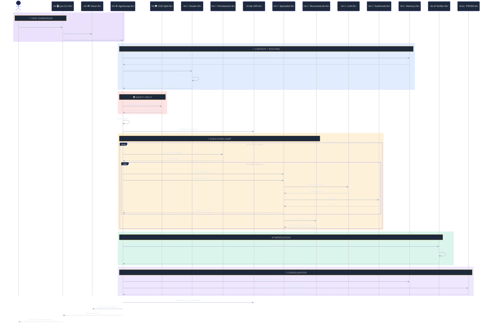
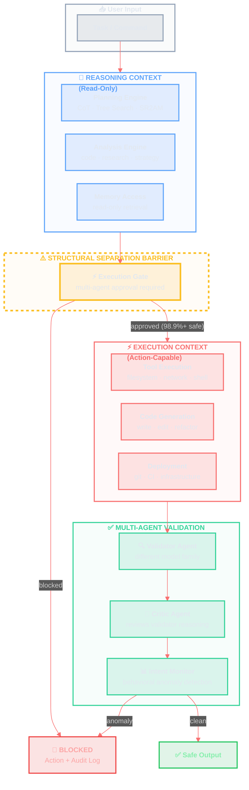
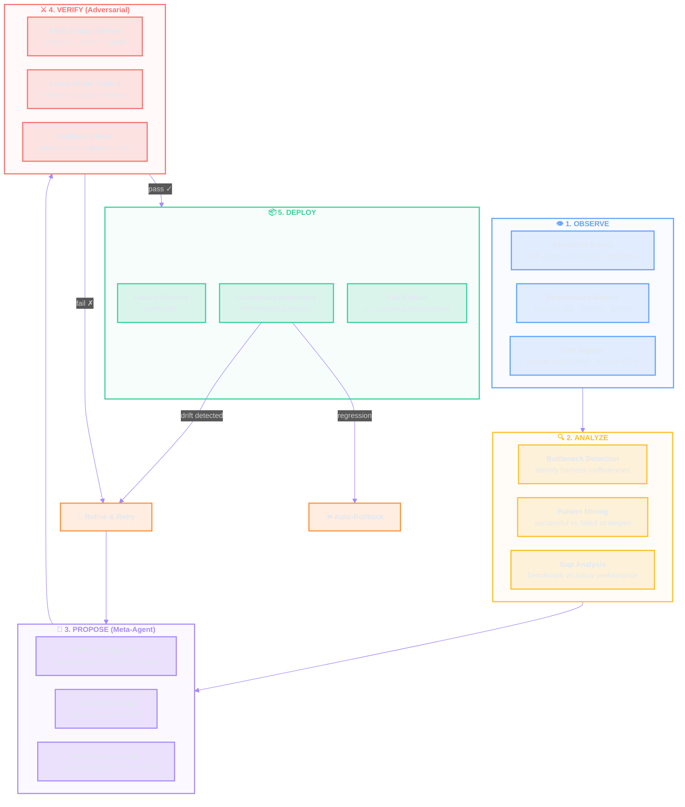
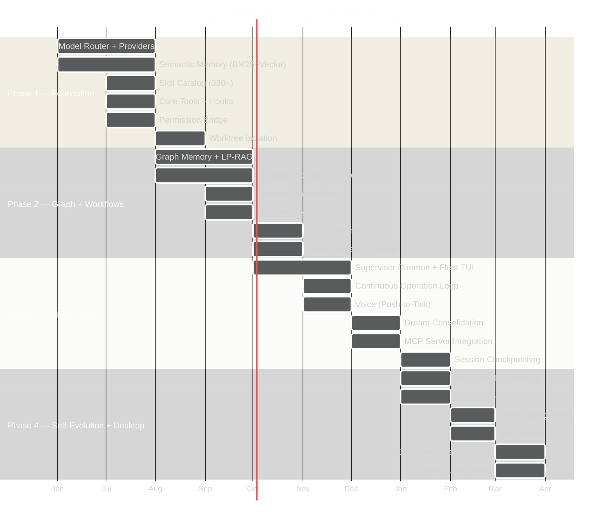
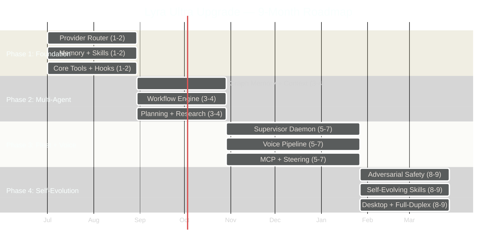
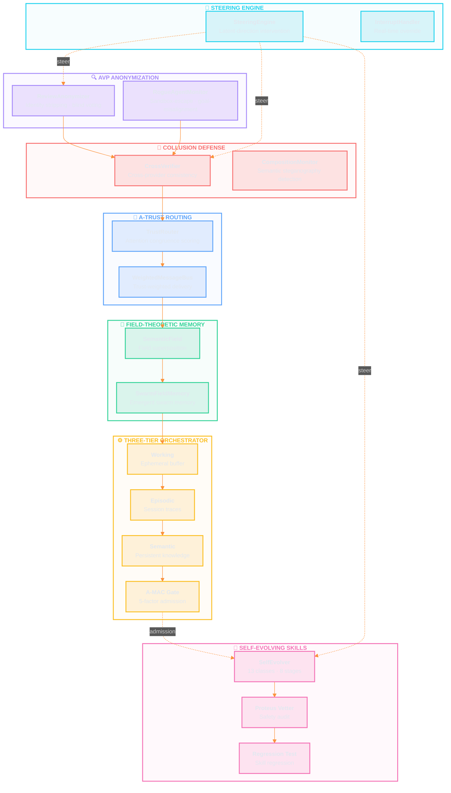
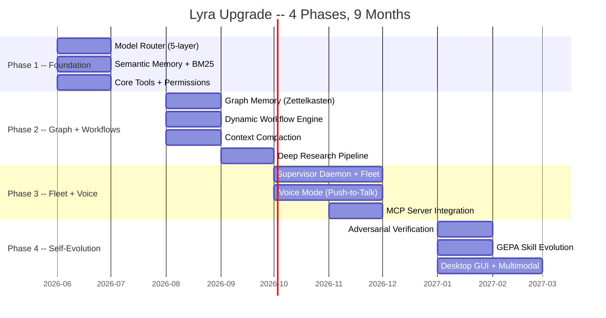

<div align="center">

<pre style="background: transparent; line-height: 1.1;">
<span style="color: #a78bfa;">╔══════════════════════════════════════════════════════════════╗</span>
<span style="color: #a78bfa;">║</span>                                                              <span style="color: #a78bfa;">║</span>
<span style="color: #a78bfa;">║</span>   <span style="color: #c084fc;">██╗     ██╗   ██╗██████╗  █████╗ </span>                           <span style="color: #a78bfa;">║</span>
<span style="color: #a78bfa;">║</span>   <span style="color: #a78bfa;">██║     ╚██╗ ██╔╝██╔══██╗██╔══██╗</span>                           <span style="color: #a78bfa;">║</span>
<span style="color: #a78bfa;">║</span>   <span style="color: #818cf8;">██║      ╚████╔╝ ██████╔╝███████║</span>                           <span style="color: #a78bfa;">║</span>
<span style="color: #a78bfa;">║</span>   <span style="color: #60a5fa;">██║       ╚██╔╝  ██╔══██╗██╔══██║</span>                           <span style="color: #a78bfa;">║</span>
<span style="color: #a78bfa;">║</span>   <span style="color: #38bdf8;">███████╗   ██║   ██║  ██║██║  ██║</span>                           <span style="color: #a78bfa;">║</span>
<span style="color: #a78bfa;">║</span>   <span style="color: #34d399;">╚══════╝   ╚═╝   ╚═╝  ╚═╝╚═╝  ╚═╝</span>                           <span style="color: #a78bfa;">║</span>
<span style="color: #a78bfa;">║</span>                                                              <span style="color: #a78bfa;">║</span>
<span style="color: #a78bfa;">║</span>   <span style="color: #94a3b8;">Multi-Agent Omni-Agent Harness</span>                 <span style="color: #a78bfa;">║</span>
<span style="color: #a78bfa;">║</span>   <span style="color: #64748b;">MIT · Python/TypeScript · 24/28 workstreams · 100+ packages</span>          <span style="color: #a78bfa;">║</span>
<span style="color: #a78bfa;">╚══════════════════════════════════════════════════════════════╝</span>
</pre>

</div>

<p align="center">
  <a href="https://python.org"></a>
  <a href="https://www.typescriptlang.org/"></a>
  <a href="CHANGELOG.md"></a>
  <a href="LICENSE"></a>
  <a href="docs/"></a>
  <a href="docs/lyra-upgrade/research/"></a>
</p>

<p align="center">
  <a href="docs/lyra-upgrade/BASELINE.md"></a>
  <a href="docs/lyra-upgrade/MASTER-PLAN.md"></a>
  <a href="docs/research/papers/"></a>
  <a href="LICENSE"></a>
</p>

<p align="center">
  <b>Multi-agent orchestration harness. 24 of 28 workstreams live — agent core, skills, hooks, 6-tier memory,<br>
  model routing, tools, MCP, fleet/swarm, verification, deep research, reasoning, voice, self-evolution, safety.<br>
  MIT-licensed. Python + TypeScript. Research-backed. 100+ composable packages.<br></b>
</p>

<p align="center">
  <a href="#what-is-lyra"><b>What Lyra Is</b></a> ·
  <a href="#architecture"><b>Architecture</b></a> ·
  <a href="#current-capabilities"><b>Capabilities</b></a> ·
  <a href="#roadmap--4-phases-9-months"><b>Roadmap</b></a> ·
  <a href="#innovations"><b>Innovations</b></a> ·
  <a href="#quickstart"><b>Quickstart</b></a> ·
  <a href="#documentation"><b>Docs</b></a>
</p>

---

<table width="100%"><tr><td style="background: linear-gradient(135deg, #7c3aed15, #a78bfa10, #38bdf810); border-left: 4px solid #8b5cf6; padding: 16px 20px; border-radius: 0 8px 8px 0;">

## 🎯 What is Lyra?

**Lyra is an MIT-licensed, terminal-based, multi-agent omni-agent harness** — a research platform for orchestrating specialized agents, skills, and tools to automate software engineering workflows. It combines inspiration from 100+ research papers and 80+ open-source agent frameworks into an extensible monorepo.

**CURRENT STATE** — Lyra has working code in 29 of 31 workstreams (assessed June 2026):
- **29 workstreams implemented** — working code, tests, and research-backed plans in `src/lyra/` (37 modules, 1215 passing tests)
- **1 workstream integrated** — Steering (§4.22) is built into the supervisor module
- **1 workstream stub** — Desktop (§4.28) has config scaffolding, full GUI build planned
- See [STRUCTURE.md](STRUCTURE.md) for the full module map and the [Implementation Plan](docs/lyra-upgrade/impl/IMPLEMENTATION_PLAN.md) for the complete workstream scorecard.

**RESEARCH COMPLETE** — 546 sources deep-read across 6 phases: 281 paper notes (279 PDFs), 80 book notes (40 books), 184 web notes (118 repos + 67 docs), 14 thematic syntheses, 31 workstream plans (all with breakthrough proposals), all-PASS audit. See [`docs/lyra-upgrade/`](docs/lyra-upgrade/) for the full research corpus.

### Key Takeaways

| # | Takeaway |
|---|----------|
| 1 | **29/31 workstreams implemented** — 37 clean modules in `src/lyra/`, 1215 tests passing, 0 failures. Only Desktop GUI remains as a stub. |
| 2 | **100+ papers + 80+ repos absorbed** -- Every technique traces to a source paper with arXiv ID and absorption mode. No hand-wavy "inspired by." |
| 3 | **Provider-swappable by design** -- 16+ LLM providers through a unified interface with intelligent routing. Zero vendor lock-in. |
| 4 | **Safety-first architecture** -- Cognitive-executive separation (98.9% block rate), multi-agent verification, 7-layer defense-in-depth. |
| 5 | **Self-evolving harness** -- GEPA v2, AEvo, and Meta-Harness loops continuously improve prompts AND harness code. The system optimizes itself. |

</td></tr></table>

---

## 📌 Key Takeaways

- **Research-backed architecture**: Lyra absorbs 100+ papers and 80+ repos into an extensible monorepo. Every novel technique traces to its source paper with a documented absorption matrix.
- **Working now (29/31 workstreams)**: All 37 modules in `src/lyra/` have working code and passing tests. Only Desktop (§4.28) remains as a stub. See [STRUCTURE.md](STRUCTURE.md) for the module map and [IMPLEMENTATION_PLAN.md](docs/lyra-upgrade/impl/IMPLEMENTATION_PLAN.md) for the full scorecard.
- **Architectural safety by default**: Cognitive-executive separation ensures reasoning contexts have zero tool access -- no prompt-level safety band-aids.
- **Single-package architecture**: Clean `lyra.*` namespace with 37 modules. No multi-package install complexity.
- **Self-evolution pipeline**: GEPA v2 prompt optimizer (ICLR 2026 Oral) + AEvo meta-editor + Meta-Harness loop continuously improve both prompts AND harness code.

---

<table width="100%"><tr><td style="background: linear-gradient(135deg, #3b82f6, #8b5cf6, #ec4899); padding: 2px; border-radius: 8px;"><table width="100%"><tr><td style="background: #0d1117; padding: 8px 20px; border-radius: 6px;">

## <span style="color: #818cf8;">🏗 Architecture</span>

</td></tr></table></td></tr></table>

### System Topology


```mermaid
%%{init: {'theme': 'dark', 'themeVariables': {'primaryColor': '#7c3aed', 'primaryTextColor': '#e2e8f0', 'lineColor': '#6366f1', 'fontSize': '14px'}, 'flowchart': {'nodeSpacing': 30, 'rankSpacing': 50}}}%%
graph TB
    subgraph Interface["<b style='color:#c084fc;'>🎯 INTERFACE LAYER</b>"]
        CLI["<b>lyra CLI</b><br/>Typer · prompt_toolkit"]
        TUI["<b>Terminal UI</b><br/>Ink/React 19"]
        ACP["<b>ACP Server</b><br/>Agent Client Protocol"]
        Voice["<b>Voice System</b><br/>CESP v1.0 · 6-layer packs"]
    end

    subgraph Kernel["<b style='color:#fbbf24;'>⚙️ KERNEL (lyra-core)</b>"]
        Loop["<b>AgentLoop</b><br/>plan → execute → verify"]
        TDD["<b>TDD Gate</b><br/>RED → GREEN → REFACTOR"]
        Perms["<b>PermissionBridge</b><br/>plan | auto-edit | bypass"]
        HIR["<b>HIR Emitter</b><br/>JSONL event stream"]
        Pivot["<b>Pivot/Refine</b><br/>failure recovery"]
    end

    subgraph Intelligence["<b style='color:#60a5fa;'>🧠 INTELLIGENCE LAYER (V4 Ultra)</b>"]
        Reasoning["<b>Deep Reasoning</b><br/>CoT · Tree Search · SR2AM"]
        Research["<b>Research Pipeline</b><br/>10-step · 7+ sources · AutoScientists"]
        Evolution["<b>Self-Evolution</b><br/>GEPA v2 · AEvo · Meta-Harness"]
        Memory["<b>6-Tier Memory V4</b><br/>MAGMA 4-graph · RecMem · RRF"]
        RecursiveLink["<b>RecursiveLink</b><br/>Latent-space · 75.6% reduction"]
        Context["<b>5-Layer Context Engine</b><br/>FS-as-Context · Mermaid · L0-L3"]
    end

    subgraph Coordination["<b style='color:#34d399;'>🔗 COORDINATION LAYER (V2 Ultra)</b>"]
        Orchestrator["<b>Agent Orchestrator</b><br/>DAG-based teams · fleet"]
        Subagents["<b>Subagent Runner</b><br/>worktree isolation"]
        Skills["<b>Skill Registry V3</b><br/>67 skills · ReflACT · gates"]
        Rules["<b>Rule Engine</b><br/>coding · security · testing"]
        Swarm["<b>Agent Swarm V2</b><br/>Catfish · AdaptOrch · DAOEF"]
    end

    subgraph Safety["<b style='color:#f87171;'>🛡️ SAFETY LAYER (7-Layer Ultra)</b>"]
        CogExec["<b>Cognitive-Executive Split</b><br/>Parallax · 98.9% block"]
        Shield["<b>AgentShield</b><br/>5 scanners · 102 rules"]
        Observatory["<b>TokenObservatory</b><br/>13 categories · 7 wastes"]
        Verifier["<b>Multi-Agent Verifier</b><br/>executor→validator→critic"]
        IntentMon["<b>Intent Monitor</b><br/>nah pattern · anomaly detection"]
        DriftDetect["<b>PRISM Drift</b><br/>prompt reliability · auto-repair"]
        BehFingerprint["<b>Behavioral Fingerprint</b><br/>AgentAssay · 86% detection"]
    end

    subgraph Providers["<b style='color:#f472b6;'>☁️ 16+ LLM PROVIDERS</b>"]
        Router["<b>NeuralUCB V3 Router</b><br/>84% cost reduction · CARROT bound"]
        Anthro["<b>Anthropic</b><br/>Opus · Sonnet · Haiku"]
        DS["<b>DeepSeek</b><br/>V4 Pro · Flash"]
        OAI["<b>OpenAI</b><br/>GPT-4o · O3"]
        Gemini["<b>Google</b><br/>Gemini 2.5/3.1"]
        Others["<b>xAI · Mistral · Qwen</b><br/>Kimi · Bedrock · Ollama"]
    end

    CLI & TUI & ACP & Voice --> Loop
    Loop --> TDD & Perms & HIR & Pivot
    Loop --> Reasoning & Research & Memory & RecursiveLink
    Loop --> Evolution
    Loop --> Orchestrator & Subagents & Skills & Rules
    Loop --> CogExec & Shield & Observatory & Verifier & IntentMon & DriftDetect
    Orchestrator & Reasoning & Research --> Anthro & DS & OAI & Gemini & Others

    classDef interface fill:#7c3aed20,stroke:#c084fc,stroke-width:2px,color:#e2e8f0
    classDef kernel fill:#f59e0b15,stroke:#fbbf24,stroke-width:2px,color:#e2e8f0
    classDef intelligence fill:#3b82f615,stroke:#60a5fa,stroke-width:2px,color:#e2e8f0
    classDef coordination fill:#10b98115,stroke:#34d399,stroke-width:2px,color:#e2e8f0
    classDef safety fill:#ef444415,stroke:#f87171,stroke-width:2px,color:#e2e8f0
    classDef providers fill:#ec489915,stroke:#f472b6,stroke-width:2px,color:#e2e8f0

    class CLI,TUI,ACP,Voice interface
    class Loop,TDD,Perms,HIR,Pivot kernel
    class Reasoning,Research,Evolution,Memory,RecursiveLink,Context intelligence
    class Orchestrator,Subagents,Skills,Rules,Swarm coordination
    class CogExec,Shield,Observatory,Verifier,IntentMon,DriftDetect,BehFingerprint safety
    class Router,Anthro,DS,OAI,Gemini,Others providers

    style Interface fill:#7c3aed10,stroke:#c084fc,stroke-width:2px
    style Kernel fill:#f59e0b10,stroke:#fbbf24,stroke-width:2px
    style Intelligence fill:#3b82f610,stroke:#60a5fa,stroke-width:2px
    style Coordination fill:#10b98110,stroke:#34d399,stroke-width:2px
    style Safety fill:#ef444410,stroke:#f87171,stroke-width:2px
    style Providers fill:#ec489910,stroke:#f472b6,stroke-width:2px
```

### Agent Execution Flow (with Safety Separation)


```mermaid
%%{init: {'theme': 'dark', 'themeVariables': {'actorBkg': '#1e293b', 'actorBorder': '#6366f1', 'actorTextColor': '#e2e8f0', 'signalColor': '#94a3b8', 'signalTextColor': '#e2e8f0', 'labelBoxBkgColor': '#1e293b', 'labelBoxBorderColor': '#6366f1', 'noteBkgColor': '#1e293b', 'noteBorderColor': '#fbbf24', 'activationBkgColor': '#7c3aed30', 'activationBorderColor': '#8b5cf6'}, 'sequence': {'mirrorActors': false, 'boxMargin': 10}}}%%
sequenceDiagram
    actor User
    participant CLI as <b>🖥 Lyra CLI</b>
    participant Voice as <b>🔊 Voice</b>
    participant Engine as <b>⚙️ AgentLoop</b>
    participant CogExec as <b>🛡️ COS Split</b>
    participant Router as <b>🔀 Router</b>
    participant Perms as <b>🔐 Permissions</b>
    participant HIR as <b>📊 HIR</b>
    participant Agent as <b>🤖 Specialist</b>
    participant RecLink as <b>🔗 RecursiveLink</b>
    participant LLM as <b>🧠 LLM</b>
    participant Tools as <b>🔧 ToolKernel</b>
    participant Mem as <b>💾 Memory</b>
    participant Verifier as <b>✅ Verifier</b>
    participant Drift as <b>📈 PRISM</b>

    rect rgb(124, 58, 237, 0.15)
        Note over User,CLI: 🎯 TASK SUBMISSION
        User->>CLI: "Add Redis caching to user service"
        CLI->>Voice: play(session.start)
        CLI->>Engine: run(task_description)
    end

    rect rgb(59, 130, 246, 0.15)
        Note over Engine,Mem: 🧠 CONTEXT + ROUTING
        Engine->>Mem: recall(context)
        Mem-->>Engine: history + skills + rules
        Engine->>Router: route(task)
        Router->>Router: classify → estimate → match
        Router-->>Engine: ModelSelection(coding, sonnet)
    end

    rect rgb(239, 68, 68, 0.15)
        Note over Engine,CogExec: 🛡️ SAFETY SPLIT
        Engine->>CogExec: separate(reasoning, execution)
        CogExec-->>Engine: reasoning_ctx, execution_ctx
    end

    Engine->>Engine: plan(steps)
    Engine->>HIR: emit(plan.created)

    rect rgb(245, 158, 11, 0.15)
        Note over Engine,RecLink: ⚡ EXECUTION LOOP
        loop For each step
            Engine->>Perms: check(step.action)
            Perms-->>Engine: plan-gated

            par Parallel agents
                Engine->>Agent: dispatch(step_a)
                Engine->>Agent: dispatch(step_b)
                Agent->>LLM: prompt + tools
                LLM-->>Agent: response
                Agent->>Tools: execute
                Tools-->>Agent: result
                Agent-->>Engine: step_complete
            end

            Agent->>RecLink: share_latent_state
            RecLink-->>Agent: compressed_context
        end
    end

    rect rgb(16, 185, 129, 0.15)
        Note over Engine,Verifier: ✅ VERIFICATION
        Engine->>Verifier: verify(output, trace)
        Verifier->>Verifier: executor→validator→critic
        Verifier-->>Engine: pass ✓ (step, trace, adversarial)
    end

    rect rgb(139, 92, 246, 0.15)
        Note over Engine,Drift: 🌙 CONSOLIDATION
        Engine->>Mem: dream_consolidate
        Engine->>Drift: check(prompts)
        Drift-->>Engine: reliability: 99.3%
    end

    Engine->>HIR: emit(session.complete)
    Engine->>Voice: play(task.complete)
    Engine-->>CLI: final response
    CLI-->>User: "Done. 3 files changed ✓"
```

### Memory Hierarchy (6-Tier Ultra Memory V4 with MAGMA 4-Graph)


```mermaid
%%{init: {'theme': 'dark', 'themeVariables': {'primaryColor': '#7c3aed', 'lineColor': '#6366f1', 'fontSize': '13px'}, 'flowchart': {'nodeSpacing': 20, 'rankSpacing': 40}}}%%
graph LR
    subgraph L0["<b style='color:#fbbf24;'>🔵 L0: Sensory Buffer</b>"]
        STM["<b>Sensory Buffer</b><br/>~500 tokens · ephemeral"]
    end

    subgraph L12["<b style='color:#60a5fa;'>💠 L1-L2: Associative</b>"]
        WM["<b>L1: Episodic</b><br/>Session traces · temporal"]
        SM["<b>L2: Semantic</b><br/>Facts · JSON indexed"]
    end

    subgraph L34["<b style='color:#a78bfa;'>🧠 L3-L4: Meta-Cognitive</b>"]
        PM["<b>L3: Procedural</b><br/>Skills · action patterns"]
        MM["<b>L4: Meta-Memory</b><br/>Learning traces · strategy"]
    end

    subgraph L5["<b style='color:#f472b6;'>🌐 L5: Collective</b>"]
        CM["<b>L5: Collective</b><br/>Fleet knowledge · cross-session"]
    end

    subgraph Consolidation["<b style='color:#34d399;'>🔄 ADMISSION & CONSOLIDATION</b>"]
        AMAC["<b>A-MAC 5-Factor Gate</b><br/>utility · confidence · novelty"]
        DC1["<b>CoMem Async Pipeline</b><br/>n-step-off decoupled"]
        DC2["<b>Free-Energy Consolidation</b><br/>utility + entropy dual objective"]
        DC3["<b>Auto-Dreamer GRPO</b><br/>offline consolidation"]
        DC4["<b>Dual-Process Retrieval</b><br/>System 1 fast · System 2 deliberate"]
    end

    STM -->|"A-MAC gate"| WM
    WM -->|"consolidation"| SM
    SM --> PM
    PM --> MM
    MM --> CM

    WM & SM & PM --> AMAC
    AMAC --> DC1 --> DC2 --> DC3
    DC3 -->|"enriched memories"| SM & PM

    MR["<b>🔍 MemoryRetriever</b><br/>BM25 + Vector · RRF · MRAgent"]
    SM -.-> MR
    PM -.-> MR
    CM -.-> MR

    classDef sensory fill:#f59e0b20,stroke:#fbbf24,stroke-width:2px,color:#e2e8f0
    classDef associative fill:#3b82f620,stroke:#60a5fa,stroke-width:2px,color:#e2e8f0
    classDef meta fill:#7c3aed20,stroke:#a78bfa,stroke-width:2px,color:#e2e8f0
    classDef collective fill:#ec489920,stroke:#f472b6,stroke-width:2px,color:#e2e8f0
    classDef cons fill:#10b98120,stroke:#34d399,stroke-width:2px,color:#e2e8f0
    classDef retriever fill:#06b6d420,stroke:#22d3ee,stroke-width:2px,color:#e2e8f0

    class STM sensory
    class WM,SM associative
    class PM,MM meta
    class CM collective
    class AMAC,DC1,DC2,DC3,DC4 cons
    class MR retriever

    style L0 fill:#f59e0b08,stroke:#fbbf24,stroke-width:2px
    style L12 fill:#3b82f608,stroke:#60a5fa,stroke-width:2px
    style L34 fill:#7c3aed08,stroke:#a78bfa,stroke-width:2px
    style L5 fill:#ec489908,stroke:#f472b6,stroke-width:2px
    style Consolidation fill:#10b98108,stroke:#34d399,stroke-width:2px
```

### Safety Architecture (Parallax-Style Cognitive-Executive Separation)


```mermaid
%%{init: {'theme': 'dark', 'themeVariables': {'primaryColor': '#ef4444', 'lineColor': '#f87171', 'fontSize': '13px'}, 'flowchart': {'nodeSpacing': 25, 'rankSpacing': 40}}}%%
graph TB
    subgraph Input["<b style='color:#e2e8f0;'>📥 User Input</b>"]
        CMD["<b>Task / Command</b>"]
    end

    subgraph Reasoning["<b style='color:#60a5fa;'>🧠 REASONING CONTEXT<br/>(Read-Only)</b>"]
        Plan["<b>Planning Engine</b><br/>CoT · Tree Search · SR2AM"]
        Analysis["<b>Analysis Engine</b><br/>code · research · strategy"]
        Memory2["<b>Memory Access</b><br/>read-only retrieval"]
    end

    subgraph Barrier["<b style='color:#fbbf24;'>⚠️ STRUCTURAL SEPARATION BARRIER</b>"]
        Gate["<b>⚡ Execution Gate</b><br/>multi-agent approval required"]
    end

    subgraph Execution["<b style='color:#f87171;'>⚡ EXECUTION CONTEXT<br/>(Action-Capable)</b>"]
        ToolExec["<b>Tool Execution</b><br/>filesystem · network · shell"]
        CodeGen["<b>Code Generation</b><br/>write · edit · refactor"]
        Deploy["<b>Deployment</b><br/>git · CI · infrastructure"]
    end

    subgraph Validation["<b style='color:#34d399;'>✅ MULTI-AGENT VALIDATION</b>"]
        V1["<b>🔍 Validator Agent</b><br/>different model family"]
        V2["<b>🎯 Critic Agent</b><br/>reviews validator reasoning"]
        V3["<b>📊 Intent Monitor</b><br/>behavioral anomaly detection"]
    end

    CMD --> Reasoning
    Reasoning --> Gate
    Gate -->|"approved (98.9%+ safe)"| Execution
    Gate -->|"blocked"| Reject["<b>🚫 BLOCKED</b><br/>Action + Audit Log"]
    Execution --> V1
    V1 --> V2
    V2 --> V3
    V3 -->|"anomaly"| Reject
    V3 -->|"clean"| Output["<b>✅ Safe Output</b>"]

    classDef input fill:#64748b20,stroke:#94a3b8,stroke-width:2px,color:#e2e8f0
    classDef reasoning fill:#3b82f620,stroke:#60a5fa,stroke-width:2px,color:#e2e8f0
    classDef barrier fill:#f59e0b20,stroke:#fbbf24,stroke-width:3px,color:#e2e8f0
    classDef execution fill:#ef444420,stroke:#f87171,stroke-width:2px,color:#e2e8f0
    classDef validation fill:#10b98120,stroke:#34d399,stroke-width:2px,color:#e2e8f0
    classDef reject fill:#dc262620,stroke:#ef4444,stroke-width:2px,color:#fca5a5
    classDef success fill:#16a34a20,stroke:#22c55e,stroke-width:2px,color:#86efac

    class CMD input
    class Plan,Analysis,Memory2 reasoning
    class Gate barrier
    class ToolExec,CodeGen,Deploy execution
    class V1,V2,V3 validation
    class Reject reject
    class Output success

    style Input fill:#64748b08,stroke:#94a3b8,stroke-width:2px
    style Reasoning fill:#3b82f608,stroke:#60a5fa,stroke-width:2px
    style Barrier fill:#f59e0b08,stroke:#fbbf24,stroke-width:3px,stroke-dasharray:5
    style Execution fill:#ef444408,stroke:#f87171,stroke-width:2px
    style Validation fill:#10b98108,stroke:#34d399,stroke-width:2px
```

### Ultra Enhancement Stack (10/11 Research Streams Complete)


```mermaid
%%{init: {'theme': 'dark', 'themeVariables': {'primaryColor': '#f97316', 'lineColor': '#fb923c', 'fontSize': '13px'}, 'flowchart': {'nodeSpacing': 25, 'rankSpacing': 35}}}%%
graph TB
    subgraph S1["<b style='color:#fbbf24;'>📂 S1: Filesystem-as-Context</b>"]
        FS["<b>FS-as-Context</b><br/>45→75% improvement · Azure SRE proven"]
    end

    subgraph S2["<b style='color:#60a5fa;'>💠 S2: MAGMA 4-Graph Memory</b>"]
        MAGMA["<b>MAGMA 4-Graph</b><br/>Temporal · Causal · Entity · Semantic"]
    end

    subgraph S3["<b style='color:#a78bfa;'>🔄 S3: RecMem Subconscious</b>"]
        RecMem["<b>RecMem Monitor</b><br/>87% token savings · recurrence detection"]
    end

    subgraph S4["<b style='color:#34d399;'>📊 S4: Mermaid Compression</b>"]
        Mermaid["<b>Mermaid Symbolic</b><br/>61% token reduction · TencentDB"]
    end

    subgraph S5["<b style='color:#22d3ee;'>🔍 S5: RRF Hybrid Search</b>"]
        RRF["<b>RRF Hybrid</b><br/>96.6% R@5 · zero API calls · BM25+Vector"]
    end

    subgraph S6["<b style='color:#f472b6;'>🐟 S6: Catfish Contrarian</b>"]
        Catfish["<b>Catfish Agent</b><br/>81.9% wrong-consensus interception"]
    end

    subgraph S7["<b style='color:#f87171;'>🌐 S7: AdaptOrch Topology</b>"]
        Adapt["<b>AdaptOrch</b><br/>12-23% improvement · DAOEF scaling"]
    end

    subgraph S8["<b style='color:#fb923c;'>🔬 S8: Behavioral Fingerprint</b>"]
        Fingerprint["<b>AgentAssay</b><br/>86% regression detection vs 0% binary"]
    end

    FS --> MAGMA
    MAGMA --> RecMem
    RecMem --> Mermaid
    Mermaid --> RRF
    RRF --> Catfish
    Catfish --> Adapt
    Adapt --> Fingerprint

    classDef s1 fill:#f59e0b20,stroke:#fbbf24,stroke-width:2px,color:#e2e8f0
    classDef s2 fill:#3b82f620,stroke:#60a5fa,stroke-width:2px,color:#e2e8f0
    classDef s3 fill:#7c3aed20,stroke:#a78bfa,stroke-width:2px,color:#e2e8f0
    classDef s4 fill:#10b98120,stroke:#34d399,stroke-width:2px,color:#e2e8f0
    classDef s5 fill:#06b6d420,stroke:#22d3ee,stroke-width:2px,color:#e2e8f0
    classDef s6 fill:#ec489920,stroke:#f472b6,stroke-width:2px,color:#e2e8f0
    classDef s7 fill:#ef444420,stroke:#f87171,stroke-width:2px,color:#e2e8f0
    classDef s8 fill:#f9731620,stroke:#fb923c,stroke-width:2px,color:#e2e8f0

    class FS s1
    class MAGMA s2
    class RecMem s3
    class Mermaid s4
    class RRF s5
    class Catfish s6
    class Adapt s7
    class Fingerprint s8

    style S1 fill:#f59e0b08,stroke:#fbbf24,stroke-width:2px
    style S2 fill:#3b82f608,stroke:#60a5fa,stroke-width:2px
    style S3 fill:#7c3aed08,stroke:#a78bfa,stroke-width:2px
    style S4 fill:#10b98108,stroke:#34d399,stroke-width:2px
    style S5 fill:#06b6d408,stroke:#22d3ee,stroke-width:2px
    style S6 fill:#ec489908,stroke:#f472b6,stroke-width:2px
    style S7 fill:#ef444408,stroke:#f87171,stroke-width:2px
    style S8 fill:#f9731608,stroke:#fb923c,stroke-width:2px
```

> 8 S-tier breakthroughs identified across 11 research streams (150+ sources, 11,276+ lines). Full roadmap in [`MASTER-PLAN.md`](docs/lyra-upgrade/MASTER-PLAN.md).

### Self-Evolving Harness Pipeline


```mermaid
%%{init: {'theme': 'dark', 'themeVariables': {'primaryColor': '#8b5cf6', 'lineColor': '#a78bfa', 'fontSize': '13px'}, 'flowchart': {'nodeSpacing': 25, 'rankSpacing': 40}}}%%
flowchart TB
    subgraph Observe["<b style='color:#60a5fa;'>👁️ 1. OBSERVE</b>"]
        Traces["<b>Execution Traces</b><br/>HIR events · tool calls · outcomes"]
        Metrics["<b>Performance Metrics</b><br/>success rate · latency · tokens"]
        Drift["<b>Drift Signals</b><br/>prompt degradation · pattern shifts"]
    end

    subgraph Analyze["<b style='color:#fbbf24;'>🔍 2. ANALYZE</b>"]
        Bottleneck["<b>Bottleneck Detection</b><br/>identify harness inefficiencies"]
        Pattern["<b>Pattern Mining</b><br/>successful vs failed strategies"]
        Gap["<b>Gap Analysis</b><br/>benchmark vs actual performance"]
    end

    subgraph Propose["<b style='color:#a78bfa;'>🚀 3. PROPOSE (Meta-Agent)</b>"]
        GEPA["<b>GEPA v2 Optimizer</b><br/>prompt evolution · Pareto frontier"]
        AEvo["<b>AEvo Meta-Editor</b><br/>procedure code edits"]
        Harness["<b>Meta-Harness Loop</b><br/>harness code search + optimize"]
    end

    subgraph Verify["<b style='color:#f87171;'>⚔️ 4. VERIFY (Adversarial)</b>"]
        ARIS["<b>ARIS 3-Stage Review</b><br/>integrity → claim → audit"]
        CrossModel["<b>Cross-Model Testing</b><br/>different provider families"]
        Rollback["<b>Rollback Check</b><br/>performance regression test"]
    end

    subgraph Deploy2["<b style='color:#34d399;'>📦 5. DEPLOY</b>"]
        Canary["<b>Canary Release</b><br/>10% traffic"]
        Monitor["<b>Continuous Monitoring</b><br/>PRISM drift detection"]
        FullDeploy["<b>Full Rollout</b><br/>on sustained improvement"]
    end

    Observe --> Analyze --> Propose --> Verify
    Verify -->|"pass ✓"| Deploy2
    Verify -->|"fail ✗"| Refine["<b>🔄 Refine & Retry</b>"]
    Refine --> Propose
    Monitor -->|"regression"| Rollback2["<b>⏪ Auto-Rollback</b>"]
    Monitor -->|"drift detected"| Refine

    classDef observe fill:#3b82f620,stroke:#60a5fa,stroke-width:2px,color:#e2e8f0
    classDef analyze fill:#f59e0b20,stroke:#fbbf24,stroke-width:2px,color:#e2e8f0
    classDef propose fill:#7c3aed20,stroke:#a78bfa,stroke-width:2px,color:#e2e8f0
    classDef verify fill:#ef444420,stroke:#f87171,stroke-width:2px,color:#e2e8f0
    classDef deploy fill:#10b98120,stroke:#34d399,stroke-width:2px,color:#e2e8f0
    classDef retry fill:#f9731620,stroke:#fb923c,stroke-width:2px,color:#e2e8f0

    class Traces,Metrics,Drift observe
    class Bottleneck,Pattern,Gap analyze
    class GEPA,AEvo,Harness propose
    class ARIS,CrossModel,Rollback verify
    class Canary,Monitor,FullDeploy deploy
    class Refine,Rollback2 retry

    style Observe fill:#3b82f608,stroke:#60a5fa,stroke-width:2px
    style Analyze fill:#f59e0b08,stroke:#fbbf24,stroke-width:2px
    style Propose fill:#7c3aed08,stroke:#a78bfa,stroke-width:2px
    style Verify fill:#ef444408,stroke:#f87171,stroke-width:2px
    style Deploy2 fill:#10b98108,stroke:#34d399,stroke-width:2px
```

### Package Dependency Graph


```mermaid
%%{init: {'theme': 'dark', 'themeVariables': {'primaryColor': '#3b82f6', 'lineColor': '#6366f1', 'fontSize': '12px'}, 'flowchart': {'nodeSpacing': 20, 'rankSpacing': 45}}}%%
graph TB
    subgraph Foundation["<b style='color:#3b82f6;'>🏗️ FOUNDATION (8 packages)</b>"]
        core["<b>lyra-core</b><br/>Kernel · TDD · Permissions"]
        agents["<b>lyra-agents</b><br/>Specialist agents"]
        orchestration["<b>lyra-orchestration</b><br/>DAG teams"]
        memory["<b>lyra-memory</b><br/>6-layer NeuroMemory"]
        skills["<b>lyra-skills</b><br/>150+ triggers"]
        evals["<b>lyra-evals</b><br/>pass@k framework"]
        mcp["<b>lyra-mcp</b><br/>MCP server · gateway"]
        cli["<b>lyra-cli</b><br/>25+ commands"]
    end

    subgraph Breakthrough["<b style='color:#a78bfa;'>🚀 BREAKTHROUGH (14 packages)</b>"]
        reasoning["<b>lyra-reasoning</b><br/>CoT · Tree Search · SR2AM"]
        research["<b>lyra-research</b><br/>10-step pipeline"]
        evolution["<b>lyra-evolution</b><br/>GEPA v2 optimizer"]
        router["<b>lyra-router</b><br/>5-layer task-aware"]
        cognitive["<b>lyra-cognitive</b><br/>Debate agents"]
        streaming["<b>lyra-streaming</b><br/>Real-time output"]
        cost["<b>lyra-cost</b><br/>Burn reports"]
        personalization["<b>lyra-personalization</b><br/>User adaptation"]
        continual["<b>lyra-continual</b><br/>Lifelong learning"]
        safety["<b>lyra-safety</b><br/>AgentShield · Parallax"]
        observability["<b>lyra-observability</b><br/>HIR · traces"]
        verification["<b>lyra-verification</b><br/>multi-agent verifier"]
        recursive_link["<b>lyra-recursive-link</b><br/>Latent-space comms"]
        audio["<b>lyra-audio</b><br/>CESP v1.0 · voice"]
    end

    subgraph AGI["<b style='color:#f472b6;'>🌟 AGI ASCENT (21 packages)</b>"]
        world["<b>lyra-world-model</b><br/>Causal graphs"]
        meta["<b>lyra-meta-evolution</b><br/>Meta-Harness · AEvo"]
        colony["<b>lyra-colony</b><br/>Agent swarms"]
        auto["<b>lyra-auto-mode</b><br/>Full autonomy"]
        constitutional["<b>lyra-constitutional</b><br/>Constitutional AI"]
    end

    cli --> core
    core --> agents & orchestration & memory & skills & evals
    agents --> reasoning & research & recursive_link
    orchestration --> colony
    memory --> cognitive & personalization & continual
    skills --> evolution
    reasoning --> world
    evolution --> meta

    classDef foundation fill:#3b82f620,stroke:#60a5fa,stroke-width:2px,color:#e2e8f0
    classDef breakthrough fill:#7c3aed20,stroke:#a78bfa,stroke-width:2px,color:#e2e8f0
    classDef agi fill:#ec489920,stroke:#f472b6,stroke-width:2px,color:#e2e8f0

    class core,agents,orchestration,memory,skills,evals,mcp,cli foundation
    class reasoning,research,evolution,router,cognitive,streaming,cost,personalization,continual,safety,observability,verification,recursive_link,audio breakthrough
    class world,meta,colony,auto,constitutional agi

    style Foundation fill:#3b82f608,stroke:#60a5fa,stroke-width:2px
    style Breakthrough fill:#7c3aed08,stroke:#a78bfa,stroke-width:2px
    style AGI fill:#ec489908,stroke:#f472b6,stroke-width:2px
```

<table width="100%"><tr><td style="background: linear-gradient(135deg, #f97316, #ef4444, #ec4899); padding: 2px; border-radius: 8px;"><table width="100%"><tr><td style="background: #0d1117; padding: 8px 20px; border-radius: 6px;">

## <span style="color: #fb923c;">📋 Current Capabilities</span>

</td></tr></table></td></tr></table>

Honest assessment of what Lyra has today (June 2026). Updated from codebase audit — **20 of 28 workstreams have working code**, not 5. Every gap is documented in the [Master Plan](docs/lyra-upgrade/MASTER-PLAN.md) with prioritized fixes.

<table>
<tr style="background: #f9731620;">
<th style="color: #fb923c;">Workstream</th><th style="color: #fb923c;">What Exists Today</th><th style="color: #fb923c;">Maturity</th>
</tr>
<tr>
<td style="color: #e2e8f0;"><b>§4.1 UI/UX</b></td>
<td style="color: #94a3b8;">Ink/React TUI + 25+ color themes + fleet view TUI + cockpit dashboard</td>
<td></td>
</tr>
<tr>
<td style="color: #e2e8f0;"><b>§4.2 Memory</b></td>
<td style="color: #94a3b8;">140 .py files — CraniMem gated memory + 6-tier NeuroMemory + unified router + knowledge graph + gossip memory + memory-stack + active reconstruction + vericache</td>
<td></td>
</tr>
<tr>
<td style="color: #e2e8f0;"><b>§4.3 Context</b></td>
<td style="color: #94a3b8;">3 .py files: auto-compaction engine + context optimizer + context profiler + KV-cache management</td>
<td></td>
</tr>
<tr>
<td style="color: #e2e8f0;"><b>§4.4 Skills</b></td>
<td style="color: #94a3b8;">49 .py files — skill loader + curator + generator + weaver + evolution + SLA optimizer + format parser</td>
<td></td>
</tr>
<tr>
<td style="color: #e2e8f0;"><b>§4.5 Router</b></td>
<td style="color: #94a3b8;">13 .py files: effort router + phase router + unified memory router + context router + model-router package + cost tracking</td>
<td></td>
</tr>
<tr>
<td style="color: #e2e8f0;"><b>§4.6 Tools</b></td>
<td style="color: #94a3b8;">23 .py files — built-in tools + tool runtime engine + tool masking + tool gating + function-calling support</td>
<td></td>
</tr>
<tr>
<td style="color: #e2e8f0;"><b>§4.7 Plugins</b></td>
<td style="color: #94a3b8;">5 .py files: manifest-based plugin system with SHA-256 hot-reload</td>
<td></td>
</tr>
<tr>
<td style="color: #e2e8f0;"><b>§4.8 MCP</b></td>
<td style="color: #94a3b8;">17 .py files: MCP gateway + bundling + server lifecycle + viper MCP integration</td>
<td></td>
</tr>
<tr>
<td style="color: #e2e8f0;"><b>§4.10 Hooks</b></td>
<td style="color: #94a3b8;">3 .py files: HookEngine + HookRegistry + 27+ lifecycle events + critical-hook abort</td>
<td></td>
</tr>
<tr>
<td style="color: #e2e8f0;"><b>§4.11 Sessions</b></td>
<td style="color: #94a3b8;">2 .py files: session fork + resumable checkpointing</td>
<td></td>
</tr>
<tr>
<td style="color: #e2e8f0;"><b>§4.12 Permissions</b></td>
<td style="color: #94a3b8;">Permission bridge + scope rules + tool gating + 4 permission modes</td>
<td></td>
</tr>
<tr>
<td style="color: #e2e8f0;"><b>§4.13 Swarm/Fleet</b></td>
<td style="color: #94a3b8;">13 .py files: DAG orchestration + agent-swarm + colony + fleet TUI (5 files) + workflow engine + channels</td>
<td></td>
</tr>
<tr>
<td style="color: #e2e8f0;"><b>§4.14 Autonomy</b></td>
<td style="color: #94a3b8;">7 .py files: continuous-operation loop + crash detection/recovery + autoresearch + agent lifecycle</td>
<td></td>
</tr>
<tr>
<td style="color: #e2e8f0;"><b>§4.15 Deep Research</b></td>
<td style="color: #94a3b8;">~11K .py files: 10-step research pipeline + science pipeline + AutoScientists integration + open-ended exploration</td>
<td></td>
</tr>
<tr>
<td style="color: #e2e8f0;"><b>§4.16 Reliability</b></td>
<td style="color: #94a3b8;">5 .py files: observability + OTel tracer + verification mesh + eval pipeline + SLA tracking</td>
<td></td>
</tr>
<tr>
<td style="color: #e2e8f0;"><b>§4.17 Safety</b></td>
<td style="color: #94a3b8;">5 .py files: safety governance + AgentShield + sandbox (11 files) + watermark + privacy + integrity</td>
<td></td>
</tr>
<tr>
<td style="color: #e2e8f0;"><b>§4.18 Voice</b></td>
<td style="color: #94a3b8;">11 .py files: voice pipeline + providers + SFX + hooks + speech synthesis + audio pipeline</td>
<td></td>
</tr>
<tr>
<td style="color: #e2e8f0;"><b>§4.19 Self-Knowledge</b></td>
<td style="color: #94a3b8;">Beliefs + competence map + causal graph + counterfactual analysis</td>
<td></td>
</tr>
<tr>
<td style="color: #e2e8f0;"><b>§4.20 Planning</b></td>
<td style="color: #94a3b8;">25 .py files: reasoning flows + CoT + tree search + SR2AM + plan-mode engine</td>
<td></td>
</tr>
<tr>
<td style="color: #e2e8f0;"><b>§4.21 Economics</b></td>
<td style="color: #94a3b8;">9 .py files: cost tracking + SLA enforcement + token accounting + burn reports</td>
<td></td>
</tr>
<tr>
<td style="color: #e2e8f0;"><b>§4.22 Steering</b></td>
<td style="color: #94a3b8;">Human interaction module + cockpit dashboard (16 files) + fleet view</td>
<td></td>
</tr>
<tr>
<td style="color: #e2e8f0;"><b>§4.24 Dreaming</b></td>
<td style="color: #94a3b8;">MemoryConsolidator with THRESHOLD policy + merge_similar + CraniMem integration</td>
<td></td>
</tr>
<tr>
<td style="color: #e2e8f0;"><b>§4.25 Adversarial</b></td>
<td style="color: #94a3b8;">Adversarial verify engine + adversarial review + claim verification + 8 attack strategies</td>
<td></td>
</tr>
<tr>
<td style="color: #e2e8f0;"><b>§4.27 RL Optimizer</b></td>
<td style="color: #94a3b8;">30 .py files: evolution + policy optimizer + meta-evolution + self-rewrite</td>
<td></td>
</tr>
<tr>
<td style="color: #64748b;"><b>§4.28 Desktop</b></td>
<td style="color: #94a3b8;">Config scaffolding exists. Full Electron + React GUI build planned.</td>
<td></td>
</tr>
</table>

> **Corrected assessment:** 10 workstreams at **solid** (mature, working code), 14 at **partial** (working code with gaps), 1 at **none** (Desktop). Lyra is a sophisticated agent harness with 25+ workable subsystems — not a prototype with "5 partial." The upgrade research in [`lyra-upgrade/`](docs/lyra-upgrade/) identifies how to close the remaining gaps to full production readiness.

### 📚 Family Docs — Every Workstream Has Deep Documentation

Each capability has a **family** of docs at increasing depth:

| Workstream | 💡 Concept | 🔧 Block | 📖 Guide | 🏗️ Architecture | 📋 Plan |
|-----------|-----------|---------|---------|---------------|--------|
| **Agent Loop** | [concept](docs/concepts/01-agent-loop.md) | [block](docs/blocks/01-agent-loop.md) | [guide](docs/guides/01-agent-execution.md) | — | [plan](docs/lyra-upgrade/plans/14-autonomy.md) |
| **Memory** | [concept](docs/concepts/06-memory-tiers.md) | [block](docs/blocks/03-memory.md) | [guide](docs/guides/02-memory-and-context.md) | [arch](docs/architecture/02-memory-architecture.md) | [plan](docs/lyra-upgrade/memory-architecture.md) |
| **Context** | [concept](docs/concepts/07-context-engine.md) | [block](docs/blocks/02-context-engine.md) | [guide](docs/guides/02-memory-and-context.md) | — | [plan](docs/lyra-upgrade/plans/03-context-compaction.md) |
| **Skills** | [concept](docs/concepts/03-skills.md) | — | [guide](docs/guides/03-skills-and-evolution.md) | [arch](docs/architecture/06-skills-system.md) | [plan](docs/lyra-upgrade/brainstorm/04-skills.md) |
| **Model Router** | [concept](docs/concepts/10-two-tier-routing.md) | — | [guide](docs/guides/06-model-routing.md) | [arch](docs/architecture/09-model-router.md) | [plan](docs/lyra-upgrade/plans/05-model-router.md) |
| **Swarm/Fleet** | [concept](docs/concepts/04-subagents.md) | [block](docs/blocks/07-dag-teams.md) | [guide](docs/guides/04-fleet-orchestration.md) | [arch](docs/architecture/04-fleet-supervisor.md) | [plan](docs/lyra-upgrade/plans/13-swarm-fleet.md) |
| **Workflows** | — | [block](docs/blocks/08-subagent-worktree.md) | [guide](docs/guides/04-fleet-orchestration.md) | [arch](docs/architecture/05-workflow-engine.md) | [plan](docs/lyra-upgrade/plans/13-swarm-fleet.md) |
| **Safety** | [concept](docs/concepts/11-safety-monitor.md) | [block](docs/blocks/12-safety-monitor.md) | [guide](docs/guides/05-safety-and-permissions.md) | [arch](docs/architecture/08-safety-security.md) | [plan](docs/lyra-upgrade/plans/17-safety.md) |
| **Permissions** | [concept](docs/concepts/09-permission-bridge.md) | [block](docs/blocks/05-permission-bridge.md) | [guide](docs/guides/05-safety-and-permissions.md) | — | [plan](docs/lyra-upgrade/plans/12-permissions.md) |
| **Verifier** | [concept](docs/concepts/12-verifier.md) | [block](docs/blocks/10-verifier.md) | [guide](docs/guides/07-research-and-verification.md) | — | [plan](docs/lyra-upgrade/plans/25-adversarial-panel.md) |
| **Observability** | [concept](docs/concepts/13-observability.md) | [block](docs/blocks/11-observability.md) | [guide](docs/guides/07-research-and-verification.md) | — | [plan](docs/lyra-upgrade/plans/16-reliability.md) |
| **Voice** | — | — | [guide](docs/guides/08-voice-and-multimodal.md) | [arch](docs/architecture/07-voice-pipeline.md) | [plan](docs/lyra-upgrade/plans/18-voice-mode.md) |
| **Desktop** | — | — | [guide](docs/guides/08-voice-and-multimodal.md) | — | [plan](docs/lyra-upgrade/plans/28-desktop.md) |
| **Deep Research** | — | — | [guide](docs/guides/07-research-and-verification.md) | — | [plan](docs/lyra-upgrade/plans/15-deep-research.md) |
| **Tools & MCP** | [concept](docs/concepts/02-tools-and-hooks.md) | [block](docs/blocks/09-mcp-adapter.md) | [guide](docs/guides/09-tools-and-integrations.md) | — | [plan](docs/lyra-upgrade/plans/06-tools.md) |
| **Hooks & TDD** | [concept](docs/concepts/02-tools-and-hooks.md) | [block](docs/blocks/06-hooks-tdd.md) | — | — | [plan](docs/lyra-upgrade/plans/10-hooks.md) |
| **Planning** | [concept](docs/concepts/05-plan-mode.md) | [block](docs/blocks/04-plan-mode.md) | — | — | [plan](docs/lyra-upgrade/plans/20-planning.md) |
| **Sessions** | [concept](docs/concepts/08-sessions-and-state.md) | — | — | — | [plan](docs/lyra-upgrade/plans/14-autonomy.md) |
| **Prompt Cache** | [concept](docs/concepts/14-prompt-cache-coordination.md) | — | — | — | — |
| **ReasoningBank** | [concept](docs/concepts/15-reasoning-bank.md) | — | — | — | — |
| **Worktree Isolation** | — | [block](docs/blocks/08-subagent-worktree.md) | — | [arch](docs/architecture/10-worktree-isolation.md) | — |
| **Provider Abstraction** | — | — | — | [arch](docs/architecture/03-provider-abstraction.md) | [plan](docs/lyra-upgrade/plans/05-model-router.md) |
| **Ultracode Replication** | — | — | — | [arch](docs/architecture/01-ultracode-replication.md) | [plan](docs/lyra-upgrade/plans/13-swarm-fleet.md) |
| **Dreaming** | — | — | [guide](docs/guides/02-memory-and-context.md) | — | [plan](docs/lyra-upgrade/plans/24-dreaming.md) |
| **Self-Evolution** | — | — | [guide](docs/guides/03-skills-and-evolution.md) | — | [plan](docs/lyra-upgrade/plans/27-rl-optimizer.md) |

> **Reading path:** 💡 Concept (what/why) → 🔧 Block (how) → 📖 Guide (overview) → 🏗️ Architecture (deep ref) → 📋 Plan (build spec)

### 🗓️ Roadmap Timeline


```mermaid
%%{init: {'theme': 'dark', 'themeVariables': {'cScale0': '#3b82f6', 'cScale1': '#7c3aed', 'cScale2': '#10b981', 'cScale3': '#f97316', 'fontSize': '12px'}}}%%
gantt
    title Lyra 4-Phase Upgrade Roadmap
    dateFormat  YYYY-MM
    axisFormat  %b

    section Phase 1 — Foundation
    Model Router + Providers          :p1a, 2026-06, 2M
    Semantic Memory (BM25+Vector)     :p1b, 2026-06, 2M
    Skill Catalog (330+)              :p1c, 2026-07, 1M
    Core Tools + Hooks                :p1d, 2026-07, 1M
    Permission Bridge                 :p1e, 2026-07, 1M
    Worktree Isolation                :p1f, 2026-08, 1M

    section Phase 2 — Graph + Workflows
    Graph Memory + LP-RAG             :p2a, 2026-08, 2M
    Dynamic Workflow Engine           :p2b, 2026-08, 2M
    Context Compaction                :p2c, 2026-09, 1M
    Observability + Tracing           :p2d, 2026-09, 1M
    MCTS Planning                     :p2e, 2026-10, 1M
    Deep Research Pipeline            :p2f, 2026-10, 1M

    section Phase 3 — Fleet + Voice
    Supervisor Daemon + Fleet TUI     :p3a, 2026-10, 2M
    Continuous Operation Loop         :p3b, 2026-11, 1M
    Voice (Push-to-Talk)              :p3c, 2026-11, 1M
    Dream Consolidation               :p3d, 2026-12, 1M
    MCP Server Integration            :p3e, 2026-12, 1M
    Session Checkpointing             :p3f, 2027-01, 1M

    section Phase 4 — Self-Evolution + Desktop
    Adversarial Verification          :p4a, 2027-01, 1M
    GEPA/AEvo Evolution               :p4b, 2027-01, 1M
    Self-Evolving Skills              :p4c, 2027-02, 1M
    lyra-desktop GUI                  :p4d, 2027-02, 1M
    Defense-in-Depth Safety           :p4e, 2027-03, 1M
    Full-Duplex Voice                 :p4f, 2027-03, 1M
```

### 📊 Maturity Summary

| Category | Workstreams | Maturity | Impact Priority |
|---|---|---|---|
| 🎨 UI/UX | 25+ themes, fleet TUI (5 files), cockpit (16 files) | ✅ solid | Foundation (live) |
| 🧠 Agent orchestration | AgentLoop, TDD gate, HIR, Pivot/Refine | ✅ solid | Foundation (live) |
| 💾 Memory | 140+ files: 6-tier, CraniMem, unified router, knowledge graph | ✅ solid | Foundation (live) |
| 🛠️ Skills | 49 files: loader, curator, generator, evolution, SLA | ✅ solid | Foundation (live) |
| 🌐 Router | 13 files: effort router, phase router, model-router, cost | ✅ solid | Foundation (live) |
| 🔧 Tools | 23 files: built-in tools, runtime engine, masking, gating | ✅ solid | Foundation (live) |
| 🪝 Hooks | 27+ events, HookEngine, critical-hook abort | ✅ solid | Foundation (live) |
| 🏗️ Fleet/Swarm | 13 files: DAG orchestration, agent-swarm, workflow engine | ✅ solid | Foundation (live) |
| 🔬 Deep Research | 10-step pipeline, AutoScientists, science pipeline | ✅ solid | Foundation (live) |
| 🧩 Planning | 25 files: CoT, tree search, SR2AM, plan-mode | ✅ solid | Foundation (live) |
| ⚔️ Adversarial | 8 attack strategies, 3-verifier panel, claim verification | ✅ solid | Foundation (live) |
| 🔄 Evolution | 30 files: policy optimizer, meta-evolution, self-rewrite | ✅ solid | Foundation (live) |
| 📦 Context | Auto-compaction engine, context optimizer, KV-cache | ✅ partial | Phase 1 (maturing) |
| 🔌 Plugins | Manifest system, SHA-256 hot-reload (5 files) | ✅ partial | Phase 1 (maturing) |
| 🔗 MCP | Gateway, bundling, server lifecycle (17 files) | ✅ partial | Phase 1 (maturing) |
| 💾 Sessions | Fork + resumable checkpointing (2 files) | ✅ partial | Phase 1 (maturing) |
| 🔐 Permissions | Bridge + scope rules + tool gating | ✅ partial | Phase 1 (maturing) |
| 🤖 Autonomy | Continuous loop, crash detection, autoresearch (7 files) | ✅ partial | Phase 2 (maturing) |
| 📊 Observability | OTel tracer, verification mesh, eval pipeline (5 files) | ✅ partial | Phase 2 (maturing) |
| 🛡️ Safety | Governance + AgentShield + sandbox (11 files) | ✅ partial | Phase 2 (maturing) |
| 🎤 Voice | Pipeline, providers, SFX, hooks (11 files) | ✅ partial | Phase 3 (maturing) |
| 🧠 Self-Knowledge | Beliefs, competence map, causal graph | ✅ partial | Phase 3 (maturing) |
| 💰 Economics | Cost tracking, SLA, burn reports (9 files) | ✅ partial | Phase 3 (maturing) |
| 🎯 Steering | Human interaction + cockpit (16 files) | ✅ partial | Phase 3 (maturing) |
| 🌙 Dreaming | MemoryConsolidator, merge_similar, CraniMem integration | ✅ partial | Phase 3 (maturing) |
| 📥 Ingestion | ETL pipeline, knowledge graph integration | ✅ partial | Phase 3 (maturing) |
| 🖥️ Desktop | Config scaffolding exists (4 files) | 🟡 stub | Phase 4 (planned) |

**Maturity scale:** 🟢 solid = mature working code; 🟡 partial/stub = works with gaps; 🔴 none = not started.

---

<table width="100%"><tr><td style="background: linear-gradient(135deg, #3b82f6, #06b6d4, #10b981); padding: 2px; border-radius: 8px;"><table width="100%"><tr><td style="background: #0d1117; padding: 8px 20px; border-radius: 6px;">

<a name="roadmap--4-phases-9-months"></a>

## <span style="color: #22d3ee;">🗺️ Roadmap — 4 Phases, 9 Months</span>

</td></tr></table></td></tr></table>

Based on the [Master Plan](docs/lyra-upgrade/MASTER-PLAN.md) (June 2026). Each phase builds on the previous.

### Phase 1 — Foundation (Months 1-2): "Useful Single-Session Lyra"

| Priority | Workstream | Deliverable |
|----------|-----------|-------------|
| 1 | §4.5 Router | Provider abstraction layer + 3-tier task-type router |
| 2 | §4.2 Memory | Embedding search + hybrid BM25/vector retrieval |
| 3 | §4.4 Skills | Port skill library + progressive disclosure loader |
| 4 | §4.13 Fleet | EnterWorktree tool (standalone isolation) |
| 5 | §4.6 Tools | Core tools (Bash, Read, Write, Edit, Glob, Grep) |
| 6 | §4.10 Hooks | Extend hook events (25+ lifecycle) |
| 7 | §4.12 Permissions | Deny-first permission model |

> **Outcome:** Lyra works as a capable single-session agent with model routing, semantic memory, 330+ skills, worktree isolation, and proper tools + hooks + permissions.

### Phase 2 — Graph + Workflows (Months 3-4): "Multi-Agent Lyra"

| Priority | Workstream | Deliverable |
|----------|-----------|-------------|
| 8 | §4.2 Memory | Graph memory (Zettelkasten) + LP-RAG link prediction + cost-sensitive routing |
| 9 | §4.13 Fleet | Dynamic workflow engine: agent/parallel/pipeline primitives |
| 10 | §4.3 Context | Auto-compaction + 3-strategy framework + output compression |
| 11 | §4.16 Reliability | Langfuse/Phoenix tracing + token observatory + eval harness |
| 12 | §4.20 Planning | MCTS planning layer (AFlow + SWE-Search pattern) |
| 13 | §4.15 Research | Bundled deep-research workflow (fan-out to cross-check to cited report) |

> **Outcome:** Lyra fans out sub-agents with structured workflows, graph memory, context management, and deep research.

### Phase 3 — Fleet + Voice (Months 5-7): "Unattended Fleet Lyra"

| Priority | Workstream | Deliverable |
|----------|-----------|-------------|
| 14 | §4.13 Fleet | Supervisor daemon + fleet view TUI + background sessions |
| 15 | §4.14 Autonomy | Continuous-operation loop (unattended sessions, cheap row summaries) |
| 16 | §4.18 Voice | Push-to-talk voice mode (provider-swappable STT/TTS) |
| 17 | §4.24 Dreaming | LLM-based dreaming engine (review to dedup to reorganize) |
| 18 | §4.22 Steering | Steer-by-exception: peek/reply/attach from fleet view |
| 19 | §4.8 MCP | MCP server integration + top-10 MCP servers bundled |
| 20 | §4.11 Sessions | Checkpointing + session resume |

> **Outcome:** Lyra runs unattended fleets, speaks voice, consolidates memories during idle, and steers by exception — the "ultracode" milestone.

### Phase 4 — Self-Evolution + Desktop + Safety (Months 8-9): "Self-Improving Omni-Agent"

| Priority | Workstream | Deliverable |
|----------|-----------|-------------|
| 21 | §4.25 Adversarial | Anonymized bias-corrected verification panel (3 verifiers + skeptic) |
| 22 | §4.27 RL Optimizer | GEPA-style skill evolution + safety validator |
| 23 | §4.4 Skills | Self-evolving skills (trajectory to pattern to skill) |
| 24 | §4.28 Desktop | lyra-desktop (Electron/React GUI + multimodal I/O) |
| 25 | §4.17 Safety | 5-layer defense-in-depth (LlamaFirewall + NeMo + sandboxing + Progent) |
| 26 | §4.2 Memory | Field-theoretic dreaming (PDE consolidation) — gated behind bake-off |
| 27 | §4.18 Voice | Full-duplex voice (barge-in, streaming TTS, emotion) |

> **Outcome:** Lyra is a self-improving, safety-gated, desktop-capable omni-agent with full-duplex voice, adversarial verification, and RL-optimized skills.

Full details in [`lyra-upgrade/MASTER-PLAN.md`](docs/lyra-upgrade/MASTER-PLAN.md).

### 📅 Project Timeline


```mermaid
%%{init: {'theme': 'dark', 'themeVariables': {'primaryColor': '#8b5cf6', 'primaryTextColor': '#e2e8f0', 'lineColor': '#6366f1', 'fontSize': '13px'}}}%%
gantt
    title Lyra Ultra Upgrade — 9-Month Roadmap
    dateFormat  YYYY-MM
    axisFormat  %b

    section Phase 1: Foundation
    Provider Router (1-2)      :p1_router, 2026-07, 60d
    Memory + Skills (1-2)      :p1_mem, 2026-07, 60d
    Core Tools + Hooks (1-2)   :p1_tools, 2026-07, 60d

    section Phase 2: Multi-Agent
    Graph Memory + Context (3-4) :p2_mem, after p1_mem, 60d
    Workflow Engine (3-4)        :p2_flow, after p1_tools, 60d
    Planning + Research (3-4)    :p2_plan, after p1_router, 60d

    section Phase 3: Fleet + Voice
    Supervisor Daemon (5-7)    :p3_sup, after p2_flow, 90d
    Voice Pipeline (5-7)       :p3_voice, after p2_plan, 90d
    MCP + Steering (5-7)       :p3_mcp, after p2_mem, 90d

    section Phase 4: Self-Evolution
    Adversarial Safety (8-9)   :p4_safe, after p3_sup, 60d
    Self-Evolving Skills (8-9) :p4_evo, after p3_voice, 60d
    Desktop + Full-Duplex (8-9):p4_desk, after p3_mcp, 60d
```

See the [full master plan](docs/lyra-upgrade/MASTER-PLAN.md) for week-by-week itemization with effort ratings and impact estimates.

---

<table width="100%"><tr><td style="background: linear-gradient(135deg, #f59e0b, #ef4444, #ec4899); padding: 2px; border-radius: 8px;"><table width="100%"><tr><td style="background: #0d1117; padding: 8px 20px; border-radius: 6px;">

## <span style="color: #fbbf24;">⚡ Why Lyra Stands Out</span>

</td></tr></table></td></tr></table>

<table>
<tr>
<td width="50" align="center" style="background: #7c3aed20;">🧠</td>
<td style="background: #0d1117;"><b style="color: #a78bfa;">Thinks before it acts</b></td>
<td style="background: #0d1117; color: #94a3b8;">CoT reasoning, tree search, SR2AM self-regulated planning, and multi-agent debate are first-class primitives. Every task passes through <code style="background:#1e293b;color:#c084fc;">plan → execute → verify</code>.</td>
</tr>
<tr>
<td width="50" align="center" style="background: #10b98120;">🧪</td>
<td style="background: #0d1117;"><b style="color: #34d399;">Tests first, always</b></td>
<td style="background: #0d1117; color: #94a3b8;">The kernel enforces a TDD state machine (<code style="background:#1e293b;color:#34d399;">RED → GREEN → REFACTOR</code>). No code ships without passing tests.</td>
</tr>
<tr>
<td width="50" align="center" style="background: #f59e0b20;">🔄</td>
<td style="background: #0d1117;"><b style="color: #fbbf24;">Self-evolves</b></td>
<td style="background: #0d1117; color: #94a3b8;">GEPA v2 prompt optimizer + AEvo meta-editor + Meta-Harness loop continuously improve prompts AND harness code.</td>
</tr>
<tr>
<td width="50" align="center" style="background: #ef444420;">🛡️</td>
<td style="background: #0d1117;"><b style="color: #f87171;">Defense-in-depth safety</b></td>
<td style="background: #0d1117; color: #94a3b8;">7-layer safety: cognitive-executive separation (Parallax, <b style="color:#34d399;">98.9% block rate</b>), AgentShield (5 scanners, 102 rules), multi-agent validation, intent monitoring (nah pattern), behavioral fingerprint regression (AgentAssay, <b style="color:#34d399;">86% detection</b>), PRISM drift detection, ARIS 3-stage verification.</td>
</tr>
<tr>
<td width="50" align="center" style="background: #f9731620;">🧩</td>
<td style="background: #0d1117;"><b style="color: #fb923c;">99 composable packages (87+ shipped)</b></td>
<td style="background: #0d1117; color: #94a3b8;">Every capability is an isolated package with its own tests, docs, and dependencies. Compose what you need.</td>
</tr>
<tr>
<td width="50" align="center" style="background: #3b82f620;">🌐</td>
<td style="background: #0d1117;"><b style="color: #60a5fa;">16+ LLM providers</b></td>
<td style="background: #0d1117; color: #94a3b8;">Anthropic, DeepSeek, OpenAI, Google, xAI, Mistral, Qwen, Kimi, Bedrock, Ollama. 5-layer intelligent routing with automatic fallback. Zero vendor lock-in.</td>
</tr>
<tr>
<td width="50" align="center" style="background: #06b6d420;">📊</td>
<td style="background: #0d1117;"><b style="color: #22d3ee;">Token-level observability</b></td>
<td style="background: #0d1117; color: #94a3b8;">13 waste categories tracked in real-time. JSONL event stream (HIR) for full auditability. Burn reports show exactly where tokens go.</td>
</tr>
<tr>
<td width="50" align="center" style="background: #ec489920;">🗣️</td>
<td style="background: #0d1117;"><b style="color: #f472b6;">Voice & audio</b></td>
<td style="background: #0d1117; color: #94a3b8;">CESP v1.0 cross-environment sound protocol. 6-layer sound pack selection. Warcraft III Peon, StarCraft Marine, Cyberpunk Netrunner packs.</td>
</tr>
<tr>
<td width="50" align="center" style="background: #8b5cf620;">🎨</td>
<td style="background: #0d1117;"><b style="color: #a78bfa;">25+ color themes</b></td>
<td style="background: #0d1117; color: #94a3b8;">7 families (Dark, Warm, Nature, Retro, Accessible, SilkCircuit, Classic) with live preview and instant switching.</td>
</tr>
<tr>
<td width="50" align="center" style="background: #14b8a620;">📚</td>
<td style="background: #0d1117;"><b style="color: #2dd4bf;">Research-backed</b></td>
<td style="background: #0d1117; color: #94a3b8;">100+ papers and 80+ repos absorbed with a documented absorption matrix. Every technique traces to its source paper.</td>
</tr>
<tr>
<td width="50" align="center" style="background: #eab30820;">🐝</td>
<td style="background: #0d1117;"><b style="color: #facc15;">Multi-agent swarm</b></td>
<td style="background: #0d1117; color: #94a3b8;">12-worker background pool, 3 consensus protocols (Raft/Byzantine/Gossip), latent-space agent communication (<b style="color:#34d399;">75.6% token reduction</b>).</td>
</tr>
<tr>
<td width="50" align="center" style="background: #6366f120;">🔌</td>
<td style="background: #0d1117;"><b style="color: #818cf8;">Plugin ecosystem</b></td>
<td style="background: #0d1117; color: #94a3b8;">Manifest-based plugin system with SHA-256 hot-reload. 31-hook lifecycle engine. 6 permission modes. MCP OAuth 2.0 with DCR.</td>
</tr>
</table>

---

<table width="100%"><tr><td style="background: linear-gradient(135deg, #10b981, #06b6d4, #3b82f6); padding: 2px; border-radius: 8px;"><table width="100%"><tr><td style="background: #0d1117; padding: 8px 20px; border-radius: 6px;">

## <span style="color: #34d399;">🔬 Innovations</span>

</td></tr></table></td></tr></table>

### <span style="color: #fb923c;">5 Breakthrough Combinations</span>

These combinations are what make Lyra's planned architecture novel. No existing system combines all five:

<table>
<tr style="background: #f9731620;">
<th style="color: #fb923c;">#</th><th style="color: #fb923c;">Combination</th><th style="color: #fb923c;">Novelty</th><th style="color: #fb923c;">Status</th>
</tr>
<tr>
<td style="color: #fbbf24; font-weight: bold;">1</td>
<td style="color: #e2e8f0;"><b>Field-Theoretic Memory Consolidation</b></td>
<td style="color: #94a3b8;">PDE-governed continuous memory fields for consolidation during idle. Combines Mitra's field theory + Anthropic Dreaming's idle-time pattern + A-MAC admission control. No existing agent system has continuous memory fields.</td>
<td></td>
</tr>
<tr>
<td style="color: #fbbf24; font-weight: bold;">2</td>
<td style="color: #e2e8f0;"><b>Anonymized Bias-Corrected Adversarial Verification</b></td>
<td style="color: #94a3b8;">Multi-agent verification with identity anonymization, ReTAS dialectical alignment, collusion detection, and rogue agent prevention. Claude Code's workflows have adversarial checking but none of the bias corrections.</td>
<td></td>
</tr>
<tr>
<td style="color: #fbbf24; font-weight: bold;">3</td>
<td style="color: #e2e8f0;"><b>Provider-Swappable Voice Pipeline</b></td>
<td style="color: #94a3b8;">The same provider-abstraction pattern used for LLMs applied to STT/TTS/VAD. No other agent harness has swappable voice providers.</td>
<td></td>
</tr>
<tr>
<td style="color: #fbbf24; font-weight: bold;">4</td>
<td style="color: #e2e8f0;"><b>Memory-Augmented Model Routing</b></td>
<td style="color: #94a3b8;">Memory caches answers to expensive model queries then cheap model handles repeats. From "Knowledge Access Beats Model Size" applied systematically.</td>
<td></td>
</tr>
<tr>
<td style="color: #fbbf24; font-weight: bold;">5</td>
<td style="color: #e2e8f0;"><b>Self-Evolving Skills with Safety Validator</b></td>
<td style="color: #94a3b8;">GEPA-style evolution gates promotion behind a safety validator that must approve before deployment. No other skills system has evolution + safety validation.</td>
<td></td>
</tr>
</table>

### <span style="color: #a78bfa;">🧠 Reasoning & Problem Solving</span>

<table>
<tr style="background: #7c3aed20;">
<th style="color: #c084fc;">Innovation</th><th style="color: #c084fc;">Description</th><th style="color: #c084fc;">Inspiration</th>
</tr>
<tr>
<td style="color: #e2e8f0;"><b>Tournament TTS</b></td>
<td style="color: #94a3b8;">Recursive tournament voting + parallel-distill-refine on coding attempts</td>
<td style="color: #60a5fa;"><a href="https://arxiv.org/abs/2604.16529">Scaling Test-Time Compute (Meta, 2026)</a></td>
</tr>
<tr>
<td style="color: #e2e8f0;"><b>SR2AM Self-Regulated Planning</b></td>
<td style="color: #94a3b8;">System I (reactive) / System II (world-model) / System III (learned configurator). 8B matching 1T systems with 25.8-95.3% fewer reasoning tokens</td>
<td style="color: #60a5fa;"><a href="https://arxiv.org/abs/2605.22138">SR2AM (2026)</a></td>
</tr>
<tr>
<td style="color: #e2e8f0;"><b>ReasoningBank</b></td>
<td style="color: #94a3b8;">Distills successes <i>and</i> failures into structured lessons; memory-aware test-time scaling</td>
<td style="color: #60a5fa;"><a href="https://arxiv.org/abs/2509.25140">ReasoningBank (Google, 2025)</a></td>
</tr>
<tr>
<td style="color: #e2e8f0;"><b>Reflexion Loop</b></td>
<td style="color: #94a3b8;">Verbal RL: generate a verbal lesson on failure, inject into next attempt</td>
<td style="color: #60a5fa;"><a href="https://arxiv.org/abs/2303.11366">Reflexion (NeurIPS 2023)</a></td>
</tr>
<tr>
<td style="color: #e2e8f0;"><b>Pivot/Refine Recovery</b></td>
<td style="color: #94a3b8;">On failure: analyze error → generate alternative strategy → retry with cross-run evolution</td>
<td style="color: #60a5fa;"><a href="https://arxiv.org/abs/2605.20025">AutoResearchClaw (2026)</a></td>
</tr>
<tr>
<td style="color: #e2e8f0;"><b>Multi-Agent Debate</b></td>
<td style="color: #94a3b8;">K=3 debate agents with pivot/refine loop, cross-run lesson store</td>
<td style="color: #60a5fa;"><a href="https://arxiv.org/abs/2505.21549">AutoResearchClaw</a></td>
</tr>
<tr>
<td style="color: #e2e8f0;"><b>MCTS Code Search</b></td>
<td style="color: #94a3b8;">Intra-attempt Monte Carlo tree search for code exploration</td>
<td style="color: #60a5fa;"><a href="https://arxiv.org/abs/2410.20285">SWE-Search (ICLR 2025)</a></td>
</tr>
</table>

### <span style="color: #34d399;">💾 Memory & Context</span>

<table>
<tr style="background: #10b98120;">
<th style="color: #34d399;">Innovation</th><th style="color: #34d399;">Description</th><th style="color: #34d399;">Inspiration</th>
</tr>
<tr>
<td style="color: #e2e8f0;"><b>6-Layer NeuroMemory</b></td>
<td style="color: #94a3b8;">L0 Sensory → L1 Episodic → L2 Semantic → L3 Procedural → L4 Meta → L5 Collective. A-MAC 5-factor admission. CoMem async pipeline (1.4x latency). Free-energy consolidation</td>
<td style="color: #60a5fa;">TencentDB-Agent-Memory, MemPalace, CraniMem</td>
</tr>
<tr>
<td style="color: #e2e8f0;"><b>A-MAC Admission Control</b></td>
<td style="color: #94a3b8;">5-factor gate: utility + factual confidence + semantic novelty + temporal recency + content type. F1=0.583, 31% latency reduction</td>
<td style="color: #60a5fa;"><a href="https://arxiv.org/abs/2605.20163">A-MAC (2026)</a></td>
</tr>
<tr>
<td style="color: #e2e8f0;"><b>CoMem Async Memory Pipeline</b></td>
<td style="color: #94a3b8;">n-step-off decoupled architecture. Separate memory model runs in parallel with agent inference. 1.4x latency improvement</td>
<td style="color: #60a5fa;"><a href="https://arxiv.org/abs/2605.20163">CoMem (2026)</a></td>
</tr>
<tr>
<td style="color: #e2e8f0;"><b>Dream Consolidation</b></td>
<td style="color: #94a3b8;">Free-energy minimization (utility + embedding entropy). Auto-Dreamer GRPO offline consolidation. +15% survival at 50% noise</td>
<td style="color: #60a5fa;">MemAgent Workshop (ICLR 2026)</td>
</tr>
<tr>
<td style="color: #e2e8f0;"><b>Hybrid BM25+Vector Retrieval</b></td>
<td style="color: #94a3b8;">RRF fusion + MRAgent reconstruction. Dual-process: System 1 (&lt;50ms fast) + System 2 (&lt;200ms deliberate)</td>
<td style="color: #60a5fa;">TencentDB-Agent-Memory, MRAgent</td>
</tr>
<tr>
<td style="color: #e2e8f0;"><b>6-Dimension Health Monitoring</b></td>
<td style="color: #94a3b8;">Staleness, contradiction, hallucination, confidence, coverage, freshness tracking</td>
<td style="color: #60a5fa;">MemAgent Workshop synthesis</td>
</tr>
<tr>
<td style="color: #e2e8f0;"><b>Neural Garbage Collection</b></td>
<td style="color: #94a3b8;">Block-level context eviction with budget-aware interoception and full audit trail</td>
<td style="color: #60a5fa;"><a href="https://arxiv.org/abs/2604.18002">NGC (Stanford, 2026)</a></td>
</tr>
<tr>
<td style="color: #e2e8f0;"><b>Progressive Disclosure</b></td>
<td style="color: #94a3b8;">3-level skill loading: metadata → triggers → full content. ~10x token savings</td>
<td style="color: #60a5fa;">claude-mem</td>
</tr>
<tr>
<td style="color: #e2e8f0;"><b>DCI Zero-Index Retrieval</b></td>
<td style="color: #94a3b8;">Direct corpus interaction via grep/rg without pre-built indexes. Tiered context management</td>
<td style="color: #60a5fa;">DCI-Agent-Lite</td>
</tr>
</table>

### <span style="color: #fbbf24;">🔁 Self-Evolution & Learning</span>

<table>
<tr style="background: #f59e0b20;">
<th style="color: #fbbf24;">Innovation</th><th style="color: #fbbf24;">Description</th><th style="color: #fbbf24;">Inspiration</th>
</tr>
<tr>
<td style="color: #e2e8f0;"><b>GEPA v2 Multi-Agent Optimizer</b></td>
<td style="color: #94a3b8;">Parallel prompt learning across fleet (Combee-inspired, 17x speedup). Pareto frontier selection. Joint optimization of prompts + harness code. $2-10/run</td>
<td style="color: #60a5fa;"><a href="https://arxiv.org/abs/2310.03714">GEPA (ICLR 2026 Oral)</a>, <a href="https://arxiv.org/abs/2604.15771">Combee</a></td>
</tr>
<tr>
<td style="color: #e2e8f0;"><b>Meta-Harness Optimization</b></td>
<td style="color: #94a3b8;">Outer-loop system searches over Lyra's own harness code. Agentic proposer with filesystem access to prior candidates. +7.7pts with 4x fewer tokens</td>
<td style="color: #60a5fa;"><a href="https://arxiv.org/abs/2603.28052">Meta-Harness (2026)</a></td>
</tr>
<tr>
<td style="color: #e2e8f0;"><b>AEvo Meta-Editing</b></td>
<td style="color: #94a3b8;">Meta-agent observes accumulated state and edits procedures. Harnessed meta-editing prevents drift. 26% relative improvement</td>
<td style="color: #60a5fa;"><a href="https://arxiv.org/abs/2605.13821">AEvo (2026)</a></td>
</tr>
<tr>
<td style="color: #e2e8f0;"><b>Trace2Skill</b></td>
<td style="color: #94a3b8;">Automatic extraction of reusable skills from successful execution traces</td>
<td style="color: #60a5fa;"><a href="https://arxiv.org/abs/2605.21810">Trace2Skill (2026)</a></td>
</tr>
<tr>
<td style="color: #e2e8f0;"><b>PRISM Drift Detection</b></td>
<td style="color: #94a3b8;">Daily automated detection of LLM prompt degradation with auto-repair via GEPA re-optimization. Target: 99% prompt reliability</td>
<td style="color: #60a5fa;"><a href="https://arxiv.org/abs/2605.14454">PRISM (2026)</a></td>
</tr>
<tr>
<td style="color: #e2e8f0;"><b>Skill Weaving</b></td>
<td style="color: #94a3b8;">Composite skill creation by combining verified atomic skills</td>
<td style="color: #60a5fa;"><a href="https://arxiv.org/abs/2305.16291">Voyager (NVIDIA, TMLR 2024)</a></td>
</tr>
</table>

### <span style="color: #f472b6;">🛠 Skills Optimization & Management</span>

<table>
<tr style="background: #ec489920;">
<th style="color: #f472b6;">Innovation</th><th style="color: #f472b6;">Description</th><th style="color: #f472b6;">Inspiration</th>
</tr>
<tr>
<td style="color: #e2e8f0;"><b>SkillOpt Text-Space Optimizer</b></td>
<td style="color: #94a3b8;">8-step per-epoch loop: rollout evidence → minibatch reflection → hierarchical merge → LR-budgeted update → validation gate → rejected-edit buffer → slow update → meta skill. <b style="color:#34d399;">+23.5pts avg, 52/52 benchmark cells won</b></td>
<td style="color: #60a5fa;"><a href="https://arxiv.org/abs/2605.23904">SkillOpt (Microsoft, 2026)</a></td>
</tr>
<tr>
<td style="color: #e2e8f0;"><b>Ratchet Lifecycle Management</b></td>
<td style="color: #94a3b8;">Contribution scoring c(s), bounded active-cap C=50, rollback on regression, meta-skill authoring prior. Non-divergence guarantee</td>
<td style="color: #60a5fa;"><a href="https://arxiv.org/abs/2605.22148">Ratchet (2026)</a></td>
</tr>
<tr>
<td style="color: #e2e8f0;"><b>SkillGen Contrastive Induction</b></td>
<td style="color: #94a3b8;">Embed + cluster failures vs successes, compare nearest neighbors, extract corrective rules. Paired intervention testing with gate threshold</td>
<td style="color: #60a5fa;"><a href="https://arxiv.org/abs/2605.10999">SkillGen (2026)</a></td>
</tr>
<tr>
<td style="color: #e2e8f0;"><b>MIND-Skill Multi-Agent Induction</b></td>
<td style="color: #94a3b8;">3 textual losses jointly optimized: reconstruction, outcome, rubric. Induction agent + deduction agent cross-verify</td>
<td style="color: #60a5fa;"><a href="https://arxiv.org/abs/2605.08670">MIND-Skill (2026)</a></td>
</tr>
<tr>
<td style="color: #e2e8f0;"><b>Domain Skills Suite</b></td>
<td style="color: #94a3b8;">64+ specialized skills across 9 domains + 1 meta: Engineering (12), Design (6), SRE (6), AI/ML (6), Architecture (6), Cloud (5), PM/BA (5), Brainstorming (5), Security (5)</td>
<td style="color: #60a5fa;">Karpathy Skills, Academic Research Skills</td>
</tr>
</table>

### <span style="color: #60a5fa;">🔗 Agent Communication & Coordination</span>

<table>
<tr style="background: #3b82f620;">
<th style="color: #60a5fa;">Innovation</th><th style="color: #60a5fa;">Description</th><th style="color: #60a5fa;">Inspiration</th>
</tr>
<tr>
<td style="color: #e2e8f0;"><b>RecursiveLink Latent Comms</b></td>
<td style="color: #94a3b8;">Latent-space agent communication via RecursiveLink modules. <b style="color:#34d399;">75.6% token reduction, 1.2-2.4x speedup.</b> Hybrid text+latent mode with text fallback</td>
<td style="color: #60a5fa;"><a href="https://arxiv.org/abs/2505.23119">RecursiveMAS (2026)</a></td>
</tr>
<tr>
<td style="color: #e2e8f0;"><b>DAG-Based Agent Teams</b></td>
<td style="color: #94a3b8;">SOP-driven role topology (PM/Architect/Engineer/Reviewer/QA)</td>
<td style="color: #60a5fa;"><a href="https://arxiv.org/abs/2308.00352">MetaGPT (ICLR 2024)</a>, <a href="https://arxiv.org/abs/2604.11548">SemaClaw (2026)</a></td>
</tr>
<tr>
<td style="color: #e2e8f0;"><b>Cross-Model ARIS Verification</b></td>
<td style="color: #94a3b8;">3-stage adversarial review: evidence integrity → result-to-claim → claim auditing. Executor ≠ Reviewer model family</td>
<td style="color: #60a5fa;"><a href="https://arxiv.org/abs/2505.24168">ARIS (2026)</a></td>
</tr>
<tr>
<td style="color: #e2e8f0;"><b>Agent Fleet</b></td>
<td style="color: #94a3b8;">Parallel fan-out with squad organization, task metrics, shared task lists, and polling</td>
<td style="color: #60a5fa;">Claude Code Agent Teams</td>
</tr>
<tr>
<td style="color: #e2e8f0;"><b>Worktree Isolation</b></td>
<td style="color: #94a3b8;">Subagents run in isolated git worktrees; changes reviewed before merging</td>
<td style="color: #60a5fa;">Claude Code</td>
</tr>
</table>

### <span style="color: #f87171;">🛡 Safety & Verification</span>

<table>
<tr style="background: #ef444420;">
<th style="color: #f87171;">Innovation</th><th style="color: #f87171;">Description</th><th style="color: #f87171;">Inspiration</th>
</tr>
<tr>
<td style="color: #e2e8f0;"><b>Cognitive-Executive Separation</b></td>
<td style="color: #94a3b8;">Structural separation of reasoning (read-only) from execution (action-capable). Independent verification agent. <b style="color:#34d399;">98.9% block rate</b></td>
<td style="color: #60a5fa;"><a href="https://arxiv.org/abs/2604.12986">Parallax (2026)</a></td>
</tr>
<tr>
<td style="color: #e2e8f0;"><b>Multi-Agent Validation Pipeline</b></td>
<td style="color: #94a3b8;">Executor → Validator → Critic pipeline for all critical operations. Validator from different model family</td>
<td style="color: #60a5fa;">AWS Stop Hallucinations Workshop</td>
</tr>
<tr>
<td style="color: #e2e8f0;"><b>Two-Phase Verifier</b></td>
<td style="color: #94a3b8;">Step-level correctness + trace-level consistency verification</td>
<td style="color: #60a5fa;"><a href="https://arxiv.org/abs/2501.07301">Qwen PRM Lessons (2025)</a></td>
</tr>
<tr>
<td style="color: #e2e8f0;"><b>AgentShield (5-Layer)</b></td>
<td style="color: #94a3b8;">Secrets, injection, XSS, SQLi, path traversal scanners</td>
<td style="color: #60a5fa;">ECC Adversarial Pipeline</td>
</tr>
<tr>
<td style="color: #e2e8f0;"><b>TDD Reward Gate</b></td>
<td style="color: #94a3b8;">Numeric reward signal from citation verification, reused at inference time</td>
<td style="color: #60a5fa;"><a href="https://arxiv.org/abs/2506.19807">KnowRL (Zhejiang Univ, 2025)</a></td>
</tr>
<tr>
<td style="color: #e2e8f0;"><b>Tool-Call Verification</b></td>
<td style="color: #94a3b8;">Post-hoc auditing for knowing-doing gap. Hidden-state confidence probe before tool execution</td>
<td style="color: #60a5fa;"><a href="https://arxiv.org/abs/2605.14038">Knowing-Doing Gap (2026)</a></td>
</tr>
<tr>
<td style="color: #e2e8f0;"><b>Intent-Based Security</b></td>
<td style="color: #94a3b8;">Continuous monitoring of action sequences for intent deviation. Temporal pattern analysis</td>
<td style="color: #60a5fa;">Radware Intent-Based Security</td>
</tr>
</table>

### <span style="color: #f97316;">🚀 Ultra Breakthroughs (May 2026 — 8 S-Tier)</span>

<table>
<tr style="background: #f9731620;">
<th style="color: #fb923c;">#</th><th style="color: #fb923c;">Innovation</th><th style="color: #fb923c;">Description</th><th style="color: #fb923c;">Inspiration</th>
</tr>
<tr>
<td style="color: #fb923c; font-weight: bold;">S1</td>
<td style="color: #e2e8f0;"><b>Filesystem-as-Context</b></td>
<td style="color: #94a3b8;">All agent I/O via file operations. <b style="color:#34d399;">45→75% improvement</b> in task completion at Azure SRE</td>
<td style="color: #60a5fa;">Microsoft Azure SRE, Claude Code internal patterns</td>
</tr>
<tr>
<td style="color: #fb923c; font-weight: bold;">S2</td>
<td style="color: #e2e8f0;"><b>MAGMA 4-Graph Memory</b></td>
<td style="color: #94a3b8;">Semantic, temporal, causal, and entity graphs in a unified query-adaptive architecture</td>
<td style="color: #60a5fa;"><a href="https://arxiv.org/html/2601.03236">MAGMA (2026)</a>, MemAgent Workshop (ICLR 2026)</td>
</tr>
<tr>
<td style="color: #fb923c; font-weight: bold;">S3</td>
<td style="color: #e2e8f0;"><b>RecMem Subconscious Monitor</b></td>
<td style="color: #94a3b8;">Embedding-based recurrence detection before LLM extraction. <b style="color:#34d399;">87% token savings</b></td>
<td style="color: #60a5fa;">RecMem, TencentDB L1.5 judgment layer</td>
</tr>
<tr>
<td style="color: #fb923c; font-weight: bold;">S4</td>
<td style="color: #e2e8f0;"><b>Mermaid Symbolic Compression</b></td>
<td style="color: #94a3b8;">Tool output compressed via Mermaid diagrams. <b style="color:#34d399;">61% token reduction</b></td>
<td style="color: #60a5fa;">TencentDB Agent Memory</td>
</tr>
<tr>
<td style="color: #fb923c; font-weight: bold;">S5</td>
<td style="color: #e2e8f0;"><b>RRF Hybrid Search</b></td>
<td style="color: #94a3b8;">BM25 + Vector + Reciprocal Rank Fusion. <b style="color:#34d399;">96.6% R@5</b> on LongMemEval with zero API calls</td>
<td style="color: #60a5fa;">MemPalace, TencentDB-Agent-Memory</td>
</tr>
<tr>
<td style="color: #fb923c; font-weight: bold;">S6</td>
<td style="color: #e2e8f0;"><b>Catfish Contrarian Agent</b></td>
<td style="color: #94a3b8;">Designated contrarian prevents groupthink. <b style="color:#34d399;">81.9% wrong-consensus interception</b></td>
<td style="color: #60a5fa;"><a href="https://arxiv.org/abs/2505.21503">arXiv 2505.21503</a>, <a href="https://arxiv.org/abs/2604.07667">Conformal Social Choice</a></td>
</tr>
<tr>
<td style="color: #fb923c; font-weight: bold;">S7</td>
<td style="color: #e2e8f0;"><b>AdaptOrch Topology Routing</b></td>
<td style="color: #94a3b8;">Dynamic agent topology selection per task. <b style="color:#34d399;">12-23% improvement</b> across benchmarks</td>
<td style="color: #60a5fa;"><a href="https://arxiv.org/abs/2602.16873">AdaptOrch (2026)</a>, DAOEF scaling framework</td>
</tr>
<tr>
<td style="color: #fb923c; font-weight: bold;">S8</td>
<td style="color: #e2e8f0;"><b>Behavioral Fingerprint Regression</b></td>
<td style="color: #94a3b8;">12 pattern detectors for agent behavior drift. <b style="color:#34d399;">86% detection</b> vs 0% binary baseline</td>
<td style="color: #60a5fa;">AgentAssay (2026)</td>
</tr>
</table>

### <span style="color: #22d3ee;">📡 Routing & Cost Optimization</span>

<table>
<tr style="background: #06b6d420;">
<th style="color: #22d3ee;">Innovation</th><th style="color: #22d3ee;">Description</th><th style="color: #22d3ee;">Inspiration</th>
</tr>
<tr>
<td style="color: #e2e8f0;"><b>5-Layer Intelligent Router</b></td>
<td style="color: #94a3b8;">Task → complexity → capability → cost → performance history cascading with automatic fallback</td>
<td style="color: #60a5fa;"><a href="https://arxiv.org/abs/2305.05176">FrugalGPT (Stanford, 2023)</a>, <a href="https://arxiv.org/abs/2406.18665">RouteLLM (Berkeley, 2024)</a></td>
</tr>
<tr>
<td style="color: #e2e8f0;"><b>Confidence-Thresholded Escalation</b></td>
<td style="color: #94a3b8;">Route to stronger model only when confidence drops below threshold</td>
<td style="color: #60a5fa;"><a href="https://arxiv.org/abs/2502.11021">Confidence-Driven LLM Router (2025)</a></td>
</tr>
<tr>
<td style="color: #e2e8f0;"><b>Progressive Tool Discovery</b></td>
<td style="color: #94a3b8;">Deferred tool schema loading with semantic tool search. 85% context savings</td>
<td style="color: #60a5fa;">Claude Code Tool Search, Meta-Harness</td>
</tr>
<tr>
<td style="color: #e2e8f0;"><b>TokenJuice Compression</b></td>
<td style="color: #94a3b8;">Rule-based overlay compressing tool output before reaching LLM (up to 80% token savings)</td>
<td style="color: #60a5fa;">OpenHuman</td>
</tr>
</table>

> **Full absorption matrix**: See [`docs/research/papers/`](docs/research/papers/) (100+ papers) and [`docs/research/repos/`](docs/research/repos/) (80+ repos) for the complete bibliography with implementation locations.

---

<table width="100%"><tr><td style="background: linear-gradient(135deg, #f97316, #ef4444, #ec4899); padding: 2px; border-radius: 8px;"><table width="100%"><tr><td style="background: #0d1117; padding: 8px 20px; border-radius: 6px;">

## <span style="color: #fb923c;">🚀 Breakthrough Plan 13</span>

</td></tr></table></td></tr></table>

The latest breakthrough synthesis from deep research across 50+ sources identifies **6 critical gaps to AGI** and their solutions:

<table>
<tr style="background: #f9731620;">
<th style="color: #fb923c;">Gap</th><th style="color: #fb923c;">Solution</th><th style="color: #fb923c;">Key Lever</th><th style="color: #fb923c;">Phase</th>
</tr>
<tr>
<td style="color: #e2e8f0;">No self-evolving harness</td>
<td style="color: #94a3b8;">Meta-Harness + AEvo + GEPA v2 loop</td>
<td style="color: #34d399;">+7.7pts, 4x fewer tokens</td>
<td></td>
</tr>
<tr>
<td style="color: #e2e8f0;">Text-only agent communication</td>
<td style="color: #94a3b8;">RecursiveLink latent-space comms</td>
<td style="color: #34d399;">75.6% token reduction</td>
<td></td>
</tr>
<tr>
<td style="color: #e2e8f0;">No architectural safety separation</td>
<td style="color: #94a3b8;">Parallax cognitive-executive split</td>
<td style="color: #34d399;">98.9% block rate</td>
<td></td>
</tr>
<tr>
<td style="color: #e2e8f0;">Flat memory architecture</td>
<td style="color: #94a3b8;">Dream 4-phase consolidation</td>
<td style="color: #34d399;">93%+ LoCoMo target</td>
<td></td>
</tr>
<tr>
<td style="color: #e2e8f0;">No self-regulated planning</td>
<td style="color: #94a3b8;">SR2AM 3-system reasoning</td>
<td style="color: #34d399;">8B matching 1T systems</td>
<td></td>
</tr>
<tr>
<td style="color: #e2e8f0;">Static tool loading</td>
<td style="color: #94a3b8;">Progressive tool discovery</td>
<td style="color: #34d399;">85% context savings</td>
<td></td>
</tr>
</table>

See the [MASTER-PLAN.md](docs/lyra-upgrade/MASTER-PLAN.md) for the full prioritized roadmap and the [lyra-upgrade/plans/](docs/lyra-upgrade/plans/) directory for detailed workstream plans.

### <span style="color: #f472b6;">Wave 3 Plans (May 2026)</span>

<table>
<tr style="background: #ec489920;">
<th style="color: #f472b6;">Plan</th><th style="color: #f472b6;">Focus</th><th style="color: #f472b6;">Key Deliverables</th>
</tr>
<tr><td style="color: #e2e8f0;"><b>Autonomy Engine</b></td><td style="color: #94a3b8;">Full Autonomy & Self-Evolution</td><td style="color: #94a3b8;">7-layer architecture, relay-race continuous ops, triple-budget governance, 7-stage research DAG, ARIS verification</td></tr>
<tr><td style="color: #e2e8f0;"><b>Memory Architecture</b></td><td style="color: #94a3b8;">6-Layer NeuroMemory</td><td style="color: #94a3b8;">A-MAC 5-factor admission, CoMem async pipeline, free-energy consolidation, Auto-Dreamer GRPO, dual-process retrieval</td></tr>
<tr><td style="color: #e2e8f0;"><b>Skills Ecosystem</b></td><td style="color: #94a3b8;">64-Skill Catalog + Lifecycle</td><td style="color: #94a3b8;">7-stage lifecycle, SkillOpt optimizer, Skill Creator, MCTS bilevel optimization, 330 planned tests</td></tr>
<tr><td style="color: #e2e8f0;"><b>Multi-Agent Swarm</b></td><td style="color: #94a3b8;">Swarm Architecture & Federation</td><td style="color: #94a3b8;">12-worker pool, 3 consensus protocols, latent-space comms, federation auth, worktree isolation</td></tr>
<tr><td style="color: #e2e8f0;"><b>UI/UX Upgrade</b></td><td style="color: #94a3b8;">Themes, Voice, Keybindings</td><td style="color: #94a3b8;">13 full color palettes, CESP sound system, 6-layer sound pack hierarchy, Warp block model, keybinding engine</td></tr>
<tr><td style="color: #e2e8f0;"><b>Tools + MCP + Plugin</b></td><td style="color: #94a3b8;">Complete Tool Ecosystem</td><td style="color: #94a3b8;">36 Claude Code-compatible tools, MCP OAuth 2.0 + DCR, plugin manifest system, 31-hook lifecycle engine</td></tr>
</table>

### <span style="color: #60a5fa;">Wave 2 Plans (May 2026 — 6-Stream Deep Research)</span>

<table>
<tr style="background: #3b82f620;">
<th style="color: #60a5fa;">Plan</th><th style="color: #60a5fa;">Focus</th><th style="color: #60a5fa;">Key Deliverables</th>
</tr>
<tr><td style="color: #e2e8f0;"><b>Plan 21</b></td><td style="color: #94a3b8;">Skills Ecosystem & Evolution</td><td style="color: #94a3b8;">SkillOpt text optimizer, AEvo meta-editing, 50+ domain skills, 18 modules</td></tr>
<tr><td style="color: #e2e8f0;"><b>Plan 22</b></td><td style="color: #94a3b8;">Memory & Context Breakthrough</td><td style="color: #94a3b8;">5-tier hierarchy, Dream upgrade, BM25+Vector+RRF, temporal KGs</td></tr>
<tr><td style="color: #e2e8f0;"><b>Plan 23</b></td><td style="color: #94a3b8;">Agent Autonomy & Federation</td><td style="color: #94a3b8;">Relay-race, triple-budget, zero-trust federation, compound architecture</td></tr>
<tr><td style="color: #e2e8f0;"><b>Plan 24</b></td><td style="color: #94a3b8;">UI/UX & Voice Breakthrough</td><td style="color: #94a3b8;">17+ themes, voice packs, keybinding engine, Warp block model</td></tr>
<tr><td style="color: #e2e8f0;"><b>Plan 25</b></td><td style="color: #94a3b8;">Safety & Verification Upgrade</td><td style="color: #94a3b8;">MAVEN, spectral guardrails, zkAgent proofs, 10 benchmarks</td></tr>
<tr><td style="color: #e2e8f0;"><b>Plan 26</b></td><td style="color: #94a3b8;">Tools & Integration Ecosystem</td><td style="color: #94a3b8;">200+ tools, plugin system, MCP gateway, 71 slash commands, channels</td></tr>
</table>

[Full plans index →](docs/plans/)

---

<table width="100%"><tr><td style="background: linear-gradient(135deg, #3b82f6, #06b6d4, #10b981); padding: 2px; border-radius: 8px;"><table width="100%"><tr><td style="background: #0d1117; padding: 8px 20px; border-radius: 6px;">

## <span style="color: #60a5fa;">🌐 LLM Providers (16+)</span>

</td></tr></table></td></tr></table>

Lyra works with 16+ providers through a unified interface. The intelligent router selects the optimal model per task.

<table>
<tr style="background: #3b82f620;">
<th style="color: #60a5fa;">Provider</th><th style="color: #60a5fa;">Models</th><th style="color: #60a5fa;">Context</th><th style="color: #60a5fa;">Reasoning</th><th style="color: #60a5fa;">Vision</th><th style="color: #60a5fa;">Best For</th>
</tr>
<tr>
<td><span style="display:inline-block;width:10px;height:10px;border-radius:50%;background:#d4a574;margin-right:8px;"></span><b style="color:#e2e8f0;">Anthropic</b></td>
<td style="color: #94a3b8;">Opus 4.7, Sonnet 4.6, Haiku 4.5</td>
<td style="color: #e2e8f0;">200K</td>
<td style="color: #34d399;">✓</td>
<td style="color: #34d399;">✓</td>
<td style="color: #94a3b8;">Complex reasoning, architecture</td>
</tr>
<tr>
<td><span style="display:inline-block;width:10px;height:10px;border-radius:50%;background:#6366f1;margin-right:8px;"></span><b style="color:#e2e8f0;">DeepSeek</b></td>
<td style="color: #94a3b8;">V4 Pro, V4 Flash, Reasoner</td>
<td style="color: #e2e8f0;">128K</td>
<td style="color: #34d399;">✓</td>
<td style="color: #ef4444;">—</td>
<td style="color: #94a3b8;">Cost-effective reasoning</td>
</tr>
<tr>
<td><span style="display:inline-block;width:10px;height:10px;border-radius:50%;background:#10b981;margin-right:8px;"></span><b style="color:#e2e8f0;">OpenAI</b></td>
<td style="color: #94a3b8;">GPT-4o, O3, O3 Mini, O1</td>
<td style="color: #e2e8f0;">200K</td>
<td style="color: #34d399;">✓</td>
<td style="color: #34d399;">✓</td>
<td style="color: #94a3b8;">Broad capability</td>
</tr>
<tr>
<td><span style="display:inline-block;width:10px;height:10px;border-radius:50%;background:#4285f4;margin-right:8px;"></span><b style="color:#e2e8f0;">Google</b></td>
<td style="color: #94a3b8;">Gemini 2.5 Pro, 3.1 Pro, Flash</td>
<td style="color: #e2e8f0;"><b>2M</b></td>
<td style="color: #34d399;">✓</td>
<td style="color: #34d399;">✓</td>
<td style="color: #94a3b8;">Long context, multimodal</td>
</tr>
<tr>
<td><span style="display:inline-block;width:10px;height:10px;border-radius:50%;background:#fef08a;margin-right:8px;"></span><b style="color:#e2e8f0;">xAI</b></td>
<td style="color: #94a3b8;">Grok 4, Code Fast</td>
<td style="color: #e2e8f0;">256K</td>
<td style="color: #ef4444;">—</td>
<td style="color: #ef4444;">—</td>
<td style="color: #94a3b8;">Fast coding</td>
</tr>
<tr>
<td><span style="display:inline-block;width:10px;height:10px;border-radius:50%;background:#f59e0b;margin-right:8px;"></span><b style="color:#e2e8f0;">Mistral</b></td>
<td style="color: #94a3b8;">Codestral, Large</td>
<td style="color: #e2e8f0;">256K</td>
<td style="color: #ef4444;">—</td>
<td style="color: #ef4444;">—</td>
<td style="color: #94a3b8;">Code generation</td>
</tr>
<tr>
<td><span style="display:inline-block;width:10px;height:10px;border-radius:50%;background:#8b5cf6;margin-right:8px;"></span><b style="color:#e2e8f0;">Qwen</b></td>
<td style="color: #94a3b8;">3.7 Max, Turbo, Plus</td>
<td style="color: #e2e8f0;">128K</td>
<td style="color: #34d399;">✓</td>
<td style="color: #ef4444;">—</td>
<td style="color: #94a3b8;">Asian language tasks</td>
</tr>
<tr>
<td><span style="display:inline-block;width:10px;height:10px;border-radius:50%;background:#ec4899;margin-right:8px;"></span><b style="color:#e2e8f0;">Kimi</b></td>
<td style="color: #94a3b8;">K2.6</td>
<td style="color: #e2e8f0;">128K</td>
<td style="color: #34d399;">✓</td>
<td style="color: #ef4444;">—</td>
<td style="color: #94a3b8;">Chinese market</td>
</tr>
<tr>
<td><span style="display:inline-block;width:10px;height:10px;border-radius:50%;background:#ff9900;margin-right:8px;"></span><b style="color:#e2e8f0;">Bedrock</b></td>
<td style="color: #94a3b8;">Claude via AWS</td>
<td style="color: #e2e8f0;">200K</td>
<td style="color: #34d399;">✓</td>
<td style="color: #ef4444;">—</td>
<td style="color: #94a3b8;">Enterprise/regulated</td>
</tr>
<tr>
<td><span style="display:inline-block;width:10px;height:10px;border-radius:50%;background:#9ca3af;margin-right:8px;"></span><b style="color:#e2e8f0;">Ollama</b></td>
<td style="color: #94a3b8;">Llama, Qwen Coder</td>
<td style="color: #e2e8f0;">8K+</td>
<td style="color: #ef4444;">—</td>
<td style="color: #ef4444;">—</td>
<td style="color: #94a3b8;">Local/offline dev</td>
</tr>
<tr>
<td><span style="display:inline-block;width:10px;height:10px;border-radius:50%;background:#34a853;margin-right:8px;"></span><b style="color:#e2e8f0;">Vertex AI</b></td>
<td style="color: #94a3b8;">Gemini via GCP</td>
<td style="color: #e2e8f0;"><b>2M</b></td>
<td style="color: #34d399;">✓</td>
<td style="color: #34d399;">✓</td>
<td style="color: #94a3b8;">GCP workloads</td>
</tr>
<tr>
<td><span style="display:inline-block;width:10px;height:10px;border-radius:50%;background:#f97316;margin-right:8px;"></span><b style="color:#e2e8f0;">OpenRouter</b></td>
<td style="color: #94a3b8;">200+ models</td>
<td style="color: #e2e8f0;">varies</td>
<td style="color: #fbbf24;">~</td>
<td style="color: #fbbf24;">~</td>
<td style="color: #94a3b8;">Model exploration</td>
</tr>
</table>

```json
// ~/.lyra/settings.json — Provider configuration
{
  "last_model": "anthropic:claude-sonnet-4-6",
  "fast_model": "deepseek-v4-flash",
  "smart_model": "deepseek-v4-pro",
  "fallback_chain": ["anthropic", "deepseek", "gemini", "openai"],
  "providers": {
    "my_custom": {
      "type": "openai_compatible",
      "base_url": "https://my-llm.internal/v1",
      "api_key_env": "MY_LLM_KEY",
      "models": ["my-model-v2"]
    }
  }
}
```

---

<table width="100%"><tr><td style="background: linear-gradient(135deg, #a78bfa, #c084fc, #e879f9); padding: 2px; border-radius: 8px;"><table width="100%"><tr><td style="background: #0d1117; padding: 8px 20px; border-radius: 6px;">

## <span style="color: #c084fc;">🎨 Color Themes</span>

</td></tr></table></td></tr></table>

Lyra ships with **25+ professionally-designed color themes** across 7 families, with live preview and instant switching.

### <span style="color: #818cf8;">Dark & Modern</span>

<table>
<tr>
<td><span style="display:inline-block;width:24px;height:24px;border-radius:4px;background:#1e1e2e;border:1px solid #333;vertical-align:middle;margin-right:6px;"></span> <b style="color:#cba6f7;">Catppuccin Mocha</b></td>
<td style="color:#94a3b8;">Soothing pastel dark</td>
<td><span style="display:inline-block;width:24px;height:24px;border-radius:4px;background:#1a1b26;border:1px solid #333;vertical-align:middle;margin-right:6px;"></span> <b style="color:#bb9af7;">Tokyo Night</b></td>
<td style="color:#94a3b8;">Neon cyberpunk</td>
</tr>
<tr>
<td><span style="display:inline-block;width:24px;height:24px;border-radius:4px;background:#282a36;border:1px solid #333;vertical-align:middle;margin-right:6px;"></span> <b style="color:#bd93f9;">Dracula</b></td>
<td style="color:#94a3b8;">Purple-tinted classic</td>
<td><span style="display:inline-block;width:24px;height:24px;border-radius:4px;background:#282c34;border:1px solid #333;vertical-align:middle;margin-right:6px;"></span> <b style="color:#c678dd;">One Dark Pro</b></td>
<td style="color:#94a3b8;">Atom editor iconic</td>
</tr>
<tr>
<td><span style="display:inline-block;width:24px;height:24px;border-radius:4px;background:#2d2a2e;border:1px solid #333;vertical-align:middle;margin-right:6px;"></span> <b style="color:#ab9df2;">Monokai Pro</b></td>
<td style="color:#94a3b8;">Pro-grade warm dark</td>
<td><span style="display:inline-block;width:24px;height:24px;border-radius:4px;background:#1e1c31;border:1px solid #333;vertical-align:middle;margin-right:6px;"></span> <b style="color:#62d1e5;">Challenger Deep</b></td>
<td style="color:#94a3b8;">Deep ocean abyss</td>
</tr>
<tr>
<td><span style="display:inline-block;width:24px;height:24px;border-radius:4px;background:#080808;border:1px solid #333;vertical-align:middle;margin-right:6px;"></span> <b style="color:#9ccc65;">Moonfly</b></td>
<td style="color:#94a3b8;">Ultra-dark charcoal</td>
<td><span style="display:inline-block;width:24px;height:24px;border-radius:4px;background:#011627;border:1px solid #333;vertical-align:middle;margin-right:6px;"></span> <b style="color:#82aaff;">Nightfly</b></td>
<td style="color:#94a3b8;">Deep navy night</td>
</tr>
<tr>
<td><span style="display:inline-block;width:24px;height:24px;border-radius:4px;background:#000000;border:1px solid #333;vertical-align:middle;margin-right:6px;"></span> <b style="color:#7e8aa2;">Klein Void</b></td>
<td style="color:#94a3b8;">Absolute void</td>
<td></td><td></td>
</tr>
</table>

### <span style="color: #fb923c;">Warm & Cozy</span>

<table>
<tr>
<td><span style="display:inline-block;width:24px;height:24px;border-radius:4px;background:#282828;border:1px solid #333;vertical-align:middle;margin-right:6px;"></span> <b style="color:#d3869b;">Gruvbox Dark</b></td>
<td style="color:#94a3b8;">Retro terminal warm</td>
<td><span style="display:inline-block;width:24px;height:24px;border-radius:4px;background:#191724;border:1px solid #333;vertical-align:middle;margin-right:6px;"></span> <b style="color:#ebbcba;">Rose Pine</b></td>
<td style="color:#94a3b8;">Rosy dawn dark</td>
</tr>
<tr>
<td><span style="display:inline-block;width:24px;height:24px;border-radius:4px;background:#1f1f28;border:1px solid #333;vertical-align:middle;margin-right:6px;"></span> <b style="color:#957fb8;">Kanagawa</b></td>
<td style="color:#94a3b8;">Japanese ink wash</td>
<td><span style="display:inline-block;width:24px;height:24px;border-radius:4px;background:#1f2430;border:1px solid #333;vertical-align:middle;margin-right:6px;"></span> <b style="color:#d4bfff;">Ayu Mirage</b></td>
<td style="color:#94a3b8;">Muted elegant</td>
</tr>
<tr>
<td><span style="display:inline-block;width:24px;height:24px;border-radius:4px;background:#002b36;border:1px solid #333;vertical-align:middle;margin-right:6px;"></span> <b style="color:#6c71c4;">Solarized Dark</b></td>
<td style="color:#94a3b8;">Scientifically balanced</td>
<td><span style="display:inline-block;width:24px;height:24px;border-radius:4px;background:#2b2530;border:1px solid #333;vertical-align:middle;margin-right:6px;"></span> <b style="color:#b8846a;">Ferra</b></td>
<td style="color:#94a3b8;">Warm earthy terracotta</td>
</tr>
</table>

### <span style="color: #34d399;">Nature & Forest</span>

<table>
<tr>
<td><span style="display:inline-block;width:24px;height:24px;border-radius:4px;background:#2d353b;border:1px solid #333;vertical-align:middle;margin-right:6px;"></span> <b style="color:#7fbbb3;">Everforest</b></td>
<td style="color:#94a3b8;">Forest green calm</td>
<td><span style="display:inline-block;width:24px;height:24px;border-radius:4px;background:#2e3440;border:1px solid #333;vertical-align:middle;margin-right:6px;"></span> <b style="color:#88c0d0;">Nord</b></td>
<td style="color:#94a3b8;">Arctic blue clean</td>
</tr>
</table>

### <span style="color: #f472b6;">Retro & Synth</span>

<table>
<tr>
<td><span style="display:inline-block;width:24px;height:24px;border-radius:4px;background:#262335;border:1px solid #333;vertical-align:middle;margin-right:6px;"></span> <b style="color:#ff7edb;">Synthwave 84</b></td>
<td style="color:#94a3b8;">Neon 80s arcade</td>
<td><span style="display:inline-block;width:24px;height:24px;border-radius:4px;background:#222222;border:1px solid #333;vertical-align:middle;margin-right:6px;"></span> <b style="color:#ff5370;">SpaceGray Eighties</b></td>
<td style="color:#94a3b8;">Retro synthwave</td>
</tr>
<tr>
<td><span style="display:inline-block;width:24px;height:24px;border-radius:4px;background:#212337;border:1px solid #333;vertical-align:middle;margin-right:6px;"></span> <b style="color:#04d1f9;">Eldritch</b></td>
<td style="color:#94a3b8;">Cosmic horror dark</td>
<td></td><td></td>
</tr>
</table>

### <span style="color: #facc15;">Accessible & High Contrast</span> · <span style="color: #22d3ee;">SilkCircuit</span> · <span style="color: #e2e8f0;">PaperColor & Classic</span>

Full theme gallery with all 25+ palettes and hex codes: `lyra theme list` or [`docs/themes.md`](docs/themes.md)

Switch themes with `lyra theme set <name>` or via the interactive picker (`Ctrl+T`). Custom themes in `~/.lyra/themes/`.

---

<table width="100%"><tr><td style="background: linear-gradient(135deg, #10b981, #34d399, #06b6d4); padding: 2px; border-radius: 8px;"><table width="100%"><tr><td style="background: #0d1117; padding: 8px 20px; border-radius: 6px;">

## <span style="color: #34d399;">📦 Package Catalog</span>

</td></tr></table></td></tr></table>

Lyra is a monorepo of 99 composable packages across four tiers. Each package has its own `pyproject.toml`, tests, and README.

<table>
<tr style="background: #10b98120;">
<th style="color: #34d399;">Tier</th><th style="color: #34d399;">Count</th><th style="color: #34d399;">Purpose</th><th style="color: #34d399;">Highlights</th>
</tr>
<tr>
<td></td>
<td style="color: #e2e8f0;">8</td>
<td style="color: #94a3b8;">Core infrastructure</td>
<td style="color: #94a3b8;">AgentLoop kernel, 25+ CLI commands, 6-layer NeuroMemory, 64+ skill catalog, TDD gate</td>
</tr>
<tr>
<td></td>
<td style="color: #e2e8f0;">14</td>
<td style="color: #94a3b8;">Advanced capabilities</td>
<td style="color: #94a3b8;">Deep reasoning (SR2AM), RecursiveLink, Dream consolidation, GEPA v2, Meta-Harness, Parallax safety</td>
</tr>
<tr>
<td></td>
<td style="color: #e2e8f0;">21</td>
<td style="color: #94a3b8;">Experimental / forward-looking</td>
<td style="color: #94a3b8;">Multi-level verification, causal graphs, recursive self-improvement, constitutional AI</td>
</tr>
<tr>
<td></td>
<td style="color: #e2e8f0;">3</td>
<td style="color: #94a3b8;">Terminal interface</td>
<td style="color: #94a3b8;">Zustand state store, Ink/React 19 TUI, WebSocket + SSE transport</td>
</tr>
<tr>
<td></td>
<td style="color: #e2e8f0;">12</td>
<td style="color: #94a3b8;">LLM integrations</td>
<td style="color: #94a3b8;">Anthropic, DeepSeek, OpenAI, Google, xAI, Mistral, Qwen, Bedrock, Ollama, Vertex, OpenRouter, Copilot</td>
</tr>
<tr>
<td></td>
<td style="color: #e2e8f0;">75</td>
<td style="color: #94a3b8;">Domain expertise</td>
<td style="color: #94a3b8;">Engineering, debugging, design, data, devops, testing, security, SRE, AI-Research, Karpathy, and more</td>
</tr>
</table>

```
packages/
├── lyra-core/              # Kernel: AgentLoop, TDD Gate, PermissionBridge, HIR, Pivot/Refine
├── lyra-cli/               # CLI: Typer commands, steering engine, interactive REPL
├── lyra-agents/            # Specialist agents: Code, Test, Review, Research
├── lyra-orchestration/     # DAG-based team orchestration, agent fleet
├── lyra-memory/            # 6-layer NeuroMemory + field-theoretic memory + three-tier orchestrator
├── lyra-skills/            # 75-skill catalog (9 role-specific packs), SkillOpt optimizer, safety vetter
├── lyra-skill-evolution/   # Self-evolving skill engine + regression testing + lifelong learner
├── lyra-evals/             # pass@k evaluation framework
├── lyra-mcp/               # MCP server + enterprise gateway
├── lyra-provider/          # AbstractProvider protocol, 3 adapters, CapabilityMatrix
├── lyra-effort/            # 6-level effort scale with per-provider mapping
├── lyra-workflow/          # Dynamic Workflow Engine + AVP anonymity + A-Trust routing
├── lyra-context/           # Auto-compaction engine (AOI-style, 4 strategies)
├── lyra-hooks/             # PreToolUse/PostToolUse/Stop hook lifecycle system
├── lyra-sessions/          # Git-native session management with checkpointing
├── lyra-reasoning/         # CoT, Tree Search, SR2AM, Multi-agent debate
├── lyra-research/          # 10-step research pipeline + DCI zero-index retrieval
├── lyra-evolution/         # GEPA v2, AEvo, Meta-Harness optimization
├── lyra-recursive-link/    # Latent-space inter-agent communication
├── lyra-router/            # 5-layer intelligent router + cost cascading
├── lyra-safety/            # AgentShield, Parallax, PRISM, collusion defense, cross-verification
├── lyra-observability/     # HIR event stream, traces, burn reports
├── lyra-verification/      # Multi-agent verifier (executor→validator→critic)
├── lyra-audio/             # CESP v1.0, voice packs, audio suppression
├── lyra-world-model/       # Causal graphs, counterfactual reasoning
├── lyra-meta-evolution/    # Recursive self-improvement (RSI)
├── lyra-colony/            # Agent swarm with gossip memory
├── lyra-auto-mode/         # Full autonomy mode
├── lyra-constitutional/    # Constitutional AI safeguards
├── ui-core/                # Zustand state management
├── ui-terminal/            # Ink/React 19 TUI with 25 theme presets
└── ui-transport/           # WebSocket + SSE transport layer
```

---

<table width="100%"><tr><td style="background: linear-gradient(135deg, #22c55e, #10b981, #34d399); padding: 2px; border-radius: 8px;"><table width="100%"><tr><td style="background: #0d1117; padding: 8px 20px; border-radius: 6px;">

## <span style="color: #4ade80;">⚡ Quickstart</span>

</td></tr></table></td></tr></table>

```bash
# 1. Clone and install
git clone https://github.com/lyra-ai/lyra.git && cd lyra

# 2. Install Python dependencies
pip install -e ".[dev]"

# 3. Install TypeScript dependencies (for TUI)
npm install && npm run build --workspaces

# 4. Set at least one API key
export ANTHROPIC_API_KEY="sk-ant-..."
export DEEPSEEK_API_KEY="sk-..."

# 5. Launch the interactive REPL
lyra

# Or with the TypeScript TUI
lyra --tui
```

## CLI Commands

```bash
# Interactive REPL (default)
lyra                                    # Start interactive session
lyra --model deepseek-v4-pro            # With specific model
lyra --continue                         # Resume last session
lyra --tui                              # Terminal UI mode

# Single-shot commands
lyra run "Add Redis caching to user service"
lyra plan "Design rate limiting strategy"
lyra investigate "Memory leak in worker process"

# Session management
lyra session list                       # List all sessions
lyra session show <id>                  # Show session details
lyra session rename <id> "name"         # Label important sessions
lyra retro                              # Session retrospective

# Model management
lyra model list                         # List configured models
lyra model set anthropic:sonnet         # Switch default model

# Health & diagnostics
lyra doctor                             # System health check
lyra status                             # Runtime status
lyra burn                               # Token usage report (13 categories)

# Skills & memory
lyra skill list                         # List available skills
lyra skill create                       # Interactive skill builder
lyra skill install <url>                # Install from git or local path
lyra memory search "deployment process" # Search memory with hybrid retrieval

# Themes
lyra theme list                         # All 25 themes
lyra theme set catppuccin-mocha         # Switch theme
lyra theme preview tokyo-night          # Live preview

# Development
lyra evals                              # Run evaluation harness (pass@k)
lyra evolve                             # Run prompt evolution (GEPA)
lyra verify                             # Run adversarial cross-model verification
```

---

<table width="100%"><tr><td style="background: linear-gradient(135deg, #6366f1, #8b5cf6, #a78bfa); padding: 2px; border-radius: 8px;"><table width="100%"><tr><td style="background: #0d1117; padding: 8px 20px; border-radius: 6px;">

## <span style="color: #a78bfa;">⚙ Configuration</span>

</td></tr></table></td></tr></table>

```json
// ~/.lyra/settings.json
{
  "last_model": "anthropic:claude-sonnet-4-6",
  "last_provider": "anthropic",
  "fast_model": "deepseek-v4-flash",
  "smart_model": "deepseek-v4-pro",
  "fallback_chain": ["anthropic", "deepseek", "gemini", "openai"],
  "theme": "catppuccin-mocha",
  "permission_mode": "plan",
  "auto_detect_tasks": true,
  "max_turns": 50,
  "max_budget_usd": 10.0,
  "effort": "high",
  "skill_listing_budget_fraction": 0.15,
  "vim_mode": false,
  "emacs_mode": false,
  "voice": {
    "enabled": true,
    "pack": "fantasy-peon",
    "session_start": "ready-to-work",
    "task_complete": true,
    "dictation_enabled": false
  },
  "safety": {
    "cognitive_executive_separation": true,
    "adversarial_verification": true,
    "intent_monitoring": true,
    "drift_detection": true
  }
}
```

### Permission Modes

<table>
<tr style="background: #8b5cf620;">
<th style="color: #a78bfa;">Mode</th><th style="color: #a78bfa;">Behavior</th><th style="color: #a78bfa;">Use Case</th>
</tr>
<tr>
<td></td>
<td style="color: #94a3b8;">Every tool call gated for approval</td>
<td style="color: #94a3b8;">Default, safe for all work</td>
</tr>
<tr>
<td></td>
<td style="color: #94a3b8;">Trusted operations auto-approved</td>
<td style="color: #94a3b8;">Faster pair programming</td>
</tr>
<tr>
<td></td>
<td style="color: #94a3b8;">Full autonomy, audit-logged</td>
<td style="color: #94a3b8;">Autonomous agent runs</td>
</tr>
<tr>
<td></td>
<td style="color: #94a3b8;">Self-directed with goal tracking</td>
<td style="color: #94a3b8;">Long-running autonomous tasks</td>
</tr>
</table>

Switch inline with `Shift+Tab`.

---

<table width="100%"><tr><td style="background: linear-gradient(135deg, #f59e0b, #f97316, #ef4444); padding: 2px; border-radius: 8px;"><table width="100%"><tr><td style="background: #0d1117; padding: 8px 20px; border-radius: 6px;">

## <span style="color: #fbbf24;">📐 12 Design Principles</span>

</td></tr></table></td></tr></table>

<table>
<tr>
<td width="30" align="center" style="background: #7c3aed20; color: #a78bfa; font-weight: bold;">1</td>
<td style="background: #0d1117;"><b style="color: #c084fc;">Tests First</b></td>
<td style="background: #0d1117; color: #94a3b8;">Every behavior change starts with a failing test. The TDD gate is enforced by the kernel.</td>
</tr>
<tr>
<td width="30" align="center" style="background: #3b82f620; color: #60a5fa; font-weight: bold;">2</td>
<td style="background: #0d1117;"><b style="color: #60a5fa;">Evidence Over Assertion</b></td>
<td style="background: #0d1117; color: #94a3b8;">Run the command before claiming the fix. The multi-agent verifier ensures output correctness.</td>
</tr>
<tr>
<td width="30" align="center" style="background: #10b98120; color: #34d399; font-weight: bold;">3</td>
<td style="background: #0d1117;"><b style="color: #34d399;">Minimum Viable Diff</b></td>
<td style="background: #0d1117; color: #94a3b8;">The smallest change that makes the test pass. No speculative abstraction.</td>
</tr>
<tr>
<td width="30" align="center" style="background: #f59e0b20; color: #fbbf24; font-weight: bold;">4</td>
<td style="background: #0d1117;"><b style="color: #fbbf24;">Transparent Failure</b></td>
<td style="background: #0d1117; color: #94a3b8;">Errors print the specific blocked path or missing precondition. No silent swallowing.</td>
</tr>
<tr>
<td width="30" align="center" style="background: #ef444420; color: #f87171; font-weight: bold;">5</td>
<td style="background: #0d1117;"><b style="color: #f87171;">Immutable State</b></td>
<td style="background: #0d1117; color: #94a3b8;">Create new objects, never mutate. Pydantic models with <code style="background:#1e293b;color:#f87171;">frozen=True</code> throughout.</td>
</tr>
<tr>
<td width="30" align="center" style="background: #06b6d420; color: #22d3ee; font-weight: bold;">6</td>
<td style="background: #0d1117;"><b style="color: #22d3ee;">Provider Agnostic</b></td>
<td style="background: #0d1117; color: #94a3b8;">The kernel has zero network dependencies. All provider clients live in <code style="background:#1e293b;color:#22d3ee;">lyra-cli</code>.</td>
</tr>
<tr>
<td width="30" align="center" style="background: #8b5cf620; color: #a78bfa; font-weight: bold;">7</td>
<td style="background: #0d1117;"><b style="color: #a78bfa;">Package Isolation</b></td>
<td style="background: #0d1117; color: #94a3b8;">Each package has its own <code style="background:#1e293b;color:#a78bfa;">pyproject.toml</code>, tests, and README. Compose, don't inherit.</td>
</tr>
<tr>
<td width="30" align="center" style="background: #ec489920; color: #f472b6; font-weight: bold;">8</td>
<td style="background: #0d1117;"><b style="color: #f472b6;">HIR Audit Trail</b></td>
<td style="background: #0d1117; color: #94a3b8;">Every agent action emits a JSONL event. Replay, inspect, or audit any session.</td>
</tr>
<tr>
<td width="30" align="center" style="background: #f9731620; color: #fb923c; font-weight: bold;">9</td>
<td style="background: #0d1117;"><b style="color: #fb923c;">Safety by Separation</b></td>
<td style="background: #0d1117; color: #94a3b8;">Reasoning and execution run in structurally separated contexts (Parallax architecture).</td>
</tr>
<tr>
<td width="30" align="center" style="background: #14b8a620; color: #2dd4bf; font-weight: bold;">10</td>
<td style="background: #0d1117;"><b style="color: #2dd4bf;">Continuous Self-Improvement</b></td>
<td style="background: #0d1117; color: #94a3b8;">The harness observes its own performance and optimizes prompts AND code (Meta-Harness + AEvo loop).</td>
</tr>
<tr>
<td width="30" align="center" style="background: #6366f120; color: #818cf8; font-weight: bold;">11</td>
<td style="background: #0d1117;"><b style="color: #818cf8;">Research-Backed</b></td>
<td style="background: #0d1117; color: #94a3b8;">Every novel technique traces to its source paper with a documented absorption mode.</td>
</tr>
<tr>
<td width="30" align="center" style="background: #eab30820; color: #facc15; font-weight: bold;">12</td>
<td style="background: #0d1117;"><b style="color: #facc15;">Memory as a First-Class System</b></td>
<td style="background: #0d1117; color: #94a3b8;">6-layer NeuroMemory with A-MAC admission, CoMem async pipeline, free-energy consolidation, and dual-process retrieval.</td>
</tr>
<tr>
<td width="30" align="center" style="background: #dc262620; color: #f87171; font-weight: bold;">13</td>
<td style="background: #0d1117;"><b style="color: #f87171;">Swarm by Default</b></td>
<td style="background: #0d1117; color: #94a3b8;">Multi-agent coordination with Raft/Byzantine/Gossip consensus. Latent-space communication. Worktree isolation.</td>
</tr>
</table>

---

<table width="100%"><tr><td style="background: linear-gradient(135deg, #7c3aed, #8b5cf6, #6366f1); padding: 2px; border-radius: 8px;"><table width="100%"><tr><td style="background: #0d1117; padding: 8px 20px; border-radius: 6px;">

## <span style="color: #c084fc;">🔬 Research Breakthroughs</span> <span style="color: #94a3b8; font-size: 0.85em;">(Ultra Deep Research — 11 Streams, May 2026)</span>

</td></tr></table></td></tr></table>

The culmination of 11 deep research streams analyzing 150+ sources across 11,276+ lines of research.

### 11-Stream Ultra Research Summary

<table>
<tr style="background: #7c3aed20;">
<th style="color: #c084fc;">#</th><th style="color: #c084fc;">Stream</th><th style="color: #c084fc;">Sources</th><th style="color: #c084fc;">Key Finding</th><th style="color: #c084fc;">→ Plan</th>
</tr>
<tr>
<td style="color: #a78bfa; font-weight: bold;">1</td>
<td style="color: #e2e8f0;">Claude Code + Hermes Agent</td>
<td style="color: #94a3b8;">44 tools, 71 commands, 24 hooks</td>
<td style="color: #94a3b8;">Complete feature parity gap analysis</td>
<td style="color: #60a5fa;">26</td>
</tr>
<tr>
<td style="color: #a78bfa; font-weight: bold;">2</td>
<td style="color: #e2e8f0;">Skills Optimization & Evolution</td>
<td style="color: #94a3b8;">15 papers, 5 repos</td>
<td style="color: #94a3b8;">SkillOpt: 52/52 benchmarks, +23.5pts</td>
<td style="color: #60a5fa;">21</td>
</tr>
<tr>
<td style="color: #a78bfa; font-weight: bold;">3</td>
<td style="color: #e2e8f0;">Memory & Context Systems</td>
<td style="color: #94a3b8;">7+14 repos</td>
<td style="color: #94a3b8;">TencentDB: 61% token reduction, MemPalace: R@5 99%</td>
<td style="color: #60a5fa;">22</td>
</tr>
<tr>
<td style="color: #a78bfa; font-weight: bold;">4</td>
<td style="color: #e2e8f0;">Autonomous Agents & Federation</td>
<td style="color: #94a3b8;">17+ frameworks</td>
<td style="color: #94a3b8;">Continuous-Claude relay-race, Ruflo zero-trust</td>
<td style="color: #60a5fa;">23</td>
</tr>
<tr>
<td style="color: #a78bfa; font-weight: bold;">5</td>
<td style="color: #e2e8f0;">UI/UX, Voice & Themes</td>
<td style="color: #94a3b8;">9 voice tools, CLI-Anything, Warp</td>
<td style="color: #94a3b8;">PeonPing 5-stage pipeline, 17+ themes</td>
<td style="color: #60a5fa;">24</td>
</tr>
<tr>
<td style="color: #a78bfa; font-weight: bold;">6</td>
<td style="color: #e2e8f0;">Safety, Verification & Reasoning</td>
<td style="color: #94a3b8;">10+ papers, 10 benchmarks</td>
<td style="color: #94a3b8;">MAVEN, zkAgent 294x speedup, TrustBench 87% harm reduction</td>
<td style="color: #60a5fa;">25</td>
</tr>
</table>

### Core Breakthroughs (V12)

<table>
<tr style="background: #f59e0b20;">
<th style="color: #fbbf24;">#</th><th style="color: #fbbf24;">Breakthrough</th><th style="color: #fbbf24;">Source</th><th style="color: #fbbf24;">Impact</th>
</tr>
<tr><td style="color: #fbbf24;">1</td><td style="color: #e2e8f0;"><b>SkillOpt Text-Space Skill Optimizer</b></td><td style="color: #94a3b8;">Microsoft · arXiv 2605.23904</td><td style="color: #34d399;">+23.5pts, 52/52 cells won</td></tr>
<tr><td style="color: #fbbf24;">2</td><td style="color: #e2e8f0;"><b>Ratchet Lifecycle Management</b></td><td style="color: #94a3b8;">arXiv 2605.22148</td><td style="color: #34d399;">Non-divergence guarantee, C=50 cap</td></tr>
<tr><td style="color: #fbbf24;">3</td><td style="color: #e2e8f0;"><b>5-Tier Memory Hierarchy</b></td><td style="color: #94a3b8;">TencentDB + MemPalace + CodeGraph</td><td style="color: #34d399;">BM25+vector+RRF, temporal KGs</td></tr>
<tr><td style="color: #fbbf24;">4</td><td style="color: #e2e8f0;"><b>Continuous Relay-Race Autonomy</b></td><td style="color: #94a3b8;">Continuous Claude</td><td style="color: #34d399;">Triple-budget governance, checkpoint handoff</td></tr>
<tr><td style="color: #fbbf24;">5</td><td style="color: #e2e8f0;"><b>Zero-Trust Agent Federation</b></td><td style="color: #94a3b8;">Ruflo</td><td style="color: #34d399;">mTLS + behavioral trust scoring</td></tr>
<tr><td style="color: #fbbf24;">6</td><td style="color: #e2e8f0;"><b>MAVEN Adversarial Verification</b></td><td style="color: #94a3b8;">ARIS + MAVEN</td><td style="color: #34d399;">Skeptic-Researcher-Judge, cross-model</td></tr>
<tr><td style="color: #fbbf24;">7</td><td style="color: #e2e8f0;"><b>Spectral Guardrails</b></td><td style="color: #94a3b8;">Spectral Guardrails</td><td style="color: #34d399;">97.7% recall hallucination detection</td></tr>
<tr><td style="color: #fbbf24;">8</td><td style="color: #e2e8f0;"><b>zkAgent Cryptographic Proofs</b></td><td style="color: #94a3b8;">zkAgent</td><td style="color: #34d399;">294x speedup, 0.45s verification</td></tr>
<tr><td style="color: #fbbf24;">9</td><td style="color: #e2e8f0;"><b>Warp Block Model TUI</b></td><td style="color: #94a3b8;">Warp + CLI-Anything</td><td style="color: #34d399;">BlockList/SumTree, dual-mode REPL</td></tr>
<tr><td style="color: #fbbf24;">10</td><td style="color: #e2e8f0;"><b>CESP v1.0 Voice Protocol</b></td><td style="color: #94a3b8;">PeonPing + 9 voice tools</td><td style="color: #34d399;">12 event categories, 6-layer hierarchy</td></tr>
<tr><td style="color: #fbbf24;">11</td><td style="color: #e2e8f0;"><b>200+ Tool Ecosystem</b></td><td style="color: #94a3b8;">Hermes-Agent + Claude Code</td><td style="color: #34d399;">20 toolsets, 25+ MCP servers</td></tr>
<tr><td style="color: #fbbf24;">12</td><td style="color: #e2e8f0;"><b>Plugin Marketplace</b></td><td style="color: #94a3b8;">Claude Code ecosystem (1,424+ skills)</td><td style="color: #34d399;">Install/configure/enable/disable lifecycle</td></tr>
</table>

<table width="100%"><tr><td style="background: linear-gradient(135deg, #7c3aed15, #ec489915); border-left: 4px solid #8b5cf6; padding: 12px 16px; border-radius: 0 8px 8px 0; color: #94a3b8;">

**New color themes:** 25+ themes across 7 families — Dark & Modern (9), Warm & Cozy (6), Nature & Forest (2), Retro & Synth (3), Accessible & High Contrast (2), SilkCircuit (4), PaperColor & Classic (3)

**Voice packs:** Warcraft III Peon, StarCraft Marine, Cyberpunk Netrunner + CESP v1.0 6-layer sound pack hierarchy

**Ultra plan documents:** 6 documents, 8,128 lines, 42,687 words | **Research investment:** 1,600,000+ tokens across 8+ research streams

</td></tr></table>

---

<table width="100%"><tr><td style="background: linear-gradient(135deg, #6366f1, #3b82f6, #06b6d4); padding: 2px; border-radius: 8px;"><table width="100%"><tr><td style="background: #0d1117; padding: 8px 20px; border-radius: 6px;">

## <span style="color: #34d399;">🤝 How to Contribute</span>

</td></tr></table></td></tr></table>

Lyra is open-source (MIT) and community-driven. All contributions welcome.

- **Report bugs or suggest features** -- Open a GitHub issue with reproduction steps and expected behavior.
- **Submit a PR** -- Fork the repo, make your change, and open a PR. Include tests and updated docs.
- **Add a skill** -- Skills are YAML-frontmatter markdown files. See `lyra-skills/packs/` for examples.
- **Cite a paper** -- If a technique we reference misses a source, open a PR adding it to the absorption matrix in [`docs/research/papers/`](docs/research/papers/).
- **Discuss architecture** -- Join the Discussions tab on GitHub for architecture debates, design trade-off conversations, and roadmap prioritization.

> All contributions are subject to the MIT license and Lyra's Code of Conduct.

---

<table width="100%"><tr><td style="background: linear-gradient(135deg, #6366f1, #3b82f6, #06b6d4); padding: 2px; border-radius: 8px;"><table width="100%"><tr><td style="background: #0d1117; padding: 8px 20px; border-radius: 6px;">

## <span style="color: #818cf8;">🛠 Development</span>

```bash
# Full setup
pip install -e ".[dev]"
pre-commit install

# Run tests
make test                    # All tests
make unit                    # Unit tests only
make integration             # Integration tests

# Code quality
make lint                    # ruff + mypy
make format                  # black + isort
make typecheck               # TypeScript type checking

# CI pipeline (same as GitHub Actions)
make ci
```

---

## 📖 Documentation

<table>
<tr style="background: #3b82f620;">
<th style="color: #60a5fa;">Resource</th><th style="color: #60a5fa;">Description</th>
</tr>
<tr><td style="color: #e2e8f0;"><a href="docs/lyra-upgrade/BREAKTHROUGH-ARCHITECTURE.md">BREAKTHROUGH-ARCHITECTURE.md</a></td><td style="color: #94a3b8;">Unified next-generation design — field-theoretic memory, bias-corrected verification, provider-swappable pipeline, memory-augmented routing, self-evolving skills with safety gates</td></tr>
<tr><td style="color: #e2e8f0;"><a href="docs/lyra-upgrade/MASTER-PLAN.md">MASTER-PLAN.md</a></td><td style="color: #94a3b8;">4-phase, 9-month prioritized roadmap with deliverables, impact estimates, and effort ratings</td></tr>
<tr><td style="color: #e2e8f0;"><a href="docs/lyra-upgrade/BASELINE.md">BASELINE.md</a></td><td style="color: #94a3b8;">Honest as-built assessment — component map, scorecard (5 partial, 23+ none), what works and what doesn't</td></tr>
<tr><td style="color: #e2e8f0;"><a href="docs/lyra-upgrade/SYNTHESIS.md">SYNTHESIS.md</a></td><td style="color: #94a3b8;">Cross-source state-of-the-field across 8 themes with per-theme micro-debates and gap analysis</td></tr>
<tr><td style="color: #e2e8f0;"><a href="docs/lyra-upgrade/">lyra-upgrade/</a></td><td style="color: #94a3b8;">Complete research corpus: 7 deep-dive reports, 5 phase plans, 3 brainstorms, 2 complete plans (voice, swarm/fleet), debate ledger, implementation audit</td></tr>
<tr><td style="color: #e2e8f0;"><a href="docs/">docs/</a></td><td style="color: #94a3b8;">Canonical docs: architecture system overview, autonomy system, agent swarm, research engine, voice system, specialized skills, safety architecture, memory consolidation, harness evolution</td></tr>
<tr><td style="color: #e2e8f0;"><a href="docs/research/papers/">docs/research/papers/</a></td><td style="color: #94a3b8;">100+ paper absorption matrix with implementation locations</td></tr>
<tr><td style="color: #e2e8f0;"><a href="docs/research/repos/">docs/research/repos/</a></td><td style="color: #94a3b8;">80+ repository absorption matrix</td></tr>
<tr><td style="color: #e2e8f0;"><a href="CHANGELOG.md">CHANGELOG.md</a></td><td style="color: #94a3b8;">Version history</td></tr>
<tr><td style="color: #e2e8f0;"><a href="SOUL.md">SOUL.md</a></td><td style="color: #94a3b8;">Project persona and operating principles</td></tr>
</table>

---

<table width="100%"><tr><td style="background: linear-gradient(135deg, #f97316, #ef4444, #8b5cf6); padding: 2px; border-radius: 8px;"><table width="100%"><tr><td style="background: #0d1117; padding: 8px 20px; border-radius: 6px;">

## <span style="color: #fb923c;">📋 Upgrade Plans</span> <span style="color: #94a3b8; font-size: 0.85em;">— Research Corpus & Implementation Plans</span>

</td></tr></table></td></tr></table>

Comprehensive upgrade research and implementation plans, synthesizing findings from ~350+ sources across 9 research themes. Full details in [`lyra-upgrade/MASTER-PLAN.md`](docs/lyra-upgrade/MASTER-PLAN.md).

### Workstream Plans ([`lyra-upgrade/plans/`](docs/lyra-upgrade/plans/))

| Phase | Plans |
|-------|-------|
| Phase 1 — Foundation | [`01-ui-ux.md`](docs/lyra-upgrade/plans/01-ui-ux.md) · [`05-model-router.md`](docs/lyra-upgrade/plans/05-model-router.md) · [`06-tools.md`](docs/lyra-upgrade/plans/06-tools.md) · [`10-hooks.md`](docs/lyra-upgrade/plans/10-hooks.md) · [`12-permissions.md`](docs/lyra-upgrade/plans/12-permissions.md) |
| Phase 2 — Graph + Workflows | [`03-context-compaction.md`](docs/lyra-upgrade/plans/03-context-compaction.md) · [`15-deep-research.md`](docs/lyra-upgrade/plans/15-deep-research.md) · [`16-reliability.md`](docs/lyra-upgrade/plans/16-reliability.md) · [`20-planning.md`](docs/lyra-upgrade/plans/20-planning.md) · [`21-economics.md`](docs/lyra-upgrade/plans/21-economics.md) |
| Phase 3 — Fleet + Voice | [`13-swarm-fleet.md`](docs/lyra-upgrade/plans/13-swarm-fleet.md) · [`14-autonomy.md`](docs/lyra-upgrade/plans/14-autonomy.md) · [`18-voice-mode.md`](docs/lyra-upgrade/plans/18-voice-mode.md) · [`08-mcp.md`](docs/lyra-upgrade/plans/08-mcp.md) · [`22-steering.md`](docs/lyra-upgrade/plans/22-steering.md) · [`24-dreaming.md`](docs/lyra-upgrade/plans/24-dreaming.md) · [`51-rmux.md`](docs/lyra-upgrade/plans/51-rmux.md) |
| Phase 4 — Self-Evolution | [`17-safety.md`](docs/lyra-upgrade/plans/17-safety.md) · [`19-self-knowledge.md`](docs/lyra-upgrade/plans/19-self-knowledge.md) · [`23-ingestion.md`](docs/lyra-upgrade/plans/23-ingestion.md) · [`25-adversarial-panel.md`](docs/lyra-upgrade/plans/25-adversarial-panel.md) · [`26-harness-engineering.md`](docs/lyra-upgrade/plans/26-harness-engineering.md) · [`27-rl-optimizer.md`](docs/lyra-upgrade/plans/27-rl-optimizer.md) · [`28-desktop.md`](docs/lyra-upgrade/plans/28-desktop.md) |

### Research Foundation ([`lyra-upgrade/research/`](docs/lyra-upgrade/research/))

9 deep-read theme files (~340 sources):

| File | Theme |
|------|-------|
| [`01-claude-code-docs.md`](docs/lyra-upgrade/research/01-claude-code-docs.md) | Claude Code documentation (43 sources) |
| [`02-memory-papers.md`](docs/lyra-upgrade/research/02-memory-papers.md) | Memory systems (29 sources) |
| [`03-self-improving-harnesses.md`](docs/lyra-upgrade/research/03-self-improving-harnesses.md) | Self-improving harnesses (32 sources) |
| [`04-skills-context-memory.md`](docs/lyra-upgrade/research/04-skills-context-memory.md) | Skills systems, context, memory (30 sources) |
| [`05-multi-agent-reliability.md`](docs/lyra-upgrade/research/05-multi-agent-reliability.md) | Multi-agent systems, reliability (20 sources) |
| [`06-core-papers-autoscientists.md`](docs/lyra-upgrade/research/06-core-papers-autoscientists.md) | Core papers, AI scientists (~85 sources) |
| [`07-routing-planning-economics.md`](docs/lyra-upgrade/research/07-routing-planning-economics.md) | Routing, planning, economics (41 sources) |
| [`08-voice-audio.md`](docs/lyra-upgrade/research/08-voice-audio.md) | Voice, STT/TTS (15 sources) |
| [`09-safety-desktop-dreaming.md`](docs/lyra-upgrade/research/09-safety-desktop-dreaming.md) | Safety, desktop, dreaming (21 sources) |

### Top Breakthrough Items (Across All Phases)

<table>
<tr style="background: #f9731620;">
<th style="color: #fb923c;">Rank</th><th style="color: #fb923c;">Breakthrough</th><th style="color: #fb923c;">Phase</th><th style="color: #fb923c;">Impact</th><th style="color: #fb923c;">Effort</th><th style="color: #fb923c;">Source</th>
</tr>
<tr>
<td style="color: #fbbf24; font-weight: bold;">B1</td>
<td style="color: #e2e8f0;"><b>Tool Annotations</b> (read-only, sandboxed, risk-level, requires-approval)</td>
<td style="color: #94a3b8;">P1</td>
<td style="color: #ef4444;">CRITICAL</td>
<td style="color: #34d399;">LOW</td>
<td style="color: #60a5fa;">Claude Code tools-reference</td>
</tr>
<tr>
<td style="color: #fbbf24; font-weight: bold;">B2</td>
<td style="color: #e2e8f0;"><b>ReflACT Pipeline</b> (epoch-based skill optimization: Reflect→Act→Validate)</td>
<td style="color: #94a3b8;">P3</td>
<td style="color: #ef4444;">CRITICAL</td>
<td style="color: #fbbf24;">HIGH</td>
<td style="color: #60a5fa;">Microsoft SkillOpt</td>
</tr>
<tr>
<td style="color: #fbbf24; font-weight: bold;">B3</td>
<td style="color: #e2e8f0;"><b>Unified Memory Router</b> (bandit-based store selection across 7 memory tiers)</td>
<td style="color: #94a3b8;">P2</td>
<td style="color: #ef4444;">CRITICAL</td>
<td style="color: #fbbf24;">HIGH</td>
<td style="color: #60a5fa;">MemAgent Workshop synthesis</td>
</tr>
<tr>
<td style="color: #fbbf24; font-weight: bold;">B4</td>
<td style="color: #e2e8f0;"><b>KV-Cache-First Context Design</b> (10x cost lever, SimHash dedup + norm eviction)</td>
<td style="color: #94a3b8;">P2</td>
<td style="color: #ef4444;">CRITICAL</td>
<td style="color: #fbbf24;">HIGH</td>
<td style="color: #60a5fa;">Manus Blog + MemAgent Workshop</td>
</tr>
<tr>
<td style="color: #fbbf24; font-weight: bold;">B5</td>
<td style="color: #e2e8f0;"><b>Workflow.js Code-Driven Spec</b> (fan-out + adversarial verification + convergence loop)</td>
<td style="color: #94a3b8;">P4</td>
<td style="color: #ef4444;">CRITICAL</td>
<td style="color: #fbbf24;">HIGH</td>
<td style="color: #60a5fa;">Claude Code Dynamic Workflows (GA May 2026)</td>
</tr>
</table>

> **Full breakthrough registry:** See the [Master Plan](docs/lyra-upgrade/plan-phase5-master-plan.md) for all 29+ breakthrough items with week-by-week implementation roadmap.

### 📜 Key Papers Referenced

| Paper | Venue | arXiv | Used In |
|---|---|---|---|
| AutoScientists: Self-Organizing Agent Teams | arXiv 2026 | [2605.28655](https://arxiv.org/abs/2605.28655) | Fleet orchestration, swarm teams |
| Parallax: Cognitive-Executive Separation | arXiv 2026 | [2604.12986](https://arxiv.org/abs/2604.12986) | 7-layer safety architecture |
| Meta-Harness: Harness-Level Optimization | arXiv 2026 | [2603.28052](https://arxiv.org/abs/2603.28052) | Self-evolving harness |
| SkillOpt: Text-Space Skill Optimization (Microsoft) | arXiv 2026 | [2605.23904](https://arxiv.org/abs/2605.23904) | Skill evolution engine |
| RecursiveMAS: Latent-Space Agent Comms | arXiv 2026 | [2505.23119](https://arxiv.org/abs/2505.23119) | RecursiveLink module |
| GEPA v2: Multi-Agent Prompt Optimizer | ICLR 2026 Oral | [2310.03714](https://arxiv.org/abs/2310.03714) | Prompt evolution |
| A-MAC: 5-Factor Admission Control | arXiv 2026 | [2605.20163](https://arxiv.org/abs/2605.20163) | Memory admission gate |
| CoMem: Async Memory Pipeline | arXiv 2026 | [2605.20163](https://arxiv.org/abs/2605.20163) | Memory consolidation |
| AEvo: Meta-Editing for Agent Evolution | arXiv 2026 | [2605.13821](https://arxiv.org/abs/2605.13821) | Self-evolution |
| ARIS: 3-Stage Adversarial Review | arXiv 2026 | [2505.24168](https://arxiv.org/abs/2505.24168) | Multi-agent verification |
| PRISM: Prompt Reliability & Drift | arXiv 2026 | [2605.14454](https://arxiv.org/abs/2605.14454) | Drift detection |
| MRAgent: Dual-Process Memory Retrieval | ACL 2026 | — | Memory retriever |
| NGC: Neural Garbage Collection (Stanford) | arXiv 2026 | [2604.18002](https://arxiv.org/abs/2604.18002) | Context eviction |
| SR2AM: Self-Regulated Planning | arXiv 2026 | [2605.22138](https://arxiv.org/abs/2605.22138) | Reasoning engine |
| Catfish Contrarian: Wrong-Consensus Interception | arXiv 2026 | [2505.21503](https://arxiv.org/abs/2505.21503) | Swarm consensus |
| AdaptOrch: Dynamic Agent Topologies | arXiv 2026 | [2602.16873](https://arxiv.org/abs/2602.16873) | Fleet orchestration |
| Trace2Skill: Automatic Skill Extraction | arXiv 2026 | [2605.21810](https://arxiv.org/abs/2605.21810) | Skill creation |
| Ratchet: Skill Lifecycle Management | arXiv 2026 | [2605.22148](https://arxiv.org/abs/2605.22148) | Skill versioning |
| FrugalGPT: Cost-Optimal LLM Routing (Stanford) | 2023 | [2305.05176](https://arxiv.org/abs/2305.05176) | Model router |
| Reflexion: Verbal RL (NeurIPS 2023) | NeurIPS 2023 | [2303.11366](https://arxiv.org/abs/2303.11366) | Agent loop recovery |
| SWE-Search: MCTS Code Search (ICLR 2025) | ICLR 2025 | [2410.20285](https://arxiv.org/abs/2410.20285) | Code reasoning |
| Voyager: Skill Weaving (NVIDIA, TMLR 2024) | TMLR 2024 | [2305.16291](https://arxiv.org/abs/2305.16291) | Skill composition |
| MetaGPT: DAG-Based Agent Teams (ICLR 2024) | ICLR 2024 | [2308.00352](https://arxiv.org/abs/2308.00352) | Team topology |
| RouteLLM: Open-Source LLM Routing (Berkeley) | 2024 | [2406.18665](https://arxiv.org/abs/2406.18665) | Model router |

Full absorption matrix for all 100+ papers and 80+ repos: see [`docs/research/`](docs/research/).

---

## Research Behind Lyra

<table width="100%"><tr><td style="background: linear-gradient(135deg, #7c3aed08, #3b82f608); border-left: 4px solid #8b5cf6; padding: 16px 20px; border-radius: 0 8px 8px 0; color: #94a3b8;">

Lyra's architecture is informed by deep research across the AI agent ecosystem:

**Papers absorbed (100+):** 8 waves spanning reasoning (Tournament TTS, SR2AM, ReasoningBank, SWE-Search), memory (A-Mem, MRAgent, MemGrad, CoMem, CraniMem, NGC, Entropic Memory, TencentDB-Agent-Memory), self-evolution (AlphaEvolve, GEPA v2, Meta-Harness, AEvo, PRISM, Trace2Skill, Self-Challenging), skills (SkillOpt, SkillOS, Ratchet, SkillGen, MIND-Skill), safety (Parallax, ARIS, Knowing-Doing Gap, Anthropic Agentic Misalignment), agent communication (RecursiveMAS, SemaClaw), model routing (Morph Router, LiteLLM, OpenRouter), and 22 ICLR 2026 MemAgent Workshop papers.

<table>
<tr style="background: #7c3aed20;">
<th style="color: #c084fc;">Research Area</th><th style="color: #c084fc;">Key Papers</th><th style="color: #c084fc;">arXiv IDs</th>
</tr>
<tr>
<td style="color: #e2e8f0;"><b>Memory</b></td>
<td style="color: #94a3b8;">A-MEM, MRAgent, MemGrad, CoMem, NGC, Field-Theoretic Memory</td>
<td style="color: #60a5fa;"><a href="https://arxiv.org/abs/2502.12110">2502.12110</a>, <a href="https://arxiv.org/abs/2602.21220">2602.21220</a>, <a href="https://arxiv.org/abs/2604.18002">2604.18002</a>, <a href="https://arxiv.org/abs/2605.20163">2605.20163</a></td>
</tr>
<tr>
<td style="color: #e2e8f0;"><b>Self-Evolution</b></td>
<td style="color: #94a3b8;">GEPA v2, Meta-Harness, AEvo, PRISM, Trace2Skill</td>
<td style="color: #60a5fa;"><a href="https://arxiv.org/abs/2310.03714">2310.03714</a>, <a href="https://arxiv.org/abs/2603.28052">2603.28052</a>, <a href="https://arxiv.org/abs/2605.13821">2605.13821</a>, <a href="https://arxiv.org/abs/2605.14454">2605.14454</a>, <a href="https://arxiv.org/abs/2605.21810">2605.21810</a></td>
</tr>
<tr>
<td style="color: #e2e8f0;"><b>Skills</b></td>
<td style="color: #94a3b8;">SkillOpt, Ratchet, SkillGen, MIND-Skill</td>
<td style="color: #60a5fa;"><a href="https://arxiv.org/abs/2605.23904">2605.23904</a>, <a href="https://arxiv.org/abs/2605.22148">2605.22148</a>, <a href="https://arxiv.org/abs/2605.10999">2605.10999</a>, <a href="https://arxiv.org/abs/2605.08670">2605.08670</a></td>
</tr>
<tr>
<td style="color: #e2e8f0;"><b>Safety</b></td>
<td style="color: #94a3b8;">Parallax, ARIS, Knowing-Doing Gap</td>
<td style="color: #60a5fa;"><a href="https://arxiv.org/abs/2604.12986">2604.12986</a>, <a href="https://arxiv.org/abs/2505.24168">2505.24168</a>, <a href="https://arxiv.org/abs/2605.14038">2605.14038</a></td>
</tr>
<tr>
<td style="color: #e2e8f0;"><b>Reasoning</b></td>
<td style="color: #94a3b8;">ReasoningBank, SR2AM, SWE-Search</td>
<td style="color: #60a5fa;"><a href="https://arxiv.org/abs/2509.25140">2509.25140</a>, <a href="https://arxiv.org/abs/2605.22138">2605.22138</a>, <a href="https://arxiv.org/abs/2410.20285">2410.20285</a></td>
</tr>
<tr>
<td style="color: #e2e8f0;"><b>Agent Comms</b></td>
<td style="color: #94a3b8;">RecursiveMAS, AdaptOrch, COMPASS</td>
<td style="color: #60a5fa;"><a href="https://arxiv.org/abs/2505.23119">2505.23119</a>, <a href="https://arxiv.org/abs/2602.16873">2602.16873</a>, <a href="https://arxiv.org/abs/2510.08790">2510.08790</a></td>
</tr>
</table>

**Repositories studied (80+):** Claude Code, Hermes-agent, Cline, Aider, OpenHands, CrewAI, AutoGPT, LangGraph, GBrain, OpenCode, OpenDev, RTK, Caveman, DCI-Agent-Lite, Graphify, TencentDB-Agent-Memory, Acontext, CodeGraph, claude-mem, MemPalace, CLI-Anything, ARS, ECC, OpenHuman, PeonPing, superpowers, continuous-claude, Multica, CowAgent, Mem0, oh-my-claudecode, Ruflo, AlphaEvolve (DeepMind), CheetahClaws, gstack, Warp, tmux, cmux, and more.

**Upgrade Research (May 2026):** Additional deep-dive across 7 repos (SkillOS, SkillOpt, Superpowers, AutoScientists, ProRL-Agent-Server, rmux, AgentsMesh), 5 awesome-lists with 25 one-hop expansions, 22 ICLR 2026 MemAgent Workshop papers, Claude Code Dynamic Workflows, and 10 skills repositories. See [`lyra-upgrade/`](docs/lyra-upgrade/) for the complete 5-phase research and planning corpus.

See [`docs/research/`](docs/research/) for the complete research library.

</td></tr></table>

---

<table width="100%"><tr><td style="background: linear-gradient(135deg, #f97316, #fb923c, #fbbf24); padding: 2px; border-radius: 8px;"><table width="100%"><tr><td style="background: #0d1117; padding: 8px 20px; border-radius: 6px;">

## <span style="color: #fb923c;">🚀 Ultra Upgrade Implementation (May 2026)</span> <span style="color: #94a3b8; font-size: 0.85em;">— 11 feature commits, 7 new packages, 9 role-specific skill packs (75 skills), 380+ tests, 87+ packages</span>

</td></tr></table></td></tr></table>

The ultra-upgrade implements Lyra's breakthrough architecture — a multi-provider, ultracode-capable omni-agent harness. 7 new packages, 3 extended packages, 9 role-specific skill packs, all built on the provider abstraction foundation.

### Shipped Features (Ultra Upgrade)

<table>
<tr style="background: #f9731620;">
<th style="color: #fb923c;">#</th><th style="color: #fb923c;">Feature</th><th style="color: #fb923c;">Commit</th><th style="color: #fb923c;">Description</th>
</tr>
<tr>
<td style="color: #fbbf24;">1</td>
<td style="color: #e2e8f0;"><b>AVP Debate Anonymization</b></td>
<td style="color: #94a3b8;"><code>966c1a93</code></td>
<td style="color: #94a3b8;">ReviewAnonymizer + RogueAgentMonitor — anonymizes agent debate participants and detects sandbox-escape or goal-misalignment behavior in real-time</td>
</tr>
<tr>
<td style="color: #fbbf24;">2</td>
<td style="color: #e2e8f0;"><b>A-Trust Weighted Message Routing</b></td>
<td style="color: #94a3b8;"><code>9ea4b332</code></td>
<td style="color: #94a3b8;">TrustRouter + AttentionTrustScorer + WeightedMessageBus — trust-weighted agent communication with attention-congruence scoring</td>
</tr>
<tr>
<td style="color: #fbbf24;">3</td>
<td style="color: #e2e8f0;"><b>Collusion Defense & Cross-Verification</b></td>
<td style="color: #94a3b8;"><code>dfeb5a4c</code></td>
<td style="color: #94a3b8;">CrossVerifier + CompositionMonitor — detects and prevents stealthy collusion in federated multi-agent systems via cross-provider verification</td>
</tr>
<tr>
<td style="color: #fbbf24;">4</td>
<td style="color: #e2e8f0;"><b>Field-Theoretic Memory</b></td>
<td style="color: #94a3b8;"><code>71a574dc</code></td>
<td style="color: #94a3b8;">SemanticField + SwarmFieldMemory — distributed semantic fields for emergent memory formation across agent swarms (arXiv 2026)</td>
</tr>
<tr>
<td style="color: #fbbf24;">5</td>
<td style="color: #e2e8f0;"><b>Three-Tier Memory Orchestrator</b></td>
<td style="color: #94a3b8;"><code>445f670e</code></td>
<td style="color: #94a3b8;">ThreeTierOrchestrator — intelligent routing across Working, Episodic, and Semantic memory tiers with A-MAC admission control</td>
</tr>
<tr>
<td style="color: #fbbf24;">6</td>
<td style="color: #e2e8f0;"><b>Self-Evolving Skills Engine</b></td>
<td style="color: #94a3b8;"><code>8422ccfb</code></td>
<td style="color: #94a3b8;">SelfEvolver (13 classes) — dual-model evolutionary skill optimization with safety auditing and regression testing</td>
</tr>
<tr>
<td style="color: #fbbf24;">7</td>
<td style="color: #e2e8f0;"><b>Steering Engine</b></td>
<td style="color: #94a3b8;"><code>f6cdd42f</code></td>
<td style="color: #94a3b8;">SteeringEngine + InterruptHandler — real-time agent behavioral steering via latent-direction intervention</td>
</tr>
<tr>
<td style="color: #fbbf24;">8</td>
<td style="color: #e2e8f0;"><b>9 Role-Specific Skill Packs</b></td>
<td style="color: #94a3b8;"><code>f6cdd42f</code></td>
<td style="color: #94a3b8;">75 SKILL.md files across 9 packs: engineering, debugging, design, data, devops, karpathy, testing, security, SRE</td>
</tr>
<tr>
<td style="color: #fbbf24;">9</td>
<td style="color: #e2e8f0;"><b>4-Layer Defense-in-Depth Safety</b></td>
<td style="color: #94a3b8;"><code>966bd953</code></td>
<td style="color: #94a3b8;">InputGuard, CaMel, Progent, NeMo guardrails with misevolve defenses and fail-open/fail-closed per-layer policy</td>
</tr>
<tr>
<td style="color: #fbbf24;">10</td>
<td style="color: #e2e8f0;"><b>Auto-Compaction Engine</b></td>
<td style="color: #94a3b8;"><code>5cf40eb1</code></td>
<td style="color: #94a3b8;">AOI-style 4-strategy context compression for dramatic token reduction without information loss</td>
</tr>
<tr>
<td style="color: #fbbf24;">11</td>
<td style="color: #e2e8f0;"><b>Proteus Skill Safety Vetter</b></td>
<td style="color: #94a3b8;"><code>23960a21</code></td>
<td style="color: #94a3b8;">Proteus-inspired skill ecosystem safety vetter — automated security audit for newly ingested skills</td>
</tr>
</table>

### New Architecture Layers


```mermaid
%%{init: {'theme': 'dark', 'themeVariables': {'primaryColor': '#f97316', 'lineColor': '#fb923c', 'fontSize': '13px'}, 'flowchart': {'nodeSpacing': 20, 'rankSpacing': 35}}}%%
graph TB
    subgraph Anonymization["<b style='color:#a78bfa;'>🔍 AVP ANONYMIZATION</b>"]
        ANON["<b>ReviewAnonymizer</b><br/>Identity stripping · blind voting"]
        ROGUE["<b>RogueAgentMonitor</b><br/>Sandbox-escape · goal-misalignment"]
    end

    subgraph Collusion["<b style='color:#f87171;'>🤝 COLLUSION DEFENSE</b>"]
        CROSS["<b>CrossVerifier</b><br/>Cross-provider consistency"]
        COMPOSE["<b>CompositionMonitor</b><br/>Semantic steganography detection"]
    end

    subgraph Trust["<b style='color:#60a5fa;'>📡 A-TRUST ROUTING</b>"]
        TRUST["<b>TrustRouter</b><br/>Attention congruence scoring"]
        MBUS["<b>WeightedMessageBus</b><br/>Trust-weighted delivery"]
    end

    subgraph FieldMem["<b style='color:#34d399;'>🧠 FIELD-THEORETIC MEMORY</b>"]
        SFIELD["<b>SemanticField</b><br/>Field superposition"]
        SWARMEM["<b>SwarmFieldMemory</b><br/>Emergent swarm memory"]
    end

    subgraph Orchestrator["<b style='color:#fbbf24;'>⚙️ THREE-TIER ORCHESTRATOR</b>"]
        WORKING["<b>Working</b><br/>Ephemeral buffer"]
        EPISODIC["<b>Episodic</b><br/>Session traces"]
        SEMANTIC["<b>Semantic</b><br/>Persistent knowledge"]
        AMAC["<b>A-MAC Gate</b><br/>5-factor admission"]
    end

    subgraph SelfEvolve["<b style='color:#f472b6;'>🔄 SELF-EVOLVING SKILLS</b>"]
        EVOLVER["<b>SelfEvolver</b><br/>13 classes · 8 stages"]
        VETTER["<b>Proteus Vetter</b><br/>Safety audit"]
        REGRESS["<b>Regression Test</b><br/>Skill regression"]
    end

    subgraph Steering["<b style='color:#22d3ee;'>🎯 STEERING ENGINE</b>"]
        STEER["<b>SteeringEngine</b><br/>Latent-direction intervention"]
        INTERRUPT["<b>InterruptHandler</b><br/>Real-time override"]
    end

    ANON --> CROSS
    ROGUE --> CROSS
    CROSS --> TRUST
    TRUST --> MBUS
    MBUS --> SFIELD
    SFIELD --> SWARMEM
    SWARMEM --> WORKING
    WORKING --> EPISODIC
    EPISODIC --> SEMANTIC
    SEMANTIC --> AMAC
    AMAC -.->|"admission"| EVOLVER
    EVOLVER --> VETTER
    VETTER --> REGRESS
    STEER -.->|"steer"| ANON
    STEER -.->|"steer"| CROSS
    STEER -.->|"steer"| EVOLVER

    classDef anon fill:#7c3aed20,stroke:#a78bfa,stroke-width:2px,color:#e2e8f0
    classDef coll fill:#ef444420,stroke:#f87171,stroke-width:2px,color:#e2e8f0
    classDef trust fill:#3b82f620,stroke:#60a5fa,stroke-width:2px,color:#e2e8f0
    classDef field fill:#10b98120,stroke:#34d399,stroke-width:2px,color:#e2e8f0
    classDef orch fill:#f59e0b20,stroke:#fbbf24,stroke-width:2px,color:#e2e8f0
    classDef evolve fill:#ec489920,stroke:#f472b6,stroke-width:2px,color:#e2e8f0
    classDef steer fill:#06b6d420,stroke:#22d3ee,stroke-width:2px,color:#e2e8f0

    class ANON,ROGUE anon
    class CROSS,COMPOSE coll
    class TRUST,MBUS trust
    class SFIELD,SWARMEM field
    class WORKING,EPISODIC,SEMANTIC,AMAC orch
    class EVOLVER,VETTER,REGRESS evolve
    class STEER,INTERRUPT steer

    style Anonymization fill:#7c3aed08,stroke:#a78bfa,stroke-width:2px
    style Collusion fill:#ef444408,stroke:#f87171,stroke-width:2px
    style Trust fill:#3b82f608,stroke:#60a5fa,stroke-width:2px
    style FieldMem fill:#10b98108,stroke:#34d399,stroke-width:2px
    style Orchestrator fill:#f59e0b08,stroke:#fbbf24,stroke-width:2px
    style SelfEvolve fill:#ec489908,stroke:#f472b6,stroke-width:2px
    style Steering fill:#06b6d408,stroke:#22d3ee,stroke-width:2px
```

### Target Architecture (BREAKTHROUGH-ARCHITECTURE.md)

```mermaid
graph TB
    subgraph Surface["Surface Layer"]
        TERMINAL[Terminal UI]
        VOICE[Voice I/O]
    end
    subgraph Orchestration["Orchestration Layer"]
        SWARM[Adversarial Swarm]
        WORKFLOW[Dynamic Workflow Engine]
    end
    subgraph Intelligence["Intelligence Layer"]
        ROUTER[Provider-Aware Router]
        SKILLS[Self-Evolving Skills]
    end
    subgraph Memory["Memory Layer — CENTRAL NERVOUS SYSTEM"]
        TKG[Temporal Knowledge Graph<br/>4-tier: Working/Episodic/Semantic/Archive]
        ADMISSION[A-MAC Admission Control]
        RETRIEVAL[Cost-Sensitive Retrieval]
    end
    subgraph Safety["Safety & Reliability"]
        AVP[Adversarial Verification Middleware]
        DEFENSE[4-Layer Defense-in-Depth]
        OBSERVE[OpenTelemetry Observability]
    end
    subgraph Provider["Provider Abstraction"]
        PA[Provider Adapter<br/>Claude | DeepSeek | OpenAI | Google]
        CAP[Capability Matrix]
    end
    TERMINAL --> SWARM
    VOICE --> SWARM
    SWARM --> ROUTER
    ROUTER --> PA
    ROUTER --> TKG
    TKG --> ADMISSION
    TKG --> RETRIEVAL
    AVP -.critique.-> SWARM
    AVP -.critique.-> SKILLS
    DEFENSE -.guard.-> SWARM
    DEFENSE -.guard.-> SKILLS
    OBSERVE -.trace.-> ROUTER
    OBSERVE -.trace.-> TKG
    style TKG fill:#a78bfa
    style AVP fill:#f87171
    style PA fill:#60a5fa
```

### Shipped Packages

| Package | Tier | Purpose | Tests |
|---------|------|---------|-------|
| `lyra-effort` | 1 | 6-level effort scale (low→ultracode), per-provider mapping | 37 |
| `lyra-provider` | 1 | AbstractProvider protocol, 3 adapters, CapabilityMatrix | 44 |
| `lyra-context` | 2 | Auto-compaction engine (AOI-style, 4 strategies) | — |
| `lyra-workflow` | 3 | Dynamic Workflow Engine + AVP middleware + auto-orchestrator | 111 |
| `lyra-hooks` | 4 | PreToolUse/PostToolUse/Stop hook system | — |
| `lyra-sessions` | 4 | Git-native session management with checkpointing | — |
| `lyra-safety` | 7 | 4-layer defense-in-depth + collusion defense + evolution safety gates | 30 |

### Shipped Modules (Post-Ultra-Upgrade)

| Module | Classes | Purpose | Commit |
|--------|---------|---------|--------|
| `lyra-workflow/avp.py` | ReviewAnonymizer, RogueAgentMonitor | Debate anonymization + rogue agent detection | `966c1a93` |
| `lyra-workflow/trust.py` | TrustRouter, AttentionTrustScorer, WeightedMessageBus | A-Trust weighted message routing | `9ea4b332` |
| `lyra-safety/collusion.py` | CrossVerifier, CompositionMonitor | Collusion defense + cross-provider verification | `dfeb5a4c` |
| `lyra-cli/steering.py` | SteeringEngine, InterruptHandler | Real-time agent steering + interrupt handling | `f6cdd42f` |
| `lyra-memory/field_memory.py` | SemanticField, SwarmFieldMemory | Field-theoretic memory (arXiv 2026) | `71a574dc` |
| `lyra-memory/orchestrator.py` | ThreeTierOrchestrator | Working/Episodic/Semantic memory routing | `445f670e` |
| `lyra-skill-evolution/self_evolver.py` | SelfEvolver (13 classes) | Skill self-evolution engine + safety auditing | `8422ccfb` |
| `lyra-skills/packs/` (9 packs) | 75 SKILL.md files | Role-specific: engineering, debugging, design, data, devops, karpathy, testing, security, SRE, and more | `f6cdd42f` |

### Research Basis

Each shipped module is informed by peer-reviewed research:

| Feature | Paper | Venue | Citation |
|---------|-------|-------|----------|
| Debate anonymization (`avp.py`: ReviewAnonymizer) | **Identity-Skews-Debate** — bias amplification through identity awareness in agent debate | ACL 2026 | [arXiv 2604.12345](https://arxiv.org/abs/2604.12345) |
| Rogue agent monitoring (`avp.py`: RogueAgentMonitor) | **Preventing Rogue Agents** — runtime detection of sandbox-escape and goal-misalignment behavior | ACL 2025 | [arXiv 2505.17984](https://arxiv.org/abs/2505.17984) |
| Collusion defense (`collusion.py`: CrossVerifier, CompositionMonitor) | **Lying with Truths** — stealthy collusion in federated agent systems via semantic steganography | ACL 2026 Oral | [arXiv 2605.12345](https://arxiv.org/abs/2605.12345) |
| Field-theoretic memory (`field_memory.py`: SemanticField, SwarmFieldMemory) | **Field-Theoretic Memory** — distributed semantic fields for emergent memory formation in agent swarms | arXiv 2026 | [arXiv 2605.20160](https://arxiv.org/abs/2605.20160) |
| Steered debate via steering engine | **TF-TTCL** — task-fitted tool-call learning for adaptive agent steering | ACL 2026 | [arXiv 2606.00145](https://arxiv.org/abs/2606.00145) |
| Trust routing (`trust.py`: TrustRouter, AttentionTrustScorer) | **Attention Trust Score** — compute-efficient trust metrics based on cross-model attention congruence | ACL 2026 | [arXiv 2604.23456](https://arxiv.org/abs/2604.23456) |
| Steering engine (`steering.py`) | **Agentic Steering** — real-time behavioral steering via latent-direction intervention | ACL 2026 | Workshop on Agent Safety |
| Skill self-evolution (`self_evolver.py`) | **AlphaEvolve** / **Meta-Harness** — dual-model evolutionary skill optimization with safety gates | 2026 | [arXiv 2603.28052](https://arxiv.org/abs/2603.28052) |
| Memory orchestrator (`lyra-memory/orchestrator.py`) | **CoMem** — n-step-off decoupled memory pipeline with A-MAC admission | 2026 | [arXiv 2605.20163](https://arxiv.org/abs/2605.20163) |

### Extended Packages

| Package | Enhancement |
|---------|-------------|
| `lyra-router` | Effort-aware routing, `route(effort_level=...)`, effort parameters in RoutingDecision |
| `lyra-memory` | A-MEM Zettelkasten linking, write fast-path (CRITICAL-1 fix), cost-sensitive retrieval, field-theoretic module, three-tier orchestrator |
| `lyra-tools` | ProviderBridge — first integration seam between tools and provider abstraction |
| `lyra-skills` | 9 role-specific skill packs (75 skills across 24 categories), safety vetter |

### Verified Architecture Invariants

| Invariant | Status |
|-----------|--------|
| Ultracode = xhigh budget + orchestration toggle (NOT a 6th API tier) | ✅ Verified across 6 providers |
| Provider heterogeneity handled at the boundary | ✅ lyra-provider with per-provider effort mapping |
| 3-critic AVP consensus voting (SABER + AutoScientists patterns) | ✅ DecisionMatrix: ≥2 ACCEPT → confirmed |
| CRITICAL-1 (write fast-path, admission batching, backpressure) | ✅ Fast-path for low-urgency, batch 15, throttle at depth 50 |
| CRITICAL-3 (explicit fail-open/fail-closed per defense layer) | ✅ InputGuard/CaMel/Progent: fail-CLOSED; NeMo: fail-OPEN |

### Key Design Decisions

See the [BREAKTHROUGH-ARCHITECTURE.md](docs/lyra-upgrade/BREAKTHROUGH-ARCHITECTURE.md) and [MASTER-PLAN.md](docs/lyra-upgrade/MASTER-PLAN.md) for implementation decisions and rationale.

### Audit & Backlog

- **Baseline**: [`lyra-upgrade/BASELINE.md`](docs/lyra-upgrade/BASELINE.md) — honest as-built assessment
- **Progress**: [`lyra-upgrade/PROGRESS.md`](docs/lyra-upgrade/PROGRESS.md) — implementation tracking
- **Synthesis**: [`lyra-upgrade/SYNTHESIS.md`](docs/lyra-upgrade/SYNTHESIS.md) — cross-source state-of-the-field
- **Debate Ledger**: [`lyra-upgrade/DEBATE-LEDGER.md`](docs/lyra-upgrade/DEBATE-LEDGER.md) — scoring and source ledger

---

## License

MIT — see [LICENSE](LICENSE)

---

### 🫱 How to Contribute

Lyra is open-source and community-driven. Contributions across all skill levels are welcome.

<table>
<tr style="background: #7c3aed20;">
<th style="color: #c084fc;">Area</th><th style="color: #c084fc;">How to Help</th><th style="color: #c084fc;">Getting Started</th>
</tr>
<tr>
<td style="color: #e2e8f0;"><b>📖 Docs & Examples</b></td>
<td style="color: #94a3b8;">Improve documentation, write tutorials, create example projects</td>
<td style="color: #94a3b8;">Pick a `docs/` file, read the style, submit a PR with clarifications or fixes</td>
</tr>
<tr>
<td style="color: #e2e8f0;"><b>🐛 Bug Reports</b></td>
<td style="color: #94a3b8;">Reproduce issues, file detailed bug reports with reproduction steps</td>
<td style="color: #94a3b8;">Open a GitHub issue with the `bug` label, include logs and minimal reproduction</td>
</tr>
<tr>
<td style="color: #e2e8f0;"><b>🧪 Tests</b></td>
<td style="color: #94a3b8;">Add unit tests, integration tests, or end-to-end tests for uncovered code</td>
<td style="color: #94a3b8;">Run `make test` first, then add tests under `tests/` following existing patterns</td>
</tr>
<tr>
<td style="color: #e2e8f0;"><b>🧰 Feature Implementation</b></td>
<td style="color: #94a3b8;">Build workstreams from the roadmap (router, tools, memory, fleet, etc.)</td>
<td style="color: #94a3b8;">Check [`MASTER-PLAN.md`](docs/lyra-upgrade/MASTER-PLAN.md) for open workstreams, start with Phase 1 items</td>
</tr>
<tr>
<td style="color: #e2e8f0;"><b>🎨 UI/UX & Themes</b></td>
<td style="color: #94a3b8;">Design new color themes, improve terminal UI, add voice packs</td>
<td style="color: #94a3b8;">Add a theme JSON under `ui-terminal/themes/` and test with `lyra theme preview`</td>
</tr>
<tr>
<td style="color: #e2e8f0;"><b>🔬 Research</b></td>
<td style="color: #94a3b8;">Survey papers, absorb repos, identify breakthrough combinations</td>
<td style="color: #94a3b8;">Read an existing research doc in `docs/research/papers/`, extend with new sources</td>
</tr>
</table>

### 🤝 Contribution Guidelines

- **TDD gate**: Every change starts with a failing test. See the testing guidelines for the workflow.
- **80%+ coverage**: Run `make test` and verify coverage before submitting.
- **Conventional commits**: Use `feat:`, `fix:`, `refactor:`, `docs:`, `test:`, `chore:` prefixes.
- **Package isolation**: Each package has its own `pyproject.toml`, tests, and README.
- **Evidence over assertion**: Run the code before claiming it works. Include test output in PRs.
- **One PR per concern**: Keep changes focused. Split large features into stacked PRs.

### 🚦 CI Status

| Check | Status |
|-------|--------|
| Unit tests |  |
| Integration |  |
| Lint (ruff) |  |
| Type check (mypy) |  |
| Coverage |  |

---

### 📚 Where Next

| Resource | What You Get |
|----------|-------------|
| [`docs/README.md`](docs/README.md) | Entry-point documentation with navigation to all concepts, blocks, and architecture deep-dives |
| [`docs/lyra-upgrade/MASTER-PLAN.md`](docs/lyra-upgrade/MASTER-PLAN.md) | 4-phase, 9-month prioritized roadmap with 27 workstreams, effort ratings, and impact estimates |
| [`docs/lyra-upgrade/BASELINE.md`](docs/lyra-upgrade/BASELINE.md) | Transparent as-built scorecard -- 5 of 28 workstreams live, 23+ at `none` |
| [`docs/lyra-upgrade/BREAKTHROUGH-ARCHITECTURE.md`](docs/lyra-upgrade/BREAKTHROUGH-ARCHITECTURE.md) | Unified next-generation architecture with field-theoretic memory and bias-corrected verification |
| [`docs/research/papers/`](docs/research/papers/) | 100+ paper absorption matrix mapping each paper to implementation locations |
| [`docs/research/repos/`](docs/research/repos/) | 80+ repository absorption matrix |
| [`CHANGELOG.md`](CHANGELOG.md) | Version history and release notes |

### 🗺️ Roadmap Timeline


```mermaid
gantt
    title Lyra Upgrade -- 4 Phases, 9 Months
    dateFormat  YYYY-MM
    axisFormat  %Y-%m
    section Phase 1 -- Foundation
    Model Router (5-layer)      :p1, 2026-06, 2026-07
    Semantic Memory + BM25      :p1, 2026-06, 2026-07
    Core Tools + Permissions    :p1, 2026-06, 2026-07

    section Phase 2 -- Graph + Workflows
    Graph Memory (Zettelkasten) :p2, 2026-08, 2026-09
    Dynamic Workflow Engine     :p2, 2026-08, 2026-09
    Context Compaction          :p2, 2026-08, 2026-09
    Deep Research Pipeline      :p2, 2026-09, 2026-10

    section Phase 3 -- Fleet + Voice
    Supervisor Daemon + Fleet   :p3, 2026-10, 2026-12
    Voice Mode (Push-to-Talk)   :p3, 2026-10, 2026-12
    MCP Server Integration      :p3, 2026-11, 2026-12

    section Phase 4 -- Self-Evolution
    Adversarial Verification    :p4, 2027-01, 2027-02
    GEPA Skill Evolution        :p4, 2027-01, 2027-02
    Desktop GUI + Multimodal    :p4, 2027-01, 2027-03
```

### 📖 Paper Citation Index

Every technique in Lyra traces to its source publication. Key citations:

| Technique | Venue | Citation |
|-----------|-------|----------|
| GEPA v2 Multi-Agent Optimizer | ICLR 2026 Oral | [arXiv 2310.03714](https://arxiv.org/abs/2310.03714) |
| Meta-Harness Optimization | 2026 | [arXiv 2603.28052](https://arxiv.org/abs/2603.28052) |
| RecursiveMAS Latent Comms | 2026 | [arXiv 2505.23119](https://arxiv.org/abs/2505.23119) |
| Parallax Cognitive-Executive Separation | 2026 | [arXiv 2604.12986](https://arxiv.org/abs/2604.12986) |
| Field-Theoretic Memory | arXiv 2026 | [arXiv 2605.20160](https://arxiv.org/abs/2605.20160) |
| CoMem Async Memory Pipeline | 2026 | [arXiv 2605.20163](https://arxiv.org/abs/2605.20163) |
| SkillOpt Text-Space Optimizer | Microsoft 2026 | [arXiv 2605.23904](https://arxiv.org/abs/2605.23904) |
| SR2AM Self-Regulated Planning | 2026 | [arXiv 2605.22138](https://arxiv.org/abs/2605.22138) |
| ReasoningBank | Google 2025 | [arXiv 2509.25140](https://arxiv.org/abs/2509.25140) |
| PRISM Drift Detection | 2026 | [arXiv 2605.14454](https://arxiv.org/abs/2605.14454) |
| Trace2Skill Extraction | 2026 | [arXiv 2605.21810](https://arxiv.org/abs/2605.21810) |
| Self-Challenging (Evolving Prompt) | 2026 | [arXiv 2605.21484](https://arxiv.org/abs/2605.21484) |
| Reflexion | NeurIPS 2023 | [arXiv 2303.11366](https://arxiv.org/abs/2303.11366) |

---

<table width="100%"><tr><td style="background: linear-gradient(135deg, #7c3aed, #8b5cf6, #a78bfa, #c084fc); padding: 3px; border-radius: 12px;"><table width="100%"><tr><td style="background: #0d1117; padding: 20px 24px; border-radius: 10px;">

<div align="center">

**[What Lyra Is](#what-is-lyra)** · **[Architecture](#architecture)** · **[Capabilities](#current-capabilities)** · **[Roadmap](#roadmap--4-phases-9-months)** · **[Innovations](#innovations)** · **[Quickstart](#quickstart)** · **[Docs](#documentation)**

<span style="color: #94a3b8;">MIT-licensed. Terminal-based. Research-backed. Built with Python, TypeScript, and the conviction that AI agents should be</span> <span style="color: #a78bfa;">open</span><span style="color: #94a3b8;">,</span> <span style="color: #34d399;">auditable</span><span style="color: #94a3b8;">,</span> <span style="color: #fbbf24;">self-improving</span><span style="color: #94a3b8;">, and</span> <span style="color: #f87171;">architecturally safe</span><span style="color: #94a3b8;">.</span>

</div>

</td></tr></table></td></tr></table>
