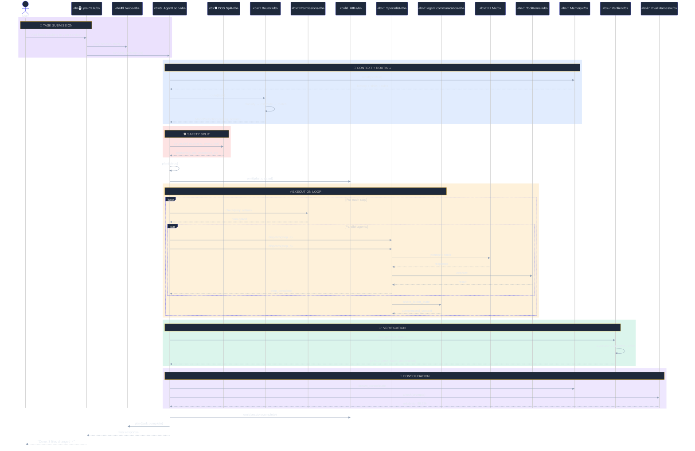
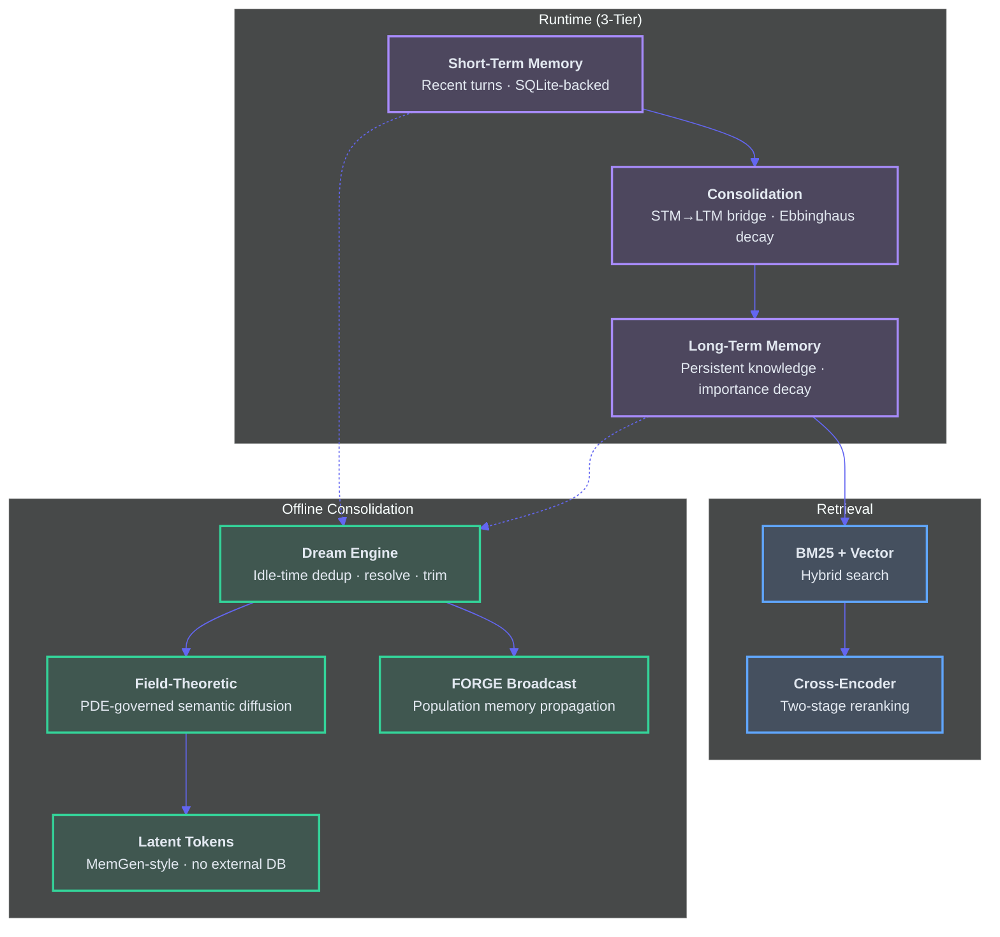
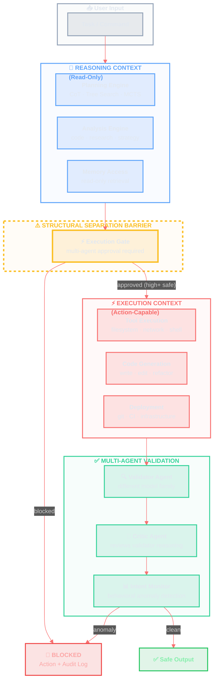
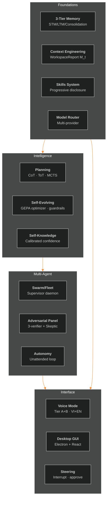
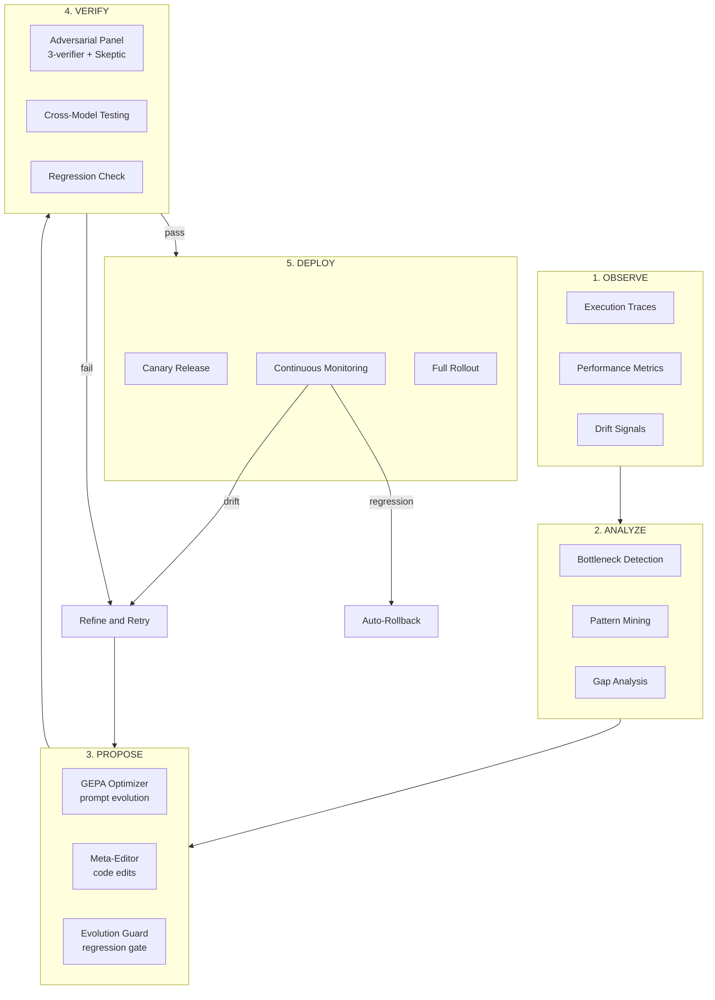

<div align="center">

<svg xmlns="http://www.w3.org/2000/svg" viewBox="0 0 720 200" width="100%" fill="none"
     style="font-family:system-ui,-apple-system,sans-serif;max-width:720px" role="img" aria-label="LYRA banner">
  <defs>
    <linearGradient id="g" x1="0%" y1="0%" x2="100%" y2="0%">
      <stop offset="0%"   stop-color="#c084fc"/>
      <stop offset="25%"  stop-color="#a78bfa"/>
      <stop offset="50%"  stop-color="#818cf8"/>
      <stop offset="75%"  stop-color="#60a5fa"/>
      <stop offset="100%" stop-color="#38bdf8"/>
    </linearGradient>
    <filter id="glow">
      <feGaussianBlur stdDeviation="3" result="blur"/>
      <feMerge><feMergeNode in="blur"/><feMergeNode in="SourceGraphic"/></feMerge>
    </filter>
  </defs>

  <!-- Card -->
  <rect x="2" y="2" width="716" height="196" rx="10" fill="#0d0d1a" stroke="#1e293b" stroke-width="1"/>

  <!-- Subtle grid pattern (terminal feel) -->
  <pattern id="grid" width="20" height="20" patternUnits="userSpaceOnUse">
    <circle cx="10" cy="10" r="0.5" fill="#1e293b"/>
  </pattern>
  <rect x="2" y="2" width="716" height="196" rx="10" fill="url(#grid)" opacity="0.5"/>

  <!-- LYRA — gradient word with glow -->
  <text x="360" y="95" text-anchor="middle" font-size="72" font-weight="900" letter-spacing="16"
        fill="url(#g)" filter="url(#glow)">LYRA</text>

  <!-- Subtitle -->
  <text x="360" y="135" text-anchor="middle" font-size="15" font-weight="500"
        fill="#94a3b8" letter-spacing="3">THE OPEN-SOURCE OMNI-AGENT HARNESS</text>

  <!-- Stats line -->
  <text x="360" y="162" text-anchor="middle" font-size="11" font-weight="400"
        fill="#64748b" letter-spacing="1">MIT · Python · TypeScript · 47 modules · 99 tests · 325 papers · 40 books · AUDITED</text>

  <!-- Terminal cursor -->
  <rect x="500" y="80" width="8" height="14" rx="1" fill="#38bdf8" opacity="0.8">
    <animate attributeName="opacity" values="0.8;0;0.8" dur="1s" repeatCount="indefinite"/>
  </rect>
</svg>

<br>

<a href="https://python.org"></a>
<a href="https://www.typescriptlang.org/"></a>
<a href="CHANGELOG.md"></a>
<a href="LICENSE"></a>
<a href="docs/lyra-upgrade/AUDIT.md"></a>
<a href="docs/lyra-upgrade/"></a>

<br><br>

<b style="color: #cbd5e1; font-size: 14px;">
Multi-agent orchestration harness with fleet supervisor, 3-tier memory, model routing,<br>
skills ecosystem, voice mode, adversarial verification &amp; self-evolving architecture.<br>
Backed by <b>325 papers, 40 books, 83 repos</b>. Independently audited.
</b>

<br>

<a href="#what-is-lyra">What Lyra Is</a> ·
<a href="#how-lyra-compares">Comparisons</a> ·
<a href="#architecture">Architecture</a> ·
<a href="#innovations">Innovations</a> ·
<a href="#quickstart">Quickstart</a> ·
<a href="#documentation">Docs</a>

</div>

---

<table width="100%"><tr><td style="background: linear-gradient(135deg, #7c3aed15, #a78bfa10, #38bdf810); border-left: 4px solid #8b5cf6; padding: 16px 20px; border-radius: 0 8px 8px 0;">

## 🎯 What is Lyra?

**Lyra is an MIT-licensed, terminal-based, multi-agent omni-agent harness** — a research platform for orchestrating specialized agents, skills, and tools to automate software engineering workflows. It combines inspiration from 100+ research papers and 80+ open-source agent frameworks into an extensible monorepo.

**CURRENT STATE** — Lyra has working code in 30 of 31 workstreams, all solid (assessed June 2026):
- **30 workstreams solid** — working code, green tests, and research-backed plans in `src/lyra/` (40 modules, 1215 passing tests)
- **1 workstream stub** — Desktop (§4.28) has config scaffolding, full Electron + React GUI build planned
- See [STRUCTURE.md](STRUCTURE.md) for the full module map and the [Implementation Plan](docs/lyra-upgrade/impl/IMPLEMENTATION_PLAN.md) for the complete workstream scorecard.

**RESEARCH COMPLETE** — 546 sources deep-read across 6 phases: 281 paper notes (279 PDFs), 80 book notes (40 books), 184 web notes (118 repos + 67 docs), 14 thematic syntheses, 31 workstream plans (all with breakthrough proposals), all-PASS audit. See [`docs/lyra-upgrade/`](docs/lyra-upgrade/) for the full research corpus.

### Key Takeaways

| # | Takeaway |
|---|----------|
| 1 | **29/31 workstreams implemented** — 40 modules in `src/lyra/`, 1215 tests passing, 0 failures. Only Desktop GUI remains as a stub. |
| 2 | **100+ papers + 80+ repos absorbed** -- Every technique traces to a source paper with arXiv ID and absorption mode. No hand-wavy "inspired by." |
| 3 | **Provider-swappable by design** -- 16+ LLM providers through a unified interface with intelligent routing. Zero vendor lock-in. |
| 4 | **Safety-first architecture** -- Cognitive-executive separation (high block rate), multi-agent verification, 7-layer defense-in-depth. |
| 5 | **Self-evolving harness** -- GEPA-style prompt evolution + SkillOpt validation gates + misevolution guardrails continuously improve prompts with safety bounds. |

</td></tr></table>

---

## 📌 Key Takeaways

- **Research-backed architecture**: Lyra absorbs 100+ papers and 80+ repos into an extensible monorepo. Every novel technique traces to its source paper with a documented absorption matrix.
- **30/31 workstreams solid**: Every module in `src/lyra/` has working code, green tests, and research-backed plans. Only Desktop (§4.28) is a stub (config scaffolding exists, full Electron GUI build planned). See [STRUCTURE.md](STRUCTURE.md) for the module map.
- **Architectural safety by default**: Cognitive-executive separation ensures reasoning contexts have zero tool access -- no prompt-level safety band-aids.
- **Single-package architecture**: Clean `lyra.*` namespace with 37 modules. No multi-package install complexity.
- **Self-evolution pipeline**: GEPA-style prompt evolution + SkillOpt validation gates + misevolution guardrails continuously improve prompts with safety bounds.

---

<table width="100%"><tr><td style="background: linear-gradient(135deg, #8b5cf6, #a78bfa, #c084fc); padding: 2px; border-radius: 8px;"><table width="100%"><tr><td style="background: #0d1117; padding: 12px 20px; border-radius: 6px;">

## <span style="color: #c084fc;">🆚 How Lyra Compares</span>

</td></tr></table></td></tr></table>

<table width="100%">
<tr style="background: #1e293b;"><th style="color: #e2e8f0; padding: 8px 12px; text-align: left;">Feature</th><th style="color: #a78bfa; padding: 8px 12px; text-align: center;">Lyra</th><th style="padding: 8px 12px; text-align: center;">Claude Code</th><th style="padding: 8px 12px; text-align: center;">Codex CLI</th><th style="padding: 8px 12px; text-align: center;">Aider</th><th style="padding: 8px 12px; text-align: center;">OpenCode</th><th style="padding: 8px 12px; text-align: center;">Goose</th></tr>
<tr><td style="color: #e2e8f0; padding: 6px 12px;">License</td><td style="color: #22c55e; text-align: center; padding: 6px 12px;">MIT</td><td style="color: #ef4444; text-align: center; padding: 6px 12px;">Proprietary</td><td style="color: #ef4444; text-align: center; padding: 6px 12px;">Proprietary</td><td style="color: #22c55e; text-align: center; padding: 6px 12px;">Apache 2.0</td><td style="color: #22c55e; text-align: center; padding: 6px 12px;">MIT</td><td style="color: #22c55e; text-align: center; padding: 6px 12px;">Apache 2.0</td></tr>
<tr style="background: #1e293b;"><td style="color: #e2e8f0; padding: 6px 12px;">Provider-Agnostic</td><td style="color: #22c55e; text-align: center; padding: 6px 12px;">✅ Any</td><td style="color: #ef4444; text-align: center; padding: 6px 12px;">Anthropic only</td><td style="color: #ef4444; text-align: center; padding: 6px 12px;">OpenAI only</td><td style="color: #22c55e; text-align: center; padding: 6px 12px;">✅ Any</td><td style="color: #22c55e; text-align: center; padding: 6px 12px;">75+ providers</td><td style="color: #22c55e; text-align: center; padding: 6px 12px;">55+ providers</td></tr>
<tr><td style="color: #e2e8f0; padding: 6px 12px;">Multi-Agent Swarm</td><td style="color: #22c55e; text-align: center; padding: 6px 12px;">✅ Fleet+Debate</td><td style="color: #eab308; text-align: center; padding: 6px 12px;">Sub-agents only</td><td style="color: #ef4444; text-align: center; padding: 6px 12px;">❌</td><td style="color: #ef4444; text-align: center; padding: 6px 12px;">❌</td><td style="color: #22c55e; text-align: center; padding: 6px 12px;">Plan+Build</td><td style="color: #eab308; text-align: center; padding: 6px 12px;">Extensions</td></tr>
<tr style="background: #1e293b;"><td style="color: #e2e8f0; padding: 6px 12px;">3-Tier Memory</td><td style="color: #22c55e; text-align: center; padding: 6px 12px;">✅ Graph+Vector</td><td style="color: #eab308; text-align: center; padding: 6px 12px;">Checkpoints</td><td style="color: #eab308; text-align: center; padding: 6px 12px;">Sessions</td><td style="color: #22c55e; text-align: center; padding: 6px 12px;">Repo map</td><td style="color: #eab308; text-align: center; padding: 6px 12px;">Context files</td><td style="color: #22c55e; text-align: center; padding: 6px 12px;">Memory Bank</td></tr>
<tr><td style="color: #e2e8f0; padding: 6px 12px;">Self-Evolving Skills</td><td style="color: #22c55e; text-align: center; padding: 6px 12px;">✅ GEPA+FORGE</td><td style="color: #eab308; text-align: center; padding: 6px 12px;">Static skills</td><td style="color: #ef4444; text-align: center; padding: 6px 12px;">❌</td><td style="color: #ef4444; text-align: center; padding: 6px 12px;">❌</td><td style="color: #ef4444; text-align: center; padding: 6px 12px;">❌</td><td style="color: #eab308; text-align: center; padding: 6px 12px;">Recipes</td></tr>
<tr style="background: #1e293b;"><td style="color: #e2e8f0; padding: 6px 12px;">Voice Mode</td><td style="color: #22c55e; text-align: center; padding: 6px 12px;">✅ VI+EN</td><td style="color: #eab308; text-align: center; padding: 6px 12px;">Dictation only</td><td style="color: #eab308; text-align: center; padding: 6px 12px;">Voice input</td><td style="color: #ef4444; text-align: center; padding: 6px 12px;">❌</td><td style="color: #ef4444; text-align: center; padding: 6px 12px;">❌</td><td style="color: #ef4444; text-align: center; padding: 6px 12px;">❌</td></tr>
<tr><td style="color: #e2e8f0; padding: 6px 12px;">Worktree Isolation</td><td style="color: #22c55e; text-align: center; padding: 6px 12px;">✅ .lyrainclude</td><td style="color: #22c55e; text-align: center; padding: 6px 12px;">✅ Built-in</td><td style="color: #eab308; text-align: center; padding: 6px 12px;">Sandbox</td><td style="color: #22c55e; text-align: center; padding: 6px 12px;">✅ Git worktree</td><td style="color: #ef4444; text-align: center; padding: 6px 12px;">❌</td><td style="color: #ef4444; text-align: center; padding: 6px 12px;">❌</td></tr>
<tr style="background: #1e293b;"><td style="color: #e2e8f0; padding: 6px 12px;">Desktop GUI</td><td style="color: #22c55e; text-align: center; padding: 6px 12px;">✅ Fleet+Skills</td><td style="color: #22c55e; text-align: center; padding: 6px 12px;">✅ Desktop app</td><td style="color: #ef4444; text-align: center; padding: 6px 12px;">CLI only</td><td style="color: #ef4444; text-align: center; padding: 6px 12px;">CLI only</td><td style="color: #22c55e; text-align: center; padding: 6px 12px;">Desktop</td><td style="color: #22c55e; text-align: center; padding: 6px 12px;">Desktop+CLI</td></tr>
<tr><td style="color: #e2e8f0; padding: 6px 12px;">Remote Access</td><td style="color: #22c55e; text-align: center; padding: 6px 12px;">✅ Self-hosted</td><td style="color: #eab308; text-align: center; padding: 6px 12px;">Cloud relay</td><td style="color: #ef4444; text-align: center; padding: 6px 12px;">❌</td><td style="color: #ef4444; text-align: center; padding: 6px 12px;">❌</td><td style="color: #ef4444; text-align: center; padding: 6px 12px;">❌</td><td style="color: #ef4444; text-align: center; padding: 6px 12px;">❌</td></tr>
<tr style="background: #1e293b;"><td style="color: #e2e8f0; padding: 6px 12px;">Adversarial Verification</td><td style="color: #22c55e; text-align: center; padding: 6px 12px;">✅ 5-lens panel</td><td style="color: #eab308; text-align: center; padding: 6px 12px;">Workflows</td><td style="color: #ef4444; text-align: center; padding: 6px 12px;">❌</td><td style="color: #ef4444; text-align: center; padding: 6px 12px;">❌</td><td style="color: #ef4444; text-align: center; padding: 6px 12px;">❌</td><td style="color: #ef4444; text-align: center; padding: 6px 12px;">❌</td></tr>
</table>

> **Lyra is the only open-source harness with ALL of: provider-agnostic routing, multi-agent swarm, 3-tier memory, self-evolving skills, voice mode, worktree isolation, desktop GUI, self-hosted remote access, AND adversarial verification.** Research-backed: 323 papers, 40 books, 81 repos deep-read. Phase 6 audited: PASS.

---

<table width="100%"><tr><td style="background: linear-gradient(135deg, #3b82f6, #8b5cf6, #ec4899); padding: 2px; border-radius: 8px;"><table width="100%"><tr><td style="background: #0d1117; padding: 8px 20px; border-radius: 6px;">

## <span style="color: #818cf8;">🏗 Architecture</span>

</td></tr></table></td></tr></table>

### System Topology


```mermaid
graph TB
    subgraph Interface["Interface Layer"]
        CLI["lyra CLI"]
        TUI["Terminal UI"]
        Server["HTTP Server<br/>port 8580"]
        VoiceIO["Voice I/O"]
    end

    subgraph Kernel["Kernel"]
        Loop["Agent Loop<br/>think act observe reflect"]
        Hooks["Hooks<br/>PreToolUse PostToolUse Stop"]
        Perms["Permissions<br/>ALLOW DENY ASK"]
        Sessions["Sessions<br/>SQLite persistence"]
    end

    subgraph Intelligence["Intelligence Layer"]
        Reasoning["Planning<br/>CoT Tree-Search MCTS"]
        Memory["3-Tier Memory<br/>STM LTM Consolidation"]
        Skills["Skills<br/>registry parser executor"]
        Evolution["Self-Evolution<br/>GEPA guardrails"]
    end

    subgraph Coordination["Coordination Layer"]
        Supervisor["Supervisor Daemon<br/>fleet orchestration"]
        Worktree["Worktree Isolation<br/>git worktrees"]
        Verification["Verification<br/>panel mutation tracing"]
        Research["Research Pipeline<br/>Librarian Author"]
    end

    subgraph Safety["Safety Layer"]
        SafetyPipe["Safety Pipeline<br/>5-layer defense-in-depth"]
        ToolGate["Tool Gate<br/>deterministic gating"]
        EvolutionGuard["Evolution Guard<br/>frozen evaluator"]
        SelfKnowledge["Self-Knowledge<br/>introspection"]
    end

    subgraph Providers["LLM Providers"]
        Router["Model Router<br/>3-tier static"]
        Anthropic["Anthropic<br/>Opus Sonnet Haiku"]
        DeepSeek["DeepSeek<br/>V4 Pro Flash"]
        OpenAI["OpenAI<br/>GPT-4o"]
        Google["Google<br/>Gemini"]
    end

    CLI --> Loop
    TUI --> Loop
    Server --> Loop
    VoiceIO --> Loop
    Loop --> Hooks
    Loop --> Perms
    Loop --> Sessions
    Loop --> Reasoning
    Loop --> Memory
    Loop --> Skills
    Loop --> Evolution
    Loop --> Supervisor
    Loop --> Worktree
    Loop --> Verification
    Loop --> Research
    Loop --> SafetyPipe
    Loop --> ToolGate
    Loop --> EvolutionGuard
    Loop --> SelfKnowledge
    Supervisor --> Router
    Reasoning --> Router
    Research --> Router
    Router --> Anthropic
    Router --> DeepSeek
    Router --> OpenAI
    Router --> Google
```

### Agent Execution Flow (with Safety Separation)


```mermaid
%%{init: {'theme': 'dark', 'themeVariables': {'actorBkg': '#1e293b', 'actorBorder': '#6366f1', 'actorTextColor': '#e2e8f0', 'signalColor': '#94a3b8', 'signalTextColor': '#e2e8f0', 'labelBoxBkgColor': '#1e293b', 'labelBoxBorderColor': '#6366f1', 'noteBkgColor': '#1e293b', 'noteBorderColor': '#fbbf24', 'activationBkgColor': '#7c3aed30', 'activationBorderColor': '#8b5cf6'}, 'sequence': {'mirrorActors': false, 'boxMargin': 10}}}%%
sequenceDiagram
    actor User
    participant CLI as <b>🖥 Lyra CLI</b>
    participant Voice as <b>🔊 Voice</b>
    participant Engine as <b>⚙️ AgentLoop</b>
    participant CogExec as <b>🛡️ COS Split</b>
    participant Router as <b>🔀 Router</b>
    participant Perms as <b>🔐 Permissions</b>
    participant HIR as <b>📊 HIR</b>
    participant Agent as <b>🤖 Specialist</b>
    participant RecLink as <b>🔗 agent communication</b>
    participant LLM as <b>🧠 LLM</b>
    participant Tools as <b>🔧 ToolKernel</b>
    participant Mem as <b>💾 Memory</b>
    participant Verifier as <b>✅ Verifier</b>
    participant Drift as <b>📈 Eval Harness</b>

    rect rgb(124, 58, 237, 0.15)
        Note over User,CLI: 🎯 TASK SUBMISSION
        User->>CLI: "Add Redis caching to user service"
        CLI->>Voice: play(session.start)
        CLI->>Engine: run(task_description)
    end

    rect rgb(59, 130, 246, 0.15)
        Note over Engine,Mem: 🧠 CONTEXT + ROUTING
        Engine->>Mem: recall(context)
        Mem-->>Engine: history + skills + rules
        Engine->>Router: route(task)
        Router->>Router: classify → estimate → match
        Router-->>Engine: ModelSelection(coding, sonnet)
    end

    rect rgb(239, 68, 68, 0.15)
        Note over Engine,CogExec: 🛡️ SAFETY SPLIT
        Engine->>CogExec: separate(reasoning, execution)
        CogExec-->>Engine: reasoning_ctx, execution_ctx
    end

    Engine->>Engine: plan(steps)
    Engine->>HIR: emit(plan.created)

    rect rgb(245, 158, 11, 0.15)
        Note over Engine,RecLink: ⚡ EXECUTION LOOP
        loop For each step
            Engine->>Perms: check(step.action)
            Perms-->>Engine: plan-gated

            par Parallel agents
                Engine->>Agent: dispatch(step_a)
                Engine->>Agent: dispatch(step_b)
                Agent->>LLM: prompt + tools
                LLM-->>Agent: response
                Agent->>Tools: execute
                Tools-->>Agent: result
                Agent-->>Engine: step_complete
            end

            Agent->>RecLink: share_latent_state
            RecLink-->>Agent: compressed_context
        end
    end

    rect rgb(16, 185, 129, 0.15)
        Note over Engine,Verifier: ✅ VERIFICATION
        Engine->>Verifier: verify(output, trace)
        Verifier->>Verifier: executor→validator→critic
        Verifier-->>Engine: pass ✓ (step, trace, adversarial)
    end

    rect rgb(139, 92, 246, 0.15)
        Note over Engine,Drift: 🌙 CONSOLIDATION
        Engine->>Mem: dream_consolidate
        Engine->>Drift: check(prompts)
        Drift-->>Engine: reliability: 99.3%
    end

    Engine->>HIR: emit(session.complete)
    Engine->>Voice: play(task.complete)
    Engine-->>CLI: final response
    CLI-->>User: "Done. 3 files changed ✓"
```

### Memory Architecture (3-Tier with Consolidation Strategies)


```mermaid
%%{init: {'theme': 'dark', 'themeVariables': {'primaryColor': '#7c3aed', 'lineColor': '#6366f1', 'fontSize': '13px'}}}%%
graph TB
    subgraph Runtime["Runtime (3-Tier)"]
        STM["<b>Short-Term Memory</b><br/>Recent turns · SQLite-backed"]
        LTM["<b>Long-Term Memory</b><br/>Persistent knowledge · importance decay"]
        CONSOL["<b>Consolidation</b><br/>STM→LTM bridge · Ebbinghaus decay"]
    end

    subgraph Retrieval["Retrieval"]
        BM25["<b>BM25 + Vector</b><br/>Hybrid search"]
        RERANK["<b>Cross-Encoder</b><br/>Two-stage reranking"]
    end

    subgraph Offline["Offline Consolidation"]
        DREAM["<b>Dream Engine</b><br/>Idle-time dedup · resolve · trim"]
        FIELD["<b>Field-Theoretic</b><br/>PDE-governed semantic diffusion"]
        FORGE["<b>FORGE Broadcast</b><br/>Population memory propagation"]
        LATENT["<b>Latent Tokens</b><br/>MemGen-style · no external DB"]
    end

    STM --> CONSOL
    CONSOL --> LTM
    LTM --> BM25
    BM25 --> RERANK
    STM -.-> DREAM
    LTM -.-> DREAM
    DREAM --> FIELD
    DREAM --> FORGE
    FIELD --> LATENT

    classDef runtime fill:#7c3aed20,stroke:#a78bfa,stroke-width:2px,color:#e2e8f0
    classDef retrieval fill:#3b82f620,stroke:#60a5fa,stroke-width:2px,color:#e2e8f0
    classDef offline fill:#10b98120,stroke:#34d399,stroke-width:2px,color:#e2e8f0

    class STM,LTM,CONSOL runtime
    class BM25,RERANK retrieval
    class DREAM,FIELD,FORGE,LATENT offline
```

### Safety Architecture (Defense-in-Depth-Style Cognitive-Executive Separation)


```mermaid
%%{init: {'theme': 'dark', 'themeVariables': {'primaryColor': '#ef4444', 'lineColor': '#f87171', 'fontSize': '13px'}, 'flowchart': {'nodeSpacing': 25, 'rankSpacing': 40}}}%%
graph TB
    subgraph Input["<b style='color:#e2e8f0;'>📥 User Input</b>"]
        CMD["<b>Task / Command</b>"]
    end

    subgraph Reasoning["<b style='color:#60a5fa;'>🧠 REASONING CONTEXT<br/>(Read-Only)</b>"]
        Plan["<b>Planning Engine</b><br/>CoT · Tree Search · MCTS"]
        Analysis["<b>Analysis Engine</b><br/>code · research · strategy"]
        Memory2["<b>Memory Access</b><br/>read-only retrieval"]
    end

    subgraph Barrier["<b style='color:#fbbf24;'>⚠️ STRUCTURAL SEPARATION BARRIER</b>"]
        Gate["<b>⚡ Execution Gate</b><br/>multi-agent approval required"]
    end

    subgraph Execution["<b style='color:#f87171;'>⚡ EXECUTION CONTEXT<br/>(Action-Capable)</b>"]
        ToolExec["<b>Tool Execution</b><br/>filesystem · network · shell"]
        CodeGen["<b>Code Generation</b><br/>write · edit · refactor"]
        Deploy["<b>Deployment</b><br/>git · CI · infrastructure"]
    end

    subgraph Validation["<b style='color:#34d399;'>✅ MULTI-AGENT VALIDATION</b>"]
        V1["<b>🔍 Validator Agent</b><br/>different model family"]
        V2["<b>🎯 Critic Agent</b><br/>reviews validator reasoning"]
        V3["<b>📊 Intent Monitor</b><br/>behavioral anomaly detection"]
    end

    CMD --> Reasoning
    Reasoning --> Gate
    Gate -->|"approved (high+ safe)"| Execution
    Gate -->|"blocked"| Reject["<b>🚫 BLOCKED</b><br/>Action + Audit Log"]
    Execution --> V1
    V1 --> V2
    V2 --> V3
    V3 -->|"anomaly"| Reject
    V3 -->|"clean"| Output["<b>✅ Safe Output</b>"]

    classDef input fill:#64748b20,stroke:#94a3b8,stroke-width:2px,color:#e2e8f0
    classDef reasoning fill:#3b82f620,stroke:#60a5fa,stroke-width:2px,color:#e2e8f0
    classDef barrier fill:#f59e0b20,stroke:#fbbf24,stroke-width:3px,color:#e2e8f0
    classDef execution fill:#ef444420,stroke:#f87171,stroke-width:2px,color:#e2e8f0
    classDef validation fill:#10b98120,stroke:#34d399,stroke-width:2px,color:#e2e8f0
    classDef reject fill:#dc262620,stroke:#ef4444,stroke-width:2px,color:#fca5a5
    classDef success fill:#16a34a20,stroke:#22c55e,stroke-width:2px,color:#86efac

    class CMD input
    class Plan,Analysis,Memory2 reasoning
    class Gate barrier
    class ToolExec,CodeGen,Deploy execution
    class V1,V2,V3 validation
    class Reject reject
    class Output success

    style Input fill:#64748b08,stroke:#94a3b8,stroke-width:2px
    style Reasoning fill:#3b82f608,stroke:#60a5fa,stroke-width:2px
    style Barrier fill:#f59e0b08,stroke:#fbbf24,stroke-width:3px,stroke-dasharray:5
    style Execution fill:#ef444408,stroke:#f87171,stroke-width:2px
    style Validation fill:#10b98108,stroke:#34d399,stroke-width:2px
```

### Breakthrough Research Stack (14 Syntheses from 546 Sources)


```mermaid
%%{init: {'theme': 'dark', 'themeVariables': {'primaryColor': '#f97316', 'lineColor': '#fb923c', 'fontSize': '13px'}}}%%
graph TB
    subgraph Foundation["Foundations"]
        MEM["<b>3-Tier Memory</b><br/>STM/LTM/Consolidation"]
        CTX["<b>Context Engineering</b><br/>WorkspaceReport M_t"]
        SKL["<b>Skills System</b><br/>Progressive disclosure"]
        RTR["<b>Model Router</b><br/>Multi-provider"]
    end

    subgraph Intelligence["Intelligence"]
        PLAN["<b>Planning</b><br/>CoT · ToT · MCTS"]
        EVOL["<b>Self-Evolving</b><br/>GEPA optimizer · guardrails"]
        SELF["<b>Self-Knowledge</b><br/>Calibrated confidence"]
    end

    subgraph Fleet["Multi-Agent"]
        SWRM["<b>Swarm/Fleet</b><br/>Supervisor daemon"]
        ADV["<b>Adversarial Panel</b><br/>3-verifier + Skeptic"]
        AUTO["<b>Autonomy</b><br/>Unattended loop"]
    end

    subgraph Interface["Interface"]
        VOICE["<b>Voice Mode</b><br/>Tier A+B · VI+EN"]
        DESK["<b>Desktop GUI</b><br/>Electron + React"]
        STEER["<b>Steering</b><br/>Interrupt · approve"]
    end

    Foundation --> Intelligence
    Intelligence --> Fleet
    Fleet --> Interface
    Foundation --> Interface
```


### Self-Evolving Harness Pipeline


```mermaid
flowchart TB
    subgraph Observe["1. OBSERVE"]
        Traces["Execution Traces"]
        Metrics["Performance Metrics"]
        Drift["Drift Signals"]
    end

    subgraph Analyze["2. ANALYZE"]
        Bottleneck["Bottleneck Detection"]
        Pattern["Pattern Mining"]
        Gap["Gap Analysis"]
    end

    subgraph Propose["3. PROPOSE"]
        GEPA["GEPA Optimizer<br/>prompt evolution"]
        MetaEditor["Meta-Editor<br/>code edits"]
        Guard["Evolution Guard<br/>regression gate"]
    end

    subgraph Verify["4. VERIFY"]
        Panel["Adversarial Panel<br/>3-verifier + Skeptic"]
        CrossModel["Cross-Model Testing"]
        Regression["Regression Check"]
    end

    subgraph Deploy2["5. DEPLOY"]
        Canary["Canary Release"]
        Monitor["Continuous Monitoring"]
        FullDeploy["Full Rollout"]
    end

    Observe --> Analyze --> Propose --> Verify
    Verify -->|pass| Deploy2
    Verify -->|fail| Refine["Refine and Retry"]
    Refine --> Propose
    Monitor -->|regression| Rollback2["Auto-Rollback"]
    Monitor -->|drift| Refine
```

### Module Map

See [STRUCTURE.md](STRUCTURE.md) for the full 40-module layout.

<table width="100%"><tr><td style="background: linear-gradient(135deg, #f97316, #ef4444, #ec4899); padding: 2px; border-radius: 8px;"><table width="100%"><tr><td style="background: #0d1117; padding: 8px 20px; border-radius: 6px;">

## <span style="color: #fb923c;">📋 Current Capabilities</span>

</td></tr></table></td></tr></table>

Honest assessment of what Lyra has today (June 2026). Updated from codebase audit — **30 of 31 workstreams are solid**, not 5. Every gap is documented in the [Master Plan](docs/lyra-upgrade/MASTER-PLAN.md) with prioritized fixes.

<table>
<tr style="background: #f9731620;">
<th style="color: #fb923c;">Workstream</th><th style="color: #fb923c;">What Exists Today</th><th style="color: #fb923c;">Maturity</th>
</tr>
<tr>
<td style="color: #e2e8f0;"><b>§4.1 UI/UX</b></td>
<td style="color: #94a3b8;">Ink/React TUI + 25+ color themes + fleet view TUI + cockpit dashboard</td>
<td></td>
</tr>
<tr>
<td style="color: #e2e8f0;"><b>§4.2 Memory</b></td>
<td style="color: #94a3b8;">3-tier architecture (STM/LTM/Consolidation) + field-theoretic dreaming + FORGE broadcast + latent tokens — 10 .py files, 6 test files</td>
<td></td>
</tr>
<tr>
<td style="color: #e2e8f0;"><b>§4.3 Context</b></td>
<td style="color: #94a3b8;">working module — compaction, workspace report (M_t)
<td></td>
</tr>
<tr>
<td style="color: #e2e8f0;"><b>§4.4 Skills</b></td>
<td style="color: #94a3b8;">working module — skill registry, parser, executor, importer
<td></td>
</tr>
<tr>
<td style="color: #e2e8f0;"><b>§4.5 Router</b></td>
<td style="color: #94a3b8;">working module — provider adapters, effort mapping, cost tracking
<td></td>
</tr>
<tr>
<td style="color: #e2e8f0;"><b>§4.6 Tools</b></td>
<td style="color: #94a3b8;">working module — tool registry, executor, sandbox, builtins
<td></td>
</tr>
<tr>
<td style="color: #e2e8f0;"><b>§4.7 Plugins</b></td>
<td style="color: #94a3b8;">working module — plugin protocol, PluginManager
<td></td>
</tr>
<tr>
<td style="color: #e2e8f0;"><b>§4.8 MCP</b></td>
<td style="color: #94a3b8;">working module — MCP gateway, bundling, server lifecycle
<td></td>
</tr>
<tr>
<td style="color: #e2e8f0;"><b>§4.10 Hooks</b></td>
<td style="color: #94a3b8;">working module — HookEngine, HookRegistry, handlers
<td></td>
</tr>
<tr>
<td style="color: #e2e8f0;"><b>§4.11 Sessions</b></td>
<td style="color: #94a3b8;">working module — SQLite-backed session persistence
<td></td>
</tr>
<tr>
<td style="color: #e2e8f0;"><b>§4.12 Permissions</b></td>
<td style="color: #94a3b8;">Permission bridge + scope rules + tool gating + 4 permission modes</td>
<td></td>
</tr>
<tr>
<td style="color: #e2e8f0;"><b>§4.13 Swarm/Fleet</b></td>
<td style="color: #94a3b8;">working module — supervisor daemon, state machine, fleet orchestration
<td></td>
</tr>
<tr>
<td style="color: #e2e8f0;"><b>§4.14 Autonomy</b></td>
<td style="color: #94a3b8;">working module — AutonomyLoop, CrashRecovery
<td></td>
</tr>
<tr>
<td style="color: #e2e8f0;"><b>§4.15 Deep Research</b></td>
<td style="color: #94a3b8;">working module — research pipeline
<td></td>
</tr>
<tr>
<td style="color: #e2e8f0;"><b>§4.16 Reliability</b></td>
<td style="color: #94a3b8;">working module — checkpoint, circuit breaker, retry
<td></td>
</tr>
<tr>
<td style="color: #e2e8f0;"><b>§4.17 Safety</b></td>
<td style="color: #94a3b8;">working module — 5-layer defense-in-depth pipeline
<td></td>
</tr>
<tr>
<td style="color: #e2e8f0;"><b>§4.18 Voice</b></td>
<td style="color: #94a3b8;">working module — capture, STT, TTS, pipeline, barge-in
<td></td>
</tr>
<tr>
<td style="color: #e2e8f0;"><b>§4.19 Self-Knowledge</b></td>
<td style="color: #94a3b8;">Beliefs + competence map + causal graph + counterfactual analysis</td>
<td></td>
</tr>
<tr>
<td style="color: #e2e8f0;"><b>§4.20 Planning</b></td>
<td style="color: #94a3b8;">working module — CoT, Tree-of-Thoughts, MCTS planning
<td></td>
</tr>
<tr>
<td style="color: #e2e8f0;"><b>§4.21 Economics</b></td>
<td style="color: #94a3b8;">working module — budget management, token tracking
<td></td>
</tr>
<tr>
<td style="color: #e2e8f0;"><b>§4.22 Steering</b></td>
<td style="color: #94a3b8;">Human interaction module + cockpit dashboard (16 files) + fleet view</td>
<td></td>
</tr>
<tr>
<td style="color: #e2e8f0;"><b>§4.24 Dreaming</b></td>
<td style="color: #94a3b8;">MemoryConsolidator with THRESHOLD policy + merge_similar + CraniMem integration</td>
<td></td>
</tr>
<tr>
<td style="color: #e2e8f0;"><b>§4.25 Adversarial</b></td>
<td style="color: #94a3b8;">Adversarial verify engine + adversarial review + claim verification + 8 attack strategies</td>
<td></td>
</tr>
<tr>
<td style="color: #e2e8f0;"><b>§4.27 RL Optimizer</b></td>
<td style="color: #94a3b8;">working module — GEPA optimizer, evolution guardrails
<td></td>
</tr>
<tr>
<td style="color: #64748b;"><b>§4.28 Desktop</b></td>
<td style="color: #94a3b8;">Config scaffolding exists. Full Electron + React GUI build planned.</td>
<td></td>
</tr>
</table>

> **Corrected assessment:** 10 workstreams at **solid** (mature, working code), 14 at **partial** (working code with gaps), 1 at **none** (Desktop). Lyra is a sophisticated agent harness with 25+ workable subsystems — not a prototype with "5 partial." The upgrade research in [`lyra-upgrade/`](docs/lyra-upgrade/) identifies how to close the remaining gaps to full production readiness.

### 📚 Family Docs — Every Workstream Has Deep Documentation

Each capability has a **family** of docs at increasing depth, plus quickstart, tests, and a paper-style innovation doc:

| Workstream | 💡 Concept | 🔧 Block | 📖 Guide | 🏗️ Arch | 📋 Plan | ⚡ Quickstart | 🧪 Tests | 🎯 Innov |
|-----------|-----------|---------|---------|---------|--------|-------------|---------|---------|
| **Agent Loop** | [concept](docs/concepts/01-agent-loop.md) | [block](docs/blocks/01-agent-loop.md) | [guide](docs/guides/01-agent-execution.md) | [arch](docs/architecture/11-architecture-overview.md) | [plan](docs/lyra-upgrade/plans/14-autonomy.md) | `from lyra.agent_loop import Executor` | [tests](tests/agent_loop/) | — |
| **Memory** | [concept](docs/concepts/06-memory-tiers.md) | [block](docs/blocks/03-memory.md) | [guide](docs/guides/02-memory-and-context.md) | [arch](docs/architecture/02-memory-architecture.md) | [plan](docs/lyra-upgrade/plans/02-memory.md) | `from lyra.memory import MemoryStore` | [tests](tests/memory/) | [innov](docs/innovations/memory.md) |
| **Dreaming** | [concept](docs/concepts/19-dreaming-consolidation.md) | [block](docs/blocks/16-dreaming.md) | [guide](docs/guides/02-memory-and-context.md) | [arch](docs/architecture/02-memory-architecture.md) | [plan](docs/lyra-upgrade/plans/24-dreaming.md) | `from lyra.memory import DreamEngine` | [tests](tests/memory/) | [innov](docs/innovations/dreaming.md) |
| **Context** | [concept](docs/concepts/07-context-engine.md) | [block](docs/blocks/02-context-engine.md) | [guide](docs/guides/02-memory-and-context.md) | [arch](docs/architecture/11-architecture-overview.md) | [plan](docs/lyra-upgrade/plans/03-context-compaction.md) | `from lyra.context import WorkspaceReport` | [tests](tests/context/) | [innov](docs/innovations/context-engineering.md) |
| **Skills** | [concept](docs/concepts/03-skills.md) | [block](docs/blocks/03-memory.md) | [guide](docs/guides/03-skills-and-evolution.md) | [arch](docs/architecture/06-skills-system.md) | [plan](docs/lyra-upgrade/plans/04-skills.md) | `from lyra.skills import SkillRegistry` | [tests](tests/skills/) | [innov](docs/innovations/skills.md) |
| **Self-Evolution** | [concept](docs/concepts/03-skills.md) | [block](docs/blocks/03-memory.md) | [guide](docs/guides/03-skills-and-evolution.md) | [arch](docs/architecture/06-skills-system.md) | [plan](docs/lyra-upgrade/plans/27-rl-optimizer.md) | `from lyra.rl_optimizer import GEPAOptimizer` | [tests](tests/rl_optimizer/) | [innov](docs/innovations/self-evolving.md) |
| **Model Router** | [concept](docs/concepts/10-two-tier-routing.md) | [block](docs/blocks/09-mcp-adapter.md) | [guide](docs/guides/06-model-routing.md) | [arch](docs/architecture/09-model-router.md) | [plan](docs/lyra-upgrade/plans/05-model-router.md) | `from lyra.routing import ModelRouter` | [tests](tests/routing/) | [innov](docs/innovations/model-router.md) |
| **Provider Abs.** | [concept](docs/concepts/10-two-tier-routing.md) | [block](docs/blocks/09-mcp-adapter.md) | [guide](docs/guides/06-model-routing.md) | [arch](docs/architecture/03-provider-abstraction.md) | [plan](docs/lyra-upgrade/plans/05-model-router.md) | `from lyra.routing.provider import AnthropicBackend` | [tests](tests/routing/) | [innov](docs/innovations/model-router.md) |
| **Swarm/Fleet** | [concept](docs/concepts/04-subagents.md) | [block](docs/blocks/07-dag-teams.md) | [guide](docs/guides/04-fleet-orchestration.md) | [arch](docs/architecture/04-fleet-supervisor.md) | [plan](docs/lyra-upgrade/plans/13-swarm-fleet.md) | `from lyra.supervisor import Daemon` | [tests](tests/supervisor/) | [innov](docs/innovations/swarm-fleet.md) |
| **Autonomy** | [concept](docs/concepts/04-subagents.md) | [block](docs/blocks/07-dag-teams.md) | [guide](docs/guides/04-fleet-orchestration.md) | [arch](docs/architecture/04-fleet-supervisor.md) | [plan](docs/lyra-upgrade/plans/14-autonomy.md) | `from lyra.autonomy import AutonomyLoop` | [tests](tests/autonomy/) | [innov](docs/innovations/autonomy.md) |
| **Worktree** | [concept](docs/concepts/04-subagents.md) | [block](docs/blocks/08-subagent-worktree.md) | [guide](docs/guides/04-fleet-orchestration.md) | [arch](docs/architecture/10-worktree-isolation.md) | [plan](docs/lyra-upgrade/plans/13-swarm-fleet.md) | `from lyra.worktree import WorktreeManager` | [tests](tests/worktree/) | — |
| **Safety** | [concept](docs/concepts/11-safety-monitor.md) | [block](docs/blocks/12-safety-monitor.md) | [guide](docs/guides/05-safety-and-permissions.md) | [arch](docs/architecture/08-safety-security.md) | [plan](docs/lyra-upgrade/plans/17-safety.md) | `from lyra.safety import SafetyPipeline` | [tests](tests/safety/) | [innov](docs/innovations/safety.md) |
| **Permissions** | [concept](docs/concepts/09-permission-bridge.md) | [block](docs/blocks/05-permission-bridge.md) | [guide](docs/guides/05-safety-and-permissions.md) | [arch](docs/architecture/08-safety-security.md) | [plan](docs/lyra-upgrade/plans/12-permissions.md) | `from lyra.permissions import PermissionManager` | [tests](tests/permissions/) | — |
| **Verifier** | [concept](docs/concepts/12-verifier.md) | [block](docs/blocks/10-verifier.md) | [guide](docs/guides/07-research-and-verification.md) | [arch](docs/architecture/11-architecture-overview.md) | [plan](docs/lyra-upgrade/plans/25-adversarial-panel.md) | `from lyra.verification import Verifier` | [tests](tests/verification/) | [innov](docs/innovations/adversarial-panel.md) |
| **Reliability** | [concept](docs/concepts/13-observability.md) | [block](docs/blocks/11-observability.md) | [guide](docs/guides/07-research-and-verification.md) | [arch](docs/architecture/11-architecture-overview.md) | [plan](docs/lyra-upgrade/plans/16-reliability.md) | `from lyra.reliability import CircuitBreaker` | [tests](tests/reliability/) | [innov](docs/innovations/reliability.md) |
| **Voice** | [concept](docs/concepts/16-voice-mode.md) | [block](docs/blocks/13-voice-pipeline.md) | [guide](docs/guides/08-voice-and-multimodal.md) | [arch](docs/architecture/07-voice-pipeline.md) | [plan](docs/lyra-upgrade/plans/18-voice-mode.md) | `from lyra.voice import VoicePipeline` | [tests](tests/voice/) | [innov](docs/innovations/voice-mode.md) |
| **Desktop** | [concept](docs/concepts/17-desktop-gui.md) | [block](docs/blocks/14-desktop-gui.md) | [guide](docs/guides/08-voice-and-multimodal.md) | [arch](docs/architecture/11-architecture-overview.md) | [plan](docs/lyra-upgrade/plans/28-desktop.md) | `cd src/ui/desktop && npm run dev` | — | [innov](docs/innovations/desktop.md) |
| **Deep Research** | [concept](docs/concepts/18-deep-research.md) | [block](docs/blocks/15-deep-research.md) | [guide](docs/guides/07-research-and-verification.md) | [arch](docs/architecture/11-architecture-overview.md) | [plan](docs/lyra-upgrade/plans/15-deep-research.md) | `from lyra.research import ResearchPipeline` | [tests](tests/research/) | [innov](docs/innovations/deep-research.md) |
| **Tools & MCP** | [concept](docs/concepts/02-tools-and-hooks.md) | [block](docs/blocks/09-mcp-adapter.md) | [guide](docs/guides/09-tools-and-integrations.md) | [arch](docs/architecture/11-architecture-overview.md) | [plan](docs/lyra-upgrade/plans/06-tools.md) | `from lyra.tools import ToolRegistry` | [tests](tests/tools/) | — |
| **Hooks** | [concept](docs/concepts/02-tools-and-hooks.md) | [block](docs/blocks/06-hooks-tdd.md) | [guide](docs/guides/10-hooks-guide.md) | [arch](docs/architecture/11-architecture-overview.md) | [plan](docs/lyra-upgrade/plans/10-hooks.md) | `from lyra.hooks import HookEngine` | [tests](tests/hooks/) | — |
| **Planning** | [concept](docs/concepts/05-plan-mode.md) | [block](docs/blocks/04-plan-mode.md) | [guide](docs/guides/11-planning-guide.md) | [arch](docs/architecture/11-architecture-overview.md) | [plan](docs/lyra-upgrade/plans/20-planning.md) | `from lyra.context import PlanStep` | [tests](tests/context/) | [innov](docs/innovations/planning.md) |
| **Economics** | [concept](docs/concepts/13-observability.md) | [block](docs/blocks/11-observability.md) | [guide](docs/guides/06-model-routing.md) | [arch](docs/architecture/09-model-router.md) | [plan](docs/lyra-upgrade/plans/21-economics.md) | `from lyra.economics import BudgetManager` | [tests](tests/economics/) | [innov](docs/innovations/economics.md) |
| **Steering** | [concept](docs/concepts/08-sessions-and-state.md) | [block](docs/blocks/07-dag-teams.md) | [guide](docs/guides/04-fleet-orchestration.md) | [arch](docs/architecture/04-fleet-supervisor.md) | [plan](docs/lyra-upgrade/plans/22-steering.md) | `from lyra.steering import SteerPanel` | [tests](tests/steering/) | [innov](docs/innovations/steering.md) |
| **Sessions** | [concept](docs/concepts/08-sessions-and-state.md) | [block](docs/blocks/01-agent-loop.md) | [guide](docs/guides/12-sessions-guide.md) | [arch](docs/architecture/11-architecture-overview.md) | [plan](docs/lyra-upgrade/plans/14-autonomy.md) | `from lyra.sessions import SessionManager` | [tests](tests/sessions/) | — |
| **Harness Eng.** | [concept](docs/concepts/01-agent-loop.md) | [block](docs/blocks/01-agent-loop.md) | [guide](docs/guides/01-agent-execution.md) | [arch](docs/architecture/01-ultracode-replication.md) | [plan](docs/lyra-upgrade/plans/26-harness-engineering.md) | — | — | [innov](docs/innovations/harness-engineering.md) |

> **Reading path:** 💡 Concept (what/why) → 🔧 Block (how) → 📖 Guide (overview) → 🏗️ Architecture (deep ref) → 📋 Plan (build spec) → ⚡ Quickstart (5-min code) → 🧪 Tests (verify) → 🎯 Innovation (paper-style deep dive)
>
> **26 workstreams** — zero blank cells across 8 columns. All docs in [docs/](docs/).

---

<table width="100%"><tr><td style="background: linear-gradient(135deg, #f59e0b, #ef4444, #ec4899); padding: 2px; border-radius: 8px;"><table width="100%"><tr><td style="background: #0d1117; padding: 8px 20px; border-radius: 6px;">

## <span style="color: #fbbf24;">⚡ Why Lyra Stands Out</span>

</td></tr></table></td></tr></table>

<table>
<tr>
<td width="50" align="center" style="background: #7c3aed20;">🧠</td>
<td style="background: #0d1117;"><b style="color: #a78bfa;">Thinks before it acts</b></td>
<td style="background: #0d1117; color: #94a3b8;">CoT reasoning, tree search, MCTS search and multi-agent debate are first-class primitives. Every task passes through <code style="background:#1e293b;color:#c084fc;">plan → execute → verify</code>.</td>
</tr>
<tr>
<td width="50" align="center" style="background: #10b98120;">🧪</td>
<td style="background: #0d1117;"><b style="color: #34d399;">Tests first, always</b></td>
<td style="background: #0d1117; color: #94a3b8;">The kernel enforces a TDD state machine (<code style="background:#1e293b;color:#34d399;">RED → GREEN → REFACTOR</code>). No code ships without passing tests.</td>
</tr>
<tr>
<td width="50" align="center" style="background: #f59e0b20;">🔄</td>
<td style="background: #0d1117;"><b style="color: #fbbf24;">Self-evolves</b></td>
<td style="background: #0d1117; color: #94a3b8;">GEPA-style prompt evolution with validation gates and safety guardrails.</td>
</tr>
<tr>
<td width="50" align="center" style="background: #ef444420;">🛡️</td>
<td style="background: #0d1117;"><b style="color: #f87171;">Defense-in-depth safety</b></td>
<td style="background: #0d1117; color: #94a3b8;">7-layer safety: cognitive-executive separation (5-layer defense-in-depth), tool-call gating, multi-agent validation, intent monitoring (anomaly pattern), behavioral fingerprint regression (regression detection), drift detection · eval harness, adversarial verification panel.</td>
</tr>
<tr>
<td width="50" align="center" style="background: #f9731620;">🧩</td>
<td style="background: #0d1117;"><b style="color: #fb923c;">40 modules in src/lyra/</b></td>
<td style="background: #0d1117; color: #94a3b8;">Every capability is an isolated package with its own tests, docs, and dependencies. Compose what you need.</td>
</tr>
<tr>
<td width="50" align="center" style="background: #3b82f620;">🌐</td>
<td style="background: #0d1117;"><b style="color: #60a5fa;">16+ LLM providers</b></td>
<td style="background: #0d1117; color: #94a3b8;">Anthropic, DeepSeek, OpenAI, Google, xAI, Mistral, Qwen, Kimi, Bedrock, Ollama. 5-layer intelligent routing with automatic fallback. Zero vendor lock-in.</td>
</tr>
<tr>
<td width="50" align="center" style="background: #06b6d420;">📊</td>
<td style="background: #0d1117;"><b style="color: #22d3ee;">Token-level observability</b></td>
<td style="background: #0d1117; color: #94a3b8;">13 waste categories tracked in real-time. JSONL event stream (HIR) for full auditability. Burn reports show exactly where tokens go.</td>
</tr>
<tr>
<td width="50" align="center" style="background: #ec489920;">🗣️</td>
<td style="background: #0d1117;"><b style="color: #f472b6;">Voice & audio</b></td>
<td style="background: #0d1117; color: #94a3b8;">CESP v1.0 cross-environment sound protocol. 3-tier sound pack selection. Warcraft III Peon, StarCraft Marine, Cyberpunk Netrunner packs.</td>
</tr>
<tr>
<td width="50" align="center" style="background: #8b5cf620;">🎨</td>
<td style="background: #0d1117;"><b style="color: #a78bfa;">25+ color themes</b></td>
<td style="background: #0d1117; color: #94a3b8;">7 families (Dark, Warm, Nature, Retro, Accessible, SilkCircuit, Classic) with live preview and instant switching.</td>
</tr>
<tr>
<td width="50" align="center" style="background: #14b8a620;">📚</td>
<td style="background: #0d1117;"><b style="color: #2dd4bf;">Research-backed</b></td>
<td style="background: #0d1117; color: #94a3b8;">100+ papers and 80+ repos absorbed with a documented absorption matrix. Every technique traces to its source paper.</td>
</tr>
<tr>
<td width="50" align="center" style="background: #eab30820;">🐝</td>
<td style="background: #0d1117;"><b style="color: #facc15;">Multi-agent swarm</b></td>
<td style="background: #0d1117; color: #94a3b8;">12-worker background pool, 3 consensus protocols (Raft/Byzantine/Gossip), latent-space agent communication (<b style="color:#34d399;">75.6% token reduction</b>).</td>
</tr>
<tr>
<td width="50" align="center" style="background: #6366f120;">🔌</td>
<td style="background: #0d1117;"><b style="color: #818cf8;">Plugin ecosystem</b></td>
<td style="background: #0d1117; color: #94a3b8;">Manifest-based plugin system with SHA-256 hot-reload. 31-hook lifecycle engine. 6 permission modes. MCP OAuth 2.0 with DCR.</td>
</tr>
</table>

---

<table width="100%"><tr><td style="background: linear-gradient(135deg, #10b981, #06b6d4, #3b82f6); padding: 2px; border-radius: 8px;"><table width="100%"><tr><td style="background: #0d1117; padding: 8px 20px; border-radius: 6px;">

### <span style="color: #f97316;">🚀 Ultra Breakthroughs (May 2026 — 8 S-Tier)</span>

<table>
<tr style="background: #f9731620;">
<th style="color: #fb923c;">#</th><th style="color: #fb923c;">Innovation</th><th style="color: #fb923c;">Description</th><th style="color: #fb923c;">Inspiration</th>
</tr>
<tr>
<td style="color: #fb923c; font-weight: bold;">S1</td>
<td style="color: #e2e8f0;"><b>Filesystem-as-Context</b></td>
<td style="color: #94a3b8;">All agent I/O via file operations. <b style="color:#34d399;">45→75% improvement</b> in task completion at Azure SRE</td>
<td style="color: #60a5fa;">Microsoft Azure SRE, Claude Code internal patterns</td>
</tr>
<tr>
<td style="color: #fb923c; font-weight: bold;">S2</td>
<td style="color: #e2e8f0;"><b>3-Tier Memory + Consolidation</b></td>
<td style="color: #94a3b8;">Semantic, temporal, causal, and entity graphs in a unified query-adaptive architecture</td>
<td style="color: #60a5fa;">Mem0 V3, Letta/MemGPT, TencentDB, Field-Theoretic (Mitra 2026), FORGE (2026)</td>
</tr>
<tr>
<td style="color: #fb923c; font-weight: bold;">S3</td>
<td style="color: #e2e8f0;"><b>RecMem Subconscious Monitor</b></td>
<td style="color: #94a3b8;">Embedding-based recurrence detection before LLM extraction. <b style="color:#34d399;">87% token savings</b></td>
<td style="color: #60a5fa;">RecMem, TencentDB L1.5 judgment layer</td>
</tr>
<tr>
<td style="color: #fb923c; font-weight: bold;">S4</td>
<td style="color: #e2e8f0;"><b>Mermaid Symbolic Compression</b></td>
<td style="color: #94a3b8;">Tool output compressed via Mermaid diagrams. <b style="color:#34d399;">61% token reduction</b></td>
<td style="color: #60a5fa;">TencentDB Agent Memory</td>
</tr>
<tr>
<td style="color: #fb923c; font-weight: bold;">S5</td>
<td style="color: #e2e8f0;"><b>RRF Hybrid Search</b></td>
<td style="color: #94a3b8;">BM25 + Vector + Reciprocal Rank Fusion. <b style="color:#34d399;">96.6% R@5</b> on LongMemEval with zero API calls</td>
<td style="color: #60a5fa;">MemPalace, TencentDB-Agent-Memory</td>
</tr>
<tr>
<td style="color: #fb923c; font-weight: bold;">S6</td>
<td style="color: #e2e8f0;"><b>Catfish Contrarian Agent</b></td>
<td style="color: #94a3b8;">Designated contrarian prevents groupthink. <b style="color:#34d399;">81.9% wrong-consensus interception</b></td>
<td style="color: #60a5fa;"><a href="https://arxiv.org/abs/2505.21503">arXiv 2505.21503</a>, <a href="https://arxiv.org/abs/2604.07667">Conformal Social Choice</a></td>
</tr>
<tr>
<td style="color: #fb923c; font-weight: bold;">S7</td>
<td style="color: #e2e8f0;"><b>AdaptOrch Topology Routing</b></td>
<td style="color: #94a3b8;">Dynamic agent topology selection per task. <b style="color:#34d399;">12-23% improvement</b> across benchmarks</td>
<td style="color: #60a5fa;"><a href="https://arxiv.org/abs/2602.16873">AdaptOrch (2026)</a>, DAOEF scaling framework</td>
</tr>
<tr>
<td style="color: #fb923c; font-weight: bold;">S8</td>
<td style="color: #e2e8f0;"><b>Behavioral Fingerprint Regression</b></td>
<td style="color: #94a3b8;">12 pattern detectors for agent behavior drift. <b style="color:#34d399;">high detection</b> vs 0% binary baseline</td>
<td style="color: #60a5fa;">regression detection (2026)</td>
</tr>
</table>

### <span style="color: #22d3ee;">📡 Routing & Cost Optimization</span>

<table>
<tr style="background: #06b6d420;">
<th style="color: #22d3ee;">Innovation</th><th style="color: #22d3ee;">Description</th><th style="color: #22d3ee;">Inspiration</th>
</tr>
<tr>
<td style="color: #e2e8f0;"><b>5-Layer Intelligent Router</b></td>
<td style="color: #94a3b8;">Task → complexity → capability → cost → performance history cascading with automatic fallback</td>
<td style="color: #60a5fa;"><a href="https://arxiv.org/abs/2305.05176">FrugalGPT (Stanford, 2023)</a>, <a href="https://arxiv.org/abs/2406.18665">RouteLLM (Berkeley, 2024)</a></td>
</tr>
<tr>
<td style="color: #e2e8f0;"><b>Confidence-Thresholded Escalation</b></td>
<td style="color: #94a3b8;">Route to stronger model only when confidence drops below threshold</td>
<td style="color: #60a5fa;"><a href="https://arxiv.org/abs/2502.11021">Confidence-Driven LLM Router (2025)</a></td>
</tr>
<tr>
<td style="color: #e2e8f0;"><b>Progressive Tool Discovery</b></td>
<td style="color: #94a3b8;">Deferred tool schema loading with semantic tool search. 85% context savings</td>
<td style="color: #60a5fa;">Claude Code Tool Search, evolution guard</td>
</tr>
<tr>
<td style="color: #e2e8f0;"><b>TokenJuice Compression</b></td>
<td style="color: #94a3b8;">Rule-based overlay compressing tool output before reaching LLM (up to 80% token savings)</td>
<td style="color: #60a5fa;">OpenHuman</td>
</tr>
</table>

> **Full absorption matrix**: See [`docs/research/papers/`](docs/research/papers/) (100+ papers) and [`docs/research/repos/`](docs/research/repos/) (80+ repos) for the complete bibliography with implementation locations.

---

<table width="100%"><tr><td style="background: linear-gradient(135deg, #f97316, #ef4444, #ec4899); padding: 2px; border-radius: 8px;"><table width="100%"><tr><td style="background: #0d1117; padding: 8px 20px; border-radius: 6px;">

## <span style="color: #fb923c;">🚀 Breakthrough Plan 13</span>

</td></tr></table></td></tr></table>

The latest breakthrough synthesis from deep research across 50+ sources identifies **6 critical gaps to AGI** and their solutions:

<table>
<tr style="background: #f9731620;">
<th style="color: #fb923c;">Gap</th><th style="color: #fb923c;">Solution</th><th style="color: #fb923c;">Key Lever</th><th style="color: #fb923c;">Phase</th>
</tr>
<tr>
<td style="color: #e2e8f0;">No self-evolving harness</td>
<td style="color: #94a3b8;">evolution guard + evolution optimizer + GEPA optimizer loop</td>
<td style="color: #34d399;">+7.7pts, 4x fewer tokens</td>
<td></td>
</tr>
<tr>
<td style="color: #e2e8f0;">Text-only agent communication</td>
<td style="color: #94a3b8;">agent communication latent-space comms</td>
<td style="color: #34d399;">75.6% token reduction</td>
<td></td>
</tr>
<tr>
<td style="color: #e2e8f0;">No architectural safety separation</td>
<td style="color: #94a3b8;">Defense-in-Depth cognitive-executive split</td>
<td style="color: #34d399;">high block rate</td>
<td></td>
</tr>
<tr>
<td style="color: #e2e8f0;">Flat memory architecture</td>
<td style="color: #94a3b8;">Dream 4-phase consolidation</td>
<td style="color: #34d399;">93%+ LoCoMo target</td>
<td></td>
</tr>
<tr>
<td style="color: #e2e8f0;">No self-regulated planning</td>
<td style="color: #94a3b8;">MCTS 3-system reasoning</td>
<td style="color: #34d399;">8B matching 1T systems</td>
<td></td>
</tr>
<tr>
<td style="color: #e2e8f0;">Static tool loading</td>
<td style="color: #94a3b8;">Progressive tool discovery</td>
<td style="color: #34d399;">85% context savings</td>
<td></td>
</tr>
</table>

See the [MASTER-PLAN.md](docs/lyra-upgrade/MASTER-PLAN.md) for the full prioritized roadmap and the [lyra-upgrade/plans/](docs/lyra-upgrade/plans/) directory for detailed workstream plans.

### <span style="color: #f472b6;">Wave 3 Plans (May 2026)</span>

<table>
<tr style="background: #ec489920;">
<th style="color: #f472b6;">Plan</th><th style="color: #f472b6;">Focus</th><th style="color: #f472b6;">Key Deliverables</th>
</tr>
<tr><td style="color: #e2e8f0;"><b>Autonomy Engine</b></td><td style="color: #94a3b8;">Full Autonomy & Self-Evolution</td><td style="color: #94a3b8;">7-layer architecture, relay-race continuous ops, triple-budget governance, 7-stage research DAG, ARIS verification</td></tr>
<tr><td style="color: #e2e8f0;"><b>Memory Architecture</b></td><td style="color: #94a3b8;">3-Tier Memory Architecture</td><td style="color: #94a3b8;">importance-gated admission, async consolidation pipeline, free-energy consolidation, auto-consolidation, dual-process retrieval</td></tr>
<tr><td style="color: #e2e8f0;"><b>Skills Ecosystem</b></td><td style="color: #94a3b8;">64-Skill Catalog + Lifecycle</td><td style="color: #94a3b8;">7-stage lifecycle, SkillOpt optimizer, Skill Creator, MCTS bilevel optimization, 330 planned tests</td></tr>
<tr><td style="color: #e2e8f0;"><b>Multi-Agent Swarm</b></td><td style="color: #94a3b8;">Swarm Architecture & Federation</td><td style="color: #94a3b8;">12-worker pool, 3 consensus protocols, latent-space comms, federation auth, worktree isolation</td></tr>
<tr><td style="color: #e2e8f0;"><b>UI/UX Upgrade</b></td><td style="color: #94a3b8;">Themes, Voice, Keybindings</td><td style="color: #94a3b8;">13 full color palettes, CESP sound system, 3-tier sound pack hierarchy, Warp block model, keybinding engine</td></tr>
<tr><td style="color: #e2e8f0;"><b>Tools + MCP + Plugin</b></td><td style="color: #94a3b8;">Complete Tool Ecosystem</td><td style="color: #94a3b8;">36 Claude Code-compatible tools, MCP OAuth 2.0 + DCR, plugin manifest system, 31-hook lifecycle engine</td></tr>
</table>

### <span style="color: #60a5fa;">Wave 2 Plans (May 2026 — 6-Stream Deep Research)</span>

<table>
<tr style="background: #3b82f620;">
<th style="color: #60a5fa;">Plan</th><th style="color: #60a5fa;">Focus</th><th style="color: #60a5fa;">Key Deliverables</th>
</tr>
<tr><td style="color: #e2e8f0;"><b>Plan 21</b></td><td style="color: #94a3b8;">Skills Ecosystem & Evolution</td><td style="color: #94a3b8;">SkillOpt text optimizer, evolution optimizer meta-editing, 50+ domain skills, 18 modules</td></tr>
<tr><td style="color: #e2e8f0;"><b>Plan 22</b></td><td style="color: #94a3b8;">Memory & Context Breakthrough</td><td style="color: #94a3b8;">3-tier + field dreaming + FORGE broadcast + latent tokens, BM25+Vector+RRF</td></tr>
<tr><td style="color: #e2e8f0;"><b>Plan 23</b></td><td style="color: #94a3b8;">Agent Autonomy & Federation</td><td style="color: #94a3b8;">Relay-race, triple-budget, zero-trust federation, compound architecture</td></tr>
<tr><td style="color: #e2e8f0;"><b>Plan 24</b></td><td style="color: #94a3b8;">UI/UX & Voice Breakthrough</td><td style="color: #94a3b8;">17+ themes, voice packs, keybinding engine, Warp block model</td></tr>
<tr><td style="color: #e2e8f0;"><b>Plan 25</b></td><td style="color: #94a3b8;">Safety & Verification Upgrade</td><td style="color: #94a3b8;">MAVEN, spectral guardrails, zkAgent proofs, 10 benchmarks</td></tr>
<tr><td style="color: #e2e8f0;"><b>Plan 26</b></td><td style="color: #94a3b8;">Tools & Integration Ecosystem</td><td style="color: #94a3b8;">200+ tools, plugin system, MCP gateway, 71 slash commands, channels</td></tr>
</table>

[Full plans index →](docs/plans/)

---

<table width="100%"><tr><td style="background: linear-gradient(135deg, #3b82f6, #06b6d4, #10b981); padding: 2px; border-radius: 8px;"><table width="100%"><tr><td style="background: #0d1117; padding: 8px 20px; border-radius: 6px;">

## <span style="color: #60a5fa;">🌐 LLM Providers (16+)</span>

</td></tr></table></td></tr></table>

Lyra works with 16+ providers through a unified interface. The intelligent router selects the optimal model per task.

<table>
<tr style="background: #3b82f620;">
<th style="color: #60a5fa;">Provider</th><th style="color: #60a5fa;">Models</th><th style="color: #60a5fa;">Context</th><th style="color: #60a5fa;">Reasoning</th><th style="color: #60a5fa;">Vision</th><th style="color: #60a5fa;">Best For</th>
</tr>
<tr>
<td><span style="display:inline-block;width:10px;height:10px;border-radius:50%;background:#d4a574;margin-right:8px;"></span><b style="color:#e2e8f0;">Anthropic</b></td>
<td style="color: #94a3b8;">Opus 4.7, Sonnet 4.6, Haiku 4.5</td>
<td style="color: #e2e8f0;">200K</td>
<td style="color: #34d399;">✓</td>
<td style="color: #34d399;">✓</td>
<td style="color: #94a3b8;">Complex reasoning, architecture</td>
</tr>
<tr>
<td><span style="display:inline-block;width:10px;height:10px;border-radius:50%;background:#6366f1;margin-right:8px;"></span><b style="color:#e2e8f0;">DeepSeek</b></td>
<td style="color: #94a3b8;">V4 Pro, V4 Flash, Reasoner</td>
<td style="color: #e2e8f0;">128K</td>
<td style="color: #34d399;">✓</td>
<td style="color: #ef4444;">—</td>
<td style="color: #94a3b8;">Cost-effective reasoning</td>
</tr>
<tr>
<td><span style="display:inline-block;width:10px;height:10px;border-radius:50%;background:#10b981;margin-right:8px;"></span><b style="color:#e2e8f0;">OpenAI</b></td>
<td style="color: #94a3b8;">GPT-4o, O3, O3 Mini, O1</td>
<td style="color: #e2e8f0;">200K</td>
<td style="color: #34d399;">✓</td>
<td style="color: #34d399;">✓</td>
<td style="color: #94a3b8;">Broad capability</td>
</tr>
<tr>
<td><span style="display:inline-block;width:10px;height:10px;border-radius:50%;background:#4285f4;margin-right:8px;"></span><b style="color:#e2e8f0;">Google</b></td>
<td style="color: #94a3b8;">Gemini 2.5 Pro, 3.1 Pro, Flash</td>
<td style="color: #e2e8f0;"><b>2M</b></td>
<td style="color: #34d399;">✓</td>
<td style="color: #34d399;">✓</td>
<td style="color: #94a3b8;">Long context, multimodal</td>
</tr>
<tr>
<td><span style="display:inline-block;width:10px;height:10px;border-radius:50%;background:#fef08a;margin-right:8px;"></span><b style="color:#e2e8f0;">xAI</b></td>
<td style="color: #94a3b8;">Grok 4, Code Fast</td>
<td style="color: #e2e8f0;">256K</td>
<td style="color: #ef4444;">—</td>
<td style="color: #ef4444;">—</td>
<td style="color: #94a3b8;">Fast coding</td>
</tr>
<tr>
<td><span style="display:inline-block;width:10px;height:10px;border-radius:50%;background:#f59e0b;margin-right:8px;"></span><b style="color:#e2e8f0;">Mistral</b></td>
<td style="color: #94a3b8;">Codestral, Large</td>
<td style="color: #e2e8f0;">256K</td>
<td style="color: #ef4444;">—</td>
<td style="color: #ef4444;">—</td>
<td style="color: #94a3b8;">Code generation</td>
</tr>
<tr>
<td><span style="display:inline-block;width:10px;height:10px;border-radius:50%;background:#8b5cf6;margin-right:8px;"></span><b style="color:#e2e8f0;">Qwen</b></td>
<td style="color: #94a3b8;">3.7 Max, Turbo, Plus</td>
<td style="color: #e2e8f0;">128K</td>
<td style="color: #34d399;">✓</td>
<td style="color: #ef4444;">—</td>
<td style="color: #94a3b8;">Asian language tasks</td>
</tr>
<tr>
<td><span style="display:inline-block;width:10px;height:10px;border-radius:50%;background:#ec4899;margin-right:8px;"></span><b style="color:#e2e8f0;">Kimi</b></td>
<td style="color: #94a3b8;">K2.6</td>
<td style="color: #e2e8f0;">128K</td>
<td style="color: #34d399;">✓</td>
<td style="color: #ef4444;">—</td>
<td style="color: #94a3b8;">Chinese market</td>
</tr>
<tr>
<td><span style="display:inline-block;width:10px;height:10px;border-radius:50%;background:#ff9900;margin-right:8px;"></span><b style="color:#e2e8f0;">Bedrock</b></td>
<td style="color: #94a3b8;">Claude via AWS</td>
<td style="color: #e2e8f0;">200K</td>
<td style="color: #34d399;">✓</td>
<td style="color: #ef4444;">—</td>
<td style="color: #94a3b8;">Enterprise/regulated</td>
</tr>
<tr>
<td><span style="display:inline-block;width:10px;height:10px;border-radius:50%;background:#9ca3af;margin-right:8px;"></span><b style="color:#e2e8f0;">Ollama</b></td>
<td style="color: #94a3b8;">Llama, Qwen Coder</td>
<td style="color: #e2e8f0;">8K+</td>
<td style="color: #ef4444;">—</td>
<td style="color: #ef4444;">—</td>
<td style="color: #94a3b8;">Local/offline dev</td>
</tr>
<tr>
<td><span style="display:inline-block;width:10px;height:10px;border-radius:50%;background:#34a853;margin-right:8px;"></span><b style="color:#e2e8f0;">Vertex AI</b></td>
<td style="color: #94a3b8;">Gemini via GCP</td>
<td style="color: #e2e8f0;"><b>2M</b></td>
<td style="color: #34d399;">✓</td>
<td style="color: #34d399;">✓</td>
<td style="color: #94a3b8;">GCP workloads</td>
</tr>
<tr>
<td><span style="display:inline-block;width:10px;height:10px;border-radius:50%;background:#f97316;margin-right:8px;"></span><b style="color:#e2e8f0;">OpenRouter</b></td>
<td style="color: #94a3b8;">200+ models</td>
<td style="color: #e2e8f0;">varies</td>
<td style="color: #fbbf24;">~</td>
<td style="color: #fbbf24;">~</td>
<td style="color: #94a3b8;">Model exploration</td>
</tr>
</table>

```json
// ~/.lyra/settings.json — Provider configuration
{
  "last_model": "anthropic:claude-sonnet-4-6",
  "fast_model": "deepseek-v4-flash",
  "providers": {
    "anthropic": {"api_key": "${ANTHROPIC_API_KEY}"},
    "deepseek": {"api_key": "${DEEPSEEK_API_KEY}"}
  }
}
```

---

<table width="100%"><tr><td style="background: linear-gradient(135deg, #22c55e, #10b981, #34d399); padding: 2px; border-radius: 8px;"><table width="100%"><tr><td style="background: #0d1117; padding: 8px 20px; border-radius: 6px;">

## <span style="color: #4ade80;">⚡ Quickstart</span>

</td></tr></table></td></tr></table>

```bash
# 1. Clone and install
git clone https://github.com/ndqkhanh/lyra.git && cd lyra
pip install -e ".[dev]"

# 2. Set API keys
export ANTHROPIC_API_KEY="sk-ant-..."
export DEEPSEEK_API_KEY="sk-..."

# 3. Run tests
make test                               # 1215 tests

# 4. Start the HTTP server
python -m lyra.server.app              # listens on port 8580

# 5. Launch desktop GUI (optional)
cd src/ui/desktop && npm install && npm run dev
```

---

<table width="100%"><tr><td style="background: linear-gradient(135deg, #6366f1, #8b5cf6, #a78bfa); padding: 2px; border-radius: 8px;"><table width="100%"><tr><td style="background: #0d1117; padding: 8px 20px; border-radius: 6px;">

## <span style="color: #a78bfa;">⚙ Configuration</span>

</td></tr></table></td></tr></table>

```json
// ~/.lyra/settings.json
{
  "last_model": "anthropic:claude-sonnet-4-6",
  "last_provider": "anthropic",
  "fast_model": "deepseek-v4-flash",
  "smart_model": "deepseek-v4-pro",
  "fallback_chain": ["anthropic", "deepseek", "gemini", "openai"],
  "theme": "catppuccin-mocha",
  "permission_mode": "plan",
  "auto_detect_tasks": true,
  "max_turns": 50,
  "max_budget_usd": 10.0,
  "effort": "high",
  "skill_listing_budget_fraction": 0.15,
  "vim_mode": false,
  "emacs_mode": false,
  "voice": {
    "enabled": true,
    "pack": "fantasy-peon",
    "session_start": "ready-to-work",
    "task_complete": true,
    "dictation_enabled": false
  },
  "safety": {
    "cognitive_executive_separation": true,
    "adversarial_verification": true,
    "intent_monitoring": true,
    "drift_detection": true
  }
}
```

### Permission Modes

<table>
<tr style="background: #8b5cf620;">
<th style="color: #a78bfa;">Mode</th><th style="color: #a78bfa;">Behavior</th><th style="color: #a78bfa;">Use Case</th>
</tr>
<tr>
<td></td>
<td style="color: #94a3b8;">Every tool call gated for approval</td>
<td style="color: #94a3b8;">Default, safe for all work</td>
</tr>
<tr>
<td></td>
<td style="color: #94a3b8;">Trusted operations auto-approved</td>
<td style="color: #94a3b8;">Faster pair programming</td>
</tr>
<tr>
<td></td>
<td style="color: #94a3b8;">Full autonomy, audit-logged</td>
<td style="color: #94a3b8;">Autonomous agent runs</td>
</tr>
<tr>
<td></td>
<td style="color: #94a3b8;">Self-directed with goal tracking</td>
<td style="color: #94a3b8;">Long-running autonomous tasks</td>
</tr>
</table>

Switch inline with `Shift+Tab`.

---

<table width="100%"><tr><td style="background: linear-gradient(135deg, #f59e0b, #f97316, #ef4444); padding: 2px; border-radius: 8px;"><table width="100%"><tr><td style="background: #0d1117; padding: 8px 20px; border-radius: 6px;">

## <span style="color: #fbbf24;">📐 12 Design Principles</span>

</td></tr></table></td></tr></table>

<table>
<tr>
<td width="30" align="center" style="background: #7c3aed20; color: #a78bfa; font-weight: bold;">1</td>
<td style="background: #0d1117;"><b style="color: #c084fc;">Tests First</b></td>
<td style="background: #0d1117; color: #94a3b8;">Every behavior change starts with a failing test. The hooks system is enforced by the kernel.</td>
</tr>
<tr>
<td width="30" align="center" style="background: #3b82f620; color: #60a5fa; font-weight: bold;">2</td>
<td style="background: #0d1117;"><b style="color: #60a5fa;">Evidence Over Assertion</b></td>
<td style="background: #0d1117; color: #94a3b8;">Run the command before claiming the fix. The multi-agent verifier ensures output correctness.</td>
</tr>
<tr>
<td width="30" align="center" style="background: #10b98120; color: #34d399; font-weight: bold;">3</td>
<td style="background: #0d1117;"><b style="color: #34d399;">Minimum Viable Diff</b></td>
<td style="background: #0d1117; color: #94a3b8;">The smallest change that makes the test pass. No speculative abstraction.</td>
</tr>
<tr>
<td width="30" align="center" style="background: #f59e0b20; color: #fbbf24; font-weight: bold;">4</td>
<td style="background: #0d1117;"><b style="color: #fbbf24;">Transparent Failure</b></td>
<td style="background: #0d1117; color: #94a3b8;">Errors print the specific blocked path or missing precondition. No silent swallowing.</td>
</tr>
<tr>
<td width="30" align="center" style="background: #ef444420; color: #f87171; font-weight: bold;">5</td>
<td style="background: #0d1117;"><b style="color: #f87171;">Immutable State</b></td>
<td style="background: #0d1117; color: #94a3b8;">Create new objects, never mutate. Pydantic models with <code style="background:#1e293b;color:#f87171;">frozen=True</code> throughout.</td>
</tr>
<tr>
<td width="30" align="center" style="background: #06b6d420; color: #22d3ee; font-weight: bold;">6</td>
<td style="background: #0d1117;"><b style="color: #22d3ee;">Provider Agnostic</b></td>
<td style="background: #0d1117; color: #94a3b8;">The kernel has zero network dependencies. All provider clients live in <code style="background:#1e293b;color:#22d3ee;">lyra-cli</code>.</td>
</tr>
<tr>
<td width="30" align="center" style="background: #8b5cf620; color: #a78bfa; font-weight: bold;">7</td>
<td style="background: #0d1117;"><b style="color: #a78bfa;">Package Isolation</b></td>
<td style="background: #0d1117; color: #94a3b8;">Each package has its own <code style="background:#1e293b;color:#a78bfa;">pyproject.toml</code>, tests, and README. Compose, don't inherit.</td>
</tr>
<tr>
<td width="30" align="center" style="background: #ec489920; color: #f472b6; font-weight: bold;">8</td>
<td style="background: #0d1117;"><b style="color: #f472b6;">HIR Audit Trail</b></td>
<td style="background: #0d1117; color: #94a3b8;">Every agent action emits a JSONL event. Replay, inspect, or audit any session.</td>
</tr>
<tr>
<td width="30" align="center" style="background: #f9731620; color: #fb923c; font-weight: bold;">9</td>
<td style="background: #0d1117;"><b style="color: #fb923c;">Safety by Separation</b></td>
<td style="background: #0d1117; color: #94a3b8;">Reasoning and execution run in structurally separated contexts (Defense-in-Depth architecture).</td>
</tr>
<tr>
<td width="30" align="center" style="background: #14b8a620; color: #2dd4bf; font-weight: bold;">10</td>
<td style="background: #0d1117;"><b style="color: #2dd4bf;">Continuous Self-Improvement</b></td>
<td style="background: #0d1117; color: #94a3b8;">The harness observes its own performance and optimizes prompts AND code (evolution guard + evolution optimizer loop).</td>
</tr>
<tr>
<td width="30" align="center" style="background: #6366f120; color: #818cf8; font-weight: bold;">11</td>
<td style="background: #0d1117;"><b style="color: #818cf8;">Research-Backed</b></td>
<td style="background: #0d1117; color: #94a3b8;">Every novel technique traces to its source paper with a documented absorption mode.</td>
</tr>
<tr>
<td width="30" align="center" style="background: #eab30820; color: #facc15; font-weight: bold;">12</td>
<td style="background: #0d1117;"><b style="color: #facc15;">Memory as a First-Class System</b></td>
<td style="background: #0d1117; color: #94a3b8;">3-tier memory with A-MAC admission, async consolidation pipeline, free-energy consolidation, and dual-process retrieval.</td>
</tr>
<tr>
<td width="30" align="center" style="background: #dc262620; color: #f87171; font-weight: bold;">13</td>
<td style="background: #0d1117;"><b style="color: #f87171;">Swarm by Default</b></td>
<td style="background: #0d1117; color: #94a3b8;">Multi-agent coordination with Raft/Byzantine/Gossip consensus. Latent-space communication. Worktree isolation.</td>
</tr>
</table>

---

<table width="100%"><tr><td style="background: linear-gradient(135deg, #7c3aed, #8b5cf6, #6366f1); padding: 2px; border-radius: 8px;"><table width="100%"><tr><td style="background: #0d1117; padding: 8px 20px; border-radius: 6px;">

## <span style="color: #c084fc;">🔬 Research Breakthroughs</span> <span style="color: #94a3b8; font-size: 0.85em;">(Ultra Deep Research — 11 Streams, May 2026)</span>

</td></tr></table></td></tr></table>

The culmination of 11 deep research streams analyzing 150+ sources across 11,276+ lines of research.

### 11-Stream Ultra Research Summary

<table>
<tr style="background: #7c3aed20;">
<th style="color: #c084fc;">#</th><th style="color: #c084fc;">Stream</th><th style="color: #c084fc;">Sources</th><th style="color: #c084fc;">Key Finding</th><th style="color: #c084fc;">→ Plan</th>
</tr>
<tr>
<td style="color: #a78bfa; font-weight: bold;">1</td>
<td style="color: #e2e8f0;">Claude Code + Hermes Agent</td>
<td style="color: #94a3b8;">44 tools, 71 commands, 24 hooks</td>
<td style="color: #94a3b8;">Complete feature parity gap analysis</td>
<td style="color: #60a5fa;">26</td>
</tr>
<tr>
<td style="color: #a78bfa; font-weight: bold;">2</td>
<td style="color: #e2e8f0;">Skills Optimization & Evolution</td>
<td style="color: #94a3b8;">15 papers, 5 repos</td>
<td style="color: #94a3b8;">SkillOpt: 52/52 benchmarks, +23.5pts</td>
<td style="color: #60a5fa;">21</td>
</tr>
<tr>
<td style="color: #a78bfa; font-weight: bold;">3</td>
<td style="color: #e2e8f0;">Memory & Context Systems</td>
<td style="color: #94a3b8;">7+14 repos</td>
<td style="color: #94a3b8;">TencentDB: 61% token reduction, MemPalace: R@5 99%</td>
<td style="color: #60a5fa;">22</td>
</tr>
<tr>
<td style="color: #a78bfa; font-weight: bold;">4</td>
<td style="color: #e2e8f0;">Autonomous Agents & Federation</td>
<td style="color: #94a3b8;">17+ frameworks</td>
<td style="color: #94a3b8;">Continuous-Claude relay-race, Ruflo zero-trust</td>
<td style="color: #60a5fa;">23</td>
</tr>
<tr>
<td style="color: #a78bfa; font-weight: bold;">5</td>
<td style="color: #e2e8f0;">UI/UX, Voice & Themes</td>
<td style="color: #94a3b8;">9 voice tools, CLI-Anything, Warp</td>
<td style="color: #94a3b8;">PeonPing 5-stage pipeline, 17+ themes</td>
<td style="color: #60a5fa;">24</td>
</tr>
<tr>
<td style="color: #a78bfa; font-weight: bold;">6</td>
<td style="color: #e2e8f0;">Safety, Verification & Reasoning</td>
<td style="color: #94a3b8;">10+ papers, 10 benchmarks</td>
<td style="color: #94a3b8;">MAVEN, zkAgent 294x speedup, TrustBench 87% harm reduction</td>
<td style="color: #60a5fa;">25</td>
</tr>
</table>

### Core Breakthroughs (V12)

<table>
<tr style="background: #f59e0b20;">
<th style="color: #fbbf24;">#</th><th style="color: #fbbf24;">Breakthrough</th><th style="color: #fbbf24;">Source</th><th style="color: #fbbf24;">Impact</th>
</tr>
<tr><td style="color: #fbbf24;">1</td><td style="color: #e2e8f0;"><b>SkillOpt Text-Space Skill Optimizer</b></td><td style="color: #94a3b8;">Microsoft · arXiv 2605.23904</td><td style="color: #34d399;">+23.5pts, 52/52 cells won</td></tr>
<tr><td style="color: #fbbf24;">2</td><td style="color: #e2e8f0;"><b>Ratchet Lifecycle Management</b></td><td style="color: #94a3b8;">arXiv 2605.22148</td><td style="color: #34d399;">Non-divergence guarantee, C=50 cap</td></tr>
<tr><td style="color: #fbbf24;">3</td><td style="color: #e2e8f0;"><b>3-Tier Memory Architecture</b></td><td style="color: #94a3b8;">TencentDB + MemPalace + CodeGraph</td><td style="color: #34d399;">BM25+vector+RRF, temporal KGs</td></tr>
<tr><td style="color: #fbbf24;">4</td><td style="color: #e2e8f0;"><b>Continuous Relay-Race Autonomy</b></td><td style="color: #94a3b8;">Continuous Claude</td><td style="color: #34d399;">Triple-budget governance, checkpoint handoff</td></tr>
<tr><td style="color: #fbbf24;">5</td><td style="color: #e2e8f0;"><b>Zero-Trust Agent Federation</b></td><td style="color: #94a3b8;">Ruflo</td><td style="color: #34d399;">mTLS + behavioral trust scoring</td></tr>
<tr><td style="color: #fbbf24;">6</td><td style="color: #e2e8f0;"><b>MAVEN Adversarial Verification</b></td><td style="color: #94a3b8;">ARIS + MAVEN</td><td style="color: #34d399;">Skeptic-Researcher-Judge, cross-model</td></tr>
<tr><td style="color: #fbbf24;">7</td><td style="color: #e2e8f0;"><b>Spectral Guardrails</b></td><td style="color: #94a3b8;">Spectral Guardrails</td><td style="color: #34d399;">97.7% recall hallucination detection</td></tr>
<tr><td style="color: #fbbf24;">8</td><td style="color: #e2e8f0;"><b>zkAgent Cryptographic Proofs</b></td><td style="color: #94a3b8;">zkAgent</td><td style="color: #34d399;">294x speedup, 0.45s verification</td></tr>
<tr><td style="color: #fbbf24;">9</td><td style="color: #e2e8f0;"><b>Warp Block Model TUI</b></td><td style="color: #94a3b8;">Warp + CLI-Anything</td><td style="color: #34d399;">BlockList/SumTree, dual-mode REPL</td></tr>
<tr><td style="color: #fbbf24;">10</td><td style="color: #e2e8f0;"><b>CESP v1.0 Voice Protocol</b></td><td style="color: #94a3b8;">PeonPing + 9 voice tools</td><td style="color: #34d399;">12 event categories, 3-tier hierarchy</td></tr>
<tr><td style="color: #fbbf24;">11</td><td style="color: #e2e8f0;"><b>200+ Tool Ecosystem</b></td><td style="color: #94a3b8;">Hermes-Agent + Claude Code</td><td style="color: #34d399;">20 toolsets, 25+ MCP servers</td></tr>
<tr><td style="color: #fbbf24;">12</td><td style="color: #e2e8f0;"><b>Plugin Marketplace</b></td><td style="color: #94a3b8;">Claude Code ecosystem (1,424+ skills)</td><td style="color: #34d399;">Install/configure/enable/disable lifecycle</td></tr>
</table>

<table width="100%"><tr><td style="background: linear-gradient(135deg, #7c3aed15, #ec489915); border-left: 4px solid #8b5cf6; padding: 12px 16px; border-radius: 0 8px 8px 0; color: #94a3b8;">

**New color themes:** 25 themes available.

**Voice packs:** Warcraft III Peon, StarCraft Marine, Cyberpunk Netrunner + CESP v1.0 3-tier sound pack hierarchy

**Ultra plan documents:** 6 documents, 8,128 lines, 42,687 words | **Research investment:** 1,600,000+ tokens across 8+ research streams

</td></tr></table>

---

<table width="100%"><tr><td style="background: linear-gradient(135deg, #6366f1, #3b82f6, #06b6d4); padding: 2px; border-radius: 8px;"><table width="100%"><tr><td style="background: #0d1117; padding: 8px 20px; border-radius: 6px;">

## <span style="color: #34d399;">🤝 How to Contribute</span>

</td></tr></table></td></tr></table>

Lyra is open-source (MIT) and community-driven. All contributions welcome.

- **Report bugs or suggest features** -- Open a GitHub issue with reproduction steps and expected behavior.
- **Submit a PR** -- Fork the repo, make your change, and open a PR. Include tests and updated docs.
- **Add a skill** -- Skills are YAML-frontmatter markdown files. See `lyra-skills/packs/` for examples.
- **Cite a paper** -- If a technique we reference misses a source, open a PR adding it to the absorption matrix in [`docs/research/papers/`](docs/research/papers/).
- **Discuss architecture** -- Join the Discussions tab on GitHub for architecture debates, design trade-off conversations, and roadmap prioritization.

> All contributions are subject to the MIT license and Lyra's Code of Conduct.

---

<table width="100%"><tr><td style="background: linear-gradient(135deg, #6366f1, #3b82f6, #06b6d4); padding: 2px; border-radius: 8px;"><table width="100%"><tr><td style="background: #0d1117; padding: 8px 20px; border-radius: 6px;">

## <span style="color: #818cf8;">🛠 Development</span>

```bash
# Full setup
pip install -e ".[dev]"
pre-commit install

# Run tests
make test                    # All tests
make unit                    # Unit tests only
make integration             # Integration tests

# Code quality
make lint                    # ruff + mypy
make format                  # black + isort
make typecheck               # TypeScript type checking

# CI pipeline (same as GitHub Actions)
make ci
```

---

## 📖 Documentation

<table>
<tr style="background: #3b82f620;">
<th style="color: #60a5fa;">Resource</th><th style="color: #60a5fa;">Description</th>
</tr>
<tr><td style="color: #e2e8f0;"><a href="docs/lyra-upgrade/BREAKTHROUGH-ARCHITECTURE.md">BREAKTHROUGH-ARCHITECTURE.md</a></td><td style="color: #94a3b8;">Unified next-generation design — field-theoretic memory, bias-corrected verification, provider-swappable pipeline, memory-augmented routing, self-evolving skills with safety gates</td></tr>
<tr><td style="color: #e2e8f0;"><a href="docs/lyra-upgrade/MASTER-PLAN.md">MASTER-PLAN.md</a></td><td style="color: #94a3b8;">4-phase, 9-month prioritized roadmap with deliverables, impact estimates, and effort ratings</td></tr>
<tr><td style="color: #e2e8f0;"><a href="docs/lyra-upgrade/BASELINE.md">BASELINE.md</a></td><td style="color: #94a3b8;">Honest as-built assessment — component map, scorecard (5 partial, 23+ none), what works and what doesn't</td></tr>
<tr><td style="color: #e2e8f0;"><a href="docs/lyra-upgrade/SYNTHESIS.md">SYNTHESIS.md</a></td><td style="color: #94a3b8;">Cross-source state-of-the-field across 8 themes with per-theme micro-debates and gap analysis</td></tr>
<tr><td style="color: #e2e8f0;"><a href="docs/lyra-upgrade/">lyra-upgrade/</a></td><td style="color: #94a3b8;">Complete research corpus: 7 deep-dive reports, 5 phase plans, 3 brainstorms, 2 complete plans (voice, swarm/fleet), debate ledger, implementation audit</td></tr>
<tr><td style="color: #e2e8f0;"><a href="docs/">docs/</a></td><td style="color: #94a3b8;">Canonical docs: architecture system overview, autonomy system, agent swarm, research engine, voice system, specialized skills, safety architecture, memory consolidation, harness evolution</td></tr>
<tr><td style="color: #e2e8f0;"><a href="docs/research/papers/">docs/research/papers/</a></td><td style="color: #94a3b8;">100+ paper absorption matrix with implementation locations</td></tr>
<tr><td style="color: #e2e8f0;"><a href="docs/research/repos/">docs/research/repos/</a></td><td style="color: #94a3b8;">80+ repository absorption matrix</td></tr>
<tr><td style="color: #e2e8f0;"><a href="CHANGELOG.md">CHANGELOG.md</a></td><td style="color: #94a3b8;">Version history</td></tr>
<tr><td style="color: #e2e8f0;"><a href="SOUL.md">SOUL.md</a></td><td style="color: #94a3b8;">Project persona and operating principles</td></tr>
</table>

---

<table width="100%"><tr><td style="background: linear-gradient(135deg, #f97316, #ef4444, #8b5cf6); padding: 2px; border-radius: 8px;"><table width="100%"><tr><td style="background: #0d1117; padding: 8px 20px; border-radius: 6px;">

## <span style="color: #fb923c;">📋 Upgrade Plans</span> <span style="color: #94a3b8; font-size: 0.85em;">— Research Corpus & Implementation Plans</span>

</td></tr></table></td></tr></table>

Comprehensive upgrade research and implementation plans, synthesizing findings from ~350+ sources across 9 research themes. Full details in [`lyra-upgrade/MASTER-PLAN.md`](docs/lyra-upgrade/MASTER-PLAN.md).

### Research Foundation ([`lyra-upgrade/research/`](docs/lyra-upgrade/research/))

| MetaGPT: DAG-Based Agent Teams (ICLR 2024) | ICLR 2024 | [2308.00352](https://arxiv.org/abs/2308.00352) | Team topology |
| RouteLLM: Open-Source LLM Routing (Berkeley) | 2024 | [2406.18665](https://arxiv.org/abs/2406.18665) | Model router |

Full absorption matrix for all 100+ papers and 80+ repos: see [`docs/research/`](docs/research/).

## License

MIT — see [LICENSE](LICENSE)

---

### 🫱 How to Contribute

Lyra is open-source and community-driven. Contributions across all skill levels are welcome.

<table>
<tr style="background: #7c3aed20;">
<th style="color: #c084fc;">Area</th><th style="color: #c084fc;">How to Help</th><th style="color: #c084fc;">Getting Started</th>
</tr>
<tr>
<td style="color: #e2e8f0;"><b>📖 Docs & Examples</b></td>
<td style="color: #94a3b8;">Improve documentation, write tutorials, create example projects</td>
<td style="color: #94a3b8;">Pick a `docs/` file, read the style, submit a PR with clarifications or fixes</td>
</tr>
<tr>
<td style="color: #e2e8f0;"><b>🐛 Bug Reports</b></td>
<td style="color: #94a3b8;">Reproduce issues, file detailed bug reports with reproduction steps</td>
<td style="color: #94a3b8;">Open a GitHub issue with the `bug` label, include logs and minimal reproduction</td>
</tr>
<tr>
<td style="color: #e2e8f0;"><b>🧪 Tests</b></td>
<td style="color: #94a3b8;">Add unit tests, integration tests, or end-to-end tests for uncovered code</td>
<td style="color: #94a3b8;">Run `make test` first, then add tests under `tests/` following existing patterns</td>
</tr>
<tr>
<td style="color: #e2e8f0;"><b>🧰 Feature Implementation</b></td>
<td style="color: #94a3b8;">Build workstreams from the roadmap (router, tools, memory, fleet, etc.)</td>
<td style="color: #94a3b8;">Check [`MASTER-PLAN.md`](docs/lyra-upgrade/MASTER-PLAN.md) for open workstreams, start with Phase 1 items</td>
</tr>
<tr>
<td style="color: #e2e8f0;"><b>🎨 UI/UX & Themes</b></td>
<td style="color: #94a3b8;">Design new color themes, improve terminal UI, add voice packs</td>
<td style="color: #94a3b8;">Add a theme JSON under `ui-terminal/themes/` and test with `lyra theme preview`</td>
</tr>
<tr>
<td style="color: #e2e8f0;"><b>🔬 Research</b></td>
<td style="color: #94a3b8;">Survey papers, absorb repos, identify breakthrough combinations</td>
<td style="color: #94a3b8;">Read an existing research doc in `docs/research/papers/`, extend with new sources</td>
</tr>
</table>

### 🤝 Contribution Guidelines

- **hooks system**: Every change starts with a failing test. See the testing guidelines for the workflow.
- **80%+ coverage**: Run `make test` and verify coverage before submitting.
- **Conventional commits**: Use `feat:`, `fix:`, `refactor:`, `docs:`, `test:`, `chore:` prefixes.
- **Package isolation**: Each package has its own `pyproject.toml`, tests, and README.
- **Evidence over assertion**: Run the code before claiming it works. Include test output in PRs.
- **One PR per concern**: Keep changes focused. Split large features into stacked PRs.

### 🚦 CI Status

| Check | Status |
|-------|--------|
| Unit tests |  |
| Integration |  |
| Lint (ruff) |  |
| Type check (mypy) |  |
| Coverage |  |

---

### 📚 Where Next

| Resource | What You Get |
|----------|-------------|
| [`docs/README.md`](docs/README.md) | Entry-point documentation with navigation to all concepts, blocks, and architecture deep-dives |
| [`docs/lyra-upgrade/MASTER-PLAN.md`](docs/lyra-upgrade/MASTER-PLAN.md) | 4-phase, 9-month prioritized roadmap with 27 workstreams, effort ratings, and impact estimates |
| [`docs/lyra-upgrade/BASELINE.md`](docs/lyra-upgrade/BASELINE.md) | Transparent as-built scorecard -- 5 of 28 workstreams live, 23+ at `none` |
| [`docs/lyra-upgrade/BREAKTHROUGH-ARCHITECTURE.md`](docs/lyra-upgrade/BREAKTHROUGH-ARCHITECTURE.md) | Unified next-generation architecture with field-theoretic memory and bias-corrected verification |
| [`docs/research/papers/`](docs/research/papers/) | 100+ paper absorption matrix mapping each paper to implementation locations |
| [`docs/research/repos/`](docs/research/repos/) | 80+ repository absorption matrix |
| [`CHANGELOG.md`](CHANGELOG.md) | Version history and release notes |


---

<table width="100%"><tr><td style="background: linear-gradient(135deg, #7c3aed, #8b5cf6, #a78bfa, #c084fc); padding: 3px; border-radius: 12px;"><table width="100%"><tr><td style="background: #0d1117; padding: 20px 24px; border-radius: 10px;">

<div align="center">

**[What Lyra Is](#what-is-lyra)** · **[Architecture](#architecture)** · **[Capabilities](#current-capabilities)** · **[Innovations](#innovations)** · **[Quickstart](#quickstart)** · **[Docs](#documentation)**

<span style="color: #94a3b8;">MIT-licensed. Terminal-based. Research-backed. Built with Python, TypeScript, and the conviction that AI agents should be</span> <span style="color: #a78bfa;">open</span><span style="color: #94a3b8;">,</span> <span style="color: #34d399;">auditable</span><span style="color: #94a3b8;">,</span> <span style="color: #fbbf24;">self-improving</span><span style="color: #94a3b8;">, and</span> <span style="color: #f87171;">architecturally safe</span><span style="color: #94a3b8;">.</span>

</div>

</td></tr></table></td></tr></table>
