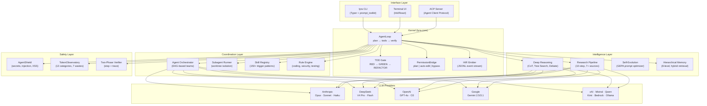

<h2 align="center">
  Lyra — Personal Superintelligent AI Research Agent
  <br><br>
  <p>
    <a href="https://python.org"></a>
    <a href="https://www.typescriptlang.org/"></a>
    <a href=""></a>
    <a href="LICENSE"></a>
    <a href="packages/"></a>
    <a href=".github/workflows/ci.yml"></a>
  </p>
</h2>

<p align="center">
  <b>Lyra combines multi-agent orchestration, deep reasoning, hierarchical memory, and a Claude Code-style terminal interface into one extensible toolkit. 135+ composable packages. 16+ LLM providers. Built for builders.</b>
</p>

<p align="center">
  <a href="#quickstart"><b>Quickstart</b></a> ·
  <a href="docs/architecture/"><b>Architecture</b></a> ·
  <a href="docs/CONTRIBUTING.md"><b>Contributing</b></a> ·
  <a href="CHANGELOG.md"><b>Changelog</b></a>
</p>

---

## What Lyra handles for you

Lyra isn't another chatbot or thin API wrapper. It's a production-grade agent platform that researches, codes, tests, reviews, and evolves — on its own or as your pair-programming teammate.

### 🧠 For AI/ML Engineers — a research partner that digs deep

- **Deep research** — 10-step pipeline crawls 7+ academic sources, traverses citations, and synthesizes findings into structured reports with verifiable provenance.
- **Hypothesis generation** — Multi-agent debate with CoT, tree search, and counterfactual reasoning surfaces non-obvious research directions.
- **Model routing** — Task-aware router picks the optimal model (Opus for architecture, Sonnet for coding, Haiku for triage) with automatic fallback chains across 16+ providers.
- **Prompt optimization** — GEPA self-evolution engine continuously improves prompts, strategies, and agent behaviors from execution history.

### ⚙️ For Engineering Teams — a dev teammate that ships with you

- **Code generation with TDD gate** — Kernel enforces RED → GREEN → REFACTOR. Every change starts with a failing test, ships with passing tests, and meets 80%+ coverage.
- **Multi-agent code review** — Specialist agents (code, test, review) work in parallel, orchestrated via DAG-based dependency graphs. Code review is not an afterthought — it's baked into the execution loop.
- **Bug triage from context** — Bug reports, stack traces, and Slack threads become scoped issues with root-cause analysis. Not a log dump — a readout with reproduction steps.
- **Release notes & changelogs** — Git history and merged PRs become changelog-ready notes, grouped by feature, fix, and refactor.

### 🔬 For Researchers & Analysts — a thinking partner that reads

- **Literature reviews** — Searches arXiv, Semantic Scholar, PubMed, and the open web. Cross-references citations, identifies consensus and controversy, flags methodological weaknesses.
- **Data synthesis** — Aggregates findings across papers, highlights contradictory evidence, and surfaces gaps in the literature.
- **Paper drafting** — Generated from research notes with proper citation formatting. You edit tone and argument, not reference hunting.
- **Continuous learning** — Drift detection triggers re-evaluation when upstream data or models change. Knowledge consolidates from short-term to long-term memory automatically.

### 🛡️ For Individual Developers — a pair-programming partner on demand

- **Interactive REPL** — Claude Code-style terminal interface with 25+ CLI commands, syntax highlighting, command palette, and model switching.
- **Project scaffolding** — Generates project skeletons from natural language descriptions, with tests, CI, and docs wired up.
- **Self-directed task decomposition** — "Add Redis caching to user service" becomes a plan → sub-tasks → parallel execution → verification — without hand-holding.
- **Context that persists** — 8-level hierarchical memory (sensory → episodic → semantic → procedural → strategic → meta → collective → eternal) with hybrid BM25+vector retrieval. No re-explaining.

---

## Architecture


```mermaid
graph TB
    subgraph Interface["Interface Layer"]
        CLI["lyra CLI<br/>(Typer + prompt_toolkit)"]
        TUI["Terminal UI<br/>(Ink/React)"]
        API["ACP Server<br/>(Agent Client Protocol)"]
    end

    subgraph Kernel["Kernel (lyra-core)"]
        Loop["AgentLoop<br/>plan → tools → verify"]
        TDD["TDD Gate<br/>RED → GREEN → REFACTOR"]
        Perms["PermissionBridge<br/>plan | auto-edit | bypass"]
        HIR["HIR Emitter<br/>(JSONL event stream)"]
    end

    subgraph Intelligence["Intelligence Layer"]
        Reasoning["Deep Reasoning<br/>(CoT, Tree Search, Debate)"]
        Research["Research Pipeline<br/>(10-step, 7+ sources)"]
        Evolution["Self-Evolution<br/>(GEPA prompt optimizer)"]
        Memory["Hierarchical Memory<br/>(8-level, hybrid retrieval)"]
    end

    subgraph Coordination["Coordination Layer"]
        Orchestrator["Agent Orchestrator<br/>(DAG-based teams)"]
        Subagents["Subagent Runner<br/>(worktree isolation)"]
        Skills["Skill Registry<br/>(150+ trigger patterns)"]
        Rules["Rule Engine<br/>(coding, security, testing)"]
    end

    subgraph Safety["Safety Layer"]
        Shield["AgentShield<br/>(secrets, injection, XSS)"]
        Observatory["TokenObservatory<br/>(13 categories, 7 wastes)"]
        Verifier["Two-Phase Verifier<br/>(step + trace)"]
    end

    subgraph Providers["LLM Providers"]
        Anthro["Anthropic<br/>Opus · Sonnet · Haiku"]
        DS["DeepSeek<br/>V4 Pro · Flash"]
        OAI["OpenAI<br/>GPT-4o · O3"]
        Gemini["Google<br/>Gemini 2.5/3.1"]
        Others["xAI · Mistral · Qwen<br/>Kimi · Bedrock · Ollama"]
    end

    CLI --> Loop
    TUI --> Loop
    API --> Loop
    Loop --> TDD
    Loop --> Perms
    Loop --> HIR
    Loop --> Reasoning
    Loop --> Research
    Loop --> Memory
    Loop --> Orchestrator
    Loop --> Subagents
    Loop --> Skills
    Loop --> Rules
    Loop --> Shield
    Loop --> Observatory
    Loop --> Verifier
    Orchestrator --> Anthro & DS & OAI & Gemini & Others
    Reasoning --> Anthro & DS & OAI & Gemini & Others
    Research --> Anthro & DS & OAI & Gemini & Others
```

## Why Lyra is different

| | |
|---|---|
| 🧠 **Thinks before it acts** | CoT reasoning, tree search, and multi-agent debate are first-class primitives — not afterthought prompts. Every task passes through plan → execute → verify. |
| 🧪 **Tests first, always** | The kernel enforces a TDD state machine. No code ships without passing tests. The two-phase verifier checks step-level and trace-level correctness independently. |
| 🔄 **Self-evolves** | GEPA prompt optimizer continuously learns from execution history. Strategies that work are reinforced; patterns that fail are pruned. Meta-evolution discovers new strategies from scratch. |
| 🧩 **135+ composable packages** | Every capability is an isolated package with its own tests, docs, and dependencies. Compose what you need — don't pay for what you don't. |
| 🌐 **16+ LLM providers** | Anthropic, DeepSeek, OpenAI, Google, xAI, Mistral, Qwen, Kimi, Bedrock, Ollama. Task-aware routing with automatic fallback chains. Zero vendor lock-in. |
| 🔒 **Defense-in-depth security** | Five-layer AgentShield (secrets, injection, XSS, SQLi, path traversal). Granular permission modes. Every tool call is gated. |
| 📊 **Token-level observability** | 13 waste categories tracked in real-time. Burn reports show exactly where tokens go — cache misses, over-prompting, redundant context. |

## Works with 16+ LLM providers

| Provider | Models | Context | Reasoning | Vision | Tools | Best For |
|----------|--------|---------|-----------|--------|-------|----------|
| **Anthropic** | Opus 4.7, Sonnet 4.6, Haiku 4.5 | 200K | ✓ | ✓ | ✓ | Complex reasoning, coding |
| **DeepSeek** | V4 Pro, V4 Flash, Reasoner, Chat | 128K | ✓ | — | ✓ | Cost-effective reasoning |
| **OpenAI** | GPT-4o, O3, O3 Mini, O1 | 200K | ✓ | ✓ | ✓ | Broad capability |
| **Google** | Gemini 2.5 Pro, 3.1 Pro, Flash | 2M | ✓ | ✓ | ✓ | Long context, multimodal |
| **xAI** | Grok 4, Code Fast | 256K | — | — | ✓ | Fast coding tasks |
| **Mistral** | Codestral, Large | 256K | — | — | ✓ | Code generation |
| **Qwen** | 3.7 Max, Turbo, Plus | 128K | ✓ | — | ✓ | Asian language tasks |
| **Kimi** | K2.6 | 128K | ✓ | — | ✓ | Chinese market |
| **Bedrock** | Claude via AWS | 200K | ✓ | — | ✓ | Enterprise/regulated |
| **Ollama** | Llama, Qwen Coder | 8K+ | — | — | ✓ | Local/offline dev |

## Your data stays yours

- **Granular permissions** — Three modes: `plan` (every tool call gated), `auto-edit` (trusted operations auto-approved), `bypass-perms` (full autonomy, audit-logged). Switch inline with `Shift+Tab`.
- **Worktree isolation** — Subagents run in isolated git worktrees. Changes are reviewed before merging back. No cross-contamination.
- **Fully auditable** — HIR (Human-Interpretable Representation) emits every agent action as a JSONL event stream. Replay, inspect, or audit any session.
- **Open source** — This repo. Inspect, fork, or self-host. MIT licensed.

## Package Catalog

Lyra is a monorepo of 135+ composable packages across three tiers:

| Tier | Packages | Highlights |
|------|----------|------------|
| **Foundation** | `lyra-core`, `lyra-cli`, `lyra-agents`, `lyra-orchestration`, `lyra-memory`, `lyra-skills`, `lyra-evals`, `lyra-mcp` | AgentLoop kernel, 25+ CLI commands, 8-level memory, 150+ skill triggers |
| **Breakthrough** | `lyra-reasoning`, `lyra-research`, `lyra-evolution`, `lyra-cognitive`, `lyra-continual`, `lyra-personalization`, `lyra-router`, `lyra-streaming`, `lyra-cost` | Deep reasoning, 10-step research, GEPA optimizer, model router, burn reports |
| **AGI Ascent** | `lyra-verification`, `lyra-world-model`, `lyra-meta-evolution`, `lyra-rsi`, `lyra-colony`, `lyra-gossip-memory`, `lyra-auto-mode`, `lyra-constitutional` | Multi-level verify, causal graphs, recursive self-improvement, constitutional AI |
| **UI** | `ui-core`, `ui-terminal`, `ui-transport` | Zustand state store, Ink TUI, WebSocket + SSE transport |

> See [`packages/`](packages/) for all 135+ packages. Each has its own README, tests, and pyproject.toml.

## Quickstart

```bash
# 1. Clone and install
git clone https://github.com/lyra-ai/lyra.git && cd lyra

# 2. Install Python dependencies
pip install -e ".[dev]"

# 3. Install TypeScript dependencies (for TUI)
npm install && npm run build --workspaces

# 4. Set at least one API key
export ANTHROPIC_API_KEY="sk-ant-..."
export DEEPSEEK_API_KEY="sk-..."

# 5. Launch the interactive REPL
lyra

# Or with the TypeScript TUI
lyra --tui
```

## CLI Commands

```bash
# Interactive REPL (default)
lyra                                    # Start interactive session
lyra --model deepseek-v4-pro            # With specific model
lyra --continue                         # Resume last session

# Single-shot commands
lyra run "Add Redis caching to user service"
lyra plan "Design rate limiting strategy"
lyra investigate "Memory leak in worker process"

# Session management
lyra session list                       # List all sessions
lyra session show <id>                  # Show session details
lyra retro                              # Session retrospective

# Model management
lyra model list                         # List configured models
lyra model set anthropic:sonnet         # Switch default model

# Health & diagnostics
lyra doctor                             # System health check
lyra status                             # Runtime status
lyra burn                               # Token usage report

# Skills & memory
lyra skill list                         # List available skills
lyra memory search "deployment process" # Search memory

# Development
lyra evals                              # Run evaluation harness
lyra evolve                             # Run prompt evolution
```

## Configuration

```json
// ~/.lyra/settings.json
{
  "last_model": "anthropic:claude-sonnet-4-6",
  "last_provider": "anthropic",
  "fast_model": "deepseek-v4-flash",
  "smart_model": "deepseek-v4-pro",
  "fallback_chain": ["anthropic", "deepseek", "gemini", "openai"],
  "theme": "dracula",
  "permission_mode": "plan",
  "auto_detect_tasks": true,
  "max_turns": 50,
  "max_budget_usd": 10.0,
  "effort": "high"
}
```

## Key Design Principles

1. **Tests First** — Every behavior change starts with a failing test. The TDD gate (`RED → GREEN → REFACTOR`) is enforced by the kernel.
2. **Evidence Over Assertion** — Run the command before claiming the fix. The two-phase verifier ensures output correctness.
3. **Minimum Viable Diff** — The smallest change that makes the test pass. No speculative abstraction.
4. **Transparent Failure** — Errors print the specific blocked path or missing precondition. No silent swallowing.
5. **Immutable State** — Create new objects, never mutate. Pydantic models with `frozen=True` throughout.
6. **Provider Agnostic** — The kernel has zero network dependencies. All provider clients live in `lyra-cli`.
7. **Package Isolation** — Each package has its own `pyproject.toml`, tests, and README. Compose, don't inherit.

## Development

```bash
# Full setup
pip install -e ".[dev]"
pre-commit install

# Run tests
make test                    # All tests
make unit                    # Unit tests only
make integration             # Integration tests

# Code quality
make lint                    # ruff + mypy
make format                  # black + isort
make typecheck               # TypeScript type checking

# CI pipeline (same as GitHub Actions)
make ci
```

## Contribute

Lyra is open source under MIT. PRs, issues, and skill contributions are welcome.

See [`CONTRIBUTING.md`](docs/CONTRIBUTING.md) for developer setup, conventions, and the PR process.

---

## License

MIT — see [LICENSE](LICENSE)

---

<div align="center">

**[Quickstart](#quickstart)** · **[Architecture](docs/architecture/)** · **[Contributing](docs/CONTRIBUTING.md)** · **[Changelog](CHANGELOG.md)** · **[Examples](EXAMPLES.md)**

Built with Python, TypeScript, and ambition.

</div>
