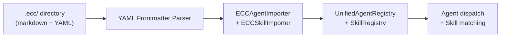

# Lyra + ECC Integration

Lyra integrates capabilities from the Everything Claude Code (ECC) ecosystem through a unified agent and skill import system.

## What's Integrated

| System | Source | Via |
|--------|--------|-----|
| **Agent definitions** | ECC `.md` agents | `src/agents/ecc_importer.py` → `UnifiedAgentRegistry` |
| **Skill definitions** | ECC `SKILL.md` files | `src/skills/importer.py` → `SkillRegistry` |
| **Rules** | ECC rule files | `src/rules/rule_parser.py` → `RuleRegistry` |
| **Hooks** | ECC hook patterns | `src/hooks/hook_registry.py` → `HookEngine` |

## Import Flow



## Usage

```python
from src.agents import ECCAgentImporter, UnifiedAgentRegistry

registry = UnifiedAgentRegistry()
importer = ECCAgentImporter(registry)

# Import all ECC agents
result = importer.import_all()
print(f"Imported: {result.imported} | Skipped: {result.skipped}")

# Dispatch best agent for a task
agent = registry.dispatch(task_type="code_review", language="python")
```

## Agent Sources

The registry tracks agents from both native Lyra (`AgentSource.LYRA`) and ECC (`AgentSource.ECC`) with priority scores, success rates, and capability indices for optimal dispatch.

---

See the [main README](README.md) for the full architecture, [EXAMPLES.md](EXAMPLES.md) for code examples, and [ARCHITECTURE.md](ARCHITECTURE.md) for system design.
