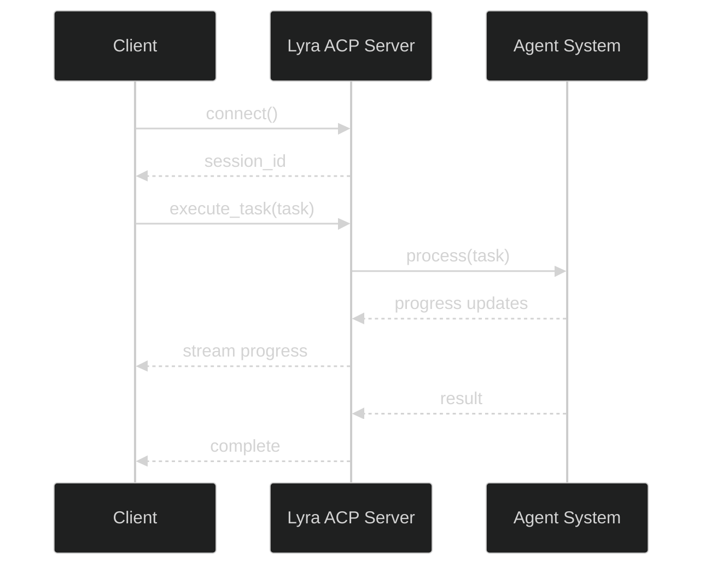

# Lyra API Documentation

> **Complete API reference for programmatic usage of Lyra**

## Table of Contents

- [Python API](#python-api)
- [REST API](#rest-api)
- [Agent Client Protocol (ACP)](#agent-client-protocol-acp)
- [MCP Integration](#mcp-integration)
- [WebSocket API](#websocket-api)
- [Plugin API](#plugin-api)

---

## Python API

### Core Agent Loop

```python
from lyra_core import AgentLoop, Task, Context

# Create agent loop
loop = AgentLoop(
    model="anthropic:claude-sonnet-4-6",
    permission_mode="plan",
    max_turns=50
)

# Execute task
task = Task(
    description="Add logging to user service",
    context=Context(
        working_dir="/path/to/project",
        files=["src/user_service.py"]
    )
)

result = loop.execute(task)
print(f"Success: {result.success}")
print(f"Files changed: {result.files_changed}")
```

### Memory System

```python
from lyra_memory import MemorySystem, MemoryQuery

# Initialize memory
memory = MemorySystem(storage_path="~/.lyra/memory")

# Store memory
memory.store(
    content="User authentication uses JWT tokens",
    layer="semantic",
    tags=["auth", "jwt"]
)

# Query memory
query = MemoryQuery(
    text="authentication implementation",
    layers=["semantic", "procedural"],
    limit=5
)
results = memory.search(query)

for result in results:
    print(f"Score: {result.score}")
    print(f"Content: {result.content}")
```

### Skills System

```python
from lyra_skills import SkillRegistry, Skill

# Load skills
registry = SkillRegistry()
registry.load_all()

# Get skill
skill = registry.get("python-testing")

# Execute skill
result = skill.execute(
    context={"language": "python", "framework": "pytest"}
)
```

### Model Router

```python
from lyra_router import ModelRouter, TaskClassification

# Initialize router
router = ModelRouter(
    providers=["anthropic", "deepseek", "openai"],
    fallback_chain=["anthropic", "deepseek", "gemini"]
)

# Route task
classification = TaskClassification(
    task_type="coding",
    complexity=7,
    requires_reasoning=True,
    requires_vision=False
)

model = router.route(classification)
print(f"Selected: {model.provider}:{model.name}")
```

### Agent Teams

```python
from lyra_orchestration import TeamOrchestrator, TeamConfig

# Create team
team = TeamOrchestrator(
    config=TeamConfig(
        roles=["pm", "architect", "engineer", "tester", "reviewer"],
        topology="dag",
        communication="latent"  # Use RecursiveLink
    )
)

# Execute with team
result = team.execute(
    task="Refactor authentication system",
    max_iterations=10
)
```

### Safety Systems

```python
from lyra_safety import CognitiveExecutiveSplit, AgentShield

# Initialize safety
cog_exec = CognitiveExecutiveSplit()
shield = AgentShield()

# Separate contexts
reasoning_ctx, execution_ctx = cog_exec.separate(task)

# Validate action
validation = shield.validate(
    action=execution_ctx.action,
    context=execution_ctx
)

if not validation.safe:
    print(f"Blocked: {validation.reason}")
```

---

## REST API

### Starting the Server

```bash
# Start API server
lyra serve --port 8000 --host 0.0.0.0

# With authentication
lyra serve --auth-token "your-secret-token"
```

### Authentication

```bash
# All requests require Bearer token
curl -H "Authorization: Bearer your-secret-token" \
  http://localhost:8000/api/v1/tasks
```

### Endpoints

#### POST /api/v1/tasks

Execute a task.

**Request:**
```json
{
  "description": "Add logging to user service",
  "context": {
    "working_dir": "/path/to/project",
    "files": ["src/user_service.py"]
  },
  "model": "anthropic:claude-sonnet-4-6",
  "permission_mode": "plan",
  "max_turns": 50
}
```

**Response:**
```json
{
  "task_id": "task_abc123",
  "status": "running",
  "created_at": "2026-05-28T10:00:00Z"
}
```

#### GET /api/v1/tasks/{task_id}

Get task status.

**Response:**
```json
{
  "task_id": "task_abc123",
  "status": "complete",
  "success": true,
  "files_changed": 3,
  "result": {
    "summary": "Added logging to user service",
    "changes": [
      {
        "file": "src/user_service.py",
        "lines_added": 15,
        "lines_removed": 2
      }
    ]
  },
  "completed_at": "2026-05-28T10:05:00Z"
}
```

#### GET /api/v1/tasks/{task_id}/stream

Stream task progress (SSE).

**Response:**
```
event: progress
data: {"step": "planning", "message": "Creating implementation plan"}

event: progress
data: {"step": "executing", "message": "Writing code"}

event: complete
data: {"success": true, "files_changed": 3}
```

#### POST /api/v1/memory/search

Search memory.

**Request:**
```json
{
  "query": "authentication implementation",
  "layers": ["semantic", "procedural"],
  "limit": 5
}
```

**Response:**
```json
{
  "results": [
    {
      "score": 0.95,
      "content": "User authentication uses JWT tokens",
      "layer": "semantic",
      "tags": ["auth", "jwt"]
    }
  ]
}
```

#### GET /api/v1/skills

List available skills.

**Response:**
```json
{
  "skills": [
    {
      "id": "python-testing",
      "name": "Python Testing",
      "description": "Write comprehensive Python tests",
      "tags": ["python", "testing", "pytest"]
    }
  ]
}
```

#### GET /api/v1/models

List available models.

**Response:**
```json
{
  "models": [
    {
      "provider": "anthropic",
      "name": "claude-sonnet-4-6",
      "context_window": 200000,
      "supports_reasoning": true,
      "supports_vision": true
    }
  ]
}
```

---

## Agent Client Protocol (ACP)

### Protocol Overview

ACP is a JSON-RPC 2.0 protocol for agent communication.



### Connection

```python
import asyncio
import websockets
import json

async def connect():
    uri = "ws://localhost:8000/acp"
    async with websockets.connect(uri) as websocket:
        # Send auth
        await websocket.send(json.dumps({
            "jsonrpc": "2.0",
            "method": "auth",
            "params": {"token": "your-token"},
            "id": 1
        }))
        
        response = await websocket.recv()
        print(f"Connected: {response}")
```

### Execute Task

```python
async def execute_task(websocket):
    # Send task
    await websocket.send(json.dumps({
        "jsonrpc": "2.0",
        "method": "execute_task",
        "params": {
            "description": "Add logging to user service",
            "context": {
                "working_dir": "/path/to/project"
            }
        },
        "id": 2
    }))
    
    # Receive progress
    async for message in websocket:
        data = json.loads(message)
        if data.get("method") == "progress":
            print(f"Progress: {data['params']['message']}")
        elif data.get("result"):
            print(f"Complete: {data['result']}")
            break
```

### Methods

#### execute_task

Execute a task.

**Request:**
```json
{
  "jsonrpc": "2.0",
  "method": "execute_task",
  "params": {
    "description": "Add logging to user service",
    "context": {"working_dir": "/path/to/project"}
  },
  "id": 2
}
```

**Response:**
```json
{
  "jsonrpc": "2.0",
  "result": {
    "task_id": "task_abc123",
    "status": "running"
  },
  "id": 2
}
```

#### get_task_status

Get task status.

**Request:**
```json
{
  "jsonrpc": "2.0",
  "method": "get_task_status",
  "params": {"task_id": "task_abc123"},
  "id": 3
}
```

#### cancel_task

Cancel a running task.

**Request:**
```json
{
  "jsonrpc": "2.0",
  "method": "cancel_task",
  "params": {"task_id": "task_abc123"},
  "id": 4
}
```

---

## MCP Integration

### MCP Server

Lyra exposes an MCP server for integration with other tools.

```bash
# Start MCP server
lyra mcp serve --port 3000

# With OAuth 2.0
lyra mcp serve --oauth --client-id "..." --client-secret "..."
```

### MCP Tools

#### execute_task

Execute a task through MCP.

```json
{
  "name": "execute_task",
  "description": "Execute a development task",
  "inputSchema": {
    "type": "object",
    "properties": {
      "description": {"type": "string"},
      "context": {"type": "object"}
    },
    "required": ["description"]
  }
}
```

#### search_memory

Search Lyra's memory.

```json
{
  "name": "search_memory",
  "description": "Search agent memory",
  "inputSchema": {
    "type": "object",
    "properties": {
      "query": {"type": "string"},
      "limit": {"type": "number"}
    },
    "required": ["query"]
  }
}
```

#### list_skills

List available skills.

```json
{
  "name": "list_skills",
  "description": "List available skills",
  "inputSchema": {
    "type": "object",
    "properties": {
      "category": {"type": "string"}
    }
  }
}
```

### MCP Resources

#### session://current

Current session information.

```json
{
  "uri": "session://current",
  "name": "Current Session",
  "mimeType": "application/json"
}
```

#### memory://search?q={query}

Memory search results.

```json
{
  "uri": "memory://search?q=authentication",
  "name": "Memory Search Results",
  "mimeType": "application/json"
}
```

---

## WebSocket API

### Connection

```javascript
const ws = new WebSocket('ws://localhost:8000/ws');

ws.onopen = () => {
  console.log('Connected');
  
  // Authenticate
  ws.send(JSON.stringify({
    type: 'auth',
    token: 'your-token'
  }));
};

ws.onmessage = (event) => {
  const data = JSON.parse(event.data);
  console.log('Received:', data);
};
```

### Message Types

#### task.execute

Execute a task.

```javascript
ws.send(JSON.stringify({
  type: 'task.execute',
  data: {
    description: 'Add logging to user service',
    context: {
      working_dir: '/path/to/project'
    }
  }
}));
```

#### task.progress

Task progress update (server → client).

```javascript
{
  type: 'task.progress',
  data: {
    task_id: 'task_abc123',
    step: 'executing',
    message: 'Writing code',
    progress: 0.5
  }
}
```

#### task.complete

Task completion (server → client).

```javascript
{
  type: 'task.complete',
  data: {
    task_id: 'task_abc123',
    success: true,
    files_changed: 3,
    result: {
      summary: 'Added logging to user service'
    }
  }
}
```

---

## Plugin API

### Plugin Structure

```python
from lyra_core.plugins import Plugin, PluginManifest

class MyPlugin(Plugin):
    """Custom plugin implementation."""
    
    manifest = PluginManifest(
        name="my-plugin",
        version="1.0.0",
        description="My awesome plugin",
        author="Your Name"
    )
    
    def on_load(self):
        """Called when plugin is loaded."""
        self.register_hook("pre_tool_use", self.pre_tool_use)
        self.register_tool("my_tool", self.my_tool)
    
    def pre_tool_use(self, context):
        """Hook before tool execution."""
        print(f"Tool: {context.tool_name}")
        return context
    
    def my_tool(self, **kwargs):
        """Custom tool implementation."""
        return {"result": "success"}
```

### Hook Events

Available hook events:

- `pre_tool_use` — Before tool execution
- `post_tool_use` — After tool execution
- `pre_llm_call` — Before LLM request
- `post_llm_call` — After LLM response
- `session_start` — Session begins
- `session_end` — Session ends
- `task_start` — Task begins
- `task_complete` — Task completes
- `error` — Error occurs

### Tool Registration

```python
from lyra_core.tools import Tool, ToolResult

class MyTool(Tool):
    """Custom tool."""
    
    name = "my_tool"
    description = "Does something useful"
    
    schema = {
        "type": "object",
        "properties": {
            "input": {"type": "string"}
        },
        "required": ["input"]
    }
    
    def execute(self, input: str) -> ToolResult:
        """Execute tool logic."""
        result = self.process(input)
        return ToolResult(
            success=True,
            data=result
        )
```

---

## SDK Examples

### Python SDK

```python
from lyra import Lyra

# Initialize client
lyra = Lyra(
    api_key="your-api-key",
    base_url="http://localhost:8000"
)

# Execute task
task = lyra.tasks.create(
    description="Add logging to user service",
    context={"working_dir": "/path/to/project"}
)

# Wait for completion
result = task.wait()
print(f"Success: {result.success}")

# Stream progress
for update in task.stream():
    print(f"Progress: {update.message}")
```

### JavaScript SDK

```javascript
import { Lyra } from '@lyra-ai/sdk';

// Initialize client
const lyra = new Lyra({
  apiKey: 'your-api-key',
  baseUrl: 'http://localhost:8000'
});

// Execute task
const task = await lyra.tasks.create({
  description: 'Add logging to user service',
  context: { workingDir: '/path/to/project' }
});

// Wait for completion
const result = await task.wait();
console.log('Success:', result.success);

// Stream progress
for await (const update of task.stream()) {
  console.log('Progress:', update.message);
}
```

---

## Error Handling

### Error Codes

| Code | Description |
|------|-------------|
| `400` | Bad Request — Invalid parameters |
| `401` | Unauthorized — Invalid or missing token |
| `403` | Forbidden — Insufficient permissions |
| `404` | Not Found — Resource doesn't exist |
| `429` | Too Many Requests — Rate limit exceeded |
| `500` | Internal Server Error — Server error |
| `503` | Service Unavailable — Server overloaded |

### Error Response

```json
{
  "error": {
    "code": "invalid_request",
    "message": "Invalid task description",
    "details": {
      "field": "description",
      "reason": "Description cannot be empty"
    }
  }
}
```

### Retry Strategy

```python
import time
from lyra import Lyra, LyraError

def execute_with_retry(task_description, max_retries=3):
    lyra = Lyra(api_key="your-api-key")
    
    for attempt in range(max_retries):
        try:
            task = lyra.tasks.create(description=task_description)
            return task.wait()
        except LyraError as e:
            if e.code == 429:  # Rate limit
                wait_time = 2 ** attempt
                print(f"Rate limited. Waiting {wait_time}s...")
                time.sleep(wait_time)
            else:
                raise
    
    raise Exception("Max retries exceeded")
```

---

## Rate Limits

### Default Limits

| Endpoint | Limit | Window |
|----------|-------|--------|
| `/api/v1/tasks` | 100 requests | 1 hour |
| `/api/v1/memory/search` | 1000 requests | 1 hour |
| `/api/v1/skills` | 1000 requests | 1 hour |

### Rate Limit Headers

```
X-RateLimit-Limit: 100
X-RateLimit-Remaining: 95
X-RateLimit-Reset: 1622505600
```

---

## Webhooks

### Configuration

```bash
# Configure webhook
lyra webhook add \
  --url "https://your-server.com/webhook" \
  --events "task.complete,task.error" \
  --secret "your-webhook-secret"
```

### Webhook Payload

```json
{
  "event": "task.complete",
  "timestamp": "2026-05-28T10:05:00Z",
  "data": {
    "task_id": "task_abc123",
    "success": true,
    "files_changed": 3
  },
  "signature": "sha256=..."
}
```

### Signature Verification

```python
import hmac
import hashlib

def verify_webhook(payload, signature, secret):
    expected = hmac.new(
        secret.encode(),
        payload.encode(),
        hashlib.sha256
    ).hexdigest()
    
    return hmac.compare_digest(
        f"sha256={expected}",
        signature
    )
```

---

<div align="center">

**Complete API reference for building with Lyra**

[User Guide](USER_GUIDE.md) · [Developer Guide](DEVELOPER_GUIDE.md) · [Architecture](../ARCHITECTURE.md)

</div>
