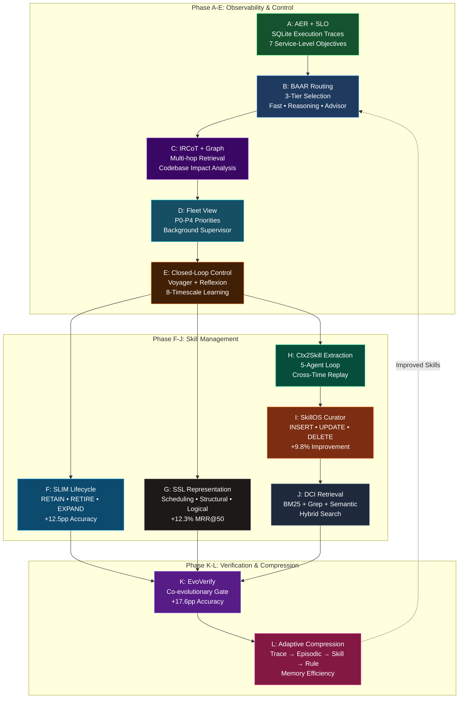
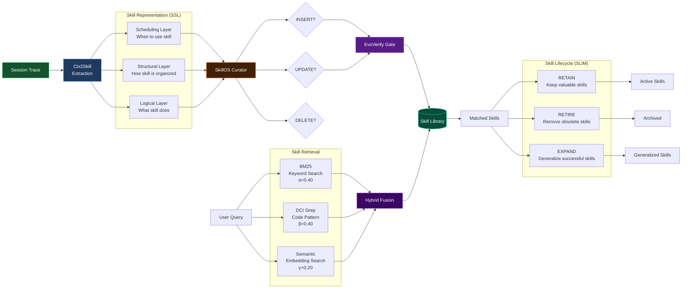
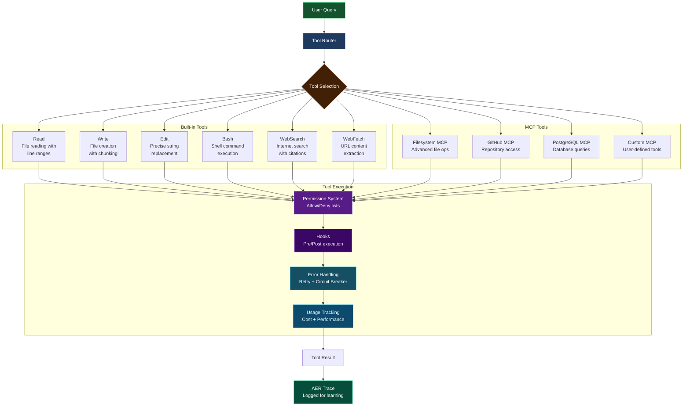
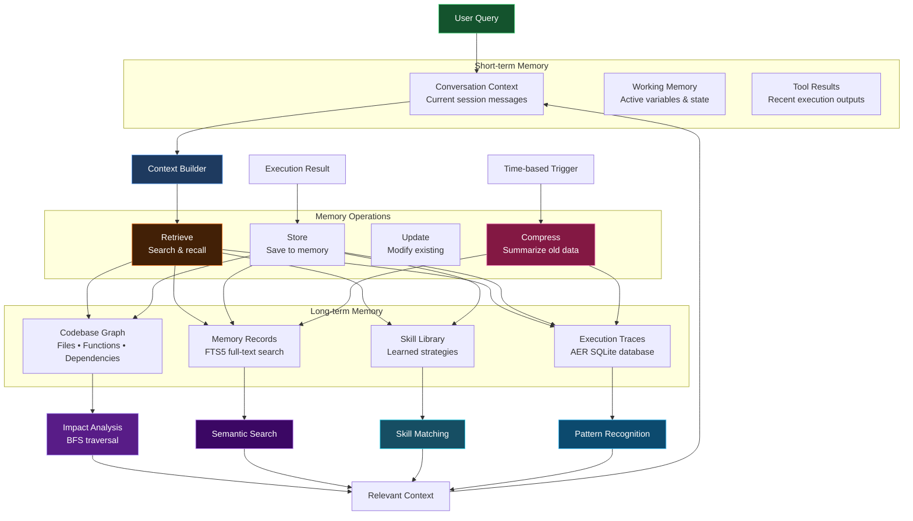
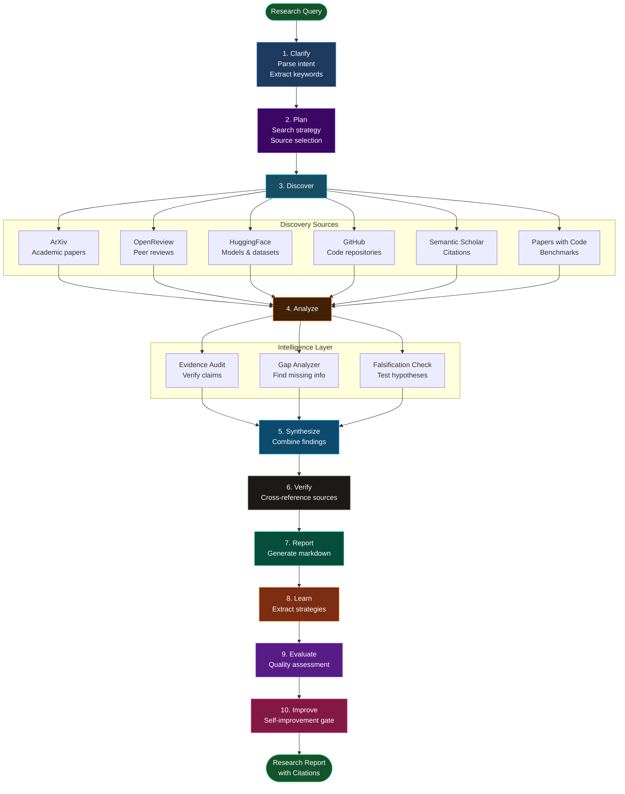
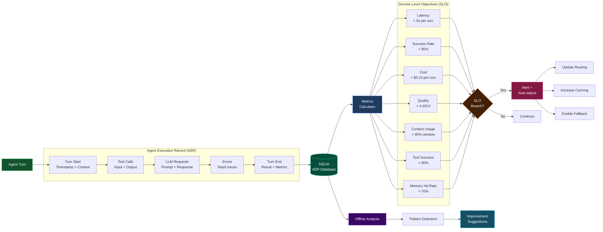
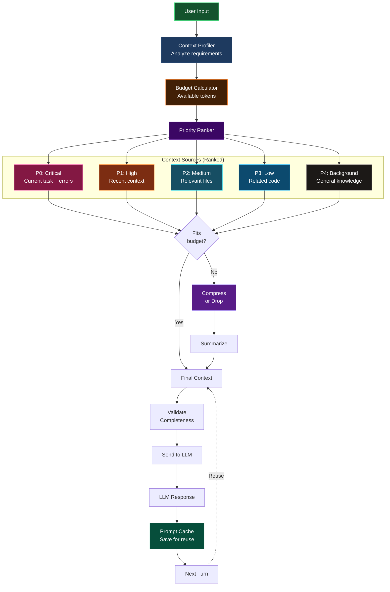

# Lyra Architecture Diagrams

Comprehensive visual documentation of Lyra's innovative architecture.

---

## 1. Self-Evolution System (12 Phases)



**Key Innovation:** Lyra learns from every session, automatically extracting and curating reusable skills with co-evolutionary verification.

---

## 2. Skill Intelligence System



**Key Innovation:** Three-layer skill representation with hybrid retrieval and lifecycle management ensures skills stay relevant and valuable.

---

## 3. Tool System Architecture



**Key Innovation:** Extensible tool system with MCP protocol support, permission management, and automatic usage tracking for learning.

---

## 4. Memory System



**Key Innovation:** Hybrid memory system combining short-term context with long-term codebase knowledge and adaptive compression.

---

## 5. Deep Research Pipeline



**Key Innovation:** 10-step research pipeline with academic source integration, evidence auditing, and self-improvement feedback loop.

---

## 6. Provider Routing System

```mermaid
graph TB
    QUERY[User Query] --> COMPLEXITY[Complexity<br/>Analyzer]
    
    COMPLEXITY --> SIMPLE{Simple?}
    COMPLEXITY --> COMPLEX{Complex?}
    COMPLEXITY --> STRATEGIC{Strategic?}
    
    subgraph "Fast Tier (Simple Queries)"
        F1[DeepSeek Chat<br/>Cost: $$$]
        F2[Claude Haiku<br/>Cost: $$$$]
        F3[GPT-4o-mini<br/>Cost: $$$]
    end
    
    subgraph "Reasoning Tier (Complex Tasks)"
        R1[Claude Opus<br/>Cost: $$$$$$]
        R2[OpenAI o1<br/>Cost: $$$$$$$]
        R3[DeepSeek V4 Pro<br/>Cost: $$$$]
    end
    
    subgraph "Advisor Tier (Strategic Decisions)"
        A1[Claude Opus 4.7<br/>Architecture]
        A2[Gemini 2.5 Pro<br/>Multi-modal]
        A3[GPT-5<br/>Latest capabilities]
    end
    
    SIMPLE --> F1
    F1 -.Fallback.-> F2
    F2 -.Fallback.-> F3
    
    COMPLEX --> R1
    R1 -.Fallback.-> R2
    R2 -.Fallback.-> R3
    
    STRATEGIC --> A1
    A1 -.Fallback.-> A2
    A2 -.Fallback.-> A3
    
    F1 & F2 & F3 --> RESULT[Response]
    R1 & R2 & R3 --> RESULT
    A1 & A2 & A3 --> RESULT
    
    RESULT --> COST[Cost Tracking]
    RESULT --> QUALITY[Quality Assessment]
    
    COST --> LEARN[Learn Routing<br/>Patterns]
    QUALITY --> LEARN
    LEARN -.Update.-> COMPLEXITY
    
    style QUERY fill:#14532d,stroke:#4ade80,color:#fff
    style COMPLEXITY fill:#422006,stroke:#f97316,color:#fff
    style F1 fill:#1e3a5f,stroke:#60a5fa,color:#fff
    style F2 fill:#1e3a5f,stroke:#60a5fa,color:#fff
    style F3 fill:#1e3a5f,stroke:#60a5fa,color:#fff
    style R1 fill:#3b0764,stroke:#c084fc,color:#fff
    style R2 fill:#3b0764,stroke:#c084fc,color:#fff
    style R3 fill:#3b0764,stroke:#c084fc,color:#fff
    style A1 fill:#164e63,stroke:#22d3ee,color:#fff
    style A2 fill:#164e63,stroke:#22d3ee,color:#fff
    style A3 fill:#164e63,stroke:#22d3ee,color:#fff
    style LEARN fill:#064e3b,stroke:#34d399,color:#fff
```

**Key Innovation:** 3-tier BAAR routing with automatic complexity analysis, cost optimization, and learned routing patterns.

---

## 7. Observability System (AER + SLO)



**Key Innovation:** SQLite-backed execution traces with 7 SLO metrics, automatic breach detection, and self-adjusting behavior.

---

## 8. Context Management



**Key Innovation:** Priority-based context management with P0-P4 ranking, adaptive compression, and prompt caching for efficiency.

---

## Summary of Innovations

| System | Key Innovation | Impact |
|--------|---------------|--------|
| **Self-Evolution** | 12-phase learning pipeline | Agent improves without retraining |
| **Skills** | SSL representation + SLIM lifecycle | +12.5pp accuracy, automatic curation |
| **Tools** | MCP protocol + permission system | Extensible, secure, tracked |
| **Memory** | Hybrid short/long-term + compression | Efficient context management |
| **Research** | 10-step academic pipeline | Cited, verified research reports |
| **Routing** | 3-tier BAAR with learning | Cost-optimized, quality-aware |
| **Observability** | AER traces + 7 SLO metrics | Full visibility, auto-adjustment |
| **Context** | P0-P4 priority ranking | Optimal token usage |

---

*These diagrams illustrate Lyra's novel architecture that enables continuous learning and improvement.*
