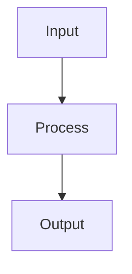

# Contributing to Lyra

Thank you for your interest in contributing to Lyra! This guide will help you get started with development, testing, and submitting contributions.

## Table of Contents

- [Getting Started](#getting-started)
- [Development Setup](#development-setup)
- [Project Architecture](#project-architecture)
- [Development Workflow](#development-workflow)
- [Testing Requirements](#testing-requirements)
- [Code Style & Conventions](#code-style--conventions)
- [Submitting Changes](#submitting-changes)
- [Package Development](#package-development)
- [Documentation](#documentation)
- [Community](#community)

---

## Getting Started

### Prerequisites

- **Python 3.11+** (3.12 recommended)
- **Node.js 18+** (for TUI development)
- **Git** for version control
- **uv** (recommended) or pip for Python package management
- At least one LLM API key (Anthropic, DeepSeek, OpenAI, etc.)

### Quick Setup

```bash
# Clone the repository
git clone https://github.com/yourusername/lyra.git
cd lyra

# Install Python dependencies
pip install -e ".[dev]"

# Install TypeScript dependencies (for TUI)
npm install && npm run build --workspaces

# Install pre-commit hooks
pre-commit install

# Set up API keys
export ANTHROPIC_API_KEY="sk-ant-..."
export DEEPSEEK_API_KEY="sk-..."

# Verify installation
lyra doctor
```

---

## Development Setup

### Python Environment

We recommend using `uv` for fast dependency management:

```bash
# Install uv
curl -LsSf https://astral.sh/uv/install.sh | sh

# Create virtual environment
uv venv
source .venv/bin/activate  # On Windows: .venv\Scripts\activate

# Install dependencies
uv pip install -e ".[dev]"
```

### IDE Configuration

#### VS Code

Recommended extensions:
- Python (Microsoft)
- Pylance
- Ruff
- mypy
- Jupyter

Settings (`.vscode/settings.json`):
```json
{
  "python.linting.enabled": true,
  "python.linting.ruffEnabled": true,
  "python.formatting.provider": "black",
  "python.testing.pytestEnabled": true,
  "editor.formatOnSave": true,
  "editor.codeActionsOnSave": {
    "source.organizeImports": true
  }
}
```

---

## Project Architecture

Lyra is a Python + TypeScript monorepo with **99 packages** organized into **4 tiers**:

### Foundation Tier (8 packages)

Core infrastructure for agent runtime:

| Package | Role |
|---------|------|
| `lyra-core` | Kernel: AgentLoop, TDD Gate, PermissionBridge, HIR, Pivot/Refine |
| `lyra-cli` | CLI: 25+ commands, interactive REPL, session management |
| `lyra-agents` | Specialist agents: Code, Test, Review, Research |
| `lyra-orchestration` | DAG-based team orchestration, agent fleet |
| `lyra-memory` | 6-layer NeuroMemory + A-MAC + CoMem async + Dream consolidation |
| `lyra-skills` | 64-skill catalog, 7-stage lifecycle, SkillOpt optimizer |
| `lyra-evals` | pass@k evaluation framework |
| `lyra-mcp` | MCP server + enterprise gateway |

### Breakthrough Tier (14 packages)

Advanced capabilities:

- `lyra-reasoning` - CoT, Tree Search, SR2AM, Multi-agent debate
- `lyra-research` - 10-step research pipeline + DCI zero-index retrieval
- `lyra-evolution` - GEPA v2, AEvo, Meta-Harness optimization
- `lyra-recursive-link` - Latent-space inter-agent communication
- `lyra-router` - 5-layer intelligent router + cost cascading
- `lyra-safety` - AgentShield, Parallax, PRISM drift detection
- `lyra-observability` - HIR event stream, traces, burn reports
- `lyra-verification` - Multi-agent verifier (executor→validator→critic)
- And 6 more...

### AGI Ascent Tier (21 packages)

Experimental and forward-looking features:

- `lyra-world-model` - Causal graphs, counterfactual reasoning
- `lyra-meta-evolution` - Recursive self-improvement (RSI)
- `lyra-colony` - Agent swarm with gossip memory
- `lyra-auto-mode` - Full autonomy mode
- `lyra-constitutional` - Constitutional AI safeguards
- And 16 more...

### UI Tier (3 packages)

Terminal interface:

- `ui-core` - Zustand state management
- `ui-terminal` - Ink/React 19 TUI with 25 theme presets
- `ui-transport` - WebSocket + SSE transport layer

See [docs/architecture/system-overview.md](architecture/system-overview.md) for complete architecture.

---

## Development Workflow

### 1. Choose a Task

- Check [GitHub Issues](https://github.com/yourusername/lyra/issues)
- Look for `good-first-issue` or `help-wanted` labels
- Review [docs/roadmap.md](roadmap.md) for planned features

### 2. Create a Branch

```bash
git checkout -b feature/your-feature-name
# or
git checkout -b fix/bug-description
```

Branch naming conventions:
- `feature/` - New features
- `fix/` - Bug fixes
- `docs/` - Documentation updates
- `refactor/` - Code refactoring
- `test/` - Test additions/improvements

### 3. Write Tests First (TDD)

Lyra enforces Test-Driven Development:

```python
# tests/test_your_feature.py
import pytest
from lyra_core.your_module import YourClass

def test_your_feature():
    """Test description."""
    # Arrange
    obj = YourClass()
    
    # Act
    result = obj.your_method()
    
    # Assert
    assert result == expected_value
```

Run tests:
```bash
pytest tests/test_your_feature.py -v
```

### 4. Implement the Feature

Follow the code style guidelines:

```python
from dataclasses import dataclass
from typing import Optional

@dataclass(frozen=True)
class YourClass:
    """Your class description.
    
    Attributes:
        field1: Description of field1
        field2: Description of field2
    """
    field1: str
    field2: Optional[int] = None
    
    def your_method(self) -> str:
        """Method description.
        
        Returns:
            Description of return value
        """
        return f"Result: {self.field1}"
```

### 5. Run Quality Checks

```bash
# Format code
make format

# Run linters
make lint

# Type check
make typecheck

# Run all tests
make test

# Full CI pipeline
make ci
```

### 6. Update Documentation

- Add docstrings to all public APIs
- Update relevant markdown files in `docs/`
- Add examples to package README if applicable
- Update CHANGELOG.md

### 7. Commit Changes

Follow [Conventional Commits](https://www.conventionalcommits.org/):

```bash
git add .
git commit -m "feat(memory): add Dream consolidation pipeline

- Implement 4-phase consolidation
- Add free-energy minimization
- Add Auto-Dreamer GRPO offline consolidation
- Add tests for consolidation pipeline

Closes #123"
```

Commit types:
- `feat:` - New feature
- `fix:` - Bug fix
- `docs:` - Documentation only
- `style:` - Code style (formatting, no logic change)
- `refactor:` - Code refactoring
- `test:` - Adding tests
- `chore:` - Maintenance tasks

---

## Testing Requirements

### Minimum Coverage: 80%

All contributions must maintain or improve test coverage.

### Test Types

1. **Unit Tests** - Test individual functions/classes
2. **Integration Tests** - Test component interactions
3. **E2E Tests** - Test complete workflows

### Running Tests

```bash
# All tests
make test

# Unit tests only
make unit

# Integration tests
make integration

# Specific test file
pytest tests/test_memory.py -v

# Specific test function
pytest tests/test_memory.py::test_consolidation -v

# With coverage report
pytest --cov=lyra_core --cov-report=html
```

### Writing Good Tests

```python
import pytest
from lyra_core.memory import MemorySystem

class TestMemorySystem:
    """Test suite for MemorySystem."""
    
    @pytest.fixture
    def memory_system(self):
        """Create a MemorySystem instance for testing."""
        return MemorySystem(config={"max_size": 1000})
    
    def test_store_and_retrieve(self, memory_system):
        """Test storing and retrieving memories."""
        # Arrange
        memory = {"content": "test", "timestamp": 123}
        
        # Act
        memory_system.store(memory)
        result = memory_system.retrieve(query="test")
        
        # Assert
        assert len(result) == 1
        assert result[0]["content"] == "test"
```

---

## Code Style & Conventions

### Python Style Guide

We follow PEP 8 with modifications:

- **Line length**: 100 characters (not 79)
- **Imports**: Organized by stdlib, third-party, local
- **Type hints**: Required for all public APIs
- **Docstrings**: Google style

### Formatting Tools

- **ruff** - Fast linting with `select = ["E","F","I","UP","B","C4"]`
- **black** - Code formatting (via ruff format)
- **isort** - Import sorting (integrated in ruff)
- **mypy** - Type checking in strict mode

### Type Checking

```python
from typing import List, Optional, Dict, Any

def process_data(
    items: List[str],
    config: Optional[Dict[str, Any]] = None
) -> Dict[str, int]:
    """Process data with optional configuration.
    
    Args:
        items: List of items to process
        config: Optional configuration dictionary
        
    Returns:
        Dictionary mapping items to counts
    """
    config = config or {}
    return {item: len(item) for item in items}
```

### Immutability

Prefer immutable data structures:

```python
from dataclasses import dataclass

@dataclass(frozen=True)  # Immutable
class Config:
    model: str
    temperature: float = 0.7
    
    def with_temperature(self, temp: float) -> "Config":
        """Return new Config with updated temperature."""
        return Config(model=self.model, temperature=temp)
```

### File Organization

- **200-400 lines typical, 800 max** per file
- **Functions under 50 lines**
- **High cohesion, low coupling**
- **Extract utilities from large modules**

### Skills (SKILL.md)

Every skill must have YAML frontmatter:

```yaml
---
name: skill-name
description: Brief description
category: engineering
trigger_patterns:
  - pattern 1
  - pattern 2
tags:
  - tag1
  - tag2
---

# Skill content here
```

---

## Submitting Changes

### Pull Request Process

1. **Update your branch**
   ```bash
   git fetch origin
   git rebase origin/main
   ```

2. **Push to your fork**
   ```bash
   git push origin feature/your-feature-name
   ```

3. **Create Pull Request**
   - Go to GitHub and create a PR
   - Fill out the PR template
   - Link related issues
   - Request review from maintainers

### PR Template

```markdown
## Description
Brief description of changes

## Type of Change
- [ ] Bug fix
- [ ] New feature
- [ ] Breaking change
- [ ] Documentation update

## Testing
- [ ] Unit tests added/updated
- [ ] Integration tests added/updated
- [ ] All tests passing
- [ ] Coverage >= 80%

## Checklist
- [ ] Code follows style guidelines
- [ ] Self-review completed
- [ ] Documentation updated
- [ ] CHANGELOG.md updated
- [ ] No breaking changes (or documented)

## Related Issues
Closes #123
```

### Review Process

1. **Automated Checks** - CI must pass
2. **Code Review** - At least one maintainer approval
3. **Testing** - All tests must pass
4. **Documentation** - Docs must be updated
5. **Merge** - Squash and merge to main

---

## Package Development

### Creating a New Package

```bash
# Create package directory
mkdir -p packages/lyra-yourpackage/src/lyra_yourpackage
mkdir -p packages/lyra-yourpackage/tests

# Create pyproject.toml
cat > packages/lyra-yourpackage/pyproject.toml << 'EOF'
[project]
name = "lyra-yourpackage"
version = "0.1.0"
description = "Your package description"
requires-python = ">=3.11"
dependencies = [
    "lyra-core>=0.1.0",
]

[project.optional-dependencies]
dev = [
    "pytest>=7.0.0",
    "pytest-cov>=4.0.0",
]

[build-system]
requires = ["hatchling"]
build-backend = "hatchling.build"
EOF
```

### Package Structure

```
packages/lyra-yourpackage/
├── src/
│   └── lyra_yourpackage/
│       ├── __init__.py
│       ├── main.py
│       └── utils.py
├── tests/
│   ├── __init__.py
│   ├── test_main.py
│   └── test_utils.py
├── README.md
└── pyproject.toml
```

### Package Isolation

Each package must:
- Have its own `pyproject.toml`
- Have its own test suite
- Have its own README with usage examples
- Declare explicit dependencies
- Be independently installable

---

## Documentation

### Writing Documentation

- Use **Mermaid** for diagrams
- Include **code examples**
- Add **inspiration citations**
- Keep **table of contents** updated
- Use **collapsible sections** for long content

Example:

````markdown
# Feature Name

## Overview

Brief description of the feature.

## Architecture



## Usage

```python
from lyra_core import Feature

feature = Feature()
result = feature.process(data)
```

## Inspiration

This feature is inspired by:
- [Paper Name](https://arxiv.org/abs/xxxx.xxxxx) - Key insight
- [Repo Name](https://github.com/user/repo) - Implementation pattern
```
````

---

## What Not to Commit

- `**/*.egg-info/`, `**/.pytest_cache/`, `**/__pycache__/` (gitignored)
- `papers/*.pdf` (large; track in Git LFS or out-of-tree)
- Anything in `.lyra/` other than `.gitkeep` and `policy.yaml`
- Any file with secrets (API keys, OAuth tokens, `.env` content)
- Session artifacts and progress reports (these go in `archive/`)

---

## Community

### Communication Channels

- **GitHub Issues** - Bug reports and feature requests
- **GitHub Discussions** - Questions and general discussion
- **Discord** - Real-time chat (coming soon)

### Code of Conduct

We follow the [Contributor Covenant Code of Conduct](https://www.contributor-covenant.org/version/2/1/code_of_conduct/).

Key points:
- Be respectful and inclusive
- Welcome newcomers
- Focus on constructive feedback
- Assume good intentions

### Getting Help

- Check [docs/](.) for documentation
- Search [GitHub Issues](https://github.com/yourusername/lyra/issues)
- Ask in [GitHub Discussions](https://github.com/yourusername/lyra/discussions)
- Review [examples/](../examples/) for code samples

---

## Recognition

Contributors are recognized in:
- [CHANGELOG.md](../CHANGELOG.md) - Release notes
- [README.md](../README.md) - Contributors section
- GitHub contributor graph

---

## License

By contributing you agree your code is released under the MIT License in [LICENSE](../LICENSE).

---

Thank you for contributing to Lyra! 🚀
