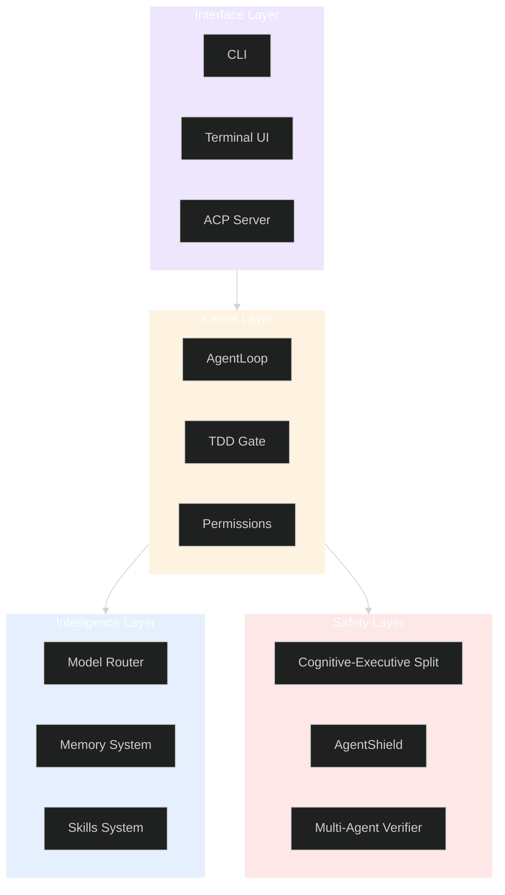
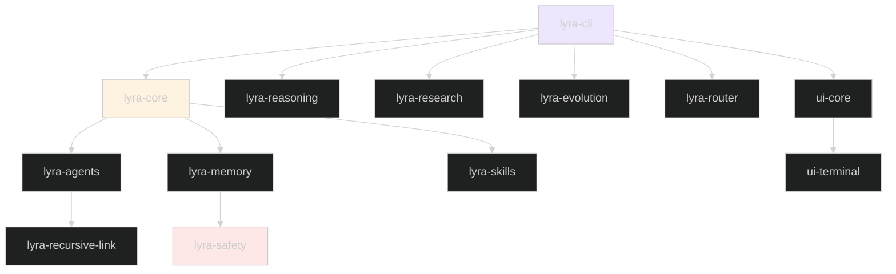
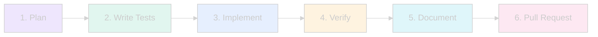

# Lyra Developer Guide

> **Complete guide to contributing to Lyra and extending its capabilities**

## Table of Contents

- [Development Setup](#development-setup)
- [Architecture Overview](#architecture-overview)
- [Package Structure](#package-structure)
- [Contributing Workflow](#contributing-workflow)
- [Testing](#testing)
- [Code Style](#code-style)
- [Adding Features](#adding-features)
- [Creating Skills](#creating-skills)
- [Plugin Development](#plugin-development)
- [Performance Optimization](#performance-optimization)

---

## Development Setup

### Prerequisites

- **Python 3.11+**
- **Node.js 18+** (for TUI)
- **Git**
- **Make** (optional, for convenience commands)

### Clone and Install

```bash
# Clone repository
git clone https://github.com/lyra-ai/lyra.git
cd lyra

# Create virtual environment
python -m venv .venv
source .venv/bin/activate  # On Windows: .venv\Scripts\activate

# Install in development mode
pip install -e ".[dev]"

# Install pre-commit hooks
pre-commit install

# Install TypeScript dependencies
npm install
npm run build --workspaces
```

### Verify Installation

```bash
# Run tests
make test

# Run linters
make lint

# Type checking
make typecheck

# Full CI pipeline
make ci
```

---

## Architecture Overview

### System Layers



### Core Principles

1. **Tests First** — TDD enforced by kernel
2. **Evidence Over Assertion** — Verify before claiming
3. **Minimum Viable Diff** — Smallest change that works
4. **Transparent Failure** — Clear error messages
5. **Immutable State** — Create new, never mutate
6. **Provider Agnostic** — Zero network deps in kernel
7. **Package Isolation** — Each package self-contained
8. **HIR Audit Trail** — Every action logged

---

## Package Structure

### Monorepo Layout

```
lyra/
├── packages/
│   ├── lyra-core/              # Kernel (no network deps)
│   ├── lyra-cli/               # CLI interface
│   ├── lyra-agents/            # Specialist agents
│   ├── lyra-memory/            # 6-layer memory system
│   ├── lyra-skills/            # Skills ecosystem
│   ├── lyra-reasoning/         # Deep reasoning
│   ├── lyra-research/          # Research pipeline
│   ├── lyra-evolution/         # Self-evolution
│   ├── lyra-router/            # Intelligent routing
│   ├── lyra-safety/            # Safety systems
│   ├── lyra-recursive-link/    # Latent-space comms
│   ├── ui-core/                # State management
│   ├── ui-terminal/            # Ink/React TUI
│   └── ui-transport/           # WebSocket/SSE
├── docs/                       # Documentation
├── tests/                      # Integration tests
├── plans/                      # Ultra plans
└── scripts/                    # Build scripts
```

### Package Dependencies



---

## Contributing Workflow

### 1. Find or Create an Issue

```bash
# Search existing issues
gh issue list --label "good first issue"

# Create new issue
gh issue create --title "Add support for X" --body "Description..."
```

### 2. Create a Branch

```bash
# Feature branch
git checkout -b feature/add-x-support

# Bug fix branch
git checkout -b fix/resolve-y-issue

# Documentation branch
git checkout -b docs/improve-z-guide
```

### 3. Make Changes

```bash
# Edit files
vim packages/lyra-core/src/lyra_core/feature.py

# Run tests continuously
make watch-test

# Format code
make format

# Check types
make typecheck
```

### 4. Commit Changes

```bash
# Stage changes
git add packages/lyra-core/src/lyra_core/feature.py
git add tests/test_feature.py

# Commit with conventional format
git commit -m "feat: add X support

- Implement feature X
- Add tests for X
- Update documentation

Closes #123"
```

### 5. Push and Create PR

```bash
# Push branch
git push -u origin feature/add-x-support

# Create pull request
gh pr create --title "feat: add X support" --body "$(cat <<'EOF'
## Summary
- Implements feature X
- Adds comprehensive tests
- Updates documentation

## Test Plan
- [x] Unit tests pass
- [x] Integration tests pass
- [x] Manual testing completed

## Screenshots
(if applicable)

🤖 Generated with Claude Code
EOF
)"
```

### 6. Code Review

- Address reviewer feedback
- Keep commits atomic
- Rebase on main if needed
- Ensure CI passes

---

## Testing

### Test Structure

```
tests/
├── unit/                   # Fast, isolated tests
│   ├── test_core.py
│   ├── test_memory.py
│   └── test_skills.py
├── integration/            # Multi-component tests
│   ├── test_agent_loop.py
│   ├── test_memory_consolidation.py
│   └── test_skill_execution.py
├── e2e/                    # End-to-end tests
│   ├── test_cli.py
│   ├── test_tui.py
│   └── test_workflows.py
└── fixtures/               # Test data
    ├── sample_code/
    └── mock_responses/
```

### Running Tests

```bash
# All tests
make test

# Unit tests only
make unit

# Integration tests
make integration

# E2E tests
make e2e

# Specific test file
pytest tests/unit/test_core.py

# Specific test
pytest tests/unit/test_core.py::test_agent_loop

# With coverage
make coverage

# Watch mode
make watch-test
```

### Writing Tests

```python
# tests/unit/test_feature.py
import pytest
from lyra_core.feature import FeatureClass

class TestFeature:
    """Test suite for Feature functionality."""
    
    def test_basic_functionality(self):
        """Test basic feature operation."""
        feature = FeatureClass()
        result = feature.execute()
        assert result.success is True
    
    def test_error_handling(self):
        """Test error handling."""
        feature = FeatureClass()
        with pytest.raises(ValueError):
            feature.execute(invalid_input=True)
    
    @pytest.mark.integration
    def test_integration_with_memory(self, memory_system):
        """Test integration with memory system."""
        feature = FeatureClass(memory=memory_system)
        result = feature.execute()
        assert memory_system.has_record(result.id)
```

### Test Coverage Requirements

- **Minimum**: 80% overall coverage
- **Unit tests**: Fast (<100ms each)
- **Integration tests**: Moderate (<1s each)
- **E2E tests**: Comprehensive (any duration)

---

## Code Style

### Python Style

```python
# Use type hints
def process_task(task: Task, context: Context) -> Result:
    """Process a task with given context.
    
    Args:
        task: The task to process
        context: Execution context
        
    Returns:
        Result object with outcome
        
    Raises:
        ValueError: If task is invalid
    """
    if not task.is_valid():
        raise ValueError(f"Invalid task: {task.id}")
    
    return Result(success=True, data=task.execute(context))

# Use Pydantic for data models
from pydantic import BaseModel, Field

class Task(BaseModel):
    """Task model with validation."""
    id: str = Field(..., description="Unique task identifier")
    description: str = Field(..., min_length=1)
    priority: int = Field(default=0, ge=0, le=10)
    
    class Config:
        frozen = True  # Immutable

# Use context managers
from contextlib import contextmanager

@contextmanager
def agent_session(agent_id: str):
    """Context manager for agent sessions."""
    session = Session.create(agent_id)
    try:
        yield session
    finally:
        session.close()
```

### TypeScript Style

```typescript
// Use strict types
interface Task {
  id: string;
  description: string;
  priority: number;
}

// Use functional components
export const TaskView: React.FC<{ task: Task }> = ({ task }) => {
  const [status, setStatus] = useState<'idle' | 'running' | 'complete'>('idle');
  
  return (
    <Box>
      <Text>{task.description}</Text>
      <Text color="dim">Priority: {task.priority}</Text>
    </Box>
  );
};

// Use immutable updates
const updateTask = (task: Task, updates: Partial<Task>): Task => {
  return { ...task, ...updates };
};
```

### Formatting

```bash
# Python
black .
isort .
ruff check --fix .

# TypeScript
npm run format

# All
make format
```

---

## Adding Features

### Feature Development Workflow



### 1. Plan the Feature

Create a design document:

```markdown
# Feature: X Support

## Motivation
Why is this feature needed?

## Design
How will it work?

## API
What's the interface?

## Implementation
Which packages are affected?

## Testing
How will we test it?

## Documentation
What docs need updating?
```

### 2. Write Tests First (TDD)

```python
# tests/unit/test_new_feature.py
def test_new_feature_basic():
    """Test basic functionality."""
    result = new_feature.execute()
    assert result.success is True

def test_new_feature_error_handling():
    """Test error cases."""
    with pytest.raises(ValueError):
        new_feature.execute(invalid=True)
```

### 3. Implement

```python
# packages/lyra-core/src/lyra_core/new_feature.py
from pydantic import BaseModel

class NewFeature(BaseModel):
    """New feature implementation."""
    
    def execute(self) -> Result:
        """Execute the feature."""
        # Implementation here
        return Result(success=True)
```

### 4. Verify

```bash
# Run tests
pytest tests/unit/test_new_feature.py

# Check coverage
pytest --cov=lyra_core.new_feature tests/unit/test_new_feature.py

# Manual testing
lyra run "Test new feature"
```

### 5. Document

Update relevant documentation:
- API documentation
- User guide
- Architecture docs
- CHANGELOG.md

### 6. Submit PR

Follow the [Contributing Workflow](#contributing-workflow)

---

## Creating Skills

### Skill Structure

```markdown
---
id: my-skill
name: My Skill
description: Does something useful
version: 1.0.0
author: Your Name
tags: [category, feature]
triggers:
  - pattern: "do something"
    confidence: 0.9
---

# My Skill

## Purpose
What this skill does and when to use it.

## Usage
How to invoke this skill.

## Examples
Concrete examples of the skill in action.

## Implementation
The actual skill logic.
```

### Skill Development

```bash
# Create new skill
lyra skill create

# Test skill
lyra skill test my-skill

# Install locally
lyra skill install ./my-skill

# Publish skill
lyra skill publish my-skill
```

### Skill Best Practices

1. **Single Responsibility** — One skill, one purpose
2. **Clear Triggers** — Specific, unambiguous patterns
3. **Comprehensive Examples** — Show all use cases
4. **Error Handling** — Graceful failure modes
5. **Documentation** — Explain why, not just what

---

## Plugin Development

### Plugin Structure

```
my-plugin/
├── manifest.json           # Plugin metadata
├── src/
│   ├── __init__.py
│   ├── hooks.py           # Hook implementations
│   └── tools.py           # Tool implementations
├── tests/
│   └── test_plugin.py
└── README.md
```

### Manifest File

```json
{
  "name": "my-plugin",
  "version": "1.0.0",
  "description": "My awesome plugin",
  "author": "Your Name",
  "license": "MIT",
  "hooks": [
    {
      "event": "pre_tool_use",
      "handler": "my_plugin.hooks:pre_tool_use"
    }
  ],
  "tools": [
    {
      "name": "my_tool",
      "handler": "my_plugin.tools:my_tool"
    }
  ],
  "permissions": [
    "filesystem:read",
    "network:http"
  ]
}
```

### Hook Implementation

```python
# src/hooks.py
from lyra_core.hooks import Hook, HookResult

class PreToolUseHook(Hook):
    """Hook that runs before tool execution."""
    
    def execute(self, context: HookContext) -> HookResult:
        """Execute hook logic."""
        # Validate tool call
        if not self.is_valid(context.tool_call):
            return HookResult(
                success=False,
                message="Invalid tool call"
            )
        
        return HookResult(success=True)
```

### Tool Implementation

```python
# src/tools.py
from lyra_core.tools import Tool, ToolResult

class MyTool(Tool):
    """Custom tool implementation."""
    
    name = "my_tool"
    description = "Does something useful"
    
    def execute(self, **kwargs) -> ToolResult:
        """Execute tool logic."""
        result = self.do_work(**kwargs)
        return ToolResult(
            success=True,
            data=result
        )
```

---

## Performance Optimization

### Profiling

```bash
# Profile Python code
python -m cProfile -o profile.stats lyra run "task"
python -m pstats profile.stats

# Profile memory usage
mprof run lyra run "task"
mprof plot

# Profile TypeScript
npm run profile
```

### Optimization Strategies

#### 1. Reduce Token Usage

```python
# Use progressive disclosure
skills = skill_registry.load_metadata_only()  # Fast
skill = skill_registry.load_full(skill_id)    # Only when needed

# Compress tool output
compressed = token_juice.compress(tool_output)
```

#### 2. Parallel Execution

```python
# Run independent tasks in parallel
import asyncio

async def process_tasks(tasks):
    results = await asyncio.gather(*[
        process_task(task) for task in tasks
    ])
    return results
```

#### 3. Cache Expensive Operations

```python
from functools import lru_cache

@lru_cache(maxsize=128)
def expensive_computation(input_data):
    # Expensive operation
    return result
```

#### 4. Optimize Memory Usage

```python
# Use generators for large datasets
def process_large_file(filepath):
    with open(filepath) as f:
        for line in f:
            yield process_line(line)

# Stream results instead of loading all
for result in process_large_file("data.txt"):
    handle_result(result)
```

### Performance Benchmarks

```bash
# Run benchmarks
make benchmark

# Compare with baseline
make benchmark-compare

# Profile specific operation
lyra benchmark --operation memory_retrieval
```

---

## Debugging

### Debug Mode

```bash
# Enable debug logging
export LYRA_LOG_LEVEL=DEBUG
lyra run "task"

# Enable thinking output
lyra run "task" --show-thinking

# Enable trace mode
lyra run "task" --trace
```

### Using Debugger

```python
# Add breakpoint
import pdb; pdb.set_trace()

# Or use ipdb for better experience
import ipdb; ipdb.set_trace()

# Or use breakpoint() (Python 3.7+)
breakpoint()
```

### Inspecting HIR Traces

```bash
# View session trace
lyra session show <id> --trace

# Replay session
lyra session replay <id>

# Export trace
lyra session export <id> --format json
```

---

## Release Process

### Version Bumping

```bash
# Bump version
bump2version patch  # 1.0.0 -> 1.0.1
bump2version minor  # 1.0.0 -> 1.1.0
bump2version major  # 1.0.0 -> 2.0.0
```

### Changelog

Update `CHANGELOG.md`:

```markdown
## [1.1.0] - 2026-05-28

### Added
- New feature X
- Support for Y

### Changed
- Improved Z performance

### Fixed
- Bug in W

### Deprecated
- Old API V
```

### Release Checklist

- [ ] All tests passing
- [ ] Documentation updated
- [ ] CHANGELOG.md updated
- [ ] Version bumped
- [ ] Git tag created
- [ ] Release notes written
- [ ] PyPI package published
- [ ] npm packages published
- [ ] GitHub release created

---

## Resources

### Documentation
- [Architecture](architecture/) — System design
- [API Reference](API_DOCUMENTATION.md) — API docs
- [User Guide](USER_GUIDE.md) — User documentation

### Community
- [GitHub Discussions](https://github.com/lyra-ai/lyra/discussions)
- [Discord](https://discord.gg/lyra)
- [Contributing Guidelines](CONTRIBUTING.md)

### Tools
- [Ruff](https://github.com/astral-sh/ruff) — Python linter
- [Black](https://github.com/psf/black) — Python formatter
- [mypy](https://github.com/python/mypy) — Type checker
- [pytest](https://pytest.org/) — Testing framework

---

<div align="center">

**Thank you for contributing to Lyra!**

[User Guide](USER_GUIDE.md) · [Architecture](../ARCHITECTURE.md) · [Contributing](CONTRIBUTING.md)

</div>
