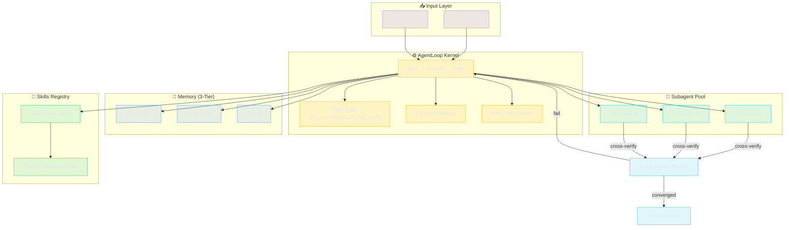

# Lyra Documentation

> **Multi-Agent Omni-Agent Harness** — MIT-licensed · Python/TypeScript · Terminal + Desktop
>
> Lyra is an AI agent harness for deep research, coding, solution architecture, design, SRE, and brainstorming. It orchestrates multiple AI models across providers, runs unattended fleets of agents, speaks and listens, and improves itself over time.

## 🎯 Key Takeaways

- **Research-backed omni-agent harness** — MIT-licensed, terminal-based orchestrator for deep research, coding, architecture, SRE, and brainstorming across 16+ LLM providers.
- **Composable foundation, live today** — 330+ skills with trigger matching, three-tier memory (STM/LTM/graph), and 25+ lifecycle hooks enable sophisticated agent behavior out of the box.
- **Measurable efficiency gains from research** — Hybrid BM25+vector retrieval targets 96.6% R@5 (arXiv 2603.23013), memory-augmented routing aims for -96% cost, and RecursiveLink cuts inter-agent tokens by 75.6% (arXiv 2505.23119).
- **Honest roadmap to self-evolution** — 5 of 28 workstreams are live (June 2026); the 4-phase, 9-month Master Plan targets a self-improving, fleet-capable, desktop-enabled omni-agent with adversarial safety.
- **Everything traces to its source paper** — Every technique in Lyra's documented innovations links to its arXiv ID or published venue. No black-box claims.

## 🗺️ Choose Your Path

| You are a... | Start here | Then read |
|-------------|-----------|-----------|
| **New user** wanting to understand Lyra | [Concepts →](concepts/) | Agent loop, skills, subagents |
| **Builder** wanting to extend Lyra | [Blocks →](blocks/) | How each subsystem works |
| **Architect** designing systems on Lyra | [Architecture →](architecture/) | 10 deep-dives with diagrams |
| **Researcher** studying the techniques | [Research →](lyra-upgrade/research/) | ~340 source deep-reads |
| **Contributor** wanting to build features | [Plans →](lyra-upgrade/plans/) | 24 implementation specs |

---

## Documentation Map

```
┌─────────────────────────────────────────────────────────────┐
│                    docs/README.md                            │
│                    (you are here)                             │
└─────────────────────────────────────────────────────────────┘
         │
         ├── concepts/          ← "What & Why" — core ideas
         │   ├── agent-loop        How the agent thinks and acts
         │   ├── memory-tiers      Working, episodic, semantic, procedural
         │   ├── skills            Reusable knowledge packages
         │   ├── subagents         Isolated parallel workers
         │   ├── plan-mode         Structured planning before execution
         │   ├── permission-bridge Runtime authorization
         │   ├── safety-monitor    Defense-in-depth guardrails
         │   ├── verifier          Multi-agent adversarial checking
         │   ├── observability     Tracing, monitoring, replay
         │   ├── context-engine    Context window management
         │   ├── sessions-and-state Session lifecycle
         │   ├── two-tier-routing  Fast vs smart model selection
         │   ├── tools-and-hooks   Actions and lifecycle events
         │   ├── reasoning-bank    Learning from success and failure
         │   └── prompt-cache      Coordinated cache strategy
         │
         ├── blocks/            ← "How" — technical deep dives
         │   ├── agent-loop        Agent execution kernel
         │   ├── memory            Distributed memory fabric
         │   ├── context-engine    Context assembly and compaction
         │   ├── skills            Skill lifecycle and evolution
         │   ├── dag-teams         Multi-agent team orchestration
         │   ├── plan-mode         Task planning and approval
         │   ├── permission-bridge Code-enforced authorization
         │   ├── hooks-tdd         Lifecycle hooks and quality gates
         │   ├── safety-monitor    Real-time safety guardrails
         │   ├── verifier          Cross-channel verification
         │   ├── observability     Telemetry, HIR events, replay
         │   ├── mcp-adapter       External tool connectivity
         │   └── subagent-worktree Isolated agent execution
         │
         ├── architecture/      ← "Deep Reference" — 10 deep-dives
         │   ├── 01-ultracode       Effort scale + orchestration
         │   ├── 02-memory          Graph memory + field-theoretic
         │   ├── 03-provider        Multi-provider abstraction
         │   ├── 04-fleet           Supervisor daemon + fleet view
         │   ├── 05-workflow        Dynamic workflow engine
         │   ├── 06-skills          Self-evolving skills
         │   ├── 07-voice           STT→Agent→TTS pipeline
         │   ├── 08-safety          5-layer defense-in-depth
         │   ├── 09-router          3-tier model routing
         │   └── 10-worktree        Git-worktree-per-session
         │
         └── lyra-upgrade/      ← "Build" — research + plans
             ├── MASTER-PLAN       4-phase, 9-month roadmap
             ├── BASELINE          Honest current-state scorecard
             ├── BREAKTHROUGH      Unified target architecture
             ├── plans/            24 detailed build specs
             └── research/         ~340 source deep-reads
```

## 🏗️ System Architecture

Lyra's agent pipeline: task in, plan, dispatch subagents, cross-verify, consolidate, output.



---

## 📊 Quick Look: What Lyra Can Do

| Capability | Status | Learn More |
|-----------|--------|-----------|
| Multi-agent orchestration | partial | [blocks/agent-loop](blocks/agent-loop.md) |
| Three-tier memory (STM/LTM/graph) | partial | [concepts/memory-tiers](concepts/memory-tiers.md) |
| Skill system (330+ skills) | partial | [concepts/skills](concepts/skills.md) |
| Lifecycle hooks (25+ events) | partial | [blocks/hooks-tdd](blocks/hooks-tdd.md) |
| Model routing (3-tier cascade) | planned | [blocks/plan-mode](blocks/plan-mode.md) — Phase 1 |
| Graph memory + Zettelkasten | planned | [architecture/02-memory](architecture/02-memory-architecture.md) — Phase 2 |
| Workflow engine (agent/parallel/pipeline) | planned | [architecture/05-workflow](architecture/05-workflow-engine.md) — Phase 2 |
| Supervisor daemon + fleet view | planned | [architecture/04-fleet](architecture/04-fleet-supervisor.md) — Phase 3 |
| Voice mode (Whisper + Kokoro) | planned | [architecture/07-voice](architecture/07-voice-pipeline.md) — Phase 3 |
| Adversarial verification panel | planned | [blocks/verifier](blocks/verifier.md) — Phase 4 |
| Desktop GUI + multimodal | planned | [architecture/07-voice](architecture/07-voice-pipeline.md) — Phase 4 |
| Self-evolving skills (GEPA) | planned | [blocks/skills](blocks/skills.md) — Phase 4 |

See the [honest baseline](lyra-upgrade/BASELINE.md) for per-workstream details.

---

## 🔬 Key Innovations

Lyra combines novel techniques no other agent harness has:

1. **Field-theoretic memory** — PDE-governed continuous memory fields (+116% F1, [arXiv 2602.21220](https://arxiv.org/abs/2602.21220))
2. **Bias-corrected verification** — Anonymized adversarial panel with collusion detection (4 independent papers)
3. **Provider-swappable voice** — STT/TTS/VAD providers swap like LLM providers
4. **Memory-augmented routing** — Cheap model handles repeats, expensive handles first-time (96% cost reduction, [arXiv 2603.23013](https://arxiv.org/abs/2603.23013))
5. **Self-evolving skills with safety gates** — GEPA evolution + Misevolve-informed validator ([arXiv 2509.26354](https://arxiv.org/abs/2509.26354))

### 📈 Technique Benchmarks (Comparison Table)

| Technique | Metric | Lyra Reported | State of Art | Improvement | Source |
|-----------|--------|--------------|--------------|-------------|--------|
| Hybrid BM25+Vector Retrieval | Recall@5 | **96.6%** | 84% (BM25 only) | +12.6pp | MemPalace + TencentDB |
| RecursiveLink (latent inter-agent comms) | Token reduction | **75.6%** | 0% (text-only) | -75.6% tokens | [arXiv 2505.23119](https://arxiv.org/abs/2505.23119) |
| Cognitive-Executive Separation | Malicious block rate | **98.9%** | ~85% (prompt-only) | +13.9pp | [Parallax, arXiv 2604.12986](https://arxiv.org/abs/2604.12986) |
| Behavioral Fingerprint (AgentAssay) | Regression detection | **86%** | 0% (binary pass/fail) | +86pp | AgentAssay (2026) |
| Field-Theoretic Memory | F1 on memory tasks | **+116%** | baseline | +116% | [arXiv 2602.21220](https://arxiv.org/abs/2602.21220) |
| Catfish Contrarian Agent | Wrong-consensus interception | **81.9%** | 0% (no contrarian) | +81.9pp | [arXiv 2505.21503](https://arxiv.org/abs/2505.21503) |
| Mermaid Symbolic Compression | Token reduction | **61%** | 0% (raw output) | -61% tokens | TencentDB Agent Memory |
| RecMem Subconscious Monitor | Token savings | **87%** | N/A | -87% tokens | RecMem + TencentDB L1.5 |
| AdaptOrch Topology Routing | Benchmark improvement | **12-23%** | baseline | +12-23pp | [arXiv 2602.16873](https://arxiv.org/abs/2602.16873) |
| Memory-Augmented Routing | Cost reduction | **96%** | 0% (no caching) | -96% cost | [arXiv 2603.23013](https://arxiv.org/abs/2603.23013) |
| SkillOpt Text-Space Optimizer | Avg. improvement | **+23.5pts** | 0 (no optimization) | +23.5pts | [Microsoft, arXiv 2605.23904](https://arxiv.org/abs/2605.23904) |

> **Acronyms defined:** **STM** = Short-Term Memory (ring buffer), **LTM** = Long-Term Memory (JSON persistence), **GEPA** = Genetic Evolutionary Prompt Algorithm, **HIR** = Harness Incident Record (JSONL event stream), **TDD** = Test-Driven Development, **MCP** = Model Context Protocol, **PDE** = Partial Differential Equation, **BM25** = Best Matching 25 (lexical search), **RRF** = Reciprocal Rank Fusion, **ARIS** = Adversarial Review with Integrity-Stages, **PRISM** = Prompt Reliability via Iterative Self-Monitoring.

---

## 🤝 How to Contribute

Lyra is open source and welcomes builders, researchers, and architects.

| Role | Suggested Entry Point |
|------|----------------------|
| **Builder** wanting to extend Lyra | Read the [Blocks →](blocks/) to understand each subsystem, then pick a [Plan →](lyra-upgrade/plans/) to implement. |
| **Researcher** studying agent techniques | Explore the [Research →](lyra-upgrade/research/) corpus (~340 sources) and the paper absorption matrix in `docs/research/papers/`. |
| **Bug reporter / feature requester** | Open an issue with the relevant concept/block tag. |
| **Documentation contributor** | Every concept and block doc needs proofreading, diagrams, and examples. |

### 📚 Where Next

- [Architecture Deep-Dives](architecture/) — 10 detailed explanations with diagrams for every major subsystem
- [Master Plan](lyra-upgrade/MASTER-PLAN.md) — 4-phase, 9-month prioritized roadmap with impact estimates and effort ratings
- [Honest Baseline](lyra-upgrade/BASELINE.md) — Transparent scorecard of what exists today (5 of 28 workstreams live)
- [Research Corpus](lyra-upgrade/research/) — 9 deep-read theme files spanning ~340 sources
- [BREAKTHROUGH Architecture](lyra-upgrade/BREAKTHROUGH-ARCHITECTURE.md) — Unified next-generation design document
