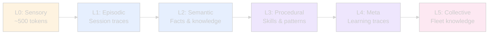

# Lyra User Guide

> **Complete guide to using Lyra as your AI development partner**

## Table of Contents

- [Getting Started](#getting-started)
- [Basic Usage](#basic-usage)
- [Interactive REPL](#interactive-repl)
- [Working with Models](#working-with-models)
- [Memory System](#memory-system)
- [Skills System](#skills-system)
- [Themes and Customization](#themes-and-customization)
- [Voice and Audio](#voice-and-audio)
- [Advanced Features](#advanced-features)

---

## Getting Started

### Installation

```bash
# Clone the repository
git clone https://github.com/lyra-ai/lyra.git
cd lyra

# Install Python dependencies
pip install -e ".[dev]"

# Install TypeScript dependencies (for TUI)
npm install && npm run build --workspaces

# Set up API keys
export ANTHROPIC_API_KEY="sk-ant-..."
export DEEPSEEK_API_KEY="sk-..."
export OPENAI_API_KEY="sk-..."
```

### First Run

```bash
# Launch interactive REPL
lyra

# Or with Terminal UI
lyra --tui

# Single-shot command
lyra run "Add logging to the user service"
```

---

## Basic Usage

### Command Structure

```bash
# Interactive mode (default)
lyra                                    # Start REPL
lyra --model deepseek-v4-pro            # With specific model
lyra --continue                         # Resume last session
lyra --tui                              # Terminal UI mode

# Single-shot commands
lyra run "<task>"                       # Execute a task
lyra plan "<objective>"                 # Create implementation plan
lyra investigate "<issue>"              # Debug and analyze
```

### Common Tasks

#### Code Generation

```bash
lyra run "Create a REST API endpoint for user authentication"
```

Lyra will:
1. **Plan** the implementation (routes, models, tests)
2. **Generate** code following best practices
3. **Write tests** (TDD enforced)
4. **Verify** the implementation works

#### Debugging

```bash
lyra investigate "Memory leak in worker process"
```

Lyra will:
1. **Analyze** the codebase
2. **Identify** potential causes
3. **Propose** fixes with evidence
4. **Implement** and verify the solution

#### Refactoring

```bash
lyra run "Refactor user service to use dependency injection"
```

Lyra will:
1. **Understand** current architecture
2. **Plan** refactoring steps
3. **Preserve** existing behavior
4. **Update** tests

---

## Interactive REPL

### REPL Commands

```
> help                    # Show all commands
> /plan <task>            # Create implementation plan
> /skills                 # List available skills
> /memory search <query>  # Search memory
> /theme set <name>       # Change theme
> /model set <name>       # Switch model
> /session list           # List sessions
> /clear                  # Clear screen
> /exit                   # Exit REPL
```

### Keybindings

| Key | Action |
|-----|--------|
| `Ctrl+C` | Cancel current operation |
| `Ctrl+D` | Exit REPL |
| `Ctrl+L` | Clear screen |
| `Ctrl+R` | Search command history |
| `Tab` | Auto-complete |
| `Shift+Tab` | Toggle permission mode |
| `Ctrl+T` | Theme picker |
| `Ctrl+O` | Show thinking output |

### Permission Modes

Switch between modes with `Shift+Tab`:

1. **Plan Mode** (default) — Every action requires approval
2. **Auto-Edit Mode** — Trusted operations auto-approved
3. **Bypass Mode** — Full autonomy with audit logging
4. **Auto Mode** — Self-directed with goal tracking

---

## Working with Models

### Available Providers

Lyra supports 16+ LLM providers:

```bash
# List configured models
lyra model list

# Set default model
lyra model set anthropic:sonnet

# Use specific model for a task
lyra run "Complex refactoring task" --model anthropic:opus
```

### Model Selection Guide

| Task Type | Recommended Model | Why |
|-----------|------------------|-----|
| **Complex reasoning** | Anthropic Opus 4.7 | Best for architecture decisions |
| **Standard coding** | Anthropic Sonnet 4.6 | Optimal balance |
| **Fast iterations** | DeepSeek V4 Flash | 3x cost savings |
| **Long context** | Google Gemini 2.5 Pro | 2M context window |
| **Cost-effective** | DeepSeek V4 Pro | Best value |

### Intelligent Router

Lyra automatically routes tasks to optimal models:


---

## Memory System

### 6-Layer Memory Hierarchy



### Using Memory

```bash
# Search memory
lyra memory search "authentication implementation"

# View memory stats
lyra memory stats

# Clear old memories
lyra memory prune --days 30
```

### Memory Consolidation

Lyra automatically consolidates memories during idle time:

1. **Orient** — Identify new knowledge from session traces
2. **Gather** — Collect related memories across layers
3. **Consolidate** — Extract and link entities
4. **Prune** — Remove stale or redundant memories

---

## Skills System

### What are Skills?

Skills are reusable patterns that Lyra learns and applies automatically. Think of them as "muscle memory" for common tasks.

### Using Skills

```bash
# List available skills
lyra skill list

# Search for skills
lyra skill search "testing"

# Install a skill
lyra skill install https://github.com/user/skill-repo

# Create a new skill
lyra skill create
```

### Skill Categories

| Category | Count | Examples |
|----------|-------|----------|
| **Engineering** | 12 | TDD, code review, refactoring |
| **Design** | 6 | UI/UX, architecture, patterns |
| **SRE** | 6 | Monitoring, deployment, scaling |
| **AI/ML** | 6 | Model training, evaluation, deployment |
| **Security** | 5 | Vulnerability scanning, penetration testing |
| **Cloud** | 5 | AWS, GCP, Azure automation |

### Skill Auto-Optimization

Lyra continuously improves skills using **SkillOpt**:

- Learns from successful executions
- Identifies failure patterns
- Optimizes prompts and procedures
- Achieves **+23.5pts improvement** on benchmarks

---

## Themes and Customization

### Color Themes

Lyra ships with **25+ professionally-designed themes**:

```bash
# List all themes
lyra theme list

# Preview a theme
lyra theme preview tokyo-night

# Set theme
lyra theme set catppuccin-mocha

# Interactive picker
Ctrl+T
```

### Theme Families

#### Dark & Modern
- Catppuccin Mocha, Tokyo Night, Dracula, One Dark Pro
- Monokai Pro, Challenger Deep, Moonfly, Nightfly, Klein Void

#### Warm & Cozy
- Gruvbox Dark, Rose Pine, Kanagawa, Ayu Mirage
- Solarized Dark, Ferra

#### Nature & Forest
- Everforest, Nord

#### Retro & Synth
- Synthwave 84, SpaceGray Eighties, Eldritch

### Custom Themes

Create your own theme in `~/.lyra/themes/`:

```json
{
  "name": "my-theme",
  "colors": {
    "primary": "#7c3aed",
    "secondary": "#a78bfa",
    "accent": "#34d399",
    "background": "#0d1117",
    "foreground": "#e2e8f0"
  }
}
```

---

## Voice and Audio

### Voice Packs

Lyra includes fantasy-themed voice packs:

```bash
# Enable voice
lyra config set voice.enabled true

# Set voice pack
lyra config set voice.pack fantasy-peon

# Available packs:
# - fantasy-peon (Warcraft III Peon)
# - scifi-marine (StarCraft Marine)
# - cyber-netrunner (Cyberpunk Netrunner)
```

### Voice Events

Voice feedback for key events:

- **Session start** — "Ready to work!"
- **Task complete** — Success sound
- **Error** — Alert sound
- **Long operation** — Progress updates

### Dictation Mode

```bash
# Enable dictation
lyra config set voice.dictation_enabled true

# Use voice commands
"Lyra, add logging to the user service"
```

---

## Advanced Features

### Multi-Agent Teams

```bash
# Create a team for complex tasks
lyra team create api-refactor \
  --roles pm,architect,engineer,tester,reviewer

# Execute with team
lyra team run api-refactor "Refactor authentication system"
```

### Autonomous Mode

```bash
# Set a goal and let Lyra work autonomously
lyra auto "Improve test coverage to 80%"

# Monitor progress
lyra auto status

# Stop autonomous mode
lyra auto stop
```

### Research Mode

```bash
# Deep research on a topic
lyra research "Best practices for microservices authentication"

# Lyra will:
# 1. Search 7+ sources (papers, docs, repos)
# 2. Synthesize findings
# 3. Create implementation recommendations
# 4. Generate code examples
```

### Session Management

```bash
# List all sessions
lyra session list

# Show session details
lyra session show <id>

# Resume a session
lyra session resume <id>

# Rename a session
lyra session rename <id> "API Refactoring"

# Session retrospective
lyra retro
```

### Cost Tracking

```bash
# View token usage
lyra burn

# Set budget limits
lyra config set max_budget_usd 10.0

# Cost breakdown by category:
# - Reasoning tokens
# - Tool execution
# - Memory retrieval
# - Skill loading
# - Agent communication
```

---

## Configuration

### Settings File

Edit `~/.lyra/settings.json`:

```json
{
  "last_model": "anthropic:claude-sonnet-4-6",
  "fast_model": "deepseek-v4-flash",
  "smart_model": "deepseek-v4-pro",
  "fallback_chain": ["anthropic", "deepseek", "gemini", "openai"],
  "theme": "catppuccin-mocha",
  "permission_mode": "plan",
  "max_turns": 50,
  "max_budget_usd": 10.0,
  "effort": "high",
  "vim_mode": false,
  "voice": {
    "enabled": true,
    "pack": "fantasy-peon"
  },
  "safety": {
    "cognitive_executive_separation": true,
    "adversarial_verification": true
  }
}
```

### Environment Variables

```bash
# API Keys
export ANTHROPIC_API_KEY="sk-ant-..."
export DEEPSEEK_API_KEY="sk-..."
export OPENAI_API_KEY="sk-..."
export GOOGLE_API_KEY="..."

# Optional
export LYRA_CONFIG_DIR="~/.lyra"
export LYRA_LOG_LEVEL="INFO"
export MAX_THINKING_TOKENS=10000
```

---

## Troubleshooting

### Common Issues

#### "Model not found"
```bash
# Check configured models
lyra model list

# Add provider credentials
export ANTHROPIC_API_KEY="sk-ant-..."
```

#### "Permission denied"
```bash
# Check permission mode
lyra config get permission_mode

# Switch to auto-edit mode
Shift+Tab
```

#### "Out of memory"
```bash
# Clear old sessions
lyra session prune --days 7

# Reduce context window
lyra config set max_turns 30
```

### Health Check

```bash
# Run system diagnostics
lyra doctor

# Checks:
# - API keys configured
# - Models accessible
# - Memory system healthy
# - Skills loaded
# - Themes available
```

### Getting Help

```bash
# In-app help
lyra help

# Command-specific help
lyra run --help

# Documentation
lyra docs

# Community
# - GitHub: https://github.com/lyra-ai/lyra
# - Discord: https://discord.gg/lyra
```

---

## Next Steps

- **[Developer Guide](DEVELOPER_GUIDE.md)** — Contributing to Lyra
- **[API Documentation](API_DOCUMENTATION.md)** — Programmatic usage
- **[Architecture](architecture/)** — System design deep-dive
- **[Performance Benchmarks](PERFORMANCE_BENCHMARKS.md)** — Speed and cost analysis

---

<div align="center">

**Built with Python, TypeScript, and the conviction that AI agents should be open, auditable, and self-improving.**

[Quickstart](#getting-started) · [Architecture](../ARCHITECTURE.md) · [Contributing](CONTRIBUTING.md) · [Changelog](../CHANGELOG.md)

</div>
