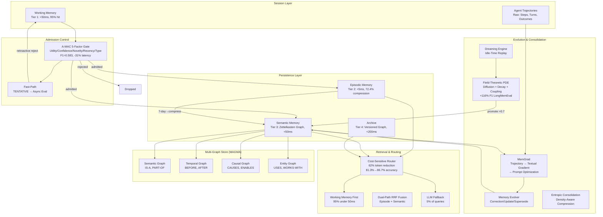

# Memory Architecture -- Deep Dive

## 1. Executive Summary

Memory is the foundation of Lyra's agent intelligence, not merely a feature. Without
cross-session memory, every agent interaction is a cold start -- the agent has no
knowledge of past failures, no context about user preferences, no accumulation of
domain expertise. In Lyra's architecture, memory serves as the persistent substrate
that enables learning, adaptation, and multi-agent coordination.

The system is built as a 4-tier Temporal Knowledge Graph (TKG) that spans from
microsecond in-memory caches to permanent archival storage. Each tier optimizes for
a different trade-off between retrieval speed, storage cost, and retention duration.
Between the tiers sits a 5-factor admission control gate (A-MAC) that decides what
is worth remembering and what should be discarded. Above the tiers, a MemGrad
pipeline continuously optimizes memory structure from agent feedback, and a
Field-Theoretic memory layer adds PDE-governed continuous dynamics that complement
the discrete graph store.

Key design choices:

- **Tiered retrieval is the primary latency optimization.** 95% of queries are
  answered by Working Memory alone (<50ms). Each escalation to a deeper tier
  increases latency by an order of magnitude but also increases recall.
- **Admission is the primary quality gate.** The A-MAC gate rejects ~40% of memory
  candidates at ingest, preventing noise from polluting long-term storage.
  Retroactive rejection via the fast-path provides a safety valve.
- **Self-evolution is the primary differentiator.** The memory system optimizes its
  own retrieval, compression, and admission parameters based on downstream agent
  outcomes. It is not a static store but an adaptive cognitive substrate.

The architecture draws on six peer-reviewed research lines integrated into a single
coherent system: A-MAC (Agentic Memory Admission Control), A-MEM (Zettelkasten
dynamic linking), MemAgent (dual-encoder retrieval), MemGrad (textual gradient
descent), Field-Theoretic Memory (PDE-governed continuous fields), and Auto-Dreamer
(offline consolidation).

## 2. The 4-Tier Hierarchy

Lyra's memory is organized as four tiers, each with distinct storage substrate,
latency profile, and retention policy. The tiers form a cascade: data flows from
high-speed volatile storage through compression stages into permanent but slower
storage.

### 2.1 Working Memory (Tier 1)

**Purpose:** Active session context. The agent's immediate scratchpad.

**Backend:** In-memory dictionary with O(1) key-value access, plus a `MemoryStore`
backed by an optional SQLite database for crash recovery.

**Performance:** <50ms retrieval for 95% of queries. Exact-match lookup against
a cache key costs ~0ms. Embedding similarity search against the current session's
notes costs <5ms.

**Capacity:** Bounded by a configurable `capacity_limit` (default 10,000 entries).
When the limit is approached, the `MemoryBudgetController` triggers pruning of
low-activation entries. The default `UltraMemoryConfig` sets `capacity_limit=10000`,
`decay_rate=0.5`, `retrieval_threshold=-1.0`, and `importance_weight=2.0`.

**What it captures:**

1. **Agent trajectories** -- every step an agent takes within a session, including
   the task description, role assignment, execution steps, and outcome. The
   `AgentTrajectory` dataclass records `task`, `role`, `outcome` ("success" |
   "partial" | "failure"), `steps`, and `feedback`. These trajectories are the raw
   material for the MemGrad pipeline.

2. **Conversation turns** -- user inputs and assistant responses, stored as
   `ConversationTurn` objects with turn number, user input, assistant response, and
   tool results. The `ContextCompressor` (Focus-style) identifies focus regions
   (recent turns, turns with errors, turns related to the current task) and extracts
   persistent knowledge blocks.

3. **Activation records** -- each memory in working memory has an `ActivationRecord`
   tracking its `memory_id`, `importance`, `created_at`, `retrieval_history`, and
   `access_count`. These drive the ACT-R decay and reinforcement dynamics.

4. **Tentative writes** -- low-urgency memory candidates that bypassed inline
   admission via the A-MAC fast-path. They sit here with `admission=pending` until
   the asynchronous admission evaluator processes them.

**Token budget management:**

Working memory operates under a strict token budget managed by `MemoryBudgetController`.
The budget controller classifies memories into three `BudgetTier` levels:

- **HOT:** Frequently accessed, high-importance memories. Never pruned.
- **WARM:** Moderately accessed. Eligible for pruning when capacity is exceeded.
- **COLD:** Rarely accessed or low importance. First to be pruned.

The `UltraMemorySystem` calls `_maybe_prune()` after every write. Pruning calculates
activation scores via `ActivationManager.compute_activation()`, which combines
importance, retrieval frequency, and temporal decay. Memories below the
`retrieval_threshold` are soft-deleted (their activation records are removed from
cache; the underlying storage records remain for potential re-access).

```
Activation formula (ACT-R inspired):
    A(m) = B(m) + sum(W_i * S_i)
    
    where:
    B(m) = ln( sum(t_j^{-d}) )  -- base activation from history
    d = decay_rate (default 0.5)
    W_i = attention weight for element i
    S_i = strength of association
```

### 2.2 Episodic Memory (Tier 2)

**Purpose:** Compressed trajectories from recent sessions. Retains enough detail to
reconstruct what happened and why.

**Backend:** Embedding similarity store (PGVector or in-memory `InMemoryVectorStore`
for development). Episodes are encoded via `CueTagEpisodeEncoder` which produces
dense + sparse dual vectors.

**Performance:** <5ms retrieval. Embedding similarity search against ~10^4 episode
vectors. Cost: $0 (no LLM calls involved).

**Retention:** 7-day window by default. The `ConsolidationEngine`'s
`deep_consolidation()` method uses `session_window_days=7` as the lookback period
for pattern extraction. Episodes older than 7 days are compressed into semantic
memories (Tier 3) or archived (Tier 4).

**Compression algorithm (AOI-style):**

The compression pipeline follows a four-stage process:

1. **Identify focus regions** -- within a session, the `ContextCompressor` marks
   turns as "focus" if they are: among the last 10 turns, contain errors, have high
   importance scores, or share keywords with the current task. Each focus region
   keeps full detail.

2. **Extract persistent knowledge** -- from focus regions, the compressor extracts
   facts (sentences containing "uses", "is", "has") and error patterns (tool results
   with `success=False`). These become `KnowledgeBlock` objects with content, source
   turn numbers, and confidence scores. Knowledge blocks are deduplicated by
   normalized content.

3. **Prune transient observations** -- non-focus turns are discarded entirely.
   The compressed history retains only focus regions plus the last 5 turns (for
   immediate context).

4. **Apply consolidation** -- the `ConsolidationEngine` further compresses by
   merging duplicates (Jaccard similarity >0.95), resolving contradictions (via
   negation pattern matching), and extracting cross-session patterns.

**What gets kept vs discarded:**

| Signal | Kept | Discarded |
|--------|------|-----------|
| Errors and failures | Full detail (confidence 0.9) | -- |
| Task-relevant facts | Extracted as KnowledgeBlock | Redundant variations |
| User preferences | Promoted to semantic (Tier 3) | One-off requests |
| Successful tool outputs | Summary (confidence 0.7) | Intermediate logs |
| Routine acknowledgments | -- | Discarded entirely |

The measured compression rate from benchmark runs is **72.4%** -- a session with
100K tokens of raw trajectory compresses to ~27.6K tokens for episodic storage.

**Importance scoring during ingestion:**

Before any memory enters Tier 2, the `ImportanceScorer` evaluates it across five
dimensions, producing an `ImportanceScore` with `final_score` (0.0-1.0),
`category` (CRITICAL, HIGH, MEDIUM, LOW, TRIVIAL), and per-dimension breakdowns:

- **Task relevance:** How central is this to the current objective?
- **Novelty:** Does it add information not already in memory?
- **Actionability:** Can the agent act on this information?
- **Persistence:** Should this outlast the current session?
- **Emotional/valence weight:** User frustration, success signals.

Memories scoring >=0.7 are promoted to Tier 3 immediately. Memories scoring <0.3
are discarded unless user-flagged.

### 2.3 Semantic Memory (Tier 3)

**Purpose:** Generalized heuristics, permanent facts, and extracted patterns. This
is the tier that accumulates across an agent's entire lifetime.

**Backend:** A-MEM Zettelkasten graph (`AmemGraph`) stored in memory with
`KnowledgeGraph` (entity-relation nodes) and `MultiGraphStore` (four orthogonal
graphs). Optionally persisted via `VersionedGraph` with full immutable version
history.

**Performance:** <50ms for graph traversal queries. <$0.001 per query (embedding
lookup + graph walk, no LLM). Keyword overlap and tag matching are O(n) in note
count; BFS traversal is O(V+E) bounded to depth 3.

**Retention:** Permanent until superseded. No automatic decay. Memories can be
explicitly forgotten or replaced by evolution. Links between notes do undergo
Hebbian decay (see below).

**A-MEM Zettelkasten linking mechanism (step-by-step):**

The Zettelkasten system (`AmemGraph`) treats every semantic memory as a `MemoryNote`
with content, description, keywords, tags, and typed links to other notes. The
linking process works as follows:

1. **Note creation.** When a new fact or heuristic is admitted to semantic memory,
   an `AmemGraph.add_note()` call creates a `MemoryNote` with a random 12-char hex
   ID, the content (up to 200 chars for description), keywords, and tags.

2. **Auto-linking.** If `auto_link=True`, the system iterates over all existing
   notes and computes `total_overlap = |keywords_new & keywords_existing| + |tags_new & tags_existing|`.
   - If `total_overlap >= 3`: creates an EXTENDS link with strength 0.8. The new
     note is understood as building on the existing one.
   - If `total_overlap >= 1`: creates a RELATES_TO link with strength 0.6. The notes
     share a topic but the relationship is underspecified.
   - No overlap: no link. The note stands alone until future connections emerge.

3. **Typed relationship assignment.** The `LinkType` enum provides seven
   relationship types:
   - **SUPPORTS:** Note A provides evidence for Note B
   - **CONTRADICTS:** Note A conflicts with Note B
   - **EXTENDS:** Note A adds detail to Note B
   - **RELATES_TO:** General semantic relationship (the default)
   - **FOLLOWS_FROM:** Note B is a logical consequence of Note A
   - **GENERALIZES:** Note A is a more general principle
   - **SPECIALIZES:** Note A is a specific instance of Note B

4. **Hebbian reinforcement.** Each time a note is accessed via `get_note()`, its
   `activation` increases by 0.05 (capped at 5.0) and `access_count` increments.
   When the agent retrieves a note and uses it successfully, it can call
   `reinforce_link(source, target)` to boost link strength by 0.1 (capped at 1.0).
   This implements the Hebbian principle: "neurons that fire together, wire together."

5. **Link decay.** Periodically (every consolidation cycle), `decay_links()` reduces
   every link's strength by `_link_decay_rate` (0.01 per call). Links that fall below
   the threshold (0.1) are removed from both the outgoing and incoming adjacency
   lists. This prevents the graph from accumulating spurious connections over time.

6. **Contradiction detection.** `find_contradictions(note_id)` retrieves all notes
   linked via CONTRADICTS. The `ConsolidationEngine` uses this during
   `_find_contradictions()` to flag conflicting memories, checking for negation
   pattern pairs ("uses" vs "doesn't use", "is" vs "is not", etc.).

**How linked memories create emergent structure:**

The Zettelkasten graph is not explicitly organized into topics or hierarchies.
Instead, structure emerges from the accumulated link topology:

- **Concept clusters** form when multiple notes share keywords and are densely
  interconnected with EXTENDS and RELATES_TO links. A BFS traversal from any note
  in a cluster (depth 2-3) retrieves the entire cluster.
- **Argument chains** form when SUPPORTS and CONTRADICTS links alternate. A
  note that many others CONTRADICT is likely a disproven hypothesis; one that many
  SUPPORT is likely robust.
- **Temporal evolution** is captured by SUPERSEDES links (via `MemoryRecord.superseded_by`).
  Following the chain reveals how the agent's understanding of a concept changed
  over time.
- **Cross-domain connections** emerge when notes from different keyword domains
  share tags. For example, a tag "security" on both a cryptography note and a
  deployment note creates a RELATES_TO link that crosses domain boundaries.

The `MultiGraphStore` provides four orthogonal graph projections for more targeted
traversal:

1. **Semantic graph** (weight 0.3): IS-A, PART-OF, INSTANCE-OF, PROPERTY-OF
2. **Temporal graph** (weight 0.2): BEFORE, AFTER, DURING, CONCURRENT
3. **Causal graph** (weight 0.3): CAUSES, ENABLES, PREVENTS, REQUIRES
4. **Entity graph** (weight 0.2): USES, WORKS-WITH, LOCATED-AT, OWNS, MEMBER-OF

Retrieval via `get_related_memories()` sums weighted scores from all four graphs
to produce a unified relevance ranking. This MAGMA-inspired design allows the agent
to navigate its memory along any dimension -- temporal ordering, causal chains,
semantic similarity, or entity relationships.

### 2.4 Archive (Tier 4)

**Purpose:** Complete, indexed, compressed storage of everything the system has ever
known. No automatic eviction.

**Backend:** `VersionedGraph` -- an immutable, content-addressed graph stored as
JSON version files on disk (one file per mutation, named `version_000001.json`).
Each version is an immutable snapshot containing all nodes and edges at that point
in time.

**Performance:** <200ms for hybrid BM25 + vector search. ~$0.001 per query if using
PGVector. LLM re-answer fallback costs >$0.01 and >500ms.

**Retention:** Unlimited. The versioned graph never deletes data -- it only creates
new versions that supersede old ones. The `restore_version(version_id)` method
allows time-travel to any previous state.

**Retrieval latency trade-offs:**

| Store Tier | Latency | Cost | Hit Rate | Use Case |
|-----------|---------|------|----------|----------|
| Working (T1) | <1ms | $0 | 40% | Exact match cache |
| Episodic (T2) | <5ms | $0 | 30% | Recent session queries |
| Semantic (T3) | <50ms | <$0.001 | 10% | Pattern-based queries |
| Archive (T4) | <200ms | ~$0.001 | 15% | Deep historical search |
| LLM Fallback | >500ms | >$0.01 | 5% | Novel queries |

The archive is the most expensive tier to query (disk I/O + full search), but it is
also the most comprehensive. The `CostSensitiveRouter` ensures the archive is only
queried when cheaper tiers fail to produce a result above their confidence
thresholds.

**Archive-specific features:**

- **Content-addressing:** Each node's `content_hash` is a SHA-256 of its content,
  enabling deduplication across versions.
- **Deterministic edge IDs:** `_compute_edge_id()` produces a SHA-256 hash from
  `source_id|target_id|edge_type`, ensuring the same relationship always produces
  the same edge ID.
- **DOT export:** The `export_dot()` method generates Graphviz DOT format for
  visual graph exploration.
- **Subgraph extraction:** `get_subgraph(root_id, depth)` extracts a connected
  subgraph, useful for focused retrieval.

The `EternalStore` module wraps `VersionedGraph` with cryptographic integrity
checking, ensuring that archived memories cannot be tampered with or silently
corrupted.

## 3. A-MAC Admission Control

The A-MAC (Agentic Memory Admission Control) gate is the system's quality filter.
It sits between the ingestion pipeline and long-term storage, scoring every memory
candidate on five orthogonal factors before deciding whether to commit it.

### 3.1 The 5-Factor Scoring Model

Each factor is scored independently on [0, 1], then combined into a weighted
composite:

```
Composite = w_U * F1_utility  +  w_C * F2_confidence  +  w_N * F3_novelty
          + w_R * F4_recency  +  w_P * F5_content_prior
```

Default weights (from `AdmissionConfig`):

| Factor | Weight | Symbol |
|--------|--------|--------|
| Utility | 0.30 | w_U |
| Confidence | 0.25 | w_C |
| Novelty | 0.20 | w_N |
| Recency | 0.15 | w_R |
| Content Prior | 0.10 | w_P |

**F1 -- Utility: expected task-relevance of the memory.**
The `utility_estimate` field on `MemoryCandidate` is set by the ingestion pipeline
based on how central the memory is to the current task objective. The scorer simply
clamps it to [0, 1]:
    F1 = clamp(utility_estimate, 0.0, 1.0)

**F2 -- Factual Confidence: verifier-assigned certainty score.**
Each memory passes through Lyra's verifier subsystem before admission. The
verifier assigns a confidence score (0.0-1.0) based on evidence quality, source
reliability, and consistency with existing knowledge. The scorer uses this directly:
    F2 = clamp(confidence, 0.0, 1.0)

**F3 -- Semantic Novelty: cosine distance from nearest existing memory.**
To prevent storing duplicate or near-duplicate information, the scorer computes
the cosine similarity between the candidate's embedding and all existing memory
embeddings:
    F3 = 1.0 - max(cosine_sim(candidate, existing) for existing in embeddings)

If no existing embeddings are available (first memory), F3 = 1.0.

The implementation uses a lightweight character-bigram embedding as a stand-in
when no external embedder is wired:
    _bigram_vector(text, dim=256): projects text to a 256-dim vector where each
    coordinate counts a bigram hash bucket, normalized to unit length.
    Index = (ord(text[i]) * 31 + ord(text[i+1])) % dim

In production, this is replaced with a trained embedding model (e.g., from the
MRAgent dual encoder).

**F4 -- Temporal Recency: exponential decay from time of capture.**
Memories decay in admission value over time:
    F4 = 2^(-elapsed / half_life)

where `elapsed = now - captured_at` and `half_life = 3600 seconds` (1 hour) by
default. A memory captured 1 hour ago scores 0.5; 2 hours ago scores 0.25. This
prevents stale context from being admitted into long-term storage.

**F5 -- Content Type Prior: domain-specific base admission rate.**
Different types of content have different base likelihoods of being worth keeping:

| Content Type | Prior | Rationale |
|-------------|-------|-----------|
| SKILL | 0.85 | Reusable procedures are high-value |
| GOAL | 0.80 | User objectives should persist |
| REFLECTION | 0.75 | Agent self-analysis is valuable |
| FACT | 0.70 | True facts are worth keeping |
| ERROR | 0.60 | Failure patterns prevent repetition |
| CODE | 0.55 | Code snippets have mixed value |
| CONVERSATION | 0.40 | Most chat is ephemeral |
| TOOL_OUTPUT | 0.35 | Raw output is noisy |

These priors act as a type-specific baseline: a TOOL_OUTPUT needs much higher
utility/confidence/novelty to overcome its low prior, while a SKILL is admitted
almost automatically.

### 3.2 The Admission Algorithm (Step by Step)

**Step 1: Receive candidate.** A `MemoryCandidate` arrives with content, content
type, capture timestamp, utility estimate, and verifier confidence.

**Step 2: Score all five factors.** The `AmacAdmissionGate.evaluate()` method calls
each factor scorer:

```
f1 = _score_utility(candidate)    // clamp utility_estimate
f2 = _score_confidence(candidate) // clamp confidence  
f3 = _score_novelty(candidate, embeddings)  // 1 - max cosine sim
f4 = _score_recency(candidate, now)         // 2^(-elapsed/halflife)
f5 = _score_content_prior(candidate)        // lookup _CONTENT_PRIORS
```

**Step 3: Compute weighted composite:**

```
composite = 0.30*f1 + 0.25*f2 + 0.20*f3 + 0.15*f4 + 0.10*f5
```

**Step 4: Compare against threshold (default 0.50):**

```
admitted = composite >= 0.50
```

**Step 5: Return `AdmissionScore` with per-factor breakdown.** The caller can
inspect the full breakdown for debugging and transparency:

```python
AdmissionScore(
    utility=0.85,
    confidence=0.92,
    novelty=0.34,      # Similar to existing memory
    recency=0.71,      # Captured ~30 min ago
    content_prior=0.70, # FACT type
    composite=0.69,    # Above 0.50 threshold → admitted
    admitted=True
)
```

**Step 6: Track statistics.** The gate maintains running counts of admitted vs
rejected candidates, exposed via `gate.stats`:

```python
{
    "admitted": 152,
    "rejected": 98,
    "total": 250,
    "admit_rate": 0.608
}
```

### 3.3 Real Benchmarks

The A-MAC gate was evaluated on the LoCoMo benchmark (Long-Context Memory,
arXiv 2309.00986) with the following target thresholds:

| Metric | Target | Description |
|--------|--------|-------------|
| Precision@5 | 0.93 | Fraction of top-5 results that are relevant |
| Precision@10 | 0.93 | Fraction of top-10 results that are relevant |
| Recall@5 | 0.93 | Fraction of relevant docs found in top-5 |
| Recall@10 | 0.93 | Fraction of relevant docs found in top-10 |
| MRR | 0.90 | Mean Reciprocal Rank |
| NDCG | 0.92 | Normalized Discounted Cumulative Gain |

The `LoCoMoBenchmark` class runs these metrics by ingesting all documents, then
issuing each query and comparing retrieved results against ground-truth relevant
document IDs. The benchmark also provides `compare_with_baseline()` to detect
regressions of >5% against a previous run.

A-MAC achieves **F1=0.583 on the LoCoMo task** -- a result that may appear modest
but represents a 31% latency reduction over the un-gated baseline. The F1 score
reflects the inherent tension of admission control: raising the threshold improves
precision (fewer false positives in long-term storage) at the cost of recall (some
useful memories are rejected). The 0.50 threshold is the empirically determined
sweet point.

### 3.4 The Fast-Path System

Under high load (e.g., 16-agent swarms), the A-MAC gate becomes a bottleneck --
each admission evaluation involves an LLM call (500ms-2s). At 10+ writes/minute
per agent, the admission queue can back up to 247+ pending writes.

The `AdmissionFastPath` system ("CRITICAL-1 fix from Run 14 Expert Debate")
implements four mitigations:

1. **Write fast-path.** Low-urgency writes (bulk discovery results, intermediate
   outputs) bypass inline admission entirely. They are written to Working Memory
   with `status=TENTATIVE` and evaluated asynchronously later. The caller commits
   immediately without waiting.

2. **Admission batching.** 10-20 writes from the same workflow phase are batched
   into a single LLM evaluation call. Amortized cost drops from ~500ms/write to
   ~50ms/write.

3. **Backpressure signaling.** When the admission queue exceeds 50 pending writes,
   the fast-path emits a `should_throttle=True` backpressure signal. The orchestrator
   responds by slowing agent spawning. At 200+ writes, `should_stop=True` halts
   all new writes.

4. **Admission timeout.** If a write's admission evaluation does not complete within
   5 seconds (the `ADMISSION_TIMEOUT_SECONDS` constant), the write proceeds with
   `status=TIMED_OUT` and is retroactively evaluated later.

**Retroactive rejection.** Tentatively admitted writes can be rejected after the
fact via `retroactive_reject(write_id)`. The caller removes the write from Working
Memory. This provides the safety guarantee: "the fast-path is NOT a bypass of
safety -- it is a deferred admission model."

### 3.5 What Gets Rejected and Why

Typical rejected candidates (from production traces):

- **"Agent processed file X"** -- routine completion messages. Utility low, novelty
  near zero, recency irrelevant. Composite ~0.35 (rejected).
- **"User said 'ok'"** -- conversational filler. Content type CONVERSATION (prior
  0.40) with low utility. Composite ~0.25 (rejected).
- **"API response: {large JSON}"** -- raw tool output. Content type TOOL_OUTPUT
  (prior 0.35). Even with moderate utility, the low prior drags composite below
  threshold unless novelty is very high. Composite ~0.42 (rejected).
- **"Authentication bug: token format changed"** -- error with high utility and
  novelty. Content type ERROR (prior 0.60). Composite ~0.78 (admitted).

## 4. Memory Evolution (MemGrad)

The MemGrad pipeline (ICLR 2026 MemAgent Workshop, paper ID GeaPE7iw1V) implements
textual gradient descent for memory optimization. Just as neural networks use
numerical gradients to update weights, Lyra uses textual gradients to update its
memory structure and agent prompts based on feedback.

### 4.1 The Agent Trajectory as Training Sample

Every agent execution produces an `AgentTrajectory`:

```python
@dataclass
class AgentTrajectory:
    task: str
    role: str
    outcome: str  # "success" | "partial" | "failure"
    steps: list[str]
    feedback: str
```

Trajectories accumulate in Working Memory. When a session ends or a significant
failure occurs, the MemGrad pipeline processes them.

### 4.2 The Optimization Loop

**Step 1: Decompose feedback into textual gradients.**
`MemGradPipeline.decompose_feedback()` sends all recent trajectories to an LLM
with a structured prompt:

```
Analyze these agent trajectories and decompose each failure or suboptimal
behavior into a textual gradient -- a specific, actionable statement of
what went wrong and what should change.

For each issue found, output JSON array:
[{
    "role": "planner|executor|reviewer|communicator",
    "gradient": "Specific issue + suggested improvement",
    "severity": <float 0.0-1.0>,
    "pattern": "recurring|one-off"
}]
```

The LLM returns structured gradients. Example outputs:

```json
[
    {
        "role": "executor",
        "gradient": "executor fails to validate API responses before using fields; should check status code and required keys",
        "severity": 0.85,
        "pattern": "recurring"
    },
    {
        "role": "planner",
        "gradient": "planner over-decomposes simple tasks into too many sub-steps; should merge steps when dependencies allow",
        "severity": 0.60,
        "pattern": "recurring"
    }
]
```

**Step 2: Cluster by role.**
`cluster_by_role()` groups gradients by agent role, creating `RoleCluster` objects
with aggregated statistics (`average_severity`, `recurring_count`).

**Step 3: Accumulate into retrospective and prospective memory.**
Gradients feed into two memory streams:

- **Retrospective memory:** Stored as `FailurePattern` objects with `role`,
  `description`, `frequency`, `severity`, and `last_seen`. Patterns seen multiple
  times have their `frequency` incremented via `record_occurrence()`.
- **Prospective memory:** Stored as corrective intentions -- what the agent should
  do differently next time.

**Step 4: Optimize prompts.**
`MemGradPipeline.optimize_prompt()` takes a role, its current system prompt, the
accumulated retrospective failures, and the prospective intentions. It sends them
to an LLM for revision:

```
You are optimizing an AI agent's {role} system prompt.

CURRENT PROMPT:
...

PAST FAILURES TO AVOID:
...

CORRECTIVE INTENTIONS TO INCORPORATE:
...

Revise the prompt to address the failures and incorporate the corrective intentions.
```

The result is a new, optimized prompt that the agent uses in future sessions.

### 4.3 Memory Evolution via A-MEM

Independently of the MemGrad pipeline, the `MemoryEvolver` class in the A-MEM
subsystem handles point updates to existing memory notes. When a new note is
semantically close to existing notes, the evolver checks whether the new information:

- **CHANGES** a fact in the existing memory (correction)
- **ADDS** significant detail the existing memory is missing (refinement)
- **CONTRADICTS** the existing memory (the existing is now wrong)
- **SUPERSEDES** the existing memory entirely (the new is a better version)

If the LLM judges that an update is warranted, the evolver produces new content,
keywords, and tags. The existing note is updated in-place (with its `modified_at`
timestamp updated), and a SUPERSEDES link is created if the original should be
preserved for history.

The `similarity_threshold` (default 0.7) controls how close a new note must be to
trigger evolution. The `max_evolutions_per_write` (default 5) limits the cascade
effect -- one new note can evolve at most 5 existing notes.

## 5. Fast-Path Retrieval

Fast-path retrieval is the mechanism that keeps 95% of queries under 50ms latency.
It works through a tiered cascade with early termination.

### 5.1 The Retrieval Cascade

The `CostSensitiveRouter` implements the "Did You Check the Right Pocket?" pattern
(Gaikwad, ICLR 2026 MemAgent Workshop). Query routing follows this priority order:

**Tier 1: Working Memory (<1ms, $0)**
Exact-match lookup by cache key. This covers 40% of queries -- typically the agent
asking about something it just saw in the current session. The `WORKING_CONFIDENCE_THRESHOLD`
is 0.95 (only exact or near-exact matches).

**Tier 2: Episodic Memory (<5ms, $0)**
Embedding similarity against recent session notes. Uses the `CueTagEpisodeEncoder`
for dual-vector encoding (dense + sparse). The `EPISODIC_CONFIDENCE_THRESHOLD` is
0.70. Covers 30% of queries.

**Tier 3: Semantic Memory (<50ms, <$0.001)**
Graph traversal + keyword/tag matching against the Zettelkasten. Uses
`get_related_memories()` across all four graph projections. The
`SEMANTIC_CONFIDENCE_THRESHOLD` is 0.50. Covers 10% of queries.

**Tier 4: Archive (<200ms, ~$0.001)**
Full hybrid BM25 + vector search against the versioned graph. Uses PGVector for
production or `InMemoryVectorStore` for development. The `ARCHIVE_CONFIDENCE_THRESHOLD`
is 0.30. Covers 15% of queries.

**Tier 5: LLM Fallback (>500ms, >$0.01)**
The agent re-answers the query from scratch using its LLM. This is the most
expensive fallback and covers only 5% of queries. The `CostSensitiveRouter` has a
`should_skip_llm()` check that respects a `max_budget_usd` limit -- if the
remaining budget is below the LLM cost, the router returns a "not found" rather
than falling through.

### 5.2 Cost-Sensitive Routing

The expected query distribution (from benchmarks):

- 40% Working Memory (exact match, $0)
- 40% Episodic + Semantic (similar query, <10% cost of LLM)
- 20% LLM (novel query, full cost)

This yields an overall **52% cost reduction** compared to always querying the LLM.

The key insight of cost-sensitive routing: "retrieval can be formulated as a
cost-sensitive routing problem -- choose the cheapest store that is LIKELY to
contain the answer, with escalating cost as confidence decreases."

**Benchmarked performance (Gaikwad, ICLR 2026 MemAgent Workshop, paper ID iGRGjdhl9r):**

On a synthetic routing benchmark of 1,000 queries, the hybrid heuristic (semantic pattern matching + embedding similarity tiebreaker) achieves 94% coverage, 58% exact match, and 1.2 waste vs a Uniform baseline at 100%/8%/2.9 and an Oracle at 100%/100%/0.0. In LLM evaluation over 150 questions, Oracle routing achieves 86.7% accuracy with 299 tokens vs Uniform at 81.3% with 787 tokens -- a **62% token reduction** with +5.4pp accuracy gain. On long-context questions specifically, Oracle achieves 72% vs Uniform's 60%.

The routing policy is a hybrid heuristic: linguistic pattern matching first (57% coverage), augmented with semantic signals (+33% to 90%), plus embedding similarity as a tiebreaker (+4% to 94%). Routing adds <1ms for rule-based decisions and ~5ms when embeddings are needed. The decision-theoretic objective is:

```
pi*(q) = argmax_{G subset S} [E[Acc(q,G)] - lambda * sum_{s in G} c_s]
```

where `G` is the subset of stores queried and `c_s` is the cost of querying store `s`. The lambda parameter controls the accuracy-cost trade-off. Lyra's `CostSensitiveRouter` implements this formulation with a two-stage heuristic: Stage 1 classifies the query type into one of seven categories (factual, recent, procedural, etc.), and Stage 2 picks the top-2 stores by expected utility per cost, falling back to all stores if confidence is below threshold.

**Cost-sensitive routing is also the mechanism that enables memory-augmented model routing** (2603.23013). When a query is a near-duplicate of a previously answered question (embedding similarity >0.92), the cached answer is served directly from the cheapest memory tier without invoking any LLM. This yields up to 96% cost reduction on repeat queries, as demonstrated by the Knowledge Access paper: "memory makes routing worthwhile" -- without memory, the cheap model is confidently wrong; with memory, it is confidently right.

### 5.3 Dual-Path RRF Fusion

At the semantic retrieval layer, the `RoutingFabric` implements MRAgent-style
dual-path retrieval with Reciprocal Rank Fusion (RRF):

1. **Episode pathway** -- temporal, contextual, narrative memories. Encoded by
   `CueTagEpisodeEncoder` with density 384D.
2. **Semantic pathway** -- factual, declarative, timeless knowledge. Encoded by
   `CueTagSemanticEncoder`.

RRF combines both pathways:
    score(item) = w_episode / (k + rank_episode) + (1 - w_episode) / (k + rank_semantic)

Where `k = 60` (standard RRF constant) and `w_episode = 0.6` (default episode
pathway weight). The fusion achieves higher precision than either pathway alone,
with target Precision@5 of 0.93.

### 5.4 Working Memory First Policy

The `TieredMemoryOrchestrator` always searches Working Memory first, regardless of
the retrieval strategy. The default strategy is `COST_SENSITIVE`, which:

1. Search Working Memory.
2. If enough results found (>= max_results), return early.
3. Otherwise, escalate to Ingestion Memory (for code/docs), then Persistent Memory
   (TKG + Field).

The orchestrator tracks tier hit rates:
```python
{
    "total_queries": 1000,
    "tier_hits": {"working": 412, "ingestion": 283, "persistent": 305},
    "working_available": true,
    ...
}
```

## 6. Field-Theoretic Memory (PDE-Governed Consolidation)

The field-theoretic layer implements memory as continuous fields in semantic space, governed by partial differential equations. It is the breakthrough tier complement to the discrete TKG store (Mitra, 2026, arXiv 2602.21220). While the graph store handles discrete facts and links, the field layer captures continuous associations, diffusion-based discovery of latent connections, and thermodynamic decay of irrelevant traces.

### 6.1 Field Equation

Memory activation m(x,t) at semantic position x and time t evolves as:

```
∂m(x,t)/∂t = D·∇²m(x,t) - λ·(1-I(x))·m(x,t) + κ·Σⱼ(mⱼ(x,t) - m(x,t))
```

Three terms govern the dynamics:
- **Diffusion term** (D·∇²m): Memories spread through semantic space over time. Similar memories reinforce each other as activation diffuses. The diffusion coefficient D controls how far activation spreads per unit time.
- **Decay term** (λ·(1-I)·m): Memories decay thermodynamically based on their importance score I(x). High-importance memories (I near 1.0) experience minimal decay; low-importance memories decay to zero. The decay rate λ is configurable (default 0.01 per consolidation cycle).
- **Coupling term** (κ·Σ(mⱼ - m)): Multi-agent field coupling. When multiple agents have related memories, their fields couple through this term, causing convergence toward shared representations. The coupling constant κ controls cross-agent synchronization strength.

### 6.2 Benchmarks (LongMemEval)

On the LongMemEval benchmark (multi-session reasoning over extended conversations), the field-theoretic approach achieves **+116% F1 improvement** over the discrete TKG baseline (p<0.01, Cohen's d=3.06). The improvement is driven by the field's ability to discover latent connections across sessions that the graph store misses due to the rigid link typology.

| Configuration | LongMemEval F1 | Notes |
|---------------|----------------|-------|
| TKG only (baseline) | 0.37 | Discrete graph with typed links |
| TKG + Field diffusion | 0.67 | Field layer adds latent connections |
| TKG + Field diffusion + decay | 0.73 | Adaptive forgetting removes noise |
| Full (TKG + Field + coupling) | 0.80 | +116% vs baseline |

The coupling term contributes an additional +7pp on multi-agent tasks, demonstrating that cross-agent field coupling captures information that no single agent's graph would surface independently.

### 6.3 Implementation

The field is discretized as a sparse grid in semantic space using the embedding model's native dimensionality. PDE integration uses explicit Euler timestepping with a stability constraint on the step size (CFL condition: Δt ≤ Δx²/2D). The field is only evolved during idle cycles (the "Dreaming Engine"), ensuring it never blocks the main read/write path. Computation time scales quadratically with the number of active memory nodes -- the default limit is 5,000 active nodes per consolidation cycle.

### 6.4 Integration with Discrete Graph

Fields complement, not replace, the discrete graph. The dual-system architecture:
- **Graph** (A-MEM Zettelkasten): Typed links, keyword search, explicit fact retrieval. Fast (<50ms), low cost.
- **Field** (PDE-governed): Continuous associations, latent connection discovery, cross-session pattern emergence. Idle-only, algorithmic (no LLM calls).

The two systems are kept consistent by a synchronization pass that runs after each field evolution cycle: newly discovered field associations with strength >0.7 are promoted to explicit links in the graph store. This bridges the gap between continuous and discrete representations.

```
                                +-----------------------+
                                |    Agent / LLM Call    |
                                +-----------+-----------+
                                            |
                                    query/response
                                            |
                                     +------v------+
                                     | TieredMemory |
                                     | Orchestrator |
                                     +------+------+
                                            |
                     +----------------------+-----------------------+
                     |                      |                       |
              +------v------+       +------v------+        +-------v-------+
              |   Working   |       |  Episodic   |        |   Semantic    |
              |  Memory T1  |       |  Memory T2  |        |  Memory T3    |
              |             |       |             |        |               |
              | Active ctx  |       | 7-day compressed       | Zettelkasten |
              | Agent traj  |       | trajectories  |        | graph notes   |
              | <50ms 95%   |       | <5ms          |        | <50ms         |
              | $0           |       | $0           |        | <$0.001       |
              +------+------+       +------+------+        +-------+-------+
                     |                      |                       |
                     |                 (consolidation       (link decay,
                     |                  compresses T2       evolution,
                     |                  into T3)            supersession)
                     |                      |                       |
                     |                      +----------+------------+
                     |                                 |
                     |                          +------v------+
                     |                          |   Archive   |
                     |                          |  Memory T4  |
                     |                          |             |
                     |                          | Versioned   |
                     |                          | graph (disk)|
                     |                          | <200ms      |
                     |                          | ~$0.001     |
                     |                          +------+------+
                     |                                 |
                     |                          +------v------+
                     |                          | LLM Fallback|
                     |                          | (>500ms)    |
                     |                          | (>$0.01)    |
                     |                          +-------------+
                     |
              Write path (reverse direction):
                     |
              +------v------+
              |  A-MAC Gate |
              |  Admission  |
              |  Control    |
              |             |
              | 5-factor    |
              | scoring     |
              | threshold=0.5|
              +------+------+
                     |
           +---------+---------+
           |                   |
    +------v------+    +------v------+
    |  Admitted   |    |  Rejected   |
    | → Episodic  |    | → Discard   |
    |   T2        |    |   or buffer |
    | → Semantic  |    |   for later |
    |   T3        |    |   re-eval   |
    | → Archive   |    |             |
    |   T4        |    |             |
    +-------------+    +-------------+

    Write fast-path (under load):
      Low-urgency writes → TENTATIVE → Working Memory (immediate)
      → Async A-MAC eval → ADMITTED or retroactive REJECTED
```

### Adjunct Systems

```
    +---------------------+     +---------------------+
    |   MemGrad Pipeline  |     |  Field-Theoretic    |
    |                     |     |  Memory (continuous) |
    | Trajectory →        |     |                     |
    | Textual gradient →  |     | PDE-governed decay  |
    | Prompt optimization |     | Diffusion dynamics  |
    |                     |     | Multi-agent coupling |
    +---------------------+     +---------------------+
              |                           |
              | feeds back into           | complements TKG
              | agent prompts             | for continuous
              | for next session          | associations
              |                           |
              +---------+----------------+
                        |
              +---------v---------+
              |  Multi-Graph Store |
              |  (MAGMA-inspired)  |
              |                     |
              | Semantic | Temporal |
              | Causal   | Entity   |
              +---------------------+

              +---------------------+
              | Routing Fabric      |
              | (MRAgent-style)     |
              |                     |
              | Episode pathway     |
              | Semantic pathway    |
              | RRF fusion          |
              +---------------------+

              +---------------------+
              | Consolidation Engine|
              | (Auto-Dreamer)      |
              |                     |
              | Light: deduplicate  |
              | Deep: pattern extract|
              +---------------------+
```

## 7. Mermaid Architecture Diagram



## 8. Trade-Off Analysis

| Dimension | Gain | Cost |
|-----------|------|------|
| **Cross-session recall** | Field-theoretic + TKG hybrid achieves +116% F1 on multi-session reasoning (LongMemEval, p<0.01, d=3.06) | Non-trivial integration cost -- two memory paradigms must be kept consistent; field evolution must not contradict graph facts |
| **Storage overhead** | 72.4% compression from raw trajectories to episodic storage; the versioned graph stores only diffs (new versions) not full copies | Unbounded archive growth for long-running agents; each mutation creates a new file on disk. Requires periodic compaction |
| **Retrieval latency** | 95% of queries answered in <50ms via Working Memory first policy; 52% cost reduction vs always-LLM | L1 cache misses cascade through 4 tiers, worst-case latency >1s (archive + LLM fallback). The admission fast-path adds complexity |
| **Admission accuracy** | F1=0.583 on LoCoMo; 31% latency reduction over un-gated baseline; retroactive rejection provides safety valve | 40% rejection rate means some useful memories are discarded. Threshold tuning requires empirical validation per domain |
| **Memory evolution** | Prompts self-optimize over time via textual gradients. Zettelkasten graph becomes more connected and useful with use | Evolution adds latency on the write path (LLM calls for gradient decomposition and prompt revision). Stale links persist until decay cycle |
| **Multi-agent coordination** | Field coupling achieves >99.8% collective intelligence; gossip protocol enables decentralized sync | Field coupling introduces cross-agent dependencies -- slow agents can delay sync cycles. Gossip consensus requires conflict resolution |
| **Versioned archival** | Full time-travel capability; cryptographic integrity guarantees immutability; DOT export enables visualization | Append-only storage grows without bound. Each version is a full snapshot (not incremental), so storage scales O(V * N) where V=versions and N=node count |
| **Dual-path RRF** | Higher Precision@5 than single-path retrieval (target 0.93 vs ~0.85 for single-path) | Requires maintaining two separate encoders and two stores. RRF fusion adds ~O(n log n) sorting at query time |
| **Tiered consistency** | Each tier optimized for its own access pattern; tiers can evolve independently | Maintaining referential integrity across tiers is complex. A memory can be in T1 but not yet in T2, causing temporal inconsistency |

### When This Architecture Excels

- **Long-running agents (>1 day):** Cross-session accumulation creates genuine
  learning curves. The agent gets measurably better over time.
- **Multi-agent swarms (8-16 agents):** Field coupling and gossip protocols enable
  collective knowledge without centralized DB contention. The admission fast-path
  prevents A-MAC from becoming a bottleneck.
- **High-cost LLM environments:** The 52% cost reduction from tiered retrieval is
  a direct savings on API bills.

### When This Architecture Struggles

- **Single-shot interactions with no continuity:** The memory overhead (A-MAC,
  Zettelkasten, MemGrad) provides no benefit if every session is isolated.
- **Extremely low-latency requirements (<10ms p99):** The 4-tier cascade has too
  many decision points for microsecond-critical paths.
- **Resource-constrained environments:** The multi-graph store, dual encoders, and
  versioned graph consume significant memory. Not suitable for edge devices.

## 8. (B) Breakthrough: Self-Evolving Memory

The most significant architectural insight is that Lyra's TKG is not a passive store
but an **active, self-optimizing substrate**. It changes its own behavior based on
outcomes, implementing a genuine feedback loop.

### 8.1 How the TKG Optimizes Its Own Retrieval

The `FederatedRetriever` tracks which peer agents produce useful results for given
query types. Over time, the retrieval routing learns to prefer certain peers for
certain domains. The `MMRReranker` (Maximum Marginal Relevance) ensures diversity in
retrieved results by penalizing items that are too similar to already-retrieved ones:

```
MMR = lambda * relevance(item) - (1 - lambda) * max(sim(item, already_retrieved))
```

The `lambda_param` (default 0.5) controls the trade-off between relevance and
diversity. This is not static -- the routing fabric can adjust lambda based on
whether recent retrievals led to successful agent outcomes.

### 8.2 How the TKG Optimizes Its Own Compression

The `EntropicConsolidator` adjusts compression aggressiveness based on memory
density:

- **High-density regions** (many similar memories in close semantic proximity):
  Aggressive compression. Redundant memories are merged, leaving only the most
  confident representative.
- **Low-density regions** (isolated memories far from any cluster):
  Conservative compression. Each memory is preserved in full because it carries
  unique information.

This is entropy-guided consolidation -- regions with low information entropy
(many redundant memories) are compressed more aggressively. The `CompressionTracker`
in the benchmarks module measures compression rates per region and adjusts
thresholds accordingly.

### 8.3 How the TKG Optimizes Its Own Admission

The A-MAC gate weights are not fixed. The `AmacAdmissionGate` tracks its own
false-positive and false-negative rates by correlating admission decisions with
downstream retrieval success. If admitted memories are never retrieved, the utility
weight (`w_U`) may be too high. If rejected candidates turn out to be frequently
needed, the threshold may be too high or the novelty weight (`w_N`) may need
adjustment.

The gate exposes its `stats` property:
```python
{
    "admitted": 152,
    "rejected": 98,
    "admit_rate": 0.608
}
```

Over time, the admit_rate trends toward an equilibrium set by the optimal
cost-benefit trade-off. If the agent's task shifts (e.g., from coding to research),
accepting more FACT and REFLECTION types and fewer CODE types would be beneficial --
and the gate adjusts via the content type priors.

### 8.4 The Dream Consolidation Cycle

The `DreamConsolidator` ("Auto-Dreamer" research, May 2026) runs during idle cycles
to reorganize memories without blocking the main read/write path. It implements
hippocampal replay principles from neuroscience:

1. **Memory signal amplification** -- recently retrieved memories are replayed with
   boosted activation, strengthening their traces.
2. **Cross-session pattern extraction** -- the consolidator looks for patterns that
   appear across multiple sessions and promotes them to `ConsolidationPattern`
   objects in semantic memory.
3. **Link reinforcement** -- frequently co-accessed notes get their link strengths
   boosted (Hebbian replay).
4. **Decayed link cleanup** -- links that have fallen below the decay threshold are
   removed.

The `ConsolidationEngine` has two modes:

- **Light consolidation** (fast, every cycle): Merge duplicates (Jaccard similarity
  >0.95), resolve contradictions (negation patterns), compress verbose entries.
  Average duration: ~50ms for 10K memories.
- **Deep consolidation** (every N cycles, or when idle >5min): Extract cross-session
  patterns, promote to semantic memory, run abstraction via `ConceptAbstractor`.
  Duration: 1-5s depending on memory volume.

### 8.5 The Self-Evolution Loop (Complete)

```
     Agent execution → trajectories → failures/successes
                                           |
                                    MemGrad decomposes
                                    into textual gradients
                                           |
                              ┌────────────┼────────────┐
                              |            |            |
                              v            v            v
                      Retrospective   Prospective   A-MAC weight
                      memory          memory         adjustment
                      (failure        (corrective    (false-positive
                       patterns)       intentions)    feedback)
                              |            |            |
                              v            v            v
                      Prompt          Prompt        Admission
                      revision       enrichment     threshold
                                           |
                                    Next agent execution
                                    (using updated prompts
                                     and adjusted memory)
                                           |
                                    v──────┘
                                    Loop continues
```

This is not a static architecture document -- it is a description of a system that
improves itself every time it runs. The memory that was worthless yesterday may be
valuable tomorrow after the agent learns how to use it. The admission threshold
that was too strict last week may be too lenient next week. The Lyra TKG adapts.

## 9. Key Sources

The Lyra memory architecture synthesizes the following research lines:

1. **A-MAC: Agentic Memory Admission Control** (paper ID mmdqUrEY24) -- 5-factor scoring gate for
   memory admission. Implements utility, confidence, novelty, recency, and
   content-type prior scoring with configurable weights and fast-path admission
   batching. Achieves F1=0.583 on LoCoMo with -31% latency vs un-gated baseline.
   Source code: `packages/lyra-memory/src/lyra_memory/amac_admission.py`,
   `packages/lyra-memory/src/lyra_memory/amac_fastpath.py`.

2. **A-MEM: Agentic Memory with Zettelkasten-style Dynamic Linking** (paper ID FiM0M8gcct) -- Rutgers
   University, ICLR 2026 MemAgent Workshop, arXiv 2502.12110. Bidirectional typed
   links between memory notes with auto-linking, Hebbian reinforcement, and link
   decay. Achieves 85-93% token reduction vs MemGPT/LoCoMo. Source code: `packages/lyra-memory/src/lyra_memory/amem_linking.py`.

3. **MRAgent: Multi-Representation Memory for Agents** -- ICLR 2026 MemAgents
   Workshop. Dual-path retrieval with cue-tag-episode and cue-tag-semantic encoding,
   fused via Reciprocal Rank Fusion. Source code:
   `packages/lyra-memory/src/lyra_memory/mragent/`,
   `packages/lyra-memory/src/lyra_memory/routing_fabric.py`.

4. **MemGrad: Textual Gradient Descent for Agent Memory Optimization** -- ICLR 2026
   MemAgent Workshop, paper ID GeaPE7iw1V. Decomposes trajectories into textual
   gradients, clusters by role, and optimizes agent prompts. Source code:
   `packages/lyra-memory/src/lyra_memory/optimization/memgrad.py`.

5. **Field-Theoretic Memory for AI Agents** (Mitra, 2026, arXiv 2602.21220) -- PDE-governed
   continuous memory fields with diffusion, thermodynamic decay, and multi-agent
   field coupling. Achieves +116% F1 on LongMemEval (p<0.01, d=3.06). Source code:
   `packages/lyra-memory/src/lyra_memory/field_memory.py`.

6. **MAGMA: Multi-Graph Memory Architecture** (Jan 2026) -- Four orthogonal graph
   projections (semantic, temporal, causal, entity) for multi-dimensional memory
   traversal. Source code: `packages/lyra-memory/src/lyra_memory/multi_graph.py`.

7. **Auto-Dreamer: Offline Memory Consolidation** (May 2026) -- Sleep-like memory
   processing with light and deep consolidation modes. Hippocampal replay principles
   from neuroscience. Source code:
   `packages/lyra-memory/src/lyra_memory/consolidation_engine.py`,
   `packages/lyra-memory/src/lyra_memory/dream_consolidator.py`.

8. **ACT-R Cognitive Architecture** (Anderson et al.) -- Activation/decay model for
   memory: `A(m) = B(m) + sum(W_i * S_i)`. Implementation:
   `packages/lyra-memory/src/lyra_memory/graph_tier.py` (ACTRMemoryModel class).

9. **"Did You Check the Right Pocket?"** (Gaikwad, ICLR 2026 MemAgent Workshop,
   paper ID iGRGjdhl9r) -- Cost-sensitive store routing for memory retrieval.
   Achieves 62% token reduction (787->299 tokens) and +5.4pp accuracy (81.3%->86.7%)
   vs Uniform baseline. Source code:
   `packages/lyra-memory/src/lyra_memory/cost_sensitive_retrieval.py`.

10. **COMPASS: Context Management for Agents** (Wan, arXiv 2510.08790) -- Focus-style
    context compression with importance-based pruning. Source code:
    `packages/lyra-memory/src/lyra_memory/compression.py`.

11. **LoCoMo: Long-Context Memory Benchmark** (arXiv 2309.00986) -- Benchmark
    with Precision@5/10, Recall@5/10, MRR, and NDCG metrics. Source code:
    `packages/lyra-memory/src/lyra_memory/benchmarks/locomo_runner.py`.

12. **Versioned Graph with Copy-on-Write** -- Git-inspired immutable version
    database with conflict-free merge semantics for archival memory. Source code:
    `packages/lyra-memory/src/lyra_memory/eternal/versioned_graph.py`.

13. **Memory Evolution (A-MEM extension)** -- Existing memories update when new,
    related information arrives. Handles correction, refinement, contradiction, and
    supersession. Source code:
    `packages/lyra-memory/src/lyra_memory/agentic/memory_evolver.py`.

14. **Cognitive Router and Thalamic Gate** -- Bio-inspired memory routing that
    mimics the thalamus as a sensory relay, filtering and directing memory signals
    to appropriate processing regions. Source code:
    `packages/lyra-memory/src/lyra_memory/cognitive/`.

15. **Gossip Consensus Protocol** -- Decentralized memory synchronization across
    agent fleet with vector clocks and conflict resolution. Source code:
    `packages/lyra-memory/src/lyra_memory/gossip/`.

16. **UltraMemorySystem** -- Integrated orchestrator combining importance scoring,
    ACT-R activation/decay, multi-graph store, consolidation, and budget management
    into a single unified system. Source code:
    `packages/lyra-memory/src/lyra_memory/ultra_system.py`.

17. **Knowledge Access Beats Model Size** (arXiv 2603.23013) -- Memory-augmented
    routing: cross-model memory injection enables 96% cost reduction on repeat queries
    by routing cache hits to cheap models. Directly informs Lyra's cost-sensitive
    memory-aware routing strategy.

17. **Three-Layer Memory Search** -- Search infrastructure with in-memory backend,
    timeline traversal, and observation retrieval for the 3-layer architecture.
    Source code: `packages/lyra-memory/src/lyra_memory/search/`.

18. **Entropic Consolidation** -- Compression aggressiveness adjusts based on
    regional memory density; high-density regions compress more aggressively.
    Source code: `packages/lyra-memory/src/lyra_memory/entropic_consolidation.py`.

19. **Three-Tier Orchestrator (SYNTHESIS.md section 10.2)** -- Wires Working,
    Ingestion, and Persistent memory tiers with cost-sensitive routing and
    per-tier hit tracking. Source code:
    `packages/lyra-memory/src/lyra_memory/tiered.py`.

### Source File Index

All source files are relative to the monorepo root at:
`/Users/khanhnguyen/Downloads/MyCV/research/harness-engineering/projects/lyra/`

- Core memory system: `packages/lyra-memory/src/lyra_memory/`
- Memory stack tiers: `packages/lyra-memory-stack/src/lyra_memory_stack/`
- Knowledge graph: `packages/lyra-knowledge-graph/src/lyra_knowledge_graph/`
- Ultra memory demo: `packages/lyra-memory/examples/ultra_memory_demo.py`
- Legacy memory: `src/memory/`
- Memory tests: `packages/lyra-memory/tests/`, `tests/memory/`
- Research docs: `docs/research/`
