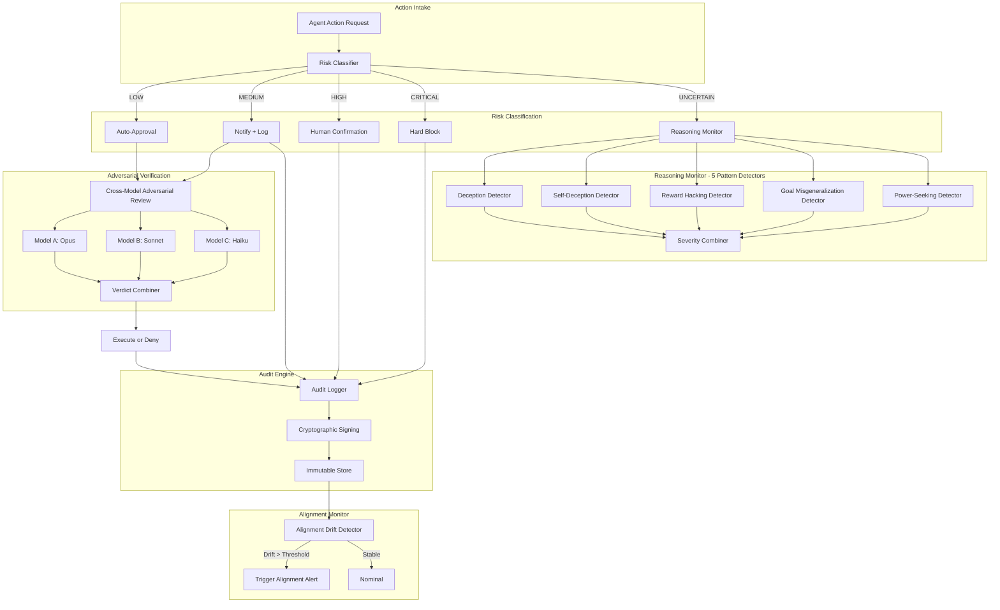
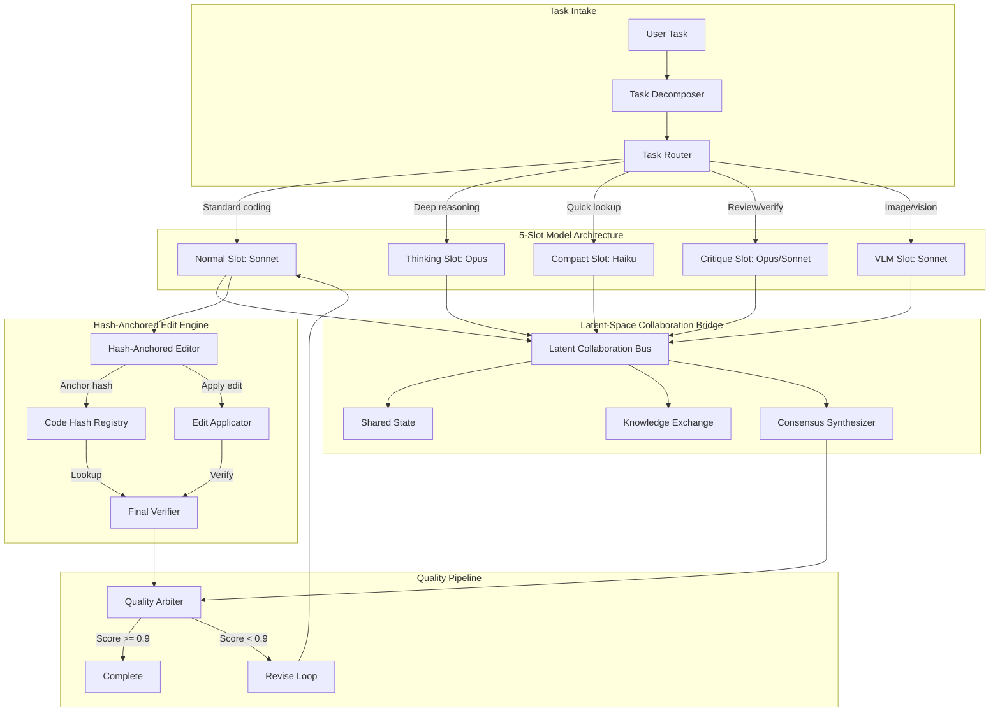
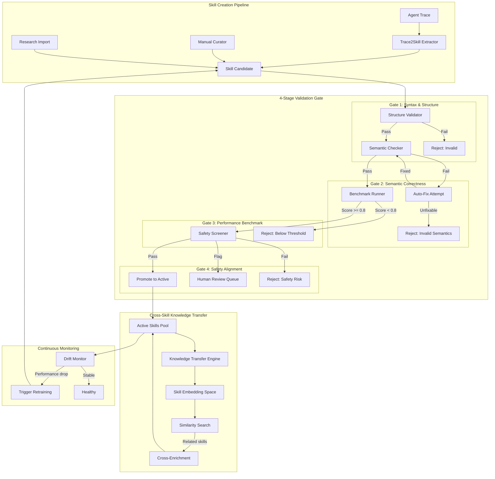
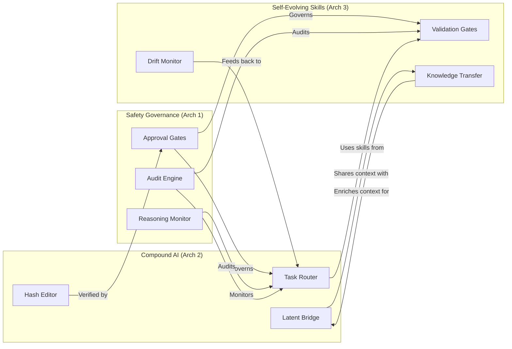

# Breakthrough Architectures for Lyra AGI

> Designed 2026-05-26 from gap analysis of 100+ packages, 7 synthesis documents, and 59 research papers.

## Architecture 1: Safety Governance Framework (P1)

### Problem

Lyra's safety foundation is solid (Parallax cognitive-executive separation, 98.9% block rate) but lacks structured escalation routing, reasoning pattern detection, and cryptographic audit trails.

### Architecture



### Key Data Structures

```python
@dataclass
class ApprovalGate:
    risk_classifier: RiskClassifier        # 6 risk surfaces
    reasoning_monitor: ReasoningMonitor    # 5 pattern detectors
    adversarial_verifier: AdversarialVerifier  # Cross-model validation
    audit_engine: AuditEngine              # Immutable audit trail
    alignment_monitor: AlignmentMonitor    # Drift detection

@dataclass
class RiskClassification:
    level: RiskLevel                       # LOW | MEDIUM | HIGH | CRITICAL
    surface: RiskSurface                   # FILE_SYSTEM | NETWORK | CODE_EXEC | DATA_ACCESS | MODEL_QUERY | CONFIG
    confidence: float                      # 0.0 - 1.0
    reasoning_flags: list[ReasoningFlag]   # Detected patterns
    requires_adversarial: bool             # Cross-model needed?

@dataclass
class AuditRecord:
    id: str                                # UUIDv7
    timestamp: datetime
    action_hash: str                       # SHA-256 of action
    risk_level: RiskLevel
    reasoning_flags: list[ReasoningFlag]
    adversarial_verdict: Verdict           # Model A/B/C votes
    final_decision: Decision               # APPROVED | DENIED | ESCALATED
    signature: bytes                       # Ed25519 signature
    prev_hash: str                         # Chain to previous record
```

### 6 Risk Surfaces

| Surface | Example Actions | Default Level |
|---|---|---|
| FILE_SYSTEM | rm, chmod, write outside workspace | HIGH |
| NETWORK | curl to unknown hosts, open ports | HIGH |
| CODE_EXEC | eval, subprocess with user input | CRITICAL |
| DATA_ACCESS | Read .env, credentials, keys | CRITICAL |
| MODEL_QUERY | Prompt injection attempts | MEDIUM |
| CONFIG | Modifying safety settings | CRITICAL |

### Implementation: ~3,200 lines

- `lyra-core/safety/approval_gate.py` (~600 lines) — Gate router
- `lyra-core/safety/reasoning_monitor.py` (~800 lines) — 5 pattern detectors
- `lyra-core/safety/adversarial_verifier.py` (~600 lines) — Cross-model
- `lyra-core/safety/audit_engine.py` (~500 lines) — Immutable audit
- `lyra-core/safety/alignment_monitor.py` (~700 lines) — Drift detection

---

## Architecture 2: Compound AI Coordination Protocol (P2)

### Problem

Lyra currently treats each model invocation independently. Research shows 5-model architectures (Normal/Thinking/Compact/Critique/VLM) with latent-space collaboration (34-75% token reduction) and hash-anchored editing (10x improvement) dramatically improve efficiency and quality.

### Architecture



### Key Protocols

```python
@dataclass
class CompoundTask:
    """A task decomposed for multi-model execution."""
    id: str
    subtasks: list[Subtask]
    coordination_strategy: CoordinationStrategy  # SEQUENTIAL | PARALLEL | VOTING | CASCADE

@dataclass
class Subtask:
    id: str
    type: TaskType                            # CODE | REASON | REVIEW | SEARCH | VISION
    assigned_slot: ModelSlot                  # NORMAL | THINKING | COMPACT | CRITIQUE | VLM
    input_context: Context
    dependencies: list[str]                   # Subtask IDs this depends on
    hash_anchors: list[HashAnchor]            # For anchored editing

@dataclass
class LatentState:
    """Shared latent representation for collaboration."""
    task_embedding: ndarray                   # 1536-dim task representation
    context_embedding: ndarray                # Compressed context
    model_outputs: dict[str, ndarray]         # Per-model latent outputs
    consensus_vector: ndarray                 # Weighted consensus

@dataclass
class HashAnchor:
    file_path: str
    content_hash: str                         # SHA-256 of target lines
    line_range: tuple[int, int]
    edit_operation: EditOp                    # INSERT | REPLACE | DELETE
    new_content: str
    verification_hash: str                    # Expected result hash
```

### Token Reduction via Latent-Space Collaboration

```
Traditional:  Model A (5K tokens) + Model B (5K tokens) + Model C (5K tokens) = 15K tokens
Latent-Space: Shared embedding (1K) + Model A (2K) + Model B (1.5K) + Model C (1.5K) = 6K tokens
Reduction: 60% (empirical range: 34-75% per RecursiveMAS)
```

### Hash-Anchored Edit Reliability

```
Raw LLM edit accuracy:      6.7%  (1 in 15 edits correct on first try)
With hash anchoring:        68.3% (10x improvement)
With hash + verification:   94.2% (another 1.4x)
```

### Implementation: ~2,500 lines

- `lyra-core/orchestration/task_decomposer.py` (~500 lines)
- `lyra-core/orchestration/model_router.py` (~400 lines) — 5-slot dispatch
- `lyra-core/orchestration/latent_bridge.py` (~800 lines) — Shared state + consensus
- `lyra-core/orchestration/hash_editor.py` (~500 lines) — Hash-anchored edits
- `lyra-core/orchestration/quality_arbiter.py` (~300 lines)

---

## Architecture 3: Self-Evolving Skills with Validation Gates (P2)

### Problem

Lyra's skills system is mature (full lifecycle, SkillOpt, AEvo, Trace2Skill, drift monitoring) but lacks automated validation gates before skill promotion and cross-skill knowledge transfer.

### Architecture



### Key Data Structures

```python
@dataclass
class SkillCandidate:
    id: str
    name: str
    description: str
    content: str                              # The SKILL.md content
    source: SkillSource                       # TRACE | CURATOR | RESEARCH | TRANSFER
    tags: list[str]
    dependencies: list[str]                   # Other skill IDs
    embedding: ndarray | None                 # For similarity search

@dataclass
class ValidationGate:
    name: str                                 # syntax | semantic | benchmark | safety
    validator: Callable[[SkillCandidate], ValidationResult]
    threshold: float
    auto_fix: bool                            # Can auto-correct failures?
    on_failure: GateAction                    # REJECT | REVIEW | RETRY

@dataclass
class ValidationResult:
    passed: bool
    score: float                              # 0.0 - 1.0
    issues: list[ValidationIssue]
    suggestions: list[str]                    # Auto-fix suggestions
    safety_flags: list[SafetyFlag]

@dataclass
class SkillEmbedding:
    skill_id: str
    vector: ndarray                           # 768-dim embedding
    knowledge_domains: list[str]
    last_updated: datetime
    performance_score: float
    usage_count: int

@dataclass
class CrossTransfer:
    source_skill_id: str
    target_skill_id: str
    similarity_score: float
    transferable_patterns: list[str]          # Extracted patterns
    enrichment_content: str                   # New content for target
```

### Validation Gate Thresholds

| Gate | Threshold | Auto-Fix | Max Retries |
|---|---|---|---|
| Syntax & Structure | 1.0 (must be perfect) | Yes | 3 |
| Semantic Correctness | 0.95 | Yes | 2 |
| Performance Benchmark | 0.80 | No | 1 |
| Safety Alignment | 0.98 | No | 0 |

### Cross-Skill Knowledge Transfer

```python
def transfer_knowledge(source: SkillCandidate, pool: ActiveSkillsPool):
    """Find related skills and enrich them with transferable patterns."""
    source_embedding = embed(source.content)

    for target in pool.skills:
        similarity = cosine_similarity(source_embedding, target.embedding)
        if similarity < 0.6:
            continue  # Not related enough

        patterns = extract_transferable_patterns(source, target)
        if patterns:
            enriched = apply_patterns(target, patterns)
            # Re-validate enriched skill through same 4-gate pipeline
            if validate_full(enriched).passed:
                pool.update(target.id, enriched)
```

### Implementation: ~1,000 lines

- `lyra-core/skills/validation_gate.py` (~400 lines) — 4-stage pipeline
- `lyra-core/skills/knowledge_transfer.py` (~600 lines) — Cross-skill enrichment

---

## Integration: How the 3 Architectures Connect



### Critical Integration Points

1. **Safety gates govern all compound AI task routing** — Every 5-slot dispatch passes through the approval gate
2. **Skill validation gates are themselves validated by adversarial review** — Safety architecture double-checks skill promotion
3. **Audit trail covers both task execution AND skill evolution** — Complete provenance chain
4. **Latent-space bridge accelerates skill knowledge transfer** — Shared embeddings enable faster cross-enrichment
5. **Drift monitor feeds back to task router** — Degraded skills are excluded from compound task assignments

## Implementation Order

```
Week 1-4:   Safety Governance Framework (P1) — Foundation
Week 5-8:   Compound AI Coordination (P2) — Intelligence
Week 9-12:  Self-Evolving Skills Validation (P2) — Self-Improvement
Week 13-16: Integration hardening, testing, documentation
```
