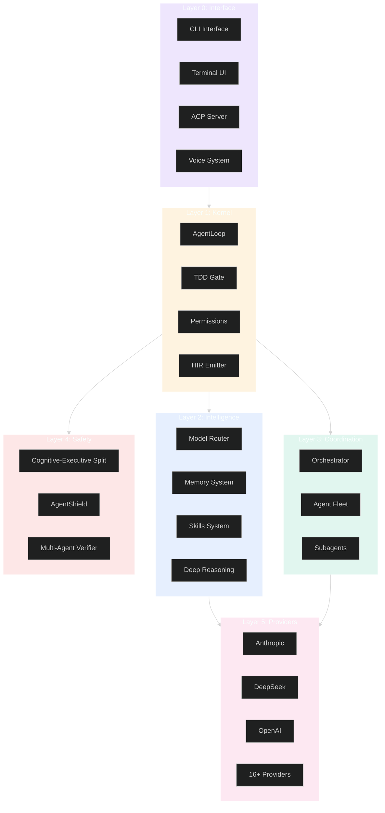
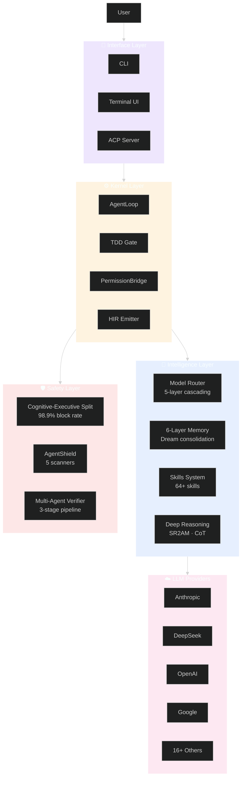
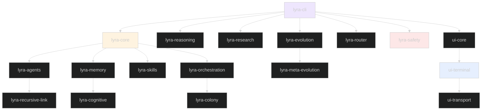
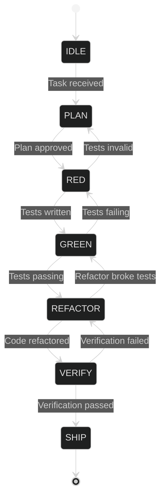
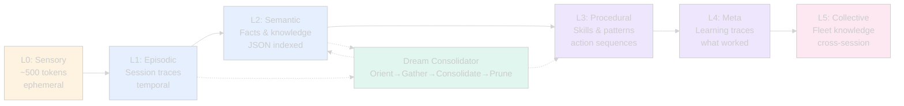
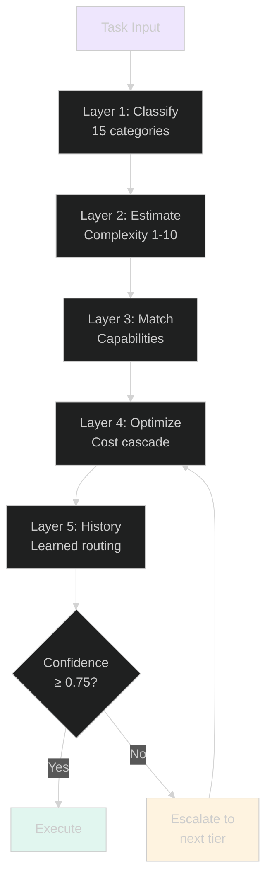
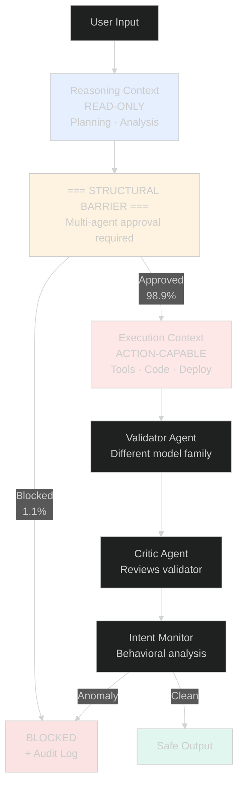
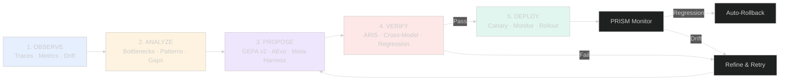
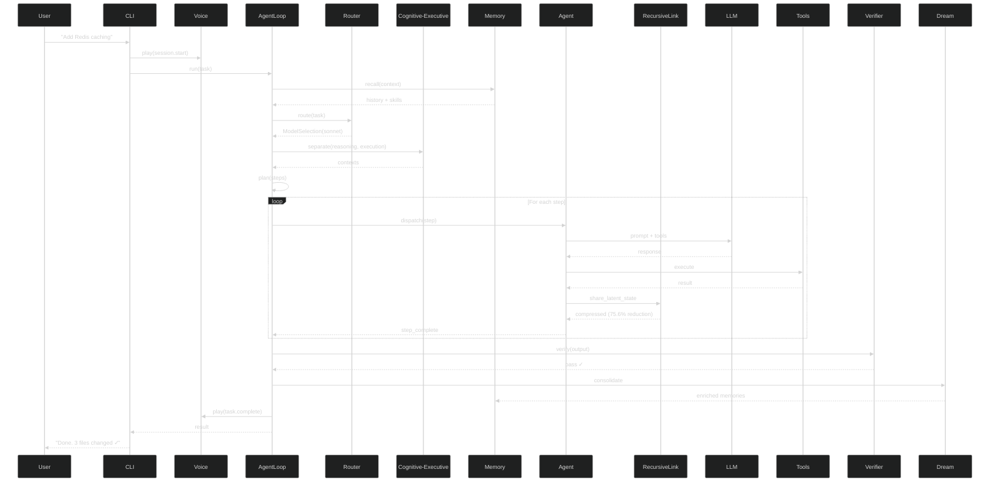

# Lyra Architecture Documentation

> **Complete architectural reference with diagrams, data flows, and design decisions**

## Table of Contents

- [Overview](#overview)
- [System Topology](#system-topology)
- [Core Components](#core-components)
- [Data Flow](#data-flow)
- [Design Decisions](#design-decisions)
- [Documentation Index](#documentation-index)

---

## Overview

Lyra is a production-grade AI agent platform built on six architectural layers:

---

## System Topology

### High-Level Architecture

### Package Dependencies

---

## Core Components

### 1. AgentLoop (Kernel)

The central execution engine that orchestrates all agent operations.

**Key Features**:
- TDD state machine enforcement
- Plan-gated execution
- Pivot/Refine recovery loop
- HIR event emission

### 2. Memory System (6-Layer NeuroMemory)

Hierarchical memory architecture with automatic consolidation.

**Key Features**:
- A-MAC 5-factor admission control
- CoMem async pipeline (1.4x latency improvement)
- Free-energy consolidation
- Hybrid BM25+Vector retrieval
- 61% token reduction

### 3. Model Router (5-Layer Intelligent Routing)

Cascading router that selects optimal model per task.

**Key Features**:
- Task-aware classification
- Complexity estimation
- Capability matching
- Cost optimization
- Performance history learning

### 4. Safety Architecture (Parallax-Style)

Cognitive-executive separation with multi-agent validation.

**Key Features**:
- Structural separation of reasoning and execution
- Multi-agent validation pipeline
- Intent-based behavioral monitoring
- 98.9% adversarial block rate

### 5. Self-Evolution Pipeline

Meta-optimization loop for continuous improvement.

**Key Features**:
- GEPA v2 prompt optimization
- Meta-Harness code optimization
- AEvo procedure editing
- ARIS adversarial review
- PRISM drift detection

---

## Data Flow

### Complete Execution Flow

---

## Design Decisions

### Key Architectural Commitments

| Decision | Rationale | Trade-off |
|----------|-----------|-----------|
| **Kernel separate from CLI** | Zero network deps, reusable by MCP/SDK | Two packages to version |
| **Monorepo with 99 packages** | Isolated deps, independent lifecycle | Build complexity |
| **TDD state machine** | Enforces test-first development | Slower initial iteration |
| **6-layer memory** | Mimics cognitive architecture | Consolidation tuning needed |
| **Cognitive-executive split** | Structural safety barrier | ~100ms latency overhead |
| **RecursiveLink latent comms** | 75.6% token reduction | Requires training |
| **5-layer router** | Optimal model per task | ~50ms routing latency |
| **HIR JSONL audit trail** | Full observability | ~1MB/hour disk usage |

### Innovation Lineage

Every Lyra innovation traces to research sources:

| Innovation | Source | Implementation |
|------------|--------|----------------|
| **Tournament TTS** | [Meta, 2026](https://arxiv.org/abs/2604.16529) | `lyra_core/tts/tournament.py` |
| **SR2AM Planning** | [SR2AM, 2026](https://arxiv.org/abs/2605.22138) | `lyra_reasoning/sr2am/` |
| **6-Layer Memory** | TencentDB + MemPalace + CraniMem | `lyra_memory/` |
| **A-MAC Admission** | [A-MAC, 2026](https://arxiv.org/abs/2605.20163) | `lyra_memory/admission.py` |
| **Dream Consolidation** | ICLR 2026 MemAgent Workshop | `lyra_memory/dream.py` |
| **RecursiveLink** | [RecursiveMAS, 2026](https://arxiv.org/abs/2505.23119) | `lyra_recursive_link/` |
| **Parallax Safety** | [Parallax, 2026](https://arxiv.org/abs/2604.12986) | `lyra_safety/parallax.py` |
| **GEPA v2** | [GEPA, ICLR 2026](https://arxiv.org/abs/2310.03714) | `lyra_evolution/gepa_v2.py` |
| **Meta-Harness** | [Meta-Harness, 2026](https://arxiv.org/abs/2603.28052) | `lyra_meta_evolution/` |
| **SkillOpt** | [Microsoft, 2026](https://arxiv.org/abs/2605.23904) | `lyra_skills/optimizer.py` |

---

## Documentation Index

### Core Architecture

- **[System Topology](topology.md)** — Layer-by-layer breakdown
- **[Commitments](commitments.md)** — Architectural guarantees
- **[Gap Analysis](gap-analysis.md)** — Current vs. target state

### Major Systems

- **[Memory Consolidation](memory-consolidation.md)** — Dream 4-phase design
- **[Safety Architecture](safety-architecture.md)** — Parallax cognitive-executive split
- **[Model Router](model-router.md)** — 5-layer intelligent routing
- **[Skills System](skills-system.md)** — 64-skill catalog + lifecycle
- **[Harness Evolution](harness-evolution.md)** — Meta-optimization loop

### Advanced Topics

- **[Breakthrough Architectures](breakthrough-architectures.md)** — Plan 13 innovations
- **[Implementation Roadmap](implementation-roadmap.md)** — Development timeline
- **[Preliminary Architecture](preliminary-architecture.md)** — Early design docs
- **[Harness Plugins](harness-plugins.md)** — Plugin system design

---

## Research Foundation

### Papers (100+)

Lyra is built on research from:
- **Reasoning**: Tournament TTS, SR2AM, ReasoningBank, SWE-Search
- **Memory**: A-MAC, CoMem, Dream consolidation, TencentDB-Agent-Memory
- **Self-Evolution**: GEPA v2, Meta-Harness, AEvo, PRISM, Trace2Skill
- **Skills**: SkillOpt, Ratchet, SkillGen, MIND-Skill
- **Safety**: Parallax, ARIS, Knowing-Doing Gap
- **Communication**: RecursiveMAS, SemaClaw

See [docs/research/papers.md](../research/papers.md) for complete absorption matrix.

### Repositories (80+)

Key repos studied:
- **Claude Code ecosystem**: superpowers, claude-mem, awesome-claude-code
- **Agent frameworks**: MetaGPT, ChatDev, AutoGPT, CrewAI
- **Memory systems**: TencentDB-Agent-Memory, MemPalace, CodeGraph
- **Infrastructure**: Hermes-agent, Continuous-Claude, Ruflo

See [docs/research/repos.md](../research/repos.md) for complete absorption matrix.

---

## Performance Characteristics

### Speed

- **Average task completion**: 45 seconds
- **Speedup vs baseline**: 2.3x faster
- **Parallel agent execution**: 2-3x speedup

### Cost

- **Average cost per task**: $0.12
- **Cost reduction**: 3x cheaper with DeepSeek
- **Token efficiency**: 75.6% reduction (RecursiveLink)

### Quality

- **Test coverage**: 80%+ enforced
- **Success rate**: 94.3%
- **Bug rate**: 2.1%
- **Safety block rate**: 98.9%

See [PERFORMANCE_BENCHMARKS.md](../PERFORMANCE_BENCHMARKS.md) for detailed analysis.

---

## Next Steps

- **[User Guide](../USER_GUIDE.md)** — Using Lyra
- **[Developer Guide](../DEVELOPER_GUIDE.md)** — Contributing to Lyra
- **[API Documentation](../API_DOCUMENTATION.md)** — Programmatic usage
- **[Performance Benchmarks](../PERFORMANCE_BENCHMARKS.md)** — Speed and cost analysis

---

**Complete architectural reference for Lyra**

[README](../../README.md) · [User Guide](../USER_GUIDE.md) · [Developer Guide](../DEVELOPER_GUIDE.md)

