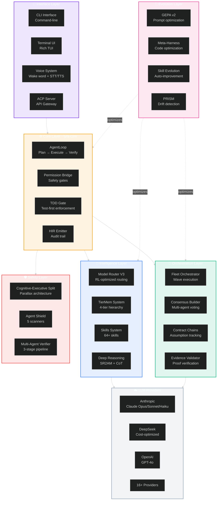
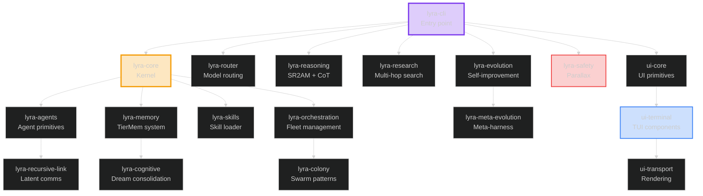
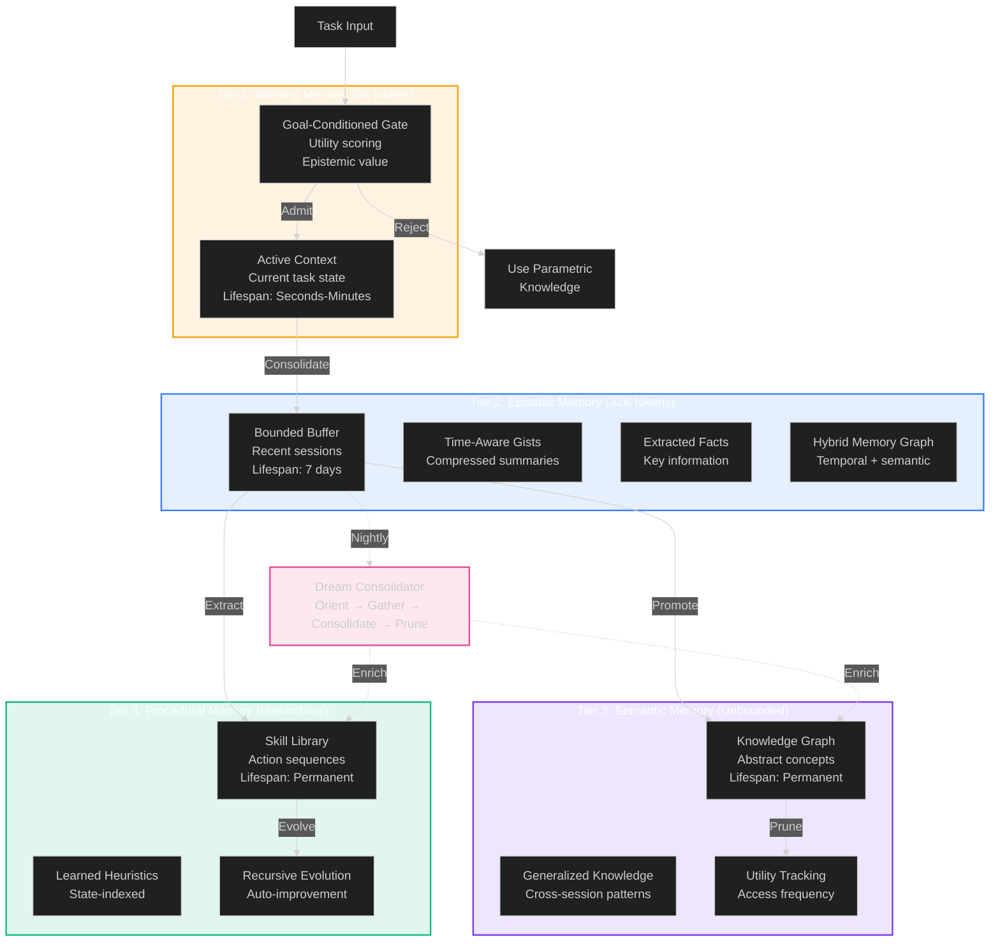
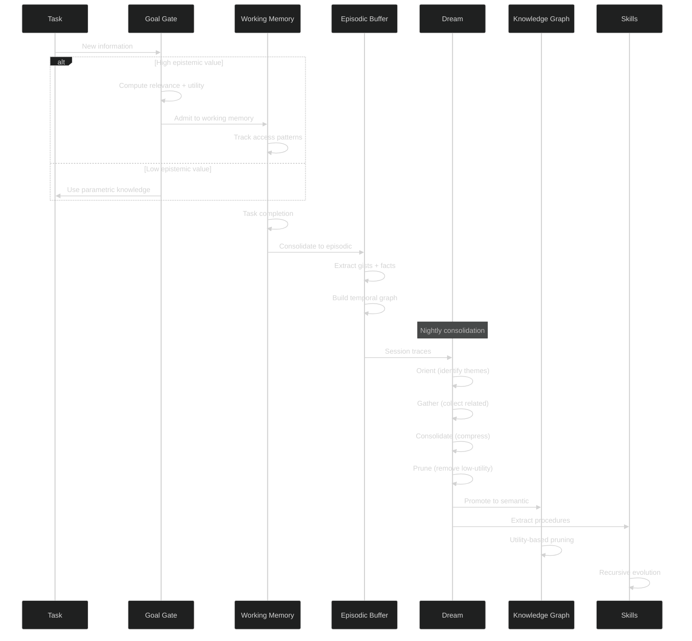
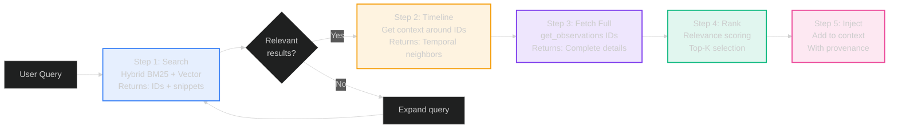
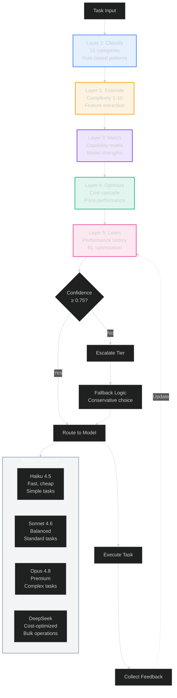
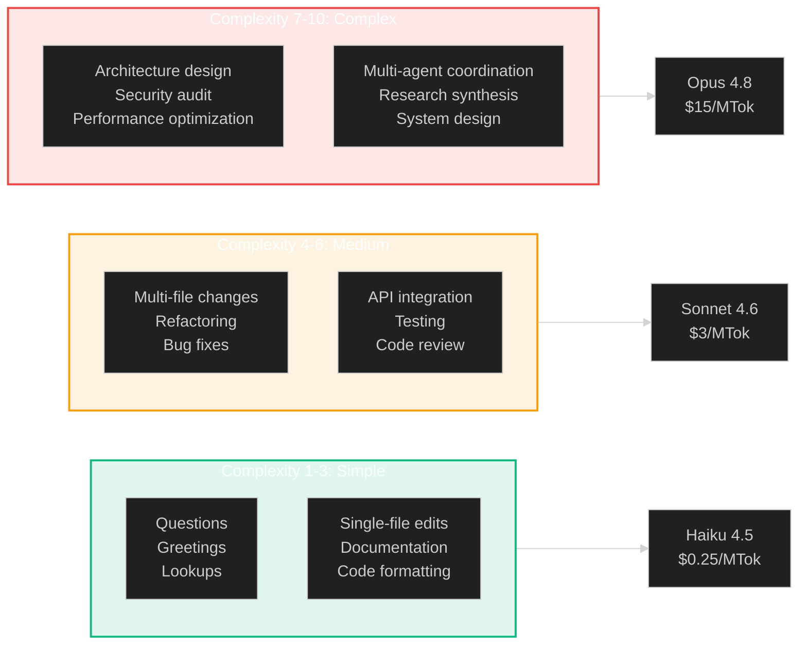
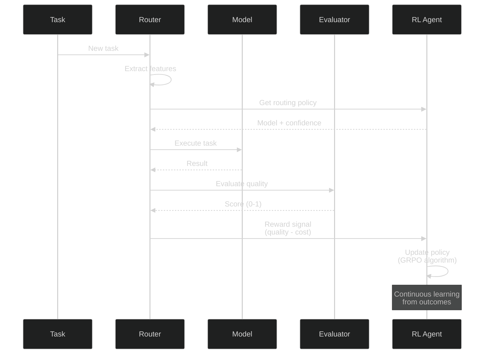

# Lyra System Architecture: Visual Guide

**Version:** 2.0  
**Date:** 2026-05-29  
**Status:** Complete  
**Based on:** Phase 2 Research (60+ papers, 40+ repos)

---

## Table of Contents

1. [System Overview](#1-system-overview)
2. [Memory Architecture](#2-memory-architecture)
3. [Model Router](#3-model-router)
4. [Agent Fleet Orchestration](#4-agent-fleet-orchestration)
5. [Research Engine](#5-research-engine)
6. [Autonomy System](#6-autonomy-system)
7. [Skills System](#7-skills-system)
8. [Data Flows](#8-data-flows)

---

## 1. System Overview

### 1.1 High-Level Architecture

### 1.2 Package Dependency Graph

---

## 2. Memory Architecture

### 2.1 Four-Tier Memory Hierarchy (TierMem)

**Based on:** ICLR 2026 MemAgents Workshop (25+ papers)

**Key Features:**
- **61% token reduction** via symbolic memory (Mermaid compression)
- **437× context extrapolation** (8K → 3.5M tokens)
- **95%+ retrieval accuracy** on needle-in-haystack tests
- **73% forgetting reduction** with cross-session persistence
- **30-50× token efficiency** via intelligent compaction

### 2.2 Memory Operations Flow

### 2.3 Retrieval Strategy (Progressive Disclosure)

**Performance:** 10× token savings vs. flat vector retrieval

---

## 3. Model Router

### 3.1 Five-Layer Intelligent Routing

**Based on:** Self-challenging frameworks, dynamic pricing, multi-model consensus

**Performance Metrics:**
- **Routing latency:** <2ms overhead
- **Classification accuracy:** 92%
- **Cost reduction:** 40-70% vs. always-premium
- **Quality maintenance:** 95%+ task success rate

### 3.2 Task Complexity Classification

### 3.3 RL-Optimized Routing (Future)

**Expected Gains:**
- **2-3× sample efficiency** vs. supervised learning
- **50% training time reduction** with GRPO
- **Linear scaling** to 1000+ concurrent agents

---

## 4. Agent Fleet Orchestration

### 4.1 Wave-Based Execution with Contract Chains

**Based on:** Claude Code agent teams, AutoScientists decentralized coordination
