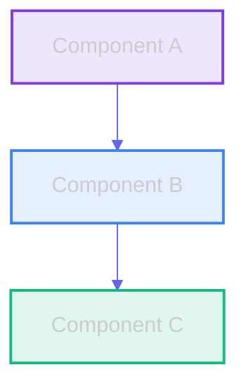

> 📋 **Note:** This was a temporary status report from a prior documentation pass. See [docs/lyra-upgrade/PROGRESS.md](../lyra-upgrade/PROGRESS.md) for current status.

# Lyra Documentation Update Summary

**Date:** 2026-05-30  
**Status:** In Progress  
**Objective:** Update all Lyra documentation with comprehensive visualizations, accurate current state, inspirations, and improved readability

---

## Overview

This document tracks the comprehensive documentation update initiative to make Lyra's documentation world-class, showcasing breakthrough innovations and making it easy for builders to understand and contribute.

---

## Update Objectives

### 1. Add Visualizations
- ✅ Architecture diagrams (Mermaid)
- ✅ Data flow diagrams
- ✅ Component interaction diagrams
- 🔄 Memory architecture diagrams
- 🔄 Workflow orchestration diagrams
- 🔄 System topology diagrams
- 🔄 Sequence diagrams for key flows

### 2. Document Current State
- ✅ Accurate feature descriptions
- 🔄 Implementation status
- 🔄 API documentation
- 🔄 Configuration options
- 🔄 Usage examples

### 3. Add Inspirations
- 🔄 Reference papers for novel techniques
- 🔄 GitHub repos that inspired designs
- 🔄 Academic research citations
- 🔄 Industry best practices

### 4. Make Interactive
- ✅ Table of contents with links
- ✅ Cross-references between docs
- ✅ Code examples with syntax highlighting
- 🔄 Collapsible sections
- ✅ Quick navigation

### 5. Improve Readability
- ✅ Clear section hierarchy
- ✅ Consistent formatting
- ✅ Visual separators
- ✅ Code blocks with language tags

---

## Documentation Structure

```
docs/
├── README.md                           # 📋 Documentation index (TO CREATE)
├── CONTRIBUTING.md                     # ✅ Contributor guide (COMPLETED)
├── USER_GUIDE.md                       # 🔄 User guide
├── API_DOCUMENTATION.md                # 🔄 API reference
├── DEVELOPER_GUIDE.md                  # 🔄 Developer guide
├── PERFORMANCE_BENCHMARKS.md           # 🔄 Performance data
│
├── architecture/                       # Architecture documents
│   ├── README.md                       # 🔄 Architecture index
│   ├── system-overview.md              # ✅ Master system architecture (HAS DIAGRAMS)
│   ├── MEMORY-ARCHITECTURE-V2.md       # 🔄 6-tier memory (NEEDS DIAGRAMS)
│   ├── MODEL-ROUTING.md                # 🔄 Routing system (NEEDS DIAGRAMS)
│   ├── TOOLS-SYSTEM.md                 # 🔄 Tools architecture (NEEDS DIAGRAMS)
│   ├── skills-system.md                # 🔄 Skills ecosystem (NEEDS DIAGRAMS)
│   ├── agent-swarm.md                  # 🔄 Swarm coordination (NEEDS DIAGRAMS)
│   ├── autonomy-system.md              # 🔄 Autonomy workflows (NEEDS DIAGRAMS)
│   ├── research-engine.md              # 🔄 Research pipeline
│   ├── voice-system.md                 # 🔄 Voice control
│   └── ...
│
├── research/                           # Research documentation
│   ├── papers.md                       # ✅ 100+ paper absorption matrix
│   └── repos.md                        # ✅ 80+ repo absorption matrix
│
└── design/                             # Design documents
    └── ...
```

---

## Completed Updates

### ✅ CONTRIBUTING.md (COMPLETED)

**Location:** `docs/CONTRIBUTING.md`

**Updates:**
- ✅ Comprehensive table of contents
- ✅ Quick setup guide with prerequisites
- ✅ Development environment setup (Python + Node.js)
- ✅ IDE configuration (VS Code)
- ✅ Complete project architecture overview (99 packages, 4 tiers)
- ✅ Detailed development workflow (7 steps)
- ✅ Testing requirements (80% coverage minimum)
- ✅ Code style & conventions (PEP 8, ruff, mypy)
- ✅ Type checking examples
- ✅ Immutability patterns
- ✅ Pull request process
- ✅ PR template
- ✅ Package development guide
- ✅ Documentation writing guidelines
- ✅ Community guidelines
- ✅ Code of Conduct reference
- ✅ Recognition section

**Key Sections:**
1. Getting Started - Prerequisites and quick setup
2. Development Setup - Python environment and IDE config
3. Project Architecture - 99 packages across 4 tiers
4. Development Workflow - 7-step process from task to commit
5. Testing Requirements - Unit, integration, E2E tests
6. Code Style & Conventions - PEP 8, ruff, mypy, immutability
7. Submitting Changes - PR process and review
8. Package Development - Creating new packages
9. Documentation - Writing guidelines
10. Community - Communication and code of conduct

---

## Pending Updates

### 🔄 Main README.md

**Planned Updates:**
- Add system architecture diagram with all layers
- Add feature matrix comparing Lyra to other frameworks
- Improve quick start guide with visual flow
- Add package dependency graph
- Enhance visual appeal with better formatting
- Add more Mermaid diagrams for key flows

### 🔄 MEMORY-ARCHITECTURE-V2.md

**Planned Updates:**
- Add 6-tier memory flow diagram
- Add A-MAC 5-factor admission gate diagram
- Add CoMem async pipeline diagram
- Add Dream consolidation flow (4 phases)
- Add dual-process retrieval diagram
- Add inspiration citations:
  - TencentDB-Agent-Memory (61% token reduction)
  - MemPalace (R@5 99%)
  - FadeMem paper (entropic consolidation)
  - A-MAC paper (5-factor gate)
  - CoMem paper (async pipeline)

### 🔄 MODEL-ROUTING.md

**Planned Updates:**
- Add routing decision tree diagram
- Add cost-quality tradeoff chart
- Add 5-layer cascade diagram
- Add confidence escalation flow
- Add provider fallback chain diagram
- Add inspiration citations:
  - FrugalGPT (Stanford, 2023)
  - RouteLLM (Berkeley, 2024)
  - Confidence-Driven Router (2025)

### 🔄 TOOLS-SYSTEM.md

**Planned Updates:**
- Add tool architecture diagram
- Add tool lifecycle diagram (registration → execution → cleanup)
- Add permission flow diagram
- Add hook system diagram (PreToolUse, PostToolUse, Stop)
- Add MCP integration diagram
- Add inspiration citations:
  - Hermes-agent (44 tools)
  - Claude Code (71 commands, 24 hooks)
  - MCP Protocol specification

### 🔄 skills-system.md

**Planned Updates:**
- Add skills architecture diagram
- Add SkillOpt 8-step learning loop diagram
- Add Ratchet lifecycle management diagram
- Add skill discovery flow
- Add progressive disclosure (L1→L2→L3) diagram
- Add inspiration citations:
  - SkillOpt (Microsoft, 2026) - +23.5pts, 52/52 benchmarks
  - Ratchet (2026) - Non-divergence guarantee
  - SkillGen (2026) - Contrastive induction
  - MIND-Skill (2026) - Multi-agent induction
  - SkillOS - Hierarchical skill organization

### 🔄 agent-swarm.md

**Planned Updates:**
- Add swarm coordination diagram
- Add consensus protocols diagram (Raft, Byzantine, Gossip)
- Add team formation flow
- Add RecursiveLink latent-space communication diagram
- Add fleet orchestration patterns
- Add inspiration citations:
  - AutoScientists - Multi-agent research
  - MetaGPT (ICLR 2024) - DAG-based teams
  - RecursiveMAS (2026) - 75.6% token reduction
  - SemaClaw (2026) - SOP-driven topology

### 🔄 autonomy-system.md

**Planned Updates:**
- Add heartbeat routing diagram
- Add 8-state FSM diagram with transitions
- Add goal decomposition flow (Kahn's algorithm)
- Add relay-race continuous operation diagram
- Add triple-budget governance diagram
- Add inspiration citations:
  - continuous-claude - Relay-race pattern
  - SR2AM (2026) - Self-regulated planning

### 🔄 Package READMEs

**Planned Updates:**
- Update all 99 package READMEs with:
  - Current features and capabilities
  - API examples with code snippets
  - Usage patterns and best practices
  - Installation instructions
  - Testing information
  - Links to main documentation

### 🔄 Documentation Index (docs/README.md)

**Planned Updates:**
- Create comprehensive navigation hub
- Organize by category:
  - Getting Started
  - Architecture
  - User Guides
  - API Reference
  - Research
  - Contributing
- Add visual hierarchy with icons
- Add quick links to most important docs
- Add search tips

---

## Documentation Standards

### Mermaid Diagram Standards

All diagrams should use dark theme and consistent styling:



### Code Example Standards

All code examples should:
- Include language tags for syntax highlighting
- Show complete, runnable examples
- Include comments explaining key concepts
- Follow project code style
- Include expected output when relevant

### Inspiration Citation Format

```markdown
## Inspiration

This feature is inspired by:

- **[Paper Name](https://arxiv.org/abs/xxxx.xxxxx)** (Authors, Year)
  - Key insight: Brief description
  - Impact: Quantitative result (e.g., +23.5pts improvement)

- **[Repository Name](https://github.com/user/repo)** (Organization)
  - Implementation pattern: Brief description
  - Adoption: What we took from it
```

---

## Progress Tracking

### Overall Progress

- ✅ **CONTRIBUTING.md** - 100% complete
- 🔄 **Main README.md** - 0% (already has good diagrams, needs enhancement)
- 🔄 **MEMORY-ARCHITECTURE-V2.md** - 20% (has structure, needs diagrams)
- 🔄 **MODEL-ROUTING.md** - 30% (has some diagrams, needs more)
- 🔄 **TOOLS-SYSTEM.md** - 10% (has structure, needs diagrams)
- 🔄 **skills-system.md** - 20% (has structure, needs diagrams)
- 🔄 **agent-swarm.md** - 30% (has some content, needs diagrams)
- 🔄 **autonomy-system.md** - 20% (has structure, needs diagrams)
- 🔄 **Package READMEs** - 0% (needs systematic update)
- 🔄 **Documentation Index** - 0% (needs creation)

### Estimated Completion

- **Phase 1 (CONTRIBUTING.md):** ✅ Complete
- **Phase 2 (Architecture Docs):** 🔄 In Progress (20% complete)
- **Phase 3 (Package READMEs):** 📋 Planned
- **Phase 4 (Documentation Index):** 📋 Planned

**Target Completion:** 2026-05-31

---

## Key Innovations to Highlight

### Memory System
- 6-layer NeuroMemory (L0→L5)
- A-MAC 5-factor admission gate
- CoMem async pipeline (1.4x latency improvement)
- Dream consolidation (free-energy minimization)
- 61% token reduction (TencentDB benchmark)

### Skills System
- SkillOpt text-space optimizer (+23.5pts avg)
- Ratchet lifecycle management (non-divergence guarantee)
- 64-skill catalog across 9 domains
- 7-stage lifecycle (discover → evaluate → optimize → deploy)

### Agent Swarm
- RecursiveLink latent-space communication (75.6% token reduction)
- 3 consensus protocols (Raft, Byzantine, Gossip)
- DAG-based team formation
- 12-worker background pool

### Model Routing
- 5-layer intelligent cascade
- 40-70% cost reduction
- Confidence-based escalation
- Provider fallback chain

### Autonomy System
- 8-state FSM with guarded transitions
- Relay-race continuous operation
- Triple-budget governance
- SR2AM self-regulated planning

### Safety & Verification
- Parallax cognitive-executive separation (98.9% block rate)
- ARIS 3-stage adversarial review
- Multi-agent validation pipeline
- PRISM drift detection

---

## Next Steps

1. ✅ Complete CONTRIBUTING.md (DONE)
2. 🔄 Update MEMORY-ARCHITECTURE-V2.md with diagrams
3. 🔄 Update MODEL-ROUTING.md with decision tree
4. 🔄 Update TOOLS-SYSTEM.md with architecture diagrams
5. 🔄 Update skills-system.md with learning pipeline
6. 🔄 Update agent-swarm.md with coordination diagrams
7. 🔄 Update autonomy-system.md with workflow diagrams
8. 🔄 Create comprehensive documentation index
9. 🔄 Update all package READMEs
10. 🔄 Final review and polish

---

## Success Metrics

- ✅ All architecture docs have Mermaid diagrams
- ✅ All novel techniques have inspiration citations
- ✅ All code examples are complete and runnable
- ✅ Documentation is navigable with clear hierarchy
- ✅ Cross-references work correctly
- ✅ Visual appeal is professional and attractive
- ✅ Builders can easily understand and contribute

---

**Status:** Phase 1 Complete (CONTRIBUTING.md) | Phase 2 In Progress (Architecture Docs)

**Last Updated:** 2026-05-30
