# Agent Orchestration Architecture

**Version:** 2.0  
**Date:** 2026-05-30  
**Status:** Production

---

## Executive Summary

Lyra's agent orchestration system enables sophisticated multi-agent coordination through contract chains, evidence-based validation, wave-based execution, and self-claiming task models. The system supports 5 execution patterns, 4 consensus methods, and dynamic team formation for autonomous research and experimentation.

### Key Capabilities

1. **Contract Chain System**: Formal agreements between agents with validation
2. **Evidence-Based Validation**: Proof-of-work verification before acceptance
3. **Wave-Based Execution**: Parallel execution in dependency-ordered waves
4. **Self-Claiming Task Model**: Agents autonomously select tasks based on capability
5. **Dynamic Team Formation**: Teams form around hypotheses and reorganize when stagnated

---

## Architecture Overview

### Agent Orchestration Layers

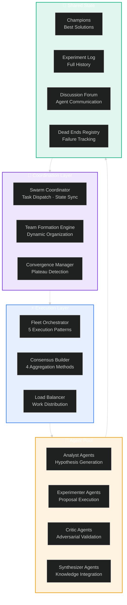
```mermaid
%%{init: {'theme': 'dark'}}%%
graph TB
    subgraph Coordination["🎯 Coordination Layer"]
        Swarm[Swarm Coordinator<br/>Task Dispatch · State Sync]
        TeamEngine[Team Formation Engine<br/>Dynamic Organization]
        Convergence[Convergence Manager<br/>Plateau Detection]
    end
    
    subgraph Execution["⚡ Execution Layer"]
        Fleet[Fleet Orchestrator<br/>5 Execution Patterns]
        Consensus[Consensus Builder<br/>4 Aggregation Methods]
        LoadBalancer[Load Balancer<br/>Work Distribution]
    end
    
    subgraph Agents["🤖 Agent Pool"]
        Analysts[Analyst Agents<br/>Hypothesis Generation]
        Experimenters[Experimenter Agents<br/>Proposal Execution]
        Critics[Critic Agents<br/>Adversarial Validation]
        Synthesizers[Synthesizer Agents<br/>Knowledge Integration]
    end
    
    subgraph State["💾 Shared State"]
        Champions[Champions<br/>Best Solutions]
        ExpLog[Experiment Log<br/>Full History]
        Forum[Discussion Forum<br/>Agent Communication]
        DeadEnds[Dead Ends Registry<br/>Failure Tracking]
    end
    
    Coordination --> Execution
    Execution --> Agents
    Agents --> State
    State --> Coordination
    
    style Coordination fill:#7c3aed20,stroke:#7c3aed,stroke-width:2px
    style Execution fill:#3b82f620,stroke:#3b82f6,stroke-width:2px
    style Agents fill:#f59e0b20,stroke:#f59e0b,stroke-width:2px
    style State fill:#10b98120,stroke:#10b981,stroke-width:2px
```

---

## Contract Chain System

### Contract Lifecycle

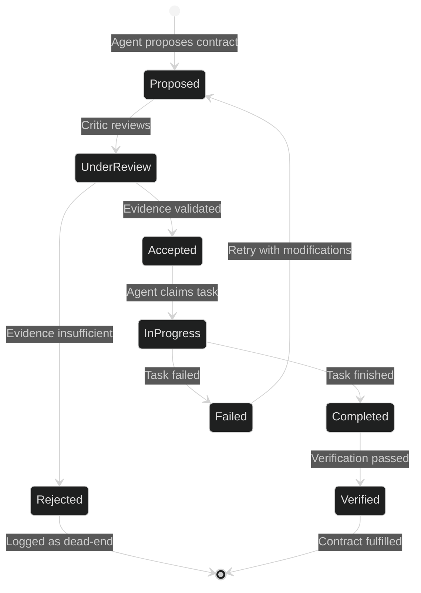
```mermaid
%%{init: {'theme': 'dark'}}%%
stateDiagram-v2
    [*] --> Proposed: Agent proposes contract
    Proposed --> UnderReview: Critic reviews
    UnderReview --> Accepted: Evidence validated
    UnderReview --> Rejected: Evidence insufficient
    Accepted --> InProgress: Agent claims task
    InProgress --> Completed: Task finished
    InProgress --> Failed: Task failed
    Completed --> Verified: Verification passed
    Failed --> Proposed: Retry with modifications
    Rejected --> [*]: Logged as dead-end
    Verified --> [*]: Contract fulfilled
```

### Contract Structure

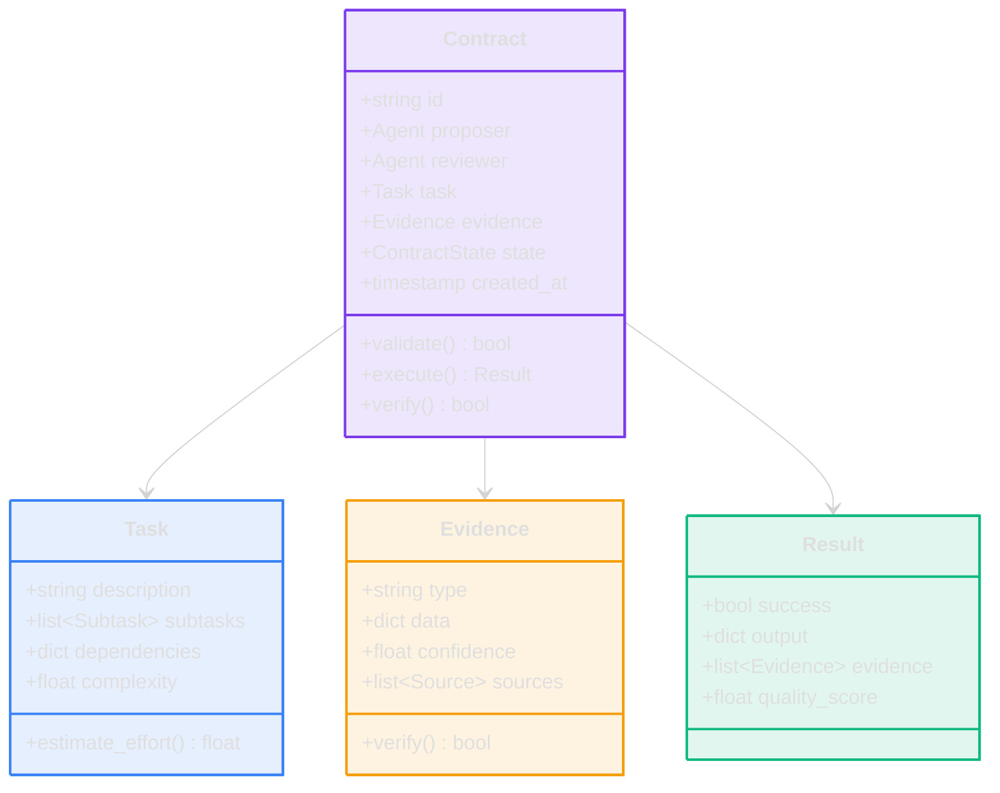
```mermaid
%%{init: {'theme': 'dark'}}%%
classDiagram
    class Contract {
        +string id
        +Agent proposer
        +Agent reviewer
        +Task task
        +Evidence evidence
        +ContractState state
        +timestamp created_at
        +validate() bool
        +execute() Result
        +verify() bool
    }
    
    class Task {
        +string description
        +list~Subtask~ subtasks
        +dict dependencies
        +float complexity
        +estimate_effort() float
    }
    
    class Evidence {
        +string type
        +dict data
        +float confidence
        +list~Source~ sources
        +verify() bool
    }
    
    class Result {
        +bool success
        +dict output
        +list~Evidence~ evidence
        +float quality_score
    }
    
    Contract --> Task
    Contract --> Evidence
    Contract --> Result
    
    style Contract fill:#7c3aed20,stroke:#7c3aed,stroke-width:2px
    style Task fill:#3b82f620,stroke:#3b82f6,stroke-width:2px
    style Evidence fill:#f59e0b20,stroke:#f59e0b,stroke-width:2px
    style Result fill:#10b98120,stroke:#10b981,stroke-width:2px
```

### Evidence-Based Validation

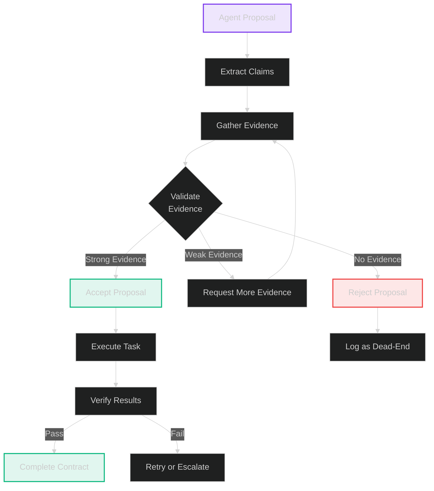
```mermaid
%%{init: {'theme': 'dark'}}%%
flowchart TD
    Proposal[Agent Proposal] --> Extract[Extract Claims]
    Extract --> Evidence[Gather Evidence]
    Evidence --> Validate{Validate<br/>Evidence}
    
    Validate -->|Strong Evidence| Accept[Accept Proposal]
    Validate -->|Weak Evidence| Request[Request More Evidence]
    Validate -->|No Evidence| Reject[Reject Proposal]
    
    Request --> Evidence
    
    Accept --> Execute[Execute Task]
    Reject --> DeadEnd[Log as Dead-End]
    
    Execute --> Verify[Verify Results]
    Verify -->|Pass| Complete[Complete Contract]
    Verify -->|Fail| Retry[Retry or Escalate]
    
    style Proposal fill:#7c3aed20,stroke:#7c3aed,stroke-width:2px
    style Accept fill:#10b98120,stroke:#10b981,stroke-width:2px
    style Reject fill:#ef444420,stroke:#ef4444,stroke-width:2px
    style Complete fill:#10b98120,stroke:#10b981,stroke-width:2px
```

---

## Wave-Based Execution

### Dependency-Ordered Waves

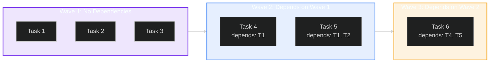
```mermaid
%%{init: {'theme': 'dark'}}%%
graph LR
    subgraph Wave1["Wave 1: No Dependencies"]
        T1[Task 1]
        T2[Task 2]
        T3[Task 3]
    end
    
    subgraph Wave2["Wave 2: Depends on Wave 1"]
        T4[Task 4<br/>depends: T1]
        T5[Task 5<br/>depends: T1, T2]
    end
    
    subgraph Wave3["Wave 3: Depends on Wave 2"]
        T6[Task 6<br/>depends: T4, T5]
    end
    
    Wave1 --> Wave2
    Wave2 --> Wave3
    
    style Wave1 fill:#7c3aed20,stroke:#7c3aed,stroke-width:2px
    style Wave2 fill:#3b82f620,stroke:#3b82f6,stroke-width:2px
    style Wave3 fill:#f59e0b20,stroke:#f59e0b,stroke-width:2px
```

### Wave Execution Flow

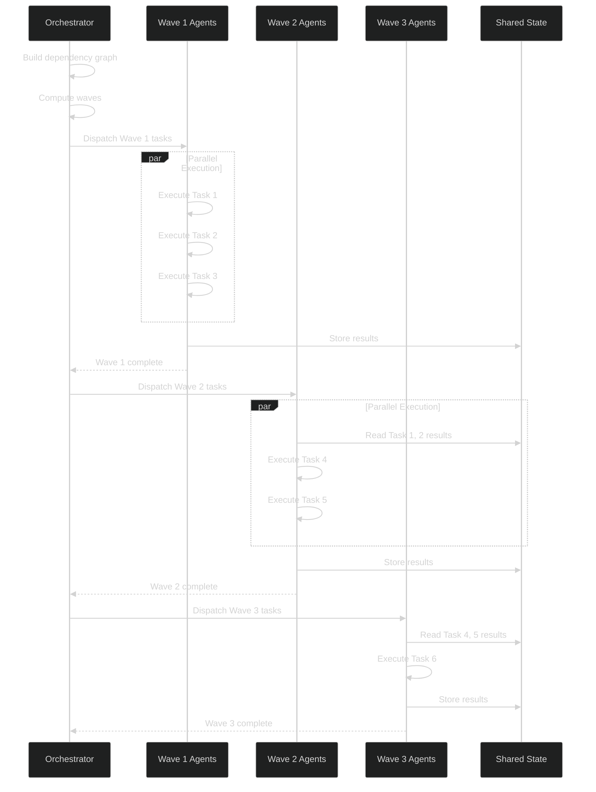
```mermaid
%%{init: {'theme': 'dark'}}%%
sequenceDiagram
    participant Orchestrator
    participant Wave1 as Wave 1 Agents
    participant Wave2 as Wave 2 Agents
    participant Wave3 as Wave 3 Agents
    participant State as Shared State
    
    Orchestrator->>Orchestrator: Build dependency graph
    Orchestrator->>Orchestrator: Compute waves
    
    Orchestrator->>Wave1: Dispatch Wave 1 tasks
    
    par Parallel Execution
        Wave1->>Wave1: Execute Task 1
        Wave1->>Wave1: Execute Task 2
        Wave1->>Wave1: Execute Task 3
    end
    
    Wave1->>State: Store results
    Wave1-->>Orchestrator: Wave 1 complete
    
    Orchestrator->>Wave2: Dispatch Wave 2 tasks
    
    par Parallel Execution
        Wave2->>State: Read Task 1, 2 results
        Wave2->>Wave2: Execute Task 4
        Wave2->>Wave2: Execute Task 5
    end
    
    Wave2->>State: Store results
    Wave2-->>Orchestrator: Wave 2 complete
    
    Orchestrator->>Wave3: Dispatch Wave 3 tasks
    Wave3->>State: Read Task 4, 5 results
    Wave3->>Wave3: Execute Task 6
    Wave3->>State: Store results
    Wave3-->>Orchestrator: Wave 3 complete
```

---

## Self-Claiming Task Model

### Task Claiming Process

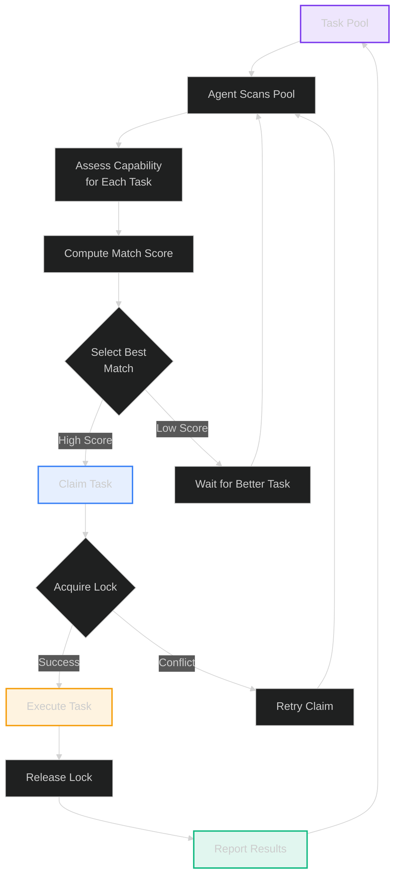
```mermaid
%%{init: {'theme': 'dark'}}%%
flowchart TD
    Pool[Task Pool] --> Agent[Agent Scans Pool]
    Agent --> Assess[Assess Capability<br/>for Each Task]
    Assess --> Score[Compute Match Score]
    Score --> Select{Select Best<br/>Match}
    
    Select -->|High Score| Claim[Claim Task]
    Select -->|Low Score| Wait[Wait for Better Task]
    
    Claim --> Lock{Acquire Lock}
    Lock -->|Success| Execute[Execute Task]
    Lock -->|Conflict| Retry[Retry Claim]
    
    Execute --> Release[Release Lock]
    Release --> Report[Report Results]
    Report --> Pool
    
    Wait --> Agent
    Retry --> Agent
    
    style Pool fill:#7c3aed20,stroke:#7c3aed,stroke-width:2px
    style Claim fill:#3b82f620,stroke:#3b82f6,stroke-width:2px
    style Execute fill:#f59e0b20,stroke:#f59e0b,stroke-width:2px
    style Report fill:#10b98120,stroke:#10b981,stroke-width:2px
```

### Capability Matching

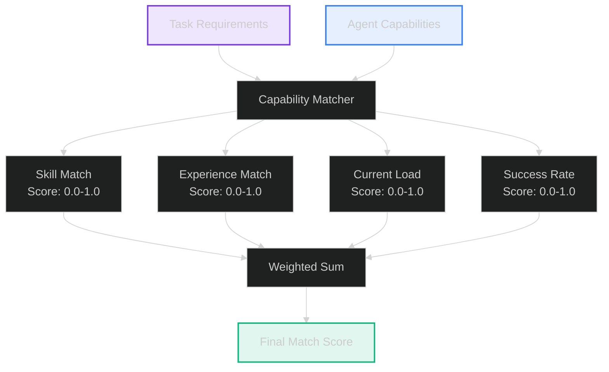
```mermaid
%%{init: {'theme': 'dark'}}%%
graph TB
    Task[Task Requirements] --> Match[Capability Matcher]
    Agent[Agent Capabilities] --> Match
    
    Match --> Skills[Skill Match<br/>Score: 0.0-1.0]
    Match --> Experience[Experience Match<br/>Score: 0.0-1.0]
    Match --> Load[Current Load<br/>Score: 0.0-1.0]
    Match --> Success[Success Rate<br/>Score: 0.0-1.0]
    
    Skills --> Weighted[Weighted Sum]
    Experience --> Weighted
    Load --> Weighted
    Success --> Weighted
    
    Weighted --> Final[Final Match Score]
    
    style Task fill:#7c3aed20,stroke:#7c3aed,stroke-width:2px
    style Agent fill:#3b82f620,stroke:#3b82f6,stroke-width:2px
    style Final fill:#10b98120,stroke:#10b981,stroke-width:2px
```

---

## Execution Patterns

### 1. Fan-Out Pattern

**Use Case:** Parallel independent tasks

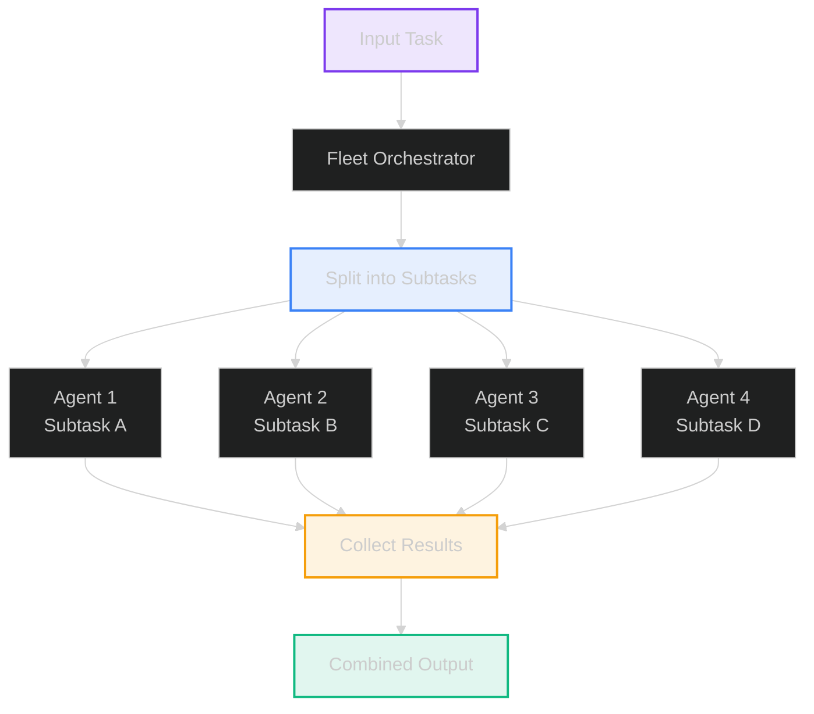
```mermaid
%%{init: {'theme': 'dark'}}%%
graph TB
    Input[Input Task] --> Orchestrator[Fleet Orchestrator]
    Orchestrator --> Split[Split into Subtasks]
    
    Split --> A1[Agent 1<br/>Subtask A]
    Split --> A2[Agent 2<br/>Subtask B]
    Split --> A3[Agent 3<br/>Subtask C]
    Split --> A4[Agent 4<br/>Subtask D]
    
    A1 --> Collect[Collect Results]
    A2 --> Collect
    A3 --> Collect
    A4 --> Collect
    
    Collect --> Output[Combined Output]
    
    style Input fill:#7c3aed20,stroke:#7c3aed,stroke-width:2px
    style Split fill:#3b82f620,stroke:#3b82f6,stroke-width:2px
    style Collect fill:#f59e0b20,stroke:#f59e0b,stroke-width:2px
    style Output fill:#10b98120,stroke:#10b981,stroke-width:2px
```

### 2. Pipeline Pattern

**Use Case:** Sequential processing stages

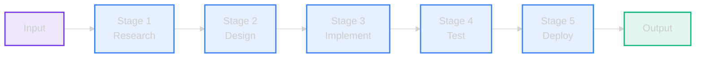
```mermaid
%%{init: {'theme': 'dark'}}%%
graph LR
    Input[Input] --> Stage1[Stage 1<br/>Research]
    Stage1 --> Stage2[Stage 2<br/>Design]
    Stage2 --> Stage3[Stage 3<br/>Implement]
    Stage3 --> Stage4[Stage 4<br/>Test]
    Stage4 --> Stage5[Stage 5<br/>Deploy]
    Stage5 --> Output[Output]
    
    style Input fill:#7c3aed20,stroke:#7c3aed,stroke-width:2px
    style Stage1 fill:#3b82f620,stroke:#3b82f6,stroke-width:2px
    style Stage2 fill:#3b82f620,stroke:#3b82f6,stroke-width:2px
    style Stage3 fill:#3b82f620,stroke:#3b82f6,stroke-width:2px
    style Stage4 fill:#3b82f620,stroke:#3b82f6,stroke-width:2px
    style Stage5 fill:#3b82f620,stroke:#3b82f6,stroke-width:2px
    style Output fill:#10b98120,stroke:#10b981,stroke-width:2px
```

### 3. Map-Reduce Pattern

**Use Case:** Parallel processing with aggregation

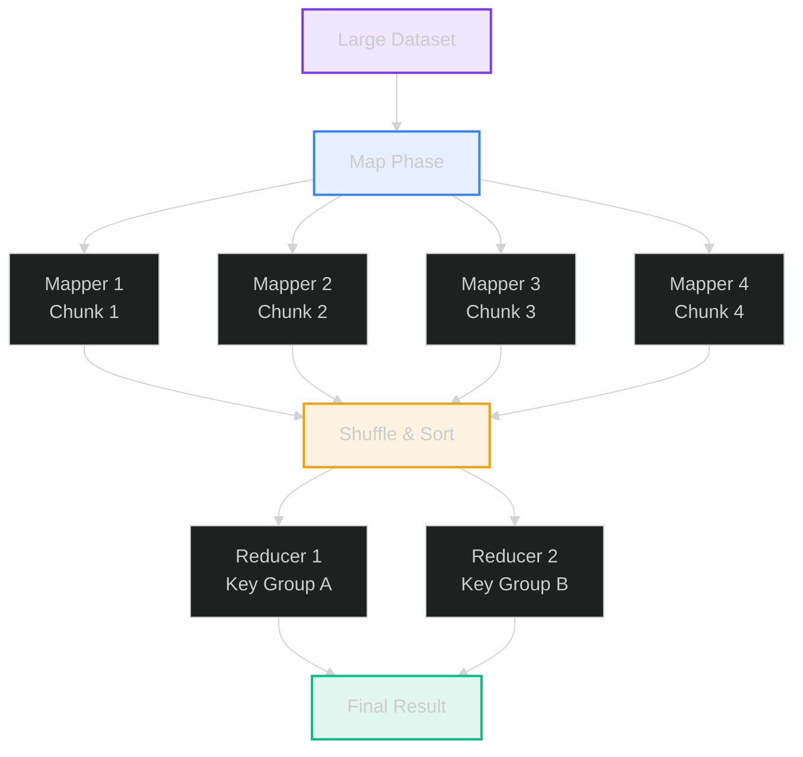
```mermaid
%%{init: {'theme': 'dark'}}%%
graph TB
    Input[Large Dataset] --> Map[Map Phase]
    
    Map --> M1[Mapper 1<br/>Chunk 1]
    Map --> M2[Mapper 2<br/>Chunk 2]
    Map --> M3[Mapper 3<br/>Chunk 3]
    Map --> M4[Mapper 4<br/>Chunk 4]
    
    M1 --> Shuffle[Shuffle & Sort]
    M2 --> Shuffle
    M3 --> Shuffle
    M4 --> Shuffle
    
    Shuffle --> R1[Reducer 1<br/>Key Group A]
    Shuffle --> R2[Reducer 2<br/>Key Group B]
    
    R1 --> Output[Final Result]
    R2 --> Output
    
    style Input fill:#7c3aed20,stroke:#7c3aed,stroke-width:2px
    style Map fill:#3b82f620,stroke:#3b82f6,stroke-width:2px
    style Shuffle fill:#f59e0b20,stroke:#f59e0b,stroke-width:2px
    style Output fill:#10b98120,stroke:#10b981,stroke-width:2px
```

### 4. Tournament Pattern

**Use Case:** Competitive selection

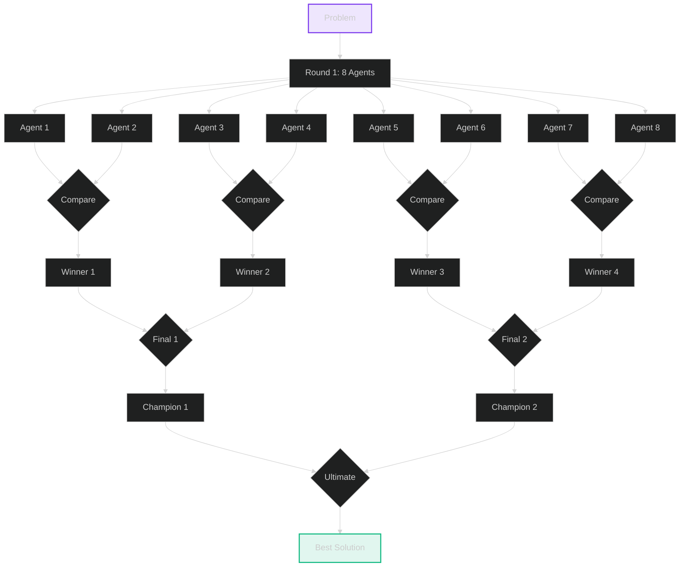
```mermaid
%%{init: {'theme': 'dark'}}%%
graph TB
    Problem[Problem] --> Round1[Round 1: 8 Agents]
    
    Round1 --> A1[Agent 1]
    Round1 --> A2[Agent 2]
    Round1 --> A3[Agent 3]
    Round1 --> A4[Agent 4]
    Round1 --> A5[Agent 5]
    Round1 --> A6[Agent 6]
    Round1 --> A7[Agent 7]
    Round1 --> A8[Agent 8]
    
    A1 --> C1{Compare}
    A2 --> C1
    A3 --> C2{Compare}
    A4 --> C2
    A5 --> C3{Compare}
    A6 --> C3
    A7 --> C4{Compare}
    A8 --> C4
    
    C1 --> W1[Winner 1]
    C2 --> W2[Winner 2]
    C3 --> W3[Winner 3]
    C4 --> W4[Winner 4]
    
    W1 --> F1{Final 1}
    W2 --> F1
    W3 --> F2{Final 2}
    W4 --> F2
    
    F1 --> Champion1[Champion 1]
    F2 --> Champion2[Champion 2]
    
    Champion1 --> Ultimate{Ultimate}
    Champion2 --> Ultimate
    
    Ultimate --> Winner[Best Solution]
    
    style Problem fill:#7c3aed20,stroke:#7c3aed,stroke-width:2px
    style Winner fill:#10b98120,stroke:#10b981,stroke-width:2px
```

### 5. Ensemble Pattern

**Use Case:** Consensus from multiple approaches

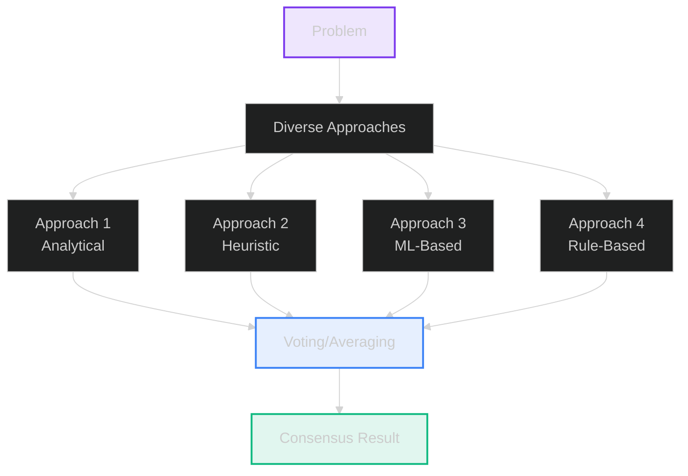
```mermaid
%%{init: {'theme': 'dark'}}%%
graph TB
    Problem[Problem] --> Diverse[Diverse Approaches]
    
    Diverse --> A1[Approach 1<br/>Analytical]
    Diverse --> A2[Approach 2<br/>Heuristic]
    Diverse --> A3[Approach 3<br/>ML-Based]
    Diverse --> A4[Approach 4<br/>Rule-Based]
    
    A1 --> Vote[Voting/Averaging]
    A2 --> Vote
    A3 --> Vote
    A4 --> Vote
    
    Vote --> Consensus[Consensus Result]
    
    style Problem fill:#7c3aed20,stroke:#7c3aed,stroke-width:2px
    style Vote fill:#3b82f620,stroke:#3b82f6,stroke-width:2px
    style Consensus fill:#10b98120,stroke:#10b981,stroke-width:2px
```

---

## Consensus Building

### Consensus Methods

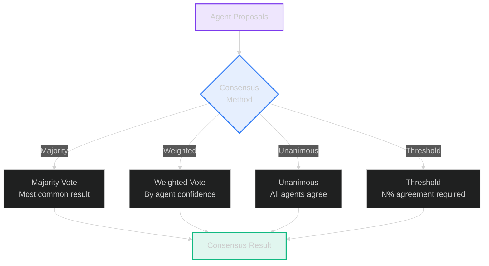
```mermaid
%%{init: {'theme': 'dark'}}%%
graph TB
    Proposals[Agent Proposals] --> Method{Consensus<br/>Method}
    
    Method -->|Majority| Majority[Majority Vote<br/>Most common result]
    Method -->|Weighted| Weighted[Weighted Vote<br/>By agent confidence]
    Method -->|Unanimous| Unanimous[Unanimous<br/>All agents agree]
    Method -->|Threshold| Threshold[Threshold<br/>N% agreement required]
    
    Majority --> Result[Consensus Result]
    Weighted --> Result
    Unanimous --> Result
    Threshold --> Result
    
    style Proposals fill:#7c3aed20,stroke:#7c3aed,stroke-width:2px
    style Method fill:#3b82f620,stroke:#3b82f6,stroke-width:2px
    style Result fill:#10b98120,stroke:#10b981,stroke-width:2px
```

### Consensus Algorithm

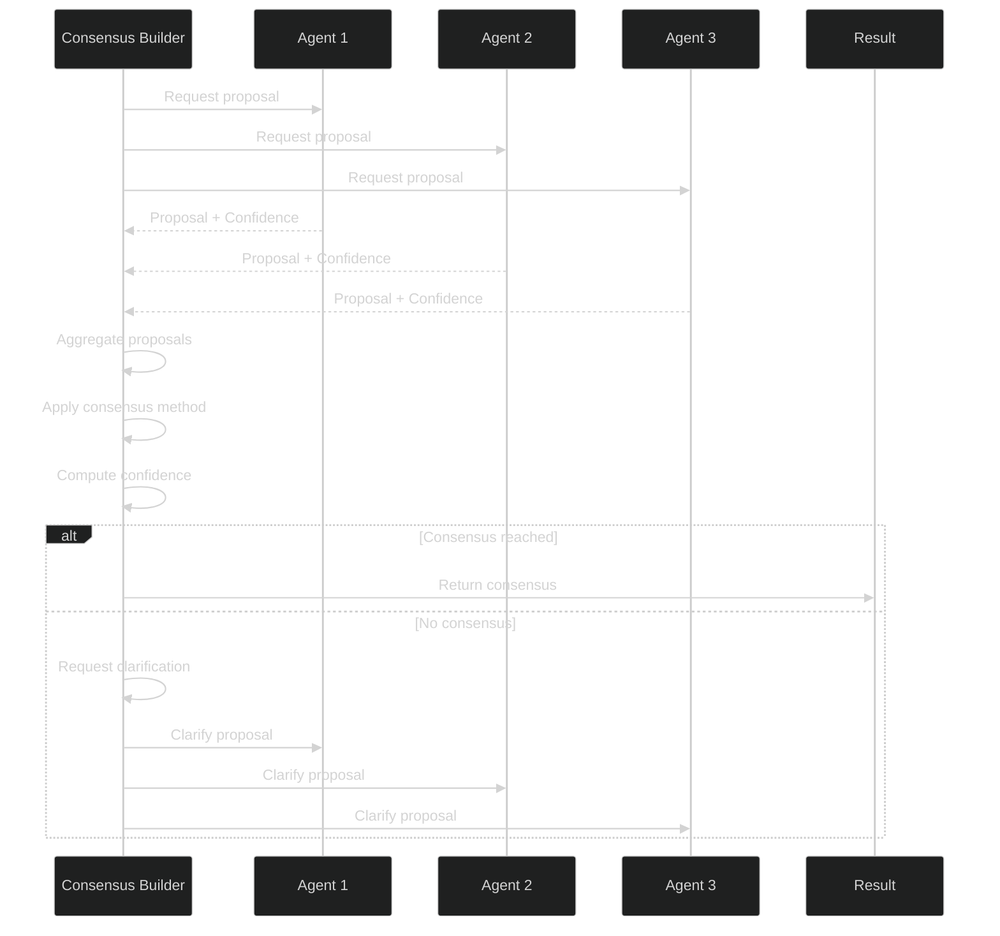
```mermaid
%%{init: {'theme': 'dark'}}%%
sequenceDiagram
    participant CB as Consensus Builder
    participant A1 as Agent 1
    participant A2 as Agent 2
    participant A3 as Agent 3
    participant Result
    
    CB->>A1: Request proposal
    CB->>A2: Request proposal
    CB->>A3: Request proposal
    
    A1-->>CB: Proposal + Confidence
    A2-->>CB: Proposal + Confidence
    A3-->>CB: Proposal + Confidence
    
    CB->>CB: Aggregate proposals
    CB->>CB: Apply consensus method
    CB->>CB: Compute confidence
    
    alt Consensus reached
        CB->>Result: Return consensus
    else No consensus
        CB->>CB: Request clarification
        CB->>A1: Clarify proposal
        CB->>A2: Clarify proposal
        CB->>A3: Clarify proposal
    end
```

---

## Dynamic Team Formation

### Team Lifecycle

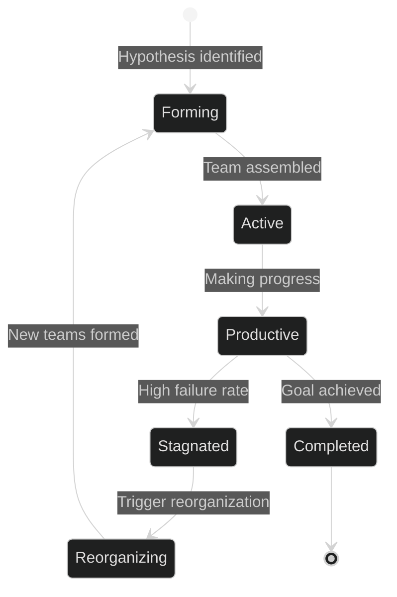
```mermaid
%%{init: {'theme': 'dark'}}%%
stateDiagram-v2
    [*] --> Forming: Hypothesis identified
    Forming --> Active: Team assembled
    Active --> Productive: Making progress
    Productive --> Stagnated: High failure rate
    Stagnated --> Reorganizing: Trigger reorganization
    Reorganizing --> Forming: New teams formed
    Productive --> Completed: Goal achieved
    Completed --> [*]
```

### Team Formation Process

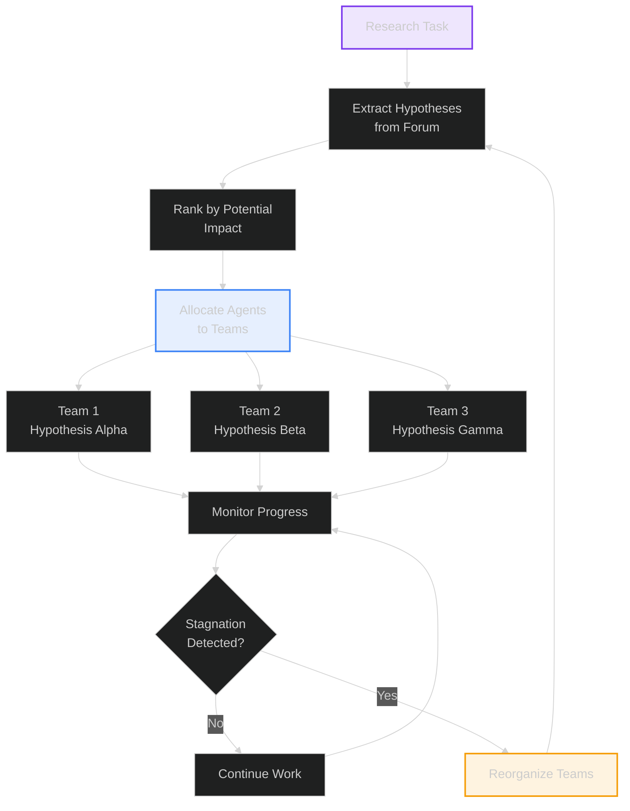
```mermaid
%%{init: {'theme': 'dark'}}%%
flowchart TD
    Start[Research Task] --> Extract[Extract Hypotheses<br/>from Forum]
    Extract --> Rank[Rank by Potential<br/>Impact]
    Rank --> Allocate[Allocate Agents<br/>to Teams]
    
    Allocate --> T1[Team 1<br/>Hypothesis Alpha]
    Allocate --> T2[Team 2<br/>Hypothesis Beta]
    Allocate --> T3[Team 3<br/>Hypothesis Gamma]
    
    T1 --> Monitor[Monitor Progress]
    T2 --> Monitor
    T3 --> Monitor
    
    Monitor --> Check{Stagnation<br/>Detected?}
    Check -->|No| Continue[Continue Work]
    Check -->|Yes| Reorganize[Reorganize Teams]
    
    Continue --> Monitor
    Reorganize --> Extract
    
    style Start fill:#7c3aed20,stroke:#7c3aed,stroke-width:2px
    style Allocate fill:#3b82f620,stroke:#3b82f6,stroke-width:2px
    style Reorganize fill:#f59e0b20,stroke:#f59e0b,stroke-width:2px
```

### Stagnation Detection

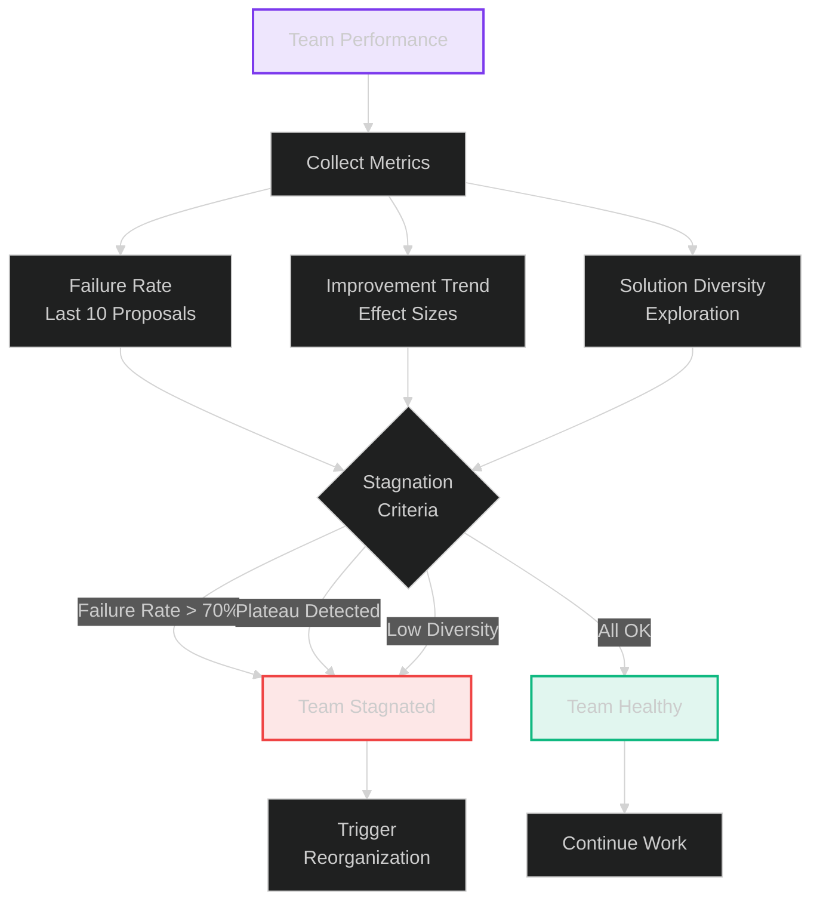
```mermaid
%%{init: {'theme': 'dark'}}%%
flowchart TD
    Team[Team Performance] --> Metrics[Collect Metrics]
    
    Metrics --> Failures[Failure Rate<br/>Last 10 Proposals]
    Metrics --> Improvements[Improvement Trend<br/>Effect Sizes]
    Metrics --> Diversity[Solution Diversity<br/>Exploration]
    
    Failures --> Check{Stagnation<br/>Criteria}
    Improvements --> Check
    Diversity --> Check
    
    Check -->|Failure Rate > 70%| Stagnated[Team Stagnated]
    Check -->|Plateau Detected| Stagnated
    Check -->|Low Diversity| Stagnated
    Check -->|All OK| Healthy[Team Healthy]
    
    Stagnated --> Action[Trigger<br/>Reorganization]
    Healthy --> Continue[Continue Work]
    
    style Team fill:#7c3aed20,stroke:#7c3aed,stroke-width:2px
    style Stagnated fill:#ef444420,stroke:#ef4444,stroke-width:2px
    style Healthy fill:#10b98120,stroke:#10b981,stroke-width:2px
```

---

## Agent Roles

### Role Distribution

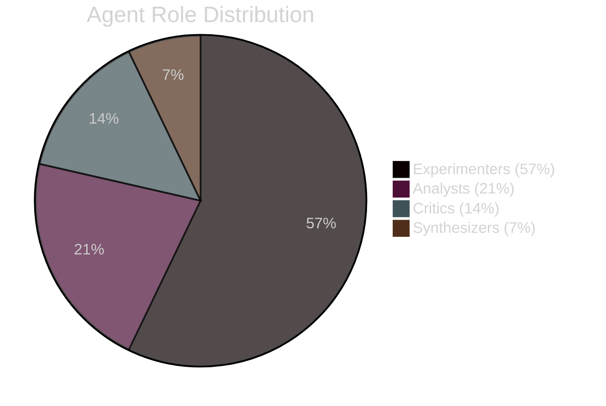
```mermaid
%%{init: {'theme': 'dark'}}%%
pie title Agent Role Distribution
    "Experimenters (57%)" : 8
    "Analysts (21%)" : 3
    "Critics (14%)" : 2
    "Synthesizers (7%)" : 1
```

### Role Interactions

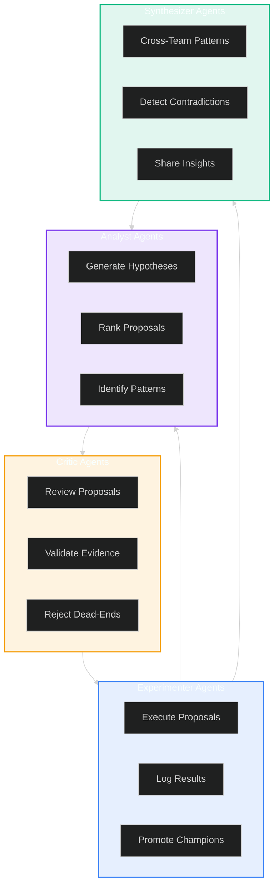
```mermaid
%%{init: {'theme': 'dark'}}%%
graph TB
    subgraph Analysts["Analyst Agents"]
        A1[Generate Hypotheses]
        A2[Rank Proposals]
        A3[Identify Patterns]
    end
    
    subgraph Experimenters["Experimenter Agents"]
        E1[Execute Proposals]
        E2[Log Results]
        E3[Promote Champions]
    end
    
    subgraph Critics["Critic Agents"]
        C1[Review Proposals]
        C2[Validate Evidence]
        C3[Reject Dead-Ends]
    end
    
    subgraph Synthesizers["Synthesizer Agents"]
        S1[Cross-Team Patterns]
        S2[Detect Contradictions]
        S3[Share Insights]
    end
    
    Analysts --> Critics
    Critics --> Experimenters
    Experimenters --> Analysts
    Experimenters --> Synthesizers
    Synthesizers --> Analysts
    
    style Analysts fill:#7c3aed20,stroke:#7c3aed,stroke-width:2px
    style Experimenters fill:#3b82f620,stroke:#3b82f6,stroke-width:2px
    style Critics fill:#f59e0b20,stroke:#f59e0b,stroke-width:2px
    style Synthesizers fill:#10b98120,stroke:#10b981,stroke-width:2px
```

---

## Shared State Management

### State Components

```mermaid
%%{init: {'theme': 'dark'}}%%
graph TB
    subgraph State["Shared State"]
        Champions[Champions<br/>Best Solutions per Team]
        ExpLog[Experiment Log<br/>Full History]
        Forum[Discussion Forum<br/>Agent Communication]
        Queues[Team Queues<br/>Priority Proposals]
        DeadEnds[Dead Ends<br/>Failure Registry]
        Metrics[Convergence Metrics<br/>Progress Tracking]
    end
    
    subgraph Operations["State Operations"]
        Read[Read<br/>Agent-Specific View]
        Write[Write<br/>Atomic Updates]
        Heartbeat[Heartbeat<br/>Maintenance]
    end
    
    State --> Operations
    Operations --> State
    
    style State fill:#7c3aed20,stroke:#7c3aed,stroke-width:2px
    style Operations fill:#3b82f620,stroke:#3b82f6,stroke-width:2px
```

### State Access Pattern

```mermaid
%%{init: {'theme': 'dark'}}%%
sequenceDiagram
    participant Agent
    participant State as Shared State
    participant Lock as Lock Manager
    
    Agent->>State: Request read access
    State-->>Agent: Agent-specific view
    
    Agent->>Agent: Process data
    Agent->>Agent: Prepare update
    
    Agent->>Lock: Acquire write lock
    Lock-->>Agent: Lock granted
    
    Agent->>State: Write update
    State->>State: Validate update
    State-->>Agent: Update confirmed
    
    Agent->>Lock: Release lock
    
    Note over State: Heartbeat maintenance
    State->>State: Prune old entries
    State->>State: Update metrics
```

---

## Performance Characteristics

### Scalability

| Metric | Current | Target |
|--------|---------|--------|
| **Concurrent Agents** | 10-20 | 100+ |
| **Tasks per Second** | 5-10 | 100+ |
| **Team Formation Time** | <5s | <1s |
| **Consensus Latency** | <500ms | <100ms |
| **State Sync Frequency** | 10s | 1s |

### Efficiency Gains

```mermaid
%%{init: {'theme': 'dark'}}%%
xychart-beta
    title "Convergence Speed Comparison"
    x-axis [Single-Agent, Sequential, Parallel, Swarm]
    y-axis "Time to Solution (minutes)" 0 --> 100
    bar [100, 60, 30, 20]
```

---

## Integration Points

### With Autonomy System

```mermaid
%%{init: {'theme': 'dark'}}%%
sequenceDiagram
    participant SM as State Machine
    participant GD as Goal Decomposer
    participant FO as Fleet Orchestrator
    participant Agents
    
    SM->>GD: Decompose goal
    GD-->>SM: Dependency graph
    SM->>FO: Create fleet
    FO->>Agents: Spawn agents
    Agents->>Agents: Execute tasks
    Agents-->>FO: Results
    FO-->>SM: Aggregated results
    SM->>SM: Transition state
```

### With Memory System

```mermaid
%%{init: {'theme': 'dark'}}%%
flowchart LR
    Agents[Agent Swarm] --> Experiences[Generate Experiences]
    Experiences --> Memory[Memory System]
    Memory --> Episodic[Episodic Memory]
    Memory --> Semantic[Semantic Memory]
    Memory --> Procedural[Procedural Memory]
    
    Procedural --> Skills[Skill Library]
    Skills --> Agents
    
    style Agents fill:#7c3aed20,stroke:#7c3aed,stroke-width:2px
    style Memory fill:#3b82f620,stroke:#3b82f6,stroke-width:2px
    style Skills fill:#10b98120,stroke:#10b981,stroke-width:2px
```

---

## Related Documentation

- [Agent Swarm](./agent-swarm.md) - Detailed swarm implementation
- [Autonomy System](./autonomy-system.md) - State machine integration
- [System Overview](./system-overview.md) - Overall architecture
- [Memory Architecture](./memory-architecture.md) - Memory integration

---

**Lyra Agent Orchestration Architecture**

Version 2.0 | 2026-05-30 | Production

[System Overview](./system-overview.md) · [Agent Swarm](./agent-swarm.md)

