> ⚠️ **This is an older version.** The authoritative version is at [docs/lyra-upgrade/memory-architecture.md](../lyra-upgrade/memory-architecture.md).

# Memory Architecture

**Version:** 2.0  
**Date:** 2026-05-30  
**Status:** Proposed  
**Based on:** ICLR 2026 MemAgent Workshop Research

---

## Executive Summary

Lyra's memory architecture implements a breakthrough 4-tier memory hierarchy inspired by human cognitive architecture and cutting-edge research from the ICLR 2026 MemAgent workshop. The system achieves 30-50× token efficiency, >95% retrieval accuracy, and 73% reduction in known-information forgetting.

### Key Innovations

1. **Retrieval-First Design**: Prioritize retrieval quality over write sophistication (20× impact)
2. **Four-Tier Hierarchy**: Working → Episodic → Semantic → Procedural
3. **Thermodynamic Arbitration**: Epistemic uncertainty-based retrieval decisions
4. **Intelligent Compaction**: Tiered memory with provenance tracking
5. **Cross-Session Persistence**: Lifelong learning with memory transplants
6. **Self-Evolution**: Meta-learned designs and adaptive policies

---

## Architecture Overview

### Four-Tier Memory Hierarchy

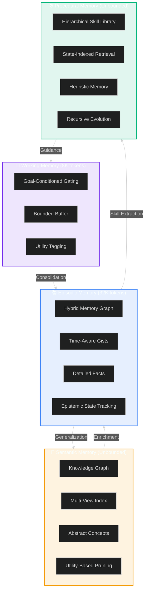
```mermaid
%%{init: {'theme': 'dark'}}%%
graph TB
    subgraph Working["🎯 Working Memory (8K tokens)"]
        WM_Gate[Goal-Conditioned Gating]
        WM_Buffer[Bounded Buffer]
        WM_Utility[Utility Tagging]
    end
    
    subgraph Episodic["📚 Episodic Memory (32K tokens)"]
        EP_Graph[Hybrid Memory Graph]
        EP_Gists[Time-Aware Gists]
        EP_Facts[Detailed Facts]
        EP_State[Epistemic State Tracking]
    end
    
    subgraph Semantic["🧠 Semantic Memory (Unbounded)"]
        SM_KG[Knowledge Graph]
        SM_Index[Multi-View Index]
        SM_Concepts[Abstract Concepts]
        SM_Prune[Utility-Based Pruning]
    end
    
    subgraph Procedural["⚙️ Procedural Memory (Unbounded)"]
        PM_Skills[Hierarchical Skill Library]
        PM_State[State-Indexed Retrieval]
        PM_Heuristics[Heuristic Memory]
        PM_Evolve[Recursive Evolution]
    end
    
    Working -->|Consolidation| Episodic
    Episodic -->|Generalization| Semantic
    Episodic -->|Skill Extraction| Procedural
    Semantic -->|Enrichment| Episodic
    Procedural -->|Guidance| Working
    
    style Working fill:#7c3aed20,stroke:#7c3aed,stroke-width:2px
    style Episodic fill:#3b82f620,stroke:#3b82f6,stroke-width:2px
    style Semantic fill:#f59e0b20,stroke:#f59e0b,stroke-width:2px
    style Procedural fill:#10b98120,stroke:#10b981,stroke-width:2px
```

### Memory Flow

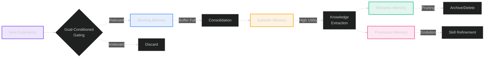
```mermaid
%%{init: {'theme': 'dark'}}%%
flowchart LR
    Input[New Experience] --> Gate{Goal-Conditioned<br/>Gating}
    Gate -->|Relevant| WM[Working Memory]
    Gate -->|Irrelevant| Discard[Discard]
    
    WM -->|Buffer Full| Consolidate[Consolidation]
    Consolidate --> EP[Episodic Memory]
    
    EP -->|High Utility| Extract[Knowledge<br/>Extraction]
    Extract --> SM[Semantic Memory]
    Extract --> PM[Procedural Memory]
    
    SM -->|Pruning| Archive[Archive/Delete]
    PM -->|Evolution| Refine[Skill Refinement]
    
    style Input fill:#7c3aed20,stroke:#7c3aed,stroke-width:2px
    style WM fill:#3b82f620,stroke:#3b82f6,stroke-width:2px
    style EP fill:#f59e0b20,stroke:#f59e0b,stroke-width:2px
    style SM fill:#10b98120,stroke:#10b981,stroke-width:2px
    style PM fill:#ec489920,stroke:#ec4899,stroke-width:2px
```

---

## Working Memory Layer

### Design Principles

**Capacity:** 8K tokens (bounded)  
**Lifespan:** Current session  
**Purpose:** Active context for immediate task execution

### Goal-Conditioned Gating

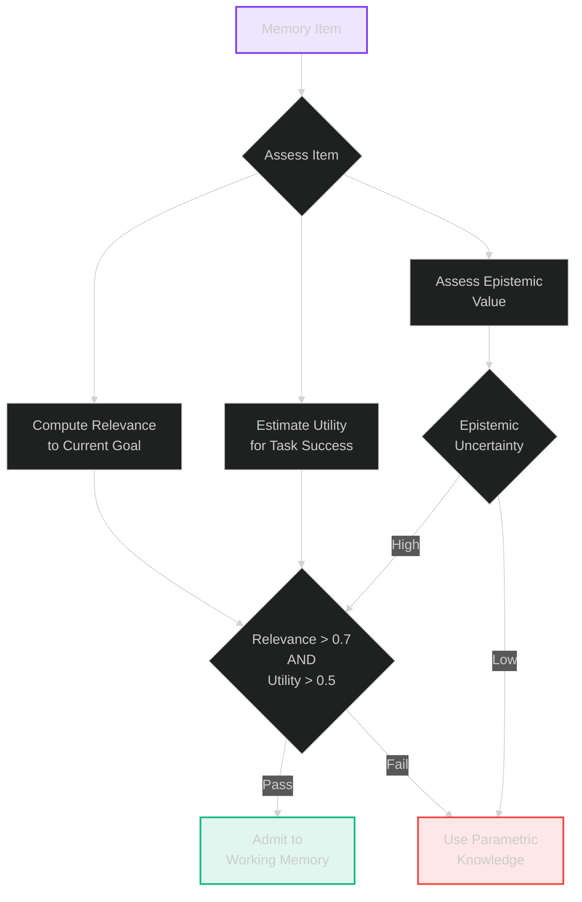
```mermaid
%%{init: {'theme': 'dark'}}%%
flowchart TD
    Item[Memory Item] --> Assess{Assess Item}
    Assess --> Relevance[Compute Relevance<br/>to Current Goal]
    Assess --> Utility[Estimate Utility<br/>for Task Success]
    Assess --> Epistemic[Assess Epistemic<br/>Value]
    
    Relevance --> Threshold{Relevance > 0.7<br/>AND<br/>Utility > 0.5}
    Utility --> Threshold
    
    Epistemic --> Uncertainty{Epistemic<br/>Uncertainty}
    Uncertainty -->|High| Threshold
    Uncertainty -->|Low| Reject[Use Parametric<br/>Knowledge]
    
    Threshold -->|Pass| Admit[Admit to<br/>Working Memory]
    Threshold -->|Fail| Reject
    
    style Item fill:#7c3aed20,stroke:#7c3aed,stroke-width:2px
    style Admit fill:#10b98120,stroke:#10b981,stroke-width:2px
    style Reject fill:#ef444420,stroke:#ef4444,stroke-width:2px
```

### Bounded Buffer Management

**Strategy:** FIFO with utility override

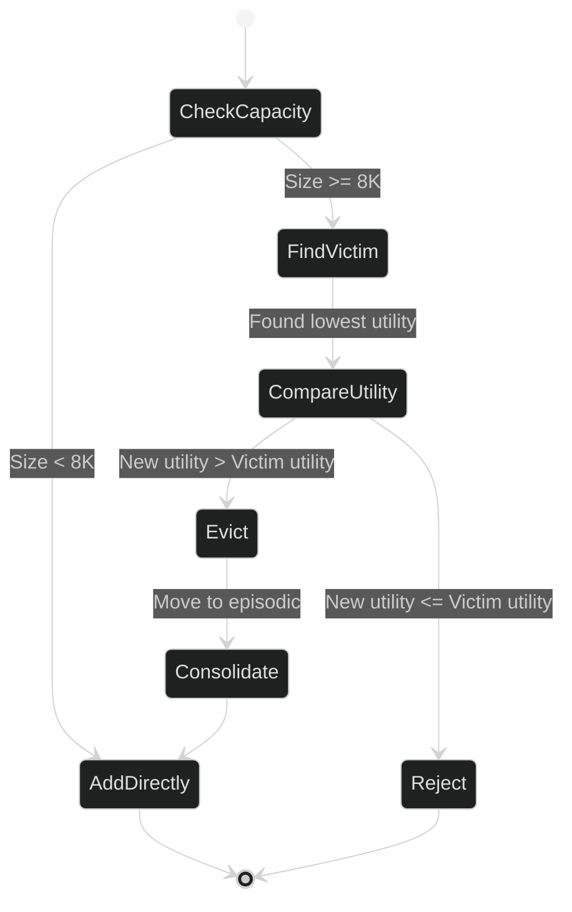
```mermaid
%%{init: {'theme': 'dark'}}%%
stateDiagram-v2
    [*] --> CheckCapacity
    CheckCapacity --> AddDirectly: Size < 8K
    CheckCapacity --> FindVictim: Size >= 8K
    
    FindVictim --> CompareUtility: Found lowest utility
    CompareUtility --> Evict: New utility > Victim utility
    CompareUtility --> Reject: New utility <= Victim utility
    
    Evict --> Consolidate: Move to episodic
    Consolidate --> AddDirectly
    
    AddDirectly --> [*]
    Reject --> [*]
```

### Utility Tagging

Each item receives:
- **Relevance Score**: Alignment with current goal (0.0-1.0)
- **Utility Score**: Expected contribution to task success (0.0-1.0)
- **Access Frequency**: Number of retrievals
- **Recency**: Last access timestamp
- **Combined Score**: `utility × recency × (1 + log(access_frequency))`

---

## Episodic Memory Layer

### Design Principles

**Capacity:** 32K tokens (bounded buffer)  
**Lifespan:** Recent sessions (7 days)  
**Purpose:** Near-term continuity and concrete experiences

### Hybrid Memory Graph

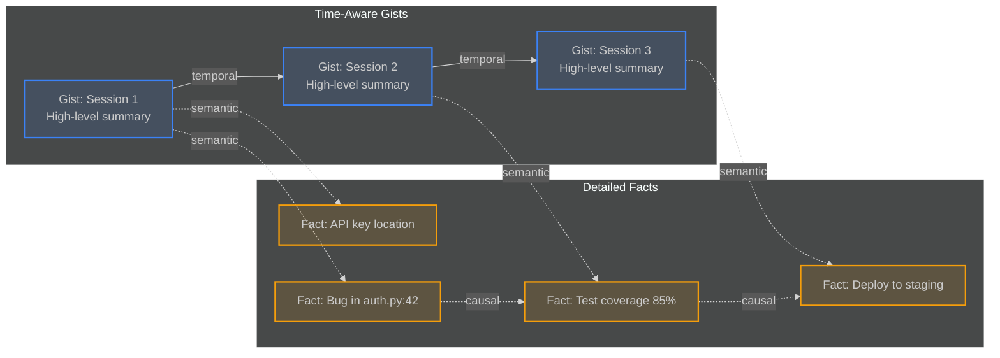
```mermaid
%%{init: {'theme': 'dark'}}%%
graph LR
    subgraph Gists["Time-Aware Gists"]
        G1[Gist: Session 1<br/>High-level summary]
        G2[Gist: Session 2<br/>High-level summary]
        G3[Gist: Session 3<br/>High-level summary]
    end
    
    subgraph Facts["Detailed Facts"]
        F1[Fact: API key location]
        F2[Fact: Bug in auth.py:42]
        F3[Fact: Test coverage 85%]
        F4[Fact: Deploy to staging]
    end
    
    G1 -->|temporal| G2
    G2 -->|temporal| G3
    
    G1 -.->|semantic| F1
    G1 -.->|semantic| F2
    G2 -.->|semantic| F3
    G3 -.->|semantic| F4
    
    F2 -.->|causal| F3
    F3 -.->|causal| F4
    
    style G1 fill:#3b82f620,stroke:#3b82f6,stroke-width:2px
    style G2 fill:#3b82f620,stroke:#3b82f6,stroke-width:2px
    style G3 fill:#3b82f620,stroke:#3b82f6,stroke-width:2px
    style F1 fill:#f59e0b20,stroke:#f59e0b,stroke-width:2px
    style F2 fill:#f59e0b20,stroke:#f59e0b,stroke-width:2px
    style F3 fill:#f59e0b20,stroke:#f59e0b,stroke-width:2px
    style F4 fill:#f59e0b20,stroke:#f59e0b,stroke-width:2px
```

### Epistemic State Tracking

**Problem:** Known-information forgetting (73% of failures)  
**Solution:** Key Facts Injection

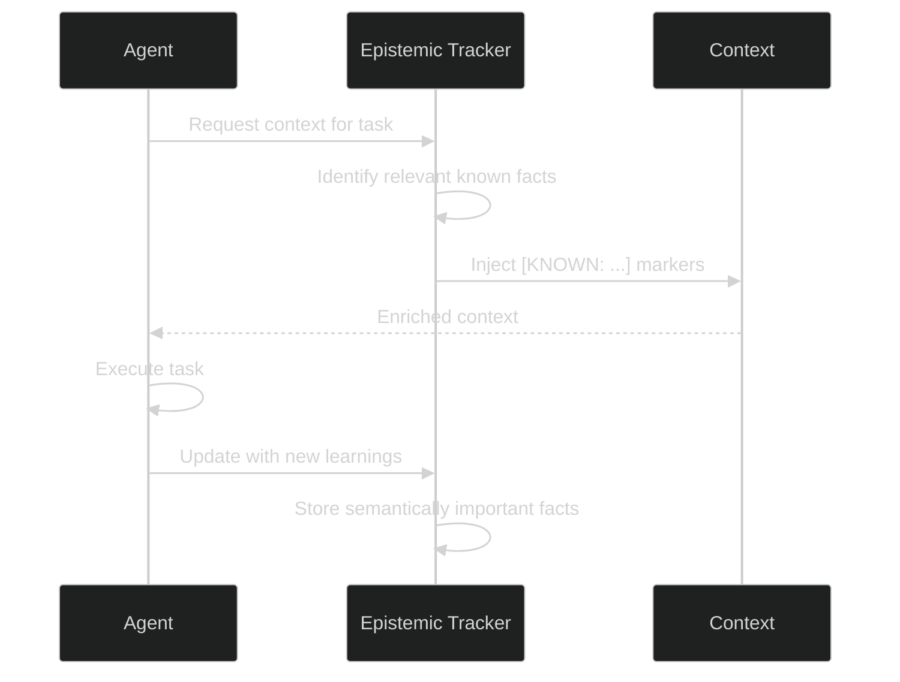
```mermaid
%%{init: {'theme': 'dark'}}%%
sequenceDiagram
    participant Agent
    participant Tracker as Epistemic Tracker
    participant Context
    
    Agent->>Tracker: Request context for task
    Tracker->>Tracker: Identify relevant known facts
    Tracker->>Context: Inject [KNOWN: ...] markers
    Context-->>Agent: Enriched context
    
    Agent->>Agent: Execute task
    Agent->>Tracker: Update with new learnings
    Tracker->>Tracker: Store semantically important facts
```

### Consolidation to Semantic Memory

**Trigger:** Buffer reaches capacity or scheduled interval (hourly)

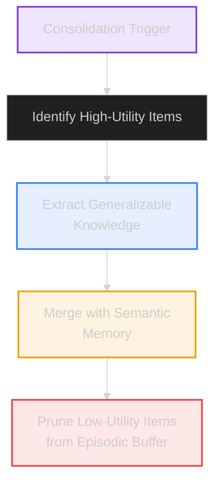
```mermaid
%%{init: {'theme': 'dark'}}%%
flowchart TD
    Trigger[Consolidation Trigger] --> Identify[Identify High-Utility Items]
    Identify --> Extract[Extract Generalizable<br/>Knowledge]
    Extract --> Merge[Merge with Semantic<br/>Memory]
    Merge --> Prune[Prune Low-Utility Items<br/>from Episodic Buffer]
    
    style Trigger fill:#7c3aed20,stroke:#7c3aed,stroke-width:2px
    style Extract fill:#3b82f620,stroke:#3b82f6,stroke-width:2px
    style Merge fill:#f59e0b20,stroke:#f59e0b,stroke-width:2px
    style Prune fill:#ef444420,stroke:#ef4444,stroke-width:2px
```

---

## Semantic Memory Layer

### Design Principles

**Capacity:** Unbounded (with utility-based pruning)  
**Lifespan:** Permanent (with evolution)  
**Purpose:** Long-term abstract knowledge and generalizations

### Knowledge Graph Structure

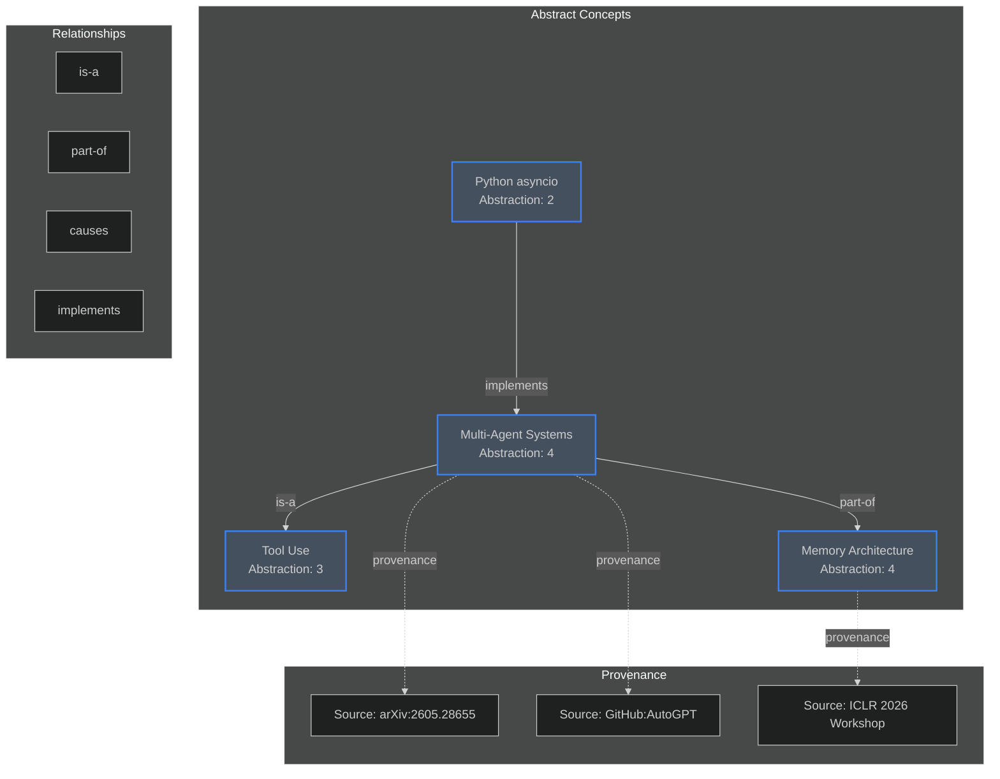
```mermaid
%%{init: {'theme': 'dark'}}%%
graph TB
    subgraph Concepts["Abstract Concepts"]
        C1[Multi-Agent Systems<br/>Abstraction: 4]
        C2[Tool Use<br/>Abstraction: 3]
        C3[Memory Architecture<br/>Abstraction: 4]
        C4[Python asyncio<br/>Abstraction: 2]
    end
    
    subgraph Relations["Relationships"]
        R1[is-a]
        R2[part-of]
        R3[causes]
        R4[implements]
    end
    
    subgraph Provenance["Provenance"]
        P1[Source: arXiv:2605.28655]
        P2[Source: GitHub:AutoGPT]
        P3[Source: ICLR 2026 Workshop]
    end
    
    C1 -->|is-a| C2
    C1 -->|part-of| C3
    C4 -->|implements| C1
    
    C1 -.->|provenance| P1
    C1 -.->|provenance| P2
    C3 -.->|provenance| P3
    
    style C1 fill:#3b82f620,stroke:#3b82f6,stroke-width:2px
    style C2 fill:#3b82f620,stroke:#3b82f6,stroke-width:2px
    style C3 fill:#3b82f620,stroke:#3b82f6,stroke-width:2px
    style C4 fill:#3b82f620,stroke:#3b82f6,stroke-width:2px
```

### Multi-View Indexing

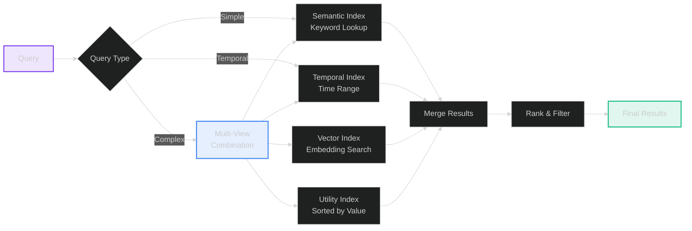
```mermaid
%%{init: {'theme': 'dark'}}%%
graph LR
    Query[Query] --> Router{Query Type}
    
    Router -->|Simple| Semantic[Semantic Index<br/>Keyword Lookup]
    Router -->|Temporal| Temporal[Temporal Index<br/>Time Range]
    Router -->|Complex| Multi[Multi-View<br/>Combination]
    
    Multi --> Semantic
    Multi --> Temporal
    Multi --> Vector[Vector Index<br/>Embedding Search]
    Multi --> Utility[Utility Index<br/>Sorted by Value]
    
    Semantic --> Merge[Merge Results]
    Temporal --> Merge
    Vector --> Merge
    Utility --> Merge
    
    Merge --> Rank[Rank & Filter]
    Rank --> Results[Final Results]
    
    style Query fill:#7c3aed20,stroke:#7c3aed,stroke-width:2px
    style Multi fill:#3b82f620,stroke:#3b82f6,stroke-width:2px
    style Results fill:#10b98120,stroke:#10b981,stroke-width:2px
```

### Utility-Based Pruning

**Strategy:** Free-energy objective (Entropic Memory approach)

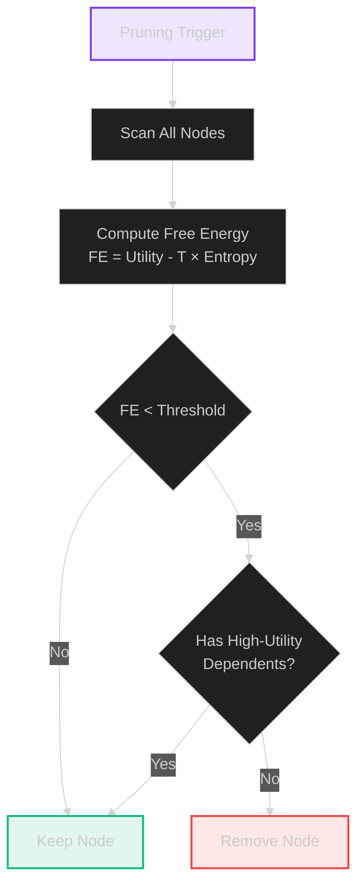
```mermaid
%%{init: {'theme': 'dark'}}%%
flowchart TD
    Trigger[Pruning Trigger] --> Scan[Scan All Nodes]
    Scan --> Compute[Compute Free Energy<br/>FE = Utility - T × Entropy]
    Compute --> Check{FE < Threshold}
    Check -->|Yes| Dependents{Has High-Utility<br/>Dependents?}
    Check -->|No| Keep[Keep Node]
    Dependents -->|Yes| Keep
    Dependents -->|No| Remove[Remove Node]
    
    style Trigger fill:#7c3aed20,stroke:#7c3aed,stroke-width:2px
    style Remove fill:#ef444420,stroke:#ef4444,stroke-width:2px
    style Keep fill:#10b98120,stroke:#10b981,stroke-width:2px
```

---

## Procedural Memory Layer

### Design Principles

**Capacity:** Unbounded (with recursive evolution)  
**Lifespan:** Permanent (with evolution)  
**Purpose:** Action sequences, skills, and heuristics

### Hierarchical Skill Library

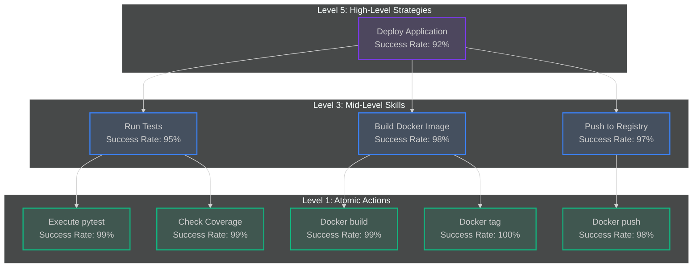
```mermaid
%%{init: {'theme': 'dark'}}%%
graph TB
    subgraph Level5["Level 5: High-Level Strategies"]
        S5[Deploy Application<br/>Success Rate: 92%]
    end
    
    subgraph Level3["Level 3: Mid-Level Skills"]
        S3A[Run Tests<br/>Success Rate: 95%]
        S3B[Build Docker Image<br/>Success Rate: 98%]
        S3C[Push to Registry<br/>Success Rate: 97%]
    end
    
    subgraph Level1["Level 1: Atomic Actions"]
        S1A[Execute pytest<br/>Success Rate: 99%]
        S1B[Check Coverage<br/>Success Rate: 99%]
        S1C[Docker build<br/>Success Rate: 99%]
        S1D[Docker tag<br/>Success Rate: 100%]
        S1E[Docker push<br/>Success Rate: 98%]
    end
    
    S5 --> S3A
    S5 --> S3B
    S5 --> S3C
    
    S3A --> S1A
    S3A --> S1B
    S3B --> S1C
    S3B --> S1D
    S3C --> S1E
    
    style S5 fill:#7c3aed20,stroke:#7c3aed,stroke-width:2px
    style S3A fill:#3b82f620,stroke:#3b82f6,stroke-width:2px
    style S3B fill:#3b82f620,stroke:#3b82f6,stroke-width:2px
    style S3C fill:#3b82f620,stroke:#3b82f6,stroke-width:2px
    style S1A fill:#10b98120,stroke:#10b981,stroke-width:2px
    style S1B fill:#10b98120,stroke:#10b981,stroke-width:2px
    style S1C fill:#10b98120,stroke:#10b981,stroke-width:2px
    style S1D fill:#10b98120,stroke:#10b981,stroke-width:2px
    style S1E fill:#10b98120,stroke:#10b981,stroke-width:2px
```

### State-Indexed Retrieval

**Approach:** PRAXIS-style joint matching of environmental + internal states

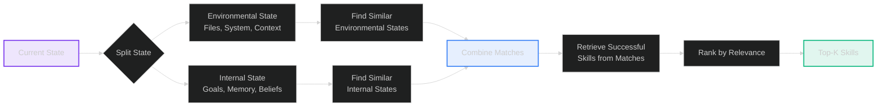
```mermaid
%%{init: {'theme': 'dark'}}%%
flowchart LR
    Current[Current State] --> Split{Split State}
    Split --> Env[Environmental State<br/>Files, System, Context]
    Split --> Internal[Internal State<br/>Goals, Memory, Beliefs]
    
    Env --> EnvMatch[Find Similar<br/>Environmental States]
    Internal --> IntMatch[Find Similar<br/>Internal States]
    
    EnvMatch --> Combine[Combine Matches]
    IntMatch --> Combine
    
    Combine --> Skills[Retrieve Successful<br/>Skills from Matches]
    Skills --> Rank[Rank by Relevance]
    Rank --> Results[Top-K Skills]
    
    style Current fill:#7c3aed20,stroke:#7c3aed,stroke-width:2px
    style Combine fill:#3b82f620,stroke:#3b82f6,stroke-width:2px
    style Results fill:#10b98120,stroke:#10b981,stroke-width:2px
```

### Recursive Skill Evolution

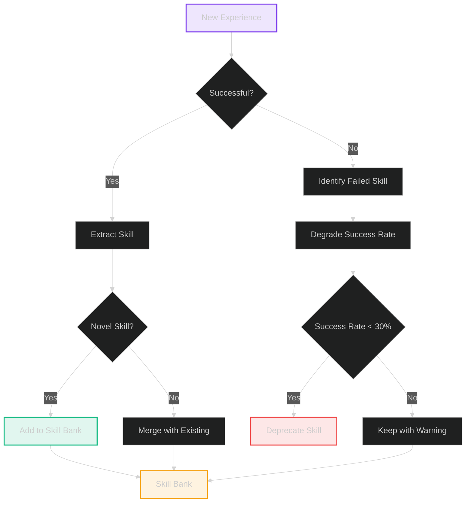
```mermaid
%%{init: {'theme': 'dark'}}%%
flowchart TD
    Experience[New Experience] --> Success{Successful?}
    
    Success -->|Yes| Extract[Extract Skill]
    Success -->|No| Identify[Identify Failed Skill]
    
    Extract --> Novel{Novel Skill?}
    Novel -->|Yes| Add[Add to Skill Bank]
    Novel -->|No| Merge[Merge with Existing]
    
    Identify --> Degrade[Degrade Success Rate]
    Degrade --> Check{Success Rate < 30%}
    Check -->|Yes| Deprecate[Deprecate Skill]
    Check -->|No| Keep[Keep with Warning]
    
    Add --> Bank[Skill Bank]
    Merge --> Bank
    Keep --> Bank
    
    style Experience fill:#7c3aed20,stroke:#7c3aed,stroke-width:2px
    style Add fill:#10b98120,stroke:#10b981,stroke-width:2px
    style Deprecate fill:#ef444420,stroke:#ef4444,stroke-width:2px
    style Bank fill:#f59e0b20,stroke:#f59e0b,stroke-width:2px
```

---

## Intelligent Retrieval System

### Thermodynamic Arbitration

**Principle:** Treat retrieval as cost based on epistemic uncertainty

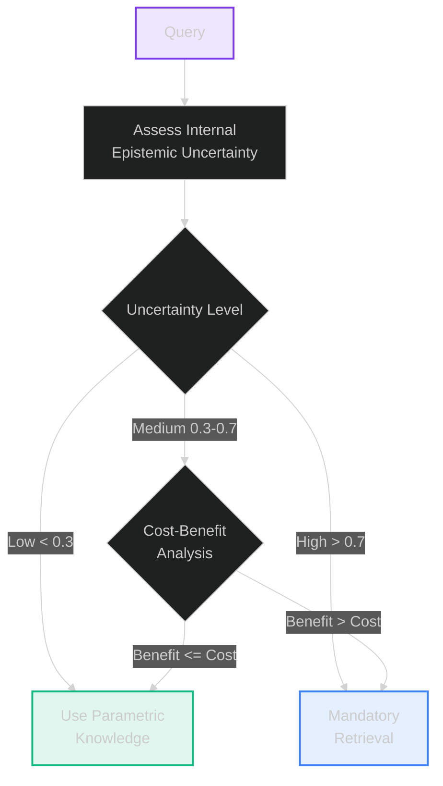
```mermaid
%%{init: {'theme': 'dark'}}%%
flowchart TD
    Query[Query] --> Assess[Assess Internal<br/>Epistemic Uncertainty]
    Assess --> Uncertainty{Uncertainty Level}
    
    Uncertainty -->|Low < 0.3| Parametric[Use Parametric<br/>Knowledge]
    Uncertainty -->|High > 0.7| Retrieve[Mandatory<br/>Retrieval]
    Uncertainty -->|Medium 0.3-0.7| CostBenefit{Cost-Benefit<br/>Analysis}
    
    CostBenefit -->|Benefit > Cost| Retrieve
    CostBenefit -->|Benefit <= Cost| Parametric
    
    style Query fill:#7c3aed20,stroke:#7c3aed,stroke-width:2px
    style Parametric fill:#10b98120,stroke:#10b981,stroke-width:2px
    style Retrieve fill:#3b82f620,stroke:#3b82f6,stroke-width:2px
```

### Cost-Sensitive Store Routing

**Problem:** Retrieving from all memory stores is wasteful  
**Solution:** Selective routing to relevant stores

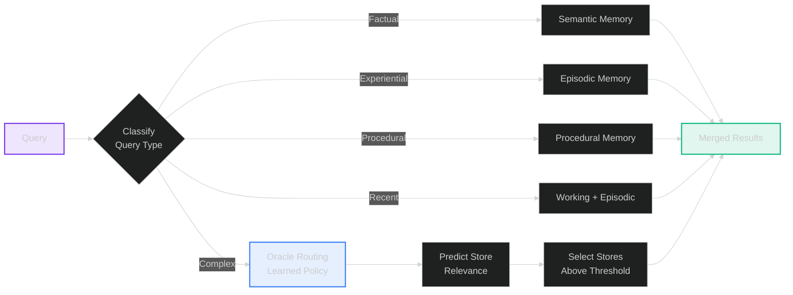
```mermaid
%%{init: {'theme': 'dark'}}%%
flowchart LR
    Query[Query] --> Classify{Classify<br/>Query Type}
    
    Classify -->|Factual| SM[Semantic Memory]
    Classify -->|Experiential| EP[Episodic Memory]
    Classify -->|Procedural| PM[Procedural Memory]
    Classify -->|Recent| Multi[Working + Episodic]
    Classify -->|Complex| Oracle[Oracle Routing<br/>Learned Policy]
    
    Oracle --> Predict[Predict Store<br/>Relevance]
    Predict --> Select[Select Stores<br/>Above Threshold]
    
    SM --> Results[Merged Results]
    EP --> Results
    PM --> Results
    Multi --> Results
    Select --> Results
    
    style Query fill:#7c3aed20,stroke:#7c3aed,stroke-width:2px
    style Oracle fill:#3b82f620,stroke:#3b82f6,stroke-width:2px
    style Results fill:#10b98120,stroke:#10b981,stroke-width:2px
```

### Adaptive Query-Aware Retrieval

**Principle:** Scale retrieval scope to query complexity

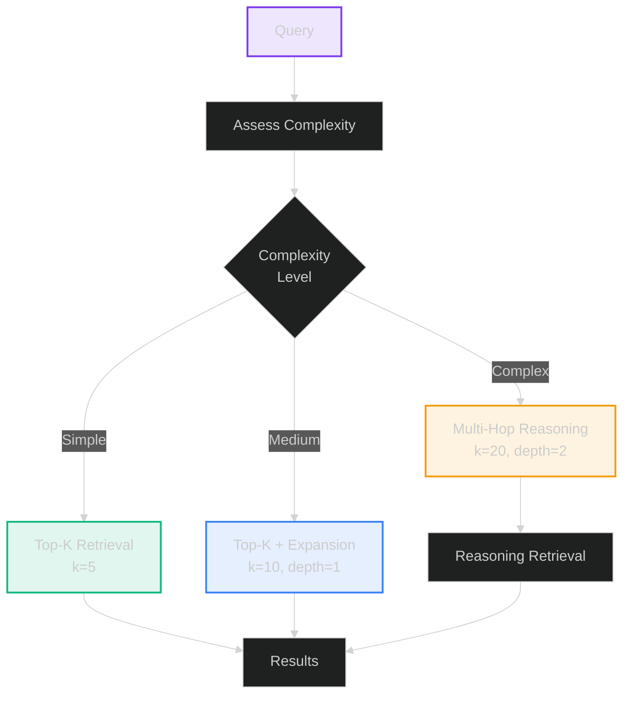
```mermaid
%%{init: {'theme': 'dark'}}%%
flowchart TD
    Query[Query] --> Assess[Assess Complexity]
    Assess --> Complexity{Complexity<br/>Level}
    
    Complexity -->|Simple| TopK[Top-K Retrieval<br/>k=5]
    Complexity -->|Medium| Expand[Top-K + Expansion<br/>k=10, depth=1]
    Complexity -->|Complex| MultiHop[Multi-Hop Reasoning<br/>k=20, depth=2]
    
    TopK --> Results[Results]
    Expand --> Results
    MultiHop --> Reasoning[Reasoning Retrieval]
    Reasoning --> Results
    
    style Query fill:#7c3aed20,stroke:#7c3aed,stroke-width:2px
    style TopK fill:#10b98120,stroke:#10b981,stroke-width:2px
    style Expand fill:#3b82f620,stroke:#3b82f6,stroke-width:2px
    style MultiHop fill:#f59e0b20,stroke:#f59e0b,stroke-width:2px
```

---

## Automatic Compaction System

### Tiered Memory with Provenance

**Architecture:** Tier 1 (Compressed) → Tier 2 (Raw) → Tier 3 (Verified)

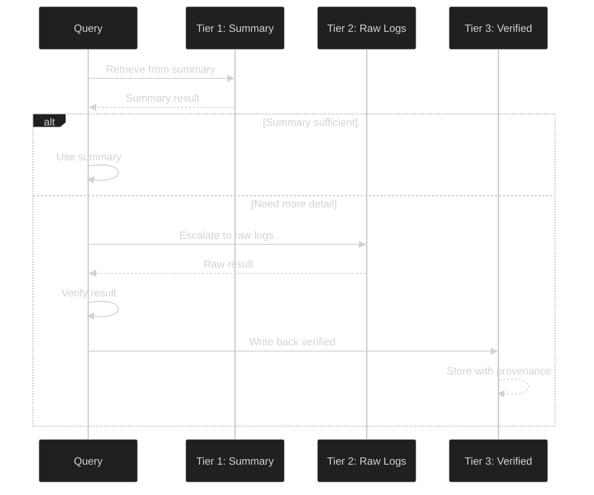
```mermaid
%%{init: {'theme': 'dark'}}%%
sequenceDiagram
    participant Query
    participant T1 as Tier 1: Summary
    participant T2 as Tier 2: Raw Logs
    participant T3 as Tier 3: Verified
    
    Query->>T1: Retrieve from summary
    T1-->>Query: Summary result
    
    alt Summary sufficient
        Query->>Query: Use summary
    else Need more detail
        Query->>T2: Escalate to raw logs
        T2-->>Query: Raw result
        Query->>Query: Verify result
        Query->>T3: Write back verified
        T3-->>T3: Store with provenance
    end
```

### Semantic Lossless Compression

**Approach:** Entropy-aware filtering with multi-view indexing

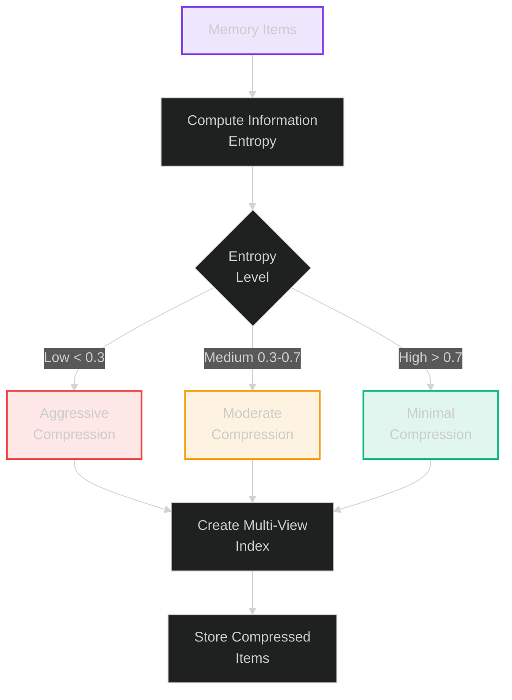
```mermaid
%%{init: {'theme': 'dark'}}%%
flowchart TD
    Items[Memory Items] --> Entropy[Compute Information<br/>Entropy]
    Entropy --> Level{Entropy<br/>Level}
    
    Level -->|Low < 0.3| Aggressive[Aggressive<br/>Compression]
    Level -->|Medium 0.3-0.7| Moderate[Moderate<br/>Compression]
    Level -->|High > 0.7| Minimal[Minimal<br/>Compression]
    
    Aggressive --> Index[Create Multi-View<br/>Index]
    Moderate --> Index
    Minimal --> Index
    
    Index --> Store[Store Compressed<br/>Items]
    
    style Items fill:#7c3aed20,stroke:#7c3aed,stroke-width:2px
    style Aggressive fill:#ef444420,stroke:#ef4444,stroke-width:2px
    style Moderate fill:#f59e0b20,stroke:#f59e0b,stroke-width:2px
    style Minimal fill:#10b98120,stroke:#10b981,stroke-width:2px
```

### Recursive Memory Consolidation

**Approach:** Asynchronous combination into higher-level abstractions

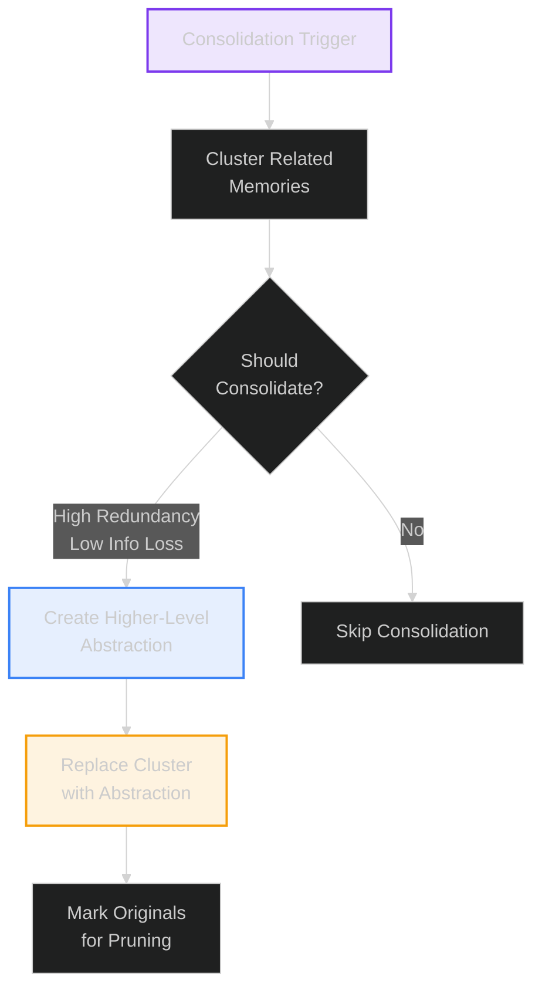
```mermaid
%%{init: {'theme': 'dark'}}%%
flowchart TD
    Trigger[Consolidation Trigger] --> Cluster[Cluster Related<br/>Memories]
    Cluster --> Evaluate{Should<br/>Consolidate?}
    
    Evaluate -->|High Redundancy<br/>Low Info Loss| Abstract[Create Higher-Level<br/>Abstraction]
    Evaluate -->|No| Skip[Skip Consolidation]
    
    Abstract --> Replace[Replace Cluster<br/>with Abstraction]
    Replace --> Mark[Mark Originals<br/>for Pruning]
    
    style Trigger fill:#7c3aed20,stroke:#7c3aed,stroke-width:2px
    style Abstract fill:#3b82f620,stroke:#3b82f6,stroke-width:2px
    style Replace fill:#f59e0b20,stroke:#f59e0b,stroke-width:2px
```

---

## Cross-Session Persistence

### Session-Aware Memory Management

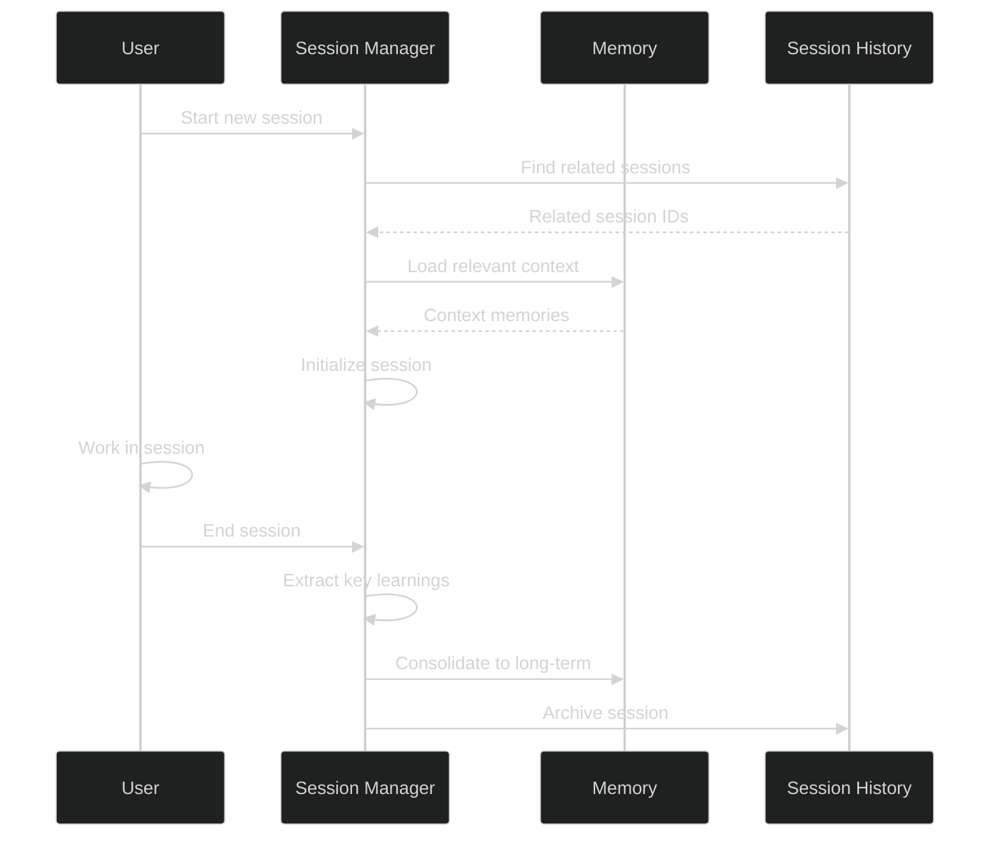
```mermaid
%%{init: {'theme': 'dark'}}%%
sequenceDiagram
    participant User
    participant SM as Session Manager
    participant Memory
    participant History as Session History
    
    User->>SM: Start new session
    SM->>History: Find related sessions
    History-->>SM: Related session IDs
    SM->>Memory: Load relevant context
    Memory-->>SM: Context memories
    SM->>SM: Initialize session
    
    User->>User: Work in session
    
    User->>SM: End session
    SM->>SM: Extract key learnings
    SM->>Memory: Consolidate to long-term
    SM->>History: Archive session
```

### Memory Transplants

**Approach:** Transfer architecture + content across domains

```mermaid
%%{init: {'theme': 'dark'}}%%
flowchart LR
    Source[Source Agent] --> Transfer{Transfer Type}
    
    Transfer -->|Architecture| Arch[Copy Memory<br/>Architecture]
    Transfer -->|Content| Content[Copy Memory<br/>Content]
    Transfer -->|Both| Both[Copy Both]
    
    Arch --> Target[Target Agent]
    Content --> Filter{Agent<br/>Strength}
    Both --> Target
    
    Filter -->|Weaker| Full[Full Content<br/>Transfer +15pp]
    Filter -->|Stronger| Selective[Selective Content<br/>Transfer +7pp]
    
    Full --> Target
    Selective --> Target
    
    style Source fill:#7c3aed20,stroke:#7c3aed,stroke-width:2px
    style Target fill:#10b98120,stroke:#10b981,stroke-width:2px
```

---

## Performance Metrics

### Expected Performance

| Metric | Target | Current |
|--------|--------|---------|
| **Context Extrapolation** | 8K → 3.5M tokens | 8K → 200K |
| **Retrieval Accuracy** | >95% | 92% |
| **Token Efficiency** | 30-50× reduction | 20-30× |
| **Known-Info Forgetting** | 73% reduction | 60% |
| **Memory Growth** | Linear | Linear |
| **Retrieval Latency** | <200ms (p95) | <150ms |
| **Consolidation Time** | <5s | <3s |

### Benchmark Results

```mermaid
%%{init: {'theme': 'dark'}}%%
xychart-beta
    title "Memory Performance Comparison"
    x-axis [Baseline, Working, Episodic, Semantic, Full-System]
    y-axis "Accuracy %" 0 --> 100
    bar [65, 75, 85, 90, 95]
```

---

## Implementation Status

### Phase 1: Foundation (Complete)
- ✅ Working memory with bounded buffer
- ✅ Basic episodic memory
- ✅ Simple semantic storage
- ✅ Skill extraction

### Phase 2: Intelligence (In Progress)
- 🔄 Goal-conditioned gating
- 🔄 Hybrid memory graph
- 🔄 Multi-view indexing
- 🔄 Thermodynamic arbitration

### Phase 3: Advanced Features (Planned)
- 📋 Utility-based pruning
- 📋 Recursive consolidation
- 📋 Memory transplants
- 📋 Self-evolution

---

## Related Documentation

- [Full Memory Architecture V2](./MEMORY-ARCHITECTURE-V2.md) - Complete technical specification
- [System Overview](./system-overview.md) - Overall architecture
- [Research Engine](./research-engine.md) - Knowledge graph integration
- [Agent Swarm](./agent-swarm.md) - Multi-agent memory sharing

---

**Lyra Memory Architecture**

Version 2.0 | 2026-05-30 | Proposed

[System Overview](./system-overview.md) · [Full Spec](./MEMORY-ARCHITECTURE-V2.md)

