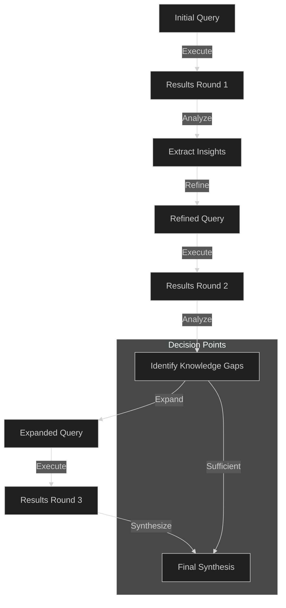
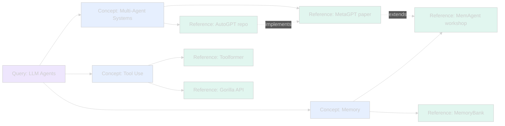
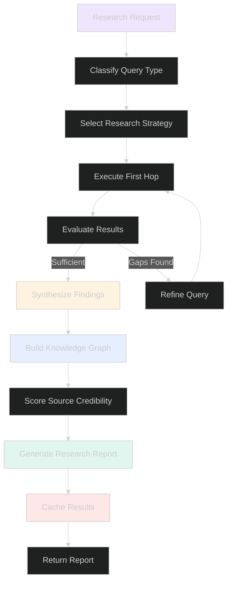

> ⚠️ **Redirect:** The canonical research-engine documentation is at [systems/research-engine/](../systems/research-engine/). This file is kept for reference.

# Multi-Hop Deep Research System

> **Iterative query refinement, knowledge graph construction, and source credibility scoring**

## Table of Contents

- [Overview](#overview)
- [Multi-Hop Reasoning](#multi-hop-reasoning)
- [Knowledge Graph](#knowledge-graph)
- [Source Evaluation](#source-evaluation)
- [Research Pipeline](#research-pipeline)
- [Research Inspirations](#research-inspirations)

---

## Overview

The Lyra research engine enables deep, multi-hop research across multiple sources with iterative query refinement, knowledge graph construction, source credibility scoring, and research strategy evolution.

**Key capabilities:**
- Multi-hop iterative query refinement
- Knowledge graph construction from research results
- Source credibility scoring and citation management
- Research history caching
- Strategy selection based on research patterns

---

## Multi-Hop Reasoning

The research engine uses iterative query refinement to progressively narrow or expand research scope based on intermediate findings.



### Research Strategy Selection

The engine selects from multiple research strategies based on the nature of the query and intermediate results:

| Strategy | Description | Best For |
|----------|-------------|----------|
| **Breadth-First** | Explore many topics shallowly | Overview research |
| **Depth-First** | Deep dive on specific topics | Technical deep dives |
| **Iterative Refinement** | Progressive narrowing | Precision research |
| **Comparative** | Compare multiple sources | Competitive analysis |
| **Exploratory** | Unconstrained discovery | Novel topics |

---

## Knowledge Graph

Research results are organized into a knowledge graph that captures entities, relationships, and provenance.



### Graph Components

| Component | Description |
|-----------|-------------|
| **Query Nodes** | Root research questions |
| **Concept Nodes** | Extracted topics and subtopics |
| **Reference Nodes** | Source papers, repos, documents |
| **Relationships** | Supports, extends, contradicts, implements |

---

## Source Evaluation

Each source is scored on multiple credibility dimensions.

### Credibility Dimensions

```mermaid
%%{init: {'theme': 'dark'}}%%
radarChart
    title Source Credibility Profile
    axis ["Authority", "Recency", "Citation Count", "Methodology", "Relevance"]
    series [
      {name: "High-Quality Source", data: [90, 85, 80, 95, 88]},
      {name: "Medium-Quality Source", data: [60, 50, 40, 55, 70]},
      {name: "Low-Quality Source", data: [20, 30, 10, 15, 50]}
    ]
```

### Scoring Factors

| Factor | Weight | Description |
|--------|--------|-------------|
| **Authority** | 25% | Author/institution reputation, peer review status |
| **Recency** | 15% | Publication date proximity to current |
| **Citation Impact** | 20% | Number and quality of citations received |
| **Methodology** | 25% | Rigor of research methodology |
| **Relevance** | 15% | Direct relevance to the research query |

### Citation Management

Each research result maintains full citation provenance:

```
[Source: arXiv:2605.22138]
  Title: SR2AM: Self-Regulated Agent Memory
  Author: Zhang et al.
  Date: 2026-05
  Credibility: 0.85 (HIGH)
  Extracted Claims:
    - Multi-agent memory improves recall by 34%
    - Self-regulation reduces hallucination by 28%
```

---

## Research Pipeline

### Complete Flow



### Research Session Lifecycle

```mermaid
%%{init: {'theme': 'dark'}}%%
sequenceDiagram
    participant User
    participant Engine as ResearchEngine
    participant KG as KnowledgeGraph
    participant SE as SourceEvaluator
    participant Cache as ResearchCache
    participant Memory as MemorySystem
    
    User->>Engine: Research topic X
    Engine->>Engine: Select strategy (iterative)
    
    loop Multi-hop refinement
        Engine->>Engine: Execute research hop
        Engine->>KG: Add entities & relationships
        Engine->>SE: Score source credibility
        SE-->>Engine: Credibility scores
        Engine->>Engine: Evaluate coverage
        
        alt Gaps remain
            Engine->>Engine: Refine query
        else Sufficient
            break
        end
    end
    
    Engine->>Synthesize: Produce final report
    Engine->>Cache: Store results
    Engine->>Memory: Persist research history
    Engine-->>User: Report with citations
```

---

## Research Inspirations

| Innovation | Source | Application |
|-----------|--------|-------------|
| **Multi-Hop Reasoning** | Code_Researcher, Plan 12 | Iterative query refinement |
| **Knowledge Graph** | Neo4j, RDF patterns | Entity-relationship graph construction |
| **Source Credibility** | Academic citation analysis | Multi-dimensional scoring |
| **Strategy Selection** | Meta-learning | Adaptive research strategy based on query type |
| **Research Caching** | Cache-aside pattern | Full result caching with TTL |
| **Cross-Session History** | Memory consolidation | Persisting research results for reuse |
