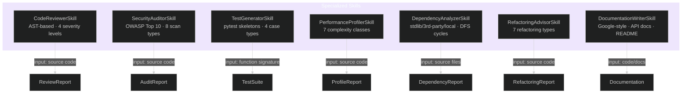
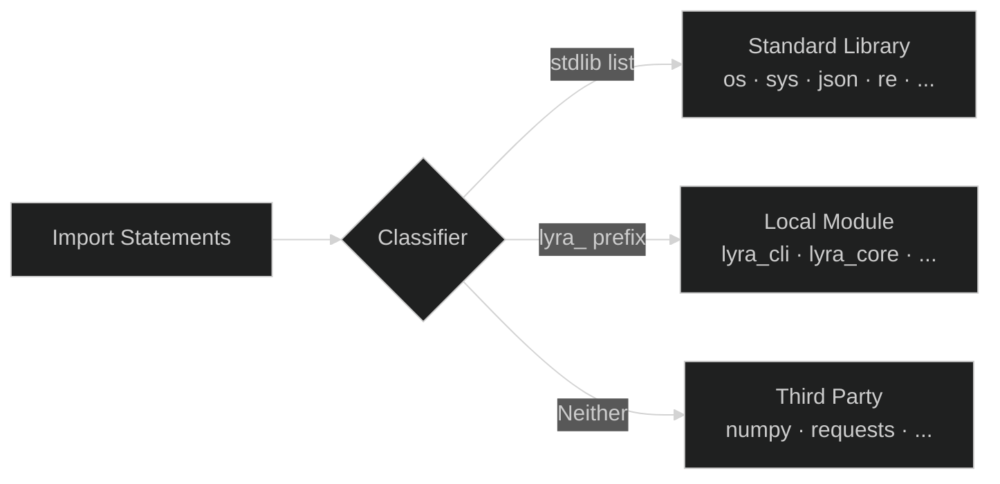
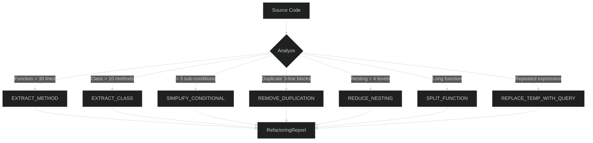
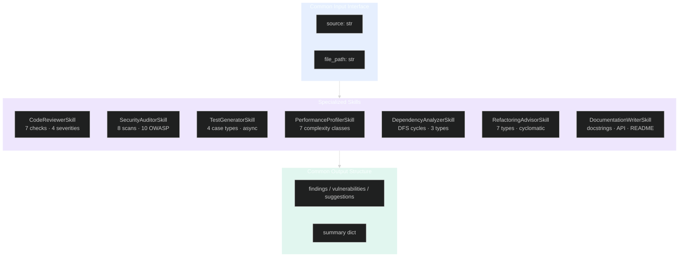

# Specialized Skills

> **7 domain-specific skills for code review, security audit, testing, profiling, dependency analysis, refactoring, and documentation**

## Table of Contents

- [Overview](#overview)
- [Skills Matrix](#skills-matrix)
- [Code Reviewer](#code-reviewer)
- [Security Auditor](#security-auditor)
- [Test Generator](#test-generator)
- [Performance Profiler](#performance-profiler)
- [Dependency Analyzer](#dependency-analyzer)
- [Refactoring Advisor](#refactoring-advisor)
- [Documentation Writer](#documentation-writer)
- [Architecture Diagram](#architecture-diagram)
- [Research Inspirations](#research-inspirations)

---

## Overview

Seven specialized skills provide production-grade code analysis, generation, and transformation capabilities. Each skill follows a consistent interface: accepts `input_data` dict, returns structured output with findings and summaries.

---

## Skills Matrix



### Capabilities Overview

| Skill | Input | Output | Checks |
|-------|-------|--------|--------|
| CodeReviewerSkill | Source code | ReviewReport | 7 AST checks, 5 security regex |
| SecurityAuditorSkill | Source code | AuditReport | 8 scan methods, 10 OWASP categories |
| TestGeneratorSkill | Source code | TestSuite | 4 case types per function |
| PerformanceProfilerSkill | Source code | ProfileReport | Complexity, nested loops, expensive calls |
| DependencyAnalyzerSkill | Sources dict | DependencyReport | Import classification, cycle detection |
| RefactoringAdvisorSkill | Source code | RefactoringReport | 7 refactoring types, cyclomatic complexity |
| DocumentationWriterSkill | Code/docs | Docs output | Google-style, API, README |

---

## Code Reviewer

AST-based code review with 4 severity levels and 5 finding categories.

### Review Checks

```mermaid
%%{init: {'theme': 'dark'}}%%
flowchart LR
    Source[Source Code] --> AST[AST Parse]
    AST --> Checks{7 Checks}
    
    Checks -->|Function Length > 50| F1[TOO_LONG_FUNCTION<br/>MEDIUM · code_smell]
    Checks -->|Bare Except| F2[BARE_EXCEPT<br/>HIGH · error_prone]
    Checks -->|Mutable Defaults| F3[MUTABLE_DEFAULT<br/>HIGH · error_prone]
    Checks -->|Debug Imports| F4[DEBUG_IMPORT<br/>MEDIUM · code_smell]
    Checks -->|range(len)| F5[RANGE_LEN<br/>LOW · performance]
    Checks -->|Regex Checks| F6[Security patterns<br/>CRITICAL · security]
    Checks -->|Style Checks| F7[Trailing WS · Line length<br/>LOW · style]
```

### Severity Levels

| Severity | Meaning | Example |
|----------|---------|---------|
| `CRITICAL` | Security vulnerability | `eval()`, `exec()`, `pickle.loads()` |
| `HIGH` | Bug-prone pattern | Bare except, mutable defaults |
| `MEDIUM` | Code smell | Long functions, debug imports |
| `LOW` | Style/performance | Trailing whitespace, `range(len(...))` |

### Example Usage

```python
from lyra_cli.skills.specialized.code_reviewer import CodeReviewerSkill

reviewer = CodeReviewerSkill()
result = reviewer.run({"source": source_code, "file_path": "my_module.py"})
print(result["summary"])  # {"critical": 0, "high": 1, "medium": 2, "low": 3}
```

---

## Security Auditor

OWASP Top 10 security scanning with 8 scan types and CVSS-inspired severity scoring.

### Scan Types

```mermaid
%%{init: {'theme': 'dark'}}%%
graph TB
    Source[Source Code] --> Scanner[Security Scanner]
    Scanner --> S1[Secrets Scan<br/>API keys · passwords · tokens]
    Scanner --> S2[SQL Injection<br/>String queries · f-strings]
    Scanner --> S3[XSS Scan<br/>innerHTML · dangerouslySetInnerHTML]
    Scanner --> S4[Path Traversal<br/>open() · Path()]
    Scanner --> S5[Insecure Deserialization<br/>pickle · yaml · marshal]
    Scanner --> S6[SSRF Scan<br/>requests · urllib]
    Scanner --> S7[Crypto Failures<br/>MD5 · SHA-1 · DES · ARC4]
    Scanner --> S8[Auth Failures<br/>Missing permissions · open access]
```

### OWASP Coverage

| OWASP Category | Coverage |
|---------------|----------|
| A01: Broken Access Control | Path traversal, auth failures |
| A02: Cryptographic Failures | Secrets, weak crypto |
| A03: Injection | SQL injection, XSS |
| A04: Insecure Design | -- |
| A05: Security Misconfiguration | -- |
| A06: Vulnerable Components | -- |
| A07: Auth Failures | Missing authentication |
| A08: Data Integrity | Insecure deserialization |
| A09: Logging Failures | -- |
| A10: SSRF | Server-side request forgery |

### Example Usage

```python
from lyra_cli.skills.specialized.security_auditor import SecurityAuditorSkill

auditor = SecurityAuditorSkill()
result = auditor.run({"source": source_code, "file_path": "app.py"})
for vuln in result["vulnerabilities"]:
    print(f"[{vuln['severity']}] {vuln['title']} at line {vuln['line']}")
```

---

## Test Generator

Generates pytest test skeletons from function signatures with 4 case types.

### Generated Case Types

```mermaid
%%{init: {'theme': 'dark'}}%%
flowchart LR
    Func[Function Signature] --> Gen[Test Generator]
    Gen --> HP[Happy Path]
    Gen --> EC[Edge Case]
    Gen --> BC[Boundary Value]
    Gen --> ER[Error Case]
    
    HP --> Code[test_{func}_happy_path]
    EC --> Code
    BC --> Code[test_{func}_boundary_{arg}]
    ER --> Code[test_{func}_error_handling]
    
    Code --> Output[pytest test file]
```

### Supported Features

| Feature | Support |
|---------|---------|
| Synchronous functions | Yes |
| Async functions (`async def`) | Yes |
| Class methods | Yes |
| Parameter analysis | Happy/edge/boundary/error |
| Return type detection | Used for assertion generation |
| Default value handling | Optional parameter tests |

### Example Output

```python
"""Auto-generated tests for my_function."""

import pytest

def test_my_function_happy_path():
    """Test my_function with valid inputs."""
    result = my_function(input_data)
    assert result is not None
```

---

## Performance Profiler

Static analysis of time complexity with 7 complexity classes.

### Complexity Classification

```mermaid
%%{init: {'theme': 'dark'}}%%
graph LR
    Code[Source Code] --> Analyze[Analyze Loops · Recursion · Calls]
    Analyze --> Classify{Complexity Class}
    
    Classify -->|No loops| C1[O(1) Constant]
    Classify -->|Single loop| C2[O(n) Linear]
    Classify -->|Nested loops| C3[O(n^2) Quadratic]
    Classify -->|Triple nested| C4[O(n^3) Cubic]
    Classify -->|Recursive| C5[O(2^n) Exponential]
    Classify -->|Sort in loop| C6[O(n log n) Linearithmic]
    Classify -->|Ambiguous| C7[O(?) Unknown]
```

### Expensive Call Detection

| Call | Detected As | Estimated Impact |
|------|------------|------------------|
| `deepcopy()` | O(n) | Medium |
| `sort()` in loop | O(n log n) per iteration | High |
| `sorted()` in loop | O(n log n) per iteration | Medium |

### Example Usage

```python
from lyra_cli.skills.specialized.performance_profiler import PerformanceProfilerSkill

profiler = PerformanceProfilerSkill()
result = profiler.run({"source": source_code, "module_name": "my_app"})
for r in result["results"]:
    print(f"{r['name']}: {r['estimated_complexity']} (score: {r['optimization_score']})")
```

---

## Dependency Analyzer

Classifies imports and detects circular dependencies using DFS.

### Import Classification



### Circular Dependency Detection

Uses DFS with path tracking to detect cycles in the module dependency graph:

```python
# Example detected cycle
CircularDependency(
    cycle=("module_a", "module_b", "module_c", "module_a"),
    severity="high",  # "high" for cycles <= 3 nodes
)
```

### Health Score

The health score is calculated as:

```
health = max(0, 100 - (unused_imports * 5) - (circular_deps * 15) - (third_party_ratio * 50))
```

### Example Usage

```python
from lyra_cli.skills.specialized.dependency_analyzer import DependencyAnalyzerSkill

analyzer = DependencyAnalyzerSkill()
result = analyzer.run({
    "source": source_code,
    "module_name": "my_module",
    "all_sources": {"mod_a": source_a, "mod_b": source_b},
})
print(result["statistics"]["health_score"])  # e.g., 85
```

---

## Refactoring Advisor

Detects 7 types of refactoring opportunities with before/after code suggestions.

### Refactoring Types



### Detection Thresholds

| Refactoring | Threshold | Complexity Score |
|-------------|-----------|------------------|
| EXTRACT_METHOD | > 30 lines | `min(lines // 10, 10)` |
| EXTRACT_CLASS | > 10 methods | `min(methods // 3, 10)` |
| SIMPLIFY_CONDITIONAL | > 3 sub-conditions | `complexity` |
| REMOVE_DUPLICATION | >= 2 occurrences | 2 |
| REDUCE_NESTING | > 4 levels | `depth` |

### Cyclomatic Complexity

Condition complexity is measured by counting boolean operators, comparisons, and function calls in a conditional expression:

```python
# Complexity 3
if a and b or c > 5:
    pass
```

### Example Usage

```python
from lyra_cli.skills.specialized.refactoring_advisor import RefactoringAdvisorSkill

advisor = RefactoringAdvisorSkill()
result = advisor.run({"source": source_code, "file_path": "app.py"})
for s in result["suggestions"]:
    print(f"[{s['type']}] {s['description']}")
```

---

## Documentation Writer

Generates Google-style docstrings, API endpoint documentation, and README files.

### Capabilities

| Feature | Description |
|---------|-------------|
| Google-style docstrings | Parameters, returns, raises |
| API endpoint docs | Request/response schemas |
| README generation | Project overview, quick start |
| Code comments | Inline documentation |

---

## Architecture Diagram

### Complete Skills System



---

## Research Inspirations

| Innovation | Source | Application |
|-----------|--------|-------------|
| **AST-Based Review** | pylint, flake8 | 7 structural checks on Python AST |
| **OWASP Top 10** | OWASP Foundation | 8 scan types covering all 10 categories |
| **CVSS Severity** | NVD/CVSS v3 | 5-level severity scoring |
| **DFS Cycle Detection** | Graph theory | Circular dependency detection |
| **Cyclomatic Complexity** | McCabe | Condition complexity scoring |
| **Complexity Classes** | Big-O notation | 7-class time complexity estimation |
| **Circular Dependencies** | Software architecture | Path-tracking DFS for module cycles |
| **Google-Style Docstrings** | Google Python Style Guide | Documentation generation format |
