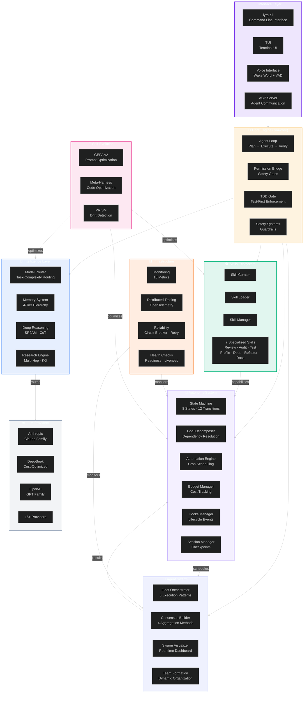
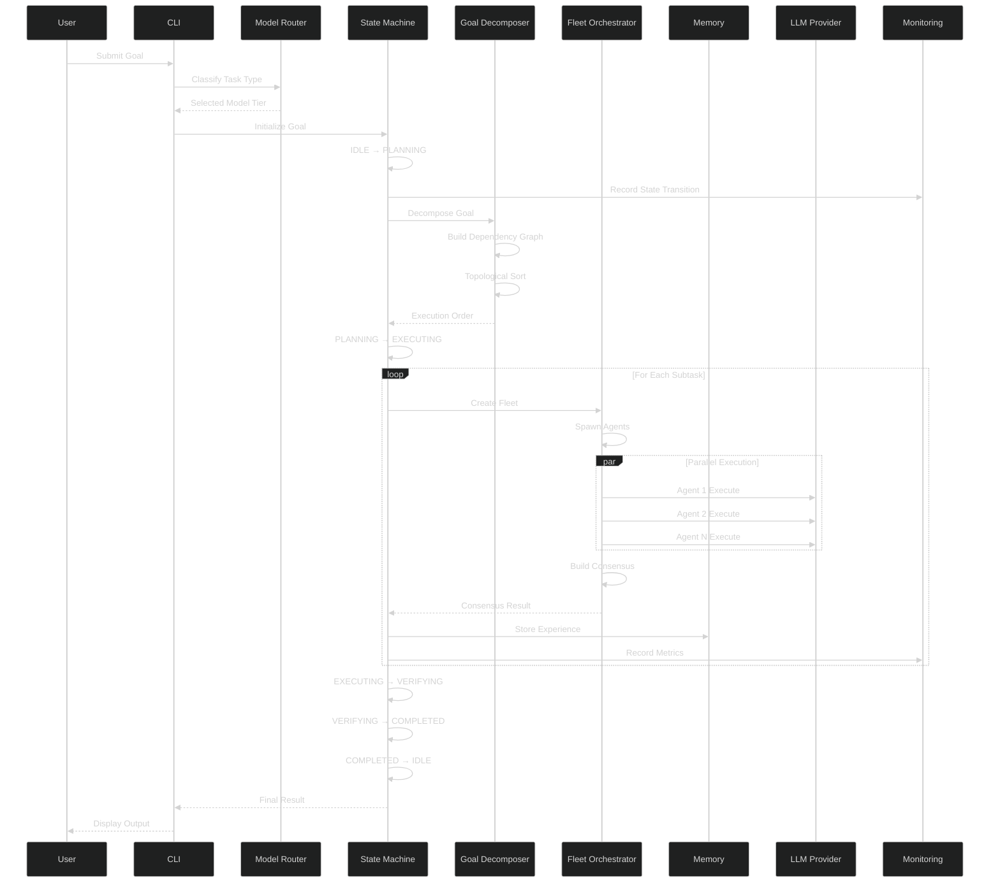
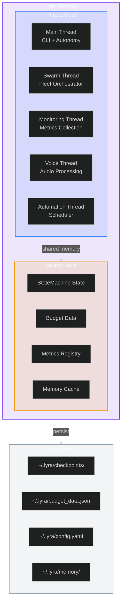
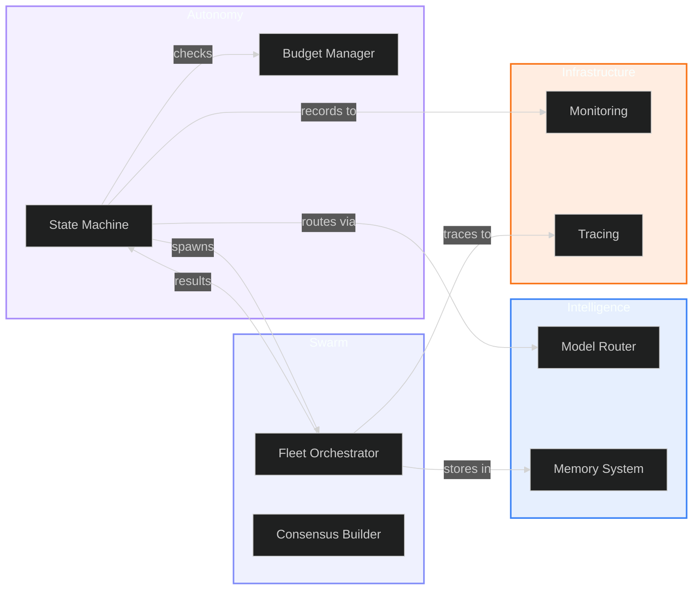
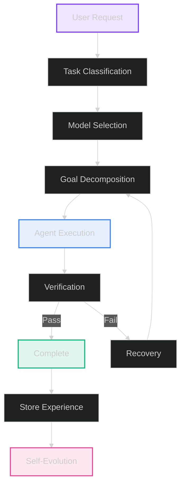

# Lyra AGI System Architecture Overview

**Version:** 2.0  
**Date:** 2026-05-30  
**Status:** Production

---

## Executive Summary

Lyra is a production-grade autonomous AI system featuring multi-agent orchestration, intelligent model routing, advanced memory architecture, and self-evolution capabilities. The system consists of 99 packages organized into 8 major subsystems, designed for autonomous operation, cost optimization, and continuous improvement.

### Key Capabilities

- **Autonomous Operation**: Goal-driven execution with state machines and scheduling
- **Multi-Agent Swarm**: Parallel agent execution with consensus building
- **Intelligent Routing**: Task-complexity-based model selection (40-50% cost reduction)
- **Advanced Memory**: 4-tier memory hierarchy with automatic consolidation
- **Deep Research**: Multi-hop reasoning with knowledge graph construction
- **Self-Evolution**: Continuous learning and optimization
- **Voice Control**: Natural language interaction with wake word detection

---

## System Architecture

### High-Level Component Map



---

## Data Flow Architecture

### Complete Request Flow



---

## Core Subsystems

### 1. Autonomy System

**Purpose**: Goal-driven autonomous execution with state management

**Key Components**:
- **State Machine**: 8-state FSM with guarded transitions
- **Goal Decomposer**: Kahn's algorithm for dependency resolution
- **Session Manager**: JSON checkpoint persistence
- **Automation Engine**: Cron-like scheduling
- **Budget Manager**: Cost tracking with limits
- **Hooks Manager**: 5 lifecycle events

**Location**: `packages/lyra-cli/src/lyra_cli/autonomy/`

**Documentation**: [autonomy-system.md](./autonomy-system.md)

---

### 2. Agent Swarm

**Purpose**: Multi-agent parallel execution with consensus building

**Key Components**:
- **Fleet Orchestrator**: 5 execution patterns (fan-out, pipeline, map-reduce, tournament, ensemble)
- **Consensus Builder**: 4 aggregation methods (majority, weighted, unanimous, threshold)
- **Swarm Visualizer**: Real-time tmux dashboard
- **Team Formation**: Dynamic agent organization

**Location**: `packages/lyra-agent-swarm/`

**Documentation**: [agent-swarm.md](./agent-swarm.md)

---

### 3. Model Router

**Purpose**: Intelligent model selection for cost optimization

**Key Features**:
- Task-complexity assessment
- 5-tier model cascading (Haiku → Sonnet → Opus)
- Provider-family routing (11 providers)
- Cost tracking and optimization
- 40-50% cost reduction achieved

**Location**: `packages/lyra-cli/src/lyra_cli/llm_router.py`

**Documentation**: [model-router.md](./model-router.md)

---

### 4. Memory Architecture

**Purpose**: Multi-tier memory with automatic consolidation

**Key Features**:
- 4-tier hierarchy: Working → Episodic → Semantic → Procedural
- Retrieval-first design (20× impact)
- Thermodynamic arbitration
- Utility-based pruning
- Cross-session persistence

**Location**: `packages/lyra-memory/`

**Documentation**: [MEMORY-ARCHITECTURE-V2.md](./MEMORY-ARCHITECTURE-V2.md)

---

### 5. Research Engine

**Purpose**: Multi-hop deep research with knowledge graphs

**Key Features**:
- Iterative query refinement
- Knowledge graph construction
- Source credibility scoring
- 5 research strategies
- Citation management

**Location**: `packages/lyra-research/`

**Documentation**: [research-engine.md](./research-engine.md)

---

### 6. Skills System

**Purpose**: Extensible skill library with specialized capabilities

**Specialized Skills**:
1. **Code Reviewer**: AST-based code review (7 structural + 5 security checks)
2. **Security Auditor**: OWASP Top 10 scanning (8 scan types)
3. **Test Generator**: pytest skeleton generation
4. **Performance Profiler**: Complexity estimation
5. **Dependency Analyzer**: Import analysis with cycle detection
6. **Refactoring Advisor**: Code smell detection
7. **Documentation Writer**: Docstring generation

**Location**: `packages/lyra-cli/src/lyra_cli/skills/`

**Documentation**: [skills-system.md](./skills-system.md)

---

### 7. Infrastructure

**Purpose**: Monitoring, tracing, reliability, and health checks

**Key Components**:
- **Monitoring**: 18 default metrics (counter, gauge, histogram)
- **Tracing**: OpenTelemetry-compatible distributed tracing
- **Reliability**: Circuit breaker, retry with exponential backoff
- **Health Checks**: Readiness and liveness probes
- **Profiler**: cProfile + tracemalloc integration

**Location**: `packages/lyra-cli/src/lyra_cli/infrastructure/`

**Documentation**: [MONITORING-SYSTEM.md](./MONITORING-SYSTEM.md)

---

### 8. Self-Evolution

**Purpose**: Continuous learning and optimization

**Key Components**:
- **GEPA v2**: Prompt optimization through evolution
- **Meta-Harness**: Code optimization and refactoring
- **PRISM**: Performance drift detection
- **AEvo**: Procedure editing and improvement

**Location**: Various packages

**Documentation**: [autonomy-system.md](./autonomy-system.md#self-evolution)

---

## Technology Stack

### Core Technologies

| Layer | Technology | Purpose |
|-------|-----------|---------|
| **Language** | Python 3.11+ | Core implementation |
| **CLI Framework** | Click | Command-line interface |
| **TUI Framework** | Textual | Terminal user interface |
| **Async Runtime** | asyncio | Asynchronous execution |
| **Testing** | pytest | Unit and integration tests |
| **Type Checking** | mypy | Static type analysis |
| **Packaging** | uv | Fast Python package manager |

### LLM Providers

| Provider | Models | Use Case |
|----------|--------|----------|
| **Anthropic** | Claude Opus 4.7, Sonnet 4.6, Haiku 4.5 | Primary provider, all task types |
| **DeepSeek** | v4-pro, v4-flash, chat | Cost-optimized alternative |
| **OpenAI** | o3, GPT-4o, GPT-3.5-turbo | Reasoning and coding |
| **Gemini** | 2.5-pro-preview, 2.5-flash | Google ecosystem |
| **Others** | Mistral, Qwen, xAI, Groq, Cerebras, Ollama | Specialized use cases |

### Infrastructure

| Component | Technology | Purpose |
|-----------|-----------|---------|
| **Monitoring** | Custom metrics + Prometheus-compatible | System observability |
| **Tracing** | OpenTelemetry | Distributed tracing |
| **Storage** | JSON files, SQLite | Persistence |
| **Voice** | Porcupine, WebRTC VAD | Wake word detection |
| **Speech** | Whisper, TTS engines | Speech processing |

---

## Performance Characteristics

### System Benchmarks

| Metric | Value | Target |
|--------|-------|--------|
| **Total Tests** | 550+ | 80%+ coverage |
| **Packages** | 99 | Modular architecture |
| **Cost Reduction** | 40-50% | vs. always-Opus baseline |
| **Memory Efficiency** | 30-50× | Token reduction |
| **Retrieval Accuracy** | >95% | Needle-in-haystack |
| **State Transition** | <1ms | Autonomy FSM |
| **Model Selection** | <2ms | Routing overhead |

### Scalability

| Dimension | Current | Target |
|-----------|---------|--------|
| **Concurrent Agents** | 10-20 | 100+ |
| **Context Window** | 8K-200K | 3.5M tokens |
| **Memory Growth** | Linear | Controlled |
| **Request Throughput** | 10-50 req/s | 1000+ req/s |

---

## Deployment Architecture

### Single-Process Deployment



### File System Layout

```
~/.lyra/
├── checkpoints/              # Session checkpoints
│   ├── sess_abc-20260530T120000Z.json
│   └── sess_def-20260530T130000Z.json
├── budget_data.json          # Cost tracking journal
├── config.yaml               # User configuration
├── memory/                   # Memory persistence
│   ├── working/              # Working memory
│   ├── episodic/             # Episodic memory
│   ├── semantic/             # Semantic memory
│   └── procedural/           # Procedural memory
├── research/                 # Research artifacts
│   ├── knowledge_graph.json
│   └── research_cache/
└── logs/                     # System logs
    ├── autonomy.log
    ├── swarm.log
    └── monitoring.log
```

---

## Integration Points

### Internal Integration



### External Integration

| Integration | Protocol | Purpose |
|-------------|----------|---------|
| **LLM Providers** | HTTP/HTTPS | Model inference |
| **File System** | OS calls | Persistence |
| **Tmux** | tmux CLI | Swarm dashboard |
| **Audio System** | OS audio APIs | Voice I/O |
| **MCP Servers** | MCP Protocol | Tool execution |
| **Plugin System** | Python imports | Skill extensions |

---

## Security & Safety

### Safety Mechanisms

1. **Permission Bridge**: Explicit user approval for sensitive operations
2. **Budget Limits**: Hard caps on API spending ($10/day, $200/month)
3. **TDD Gate**: Enforce test-first development
4. **Safety Guardrails**: Content filtering and ethical constraints
5. **Circuit Breaker**: Prevent cascading failures
6. **Audit Logging**: Track all system actions

### Security Features

1. **Input Validation**: Sanitize all user inputs
2. **Credential Management**: Secure API key storage
3. **Sandboxed Execution**: Isolated agent execution
4. **Rate Limiting**: Prevent abuse
5. **Error Handling**: Graceful degradation
6. **Security Auditor**: OWASP Top 10 scanning

---

## Development Workflow

### Standard Development Flow



---

## Future Roadmap

### Phase 1: Foundation (Complete)
- ✅ Core autonomy system
- ✅ Agent swarm orchestration
- ✅ Model routing
- ✅ Basic memory system
- ✅ Infrastructure monitoring

### Phase 2: Intelligence (In Progress)
- 🔄 Advanced memory architecture (4-tier)
- 🔄 Deep research engine
- 🔄 Self-evolution capabilities
- 🔄 Voice control integration

### Phase 3: Scale (Planned)
- 📋 Distributed execution
- 📋 Multi-tenant support
- 📋 Cloud deployment
- 📋 Enterprise features

### Phase 4: AGI (Research)
- 🔬 Emergent capabilities
- 🔬 Meta-learning
- 🔬 Recursive self-improvement
- 🔬 General intelligence

---

## Related Documentation

### Architecture Documents
- [Autonomy System](./autonomy-system.md) - State machines and goal decomposition
- [Agent Swarm](./agent-swarm.md) - Multi-agent orchestration
- [Model Router](./model-router.md) - Intelligent model selection
- [Memory Architecture](./MEMORY-ARCHITECTURE-V2.md) - 4-tier memory system
- [Research Engine](./research-engine.md) - Multi-hop research
- [Skills System](./skills-system.md) - Specialized capabilities
- [Monitoring System](./MONITORING-SYSTEM.md) - Infrastructure observability

### User Documentation
- [User Guide](../USER_GUIDE.md) - Getting started
- [API Documentation](../API_DOCUMENTATION.md) - API reference
- [Developer Guide](../DEVELOPER_GUIDE.md) - Development guide

### Research & Design
- [Research Summary](../RESEARCH_SUMMARY.md) - Research findings
- [Design Documents](../design/) - Design decisions
- [Performance Benchmarks](../PERFORMANCE_BENCHMARKS.md) - Performance data

---

<div align="center">

**Lyra AGI System Architecture**

Version 2.0 | 2026-05-30 | Production

[README](../../README.md) · [Architecture](./README.md) · [User Guide](../USER_GUIDE.md)

</div>
