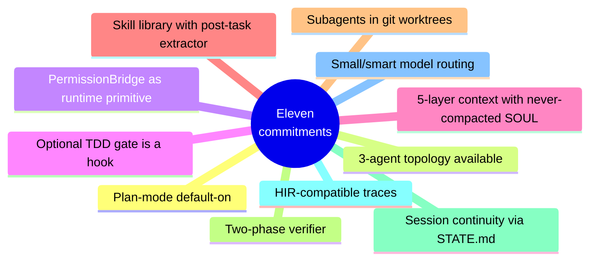
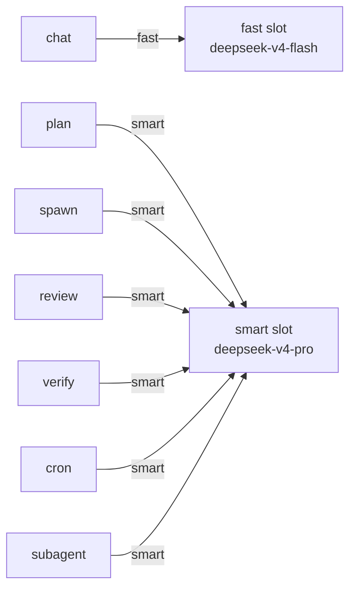

# Eleven commitments advanced

A commitment is a design choice we're willing to be wrong about. Each
of these has a single-sentence contract, the failure it prevents, and
the cost it accepts. The cost is the honest part.

This is the most opinionated page on this site. If you only read one
architecture page, read this one.

## At a glance

---

## 1. Plan Mode default-on

Every non-trivial task routes through Plan Mode first. Plan written
to `.lyra/plans/<session>.md`, user approves, only then execution
begins with write permissions. Skipped via `--no-plan` for trivial
tasks.

| | |
|---|---|
| **Prevents** | 60% of long-horizon failures start with a misinterpreted brief. |
| **Accepts** | ~30 seconds of latency on short tasks. |

## 2. Three-agent topology available; single-agent default

Built-in [harness plugins](harness-plugins.md): `single-agent`
(default), `three-agent` (Planner / Generator / Evaluator with
different-family judge), `dag-teams` (SemaClaw two-phase for
multi-strand work). Selectable per-task via `--harness` flag or
auto-chosen from plan complexity.

| | |
|---|---|
| **Prevents** | Narrative fluency without verification; long compound errors. |
| **Accepts** | ~1.6× token cost when three-agent is selected; requires two model families. |

## 3. PermissionBridge is a runtime primitive

Authorization checkpoints are **declared on tool schemas**, not
decided by the LLM. Every tool invocation flows through
[`permissions/bridge.py`](../concepts/permission-bridge.md), which
consults rules + ML risk classifier + mode → `allow` / `ask` / `deny`
/ `park`.

| | |
|---|---|
| **Prevents** | LLM-convinced bypass of safety rules; prompt-injection-driven tool misuse. |
| **Accepts** | One extra API decision per tool call, ~2ms median overhead. |

## 4. Optional TDD gate is a hook, not a prompt

When the optional [TDD plugin](../howto/tdd-gate.md) is enabled
(off by default in v3.0+), the gate is deterministic code on
`PRE_TOOL_USE(edit|write)` and `STOP`. It blocks mutations to
`src/**` unless the session has a recent failing test, and blocks
session completion unless the relevant tests pass.

| | |
|---|---|
| **Prevents** (when on) | "Test-after" habits, debt accumulation, drift between spec and implementation. |
| **Accepts** (when on) | ~200–800 ms per Edit; higher friction for exploratory work. When off, none of the above costs apply. |

## 5. Five-layer context pipeline with a never-compacted SOUL

[Context engine](../concepts/context-engine.md) maintains five tiers:
cached system prefix, cached mid (SOUL + plan + todo + skill descs),
dynamic recent turns, compaction summaries, offloaded memory
references. `SOUL.md` lives in the cached mid tier and is **never
auto-compacted**.

| | |
|---|---|
| **Prevents** | Identity drift, context rot, runaway token costs. |
| **Accepts** | SOUL.md size cap (~2 KB default); compaction has adjustable thresholds. |

## 6. Skill library with post-task extraction loop

[Skills](../concepts/skills.md) are the unit of capability. `SKILL.md`
format compatible with Claude Code / OpenClaw. After every completed
task, the skill extractor evaluates whether the successful trajectory
should become a new skill or augment an existing one. Refinement
follows the Hermes outcome-fed pattern (success / partial / fail).

| | |
|---|---|
| **Prevents** | Re-learning the same pattern across sessions. |
| **Accepts** | Memory growth; requires self-eval every 15 tasks to prune bad skills. |

## 7. Subagents in git worktrees

Parallel [subagents](../concepts/subagents.md) each get their own git
worktree on a session branch, merged back via fast-forward or 3-way
merge on completion. Shared filesystem access is read-only.

| | |
|---|---|
| **Prevents** | Incoherent parallel edits stomping each other. |
| **Accepts** | Disk overhead (~100 MB per subagent on average repo); occasional merge conflicts surfaced to user. |

## 8. Two-phase verifier with cross-channel evidence

The verifier runs Phase 1 objective checks (tests / types / lint /
expected-files) cheaply; only on pass does Phase 2 subjective LLM
evaluator (different-family) examine the artifact. Cross-channel
verification requires **trace + diff + environment snapshot** to
agree before a task may be marked complete.

| | |
|---|---|
| **Prevents** | Fabricated success, sabotage, test-disable tricks. |
| **Accepts** | Two model families. Cost of cross-channel checks. |

## 9. Session continuity via human-readable STATE.md

Session state persists to `.lyra/state/STATE.md`: plan status,
remaining items, open questions, current hypothesis, last tool calls.
Resume reads STATE.md + last N turns from `recent.jsonl`. Git commits
are atomic checkpoints. **No binary pickle.**

| | |
|---|---|
| **Prevents** | Ungreppable state, vendor lock-in, opaque crash recovery. |
| **Accepts** | Some ephemeral information loss (tool-call arguments older than a few turns). |

## 10. HIR-compatible trace emission

Every span the observability layer emits includes OTel GenAI semantic
attributes plus primitive tags compatible with the Gnomon HIR schema.
No extra adapter needed to run HAFC / SHP / autogenesis tools against
a Lyra trace.

| | |
|---|---|
| **Prevents** | Trace format lock-in, reinvention of evaluation infrastructure. |
| **Accepts** | HIR schema stability risk (we mirror upstream; breaking changes require migration script). |

## 11. Small/smart model routing

Lyra adopts Claude Code's two-tier model pattern (Haiku for cheap
turns, Sonnet for reasoning) but generalised across providers. Every
`InteractiveSession` carries two slots — `fast_model` and
`smart_model` — and a single `_resolve_model_for_role(session, role)`
helper maps each request to a slot:

| | |
|---|---|
| **Prevents** | Paying reasoning-tier cost on chat turns; paying chat-tier latency on planning; vendor lock-in. |
| **Accepts** | Two model slugs per session; slot-routing logic that the loop, planner, subagent runner, cron daemon, and post-turn reviewer must all pass through. |

---

## Reading the full reasoning

The original [architecture spec](../architecture.md) carries each
commitment with its target metrics (e.g. SWE-bench targets, sabotage
leak rates), and [trade-offs](../architecture-tradeoff.md) walks
through every alternative considered. If a commitment surprises you,
the trade-off doc is where the "why not X?" answers live.

[← System topology](topology.md){ .md-button }
[Continue to Harness plugins →](harness-plugins.md){ .md-button .md-button--primary }
