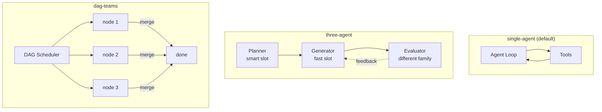
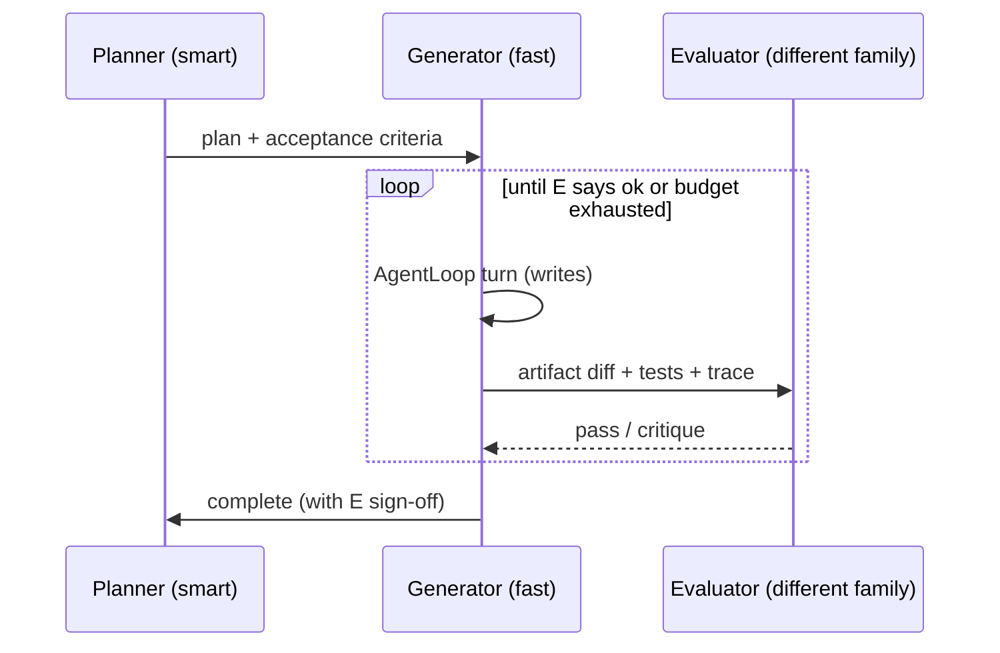
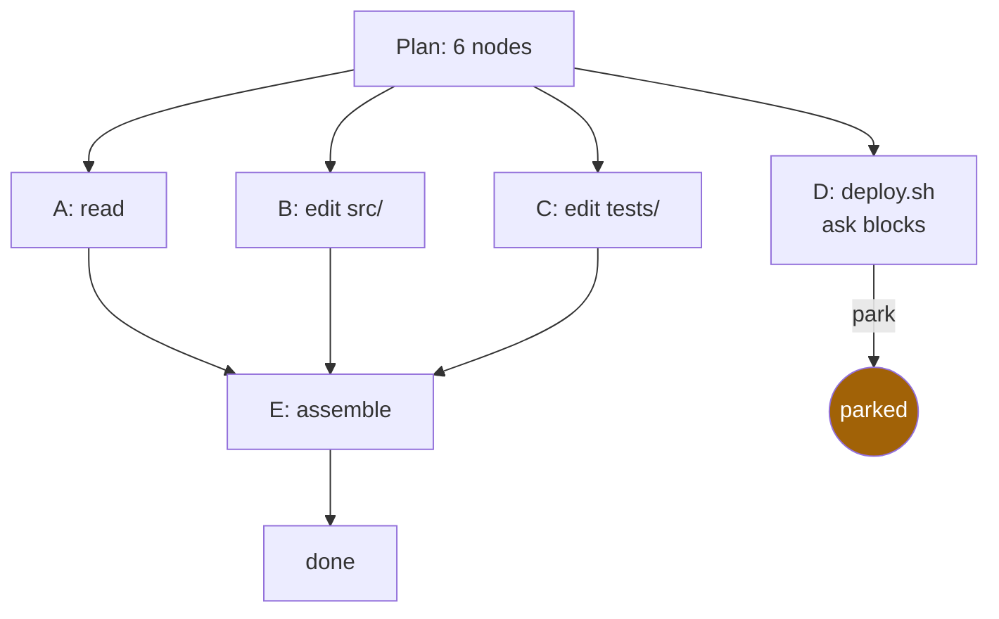

# Harness plugins <span class="lyra-badge advanced">advanced</span>

A **harness plugin** is the strategy pattern Lyra uses to pick the
*topology* of a session: how many agents, how they cooperate, where
the verification boundary lies. Three are built in; the API is small
enough that you can write your own.

The base contract lives at
[`lyra_core/adapters/`](https://github.com/lyra-contributors/lyra/tree/main/packages/lyra-core/src/lyra_core/adapters)
(formerly `lyra_core/harnesses/`; the old path is a re-export shim
that warns on import).

## The three built-ins



| Plugin | When chosen | Cost shape |
|---|---|---|
| `single-agent` | Default | 1 agent, 1 model |
| `three-agent` | Plan flagged as high-risk or requiring different-family check | ~1.6× tokens, 2 model families |
| `dag-teams` | Plan has multiple independent strands | k parallel workers, smart-slot for each |

Selection is automatic from plan complexity, or forced with
`lyra run --harness <name>`.

## The plugin contract

```python title="lyra_core/adapters/base.py"
class HarnessPlugin(Protocol):
    name: str
    description: str

    def select(self, plan: Plan, session: Session) -> bool:
        """Return True if this plugin should run for this plan."""

    def run(self, session: Session, plan: Plan) -> RunResult:
        """Drive the topology end-to-end."""

def register_harness(plugin: HarnessPlugin) -> None: ...
def get_harness(name: str) -> HarnessPlugin: ...
```

A plugin is just a class with a name, a `select()` voter, and a
`run()` driver. The Gateway calls `select()` on every registered
plugin and picks the highest-priority `True` (priority is implicit in
registration order).

## Single-agent

Default. The `AgentLoop` runs once with the session's allowed tools,
the user's chosen mode, and whatever `SOUL.md` + plan are in context.
Most workflows are this.

```python
class SingleAgentHarness:
    name = "single-agent"
    def select(self, plan, session): return True   # always voteable
    def run(self, session, plan):
        return AgentLoop(session).run(plan.task)
```

## Three-agent

Three loops, two model families:



The Evaluator must be a **different model family** than the Generator
— this is the "two heads disagree" check that catches narrative
fluency without verification. Configure in `~/.lyra/config.toml`:

```toml
[harness.three_agent]
planner   = "anthropic:claude-3-5-sonnet-latest"
generator = "deepseek:deepseek-chat"
evaluator = "openai:gpt-4o"          # MUST differ from generator family
```

## DAG-teams

For plans that decompose into independent strands. The DAG scheduler
runs nodes in parallel, with per-node permission decisions and
`PARK` support so one stalled approval doesn't block the team.



Source: [`lyra_core/adapters/dag_teams.py`](https://github.com/lyra-contributors/lyra/tree/main/packages/lyra-core/src/lyra_core/adapters/dag_teams.py).

The DAG type itself is in `lyra_core.adapters.DAG`; it's a small
typed graph with `validate_dag()` for cycle/scope checks.

## Writing your own plugin

Minimum viable plugin:

```python title="my_plugin/harnesses.py"
from lyra_core.adapters import HarnessPlugin, register_harness, AgentLoop, Plan, Session, RunResult

class CautiousHarness:
    name = "cautious"
    description = "Single-agent with extra verifier passes between every 5 tool calls."

    def select(self, plan: Plan, session: Session) -> bool:
        return plan.metadata.get("risk_label") == "high"

    def run(self, session: Session, plan: Plan) -> RunResult:
        loop = AgentLoop(session)
        result = loop.run(plan.task, on_step=self._maybe_verify)
        return result

    def _maybe_verify(self, step: int, transcript) -> None:
        if step % 5 == 0:
            verifier.run_phase1(transcript)

register_harness(CautiousHarness())
```

After registration the plugin shows up in `lyra harnesses list`, in
`/harness <name>`, and is voteable on every Plan.

## Selection precedence

1. `--harness <name>` flag → forced; skip voting.
2. Plan-frontmatter override (`harness: dag-teams`) → forced.
3. Voting: each registered plugin's `select()` runs; highest-priority
   `True` wins. Priority = registration order, with built-ins
   registered first.

## Where to look in the source

| File | What lives there |
|---|---|
| `lyra_core/adapters/__init__.py` | Public API: `HarnessPlugin`, `register_harness`, `get_harness`, `DAG`, `validate_dag` |
| `lyra_core/adapters/base.py` | `HarnessPlugin` protocol + registry |
| `lyra_core/adapters/dag_teams.py` | DAG scheduler with park support |
| `lyra_core/harnesses/*` | Deprecated re-export shim — emits `DeprecationWarning` |

[← Eleven commitments](commitments.md){ .md-button }
[Continue to Reference →](../reference/index.md){ .md-button .md-button--primary }
