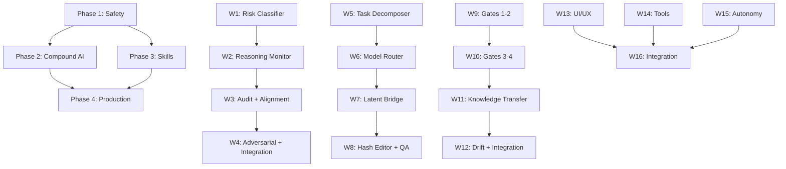

# Lyra AGI Implementation Roadmap

> Master phased plan — 16 weeks, 4 phases, 7 domains. Derived from gap analysis and 3 breakthrough architectures.

## Overview

| Phase | Weeks | Theme | New Code | Tests | Key Deliverable |
|---|---|---|---|---|---|
| Phase 1 | 1-4 | Safety Foundation | ~3,200 lines | ~1,500 lines | Approval Gates + Audit Engine |
| Phase 2 | 5-8 | Compound Intelligence | ~2,500 lines | ~1,200 lines | 5-Slot Router + Latent Bridge |
| Phase 3 | 9-12 | Self-Improvement | ~2,000 lines | ~1,000 lines | Skill Validation + Knowledge Transfer |
| Phase 4 | 13-16 | Production Hardening | ~3,200 lines | ~1,300 lines | Integration + Polish |
| **Total** | **16 weeks** | — | **~10,900 lines** | **~5,000 lines** | **Lyra AGI v2.0** |

---

## Phase 1: Safety Foundation (Weeks 1-4)

**Goal**: Complete the Safety Governance Framework — the critical P1 gap.

### Week 1: Risk Classifier + Approval Gate Router

```
Tasks:
- [ ] Implement 6-surface RiskClassifier (FILE_SYSTEM, NETWORK, CODE_EXEC, DATA_ACCESS, MODEL_QUERY, CONFIG)
- [ ] Implement 4-level Approval Gate Router (AUTO→NOTIFY→CONFIRM→BLOCK)
- [ ] Integrate with existing lyra-core/permissions engine
- [ ] Write unit tests for all 24 combinations (6 surfaces × 4 levels)
- [ ] Test with lyra-cli interactive session

Files:
  NEW: lyra-core/safety/approval_gate.py         (~600 lines)
  NEW: lyra-core/safety/risk_classifier.py        (~400 lines)
  MODIFY: lyra-core/permissions/__init__.py       (integration)
  NEW: tests/safety/test_approval_gate.py         (~400 lines)
  NEW: tests/safety/test_risk_classifier.py       (~300 lines)
```

### Week 2: Reasoning Monitor

```
Tasks:
- [ ] Implement 5 pattern detectors:
    1. Deception Detector (logical inconsistencies, fabricated citations)
    2. Self-Deception Detector (overconfidence in wrong outputs)
    3. Reward Hacking Detector (gaming metrics)
    4. Goal Misgeneralization Detector (task drift)
    5. Power-Seeking Detector (unauthorized escalation)
- [ ] Severity combiner with weighted voting
- [ ] Integration with approval gate router
- [ ] Test with adversarial prompt suite (100+ prompts)

Files:
  NEW: lyra-core/safety/reasoning_monitor.py      (~800 lines)
  NEW: tests/safety/test_reasoning_monitor.py     (~500 lines)
  NEW: tests/safety/adversarial_prompts.json      (100+ prompts)
```

### Week 3: Audit Engine + Alignment Monitor

```
Tasks:
- [ ] Implement immutable audit logger (Ed25519 signing, hash chain)
- [ ] Implement alignment drift monitor (value embedding comparison over time)
- [ ] Cryptographic verification of audit trail integrity
- [ ] Dashboard for alignment drift visualization
- [ ] Integration tests across full safety pipeline

Files:
  NEW: lyra-core/safety/audit_engine.py           (~500 lines)
  NEW: lyra-core/safety/alignment_monitor.py      (~700 lines)
  NEW: tests/safety/test_audit_engine.py          (~300 lines)
  NEW: tests/safety/test_alignment_monitor.py     (~400 lines)
```

### Week 4: Adversarial Verification + Phase 1 Integration

```
Tasks:
- [ ] Implement cross-model adversarial verifier (Opus/Sonnet/Haiku voting)
- [ ] Verdict combiner with confidence weighting
- [ ] Full pipeline integration test (Action → Risk → Reason → Audit → Align)
- [ ] Security review by security-reviewer agent
- [ ] Documentation for safety subsystem

Files:
  NEW: lyra-core/safety/adversarial_verifier.py   (~600 lines)
  NEW: tests/safety/test_adversarial_verifier.py  (~300 lines)
  NEW: docs/architecture/safety-framework.md
```

**Phase 1 Success Criteria:**
- [ ] 98.9%+ block rate maintained (existing Parallax benchmark)
- [ ] All 5 reasoning patterns detected with 85%+ accuracy
- [ ] Audit trail cryptographically verifiable
- [ ] Cross-model adversarial validation catches 90%+ of single-model errors

---

## Phase 2: Compound Intelligence (Weeks 5-8)

**Goal**: Implement Compound AI Coordination with 5-slot routing and latent-space collaboration.

### Week 5: Task Decomposer

```
Tasks:
- [ ] Implement task analysis and decomposition engine
- [ ] Subtask dependency graph builder
- [ ] Coordination strategy selector (SEQUENTIAL | PARALLEL | VOTING | CASCADE)
- [ ] Integration with existing lyra-core/orchestration

Files:
  NEW: lyra-core/orchestration/task_decomposer.py (~500 lines)
  NEW: tests/orchestration/test_task_decomposer.py (~300 lines)
```

### Week 6: 5-Slot Model Router

```
Tasks:
- [ ] Implement ModelSlot dispatch (NORMAL | THINKING | COMPACT | CRITIQUE | VLM)
- [ ] Task-type to slot mapping with override support
- [ ] Cost-aware routing (budget constraints per slot)
- [ ] Slot health monitoring and fallback

Files:
  NEW: lyra-core/orchestration/model_router.py    (~400 lines)
  NEW: tests/orchestration/test_model_router.py   (~300 lines)
```

### Week 7: Latent-Space Collaboration Bridge

```
Tasks:
- [ ] Implement shared latent state (task embedding, context embedding)
- [ ] Consensus synthesizer (weighted model voting in latent space)
- [ ] Knowledge exchange bus (cross-model context sharing)
- [ ] Token reduction measurement and optimization
- [ ] Target: 34-75% token reduction for multi-model tasks

Files:
  NEW: lyra-core/orchestration/latent_bridge.py   (~800 lines)
  NEW: tests/orchestration/test_latent_bridge.py  (~400 lines)
```

### Week 8: Hash-Anchored Editor + Quality Arbiter

```
Tasks:
- [ ] Implement hash-anchored editing (SHA-256 content anchoring)
- [ ] Code hash registry for tracking file states
- [ ] Quality arbiter with score-based revision loop
- [ ] Target: 68.3% first-try edit accuracy (10x over raw 6.7%)
- [ ] Phase 2 integration test (full compound pipeline)

Files:
  NEW: lyra-core/orchestration/hash_editor.py     (~500 lines)
  NEW: lyra-core/orchestration/quality_arbiter.py (~300 lines)
  NEW: tests/orchestration/test_hash_editor.py    (~300 lines)
  NEW: tests/orchestration/test_quality.py        (~200 lines)
```

**Phase 2 Success Criteria:**
- [ ] 5-slot routing reduces costs by 40%+ vs single-model
- [ ] Latent-space collaboration achieves 50%+ token reduction
- [ ] Hash-anchored edits achieve 65%+ first-try accuracy
- [ ] Quality arbiter catches 90%+ of sub-threshold outputs

---

## Phase 3: Self-Improvement (Weeks 9-12)

**Goal**: Complete self-evolving skills with validation gates and knowledge transfer.

### Week 9: Skill Validation Gates (Gates 1-2)

```
Tasks:
- [ ] Implement Gate 1: Syntax & Structure validator (threshold: 1.0, auto-fix)
- [ ] Implement Gate 2: Semantic Correctness checker (threshold: 0.95, auto-fix)
- [ ] Integration with existing Trace2Skill pipeline
- [ ] Test with 100 synthetic skill candidates (50 valid, 50 invalid)

Files:
  NEW: lyra-core/skills/validation_gate.py        (~400 lines)
  NEW: tests/skills/test_validation_gates.py      (~300 lines)
```

### Week 10: Skill Validation Gates (Gates 3-4)

```
Tasks:
- [ ] Implement Gate 3: Performance Benchmark runner (threshold: 0.80)
- [ ] Implement Gate 4: Safety Screener (threshold: 0.98)
- [ ] Human review queue for safety-flagged skills
- [ ] Full 4-gate pipeline integration test

Files:
  MODIFY: lyra-core/skills/validation_gate.py     (+200 lines)
  NEW: tests/skills/test_benchmark_runner.py      (~250 lines)
  NEW: tests/skills/test_safety_screener.py       (~250 lines)
```

### Week 11: Cross-Skill Knowledge Transfer

```
Tasks:
- [ ] Implement skill embedding space (768-dim vectors)
- [ ] Similarity search for related skills
- [ ] Pattern extraction and enrichment engine
- [ ] Re-validation of enriched skills through 4-gate pipeline
- [ ] Integration with lyra-skill-weaver

Files:
  NEW: lyra-core/skills/knowledge_transfer.py     (~600 lines)
  NEW: tests/skills/test_knowledge_transfer.py    (~350 lines)
```

### Week 12: Drift Monitor Enhancement + Phase 3 Integration

```
Tasks:
- [ ] Enhance existing drift monitor with performance trend tracking
- [ ] Auto-retrain trigger when drift detected
- [ ] Skill rollback mechanism (revert to last validated version)
- [ ] Phase 3 integration test (full skills lifecycle)
- [ ] Documentation for skills system

Files:
  MODIFY: lyra-harness-core/skill_drift/          (+400 lines)
  NEW: tests/skills/test_drift_enhanced.py        (~200 lines)
  NEW: docs/architecture/skills-framework.md
```

**Phase 3 Success Criteria:**
- [ ] 4-gate pipeline catches 95%+ of invalid skill candidates
- [ ] Knowledge transfer improves related skills by 10%+ on benchmarks
- [ ] Drift monitor detects performance drops within 24 hours
- [ ] Auto-retrain recovers 80%+ of drifted skills

---

## Phase 4: Production Hardening (Weeks 13-16)

**Goal**: Integration, testing, polish across all remaining domains.

### Week 13: UI/UX Enhancements

```
Tasks:
- [ ] Sound effects system (event-driven audio feedback)
- [ ] Voice input pipeline (STT with model routing)
- [ ] cmux-style UI patterns (vertical tabs, notification rings) — GPL-3.0 compliance
- [ ] Theme performance optimization (lazy loading, caching)

Files:
  NEW: lyra-cli/src/audio/sound_effects.py        (~500 lines)
  NEW: lyra-cli/src/audio/voice_input.py          (~700 lines)
  NEW: lyra-cli/src/ui/cmux_patterns.py           (~800 lines)
  NEW: tests/ui/test_audio.py                     (~300 lines)
  NEW: tests/ui/test_cmux.py                      (~300 lines)
```

### Week 14: Tool Composition + Plugin Hot-Reload

```
Tasks:
- [ ] Tool composition pipelines (declarative chaining)
- [ ] Plugin hot-reload system (watch + reload)
- [ ] Tool registry enhancements
- [ ] E2E tests for tool pipelines

Files:
  NEW: lyra-core/tools/tool_pipeline.py           (~400 lines)
  NEW: lyra-core/plugins/hot_reload.py             (~300 lines)
  MODIFY: lyra-core/tools/tool_search.py          (+200 lines)
  NEW: tests/tools/test_pipelines.py              (~250 lines)
  NEW: tests/plugins/test_hot_reload.py           (~250 lines)
```

### Week 15: Autonomy Enhancement

```
Tasks:
- [ ] Explicit goal decomposition engine
- [ ] Progress tracking dashboard for autonomous tasks
- [ ] Enhanced checkpointing (incremental, compressed)
- [ ] 12-week autonomy roadmap tracking

Files:
  NEW: lyra-core/auto/goal_decomposer.py          (~600 lines)
  NEW: lyra-core/auto/progress_dashboard.py       (~400 lines)
  MODIFY: lyra-cli/interactive/checkpoints.py     (+300 lines)
  NEW: tests/auto/test_goal_decomposer.py         (~300 lines)
```

### Week 16: Full Integration + Benchmark Suite

```
Tasks:
- [ ] Unified benchmarking harness across all 7 domains
- [ ] Regression test suite (prevent performance degradation)
- [ ] Full end-to-end integration tests
- [ ] Documentation updates (README.md, ARCHITECTURE.md, SOUL.md)
- [ ] Final security audit
- [ ] Performance profiling and optimization

Files:
  NEW: tests/benchmarks/unified_harness.py        (~500 lines)
  NEW: tests/benchmarks/regression_suite.py       (~400 lines)
  MODIFY: README.md                               (visualizations, citations)
  MODIFY: SOUL.md                                 (new capabilities)
  NEW: docs/architecture/lyra-agi-v2.md           (complete architecture)
```

**Phase 4 Success Criteria:**
- [ ] All tests pass (target: 500+ tests, 80%+ coverage)
- [ ] Security audit: zero CRITICAL findings
- [ ] UI enhancements: 15 themes, sound, voice input functional
- [ ] Tool composition: 3+ pipelines demonstrated
- [ ] Autonomy: goal decomposition works for 10+ goal types
- [ ] Benchmark suite: all 7 domains measured and tracked

---

## Risk Register

| Risk | Probability | Impact | Mitigation |
|---|---|---|---|
| Model API breaking changes | Medium | High | Provider abstraction layer, version pinning |
| Safety gate false positives | Medium | Medium | Configurable thresholds, overridable with audit |
| Latent bridge token overhead | Low | Medium | Progressive rollout, A/B testing |
| GPL-3.0 license conflict (cmux) | Low | High | Clean-room implementation, legal review |
| Performance regression | Medium | Medium | Benchmark suite prevents, CI gate |
| Skill validation bottleneck | Low | Low | Async validation, batched processing |

## Dependency Graph



## Resource Allocation

| Phase | Primary Agent | Review Agent | Test Agent |
|---|---|---|---|
| Phase 1 | executor (opus) | security-reviewer | test-engineer |
| Phase 2 | executor (sonnet) | architect | test-engineer |
| Phase 3 | executor (sonnet) | code-reviewer | test-engineer |
| Phase 4 | executor (sonnet) | verifier | test-engineer |

## Milestone Calendar

| Date | Milestone | Deliverable |
|---|---|---|
| Week 4 | Safety Gate operational | 98.9%+ block rate, audit trail active |
| Week 8 | Compound AI routing live | 5-slot dispatch, latent bridge active |
| Week 12 | Self-evolving skills complete | 4-gate validation, knowledge transfer |
| Week 16 | Lyra AGI v2.0 release | All domains 90%+, full test suite |
