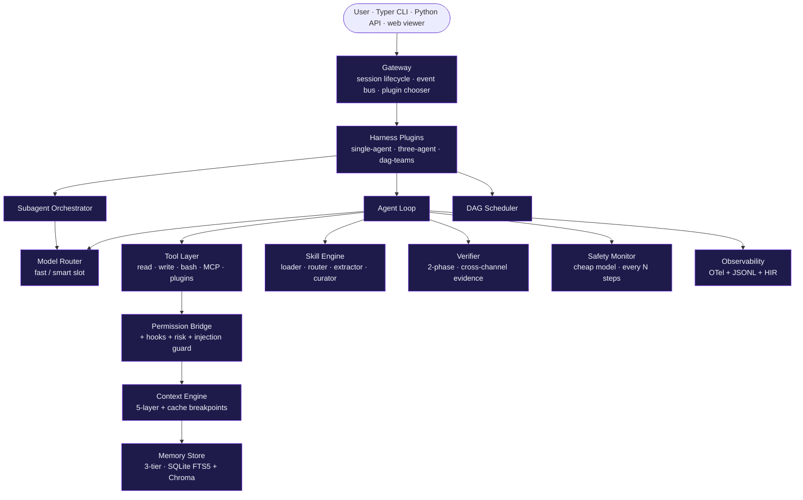

# Architecture advanced

This is the deep-dive layer. Concepts pages explained the seven main
ideas; this layer explains **how they fit together** as a system, what
trade-offs were accepted, and what the alternatives were.

## What's in this layer

| Page | What you'll learn |
|---|---|
| [System topology](topology.md) | Daemon, processes, on-disk layout, how a session physically runs |
| [Eleven commitments](commitments.md) | The architectural choices Lyra is willing to be wrong about — and the failures each prevents |
| [Harness plugins](harness-plugins.md) | `single-agent` / `three-agent` / `dag-teams` strategy pattern |
| [Trade-offs](../architecture-tradeoff.md) | The alternatives we considered and rejected, with reasons |
| [Full architecture spec](../architecture.md) | The original ~320-line architecture doc — exhaustive, with target metrics |
| [System design](../system-design.md) | The operational spec — Pydantic models, file layouts, daemon API |

## The component stack at a glance

Read top-down. Every box on this diagram has its own page or block
spec — the [reference index](../reference/blocks-index.md) maps them
all.

## Reading order

1. Start with [System topology](topology.md) to see *where* code lives
   and *how* a session runs as a process.
2. Then [Eleven commitments](commitments.md) — the most opinionated
   page on this site.
3. Then [Harness plugins](harness-plugins.md) for the strategy pattern
   that picks the topology per task.
4. Skim [Trade-offs](../architecture-tradeoff.md) when you want to
   know "why not X?"
5. Use the [Full spec](../architecture.md) and [System
   design](../system-design.md) as references — they're long, but
   exhaustive.

[System topology →](topology.md){ .md-button .md-button--primary }
