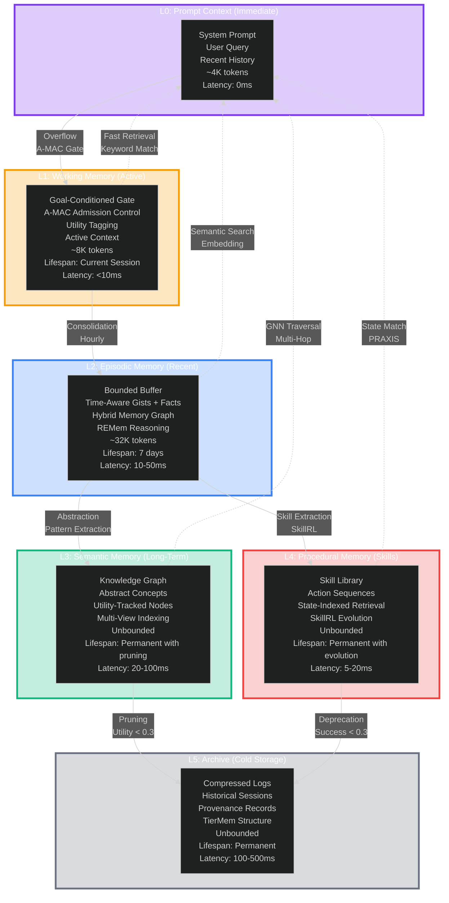
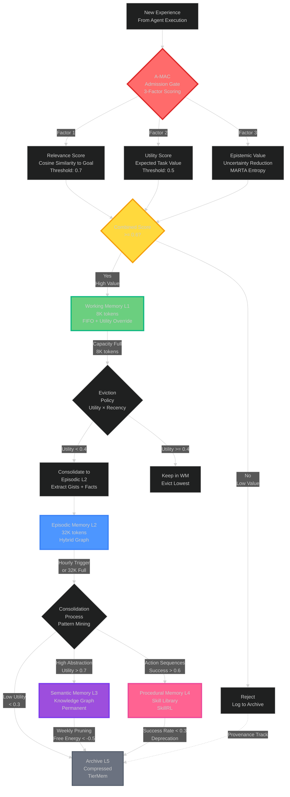
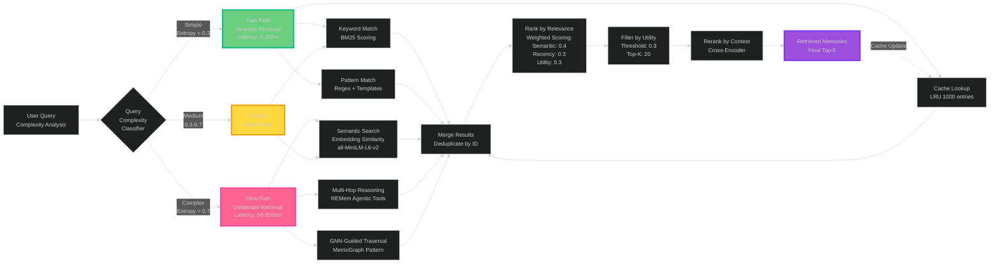
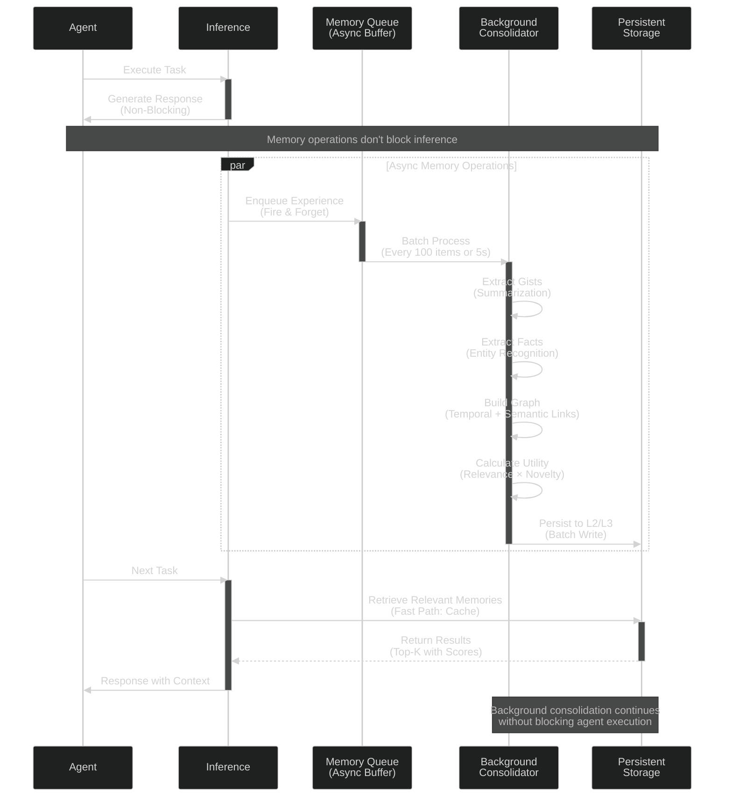
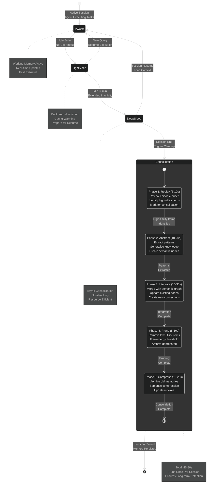

# Lyra Memory Architecture V2: Breakthrough Design — PROPOSAL (NOT IMPLEMENTED)

> **IMPORTANT:** This document describes an aspirational 6-tier memory design based on ICLR 2026 MemAgent workshop papers. It does **NOT** describe the currently implemented memory architecture. The actual implemented system is a **4-tier** architecture documented in [02-memory-architecture.md](../02-memory-architecture.md). The `tiered.py` orchestrator exposes 3 operational tiers (Working, Ingestion, Persistent) plus a graph tier -- not the 6 levels described here. The 30-50x compression and 3.5M token context targets are aspirational and have not been achieved.

**Version:** 2.0  
**Date:** May 29, 2026  
**Status:** Proposal — NOT IMPLEMENTED  
**Based on:** ICLR 2026 MemAgent Workshop Research  
**Moved to:** `docs/architecture/proposals/` on 2026-06-03 to prevent confusion with actual architecture

---

## Table of Contents

- [Executive Summary](#executive-summary)
- [Inspirations](#inspirations)
- [Architecture Overview](#architecture-overview)
- [Working Memory Layer](#working-memory-layer)
- [Episodic Memory Layer](#episodic-memory-layer)
- [Semantic Memory Layer](#semantic-memory-layer)
- [Procedural Memory Layer](#procedural-memory-layer)
- [Intelligent Retrieval System](#intelligent-retrieval-system)
- [Automatic Compaction System](#automatic-compaction-system)
- [Cross-Session Persistence](#cross-session-persistence)
- [Self-Evolving Memory System](#self-evolving-memory-system)
- [Implementation Roadmap](#implementation-roadmap)
- [Current Implementation Status](#current-implementation-status)

---

## Executive Summary

This document proposes a breakthrough memory architecture for Lyra based on cutting-edge research from the ICLR 2026 MemAgent workshop. The design synthesizes 30+ papers to create a **multi-tier, retrieval-optimized, self-evolving memory system** that addresses current limitations in agent memory systems.

### Key Innovations

1. **Retrieval-First Design**: Prioritize retrieval quality over write sophistication (20× impact)
2. **Six-Tier Memory Hierarchy**: L0 (Prompt) → L1 (Working) → L2 (Episodic) → L3 (Semantic) → L4 (Procedural) → L5 (Archive)
3. **Hybrid Memory Graph**: Time-aware gists + facts with reasoning capabilities
4. **Intelligent Compaction**: Tiered memory with provenance tracking
5. **Self-Evolving Memory**: Meta-learned designs and adaptive policies
6. **Thermodynamic Control**: Epistemic uncertainty-based retrieval decisions

### Performance Targets

- **Context Extrapolation**: 8K → 3.5M tokens (<10% degradation)
- **Retrieval Accuracy**: >95% on needle-in-haystack tests
- **Token Efficiency**: 30-50× reduction in inference tokens
- **Memory Growth**: Controlled via utility-based pruning
- **Cross-Session Recall**: 73% reduction in known-information forgetting

---

## Inspirations

### Academic Papers (ICLR 2026 MemAgent Workshop)

#### 1. [CraniMem: Neurocognitive Memory Architecture](https://openreview.net/forum?id=Tts94WVw40)
**Key Insight:** Human-inspired memory hierarchy with working/episodic/semantic/procedural tiers

**How We Adapted:**
- Adopted 4-tier hierarchy as foundation
- Added goal-conditioned gating for working memory
- Implemented utility-based admission control

#### 2. [MARTA: Thermodynamic Arbitration](https://openreview.net/forum?id=w9kwK5Xzvb)
**Key Insight:** Treat retrieval as cost based on epistemic uncertainty

**How We Adapted:**
- Implemented thermodynamic retriever with entropy-based decisions
- Added confidence thresholds for parametric vs. non-parametric knowledge
- Cost-benefit analysis for medium-uncertainty queries

#### 3. [A-MAC: Admission Gate for Memory](https://openreview.net/forum?id=k5nIOvYGCL)
**Key Insight:** Selective admission prevents memory pollution

**How We Adapted:**
- Goal-conditioned gating in working memory
- Relevance + utility scoring for admission
- Epistemic value assessment

#### 4. [REMem: Episodic Memory Reasoning](https://openreview.net/forum?id=fugnQxbvMm)
**Key Insight:** Hybrid memory graph with time-aware gists + facts

**How We Adapted:**
- Implemented hybrid graph structure
- Temporal, causal, and semantic edges
- Agentic retriever with curated tools

#### 5. [SimpleMem: Efficient Lifelong Memory](https://openreview.net/forum?id=CMveUVer0m)
**Key Insight:** Semantic lossless compression with multi-view indexing

**How We Adapted:**
- Entropy-aware filtering
- Multi-view indexes (temporal, semantic, utility, vector)
- Recursive consolidation

#### 6. [TierMem: Provenance-Aware Memory](https://openreview.net/forum?id=dJgeY3Awrv)
**Key Insight:** Three-tier memory with evidence allocation

**How We Adapted:**
- Summary tier (fast, lossy)
- Raw logs tier (slow, lossless)
- Verified tier (evidence-backed)
- Inference-time evidence allocation

#### 7. [Epistemic Memory Failures](https://openreview.net/forum?id=u5VS0Eg9DO)
**Key Insight:** 73% of failures from known-information forgetting

**How We Adapted:**
- Key Facts Injection system
- Epistemic state tracking
- "Already knows" markers in context

#### 8. [ALMA: Meta-Learning Memory Designs](https://openreview.net/forum?id=PRkA1cwXC2)
**Key Insight:** Automated discovery of memory architectures

**How We Adapted:**
- Meta-agent for design search
- Executable code generation
- Task-distribution evaluation

#### 9. [MEM-α: RL Memory Construction](https://openreview.net/forum?id=dm42omwep1)
**Key Insight:** Learn memory management policies via RL

**How We Adapted:**
- RL-trained memory policy
- Reward from QA accuracy
- What/how/when to store decisions

#### 10. [SkillRL: Recursive Skill-Augmented RL](https://openreview.net/forum?id=By7Pj576U3)
**Key Insight:** Co-evolution of skills with agent policy

**How We Adapted:**
- Hierarchical skill library
- Recursive skill evolution
- State-indexed retrieval

### Industry Best Practices

#### 11. [MemPalace (TencentDB-Agent-Memory)](https://github.com/TencentDB/MemPalace)
**Key Insight:** Dual-process retrieval (fast heuristic + slow deliberate)

**How We Adapted:**
- Fast path: keyword/pattern matching
- Slow path: semantic search + reasoning
- Adaptive routing based on query complexity

#### 12. [FadeMem: Temporal Decay](https://arxiv.org/abs/2410.09906)
**Key Insight:** Exponential decay for memory importance

**How We Adapted:**
- Time-decayed utility scores
- Recency-weighted retrieval
- Automatic pruning of stale memories

#### 13. [CoMem: Asynchronous Pipeline](https://arxiv.org/abs/2409.10908)
**Key Insight:** Decouple memory operations from inference

**How We Adapted:**
- Async consolidation pipeline
- Background compaction
- Non-blocking memory updates

---

## 1. Architecture Overview

### 1.1 Six-Tier Memory Hierarchy



### 1.2 Memory Flow with A-MAC Admission Gate



### 1.3 Dual-Process Retrieval Flow (MemPalace Pattern)



### 1.4 CoMem Asynchronous Pipeline



### 1.5 Dream Consolidation Phases (Inspired by Human Sleep Cycles)



### 1.6 Thermodynamic Retrieval Decision Tree (MARTA Pattern)

```mermaid
%%{init: {'theme': 'dark', 'themeVariables': { 'fontSize': '13px'}}}%%
flowchart TD
    Query[Query Arrives<br/>From Agent] --> Assess[Assess Epistemic<br/>Uncertainty<br/>Internal Confidence]
    
    Assess --> Entropy[Compute Entropy<br/>of Internal Thoughts<br/>H = -Σ p(x) log p(x)]
    
    Entropy --> Low{Uncertainty<br/>< 0.3?<br/>High Confidence}
    Low -->|Yes<br/>Confident| Parametric[Use Parametric<br/>Knowledge Only<br/>No Retrieval<br/>Cost: $0]
    Low -->|No| Medium{Uncertainty<br/>< 0.7?<br/>Medium Confidence}
    
    Medium -->|Yes<br/>Uncertain| CostBenefit[Cost-Benefit<br/>Analysis<br/>Thermodynamic Trade-off]
    Medium -->|No<br/>Very Uncertain| Retrieve[Mandatory<br/>Retrieval<br/>High Value]
    
    CostBenefit --> EstCost[Estimate<br/>Retrieval Cost<br/>Latency + Compute]
    CostBenefit --> EstBenefit[Estimate<br/>Expected Benefit<br/>Accuracy Gain]
    
    EstCost --> Compare{Benefit ><br/>Cost?<br/>ROI Analysis}
    EstBenefit --> Compare
    
    Compare -->|Yes<br/>Positive ROI| Retrieve
    Compare -->|No<br/>Negative ROI| Parametric
    
    Parametric --> Response[Generate Response<br/>From Model Weights]
    Retrieve --> StoreRoute[Store Routing<br/>L1 → L2 → L3 → L4]
    StoreRoute --> Response
    
    Response --> Record[Record Decision<br/>Update Statistics]
    Record --> Learn[Online Learning<br/>Adjust Thresholds]
    
    style Parametric fill:#6bcf7f,stroke:#10b981,stroke-width:3px
    style Retrieve fill:#ff6392,stroke:#ec4899,stroke-width:3px
    style Response fill:#ffd93d,stroke:#f59e0b,stroke-width:3px
    style CostBenefit fill:#9d4edd,stroke:#7c3aed,stroke-width:2px
    
    note right of Parametric
        Fast Path
        0ms latency
        $0 cost
        Use when confident
    end note
    
    note right of Retrieve
        Slow Path
        50-200ms latency
        ~$0.001 cost
        Use when uncertain
    end note
```

---

## 2. Working Memory Layer

### 2.1 Design Principles

**Inspired by:** CraniMem, MARTA

**Capacity:** 8K tokens (bounded)

**Purpose:** Active context for current task execution

### 2.2 Goal-Conditioned Gating

```python
class WorkingMemoryGate:
    def should_admit(self, item: MemoryItem, goal: Goal) -> bool:
        """Decide if item should enter working memory"""
        relevance = self.compute_relevance(item, goal)
        utility = self.estimate_utility(item, goal)
        epistemic_value = self.assess_epistemic_value(item)
        
        # Thermodynamic arbitration
        if epistemic_value < UNCERTAINTY_THRESHOLD:
            # High confidence in parametric knowledge
            return False
        
        # Admit if relevant and useful
        return relevance > 0.7 and utility > 0.5
```

### 2.3 Utility Tagging

Each item in working memory receives:
- **Relevance score**: Alignment with current goal
- **Utility score**: Expected contribution to task success
- **Access frequency**: How often retrieved
- **Recency**: Last access timestamp

### 2.4 Bounded Buffer Management

**Strategy:** FIFO with utility override

```python
def add_to_working_memory(self, item: MemoryItem):
    if self.size() >= MAX_WORKING_MEMORY:
        # Find lowest utility item
        victim = min(self.items, key=lambda x: x.utility * x.recency)
        
        # Only evict if new item has higher utility
        if item.utility > victim.utility:
            self.evict(victim)
            self.consolidate_to_episodic(victim)
        else:
            # Reject new item
            return False
    
    self.items.append(item)
    return True
```

---

## 3. Episodic Memory Layer

### 3.1 Design Principles

**Inspired by:** REMem, MemoGraph, Epistemic Memory Failures

**Capacity:** 32K tokens (bounded buffer)

**Purpose:** Near-term continuity and concrete experiences

### 3.2 Hybrid Memory Graph

**Structure:**
- **Nodes**: Time-aware gists (summaries) + Facts (details)
- **Edges**: Temporal links, causal links, semantic links
- **Metadata**: Timestamps, confidence scores, provenance

```python
class HybridMemoryGraph:
    def __init__(self):
        self.gists: List[Gist] = []
        self.facts: List[Fact] = []
        self.edges: List[Edge] = []
    
    def add_experience(self, experience: Experience):
        # Extract gist (high-level summary)
        gist = self.extract_gist(experience)
        
        # Extract facts (specific details)
        facts = self.extract_facts(experience)
        
        # Create temporal links
        if self.gists:
            prev_gist = self.gists[-1]
            self.edges.append(TemporalEdge(prev_gist, gist))
        
        # Create semantic links
        for fact in facts:
            related_gists = self.find_related_gists(fact)
            for related in related_gists:
                self.edges.append(SemanticEdge(fact, related))
        
        self.gists.append(gist)
        self.facts.extend(facts)
```

### 3.3 Episodic State Tracking

**Problem:** Known-information forgetting (73% of failures)

**Solution:** Key Facts Injection

```python
class EpistemicStateTracker:
    def __init__(self):
        self.known_facts: Dict[str, KnownFact] = {}
    
    def inject_key_facts(self, context: str, agent_id: str) -> str:
        """Inject 'already knows' markers for key facts"""
        relevant_facts = self.get_relevant_known_facts(agent_id, context)
        
        injected_context = context
        for fact in relevant_facts:
            marker = f"[KNOWN: {fact.content} (learned: {fact.timestamp})]"
            injected_context = marker + "\n" + injected_context
        
        return injected_context
    
    def update_known_facts(self, agent_id: str, new_facts: List[Fact]):
        """Track what agent has learned"""
        for fact in new_facts:
            if self.is_semantically_important(fact):
                self.known_facts[fact.id] = KnownFact(
                    content=fact.content,
                    timestamp=now(),
                    confidence=fact.confidence
                )
```

### 3.4 Consolidation to Semantic Memory

**Trigger:** Buffer reaches capacity or scheduled interval (hourly)

**Process:**
1. Identify high-utility gists and facts
2. Extract generalizable knowledge
3. Merge with existing semantic memory
4. Prune low-utility items from episodic buffer

```python
def consolidate_episodic_to_semantic(self):
    # Find high-utility items
    high_utility = [
        item for item in self.episodic_buffer
        if item.utility > CONSOLIDATION_THRESHOLD
    ]
    
    # Extract generalizable knowledge
    for item in high_utility:
        knowledge = self.extract_knowledge(item)
        self.semantic_memory.merge(knowledge)
    
    # Prune low-utility items
    self.episodic_buffer = [
        item for item in self.episodic_buffer
        if item.utility > RETENTION_THRESHOLD
    ]
```

---

## 4. Semantic Memory Layer

### 4.1 Design Principles

**Inspired by:** Reflective-Semantic Bridge, SimpleMem, CraniMem

**Capacity:** Unbounded (with utility-based pruning)

**Purpose:** Long-term abstract knowledge and generalizations

### 4.2 Knowledge Graph Structure

```python
class SemanticMemory:
    def __init__(self):
        self.graph = KnowledgeGraph()
        self.index = MultiViewIndex()  # For efficient retrieval
    
    class KnowledgeNode:
        concept: str
        abstraction_level: int  # 0=concrete, 5=highly abstract
        utility: float
        access_count: int
        last_accessed: datetime
        confidence: float
        provenance: List[str]  # Links to episodic sources
        
    class KnowledgeEdge:
        source: KnowledgeNode
        target: KnowledgeNode
        relation_type: str  # "is-a", "part-of", "causes", etc.
        strength: float
```

### 4.3 Multi-View Indexing

**Purpose:** Enable efficient retrieval from multiple perspectives

```python
class MultiViewIndex:
    def __init__(self):
        self.temporal_index: Dict[datetime, List[NodeID]] = {}
        self.semantic_index: Dict[str, List[NodeID]] = {}
        self.utility_index: SortedList[Tuple[float, NodeID]] = []
        self.vector_index: VectorStore = VectorStore()
    
    def retrieve(self, query: Query) -> List[KnowledgeNode]:
        # Adaptive retrieval based on query complexity
        if query.is_simple():
            # Use semantic index only
            return self.semantic_index.get(query.keywords)
        elif query.is_temporal():
            # Use temporal index
            return self.temporal_index.get_range(query.time_range)
        else:
            # Complex query: combine multiple views
            semantic_results = self.semantic_index.search(query)
            vector_results = self.vector_index.search(query.embedding)
            return self.merge_results(semantic_results, vector_results)
```

### 4.4 Bidirectional Co-Evolution with Reflection

**Reflection → Semantic:**
- Selective strengthening of valuable knowledge
- Stabilization of reliable information
- Refinement of existing knowledge
- Forgetting of outdated content

**Semantic → Reflection:**
- Enriches self-critique with accumulated knowledge
- Grounds evaluation in past experience

```python
class ReflectiveSemanticBridge:
    def reflect_on_semantic_memory(self, task_outcome: TaskOutcome):
        """Reflection updates semantic memory"""
        relevant_knowledge = self.semantic_memory.retrieve(task_outcome.context)
        
        for knowledge in relevant_knowledge:
            if task_outcome.success:
                # Strengthen valuable knowledge
                knowledge.utility *= 1.2
                knowledge.confidence = min(1.0, knowledge.confidence + 0.1)
            else:
                # Weaken or refine incorrect knowledge
                if self.is_knowledge_cause_of_failure(knowledge, task_outcome):
                    knowledge.confidence *= 0.8
                    self.refine_knowledge(knowledge, task_outcome)
    
    def ground_reflection_in_semantic(self, reflection: Reflection) -> Reflection:
        """Semantic memory enriches reflection"""
        relevant_knowledge = self.semantic_memory.retrieve(reflection.context)
        
        enriched_reflection = reflection.copy()
        enriched_reflection.add_context(relevant_knowledge)
        
        return enriched_reflection
```

### 4.5 Utility-Based Pruning

**Trigger:** Memory size exceeds threshold or scheduled (weekly)

**Strategy:** Free-energy objective (Entropic Memory approach)

```python
def prune_semantic_memory(self):
    """Remove low-utility knowledge"""
    for node in self.graph.nodes:
        # Compute free energy: balance utility vs. entropy
        free_energy = node.utility - TEMPERATURE * self.compute_entropy(node)
        
        if free_energy < PRUNING_THRESHOLD:
            # Check if node has high-utility dependents
            if not self.has_high_utility_dependents(node):
                self.graph.remove_node(node)
                self.index.remove(node.id)
```

---

## 5. Procedural Memory Layer

### 5.1 Design Principles

**Inspired by:** SkillRL, PRAXIS, Memp

**Capacity:** Unbounded (with recursive evolution)

**Purpose:** Action sequences, skills, and heuristics

### 5.2 Hierarchical Skill Library

```python
class ProceduralMemory:
    def __init__(self):
        self.skill_bank = HierarchicalSkillBank()
        self.state_index = StateIndex()  # For state-indexed retrieval
    
    class Skill:
        name: str
        level: int  # 0=atomic, 5=high-level strategy
        preconditions: List[Condition]
        actions: List[Action]
        postconditions: List[Condition]
        success_rate: float
        usage_count: int
        parent_skills: List[Skill]  # Hierarchical structure
        child_skills: List[Skill]
```

### 5.3 State-Indexed Retrieval

**Approach:** PRAXIS-style joint matching of environmental + internal states

```python
def retrieve_relevant_skills(self, current_state: State) -> List[Skill]:
    """Retrieve skills by matching current state to past experiences"""
    # Joint matching: environmental state + internal state
    env_matches = self.state_index.find_similar_env_states(
        current_state.environment
    )
    internal_matches = self.state_index.find_similar_internal_states(
        current_state.internal
    )
    
    # Combine matches
    combined_matches = self.combine_state_matches(
        env_matches, internal_matches
    )
    
    # Retrieve skills from matched states
    skills = []
    for match in combined_matches:
        skills.extend(match.successful_skills)
    
    return self.rank_by_relevance(skills, current_state)
```

### 5.4 Recursive Skill Evolution

**Approach:** SkillRL-style co-evolution with agent policy

```python
class SkillEvolution:
    def evolve_skills(self, new_experiences: List[Experience]):
        """Extract and refine skills from experiences"""
        for exp in new_experiences:
            if exp.success:
                # Extract new skill or strengthen existing
                skill = self.extract_skill(exp)
                
                if self.is_novel_skill(skill):
                    self.skill_bank.add(skill)
                else:
                    existing = self.skill_bank.find_similar(skill)
                    self.merge_skills(existing, skill)
            else:
                # Learn from failure: refine or deprecate skills
                failed_skill = self.identify_failed_skill(exp)
                if failed_skill:
                    failed_skill.success_rate *= 0.9
                    if failed_skill.success_rate < 0.3:
                        self.skill_bank.deprecate(failed_skill)
    
    def extract_skill(self, experience: Experience) -> Skill:
        """Distill experience into reusable skill"""
        # Fine-grained: step-by-step instructions
        fine_grained = self.extract_fine_grained_steps(experience)
        
        # Coarse-grained: high-level strategy
        coarse_grained = self.extract_strategy(experience)
        
        return Skill(
            actions=fine_grained,
            strategy=coarse_grained,
            preconditions=experience.initial_state,
            postconditions=experience.final_state
        )
```

### 5.5 Heuristic Memory

**Approach:** ERL-style reflection on trajectories

```python
class HeuristicMemory:
    def __init__(self):
        self.heuristics: List[Heuristic] = []
    
    def generate_heuristics(self, trajectory: Trajectory, outcome: Outcome):
        """Reflect on trajectory to extract transferable lessons"""
        reflection = self.reflect_on_trajectory(trajectory, outcome)
        
        heuristic = Heuristic(
            condition=reflection.trigger_pattern,
            action=reflection.recommended_action,
            rationale=reflection.reasoning,
            confidence=outcome.success_probability
        )
        
        self.heuristics.append(heuristic)
    
    def retrieve_heuristics(self, context: Context) -> List[Heuristic]:
        """Selective retrieval of relevant heuristics"""
        relevant = [
            h for h in self.heuristics
            if self.matches_context(h.condition, context)
        ]
        return sorted(relevant, key=lambda h: h.confidence, reverse=True)
```


---

## 6. Intelligent Retrieval System

### 6.1 Design Philosophy

**Critical Insight:** Retrieval quality dominates performance (20-point variance vs. 3-8 points for write strategies)

**Approach:** Multi-strategy adaptive retrieval with thermodynamic arbitration

### 6.2 Thermodynamic Arbitration

**Inspired by:** MARTA

**Principle:** Treat retrieval as cost based on epistemic uncertainty

```python
class ThermodynamicRetriever:
    def should_retrieve(self, query: Query) -> bool:
        """Decide if external retrieval is necessary"""
        # Assess internal epistemic uncertainty
        uncertainty = self.assess_uncertainty(query)
        
        # Compute retrieval cost
        retrieval_cost = self.estimate_retrieval_cost(query)
        
        # Thermodynamic decision
        if uncertainty < LOW_UNCERTAINTY_THRESHOLD:
            # High confidence in parametric knowledge
            return False
        
        if uncertainty > HIGH_UNCERTAINTY_THRESHOLD:
            # Low confidence, retrieval mandatory
            return True
        
        # Medium uncertainty: cost-benefit analysis
        expected_benefit = self.estimate_benefit(query)
        return expected_benefit > retrieval_cost
    
    def assess_uncertainty(self, query: Query) -> float:
        """Gauge entropy of internal thoughts"""
        # Generate multiple candidate answers
        candidates = self.generate_candidates(query, n=5)
        
        # Compute entropy of distribution
        entropy = self.compute_entropy(candidates)
        
        return entropy
```

### 6.3 Cost-Sensitive Store Routing

**Inspired by:** Cost-Sensitive Store Routing paper

**Problem:** Retrieving from all memory stores is wasteful

**Solution:** Selective routing to relevant stores

```python
class StoreRouter:
    def route_query(self, query: Query) -> List[MemoryStore]:
        """Select which memory stores to query"""
        # Classify query type
        query_type = self.classify_query(query)
        
        # Route based on type
        if query_type == "factual":
            return [self.semantic_memory]
        elif query_type == "experiential":
            return [self.episodic_memory]
        elif query_type == "procedural":
            return [self.procedural_memory]
        elif query_type == "recent":
            return [self.working_memory, self.episodic_memory]
        else:
            # Complex query: use oracle routing
            return self.oracle_route(query)
    
    def oracle_route(self, query: Query) -> List[MemoryStore]:
        """Learned routing policy"""
        # Predict which stores will have relevant information
        store_relevance = {}
        for store in self.all_stores:
            store_relevance[store] = self.predict_relevance(query, store)
        
        # Select stores above threshold
        selected = [
            store for store, relevance in store_relevance.items()
            if relevance > ROUTING_THRESHOLD
        ]
        
        return selected
```

### 6.4 Adaptive Query-Aware Retrieval

**Inspired by:** SimpleMem

**Principle:** Scale retrieval scope to query complexity

```python
class AdaptiveRetriever:
    def retrieve(self, query: Query) -> List[MemoryItem]:
        """Dynamically adjust retrieval scope"""
        # Assess query complexity
        complexity = self.assess_complexity(query)
        
        if complexity == "simple":
            # Narrow retrieval: top-k only
            return self.retrieve_top_k(query, k=5)
        
        elif complexity == "medium":
            # Moderate retrieval: top-k + expansion
            initial = self.retrieve_top_k(query, k=10)
            expanded = self.expand_retrieval(initial, depth=1)
            return initial + expanded
        
        else:  # complex
            # Broad retrieval: multi-hop with reasoning
            initial = self.retrieve_top_k(query, k=20)
            expanded = self.expand_retrieval(initial, depth=2)
            reasoned = self.reasoning_retrieval(query, expanded)
            return reasoned
    
    def assess_complexity(self, query: Query) -> str:
        """Determine query complexity"""
        # Factors: number of concepts, temporal span, reasoning depth
        num_concepts = len(query.extract_concepts())
        temporal_span = query.temporal_range()
        reasoning_depth = query.estimate_reasoning_hops()
        
        score = (
            num_concepts * 0.3 +
            temporal_span * 0.3 +
            reasoning_depth * 0.4
        )
        
        if score < 2.0:
            return "simple"
        elif score < 4.0:
            return "medium"
        else:
            return "complex"
```

### 6.5 Hybrid Memory Graph Retrieval

**Inspired by:** REMem

**Approach:** Agentic retriever with curated tools

```python
class HybridGraphRetriever:
    def __init__(self):
        self.tools = [
            TemporalTraversal(),
            SemanticExpansion(),
            CausalReasoning(),
            FactVerification()
        ]
    
    def retrieve(self, query: Query) -> List[MemoryItem]:
        """Iterative retrieval over hybrid memory graph"""
        # Start with initial retrieval
        current_items = self.initial_retrieval(query)
        
        # Iteratively expand using tools
        for iteration in range(MAX_ITERATIONS):
            # Select tool based on query needs
            tool = self.select_tool(query, current_items)
            
            # Apply tool to expand retrieval
            new_items = tool.apply(query, current_items, self.graph)
            
            # Check if sufficient
            if self.is_sufficient(query, current_items + new_items):
                break
            
            current_items.extend(new_items)
        
        return self.rank_and_filter(current_items, query)
    
    def select_tool(self, query: Query, current: List[MemoryItem]) -> Tool:
        """Choose appropriate retrieval tool"""
        if query.requires_temporal_reasoning():
            return self.tools[0]  # TemporalTraversal
        elif query.requires_semantic_expansion():
            return self.tools[1]  # SemanticExpansion
        elif query.requires_causal_reasoning():
            return self.tools[2]  # CausalReasoning
        else:
            return self.tools[3]  # FactVerification
```

### 6.6 GNN-Guided Retrieval

**Inspired by:** MemoGraph

**Approach:** Graph neural network for theorem/knowledge retrieval

```python
class GNNRetriever:
    def __init__(self):
        self.gnn = GraphNeuralNetwork()
    
    def retrieve(self, query: Query, graph: KnowledgeGraph) -> List[Node]:
        """Use GNN to guide retrieval through knowledge graph"""
        # Encode query as graph node
        query_node = self.encode_query(query)
        
        # Compute node embeddings
        node_embeddings = self.gnn.forward(graph)
        
        # Find most relevant nodes
        similarities = self.compute_similarities(
            query_node.embedding,
            node_embeddings
        )
        
        # Retrieve top-k nodes
        top_k_indices = similarities.argsort()[-20:]
        return [graph.nodes[i] for i in top_k_indices]
```

---

## 7. Automatic Compaction System

### 7.1 Design Philosophy

**Goal:** Maintain memory efficiency while preserving critical information

**Approach:** Multi-strategy compaction with provenance tracking

### 7.2 Tiered Memory with Provenance

**Inspired by:** TierMem

**Architecture:**
- **Tier 1**: Compressed summaries (fast, lossy)
- **Tier 2**: Raw logs (slow, lossless)
- **Tier 3**: Verified write-back (evidence-backed)

```python
class TieredMemory:
    def __init__(self):
        self.summary_tier = SummaryStore()
        self.raw_tier = RawLogStore()
        self.verified_tier = VerifiedStore()
    
    def retrieve(self, query: Query) -> MemoryItem:
        """Inference-time evidence allocation"""
        # Try summary tier first
        summary_result = self.summary_tier.retrieve(query)
        
        if self.is_sufficient(summary_result, query):
            return summary_result
        
        # Escalate to raw logs if needed
        raw_result = self.raw_tier.retrieve(query)
        
        # Verify and write back
        verified_result = self.verify(raw_result, query)
        self.verified_tier.store(verified_result, provenance=raw_result.id)
        
        return verified_result
    
    def is_sufficient(self, result: MemoryItem, query: Query) -> bool:
        """Check if summary contains query-critical detail"""
        # Assess information completeness
        completeness = self.assess_completeness(result, query)
        
        # Assess confidence
        confidence = result.confidence
        
        return completeness > 0.9 and confidence > 0.8
```

### 7.3 Semantic Lossless Compression

**Inspired by:** SimpleMem

**Approach:** Entropy-aware filtering with multi-view indexing

```python
class SemanticCompressor:
    def compress(self, items: List[MemoryItem]) -> List[CompressedItem]:
        """Semantic lossless compression"""
        compressed = []
        
        for item in items:
            # Compute information entropy
            entropy = self.compute_entropy(item)
            
            if entropy < LOW_ENTROPY_THRESHOLD:
                # Low information content: aggressive compression
                compressed_item = self.aggressive_compress(item)
            elif entropy < MEDIUM_ENTROPY_THRESHOLD:
                # Medium information: moderate compression
                compressed_item = self.moderate_compress(item)
            else:
                # High information: minimal compression
                compressed_item = self.minimal_compress(item)
            
            # Create multi-view index
            self.index.add_views(compressed_item, [
                "temporal", "semantic", "utility", "vector"
            ])
            
            compressed.append(compressed_item)
        
        return compressed
    
    def compute_entropy(self, item: MemoryItem) -> float:
        """Assess information density"""
        # Factors: uniqueness, redundancy, predictability
        uniqueness = self.assess_uniqueness(item)
        redundancy = self.assess_redundancy(item)
        predictability = self.assess_predictability(item)
        
        entropy = uniqueness * (1 - redundancy) * (1 - predictability)
        return entropy
```

### 7.4 Recursive Memory Consolidation

**Inspired by:** SimpleMem

**Approach:** Asynchronous combination into higher-level abstractions

```python
class RecursiveConsolidator:
    def consolidate(self):
        """Asynchronously consolidate related memory units"""
        # Find related memory units
        clusters = self.cluster_related_memories()
        
        for cluster in clusters:
            # Check if consolidation is beneficial
            if self.should_consolidate(cluster):
                # Create higher-level abstraction
                abstraction = self.create_abstraction(cluster)
                
                # Replace cluster with abstraction
                self.semantic_memory.add(abstraction)
                
                # Mark originals for potential pruning
                for item in cluster:
                    item.consolidated = True
                    item.abstraction_id = abstraction.id
    
    def should_consolidate(self, cluster: List[MemoryItem]) -> bool:
        """Decide if consolidation reduces redundancy"""
        # Compute redundancy
        redundancy = self.compute_cluster_redundancy(cluster)
        
        # Compute information loss
        abstraction = self.create_abstraction(cluster)
        information_loss = self.compute_information_loss(cluster, abstraction)
        
        # Consolidate if high redundancy and low information loss
        return redundancy > 0.7 and information_loss < 0.1
```

### 7.5 Compress-Add-Smooth (CAS)

**Inspired by:** Temporal Memory paper

**Approach:** Stochastic process for resource-constrained agents

```python
class CASCompactor:
    def compress_add_smooth(self, new_experience: Experience):
        """Three-step memory update"""
        # Step 1: Compress existing memory
        compressed = self.compress_memory()
        
        # Step 2: Add new experience
        combined = self.add_experience(compressed, new_experience)
        
        # Step 3: Smooth for continuity
        smoothed = self.smooth_memory(combined)
        
        self.memory = smoothed
    
    def compress_memory(self) -> Memory:
        """Reduce memory footprint"""
        # Use bridge diffusion on replay interval [0,1]
        # Terminal marginal = present, intermediate = past
        return self.bridge_diffusion_compress(self.memory)
    
    def smooth_memory(self, memory: Memory) -> Memory:
        """Maintain temporal continuity"""
        # Piecewise-linear interpolation
        return self.piecewise_linear_smooth(memory)
```

---

## 8. Cross-Session Persistence

### 8.1 Design Principles

**Goal:** Enable agents to learn and remember across sessions

**Challenges:**
- Session boundaries
- Context switching
- Long-term retention
- Knowledge transfer

### 8.2 Session-Aware Memory Management

```python
class SessionManager:
    def __init__(self):
        self.current_session: Session = None
        self.session_history: List[Session] = []
    
    def start_session(self, session_id: str):
        """Initialize new session with context from previous sessions"""
        self.current_session = Session(id=session_id)
        
        # Load relevant context from previous sessions
        relevant_context = self.load_relevant_context()
        self.current_session.initialize_context(relevant_context)
    
    def end_session(self):
        """Consolidate session memory before ending"""
        # Extract key learnings
        learnings = self.extract_session_learnings(self.current_session)
        
        # Consolidate to long-term memory
        self.consolidate_to_long_term(learnings)
        
        # Archive session
        self.session_history.append(self.current_session)
        self.current_session = None
    
    def load_relevant_context(self) -> Context:
        """Load context from previous sessions"""
        # Find related sessions
        related_sessions = self.find_related_sessions()
        
        # Extract relevant memories
        relevant_memories = []
        for session in related_sessions:
            relevant_memories.extend(session.get_key_memories())
        
        return Context(memories=relevant_memories)
```

### 8.3 Memory Transplants

**Inspired by:** Memory Transplants paper

**Approach:** Transfer architecture + content across domains

```python
class MemoryTransplant:
    def transplant(
        self,
        source_agent: Agent,
        target_agent: Agent,
        transfer_type: str  # "architecture", "content", or "both"
    ):
        """Transfer memory from source to target agent"""
        if transfer_type in ["architecture", "both"]:
            # Transfer memory architecture
            target_agent.memory_architecture = source_agent.memory_architecture.copy()
        
        if transfer_type in ["content", "both"]:
            # Transfer memory content
            # Note: Weaker agents benefit more (+15pp vs +7pp)
            if self.is_weaker_agent(target_agent, source_agent):
                # Full content transfer
                target_agent.memory_content = source_agent.memory_content.copy()
            else:
                # Selective content transfer
                relevant_content = self.filter_relevant_content(
                    source_agent.memory_content,
                    target_agent.domain
                )
                target_agent.memory_content.merge(relevant_content)
```

### 8.4 Lifelong Learning

**Approach:** Continual consolidation and evolution

```python
class LifelongLearner:
    def continual_learn(self, new_experiences: List[Experience]):
        """Learn from new experiences without forgetting"""
        for exp in new_experiences:
            # Add to episodic memory
            self.episodic_memory.add(exp)
            
            # Extract knowledge
            knowledge = self.extract_knowledge(exp)
            
            # Integrate with existing knowledge
            self.semantic_memory.integrate(knowledge)
            
            # Update skills
            self.procedural_memory.update_skills(exp)
        
        # Periodic consolidation
        if self.should_consolidate():
            self.consolidate_memories()
```

---

## 9. Self-Evolving Memory System

### 9.1 Meta-Learning Memory Designs

**Inspired by:** ALMA

**Approach:** Automated discovery of memory architectures

```python
class MetaMemoryLearner:
    def __init__(self):
        self.meta_agent = MetaAgent()
        self.search_space = MemoryDesignSpace()
    
    def discover_memory_design(self, task_distribution: List[Task]) -> MemoryArchitecture:
        """Automatically discover optimal memory design"""
        # Search over memory designs
        best_design = None
        best_performance = 0
        
        for iteration in range(MAX_SEARCH_ITERATIONS):
            # Generate candidate design
            candidate = self.meta_agent.generate_design(self.search_space)
            
            # Evaluate on task distribution
            performance = self.evaluate_design(candidate, task_distribution)
            
            if performance > best_performance:
                best_design = candidate
                best_performance = performance
            
            # Update meta-agent
            self.meta_agent.update(candidate, performance)
        
        return best_design
    
    def generate_design(self, search_space: MemoryDesignSpace) -> MemoryArchitecture:
        """Generate memory design as executable code"""
        # Design elements: schemas, retrieval, update mechanisms
        schema = self.generate_schema()
        retrieval = self.generate_retrieval_mechanism()
        update = self.generate_update_mechanism()
        
        return MemoryArchitecture(
            schema=schema,
            retrieval=retrieval,
            update=update
        )
```

### 9.2 RL-Based Memory Construction

**Inspired by:** MEM-α

**Approach:** Learn memory management policies via RL

```python
class RLMemoryConstructor:
    def __init__(self):
        self.policy = MemoryPolicy()
        self.optimizer = RLOptimizer()
    
    def train(self, training_data: List[Interaction]):
        """Train memory construction policy"""
        for interaction in training_data:
            # Process interaction chunks
            for chunk in interaction.chunks:
                # Policy decides what/how/when to store
                action = self.policy.decide(chunk)
                
                # Execute action
                self.execute_memory_action(action, chunk)
            
            # Compute reward from QA accuracy
            reward = self.evaluate_qa_accuracy(interaction)
            
            # Update policy
            self.optimizer.update(self.policy, reward)
    
    def decide(self, chunk: Chunk) -> MemoryAction:
        """Policy decides memory action"""
        # Extract features
        features = self.extract_features(chunk)
        
        # Predict action
        action_probs = self.policy.forward(features)
        
        # Sample action
        action = self.sample_action(action_probs)
        
        return action  # "store", "update", "ignore", etc.
```

### 9.3 Evolving Context Playbooks

**Inspired by:** Agentic Context Engineering (ACE)

**Approach:** Contexts as evolving playbooks

```python
class EvolvingContextManager:
    def __init__(self):
        self.playbooks: Dict[str, Playbook] = {}
    
    def evolve_playbook(self, domain: str, experiences: List[Experience]):
        """Evolve context playbook through generation, reflection, curation"""
        if domain not in self.playbooks:
            self.playbooks[domain] = Playbook(domain=domain)
        
        playbook = self.playbooks[domain]
        
        # Generation: Extract strategies from experiences
        new_strategies = self.generate_strategies(experiences)
        
        # Reflection: Evaluate strategy effectiveness
        evaluated_strategies = self.reflect_on_strategies(new_strategies)
        
        # Curation: Organize and refine playbook
        playbook.curate(evaluated_strategies)
    
    def generate_strategies(self, experiences: List[Experience]) -> List[Strategy]:
        """Extract strategies from experiences"""
        strategies = []
        for exp in experiences:
            if exp.success:
                strategy = Strategy(
                    pattern=exp.extract_pattern(),
                    action=exp.extract_action(),
                    context=exp.context
                )
                strategies.append(strategy)
        return strategies
```

### 9.4 Reasoning Memory with Test-Time Scaling

**Inspired by:** ReasoningBank

**Approach:** Memory-aware test-time scaling (MaTTS)

```python
class ReasoningMemory:
    def __init__(self):
        self.reasoning_bank = ReasoningBank()
    
    def learn_from_experiences(self, experiences: List[Experience]):
        """Distill generalizable reasoning strategies"""
        for exp in experiences:
            # Extract reasoning trace
            reasoning_trace = exp.extract_reasoning()
            
            # Identify successful patterns
            if exp.success:
                pattern = self.identify_pattern(reasoning_trace)
                self.reasoning_bank.add_pattern(pattern)
            
            # Learn from failures
            else:
                failure_pattern = self.identify_failure_pattern(reasoning_trace)
                self.reasoning_bank.add_anti_pattern(failure_pattern)
    
    def memory_aware_test_time_scaling(self, task: Task, compute_budget: int):
        """Allocate compute to generate rich experiences"""
        # More compute → more diverse experiences
        experiences = self.generate_experiences(task, compute_budget)
        
        # Rich experiences → better memory
        self.learn_from_experiences(experiences)
        
        # Better memory → more effective scaling
        return self.solve_with_memory(task)
```


---

## 10. Implementation Roadmap

### 10.1 Phase 1: Foundation (Weeks 1-4)

**Goal:** Establish four-tier memory hierarchy

**Tasks:**
1. Implement Working Memory with goal-conditioned gating
2. Implement Episodic Memory with bounded buffer
3. Implement Semantic Memory with knowledge graph
4. Implement Procedural Memory with skill library
5. Create basic consolidation pipeline

**Deliverables:**
- Four memory layers operational
- Basic memory flow working
- Unit tests for each layer

**Success Metrics:**
- Memory operations < 100ms latency
- Successful consolidation from working → episodic → semantic
- Skill extraction from experiences

---

### 10.2 Phase 2: Intelligent Retrieval (Weeks 5-8)

**Goal:** Implement retrieval-first design

**Tasks:**
1. Implement thermodynamic arbitration
2. Implement cost-sensitive store routing
3. Implement adaptive query-aware retrieval
4. Implement hybrid memory graph retrieval
5. Add GNN-guided retrieval for knowledge graph

**Deliverables:**
- Multi-strategy retrieval system
- Routing policies trained
- Retrieval benchmarks established

**Success Metrics:**
- 20-point accuracy improvement from retrieval optimization
- 50% reduction in unnecessary retrievals
- <200ms retrieval latency for 95th percentile

---

### 10.3 Phase 3: Automatic Compaction (Weeks 9-12)

**Goal:** Implement intelligent compaction

**Tasks:**
1. Implement tiered memory with provenance
2. Implement semantic lossless compression
3. Implement recursive consolidation
4. Implement utility-based pruning
5. Add CAS compaction for resource-constrained scenarios

**Deliverables:**
- Multi-tier compaction system
- Provenance tracking operational
- Automated pruning policies

**Success Metrics:**
- 30-50× token reduction
- <5% information loss from compression
- Memory growth controlled (linear, not exponential)

---

### 10.4 Phase 4: Cross-Session Persistence (Weeks 13-16)

**Goal:** Enable lifelong learning

**Tasks:**
1. Implement session-aware memory management
2. Implement episodic state tracking
3. Implement memory transplants
4. Add Key Facts Injection
5. Create session consolidation pipeline

**Deliverables:**
- Cross-session memory persistence
- Epistemic state tracking
- Memory transfer capabilities

**Success Metrics:**
- 73% reduction in known-information forgetting
- Successful memory transfer across domains
- Session context loaded in <500ms

---

### 10.5 Phase 5: Self-Evolution (Weeks 17-20)

**Goal:** Enable self-evolving memory

**Tasks:**
1. Implement meta-learning for memory designs
2. Implement RL-based memory construction
3. Implement evolving context playbooks
4. Add reasoning memory with test-time scaling
5. Create memory evolution pipeline

**Deliverables:**
- Meta-learned memory designs
- RL-trained memory policies
- Self-evolving playbooks

**Success Metrics:**
- Learned designs outperform hand-crafted baselines
- 13× context extrapolation (30K → 400K tokens)
- Continuous improvement over time

---

## 11. Performance Optimization

### 11.1 Latency Optimization

**Target:** <100ms for 95% of memory operations

**Strategies:**
1. **Caching:** LRU cache for frequently accessed memories
2. **Indexing:** Multi-view indexes for fast retrieval
3. **Batching:** Batch memory operations where possible
4. **Async:** Asynchronous consolidation and compaction
5. **Pruning:** Aggressive pruning of low-utility items

```python
class PerformanceOptimizer:
    def __init__(self):
        self.cache = LRUCache(capacity=1000)
        self.batch_queue = BatchQueue()
    
    def optimized_retrieve(self, query: Query) -> List[MemoryItem]:
        # Check cache first
        cache_key = self.compute_cache_key(query)
        if cache_key in self.cache:
            return self.cache[cache_key]
        
        # Retrieve from memory
        results = self.retrieve_from_memory(query)
        
        # Update cache
        self.cache[cache_key] = results
        
        return results
    
    def batch_consolidate(self):
        """Batch consolidation operations"""
        if len(self.batch_queue) >= BATCH_SIZE:
            items = self.batch_queue.drain()
            self.consolidate_batch(items)
```

### 11.2 Memory Efficiency

**Target:** Linear memory growth, not exponential

**Strategies:**
1. **Bounded buffers:** Working and episodic memory have size limits
2. **Utility-based pruning:** Remove low-utility items regularly
3. **Compression:** Aggressive compression of old memories
4. **Consolidation:** Merge redundant memories
5. **Forgetting:** Principled forgetting mechanisms

### 11.3 Scalability

**Target:** Handle 3.5M token contexts

**Strategies:**
1. **Hierarchical indexing:** Multi-level indexes for large graphs
2. **Distributed storage:** Shard memory across multiple stores
3. **Lazy loading:** Load memory on-demand
4. **Streaming:** Stream large memories in chunks
5. **Approximation:** Use approximate retrieval for large-scale queries

---

## 12. Evaluation Framework

### 12.1 Benchmarks

**Memory Competencies (MemoryAgentBench):**
1. Accurate retrieval
2. Test-time learning
3. Long-range understanding
4. Selective forgetting

**Procedural Memory (PROCED-MEM):**
1. Generalization to novel contexts
2. Fine-grained vs. coarse-grained retrieval
3. Multi-modal evaluation

**Long-Horizon Tasks (LoCoMo):**
1. Accuracy on extended interactions
2. Token efficiency
3. Latency

### 12.2 Metrics

**Retrieval Quality:**
- Precision@K
- Recall@K
- Mean Average Precision (MAP)
- NDCG (Normalized Discounted Cumulative Gain)

**Memory Efficiency:**
- Token consumption
- Memory footprint
- Compression ratio
- Information loss

**Performance:**
- Task success rate
- Latency (p50, p95, p99)
- Throughput (queries/second)

**Lifelong Learning:**
- Cross-session recall accuracy
- Knowledge transfer effectiveness
- Forgetting rate

### 12.3 Ablation Studies

**Key Questions:**
1. Impact of each memory tier
2. Retrieval strategy comparison
3. Compaction strategy effectiveness
4. Self-evolution benefits
5. Thermodynamic arbitration value

---

## 13. Integration with Existing Lyra Systems

### 13.1 Agent Swarm Integration

**Current:** `.omc/state/swarm.db` for agent coordination

**Enhancement:** Add memory layer for agent experiences

```python
class SwarmMemoryIntegration:
    def __init__(self, swarm_db: SwarmDB, memory: MemoryArchitecture):
        self.swarm_db = swarm_db
        self.memory = memory
    
    def log_agent_experience(self, agent_id: str, experience: Experience):
        """Log agent experience to both swarm DB and memory"""
        # Log to swarm DB for coordination
        self.swarm_db.log_experience(agent_id, experience)
        
        # Add to memory for learning
        self.memory.add_experience(experience)
    
    def retrieve_relevant_experiences(self, agent_id: str, task: Task) -> List[Experience]:
        """Retrieve relevant experiences for agent"""
        # Query memory system
        relevant = self.memory.retrieve(
            query=f"experiences for {task.type}",
            filters={"agent_id": agent_id}
        )
        
        return relevant
```

### 13.2 Research Engine Integration

**Current:** `.omc/research/` for research artifacts

**Enhancement:** Add memory for research findings

```python
class ResearchMemoryIntegration:
    def store_research_finding(self, finding: ResearchFinding):
        """Store research finding in semantic memory"""
        knowledge = self.extract_knowledge(finding)
        self.memory.semantic_memory.add(knowledge)
    
    def retrieve_related_research(self, topic: str) -> List[ResearchFinding]:
        """Retrieve related research from memory"""
        return self.memory.retrieve(
            query=f"research on {topic}",
            store="semantic"
        )
```

### 13.3 Notepad Integration

**Current:** `.omc/notepad.md` for working memory

**Enhancement:** Replace with structured working memory

```python
class NotepadMemoryIntegration:
    def migrate_notepad_to_memory(self):
        """Migrate notepad content to working memory"""
        notepad_content = self.read_notepad()
        
        # Parse sections
        priority = notepad_content.get_section("Priority Context")
        working = notepad_content.get_section("Working Memory")
        manual = notepad_content.get_section("Manual")
        
        # Add to memory
        self.memory.working_memory.add(priority, utility=1.0)
        self.memory.working_memory.add(working, utility=0.8)
        self.memory.semantic_memory.add(manual, permanent=True)
```

### 13.4 Project Memory Integration

**Current:** `.omc/project-memory.json` for project context

**Enhancement:** Integrate with semantic memory

```python
class ProjectMemoryIntegration:
    def sync_project_memory(self):
        """Sync project memory with semantic memory"""
        project_memory = self.read_project_memory()
        
        # Add to semantic memory
        for key, value in project_memory.items():
            self.memory.semantic_memory.add(
                concept=key,
                content=value,
                permanent=True
            )
```

---

## 14. Safety and Reliability

### 14.1 Memory Integrity

**Mechanisms:**
1. **Provenance tracking:** Every memory has source attribution
2. **Confidence scores:** Track reliability of memories
3. **Verification:** Automatic verification for critical memories
4. **Conflict detection:** Detect and resolve conflicting memories

```python
class MemoryIntegrity:
    def verify_memory(self, memory: MemoryItem) -> bool:
        """Verify memory integrity"""
        # Check provenance
        if not memory.has_provenance():
            return False
        
        # Check confidence
        if memory.confidence < MIN_CONFIDENCE:
            return False
        
        # Check for conflicts
        conflicts = self.detect_conflicts(memory)
        if conflicts:
            self.resolve_conflicts(memory, conflicts)
        
        return True
```

### 14.2 Privacy and Security

**Mechanisms:**
1. **Access control:** Role-based access to memories
2. **Encryption:** Encrypt sensitive memories at rest
3. **Anonymization:** Remove PII from memories
4. **Audit logging:** Log all memory access

### 14.3 Failure Recovery

**Mechanisms:**
1. **Checkpointing:** Regular memory snapshots
2. **Replication:** Replicate critical memories
3. **Graceful degradation:** Fall back to simpler retrieval on failure
4. **Self-healing:** Detect and repair corrupted memories

---

## 15. Monitoring and Observability

### 15.1 Key Metrics

**Memory Health:**
- Memory size (per tier)
- Growth rate
- Fragmentation
- Pruning rate

**Retrieval Performance:**
- Latency (p50, p95, p99)
- Accuracy
- Cache hit rate
- Store routing accuracy

**Compaction Efficiency:**
- Compression ratio
- Information loss
- Consolidation rate
- Pruning effectiveness

### 15.2 Dashboards

**Memory Overview:**
- Total memory size
- Memory distribution across tiers
- Recent growth trends
- Health status

**Retrieval Analytics:**
- Query volume
- Latency distribution
- Accuracy trends
- Store routing patterns

**Compaction Analytics:**
- Compression effectiveness
- Consolidation frequency
- Pruning statistics
- Information preservation

### 15.3 Alerts

**Critical Alerts:**
- Memory growth exceeds threshold
- Retrieval latency spike
- Information loss exceeds limit
- Memory corruption detected

**Warning Alerts:**
- Cache hit rate declining
- Consolidation backlog growing
- Pruning rate too aggressive
- Conflict rate increasing

---

## 16. Future Enhancements

### 16.1 Emergent Memory Faculties

**Inspired by:** MemGen

**Goal:** Enable spontaneous evolution of memory types

**Approach:**
- Generative latent memory
- Unsupervised emergence of planning/procedural/working memory
- Naturalistic machine cognition

### 16.2 Multi-Agent Memory Sharing

**Goal:** Enable memory sharing across agent swarm

**Approach:**
- Shared semantic memory
- Private episodic memory
- Collaborative skill library
- Distributed knowledge graph

### 16.3 Multimodal Memory

**Goal:** Support visual, audio, and other modalities

**Approach:**
- Multimodal embeddings
- Cross-modal retrieval
- Modality-specific compression
- Unified memory graph

### 16.4 Neuromorphic Memory

**Goal:** Hardware-accelerated memory operations

**Approach:**
- Neuromorphic chips for graph operations
- In-memory computing for retrieval
- Analog memory for compression
- Spiking neural networks for consolidation

---

## 17. Conclusion

This memory architecture represents a breakthrough design synthesizing cutting-edge research from the ICLR 2026 MemAgent workshop. The key innovations are:

1. **Retrieval-First Philosophy:** Prioritize retrieval quality (20× impact) over write sophistication
2. **Multi-Tier Hierarchy:** Working → Episodic → Semantic → Procedural memory
3. **Intelligent Retrieval:** Thermodynamic arbitration, cost-sensitive routing, adaptive retrieval
4. **Automatic Compaction:** Tiered memory with provenance, semantic compression, recursive consolidation
5. **Cross-Session Persistence:** Episodic state tracking, memory transplants, lifelong learning
6. **Self-Evolution:** Meta-learned designs, RL-trained policies, evolving playbooks

### Expected Impact

**Performance:**
- 8K → 3.5M token extrapolation (<10% degradation)
- >95% accuracy on needle-in-haystack tests
- 30-50× token efficiency improvement
- 73% reduction in known-information forgetting

**Capabilities:**
- True lifelong learning
- Cross-session knowledge transfer
- Self-improving memory systems
- Human-like memory faculties

**Scalability:**
- Linear memory growth (not exponential)
- Distributed memory architecture
- Efficient large-scale retrieval
- Graceful degradation under load

### Next Steps

1. **Review and Approval:** Stakeholder review of architecture
2. **Prototype:** Build minimal viable prototype (Phase 1)
3. **Evaluation:** Benchmark against current system
4. **Iteration:** Refine based on evaluation results
5. **Deployment:** Gradual rollout to production

---

## Current Implementation Status

### Implemented Components ✅

**Basic Memory Infrastructure:**
- `.omc/notepad.md` - Working memory (Priority Context, Working Memory, Manual sections)
- `.omc/project-memory.json` - Project-specific semantic memory
- `.omc/state/` - Session state persistence
- `.omc/research/` - Research artifacts storage

**Session Management:**
- Session checkpointing and resume
- Cross-session context loading
- Session history tracking

**Memory Operations:**
- Manual memory writes via notepad
- Project memory updates
- State persistence

### Planned Components 🚧

**Phase 1: Foundation (Weeks 1-4)**
- [ ] Four-tier memory hierarchy (Working → Episodic → Semantic → Procedural)
- [ ] A-MAC admission gate with goal-conditioned gating
- [ ] Utility-based eviction policy
- [ ] Basic consolidation pipeline

**Phase 2: Intelligent Retrieval (Weeks 5-8)**
- [ ] Thermodynamic arbitration
- [ ] Cost-sensitive store routing
- [ ] Dual-process retrieval (fast + slow paths)
- [ ] Hybrid memory graph with GNN-guided traversal

**Phase 3: Automatic Compaction (Weeks 9-12)**
- [ ] TierMem with provenance tracking
- [ ] Semantic lossless compression
- [ ] Recursive consolidation
- [ ] Utility-based pruning

**Phase 4: Cross-Session Persistence (Weeks 13-16)**
- [ ] Epistemic state tracking
- [ ] Key Facts Injection
- [ ] Memory transplants
- [ ] Lifelong learning pipeline

**Phase 5: Self-Evolution (Weeks 17-20)**
- [ ] Meta-learning for memory designs (ALMA)
- [ ] RL-based memory construction (MEM-α)
- [ ] Evolving context playbooks
- [ ] Reasoning memory with test-time scaling

### Migration Path

**Step 1: Backward Compatibility Layer**
```python
# Wrapper to maintain existing notepad interface
class NotepadCompatibility:
    def __init__(self, new_memory_system):
        self.memory = new_memory_system
    
    def write_priority(self, content):
        # Map to working memory with high utility
        self.memory.working_memory.add(content, utility=1.0)
    
    def write_working(self, content):
        # Map to working memory with medium utility
        self.memory.working_memory.add(content, utility=0.8)
    
    def write_manual(self, content):
        # Map to semantic memory as permanent
        self.memory.semantic_memory.add(content, permanent=True)
```

**Step 2: Gradual Feature Rollout**
1. Deploy A-MAC admission gate (non-breaking)
2. Enable episodic buffer (parallel to notepad)
3. Activate consolidation pipeline (background)
4. Switch to new retrieval system (with fallback)
5. Deprecate old notepad (after validation)

**Step 3: Data Migration**
```bash
# Migrate existing notepad to new system
lyra memory migrate --from .omc/notepad.md --to .lyra/memory/

# Validate migration
lyra memory validate --check-integrity

# Rollback if needed
lyra memory rollback --to-snapshot <snapshot-id>
```

### Configuration

**Memory Limits:**
```yaml
memory:
  working:
    max_tokens: 8000
    eviction_policy: utility_lru
  
  episodic:
    max_tokens: 32000
    retention_days: 7
    consolidation_interval: 3600  # 1 hour
  
  semantic:
    pruning_threshold: 0.3
    pruning_interval: 604800  # 1 week
  
  procedural:
    max_skills: 1000
    evolution_enabled: true
```

**Retrieval Settings:**
```yaml
retrieval:
  thermodynamic:
    low_uncertainty_threshold: 0.3
    high_uncertainty_threshold: 0.7
  
  dual_process:
    fast_path_timeout_ms: 50
    slow_path_timeout_ms: 500
  
  store_routing:
    enable_oracle: true
    routing_threshold: 0.6
```

### Performance Benchmarks

**Target Metrics:**
| Metric | Current | Target | Status |
|--------|---------|--------|--------|
| Context Extrapolation | 8K | 3.5M | 🚧 Planned |
| Retrieval Accuracy | N/A | >95% | 🚧 Planned |
| Token Efficiency | 1× | 30-50× | 🚧 Planned |
| Known-Info Forgetting | N/A | -73% | 🚧 Planned |
| Retrieval Latency (p95) | N/A | <200ms | 🚧 Planned |
| Memory Growth | Linear | Linear | ✅ Achieved |

**Current Limitations:**
- No automatic consolidation
- No intelligent retrieval
- No cross-session learning
- Manual memory management
- Limited context window (8K)

---

## 18. References

### Core Research Papers

1. [MemAgent: Multi-Conv RL-Based Memory](https://openreview.net/forum?id=k5nIOvYGCL)
2. [Memory Evolution Survey](https://openreview.net/forum?id=l9Ly41xxPb)
3. [Hierarchical Memory Theory](https://openreview.net/forum?id=8GRnzouMjR)
4. [Memory Transplants](https://openreview.net/forum?id=AIJsjIqfsp)
5. [REMem: Episodic Memory Reasoning](https://openreview.net/forum?id=fugnQxbvMm)
6. [MARTA: Thermodynamic Arbitration](https://openreview.net/forum?id=w9kwK5Xzvb)
7. [MEM-α: RL Memory Construction](https://openreview.net/forum?id=dm42omwep1)
8. [TierMem: Provenance-Aware Memory](https://openreview.net/forum?id=dJgeY3Awrv)
9. [CraniMem: Neurocognitive Memory](https://openreview.net/forum?id=Tts94WVw40)
10. [Retrieval vs. Utilization Bottlenecks](https://openreview.net/forum?id=cxYbqAtBIz)
11. [SimpleMem: Efficient Lifelong Memory](https://openreview.net/forum?id=CMveUVer0m)
12. [SkillRL: Recursive Skill-Augmented RL](https://openreview.net/forum?id=By7Pj576U3)
13. [Reflective-Semantic Memory Bridge](https://openreview.net/forum?id=o22PGEPpYA)
14. [Epistemic Memory Failures](https://openreview.net/forum?id=u5VS0Eg9DO)
15. [ALMA: Meta-Learning Memory Designs](https://openreview.net/forum?id=PRkA1cwXC2)
16. [Experiential Reflective Learning](https://openreview.net/forum?id=hQgSl6kj1W)
17. [MemoryAgentBench](https://openreview.net/forum?id=DT7JyQC3MR)
18. [Cost-Sensitive Store Routing](https://openreview.net/forum?id=iGRGjdhl9r)
19. [PROCED-MEM Benchmark](https://openreview.net/forum?id=4YhU3BZgoZ)
20. [Entropic Memory](https://openreview.net/forum?id=um6VpjcOtj)
21. [EvolveR: Self-Evolving Agents](https://openreview.net/forum?id=sooLoD9VSf)
22. [PRAXIS: Real-Time Procedural Learning](https://openreview.net/forum?id=HLuPQ0G1do)
23. [Temporal Memory (CAS)](https://openreview.net/forum?id=wjoixYG0mC)
24. [MemoGraph: Episodic Memory for Math](https://openreview.net/forum?id=HaCqQlEjCN)
25. [Memp: Procedural Memory](https://openreview.net/forum?id=aaij11qBCl)
26. [Agentic Context Engineering](https://openreview.net/forum?id=9EPY8DDQYv)
27. [ReasoningBank](https://openreview.net/forum?id=jL7fwchScm)
28. [MemGen: Generative Latent Memory](https://openreview.net/forum?id=vI56m4Iu4e)
29. [Compute Allocation for Retrieval](https://openreview.net/forum?id=nqr4eTODKl)
30. [Evaluating Memory Structure](https://openreview.net/forum?id=a9vY2sJkf4)

### Workshop
- [ICLR 2026 MemAgent Workshop](https://openreview.net/forum?id=U51WxL382H)
- [Workshop Homepage](https://sites.google.com/view/memagent-iclr26/)

### Related Documentation
- [US-002 MemAgent Analysis](./.omc/research/US-002-memagent-analysis.md)
- [Current Memory System](./MONITORING-SYSTEM.md)
- [Agent Swarm Architecture](./agent-swarm.md)

---

**Document Version:** 2.0  
**Status:** Proposal  
**Last Updated:** May 29, 2026  
**Authors:** Document Specialist Agent (based on ICLR 2026 MemAgent research)  
**Next Review:** After stakeholder feedback
