# Research Engine Architecture

**Version:** 2.0  
**Date:** 2026-05-30  
**Status:** Production

---

## Executive Summary

Lyra's research engine implements multi-hop deep research with iterative query refinement, knowledge graph construction, source credibility scoring, and evidence synthesis. The system enables autonomous research across multiple sources with citation management and cross-session knowledge persistence.

### Key Capabilities

1. **Multi-Hop Reasoning**: Iterative query refinement across multiple research hops
2. **Knowledge Graph Construction**: Entity-relationship graph from research results
3. **Source Credibility Scoring**: Multi-dimensional evaluation of source quality
4. **Evidence Synthesis**: Aggregation and contradiction detection
5. **Citation Management**: Full provenance tracking with citation traversal

---

## Architecture Overview

### Research Engine Components

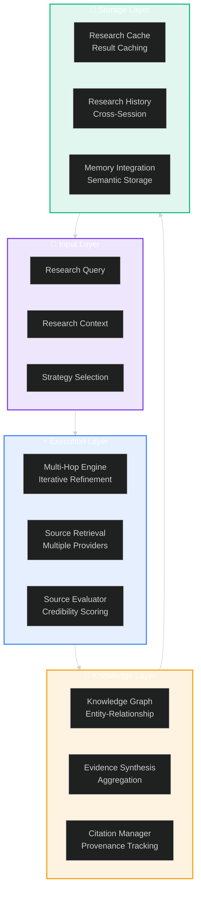

---

## Multi-Hop Reasoning

### Iterative Query Refinement

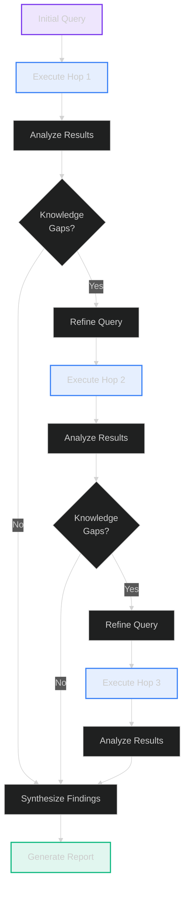

### Research Strategies

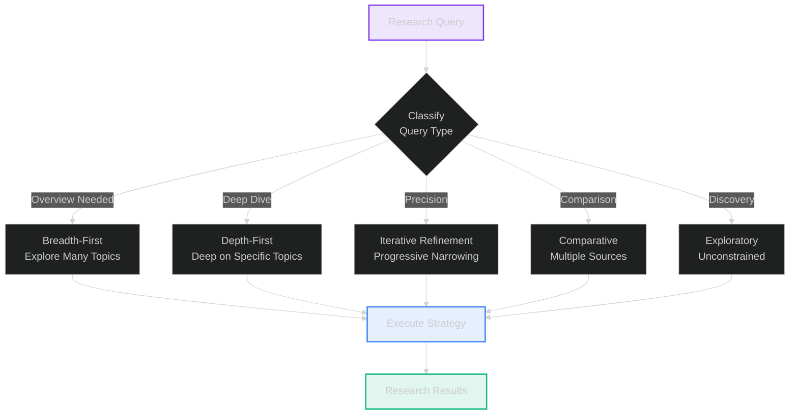

### Query Refinement Process

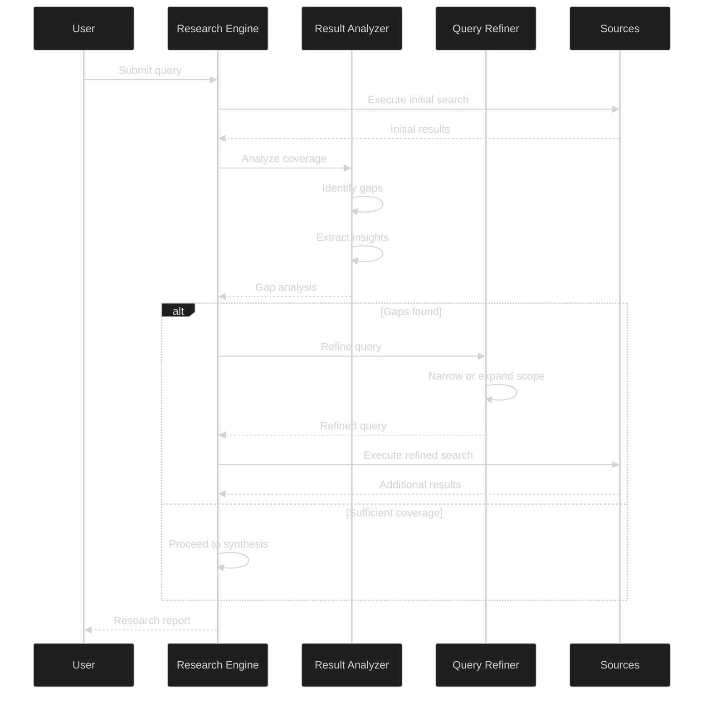

---

## Knowledge Graph Construction

### Graph Structure

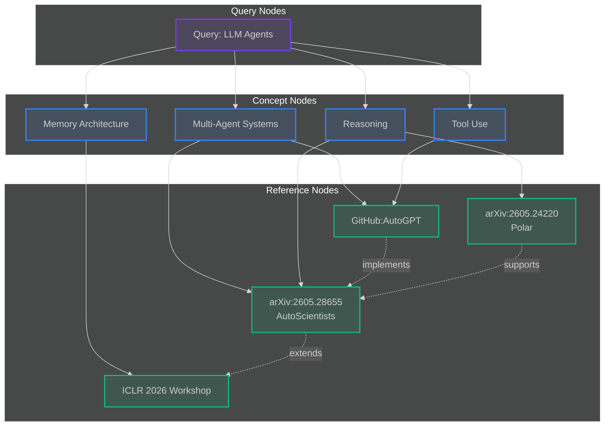

### Entity Extraction

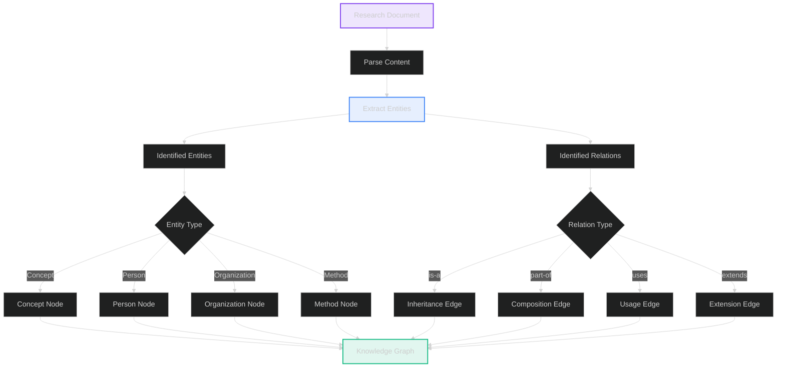

### Graph Operations

```mermaid
%%{init: {'theme': 'dark'}}%%
graph LR
    subgraph Operations["Graph Operations"]
        Add[Add Node/Edge]
        Query[Query Subgraph]
        Traverse[Traverse Paths]
        Merge[Merge Duplicates]
        Prune[Prune Low-Value]
    end
    
    subgraph Algorithms["Graph Algorithms"]
        BFS[Breadth-First Search]
        DFS[Depth-First Search]
        Shortest[Shortest Path]
        Community[Community Detection]
        Centrality[Centrality Analysis]
    end
    
    Operations --> Algorithms
    
    style Operations fill:#7c3aed20,stroke:#7c3aed,stroke-width:2px
    style Algorithms fill:#3b82f620,stroke:#3b82f6,stroke-width:2px
```

---

## Source Credibility Scoring

### Credibility Dimensions

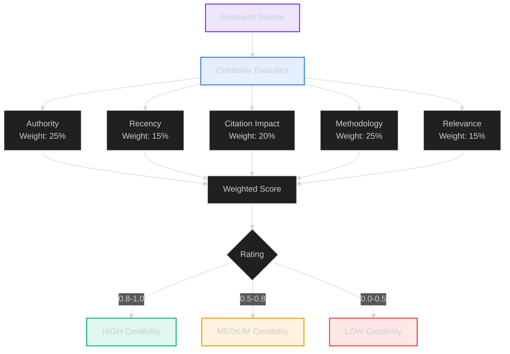

### Scoring Algorithm

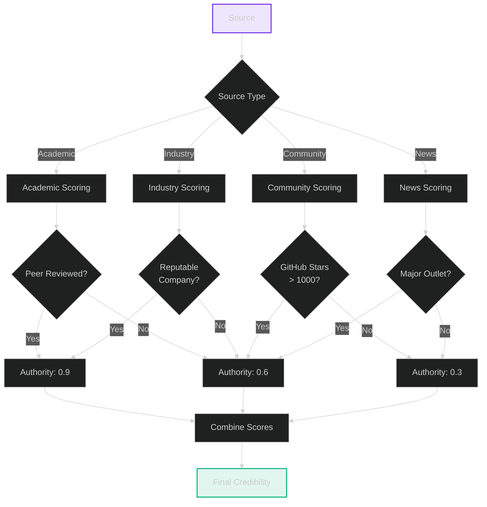

---

## Evidence Synthesis

### Synthesis Process

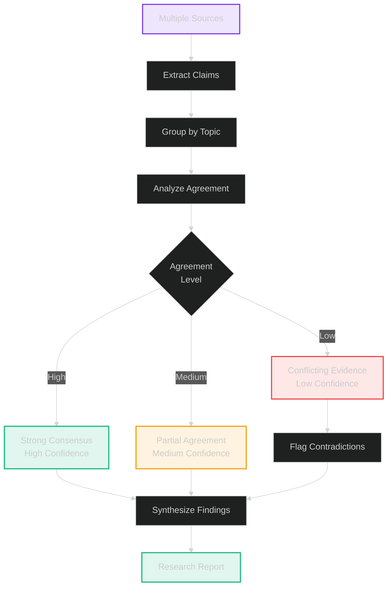

### Contradiction Detection

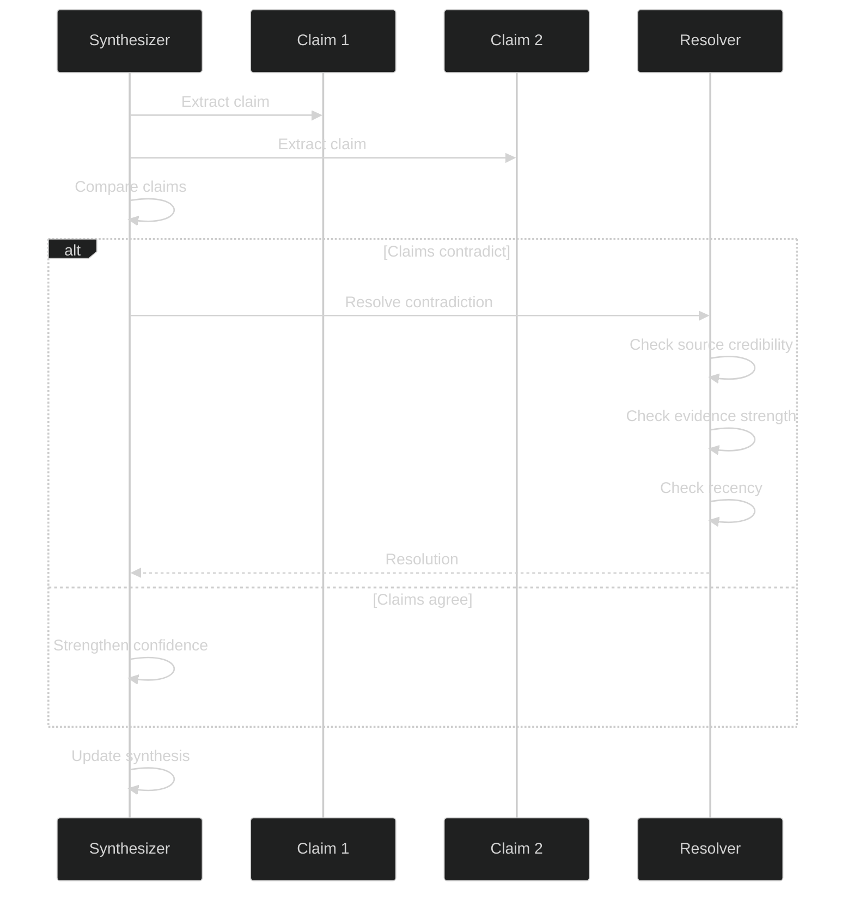

### Evidence Aggregation

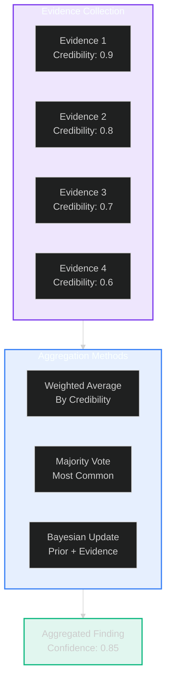

---

## Citation Management

### Citation Structure

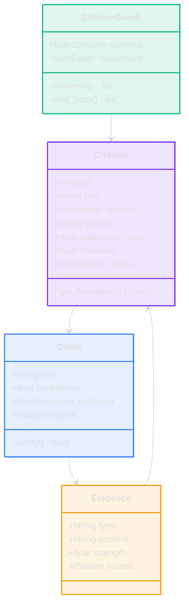

### Citation Traversal

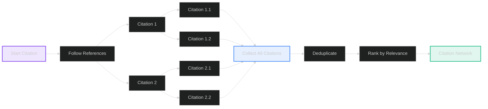

---

## Research Pipeline

### Complete Research Flow

```mermaid
%%{init: {'theme': 'dark'}}%%
sequenceDiagram
    participant User
    participant Engine as Research Engine
    participant Strategy as Strategy Selector
    participant MultiHop as Multi-Hop Engine
    participant KG as Knowledge Graph
    participant Evaluator as Source Evaluator
    participant Synthesizer
    participant Cache
    
    User->>Engine: Submit research query
    Engine->>Strategy: Select strategy
    Strategy-->>Engine: Strategy selected
    
    Engine->>MultiHop: Execute research
    
    loop Multi-hop refinement
        MultiHop->>MultiHop: Execute hop
        MultiHop->>KG: Add entities & relations
        MultiHop->>Evaluator: Score sources
        Evaluator-->>MultiHop: Credibility scores
        MultiHop->>MultiHop: Evaluate coverage
        
        alt Gaps remain
            MultiHop->>MultiHop: Refine query
        else Sufficient
            break
        end
    end
    
    MultiHop->>Synthesizer: Synthesize findings
    Synthesizer->>Synthesizer: Aggregate evidence
    Synthesizer->>Synthesizer: Detect contradictions
    Synthesizer-->>Engine: Research report
    
    Engine->>Cache: Store results
    Engine->>KG: Persist graph
    Engine-->>User: Return report
```

---

## Performance Characteristics

### Research Metrics

| Metric | Target | Current |
|--------|--------|---------|
| **Query Refinement Hops** | 3-5 | 3-4 |
| **Source Coverage** | 20-50 sources | 15-30 |
| **Credibility Threshold** | >0.7 | >0.7 |
| **Synthesis Time** | <30s | <25s |
| **Cache Hit Rate** | >60% | 55% |
| **Knowledge Graph Size** | 1000+ nodes | 500+ |

### Research Quality

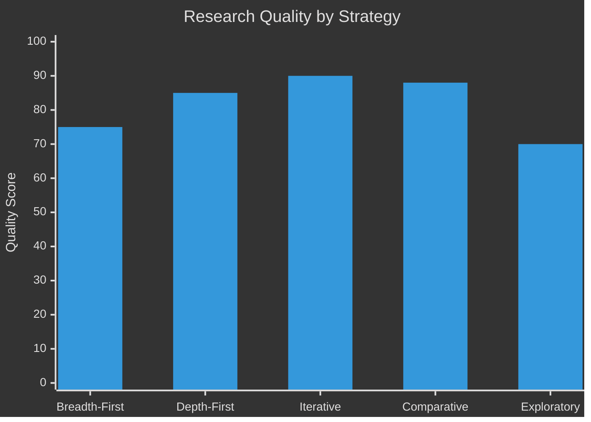

---

## Integration Points

### With Memory System

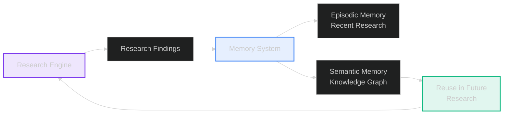

### With Agent Swarm

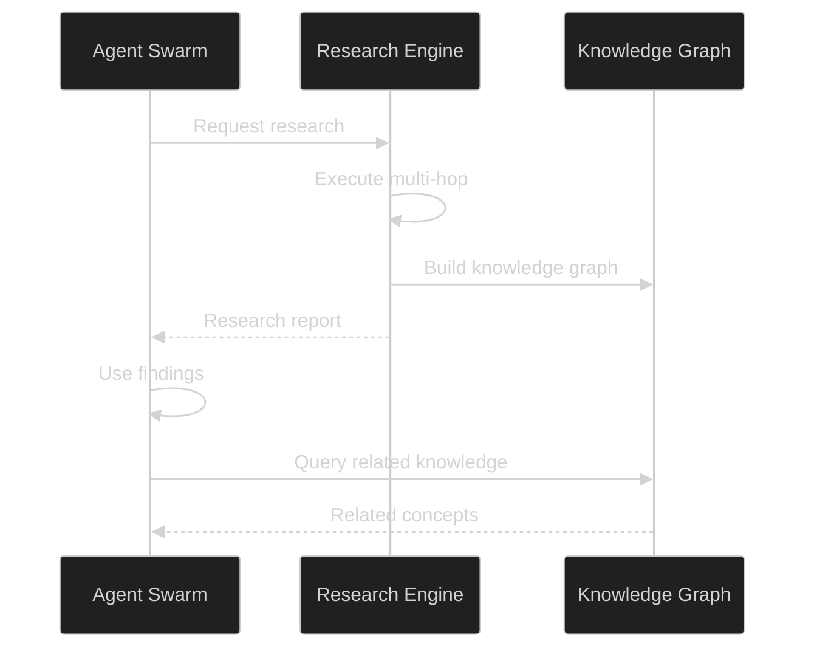

---

## Future Enhancements

### Phase 2: Advanced Features
- 📋 Real-time research monitoring
- 📋 Collaborative research sessions
- 📋 Automated literature reviews
- 📋 Research trend analysis

### Phase 3: Intelligence
- 🔬 Predictive research suggestions
- 🔬 Automated hypothesis generation
- 🔬 Cross-domain knowledge transfer
- 🔬 Research quality prediction

---

## Related Documentation

- [Research Engine Details](./research-engine.md) - Implementation details
- [Knowledge Graph](./MEMORY-ARCHITECTURE-V2.md) - Memory integration
- [Agent Swarm](./agent-swarm.md) - Multi-agent research
- [System Overview](./system-overview.md) - Overall architecture

---

<div align="center">

**Lyra Research Engine Architecture**

Version 2.0 | 2026-05-30 | Production

[System Overview](./system-overview.md) · [Research Engine](./research-engine.md)

</div>
