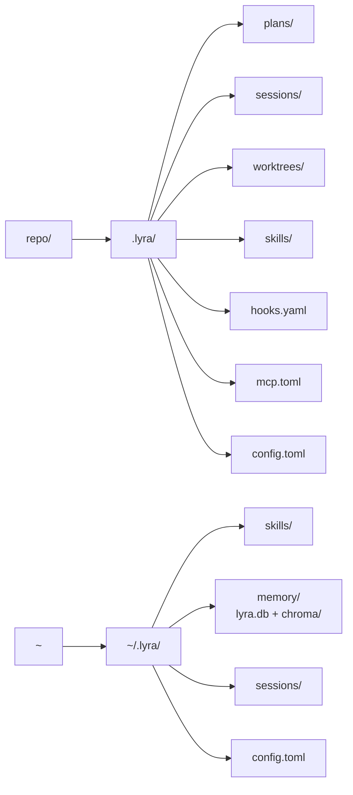

# System topology <span class="lyra-badge advanced">advanced</span>

Lyra is **single-process by default** with an optional local daemon.
There are no required external services — SQLite, Chroma, and the web
viewer all live in-process and on-disk. This page traces the full
runtime layout.

## The runtime picture

```
┌──────────────────────── developer laptop ─────────────────────────┐
│                                                                   │
│  ┌────────────┐  stdin   ┌──────────────────────────────────┐     │
│  │  lyra      │─────────▶│  lyra-daemon (local · optional)  │     │
│  │  CLI       │          │  - Gateway / SessionManager      │     │
│  │  (Typer)   │◀─events──│  - HookRegistry / ToolRegistry   │     │
│  └────────────┘  rich    │  - Web viewer @ :47777 (lazy)    │     │
│                          │  - Worker pool (subagents/verifier) │  │
│                          └──────────────────────────────────┘     │
│                                  ↕                                │
│                                  │ spawns                         │
│                                  ▼                                │
│             ┌────────────────────────────────────────┐            │
│             │  Per-session process space             │            │
│             │   - AgentLoop (gen model client)       │            │
│             │   - Evaluator (eval model client)      │            │
│             │   - SafetyMonitor (nano model client)  │            │
│             │   - Subagents (each in its own worktree) │          │
│             │   - MCP clients (stdio + HTTP)         │            │
│             └────────────────────────────────────────┘            │
│                                  ↕                                │
│                ┌─────────────────┴─────────────────┐              │
│                │                                   │              │
│         ┌──────▼─────┐                       ┌─────▼─────┐        │
│         │  .lyra/    │                       │ ~/.lyra/  │        │
│         │ (repo)     │                       │ (user)    │        │
│         └────────────┘                       └───────────┘        │
└───────────────────────────────────────────────────────────────────┘
                                  ↕
                  ┌───────────────────────────────────┐
                  │  Cloud LLM providers (16)          │
                  │  Anthropic · OpenAI · DeepSeek …   │
                  └───────────────────────────────────┘
                                  ↕
                  ┌───────────────────────────────────┐
                  │  Optional cloud runner pool        │
                  │  (Modal / Fly) — burst subagents   │
                  └───────────────────────────────────┘
```

## Single-process default

For small repos, the CLI runs everything in-process:

```bash
lyra run --foreground "<task>"
```

There's no daemon to start; the CLI process itself owns the session
lifecycle, the model clients, and the worker pool. Memory store, web
viewer, and event bus all live in-process.

This is the default because it eliminates the "is the daemon
running?" failure mode for new users.

## With the daemon

For bigger workflows (long-running cron skills, parallel sessions,
team usage), start the daemon:

```bash
lyra daemon start
lyra run "<task>"     # CLI now talks to the daemon over stdin events
```

The daemon owns:

| Component | Responsibility |
|---|---|
| **Gateway** | Routing, session lifecycle, event bus |
| **HookRegistry / ToolRegistry / SkillRegistry** | Authoritative store; all sessions read from here |
| **Web viewer** | Trace UI on `:47777`, lazy-started on first request |
| **Worker pool** | Subagent and verifier slots, with backpressure |
| **Cron** | Hermes-style scheduled skills |

The daemon is **local-only** and unauthenticated. There is no hosted
SaaS variant. Team coordination comes via a future Multica adapter.

## Per-session process space

Every session spawns a child process that owns:

| Slot | Powered by |
|---|---|
| Generator | The fast or smart model (per-role routing) |
| Evaluator | A different-family judge model for [verifier phase 2](../reference/blocks-index.md) |
| Safety monitor | A cheap nano model that runs every N steps |
| Subagents | Each in its own git worktree, narrowed tools, separate budget |
| MCP clients | One stdio subprocess or HTTP client per `mcp.toml` server |

Each slot is **its own client** — restartable, independently rate-
limited, and individually cost-attributed in `/cost`.

## On-disk layout



| Path | What lives there |
|---|---|
| `.lyra/plans/<session>.md` | Plan-mode artifacts |
| `.lyra/sessions/<session>/STATE.md` | Resumable session state, hand-readable |
| `.lyra/sessions/<session>/recent.jsonl` | Last N turns (transcript spine) |
| `.lyra/sessions/<session>/trace.jsonl` | OTel-equivalent JSONL trace |
| `.lyra/worktrees/<session>/<n>/` | Subagent worktrees (auto-cleaned) |
| `.lyra/skills/*/SKILL.md` | Repo-scoped skills |
| `.lyra/hooks.yaml` | Repo-scoped shell hooks |
| `.lyra/mcp.toml` | Repo-scoped MCP servers |
| `.lyra/config.toml` | Repo overrides for `~/.lyra/config.toml` |
| `~/.lyra/skills/*/SKILL.md` | User-scoped skills |
| `~/.lyra/memory/lyra.db` + `chroma/` | Three-tier memory backing store |
| `~/.lyra/sessions/<session>/` | User-scoped session archive |

The sessions directory is the **single source of truth**: STATE.md +
recent.jsonl + trace.jsonl are enough to fully resume or replay a
session. There is no binary pickle anywhere.

## Network surface

What Lyra calls out to:

| Destination | Why | Optional? |
|---|---|---|
| **LLM provider API** | Every model call | Required (or use Ollama for local) |
| **MCP server** | Every MCP tool call | Optional (only if configured) |
| **Web search / fetch** | `web_search`, `web_fetch` tools | Optional (turn off in `acceptEdits` mode if desired) |
| **OTel collector** | Trace export, if `[observability] otel.endpoint` is set | Optional |
| **Cloud runner pool** (Modal / Fly) | Burst subagents | Optional |

What Lyra **never** calls:

- No telemetry beacons. Lyra never phones home.
- No license check.
- No update check unless you run `lyra update --check`.

## Where to look in the source

| Package | Where |
|---|---|
| `lyra-cli` | `packages/lyra-cli/src/lyra_cli/` — Typer entry, interactive session, providers, HUD |
| `lyra-core` | `packages/lyra-core/src/lyra_core/` — agent loop, hooks, permissions, context, memory, subagent, providers, observability |
| `lyra-skills` | `packages/lyra-skills/src/lyra_skills/` — loader, router, extractor, curator, ledger |
| `lyra-mcp` | `packages/lyra-mcp/src/lyra_mcp/` — MCP client + server adapters |
| `lyra-evals` | `packages/lyra-evals/src/lyra_evals/` — eval scaffolds, runner, public-benchmark adapters |

[← Architecture overview](index.md){ .md-button }
[Continue to Eleven commitments →](commitments.md){ .md-button .md-button--primary }
