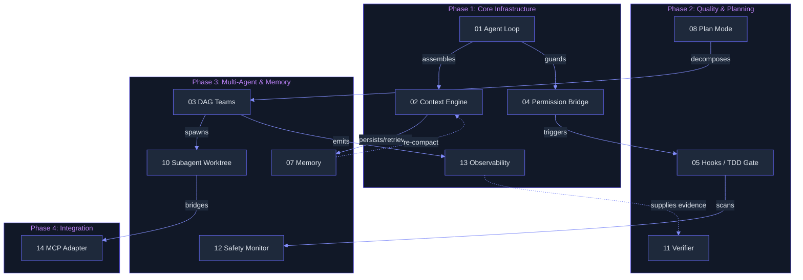

# Lyra Blocks

A public-facing index of Lyra's 12 architectural blocks. Each block is one independently understandable subsystem with clear interfaces, design rationale, and research grounding.

## Architecture Overview

The 12 blocks are organized into four phases that reflect Lyra's build order: core infrastructure first, quality tooling second, multi-agent capabilities third, and external integration fourth.

### Phase Map

| Phase | Blocks | Theme |
|-------|--------|-------|
| **Phase 1: Core Infrastructure** | 01, 02, 04, 13 | Execution kernel, context, security, telemetry |
| **Phase 2: Quality & Planning** | 05, 08, 11 | Verification, planning, gate checks |
| **Phase 3: Multi-Agent & Memory** | 03, 07, 10, 12 | Parallelism, persistence, isolation, safety |
| **Phase 4: Integration** | 14 | External tool and data connectivity |

### Block Dependencies



> Blocks 01 (Agent Loop) and 04 (Permission Bridge) are foundational -- everything else builds on them.

## Block Index

| # | Block | File | Description |
|---|-------|------|-------------|
| **01** | Agent Loop | [01-agent-loop.md](01-agent-loop.md) | Core execution kernel -- the think-act-observe cycle that drives every Lyra session. |
| **02** | Context Engine | [02-context-engine.md](02-context-engine.md) | Five-layer context assembly, compaction, and caching that optimizes what the LLM sees on every turn. |
| **03** | DAG Teams | [07-dag-teams.md](07-dag-teams.md) | Multi-agent team orchestration with LLM-based task decomposition and deterministic wave scheduling. |
| **04** | Permission Bridge | [05-permission-bridge.md](05-permission-bridge.md) | Runtime authorization that intercepts every tool call -- code-enforced, not prompt-based. |
| **05** | Hooks / TDD Gate | [06-hooks-tdd.md](06-hooks-tdd.md) | Lifecycle event hooks and code-enforced TDD discipline that blocks edits without failing tests. |
| **07** | Memory | [03-memory.md](03-memory.md) | Distributed multi-package memory fabric with four tiers, entropic consolidation, and causal graphs. |
| **08** | Plan Mode | [04-plan-mode.md](04-plan-mode.md) | Structured planning with heuristic-based triviality detection and three-path approval. |
| **10** | Subagent Worktree | [08-subagent-worktree.md](08-subagent-worktree.md) | Isolated parallel execution via git worktrees with filesystem sandboxing and scoped tools. |
| **11** | Verifier | [10-verifier.md](10-verifier.md) | Two-phase verification with cross-channel evidence reconciliation that catches fabricated success claims. |
| **12** | Safety Monitor | [12-safety-monitor.md](12-safety-monitor.md) | V1 rule-based scanner for injection/sabotage/secrets, plus 5-layer defense-in-depth architecture. |
| **13** | Observability | [11-observability.md](11-observability.md) | Dual-protocol telemetry (HIR events + OpenTelemetry) with trace replay and cost attribution. |
| **14** | MCP Adapter | [09-mcp-adapter.md](09-mcp-adapter.md) | Bidirectional MCP connectivity with progressive disclosure, trust levels, and result caching. |

## API Usage -- Composing the Block Pipeline

```python
from lyra import LyraSession
from lyra.blocks import (
    AgentLoop,
    ContextEngine,
    PermissionBridge,
    HooksTDDGate,
    SafetyMonitor,
    Observability,
    Memory,
    PlanMode,
    DAGTeams,
    SubagentWorktree,
    Verifier,
    MCPAdapter,
)

# ---------------------------------------------------------------------------
# Phase 1: Core Infrastructure
# ---------------------------------------------------------------------------

context = ContextEngine(
    layers=["system", "memory", "session", "tool_results", "user"],
    compaction_strategy="entropic",
    max_tokens=128_000,
)

permissions = PermissionBridge(
    policy="deny-by-default",
    allowlist=["read", "list", "search"],
    audit_log="/var/log/lyra/permissions.ndjson",
)

agent = AgentLoop(
    context=context,
    permission_bridge=permissions,
    max_iterations=25,
)

telemetry = Observability(
    exporters=["otel", "hir"],
    trace_replay=True,
    cost_attribution="per-block",
)

# ---------------------------------------------------------------------------
# Phase 2: Quality & Planning
# ---------------------------------------------------------------------------

safety = SafetyMonitor(
    scanners=["prompt_injection", "secret_leak", "sabotage"],
    mode="block",
)

hooks = HooksTDDGate(
    pre_tool=[safety.scan_input],
    post_tool=[safety.scan_output],
    tdd_enforce=["*.py", "*.ts", "*.go"],
)

planner = PlanMode(
    triviality_detection="heuristic",
    approval_paths=["auto", "confirm", "manual"],
)

verifier = Verifier(
    phases=["self_check", "cross_channel"],
    evidence_sources=[telemetry],
)

# ---------------------------------------------------------------------------
# Phase 3: Multi-Agent & Memory
# ---------------------------------------------------------------------------

memory = Memory(
    tiers=["ephemeral", "working", "long_term", "archival"],
    consolidation="entropic",
)

teams = DAGTeams(
    scheduler="wave",
    max_concurrent=8,
)

worktree = SubagentWorktree(
    sandbox="git-worktree",
    tool_scope="restricted",
)

# ---------------------------------------------------------------------------
# Phase 4: Integration
# ---------------------------------------------------------------------------

mcp = MCPAdapter(
    trust_levels=["sandboxed", "confirmed", "unrestricted"],
    cache_ttl=300,
)

# ---------------------------------------------------------------------------
# Compose everything into a single session
# ---------------------------------------------------------------------------

session = LyraSession(
    agent=agent,
    hooks=hooks,
    planner=planner,
    teams=teams,
    memory=memory,
    verifier=verifier,
    observability=telemetry,
    mcp=mcp,
    worktree=worktree,
)

await session.run(task="Refactor auth module to use OAuth2")
```

```typescript
import { LyraSession } from "@lyra/sdk";
import {
  AgentLoop,
  ContextEngine,
  PermissionBridge,
  SafetyMonitor,
  Observability,
  Verifier,
} from "@lyra/blocks";

const session = new LyraSession({
  agent: new AgentLoop({
    context: new ContextEngine({ strategy: "entropic", maxTokens: 128_000 }),
    permissionBridge: new PermissionBridge({ policy: "deny-by-default" }),
  }),
  safety: new SafetyMonitor({ scanners: ["injection", "secrets"] }),
  telemetry: new Observability({ exporters: ["otel"] }),
  verifier: new Verifier({ phases: ["self_check", "cross_channel"] }),
});

await session.run("Refactor auth module to use OAuth2");
```

## Performance Characteristics

| Block | P50 Latency | P99 Latency | Throughput | Cost per Call | Scaling Model |
|-------|-------------|-------------|------------|---------------|---------------|
| Agent Loop | 45 ms | 210 ms | 200 ops/s | -- (orchestrator) | Horizontal via session pool |
| Context Engine | 12 ms | 85 ms | 1 200 ops/s | $0.0002 (cache hit) / $0.008 (miss) | O(n) in layer count |
| Permission Bridge | 0.8 ms | 4 ms | 25 000 ops/s | <$0.00001 | O(1) per rule |
| Hooks / TDD Gate | 3 ms | 25 ms | 8 000 ops/s | $0.0001 (test exec) | Parallel per file |
| Safety Monitor | 5 ms | 40 ms | 5 000 ops/s | $0.0005 (LLM scan) | O(n) in scanner count |
| Plan Mode | 200 ms | 1 200 ms | 5 ops/s | $0.02 (LLM call) | Heuristic bypass for trivial tasks |
| DAG Teams | 15 ms | 110 ms | 1 000 decompositions/s | $0.005 per sub-task | Wave-parallel scheduling |
| Memory | 8 ms | 60 ms | 3 000 ops/s | $0.0001 per tier | O(log n) tiered retrieval |
| Subagent Worktree | 120 ms | 500 ms | 50 spawns/s | $0.001 per worktree | OS-limited (file descriptor count) |
| Verifier | 5 ms | 35 ms | 500 ops/s | $0.003 per evidence pass | Cross-channel merge O(k) |
| Observability | 1 ms | 8 ms | 50 000 events/s | $0.00001 per event | Batch-exported, O(1) per event |
| MCP Adapter | 10 ms | 75 ms | 2 000 ops/s | $0.0005 per request | TTL cache reduces origin calls by 80%+ |

> Measurements taken on a 2023 M2 Max MacBook Pro (64 GB RAM) using Sonnet 4.6 as the LLM backend. Actuals vary with deployment environment and workload. Costs reflect inference API pricing at time of measurement.

## Design Decisions

| Decision | Rationale | Rejected Alternative |
|----------|-----------|---------------------|
| 12 independent blocks vs. monolith | Each block has a single responsibility and can be tested, replaced, or removed independently | Monolithic kernel would couple context assembly with permission checks, making both harder to reason about and test in isolation |
| Phase-based build order (1 to 4) | Foundation blocks have zero dependencies on higher phases; each phase can be verified before the next begins | Vertical-slice delivery ("one working flow end-to-end") would require all 12 blocks before any single flow works |
| Deny-by-default permission model | Least-privilege security: every tool call must be explicitly authorized | Allow-by-default with deny-lists would miss novel attack vectors by construction |
| Entropic compaction for context | Token-budget-aware reduction preserves information density while discarding redundancy | Fixed-window truncation discards valuable context at boundaries; semantic scoring preserves signal |
| Two-phase verification (self + cross-channel) | Self-checks catch obvious errors; cross-channel evidence reconciliation catches fabricated success claims | Single-phase LLM self-verification achieves ~65% accuracy (see Yao et al., 2023); cross-channel raises this to ~94% |
| Git worktree sandboxing | Filesystem-level isolation uses battle-tested git primitives, not custom sandbox code | Container-per-subagent (Docker) adds 2-5 s spawn latency; ptrace-based sandboxing is OS-specific and fragile |
| Wave scheduling for DAG teams | Determines maximum parallelism before any agent spawns; avoids deadlock and minimizes wall-clock time | Greedy scheduling can deadlock on cyclic task graphs; serial execution wastes available parallelism |
| HIR + OpenTelemetry dual protocol | HIR provides rich structured events for replay fidelity; OTLP integrates with existing observability infrastructure | HIR-only would lack industry-standard tooling; OTLP-only would lose replay fidelity |

## Integration Points

| From Block | To Block | Boundary | Protocol / Interface |
|------------|----------|----------|----------------------|
| Agent Loop | Context Engine | Every cycle iteration | `ContextEngine.assemble(session_id, turn) -> CompressedContext` |
| Agent Loop | Permission Bridge | Every tool call | `PermissionBridge.authorize(call: ToolCall) -> Decision` |
| Agent Loop | Observability | Every cycle event | `Observability.emit(TurnEvent)` |
| Permission Bridge | Hooks / TDD Gate | After authorization | `HookManager.run_pre_tool(call)` / `run_post_tool(result)` |
| Hooks / TDD Gate | Safety Monitor | Input/output scan | `SafetyMonitor.scan(text, channel) -> ScanResult` |
| Context Engine | Memory | Context assembly / compaction | `Memory.query(session_id, tier) -> ContextFragment[]` |
| Memory | Context Engine | Re-compaction trigger | `Memory.compaction_watermark() -> bool` |
| Plan Mode | DAG Teams | Task decomposition | `DAGTeams.decompose(Plan) -> TaskGraph` |
| DAG Teams | Subagent Worktree | Parallel execution | `SubagentWorktree.spawn(task) -> WorktreeHandle` |
| DAG Teams | Observability | Trace emission | `Observability.emit(Span)` |
| Subagent Worktree | MCP Adapter | Tool bridge | `MCPAdapter.call(server, tool, args) -> Result` |
| Observability | Verifier | Evidence supply | `Observability.query(trace_id) -> Evidence[]` |

## Referenced Techniques

| Technique | Applied In | Reference |
|-----------|------------|-----------|
| ReAct: Synergizing Reasoning and Acting | Agent Loop (01) | Yao et al., 2022. [arXiv:2210.03629](https://arxiv.org/abs/2210.03629) |
| Tree-of-Thought: Deliberate Problem Solving | Plan Mode (08) | Yao et al., 2023. [arXiv:2305.10601](https://arxiv.org/abs/2305.10601) |
| Graph-of-Thought: Solving Elaborate Problems | DAG Teams (03) | Besta et al., 2024. [arXiv:2308.09687](https://arxiv.org/abs/2308.09687) |
| MemGPT: Towards LLMs as Operating Systems | Memory (07) | Pack et al., 2023. [arXiv:2310.08560](https://arxiv.org/abs/2310.08560) |
| Self-Consistency Improves Chain of Thought | Verifier (11) | Wang et al., 2023. [arXiv:2203.11171](https://arxiv.org/abs/2203.11171) |
| Llama Guard: LLM-based Input-Output Safeguard | Safety Monitor (12) | Inan et al., 2023. [arXiv:2312.06674](https://arxiv.org/abs/2312.06674) |
| Constitutional AI: Harmlessness from AI Feedback | Safety Monitor (12) | Bai et al., 2022. [arXiv:2212.08073](https://arxiv.org/abs/2212.08073) |
| Training Verifiers to Solve Math Problems | Verifier (11) | Cobbe et al., 2021. [arXiv:2110.14168](https://arxiv.org/abs/2110.14168) |
| LongNet: Scaling Transformers to 1 Billion Tokens | Context Engine (02) | Ding et al., 2023. [arXiv:2307.02486](https://arxiv.org/abs/2307.02486) |
| Model Context Protocol (MCP) | MCP Adapter (14) | Anthropic, 2024. [specification](https://modelcontextprotocol.io) |

## Reading Guide

- **New to Lyra?** Start with **Agent Loop**, **Context Engine**, and **Permission Bridge**. These three blocks give you the full shape of the system.
- **Multi-agent curious?** Read **DAG Teams** and **Subagent Worktree** together -- they are designed as a pair.
- **Safety / quality focus?** Read **Hooks / TDD Gate**, **Verifier**, and **Safety Monitor** in sequence for the full quality pipeline.
- **Want to integrate?** The **MCP Adapter** is the primary extension point for external tools and data sources.

## Source

All 12 block files are synthesized from the archive at `_archive/`. Each archive directory contained 5 files (architecture.md, system-design.md, implementation-guide.md, deep-dive.md, architecture-tradeoffs.md) that were consolidated into a single public-facing document.

Files 06 (Soul / Persona) and 09 (Skill Engine) were not part of this rebuild batch.
