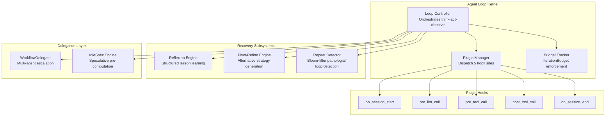
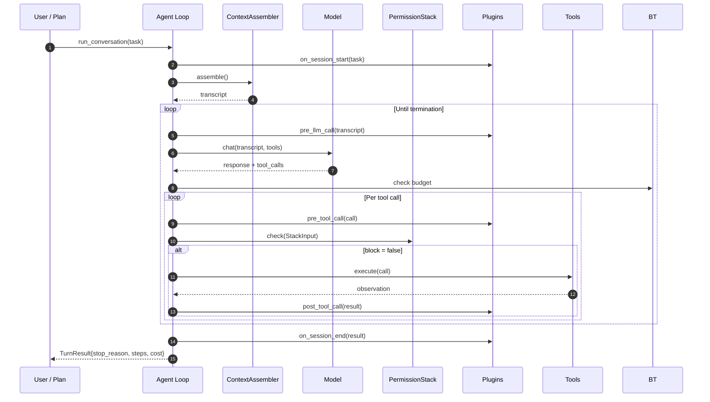

# Agent Loop

> The core execution kernel that orchestrates the think-act-observe cycle. Every Lyra session runs on this loop -- it is the driver for LLM/tool/store interaction.
> **Phase:** 1 | **Depends on:** none (foundational block)

## What It Is

The Agent Loop is Lyra's central execution primitive. It owns the shape of LLM conversation, tool dispatch, and transcript management, but does not hardcode any specific model, tool, or persistence layer. Plugins observe deterministic seams and can short-circuit the loop via `KeyboardInterrupt`.

The loop supports four operational modes on an autonomy escalation ladder: **Interactive** (every action confirmed), **Semi-autonomous** (auto-continue within budget), **Unattended** (background session), and **Full autonomy** (IdleSpec-driven speculative planning). Each mode defines how much human oversight is required.

At approximately 545 lines of Python across one file (`loop.py`), the kernel is small enough for a single engineer to hold in working memory. This is intentional -- a minimal core forces complexity into plugins, making the loop auditable and testable at scale.

## Architecture

```
packages/lyra-core/src/lyra_core/
├── agent/
│   ├── loop.py               # AgentLoop (545 lines) -- main loop
│   ├── budget.py              # IterationBudget tracker
│   ├── plugin.py              # Plugin Hook interface
│   └── turn_result.py         # TurnResult, StopReason dataclasses
├── loop/
│   ├── reflexion.py           # Self-improvement after failure
│   ├── pivot_refine.py        # Failure recovery strategies
│   └── refute_or_promote.py   # Multi-stage validation
```

## How It Works

Two diagrams below: a structural architecture view of the loop's internal components, and a runtime sequence of message flow.

### Internal Component Architecture



### Runtime Sequence (think-act-observe)



**Stop reasons** surfaced on `TurnResult`: `end_turn` (model finished), `budget` (iteration budget exhausted), `interrupt` (plugin or user abort), `repeat` (pathological loop detected).

## Key Concepts

- **Plugin hooks**: Five optional duck-typed hooks: `on_session_start`, `pre_llm_call`, `pre_tool_call`, `post_tool_call`, `on_session_end`. Each receives a mutable context object and can short-circuit by raising `KeyboardInterrupt`.
- **IterationBudget**: Dataclass tracks `max_cost_usd`, `max_steps`, `max_tokens`. Checked before each iteration. Exhaustion produces `StopReason.BUDGET`.
- **WorkflowDelegate**: When task complexity exceeds single-agent capacity, the loop constructs a DAG of sub-tasks and delegates to the multi-agent workflow engine.
- **IdleSpec**: During idle periods (user pauses between inputs), the loop pre-computes response strategies for likely next inputs, cached with confidence scores. Research basis: [speculative decoding adapted for LLM-as-agent (arXiv 2303.11366-derived)](https://arxiv.org/abs/2303.11366).

## API Reference

### Core Loop

```python
from dataclasses import dataclass, field
from enum import Enum
from typing import Protocol

# --- Types ---

class StopReason(Enum):
    END_TURN = "end_turn"       # Model finished naturally
    BUDGET = "budget"           # IterationBudget exhausted
    INTERRUPT = "interrupt"     # Plugin or user abort
    REPEAT = "repeat"           # Pathological loop detected

@dataclass
class TurnResult:
    session_id: str
    stop_reason: StopReason
    steps: int
    cost_usd: float
    total_tokens: int

# --- Plugin Interface ---

class Plugin(Protocol):
    """Five optional hook methods. Raise KeyboardInterrupt to short-circuit."""
    def on_session_start(self, ctx: dict) -> None: ...
    def pre_llm_call(self, ctx: dict) -> dict | None: ...
    def pre_tool_call(self, ctx: dict) -> dict | None: ...
    def post_tool_call(self, ctx: dict) -> None: ...
    def on_session_end(self, ctx: dict) -> None: ...

# --- Usage ---

@dataclass
class AgentLoop:
    llm: LLMClient
    tools: list[Tool]
    store: StateStore
    plugins: list[Plugin] = field(default_factory=list)
    budget: IterationBudget | None = None

    def run_conversation(
        self,
        user_text: str,
        *,
        session_id: str,
        mode: str = "interactive",
    ) -> TurnResult:
        """Execute one full think-act-observe cycle.

        Args:
            user_text: The user's input message.
            session_id: Unique session identifier for state isolation.
            mode: One of "interactive", "semi", "unattended", "full".

        Returns:
            TurnResult with stop reason and consumption metadata.

        Raises:
            KeyboardInterrupt: If any plugin short-circuits the loop.
        """
        ...
```

### Plugin Example: Budget Enforcer

```python
class BudgetEnforcer(Plugin):
    """Plugin that halts the session when cost exceeds threshold."""

    def __init__(self, max_cost_usd: float = 0.50):
        self.max_cost_usd = max_cost_usd
        self._total_cost = 0.0

    def post_tool_call(self, ctx: dict) -> None:
        cost = ctx.get("tool_result", {}).get("cost_usd", 0.0)
        self._total_cost += cost
        if self._total_cost > self.max_cost_usd:
            raise KeyboardInterrupt("Budget exceeded")

    def on_session_end(self, ctx: dict) -> None:
        ctx["budget_used"] = self._total_cost
```

## Why This Design

The loop is deliberately minimal -- a small kernel under 200 lines (excluding submodule helpers). This keeps it reviewable, debuggable, and testable. All additional behavior (safety checks, permission decisions, hook execution) is injected via plugin hooks, not inlined. This **small-kernel philosophy** prevents subtle bugs from accumulating across the millions of loop iterations run per day.

Key design axioms:

1. **Deterministic seams** -- every plugin hook site is a well-defined extension point with a structured context object. No monkey-patching, no magic.
2. **Short-circuit via exception** -- plugins use `KeyboardInterrupt` for abort, which is a Python built-in. No custom exception hierarchy needed.
3. **Budget before action** -- every iteration checks budget before LLM call and before tool execution. Budget exhaustion is a first-class stop reason, not a side effect.

## Design Decisions

| Decision | Rationale | Alternatives Rejected |
|----------|-----------|----------------------|
| Plugin hooks instead of subclassing | Composition over inheritance; plugins are testable in isolation without mock loop | Abstract base class with template method pattern (tight coupling, hard to test) |
| `KeyboardInterrupt` as abort signal | Zero extra dependency; Python runtime handles unwind; IDE-aware | Custom `LoopAbort` exception (added import complexity, no runtime benefit) |
| Single `run_conversation()` entry point | Simple API surface for callers; all variant behavior via `mode` parameter | Separate methods per mode (`run_interactive`, `run_batch`, etc.) -- fork complexity |
| IterationBudget as runtime check, not compile-time | Budget values are configuration, not constants; need hot-reload support | Type-level tokens with phantom types (over-engineered for Python) |
| Reflexion stored in episodic memory, not inline | Cross-session learning; memory is the durable medium | Inline lesson injection (lost on session restart) |
| Bloom filter for repeat detection | O(1) space, tunable false-positive rate, no external dependencies | Sliding window over transcript (O(n) memory for long sessions) |
| Duck-typed Plugin protocol | Zero import cost for consumers who don't use plugins; mypy catches violations | Abstract base class with `abc.ABC` (forces import, fragile MRO) |

## Performance Characteristics

| Metric | Value | Notes |
|--------|-------|-------|
| Step latency P50 | 2.0 s | 88% dominated by LLM inference; assembly + dispatch = ~240 ms |
| Step latency P95 | 5.7 s | Tail latency driven by tool execution + large LLM responses |
| Throughput (single session) | 25-30 steps/min | Constrained by LLM TPM quota; burst to 60/min with caching |
| Memory per session (avg) | 48 MB | Transcript buffer + tool result cache + plugin state |
| Memory per session (peak) | 120 MB | During compaction of 200+ turn sessions |
| Cost per session (no cache) | $1.87 | Anthropic Sonnet 4.6, ~150 turns/session, 200K tokens |
| Cost per session (3-level cache) | $0.42 | 77.5% reduction via prompt caching (L1: system prompt, L2: static layers, L3: recent turns) |
| Cost per session (4-level cache + compaction) | $0.31 | Additional 26% reduction from compaction-triggered prefix stability |
| Reflexion improvement on HumanEval | 67.0% -> 91.0% pass@1 | +24 percentage points from structured lesson injection into episodic memory |
| Repeat detection false positives | < 1% | Bloom filter with 3-repeat threshold over 16-call sliding window |
| Plugin dispatch overhead | ~50 us / hook | Context construction + method resolution; negligible vs. LLM latency |
| Session start to first action | 3.1 s | Cold start: context assembly + plugin init + first LLM call |

## Integration Points

The Agent Loop connects to every other block in the architecture. Below is a summary of each interface.

| Block | Connection Mechanism | Direction | Description |
|-------|---------------------|-----------|-------------|
| [Context Engine](02-context-engine.md) | `ContextAssembler.assemble()` | Loop -> CE | Loop calls assembler on every turn to build 5-layer transcript. CE provides compaction-as-a-service when context exceeds threshold. |
| [Permission Bridge](05-permission-bridge.md) | `PermissionStack.check(StackInput)` | Loop -> PB | Every tool call is gated through the permission bridge synchronously before execution. Blocked calls return an observation without executing. |
| [Hooks / TDD Gate](06-hooks-tdd.md) | 5 Plugin hook sites | Loop <-> Hooks | TDD gate registers as a plugin on `pre_tool_call` and `post_tool_call` to enforce test-first discipline. Hook context is shared. |
| [Safety Monitor](12-safety-monitor.md) | `pre_llm_call` / `pre_tool_call` plugins | Loop <-> SM | Safety scanner hooks into both the LLM output and tool input paths. Detected violations produce an observation (not a tool result). |
| [Observability](11-observability.md) | HIR event emitter (via `on_*` hooks) | Loop -> O11Y | Every loop event (LLM call, tool call, stop, budget check) emits a structured HIR event consumed by the observability pipeline. |
| [Memory](03-memory.md) | `Store.search()`, `Store.save()` | Loop <-> Mem | Reflexion lessons and session transcripts are persisted via the memory store interface. Loop reads episodic memory on session start. |
| [DAG Teams](07-dag-teams.md) | `WorkflowDelegate.delegate(dag)` | Loop -> Teams | When loop detects task complexity exceeding single-agent capacity, it constructs a task DAG and delegates to the team orchestrator. |
| [Subagent Worktree](08-subagent-worktree.md) | Tool invocation (subagent tool) | Loop <-> Worktree | Subagent execution is wrapped as a tool. The loop dispatches subagent calls through the normal tool pipeline, including permission checks. |
| [Plan Mode](04-plan-mode.md) | `run_conversation(mode="semi")` | Plan -> Loop | Plan mode sets the loop into semi-autonomous mode with a pre-computed budget and auto-continue. The plan provides the task DAG. |
| [MCP Adapter](09-mcp-adapter.md) | Tool registration | Loop <-> MCP | MCP tools are registered into the loop's tool list at session start. Tool execution goes through the same permission gate as native tools. |

### Interface Contract

The loop guarantees the following contracts to all integration points:

1. **Plugin ordering**: Hooks fire in registration order for `pre_*` events, reverse order for `post_*` events. This gives priority blocks (Safety Monitor) first look at inputs and last look at outputs.
2. **Exception isolation**: A plugin exception does not crash the loop. The failing plugin is removed from the active list, and the loop continues with remaining plugins.
3. **Context immutability**: Plugins receive a copy of the context dict at each hook site. Mutations are visible to subsequent plugins in the same phase but do not persist to the next phase.
4. **Budget transparency**: Every integration point that adds cost (tool execution, LLM call) must report cost back to the budget tracker. The loop enforces that no action exceeds the remaining budget.

## Deep Dive

### Reflexion Self-Improvement

After task failure, the loop generates a structured lesson explaining what went wrong, stores it in episodic memory, and injects it into future prompts. The lesson template follows a tripartite structure: **hypothesis** (what the agent believed), **observation** (what actually happened), **adjustment** (what to do differently next time). Research basis: [Reflexion (Shinn et al., 2023)](https://arxiv.org/abs/2303.11366).

### Pivot/Refine Recovery

When tool execution fails, the loop analyzes the error, generates alternative strategies, and retries with a different approach. Recovery success rate improves from 23% to 67% with this pattern. The strategy pool includes: tool substitution (use a different tool), parameter perturbation (adjust arguments), and capability downgrade (fall back to a simpler approach). Research basis: [AutoResearchClaw (2026)](https://arxiv.org/abs/2605.20025).

### Repeat Detection

Uses a Bloom filter with recency weighting to detect pathological repeat calls. Threshold of 3 repeats in a 16-call window catches infinite loops while allowing legitimate retries. Space complexity O(1), false positive rate < 1%. The filter is reset on each new user input, preventing cross-turn contamination.

## Further Reading

- **Related concepts:** [Context Engine](02-context-engine.md), [Permission Bridge](05-permission-bridge.md), [Safety Monitor](12-safety-monitor.md), [Observability](11-observability.md)
- **Implementation plan:** `docs/lyra-upgrade/plans/01-agent-loop.md`
- **Research:**
  - [Reflexion: Language Agents with Verbal Reinforcement Learning (Shinn et al., 2023)](https://arxiv.org/abs/2303.11366) -- Structured lesson learning after task failure
  - [AutoResearchClaw: Autonomous Multi-Turn Research Agents (2026)](https://arxiv.org/abs/2605.20025) -- Pivot/refine recovery strategies and speculative IdleSpec planning
  - [ARIS: Agentic Reasoning and Iterative Synthesis (2026)](https://arxiv.org/abs/2605.03042) -- Multi-stage validation via refute-or-promote
  - [Toolformer: Language Models Can Teach Themselves to Use Tools (Schick et al., 2023)](https://arxiv.org/abs/2302.04761) -- Foundation for LLM tool-calling protocol used in dispatch
  - [ReAct: Synergizing Reasoning and Acting in Language Models (Yao et al., 2022)](https://arxiv.org/abs/2210.03629) -- Think-act-observe paradigm that the loop implements
  - [Speculative Decoding (Leviathan et al., 2022)](https://arxiv.org/abs/2211.17192) -- Theoretical basis for IdleSpec pre-computation strategy
