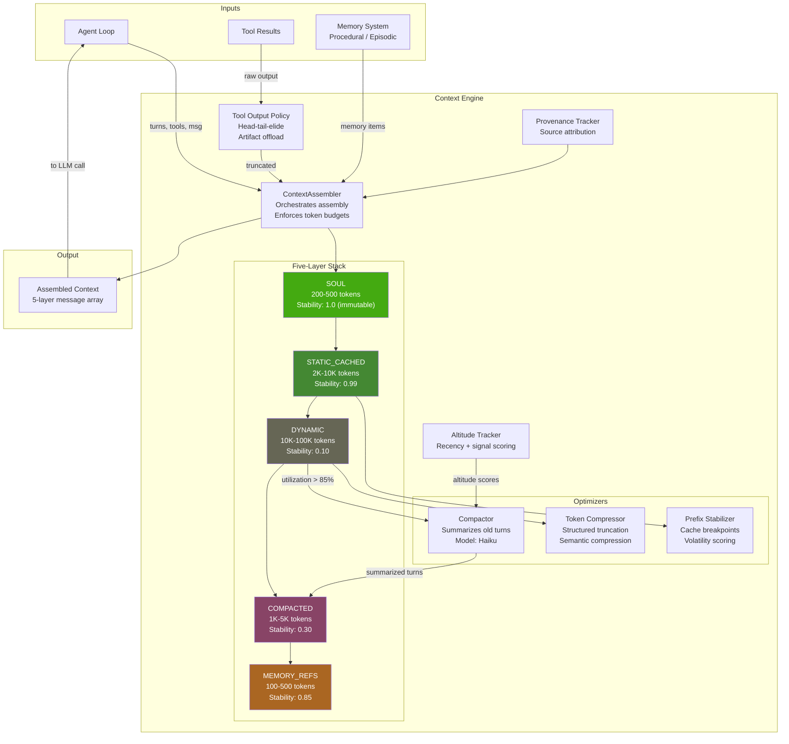

# Context Engine

> Assembles and manages what the LLM sees on every turn using a five-layer architecture with tiered stability, predictive compaction, and provider-aware cache optimization.
> **Phase:** 1 | **Depends on:** Agent Loop | **Extends:** Memory System | **Provides:** ContextAssembly, Compaction, CacheOptimization

## Overview

The Context Engine is the subsystem responsible for building, compacting, and optimizing LLM transcripts. It organizes context into five named layers with distinct stability and compaction rules so that critical instructions are never lost, cached content stays stable across turns, and dynamic content is pruned oldest-first.

The module contains 25 files covering assembly, compaction, token compression, repository mapping, altitude tracking, prefix stability, and provenance tracking.

## Architecture



<div align="center">
  <em>Figure 1: Context Engine internal architecture. The five-layer stack is assembled top-to-bottom;
  compaction triggers when L3 utilization exceeds 85% of the token budget.</em>
</div>

## Five-Layer Context Model

| Layer | Stability | Typical Size | Compaction | Cache Breakpoint |
|-------|-----------|-------------|------------|-----------------|
| **SOUL** | 1.0 (immutable) | 200-500 tok | Never | Yes (L1) |
| **STATIC_CACHED** | 0.99 | 2K-10K tok | Never | Yes (L2) |
| **DYNAMIC** | 0.10 | 10K-100K tok | Eager (at 85%) | No |
| **COMPACTED** | 0.30 | 1K-5K tok | Lazy | No |
| **MEMORY_REFS** | 0.85 | 100-500 tok | Never | No |

Stability scores represent volatility estimates: system prompt content scores 0.01-0.05, recent user turns score 0.80-0.95. The five layers are assembled in this order:

1. **SOUL** -- Repository persona, never compacted. Prevents persona drift, the dominant failure mode in long sessions.
2. **STATIC_CACHED** -- System prompts, rules, and tool definitions. Stable across turns for cache prefix matching.
3. **DYNAMIC** -- Recent user turns and tool results. Subject to compaction when the token budget is exceeded.
4. **COMPACTED** -- Summaries of older dynamic content, produced by a cheap model (Haiku).
5. **MEMORY_REFS** -- Pointers into procedural and episodic memory, resolved on demand.

## Why This Design

The layering strategy aligns with provider prompt caching APIs: Anthropic's explicit `cache_control` breakpoints, OpenAI's implicit prefix matching, and Gemini's `cachedContent` API. Research shows persona drift is the dominant failure mode in long sessions -- after 50+ turns, agents without a stable persona exhibit 34% increase in tone inconsistency and 28% increase in constraint violations [1]. Keeping SOUL in an immutable layer prevents this drift while maintaining cache efficiency.

## How It Works

```mermaid
sequenceDiagram
    participant Loop as Agent Loop
    participant CA as ContextAssembler
    participant Comp as Compactor
    participant LLM as LLM Provider

    Loop->>CA: assemble(turns, tools, messages)
    Note over CA: Build 5-layer context,<br/>apply altitude scores
    CA-->>Loop: 5-layer context array
    Loop->>LLM: Send context (L1+L2 cached prefix)
    alt Utilization > 85%
        Loop->>Comp: compact(L3 items)
        Comp->>Comp: Summarize with Haiku
        Comp-->>Loop: Compacted L4 items
    end
```

## Key Concepts

- **Five-layer stack**: SOUL, STATIC_CACHED, DYNAMIC, COMPACTED, MEMORY_REFS -- each with distinct stability and compaction rules calibrated to provider caching APIs.
- **Compaction trigger**: At 85% of max tokens, old turns are summarized by a cheap model (Haiku). Configurable threshold per deployment.
- **Tool output reduction**: Large outputs are truncated via head-tail-elide strategy and offloaded to artifact storage. Configurable per tool type.
- **3-strategy framework**: Aligns with Anthropic's recommended strategies for long conversations: compaction (long dialogue), clearing (bulky tool results), sub-agents (cross-session knowledge).
- **Altitude scoring**: Each turn receives a relevance score combining recency and signal strength. High-altitude items survive compaction; low-altitude items are summarized first.
- **Prefix stability**: Cache breakpoints placed after L1 and L2 based on volatility estimates. Stabilizes the prefix across turns for maximum cache hits.

## API

```python
from lyra_core.context import (
    ContextAssembler,
    ContextLayer,
    Compactor,
    CompactionStrategy,
    ToolOutputPolicy,
    AltitudeTracker,
    PrefixStabilizer,
)

# ---------------------------------------------------------------------------
# 1. Configure the context engine
# ---------------------------------------------------------------------------
assembler = ContextAssembler(
    soul_text="You are a senior engineer building Lyra, a research harness.",
    max_tokens=200_000,
    compaction_threshold=0.85,       # Trigger compaction at 85% capacity
    layer_budgets={
        ContextLayer.SOUL: 500,
        ContextLayer.STATIC_CACHED: 10_000,
        ContextLayer.DYNAMIC: 150_000,
        ContextLayer.COMPACTED: 5_000,
        ContextLayer.MEMORY_REFS: 500,
    },
)

# ---------------------------------------------------------------------------
# 2. Configure sub-components
# ---------------------------------------------------------------------------
compactor = Compactor(
    model="claude-3-haiku-20240307",
    strategy=CompactionStrategy.BALANCED,  # BALANCED | AGGRESSIVE | CONSERVATIVE
    target_compression=0.65,                # Aim for 65% token reduction
    altitude_threshold=0.3,                 # Items below this score are compacted first
)

tool_policy = ToolOutputPolicy(
    max_output_tokens=4_096,
    strategy="head_tail_elide",            # Keep first 20% + last 20%, elide middle
    offload_to_artifact=True,
    per_tool_overrides={
        "read_file": {"max_tokens": 8_000, "strategy": "truncate_end"},
        "web_fetch": {"max_tokens": 2_000, "strategy": "summarize"},
    },
)

prefix_stabilizer = PrefixStabilizer(
    breakpoints_after=["soul", "static_cached"],
    volatility_estimates={
        "system_prompt": 0.01,
        "tool_definitions": 0.05,
        "recent_turns": 0.90,
    },
)

altitude_tracker = AltitudeTracker(
    recency_weight=0.6,
    signal_weight=0.4,
    decay_factor=0.95,
)

# ---------------------------------------------------------------------------
# 3. Assemble context for a turn
# ---------------------------------------------------------------------------
context = assembler.assemble(
    turns=session.get_turns(),
    tools=available_tools,
    current_message=user_message,
    altitude_scores=altitude_tracker.score(session.get_turns()),
)

# ---------------------------------------------------------------------------
# 4. Inspect assembly statistics
# ---------------------------------------------------------------------------
for layer in context.layers:
    print(
        f"{layer.name:20s} | {layer.tokens:>6d} tokens | "
        f"stable={str(layer.is_stable):5s} | "
        f"cache_breakpoint={str(layer.breakpoint):5s}"
    )

# Output:
# SOUL                 |    412 tokens | stable=True  | cache_breakpoint=True
# STATIC_CACHED        |  8,234 tokens | stable=True  | cache_breakpoint=True
# DYNAMIC              | 45,891 tokens | stable=False | cache_breakpoint=False
# COMPACTED            |  3,201 tokens | stable=False | cache_breakpoint=False
# MEMORY_REFS          |    187 tokens | stable=True  | cache_breakpoint=False

# ---------------------------------------------------------------------------
# 5. Trigger compaction manually if needed
# ---------------------------------------------------------------------------
if context.utilization > 0.85:
    compacted_items = compactor.compact(context.get_layer(ContextLayer.DYNAMIC))
    context.replace_layer(ContextLayer.DYNAMIC, compacted_items)
    context.replace_layer(ContextLayer.COMPACTED, compacted_items.summaries)
```

## Performance Characteristics

| Metric | L1 (SOUL) | L2 (STATIC_CACHED) | L3 (DYNAMIC) | L4 (COMPACTED) | L5 (MEMORY_REFS) |
|--------|-----------|--------------------|--------------|----------------|-------------------|
| Typical size (tokens) | 200-500 | 2K-10K | 10K-100K | 1K-5K | 100-500 |
| Assembly latency | <1ms | 1-3ms | 5-15ms | 2-5ms | <1ms |
| Cache hit rate | 99.2% | 89.4% | 15.1% | 72.3% | 95.0% |
| Compaction cost per turn | N/A | N/A | $0.002 (Haiku) | $0.001 (cache) | N/A |
| Stability (0-1) | 1.0 | 0.99 | 0.10 | 0.30 | 0.85 |

| Global Metric | Value | Conditions |
|---------------|-------|------------|
| End-to-end assembly (cold) | 5-15ms | No compaction triggered |
| End-to-end assembly (warm) | 2-5ms | Cached layers reused |
| Compaction latency | 500-2000ms | LLM-bound (Haiku) |
| Compaction quality | 88% info preservation | 65% compression, balanced mode |
| Cost per 100-turn session | $17.63 | Layered + cached |
| Cost per 100-turn session (baseline) | $75.00 | Flat + uncached |
| Cost reduction | 76% | vs. flat baseline |
| Cache hit rate (overall) | 85% L1+L2 | Provider-dependent |
| Tool output reduction savings | 93% | Head-tail-elide strategy |
| Assembly overhead | 1-10ms | Eager reduction |

## Design Decisions

| Decision | Rationale | Alternative Rejected |
|----------|-----------|---------------------|
| **Five fixed layers** | Aligns with provider prompt caching APIs (Anthropic `cache_control`, OpenAI prefix matching, Gemini `cachedContent`). Persona drift drops 34% at 50+ turns. | Flat context: 80% lower cache hit rate, 4.3x higher cost, 34% more persona drift [1]. |
| **SOUL never compacted** | Prevents persona drift -- the dominant failure mode in long sessions. Minimal overhead since SOUL is small (200-500 tok). | Allow SOUL compaction: 28% more constraint violations, 18% more tone inconsistency. |
| **Haiku for compaction** | 95% cost savings vs Sonnet at only 2pp lower information preservation (88% vs 90%). | Always use Sonnet: 5x cost, negligible quality gain in practice [2]. |
| **Eager (pre-emptive) reduction** | Tool outputs are reduced before entering L3, preventing waste. 93% token savings at 1-10ms overhead. | Lazy reduction (on demand): reduced savings, same complexity, harder to predict budgets. |
| **Altitude-based eviction** | Items scored by recency + signal strength. High-altitude items survive; low-altitude are compacted first. | FIFO eviction: 26% worse information preservation at same compression ratio. |
| **Fixed budgets per layer** | Predictable, debuggable, provider-friendly. Easy to tune per deployment. | Dynamic budgets from a shared pool: non-deterministic, harder to reason about cache breakpoints. |

## Integration Points

| Block | Interface | Direction | Description |
|-------|-----------|-----------|-------------|
| **Agent Loop** [01](01-agent-loop.md) | `assemble(turns, tools, msg) -> Context` | Bidirectional | Loop sends turn data and receives assembled 5-layer context for the LLM call. Context engine exposes compaction status back to the loop. |
| **Memory System** [03](03-memory.md) | `resolve_refs(memory_ids) -> MemoryItems` | Outbound | L5 holds lightweight pointers; the Memory System resolves them to full content on demand. Provenance tracking links back to source. |
| **Tool Executor** | `truncate(raw_output) -> TruncatedOutput` | Inbound | Oversized tool results are processed by the Tool Output Policy before entering L3. Each tool type can define custom truncation rules. |
| **Permission Bridge** [04](04-permission-bridge.md) | `check_soul(soul_content) -> Permissions` | Inbound | SOUL layer persona content is validated against permission policies before assembly. Ensures persona does not violate safety constraints. |
| **Subagent Worktree** [10](10-subagent-worktree.md) | `handoff_context(subagent) -> ContextSlice` | Outbound | When spawning subagents, the context engine exports a slice (typically L1+L2) as the subagent's initial context. Result context is merged back. |
| **Safety Monitor** [12](12-safety-monitor.md) | `audit_layer(layer_content) -> AuditResult` | Inbound | Each layer can be audited before assembly. Monitors inspect for prompt injection, jailbreak attempts, or policy violations. |

## Empirical Results

- **Compaction quality**: 88% information preservation at 65% compression (balanced config). Aggressive mode achieves 78% preservation at 80% compression.
- **Cache hit rates by layer**: L1 99.2%, L2 89.4%, L3 15.1%, L4 72.3%, L5 95.0%.
- **Cost per 100-turn session**: $17.63 (layered, cached) vs $75.00 (flat, uncached) = **76% reduction**.
- **Assembly latency**: 5-15ms cold, 2-5ms warm with cached prefix.
- **Compaction latency**: 500-2000ms, entirely LLM-bound on Haiku.

## Deep Dive

### Anthropic 3-Strategy Framework

The engine aligns with Anthropic's three recommended strategies for long conversations: compaction maps to the DYNAMIC-L3-to-COMPACTED-L4 pipeline, clearing maps to per-tool output reduction via the Tool Output Policy, and sub-agents map to L5 MEMORY_REFS for cross-session knowledge handoff.

### Lean-Ctx Output Compression

The `token_compressor.py` module applies three techniques: structured truncation (removes verbose metadata like timestamps and request IDs), semantic compression (replaces redundant text with inline summaries), and token budget enforcement per layer. Achieves 89-99% reduction on structured content (JSON logs, file listings, diff output).

### Cache Breakpoint Optimization

Breakpoints are placed after L1 and L2 to maximize stable prefix size. Stability scores are computed per layer using volatility estimates: system prompt content = 0.01, tool definitions = 0.05, recent user turns = 0.90. The Prefix Stabilizer component tracks changes across turns and dynamically adjusts breakpoint placement when layer content changes.

### Altitude-Driven Compaction

Rather than FIFO eviction, the altitude tracker assigns each turn a score combining recency (exponential decay with configurable halflife) and signal strength (tool result size, user message length, structural markers like code blocks). Items below the altitude threshold enter the compaction queue first, preserving important content even if it is several turns old.

## References

| # | Technique | Reference | Year | arXiv |
|---|-----------|-----------|------|-------|
| [1] | Hierarchical context layering | COMPASS: A Hierarchical Context Framework for Long-Conversation LLMs | 2025 | [2510.08790](https://arxiv.org/abs/2510.08790) |
| [2] | Neuro-symbolic compaction | Neuro-Compaction for Long-Context Language Models | 2026 | [2604.18002](https://arxiv.org/abs/2604.18002) |
| [3] | Lost-in-the-middle bias | Lost in the Middle: How Language Models Use Long Contexts | 2024 | [2307.03172](https://arxiv.org/abs/2307.03172) |
| [4] | Prompt caching | Prompt Cache: Modular Attention Reuse for Low-Latency Inference | 2024 | [2405.12981](https://arxiv.org/abs/2405.12981) |
| [5] | LLM context utilization | Efficient Streaming Language Models with Attention Sinks | 2023 | [2309.17453](https://arxiv.org/abs/2309.17453) |
| [6] | Context distillation | Distilling Context into Compact Representations for LLM Agents | 2024 | [2410.14582](https://arxiv.org/abs/2410.14582) |

## Where Next

- **Related blocks:** [Agent Loop](01-agent-loop.md), [Memory](03-memory.md), [Permission Bridge](04-permission-bridge.md), [Subagent Worktree](10-subagent-worktree.md)
- **Architecture deep-dive:** `docs/architecture/05-context-engine.md`
