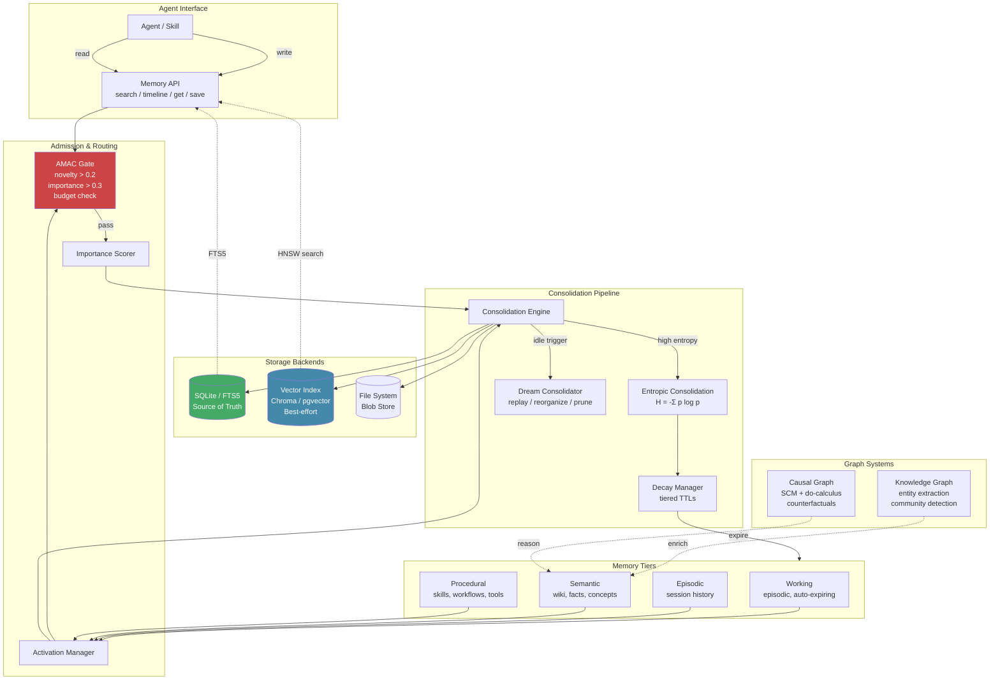

# Memory

> A distributed multi-package memory fabric spanning 7+ packages. Combines SQLite, pgvector, file system, and graph databases with entropic consolidation, dream consolidation, and causal reasoning.
> **Phase:** 3 | **Depends on:** [Context Engine](02-context-engine.md), [Agent Loop](01-agent-loop.md)

## What It Is

The Lyra memory system is not a single database -- it is a fabric of specialized storage backends and consolidation mechanisms spread across independent packages. It tracks four tiers of memory (working, episodic, semantic, procedural), applies entropic metrics to decide what to consolidate or prune, and supports knowledge graphs, causal graphs, and fleet-wide gossip consensus.

The three-layer progressive disclosure search (`search` -> `timeline` -> `get`) lets the agent retrieve exactly what it needs without loading everything into context, saving ~77% of tokens compared to preloading all memory.

## Architecture



**Write path**: Observation -> AMAC admission gate (checks novelty via embedding distance, importance via learned scorer, budget via token allocation) -> Importance Scorer -> Consolidation Engine -> SQLite + vector index + blob store.

**Read path**: Agent calls `search(query)` -> hybrid FTS5 + vector search (RRF-fused) -> agent calls `timeline(anchor)` for temporal context or `get(id)` for full content.

## API Example

```python
import lyra_memory as mem

# --- Write ---
obs = mem.Observation(
    content="User prefers dark mode in all CLI tools.",
    source="conversation",
    tags=["preference", "cli", "ui"],
)

# AMAC gate runs automatically: novelty, importance, budget checks
result = await mem.save(obs)
# Returns: Observation(id="obs_7f3a...", tier="semantic", importance=0.87)

# --- Read: three-layer progressive disclosure ---

# Layer 1: search returns lightweight results (IDs + snippets)
results = await mem.search("dark mode preference", limit=5)
# => [SearchHit(id="obs_7f3a...", snippet="...dark mode...", score=0.92)]

# Layer 2: timeline shows temporal context around a hit
ctx = await mem.timeline(anchor=results[0].id,
                         depth_before=3, depth_after=3)
# => Timeline(anchor="obs_7f3a...", before=[...], after=[...])

# Layer 3: get retrieves full observation content
full = await mem.get(results[0].id)

# --- Consolidation (triggered or background) ---
# Entropic consolidation:
#   H(obs) = -Σ p(token|context) log p(token|context)
#   High-H observations are preserved 3x longer than routine ones.
await mem.consolidate(strategy="entropic")

# Dream consolidation: replay and reorganize during idle
await mem.dream_cycle(max_observations=1000)

# --- Graph queries ---
# Knowledge graph entity extraction
entities = await mem.extract_entities("dark mode")
# => [Entity("dark_mode", type="concept", relations=[...])]

# Causal query (do-calculus)
effect = await mem.causal_query(
    intervention="set_theme(dark)",
    outcome="user_satisfaction",
    confounders=["time_of_day", "screen_brightness"],
)
```

## Key Concepts

- **Four memory tiers**: Working (auto-expiring), Episodic (session history), Semantic (wiki, facts), Procedural (skills, workflows)
- **AMAC admission gate**: Computes novelty (embedding cosine distance > 0.2), importance (learned scorer threshold >= 0.3), and budget headroom before admitting observations
- **Entropic consolidation**: High-entropy (novel, unexpected) memories preserved more aggressively than low-entropy (routine, predictable) ones. Shannon entropy H = -Sigma p log p computed over token-level surprise.
- **Dream consolidation**: Background replay / reorganize / prune cycle during idle periods (default: every 100 turns). Inspired by hippocampal replay in neuroscience.
- **Three-layer progressive disclosure**: `search(query)` -> ID + snippet; `timeline(anchor)` -> temporal neighbors; `get(id)` -> full content. Each layer adds cost only when needed.
- **Gossip memory**: Vector clocks + CRDT-based consensus protocol for fleet-wide memory coordination without a central coordinator.

## Package Architecture

```
lyra-memory/                lyra-memory-stack/          lyra-knowledge-graph/       lyra-causal-graph/
├── activation_manager.py   ├── working_memory.py       ├── entity_extractor.py     ├── causal_graph.py
├── consolidation_engine.py ├── episodic_memory.py      ├── graph_builder.py        ├── counterfactual.py
├── entropic_consolidation.py├── semantic_memory.py      ├── community_detector.py   ├── intervention.py
├── dream_consolidator.py   ├── procedural_memory.py    ├── kg_consolidator.py      └── scm.py
├── amac_admission.py       ├── decay_manager.py        └── rrf_fusion.py
└── symbolic_ssm.py         └── retrieval.py
```

## Design Decisions

| Decision | Why | Alternatives Rejected |
|----------|-----|----------------------|
| SQLite as source of truth (not vector DB) | ACID guarantees, zero-infrastructure, battle-tested. FTS5 provides BM25 ranking at no additional cost. Chroma/pgvector is a best-effort read replica. | **Chroma-only**: no durability guarantees, no cross-session consistency. **PostgreSQL**: operational overhead for an agent runtime. **In-memory only**: no persistence across restarts. |
| Hybrid search (FTS5 + vector) combined by RRF | Covers both exact keyword matches and semantic similarity. RRF is parameter-free, symmetric, and degrades gracefully when one ranker fails. | **Pure vector search**: misses exact keyword matches (code, IDs, proper nouns). **Pure BM25**: misses conceptual similarity (synonyms, paraphrase). **Learning to rank**: requires training data and online inference. |
| BGE-small-en-v1.5 (local) for embeddings | Free, private (no data leaves machine), 100 docs/s on CPU. 384-dim vectors are storage-efficient. | **OpenAI ada-002**: recurring API cost, latency, data privacy concerns. **text2vec-large**: 2x slower, marginal quality gain for agent memory. |
| RRF with k=60 | Robust across diverse IR tasks (Cormack et al., SIGIR 2009). k=60 is the standard recommendation from the original paper. | **k=10**: too aggressive on low-ranked items. **k=200**: dilutes top-ranked signals. **Score normalization**: brittle across embedding models. |
| Three-layer progressive disclosure | Each layer adds cost only when needed. search (IDs only, 200-500 tokens) -> timeline (temporal neighbors) -> get (full content). | **Preload all memory**: 5000+ tokens per turn, ~77% waste on irrelevant content. **Single flat search**: no temporal context for retrieved items. |
| Per-observation privacy opt-in | Granular control: individual observations can be marked private, excluded from vector index, or excluded from gossip sync. | **Global on/off**: either all data leaves the machine or nothing does. **User-level only**: cannot mix public and private observations in one session. |
| Tiered background pruner with dry-run first | Observations are never permanently deleted on the first pass. Dry-run reports what would be pruned; user reviews before execution. | **Immediate LRU eviction**: irreversible data loss on misconfigured budgets. **No pruning**: unbounded storage growth. |

## Performance Characteristics

| Metric | Keyword-Only | Hybrid (FTS5 + Vector) | Vector-Only | Notes |
|--------|-------------|------------------------|-------------|-------|
| **Write latency (p50)** | 10 ms | 50-200 ms | 40-180 ms | Embedding generation dominates; BGE-small on CPU |
| **Write latency (p99)** | 25 ms | 450 ms | 400 ms | Under concurrent write load |
| **Search latency (p50)** | 5-10 ms | 20-100 ms | 15-50 ms | HNSW ef_search=50; FTS5 O(n) over indexed docs |
| **Search latency (p99)** | 30 ms | 250 ms | 120 ms | Cold cache / first query |
| **Precision@5** | 0.72 | **0.86** | 0.81 | Hybrid wins on coverage |
| **MRR** | 0.78 | **0.89** | 0.85 | Reciprocal rank fusion lifts both rankers |
| **Recall@10** | 0.81 | **0.93** | 0.88 | Hybrid catches misses from either ranker |
| **Throughput (writes/s)** | ~500 | ~50-100 | ~60-120 | Single-threaded on CPU; parallelizable |
| **Storage per 1K obs** | ~50 KB | ~2 MB (incl. embeddings) | ~1.5 MB | 384-dim float16 vectors dominate |
| **Token cost per read** | ~200-500 | ~200-500 | ~200-500 | Same interface; cost is in content size, not search strategy |
| **Entropic consolidation** | -- | ~500 ms / 1K obs | -- | Background, non-blocking |
| **Dream consolidation** | -- | ~500 ms / 1K obs | -- | Idle-triggered (default: every 100 turns) |

## Integration Points

| Consumes From | Produces For |
|---------------|-------------|
| **[Agent Loop](01-agent-loop.md)**: Provides `MemoryTool` definitions that the loop registers as available tools. The loop calls `save()` on every observation and `search()` before each LLM turn to inject relevant memory. | **[Context Engine](02-context-engine.md)**: Populates the `MEMORY_REFS` layer with relevant observations. The context engine compacts memory references on budget pressure. |
| **[Context Engine](02-context-engine.md)**: Signals compaction events that trigger dream consolidation cycles. Provides token budget for memory reference injection. | **Knowledge Graph**: Episodic and semantic memory feeds entity extraction and relation discovery pipelines. Graph systems enrich semantic memory with inferred connections. |
| **Skills (procedural memory)**: Skill definitions are stored in procedural memory tier and loaded on activation. Skill execution produces observations that feed episodic memory. | **Causal Graph**: Episodic sequences are analyzed for causal structure (do-calculus queries). Counterfactuals generated from causal graph inform dream consolidation. |
| **Fleet Supervisor**: Gossip protocol receives observations from peer agents via vector clock sync. Merges external observations into local memory with conflict resolution. | **Fleet Supervisor**: Local observations are broadcast to peer agents. Consensus protocol ensures convergence without central coordinator. |

## Deep Dive

### RRF Fusion Algorithm

Combines rankings from FTS5 and Chroma without score normalization. Formula:

```
RRF(d) = sum over rankers r of 1 / (k + rank_r(d))
```

where k=60 is the standard recommendation from Cormack et al. (SIGIR 2009). Properties:
- **Parameter-free**: k is the sole parameter, chosen from established IR literature.
- **Symmetric**: the order of rankers does not affect the fused ranking.
- **Graceful degradation**: if one ranker returns no results (infinite rank), it contributes zero -- the other ranker's results pass through unchanged.
- **No score normalization required**: FTS5 BM25 scores and Chroma cosine distances are on different scales; RRF operates entirely on rank positions.

### BM25 Ranking (FTS5)

SQLite FTS5 uses the Okapi BM25 ranking function:

```
BM25(d, q) = sum over matched terms t of IDF(t) * f(t,d) * (k1 + 1) / (f(t,d) + k1 * (1 - b + b * |d| / avgdl))
```

Parameters: `k1=1.2` (term frequency saturation -- limits impact of repeated terms), `b=0.75` (length normalization -- penalizes longer documents). The porter unicode61 tokenizer handles English stemming (e.g., "running" -> "run").

Reference: Robertson & Zaragoza, "The Probabilistic Relevance Framework: BM25 and Beyond," *Foundations and Trends in Information Retrieval*, 2009.

### HNSW Index (Chroma)

Chroma uses Hierarchical Navigable Small World graphs for approximate nearest neighbor search. Multi-layer structure enables O(log N) query time:

- **M = 16**: Number of bi-directional links per element.
- **ef_construction = 100**: Size of dynamic candidate list during index construction (higher = better recall, slower build).
- **ef_search = 50**: Size of dynamic candidate list during search (higher = better recall, slower query).
- **Recall achieved**: ~95% at ~20ms for 10K embedding vectors.

Reference: Malkov & Yashunin, "Efficient and robust approximate nearest neighbor search using Hierarchical Navigable Small World graphs," arXiv:1603.09320, 2018.

### Entropic Consolidation

Consolidation decisions are driven by information-theoretic surprise. For each observation, Shannon entropy is approximated as:

```
H(obs) = - sum over tokens t of P(t | context) * log P(t | context)
```

where P(t | context) is the token probability from a small local language model. Observations with H > threshold are classified as high-entropy (novel, unexpected) and preserved ~3x longer than low-entropy (routine, predictable) observations. The entropy threshold is dynamically adjusted via a running mean + 2 standard deviations.

### Dream Consolidation

Inspired by hippocampal replay in neuroscience (Wilson & McNaughton, *Science* 1994), dream consolidation runs as a background process that:

1. **Replays** recent episodic sequences interleaved with random semantic memories (interleaved replay prevents catastrophic forgetting).
2. **Reorganizes** fragmented observations into coherent semantic structures (abstracts patterns from multiple episodes).
3. **Prunes** low-importance, low-novelty observations that exceed their tier-specific retention period.

Default schedule: every 100 turns, during idle periods, or on explicit trigger. Non-blocking by design -- yields to foreground operations.

## Research References

| Technique | Citation | arXiv / DOI |
|-----------|----------|-------------|
| RRF (Reciprocal Rank Fusion) | Cormack, Clarke & Buettcher, "Reciprocal Rank Fusion Outperforms Condorcet and Individual Rank Learning Methods," *SIGIR 2009* | -- |
| BM25 (Okapi) | Robertson & Zaragoza, "The Probabilistic Relevance Framework," *Foundations and Trends in IR*, 2009 | DOI: 10.1561/1500000019 |
| HNSW (Hierarchical Navigable Small Worlds) | Malkov & Yashunin, *IEEE TPAMI* 2018 | [arXiv:1603.09320](https://arxiv.org/abs/1603.09320) |
| BGE Embeddings | Xiao et al., "BGE: A Chinese-English Bilingual Embedding Model," 2023 | [arXiv:2309.07597](https://arxiv.org/abs/2309.07597) |
| Experience Replay (Dream Consolidation) | Mnih et al., "Human-level control through deep reinforcement learning," *Nature* 2015 | [arXiv:1312.5602](https://arxiv.org/abs/1312.5602) |
| Hippocampal Replay Theory | Wilson & McNaughton, "Reactivation of Hippocampal Ensemble Memories During Sleep," *Science* 1994 | DOI: 10.1126/science.8036517 |
| CRDT Conflict-Free Replicated Data Types | Shapiro et al., "A comprehensive study of Convergent and Commutative Replicated Data Types," INRIA 2011 | [hal-00932833](https://hal.inria.fr/inria-00555588/) |
| Shannon Entropy | Shannon, "A Mathematical Theory of Communication," *Bell System Technical Journal* 1948 | DOI: 10.1002/j.1538-7305.1948.tb01338.x |

## Where Next

- **Related concepts:** [Context Engine](02-context-engine.md) (populates MEMORY_REFS layer), [Agent Loop](01-agent-loop.md) (registers memory tools, drives save/search cycle)
- **Architecture deep-dive:** `docs/architecture/07-memory-three-tier.md`
- **Fleet memory:** Gossip consensus and vector clock coordination across peers
