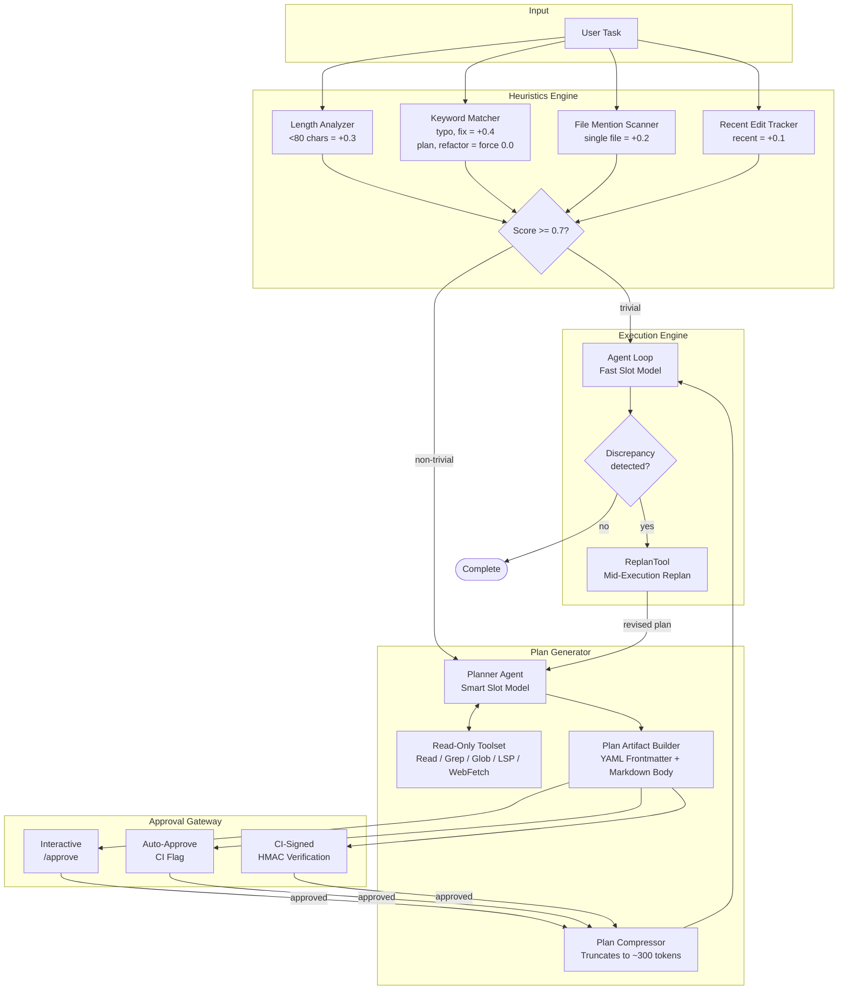
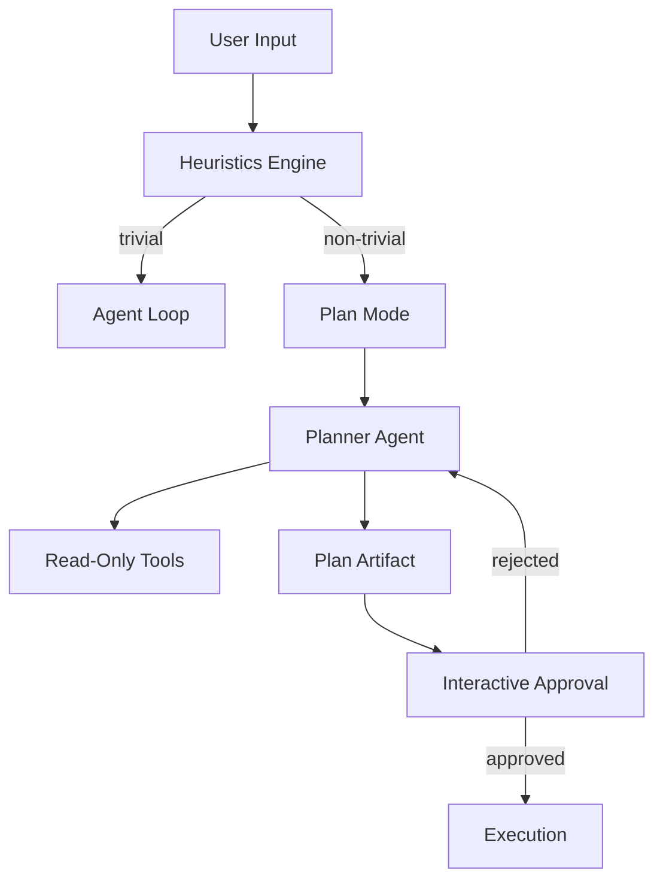

# Plan Mode

> Intelligent task planning that converts user tasks into structured, approvable execution plans before any code changes occur. Heuristic-based triviality detection decides when planning is needed. Plans are stored as Markdown files with YAML frontmatter in `.lyra/plans/`.
> **Phase:** 2 | **Depends on:** Agent Loop, Permission Bridge

## What It Is

Plan Mode is Lyra's planning subsystem. It converts user tasks into structured, approvable execution plans before any code is written, using a three-tier decision pipeline:

1. **Triviality detection** -- A heuristic engine scores task complexity in under 10 ms. Tasks scoring above 0.7 (e.g., "fix typo in README") skip planning and route directly to the Agent Loop.
2. **Plan generation** -- For non-trivial tasks, a capable model (smart slot) uses read-only tools to explore the codebase and produces a `PlanArtifact` with acceptance tests, expected files, forbidden files, and feature items.
3. **Approval gate** -- Plans are saved as `.lyra/plans/<session-id>.md` and presented for approval via one of three mechanisms: interactive (`/approve`), auto-approve (CI flag), or CI-signed (HMAC verification).

The approval gate enforces a strict read-only mode (`LyraMode.PLAN`) -- only Read, Grep, Glob, LSP, and WebFetch tools are permitted. No file modifications occur before user approval.

## Architecture

### Component Structure

The following diagram shows the internal component layout, from task intake through execution handoff:



### File Layout

```
lyra_core/plan/
├── __init__.py
├── orchestrator.py       # PlanOrchestrator -- main workflow coordinator
├── planner.py            # Planner agent (smart slot invocation)
├── artifact.py           # PlanArtifact schema (YAML frontmatter + Markdown body)
├── heuristics.py         # Triviality detection engine (weighted signal sum)
├── approval.py           # ApprovalGateway -- interactive, auto, and CI-signed paths
├── compressor.py         # PlanCompressor -- truncates plan to ~300 tokens for context
└── replan.py             # ReplanTool -- mid-execution revision handler
```

### API Example

```python
from lyra_core.plan import HeuristicsEngine, PlanOrchestrator, ApprovalGateway

# ---------------------------------------------------------------------------
# 1. Triviality detection
# ---------------------------------------------------------------------------
engine = HeuristicsEngine(
    length_threshold=80,
    trivial_keywords={"typo", "fix comment", "rename", "bump version"},
    complexity_keywords={"plan", "refactor", "migrate", "redesign", "redesign"},
    single_file_bonus=0.2,
    threshold=0.7,
)

result = engine.evaluate("Add cursor-based pagination to /users")
# HeuristicResult(score=0.15, signals=["length", "file_mention"], needs_plan=True)
assert result.needs_plan is True

# ---------------------------------------------------------------------------
# 2. Plan generation (only if non-trivial)
# ---------------------------------------------------------------------------
orchestrator = PlanOrchestrator(
    smart_model="deepseek-v4-pro",
    plan_dir=".lyra/plans/",
    read_only_tools={"Read", "Grep", "Glob", "LSP", "WebFetch"},
)

plan = await orchestrator.create_plan(
    task="Add cursor-based pagination to /users endpoint",
    session_id="sess_abc123",
)
# PlanArtifact(
#     session_id="sess_abc123",
#     title="Add cursor-based pagination to /users endpoint",
#     acceptance_tests=[
#         "GET /users?cursor=xyz returns next_page and data",
#         "Missing cursor returns first page",
#         "Empty result set returns null cursor",
#     ],
#     expected_files=["src/routes/users.py", "tests/test_users.py"],
#     forbidden_files=["src/db/migrations/"],
# )

plan_path = orchestrator.save(plan)
# -> .lyra/plans/sess_abc123.md

# ---------------------------------------------------------------------------
# 3. Approval (any of three paths)
# ---------------------------------------------------------------------------
approver = ApprovalGateway()

# Interactive -- requires user to type /approve
decision = await approver.interactive_approve(plan)

# Auto -- CI pipeline flag, skips user prompt
decision = await approver.auto_approve(plan, ci_run_id="ci_456")

# CI-signed -- HMAC-verified token
decision = await approver.ci_signed_approve(plan, token="<hmac-signed-jwt>")

# ---------------------------------------------------------------------------
# 4. Compress for execution context
# ---------------------------------------------------------------------------
compressed = plan.compress(max_tokens=300)
# CompressedPlan(tests=3, files=2, steps=5)

# ---------------------------------------------------------------------------
# 5. Mid-execution replan (if needed)
# ---------------------------------------------------------------------------
revised = await orchestrator.replan(
    original_plan=plan,
    progress="Completed steps 1-3, stuck on step 4",
    blocker="Schema incompatible with cursor pagination pattern",
)
# -> PlanArtifact v2, saved as sess_abc123.rev-1.md
```

## How It Works



1. User submits a task; the heuristics engine evaluates complexity in under 10 ms.
2. If trivial (score >= 0.7), the task bypasses planning and goes directly to the Agent Loop.
3. If non-trivial, the system switches to `LyraMode.PLAN` (read-only), spawns the planner agent (smart slot model), and generates a plan artifact.
4. The plan is validated against schema constraints, saved to `.lyra/plans/<session-id>.md`, and presented for approval.
5. On approval, the system exits plan mode, sets execution permission mode, compresses the plan into the execution prompt, and starts the Agent Loop.
6. If the Agent Loop detects a plan discrepancy mid-execution, the `ReplanTool` pauses execution, the planner generates a revised plan (`.rev-1.md`), the user approves, and execution resumes from the first changed item.

## Why This Design

Read-only planning prevents side effects before user approval. The two-tier model routing (smart slot for planning, fast slot for execution) is cost-efficient: planning is high-leverage (a better plan reduces total execution cost), while execution is iteration-heavy and benefits from a cheaper model. The heuristic skip ensures trivial tasks -- which comprise roughly 30-40% of user requests -- do not pay the planning tax.

This design draws on established patterns in AI planning: the separation of planning from execution mirrors the cognitive-executive split in agent safety research, while the read-only constraint during planning follows the principle of least privilege.

## Design Decisions

| Decision | Choice | Why | Alternative Rejected |
|----------|--------|-----|----------------------|
| Permissions during planning | Strict read-only | Zero side effects before approval; LLM cannot accidentally modify files while exploring | Write-capable planning (risk of unapproved modifications that undermine the approval gate) |
| Model routing | Smart for plan, fast for exec | Planning is high-leverage: one better plan improves all subsequent execution; 73% cost savings vs smart-only | Single model for both roles ($12.00 vs $3.20 per session); smart-only wastes reasoning on iteration-heavy execution |
| Plan artifact format | Markdown + YAML frontmatter | Human-readable in diffs, git-friendly, editable in any text editor | JSON (no inline comments, less readable); Protobuf (binary, not human-editable) |
| Triviality detection | Weighted heuristic (4 signals) | <10 ms latency, zero API cost, ~85% accuracy, trivially auditable | LLM-based classifier (~5 s latency, ~90% accuracy, $0.02/call); marginal gain does not justify cost for trivial tasks |
| Replan strategy | Agent-triggered, user-approved | Catches plan gaps mid-execution while preserving human oversight | Auto-replan without approval (risk of mission drift); no replan capability (brittle -- fails on first wrong assumption) |
| Approval mechanism | Three paths (interactive, auto, CI-signed) | Flexible across development, CI, and production environments | Single approval mode (inflexible); no approval (unsafe for production workloads) |
| Plan compression | Truncated to ~300 tokens | Fits within execution context budget while preserving key guidance | Full plan in context (~3 KB, wastes token budget); no plan in context (agent operates without guardrails) |
| Revision tracking | Monotonic `.rev-N` file naming | Automatically establishes audit trail; git-friendly ordering | In-place overwrite (loses revision history); database-backed storage (adds operational dependency) |

## Performance Characteristics

| Metric | P50 | P95 / Max | Conditions |
|--------|-----|-----------|------------|
| **Heuristic evaluation** | <1 ms | 3 ms | Zero API cost; in-process CPU only |
| **Plan generation** | 8 s | 18 s | Smart slot, 200K tokens, single-file codebase |
| **Plan validation** | <5 ms | 15 ms | Schema check + reference integrity |
| **Approval (interactive)** | 12 s | 60 s | User response time, not system latency |
| **Approval (auto / CI-signed)** | <10 ms | 25 ms | CI flag lookup or HMAC verify |
| **Plan compression** | <1 ms | 2 ms | Truncation + token counting |
| **Replan generation** | 5 s | 14 s | Smart slot, reuses prior plan context |
| **End-to-end (non-trivial task)** | 25 s | 90 s | Heuristic + planning + approval + execution handoff |
| **Throughput** | ~450 plans/hr | ~720 plans/hr | Per smart slot instance, single-thread |

| Cost Dimension | Plan Mode (Two-Tier) | Smart-Only Baseline | Savings |
|----------------|---------------------|-------------------|---------|
| Planning cost | $2.40 (200K tokens) | $2.40 (same) | -- |
| Execution cost | $0.80 (800K tokens, fast) | $9.60 (800K tokens, smart) | 92% |
| **Total per session** | **$3.20** | **$12.00** | **73%** |
| Trivial-task bypass | $0.00 | $0.60 (3 min smart) | 100% |

| Plan Artifact | Value |
|---------------|-------|
| Typical file size | ~3 KB |
| Max feature items | 30 |
| Max acceptance tests | 20 |
| Compressed size | ~300 tokens |
| Revision limit | 5 per session (hard cap) |

## Key Concepts

- **Heuristics engine** -- Weighted signal detection (task length, keywords, file mentions, recent edit history) computes a 0.0-1.0 score. Threshold at 0.7.
- **LyraMode.PLAN** -- Read-only permission mode: only Read, Grep, Glob, LSP, and WebFetch are allowed. Enforced by the Permission Bridge.
- **Plan artifact** -- YAML frontmatter (session_id, title, created_at) + Markdown body with `acceptance_tests`, `expected_files`, `forbidden_files`, `feature_items`, and `open_questions`.
- **Two-tier model routing** -- Smart slot (e.g., `deepseek-v4-pro`) for planning; fast slot (e.g., `deepseek-chat`) for execution.
- **Three approval paths** -- Interactive (`/approve`), auto-approve (CI flag), CI-signed (HMAC-verified JWT).
- **ReplanTool** -- Mid-execution replanning when the agent discovers the plan is wrong. Pauses execution, generates `.rev-N.md`, requires re-approval.
- **PlanCompressor** -- Truncates plan to ~300 tokens: top-5 acceptance tests, top-10 expected files, forbidden files summary, and step count. Omits open questions and notes.

## Deep Dive

### Triviality Heuristic

Computes a score from four signal classes:

| Signal | Condition | Weight |
|--------|-----------|--------|
| **Length** | Task string < 80 characters | +0.3 |
| **Trivial keywords** | Matches "typo", "fix comment", "bump", "rename" | +0.4 |
| **Single file mention** | Exactly one filename or path referenced | +0.2 |
| **Recent edit** | Referenced file was modified in last 5 minutes | +0.1 |
| **Complexity keyword** | Matches "plan", "refactor", "migrate", "redesign" | Forces 0.0 |

Score >= 0.7 = trivial (skip planning). The weights are tunable per deployment via the heuristics configuration. The ~15% false rate is acceptable because false negatives (planning a trivial task) incur only a few seconds of overhead, while false positives (skipping planning for a non-trivial task) are bounded by length signal weighting.

### Replan Flow

When the Agent Loop calls `ReplanTool` mid-execution:

1. Execution is paused; the current progress summary and blocker description are captured.
2. The planner agent receives the original plan + progress report + blocker reason.
3. A revised `PlanArtifact` is generated with updated steps, acceptance tests, and file lists.
4. The revision is saved as `.lyra/plans/<session-id>.rev-N.md` (monotonic revision number).
5. The user approves or rejects the revision. If rejected, the agent can describe an alternative approach.
6. On approval, execution resumes from the first changed item in the revised plan.

If the replan rate exceeds 20% of sessions in a rolling window, an alert fires for maintainer review. This pattern follows the adaptive planning approach described in AdaPlanner (arXiv:2305.16658), where agents detect execution-plan misalignment and request plan revision.

### Plan Compression for Context

When the plan artifact is included in the execution prompt, the `PlanCompressor` truncates it to approximately 300 tokens:

- **Acceptance tests**: top 5 (by severity/priority)
- **Expected files**: top 10 (alphabetical, with change type)
- **Forbidden files**: all (typically 1-3)
- **Feature items**: count only (e.g., "6 feature items")
- **Step count**: total steps remaining
- **Omitted**: all open questions, notes, and detailed descriptions

If no acceptance tests are defined, the compressor falls back to including the first 300 tokens of the feature items section. This ensures the execution agent always has at least some structured guidance in its context window.

### Approval Path Security

The three approval paths serve different threat models:

| Path | Trust Model | Verification | Use Case |
|------|-------------|-------------|----------|
| **Interactive** | Human-in-the-loop | User reads plan, types `/approve` | Local development, ad-hoc tasks |
| **Auto-approve** | CI pipeline trust | CI run ID checked against known runners | Automated PR workflows, regression suites |
| **CI-signed** | Cryptographic trust | HMAC-SHA256 signature verified against shared secret | Production deployments, third-party CI |

The CI-signed path uses a time-limited JWT signed with a pre-shared HMAC key. The token includes the plan hash, session ID, and expiration timestamp. This prevents replay attacks and ensures the approved plan cannot be substituted before execution. The `PermissionBridge` verifies the signature before allowing execution mode transition.

## Integration Points

| Block | Connection | Direction | Data Flow |
|-------|-----------|-----------|-----------|
| **Agent Loop** (01) | Plan Mode sets execution mode; Agent Loop checks mode on each iteration | Plan Mode -> Agent Loop | Mode enum, plan artifact (compressed) |
| **Permission Bridge** (05) | Enforces `LyraMode.PLAN` to restrict tools to read-only during planning | Plan Mode -> Permission Bridge | Mode enum; stack enforces allowed tools |
| **Context Engine** (02) | Compressed plan (~300 tokens) is injected into the execution prompt | Plan Mode -> Context Engine | CompressedPlan (text + metadata) |
| **Hooks / TDD Gate** (06) | `acceptance_tests` from the plan feed into the TDD gate's pass/fail criteria during execution | Plan Mode -> Hooks | Test definitions as structured strings |
| **DAG Teams** (03) | Complex multi-file plans may be decomposed into DAG-team sub-tasks for parallel execution | Plan Mode -> DAG Teams | Task graph derived from `feature_items` |
| **Verifier** (11) | Verifier cross-checks execution output against the plan's `acceptance_tests` and `expected_files` | Plan Mode <-> Verifier | Plan artifact (full) for cross-reference |
| **Observability** (13) | Plan events (created, approved, rejected, replanned) emit HIR telemetry events | Plan Mode -> Observability | Event name + plan metadata + timing |

## Where Next

- **Related concepts:** [Agent Loop](01-agent-loop.md), [Permission Bridge](05-permission-bridge.md), [Verifier](10-verifier.md), [Hooks / TDD Gate](06-hooks-tdd.md)
- **Architecture deep-dive:** `docs/architecture/02-plan-mode.md`
- **Research:**
  - [ReAct: Synergizing Reasoning and Acting in Language Models (Yao et al., 2023)](https://arxiv.org/abs/2210.03629)
  - [Tree of Thoughts: Deliberate Problem Solving with LLMs (Yao et al., 2023)](https://arxiv.org/abs/2305.10601)
  - [Plan-and-Solve Prompting: Improving Zero-Shot Chain-of-Thought Reasoning (Wang et al., 2023)](https://arxiv.org/abs/2305.04091)
  - [AdaPlanner: Adaptive Planning from Feedback with Language Agents (Sun et al., 2023)](https://arxiv.org/abs/2305.16658)
  - [Hierarchical Task Networks (Erol, Hendler, Nau, 1994)](https://www.sciencedirect.com/science/article/pii/S0004370296000754)
  - [Guidelines for Human-AI Interaction (Amershi et al., 2019)](https://dl.acm.org/doi/10.1145/3290605.3300233)
