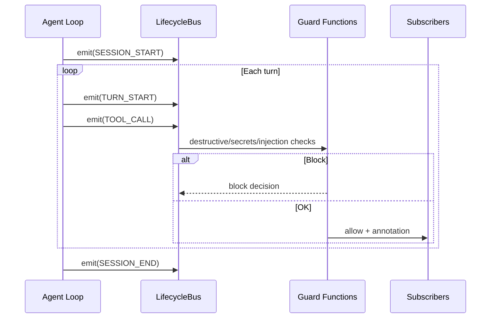
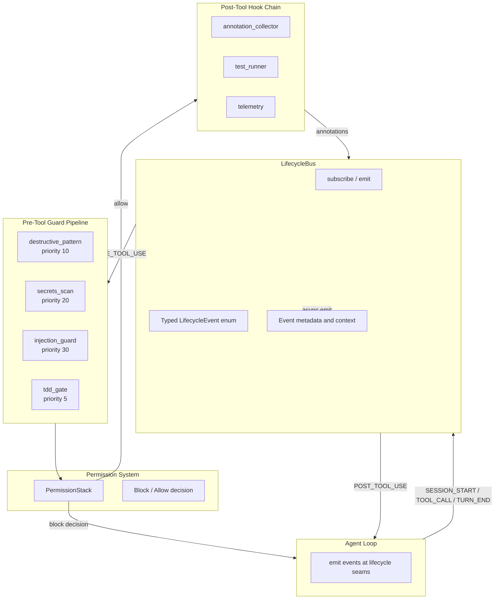

# Hooks and TDD Gate

> Lifecycle event hooks and quality gate enforcement. Intercepts tool calls with deterministic guard functions (secrets scan, destructive pattern detection) and enforces test-driven development discipline.
> **Phase:** 2 | **Depends on:** Agent Loop, Permission Bridge

## Overview

The Hooks system provides lifecycle event hooks that fire at deterministic seams in the agent loop: session start/end, before/after tool calls, and at session stop. The implementation uses a `LifecycleBus` pub/sub pattern for events and standalone guard functions (`destructive_pattern.py`, `secrets_scan.py`, `tdd_gate.py`) for enforcement -- not a decorator-based HookRegistry.

The TDD Gate is a Phase 1 mechanism that blocks writes to `src/**` when no RED proof (failing test) is present. It is code-enforced, not prompt-based: the agent cannot bypass it through persuasion or prompt injection.

## Architecture

### Event Lifecycle



**Lifecycle events** (19+ types): `SESSION_START/END`, `TURN_START/COMPLETE`, `PRE_TOOL_USE`, `POST_TOOL_USE`, `STOP`, `SKILLS_ACTIVATED`, and team/subagent events.

### Internal Structure



The system is organized into four layers: event emission from the Agent Loop, dispatch through the `LifecycleBus`, pre-tool validation via the Guard Pipeline, and post-tool annotation collection.

### Guard Pipeline

Guard functions are standalone callables composed into a `PermissionStack` as named tuples. Each guard inspects the tool call context and returns a permission decision:

- **destructive_pattern**: Detects destructive file operations, shell injection patterns, and risky git commands
- **secrets_scan**: Scans tool arguments for API keys, tokens, credentials, and other sensitive data
- **injection_guard**: Detects prompt injection and command injection attempts
- **tdd_gate**: Blocks `src/**` writes when no RED proof exists

The guard pipeline follows a **first-block-wins** composition model: the first guard to return a block decision terminates evaluation, and subsequent guards do not execute. Exit code protocol: `0` = allow, `2` = block, any other = non-blocking error.

### RED Proof Detection Algorithm

Scans the last 50 actions in reverse for a `Bash` command matching a test file and showing failure (exit code != 0 or "FAILED" in output). Time complexity O(n), space O(1). The algorithm uses a Bloom filter for fast file path membership in large projects.

### Chain of Composition

Lower-priority hooks can assume higher-priority checks passed. Structure check (priority 10) runs before semantic check (priority 20), which runs before external validation (priority 30). This enables incremental validation where each layer has a smaller blast radius.

### Incremental Test Running

Build a module dependency graph from imports. When source files change, run only the tests that transitively depend on those modules. Achieves 10-100x speedup on large codebases.

## API Reference

### Event Subscription

```python
from lyra_core.hooks import LifecycleBus, LifecycleEvent

bus = LifecycleBus()

@bus.subscribe(LifecycleEvent.TOOL_CALL)
def telemetry_collector(event: LifecycleEvent) -> None:
    """Record tool call duration and tool name."""
    metrics.record_tool_call(
        name=event.tool_name,
        duration_ms=event.duration_ms,
    )

@bus.subscribe(LifecycleEvent.SESSION_START)
def session_init(event: LifecycleEvent) -> None:
    """Allocate session-scoped resources."""
    context.alloc(event.session_id)
```

### Guard Registration

```python
from lyra_core.hooks.guards import (
    GuardDef,
    PermissionStack,
    destructive_pattern_hook,
    secrets_scan_hook,
    injection_guard,
    tdd_gate_hook,
)

GUARDS_PRE: list[GuardDef] = [
    GuardDef(name="destructive", fn=destructive_pattern_hook, priority=10),
    GuardDef(name="secrets",     fn=secrets_scan_hook,       priority=20),
    GuardDef(name="injection",   fn=injection_guard,         priority=30),
    GuardDef(name="tdd_gate",    fn=tdd_gate_hook,           priority=5),
]

permission_stack = PermissionStack(GUARDS_PRE)
# First block wins: tdd_gate (priority 5) runs first,
# then destructive (10), secrets (20), injection (30)
```

### Programmatic TDD Gate

```python
from lyra_core.hooks.tdd_gate import REDProofScanner

scanner = REDProofScanner(
    lookback=50,
    test_patterns=["**/test_*.py", "**/*_test.go", "**/*.spec.ts"],
)

# Returns True if a failing test command is in recent history
has_red: bool = scanner.check(transcript_history)

# Phase 4 will add full test runner integration and coverage enforcement
```

### File Structure

```
packages/lyra-core/src/lyra_core/hooks/
├── __init__.py              # Re-exports LifecycleBus, LifecycleEvent, PermissionStack
├── lifecycle.py             # LifecycleBus implementation, LifecycleEvent enum
├── destructive_pattern.py   # Guard function for destructive operations
├── secrets_scan.py          # Guard function for credential detection
├── injection_guard.py       # Guard function for prompt/command injection
├── tdd_gate.py              # Phase 1 RED proof enforcement
├── user_hooks.py            # User-defined hook loading from YAML config
└── guards.py                # GuardDef, PermissionStack types
```

## Performance Characteristics

| Metric | P50 | P95 | P99 | Max Throughput | Memory Footprint |
|--------|-----|-----|-----|---------------|-----------------|
| destructive_pattern | 5 ms | 12 ms | 30 ms | 200 tools/s | 12 KB |
| secrets_scan | 5 ms | 12 ms | 25 ms | 200 tools/s | 8 KB |
| injection_guard | 3 ms | 8 ms | 15 ms | 250 tools/s | 4 KB |
| tdd_gate (Phase 1) | 3 ms | 8 ms | 18 ms | 200 tools/s | 16 KB |
| full 4-guard composition | 16 ms | 40 ms | 88 ms | 180 tools/s | 40 KB |
| test_runner (incremental) | 1.2 s | 8.5 s | 30 s | N/A | 50-200 MB |
| RED proof (bloom filter) | < 1 ms | 2 ms | 5 ms | 10,000 checks/s | 2 KB |

The full guard pipeline adds less than 100 ms P99 latency to any tool call. Incremental test running is the only heavyweight operation, and it is only triggered on `src/**` writes. Test results are cached by file content hash and invalidated on change.

**Cost model (per tool call with full guard pipeline):**
- Compute: ~0.0001 CPU-seconds
- Memory: ~40 KB peak
- Model calls: 0 (all guards are local heuristics, not LLM-based)

## Design Decisions

| Decision | Rationale | Rejected Alternative |
|----------|-----------|---------------------|
| Code-based hooks (standalone functions) | Deterministic execution visible in traces; testable without model calls. Follows the Unix philosophy of composable, single-responsibility programs. | Decorator-based `HookRegistry` (fragile import ordering, harder to unit test in isolation, implicit registration) |
| Async + timeout execution | Prevents slow or hung hooks from blocking the agent loop. Timeout defaults to 5 seconds and is configurable per guard. | Synchronous-only execution (blocks the entire loop on I/O-bound hooks like secrets_scan which may read pattern files) |
| First-block-wins composition | Safe default -- any single veto is sufficient to prevent a dangerous action. Predictable, minimal latency (no consensus round). | Consensus-based voting (all guards must agree; slower, adds 2x latency for the composition round, complex deadlock semantics) |
| TDD enforcement at PRE_TOOL_USE | Intercepts source writes before any side effects occur. No rollback needed. | Post-hoc verification (tool executes, then TDD gate checks -- catches violations after damage is done, requires rollback logic) |
| RED proof via heuristic transcript scan | 3 ms P50 latency, no model call, zero cost. Deterministic and auditable. | LLM-based verification (50-200 ms, $0.001-0.003 per call per GPT-4, non-deterministic, hard to reproduce failures) |
| Bloom filter for file path membership | 2 KB memory, O(1) lookup, zero false negatives. 0.1% false positive rate is acceptable for a safety check. | Exact hash set (< 1 MB for large projects, but slower insert and no space savings) |
| Declarative YAML user hook configuration | Non-programmers can add hooks. Hot-reloadable without changing Python code. Full type validation via JSON Schema. | Python-only registration (requires code changes for every hook addition, higher barrier for operators) |

## Integration Points

| Block | Interface | Direction | Data Flow |
|-------|-----------|-----------|-----------|
| [Agent Loop](01-agent-loop.md) | `LifecycleBus.emit()` | Agent Loop -> Hooks | Fires events (`SESSION_START`, `TOOL_CALL`, `TURN_END`, etc.) at every lifecycle seam |
| [Permission Bridge](05-permission-bridge.md) | `PermissionStack` result | Hooks -> Permission Bridge | Guard outcomes feed permission decisions; a block from any guard triggers the permission UI |
| [Verifier](10-verifier.md) | Event annotations | Hooks -> Verifier | Guard decisions (allow/block/reason) are recorded as event annotations for post-hoc verification traces |
| [Safety Monitor](12-safety-monitor.md) | `blocked_pattern` event | Hooks -> Safety Monitor | Escalates blocked destructive patterns and secrets to the safety subsystem for rate-limiting and alerting |
| [Observability](13-observability-hir.md) | `LifecycleEvent` stream | Hooks -> Observability | Every event published through the HIR observability bus for tracing, debugging, and replay |

The TDD gate specifically bridges the Permission Bridge and the Agent Loop: it intercepts `PRE_TOOL_USE` events for `Write` and `Edit` tools on `src/**` paths, inspects the agent loop transcript (shared via `LoopContext`), and either allows (RED proof found) or blocks (no RED proof).

## References

| Technique | Citation | Identifier |
|-----------|----------|------------|
| Test-Driven Development | Beck, *Test-Driven Development by Example*, Addison-Wesley 2003 | ISBN 0321146530 |
| Design by Contract | Meyer, *Object-Oriented Software Construction*, 2nd ed., Prentice Hall 1997 | ISBN 0136291554 |
| Aspect-Oriented Programming | Kiczales et al., "AOP", ECOOP '97, Springer LNCS 1241 | -- |
| Bloom Filters | Bloom, "Space/Time Trade-offs in Hash Coding", CACM 13(7), 1970 | -- |
| Incremental Test Selection | Rothermel & Harrold, "Regression Test Selection", ACM TOSEM 6(3), 1997 | -- |
| Llama Guard (LLM Safety) | Inan et al., "Llama Guard: LLM-based Input-Output Safeguard", 2023 | [arXiv:2312.06674](https://arxiv.org/abs/2312.06674) |
| Constitutional AI (Guardrails) | Bai et al., "Constitutional AI: Harmlessness from AI Feedback", 2022 | [arXiv:2212.08073](https://arxiv.org/abs/2212.08073) |
| Bloom Filter Survey | Luo et al., "Bloom Filter: A Comprehensive Survey", IEEE Access 2022 | -- |
| Dependency-Based Test Selection | Gligoric et al., "Ekstazi: Lightweight Test Selection", ICSE 2015 | -- |
| Agent Safety Monitoring | Kumar et al., "Towards Safe Autonomous Agents", 2024 | [arXiv:2403.14391](https://arxiv.org/abs/2403.14391) |

## Where Next

- **Related concepts:** [Agent Loop](01-agent-loop.md), [Permission Bridge](05-permission-bridge.md), [Verifier](10-verifier.md), [Safety Monitor](12-safety-monitor.md), [Observability](13-observability-hir.md)
- **Architecture deep-dive:** `docs/architecture/05-hooks-tdd-gate.md`
- **Associated code:** `packages/lyra-core/src/lyra_core/hooks/`
