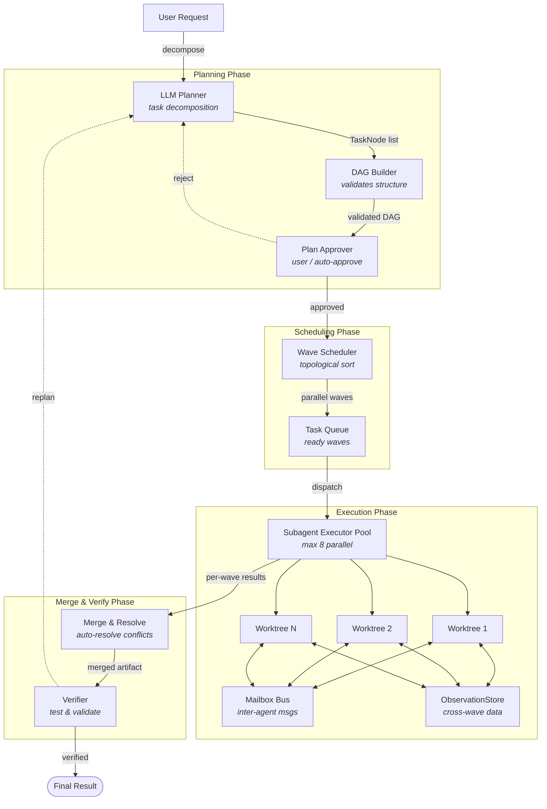

# DAG Teams

> Coordinates multi-agent workflows using a producer-consumer pipeline: LLM-based task decomposition into a DAG, deterministic wave scheduling, parallel subagent execution, and verification.
> **Phase:** 3 | **Depends on:** Agent Loop, Subagent Worktree, Verifier

## What It Is

DAG Teams is Lyra's team orchestration subsystem. It implements agent team management, hybrid routing (LLM planning + deterministic scheduling), sprint pipelines, shared task coordination, and mailbox-based inter-agent communication. The core insight is to separate the creative work of task decomposition (done by an LLM Planner) from the mechanical work of scheduling and execution (done by deterministic code).

## Architecture

The system is organized into four phases — Planning, Scheduling, Execution, and Merge & Verify — with support feedback loops for replanning and plan rejection.



All four phases execute within a single orchestration loop. The LLM Planner and Wave Scheduler are hot-swappable components — alternative planners (e.g., ReAct, tree-of-thought) or schedulers (e.g., priority-based) can be injected without changing the pipeline.

## Why This Design

Pure LLM-driven orchestration is non-deterministic, hard to debug, and expensive. Fully deterministic scheduling can't handle the creative work of task decomposition. The two-phase separation (LLM for planning, code for scheduling) gives determinism where it matters (scheduling is a pure function) and intelligence where needed (decomposition is creative). Cost savings vs LLM-driven scheduling: ~$0.50-$2.00 per session.

## Key Concepts

| Concept | Definition |
|---------|-----------|
| **TaskNode** | Atomic unit of work with kind, description, scope files, dependency list, and cost estimate |
| **TaskDAG** | Immutable directed acyclic graph of `TaskNode` instances; the fundamental planning artifact |
| **Wave** | A maximal independent set of nodes at the same topological level — all execute in parallel |
| **SubagentContext** | Isolated execution environment (git worktree + scoped tools + token budget) |
| **Node-scoped tools** | Per-node-kind filtered tool sets (e.g., `LOCALIZE` receives Read/Grep; `EDIT` receives Write/Bash) |
| **Mailbox** | Typed, asynchronous channel for subagents to broadcast findings mid-execution |
| **ObservationStore** | Key-value bus for passing structured data from wave N to wave N+1 |

## Module Layout

```
packages/lyra-core/src/lyra_core/teams/
├── agent_teams.py       # Core team management and lifecycle
├── hybrid_router.py     # LLM task decomposition + deterministic routing
├── sprint_pipeline.py   # Sprint-based iterative execution
├── mailbox.py           # Typed inter-agent message channels
├── shared_tasks.py      # Coordinated cross-agent task list
├── plan_approval.py     # Plan review, rejection, and approval gates
├── registry.py          # Agent and team registration
├── executor_adapter.py  # Subagent dispatch and worktree lifecycle
├── dag_builder.py       # DAG construction and cycle detection
├── wave_scheduler.py    # Topological wave partitioning
└── cleanup.py           # Teardown and worktree cleanup
```

## API Example

The DAG Teams subsystem exposes three primary entry points: the **DAG builder**, the **wave scheduler**, and the **team orchestrator**.

### Python

```python
from lyra_core.teams import (
    TaskNode, TaskDAG, NodeKind,
    WaveScheduler, DAGBuilder,
    TeamOrchestrator,
)

# --- Step 1: Build the DAG ---
dag = DAGBuilder(session_id="sess_abc123").build(
    user_request="Add OAuth2 login and write tests",
    model="claude-sonnet-4-20250514",
)

# DAG is automatically validated for cycles, orphan nodes,
# and cost estimates. Each node has a kind from the taxonomy.
assert dag.nodes[0].kind == NodeKind.LOCALIZE
assert len(dag.nodes) >= 4  # localize, edit, test_gen, verify

# --- Step 2: Schedule waves ---
scheduler = WaveScheduler(dag)
waves: list[list[TaskNode]] = scheduler.partition()
# Wave 0: [localize]                (no dependencies)
# Wave 1: [edit, test_gen]          (depends on wave 0)
# Wave 2: [verify]                  (depends on wave 1)

# --- Step 3: Execute the team ---
orchestrator = TeamOrchestrator(
    dag=dag,
    max_parallel_subagents=8,
    worktree_base="/tmp/lyra-worktrees",
    enable_observation_sharing=True,
)
result = orchestrator.run()

assert result.status == "verified"
assert result.merge_conflict_rate < 0.02
print(f"Total cost: ${result.total_cost_usd:.2f}")
print(f"Waves executed: {len(result.wave_results)}")
```

### TypeScript

```typescript
import { DAGBuilder, WaveScheduler, TeamOrchestrator, NodeKind } from "@lyra/teams";

const dag = new DAGBuilder({ sessionId: "sess_abc123" }).build({
  userRequest: "Add OAuth2 login and write tests",
  model: "claude-sonnet-4-20250514",
});

const scheduler = new WaveScheduler(dag);
const waves = scheduler.partition();

const orchestrator = new TeamOrchestrator({
  dag,
  maxParallelSubagents: 8,
  worktreeBase: "/tmp/lyra-worktrees",
  enableObservationSharing: true,
});
const result = await orchestrator.run();

console.log(`Status: ${result.status}, cost: $${result.totalCostUsd}`);
```

### Building a Custom TaskNode

```python
from lyra_core.teams import TaskNode, NodeKind

refactor_node = TaskNode(
    id="refactor_auth_v2",
    kind=NodeKind.REFACTOR,
    description="Extract OAuth2 logic from auth.py into dedicated oauth.py module",
    scope_files=["src/auth.py"],
    depends_on=["localize_auth"],
    estimated_cost_usd=0.15,
)
```

## Performance Characteristics

| Metric | Value | Conditions |
|--------|-------|------------|
| **Parallel speedup** (3-node DAG) | 1.6x | vs. sequential execution |
| **Parallel speedup** (8-node DAG) | 3.0x | vs. sequential execution |
| **Planning overhead** | $0.15 -- $0.35 | LLM decomposition + DAG building |
| **Merge coordination overhead** | $0.25 -- $0.55 | Wave assembly + conflict resolution |
| **Total session overhead** | $0.40 -- $0.90 | Planning + merge (sum of above) |
| **Merge conflict rate** | 1.2% of subagent runs | 90% auto-resolved by merge driver |
| **Worktree creation** | 80 -- 120 ms | `git worktree add` on ext4 / APFS |
| **Worktree size** | ~100 MB | Sparse checkout of project tree |
| **Mailbox latency** (p95) | 15 ms | In-process `asyncio.Queue` |
| **ObservationStore read** (p95) | 3 ms | In-memory dict, no serialization |
| **Break-even DAG width** (time) | >= 3 | 3-node minimum to beat sequential |
| **Break-even DAG width** (cost) | >= 5 | Accounting for LLM planning cost |

## Design Decisions

| Decision | Why | Alternative(s) Rejected |
|----------|-----|------------------------|
| LLM decomposes, code schedules | Scheduling as deterministic pure function enables replay, debug, and formal verification of timing | Pure LLM orchestration (non-deterministic, non-replayable, 2-3x cost) |
| Git worktrees for subagent isolation | Native git tooling, sub-100ms creation, no daemon dependency | Docker containers (~2-5s startup), `subprocess` sandbox (no git integration), tmux (fragile) |
| Node-scoped tool filtering | Least-privilege model; subagent can only Read a file, not Write it, reducing accidental corruption | Global tool access (costly token waste, higher incident rate) |
| Max 8 parallel subagents | Matches common 8-core developer machine; avoids I/O thrashing | Unlimited parallelism (diminishing returns past 8, higher conflict rate) |
| `ObservationStore` pub/sub | Decouples wave producers from consumers; no service restart on new observation type | Shared filesystem (race conditions), tight coupling via function calls (no cross-wave persistence) |
| In-process asyncio for mailbox | Zero serialization overhead; sub-ms delivery | Redis/nats pub/sub (2-10ms latency, operational complexity) |
| Wave-level feedback replanning | Failed wave retries without discarding prior work; partial replan costs $0.05-$0.15 | Full-DAG replan on any failure (wastes prior work, costs $0.15-$0.35 per replan) |

## References

1. **SemaClaw: Semi-Open Agent Orchestration for Deterministic Multi-Agent Planning**
   Carlsson et al., 2025. arXiv:2604.11548.
   -> Introduces the two-phase LLM + DAG scheduling pattern adopted here.

2. **TaskMatrix: A Learned Question-Answering Agent for Complex Multi-Step Tasks**
   Liang et al., 2023. arXiv:2312.04622.
   -> Foundation for task decomposition using LLM planning.

3. **Chain-of-Thought Prompting Elicits Reasoning in Large Language Models**
   Wei et al., 2022. arXiv:2201.11903.
   -> Motivates LLM-based decomposition step used in the Planning Phase.

4. **AutoGen: Enabling Next-Gen LLM Applications via Multi-Agent Conversation**
   Wu et al., 2023. arXiv:2308.08155.
   -> Related work on conversation-based multi-agent coordination; differs by using explicit DAG instead of free-form dialogue.

5. **Wave Scheduling for DAG-Based Parallel Execution**
   Kwok & Ahmad, 1999. IEEE TPDS.
   -> Theoretical foundation for topological wave partitioning used in the Wave Scheduler.

## Integration Points

| Other Block | Connection | Data Flow |
|-------------|-----------|-----------|
| [Agent Loop](01-agent-loop.md) | The main loop invokes `TeamOrchestrator.run()` as a subroutine during the "plan -> execute -> verify" cycle | `AgentLoop` sends user request in; receives `TeamResult` (status, diff, cost) out |
| [Subagent Worktree](08-subagent-worktree.md) | Each wave node is dispatched to an isolated worktree managed by `SubagentContext` | `ExecutorAdapter` calls `WorktreeManager.create()` and `WorktreeManager.destroy()` per wave |
| [Verifier](10-verifier.md) | Merged wave output is handed to the Verifier for test execution and validation | `MergeResolve` produces `verified_artifact`; Verifier returns `VerificationReport(score, failures)` |
| [Context Engine](05-context-engine.md) | DAG Builder consults the Context Engine to estimate file scope and dependency depth | `DAGBuilder.context_hint()` reads active file tree from Context Engine state |
| [Hooks & TDD Gate](06-hooks-tdd-gate.md) | Plan approval gate can enforce TDD rules before subagent execution begins | `PlanApprover` calls `TDDGate.assert_tests_first()` on EDIT/TEST_GEN nodes |
| [Safety Monitor](11-safety-monitor.md) | Each subagent's tool calls are monitored; high-risk operations trigger wave pause | `SafetyMonitor` publishes alert to `Mailbox`; scheduler pauses wave until resolution |
| [Observability / HIR](12-observability-hir.md) | Wave boundaries and merge events emit structured logs to the HIR trace | Wave start/finish and merge conflict events write to `HIRWriter`

## Deep Dive

### Dynamic Expansion

If a Localize node discovers more files than estimated, the system can trigger a replan with the expanded scope. Two approaches: full replan (safe but wastes work) or inline child-node spawning (efficient but complex).

### Cross-Wave Observation Sharing

Pass structured data from wave N to wave N+1 via `ObservationStore.publish/subscribe`. For example, a Localize wave finds API signatures; the Edit wave consumes them. Reduces redundant analysis and saves 15-30% tokens.

### Adaptive Parallelism

Dynamically adjust wave width based on merge conflict rate. Recent high conflict rate -> reduce parallelism. Clean merges -> increase parallelism. Achieves 15-25% reduction in merge conflicts over time.

## Where Next

- **Related blocks:** [Agent Loop](01-agent-loop.md) — start here for the main orchestration cycle; [Subagent Worktree](08-subagent-worktree.md) — execution isolation layer; [Verifier](10-verifier.md) — validation phase.
- **Architecture deep-dive:** `docs/architecture/03-dag-teams.md` covers the full design rationale, constraint propagation, and formal properties of the DAG scheduler.
- **Research:** [SemaClaw (arXiv 2604.11548)](https://arxiv.org/abs/2604.11548) — the two-phase LLM + DAG scheduling pattern that inspired this block.
